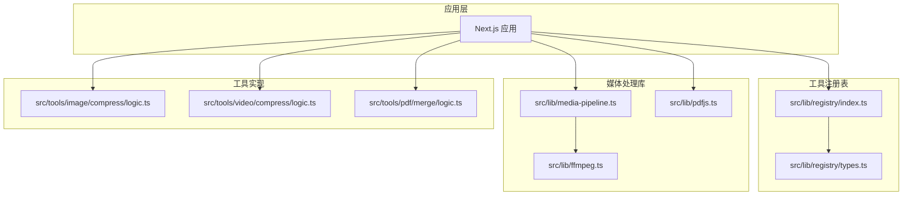
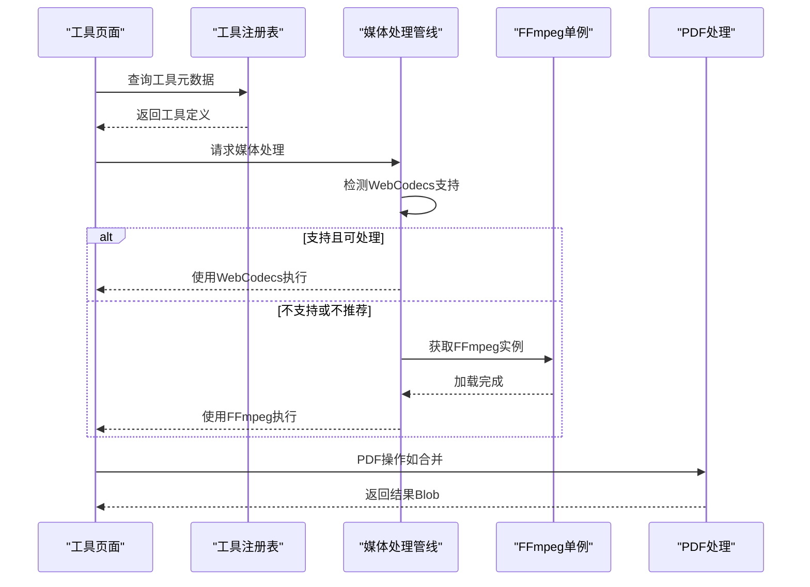
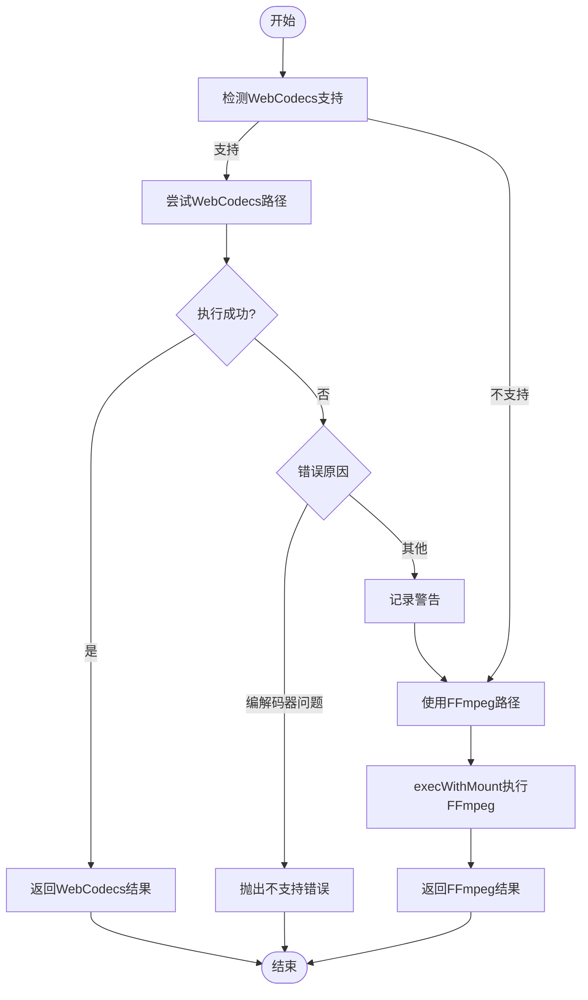
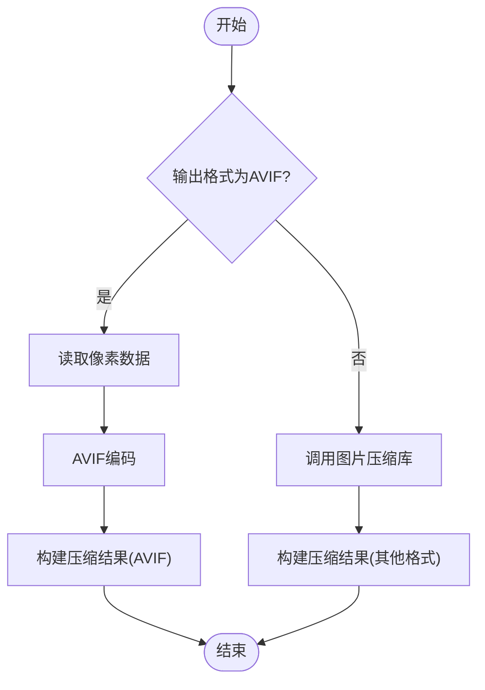
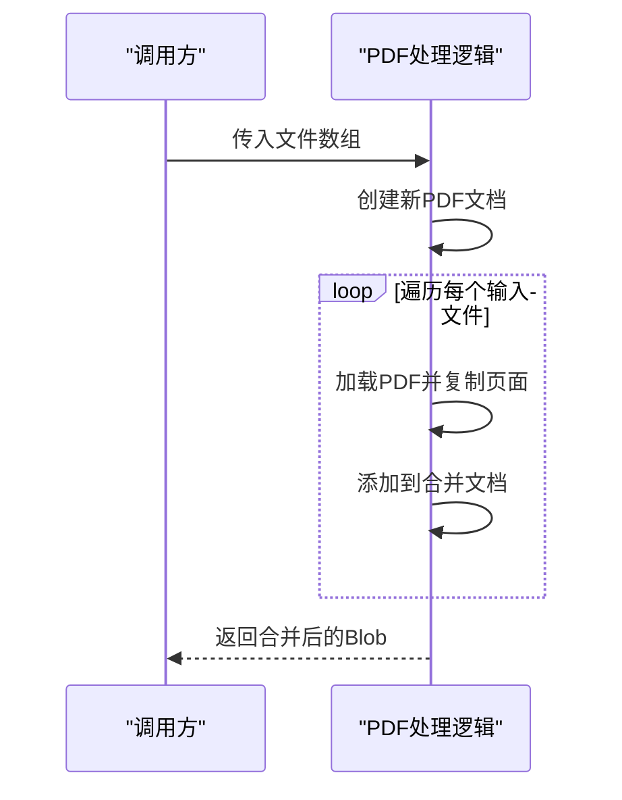
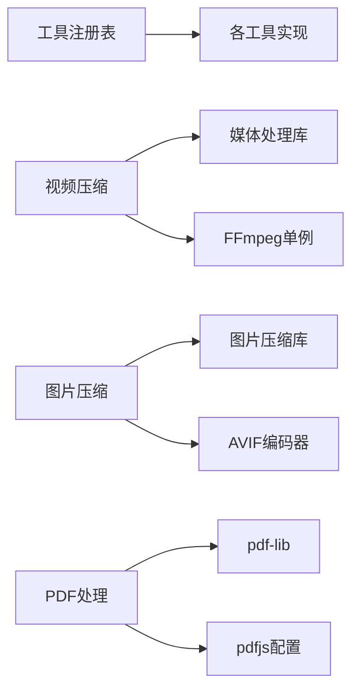

# API参考

<cite>
**本文引用的文件**
- [README.md](file://README.md)
- [package.json](file://package.json)
- [src/lib/registry/index.ts](file://src/lib/registry/index.ts)
- [src/lib/registry/types.ts](file://src/lib/registry/types.ts)
- [src/lib/media-pipeline.ts](file://src/lib/media-pipeline.ts)
- [src/lib/ffmpeg.ts](file://src/lib/ffmpeg.ts)
- [src/lib/pdfjs.ts](file://src/lib/pdfjs.ts)
- [src/tools/image/compress/logic.ts](file://src/tools/image/compress/logic.ts)
- [src/tools/video/compress/logic.ts](file://src/tools/video/compress/logic.ts)
- [src/tools/pdf/merge/logic.ts](file://src/tools/pdf/merge/logic.ts)
</cite>

## 目录
1. [简介](#简介)
2. [项目结构](#项目结构)
3. [核心组件](#核心组件)
4. [架构总览](#架构总览)
5. [详细组件分析](#详细组件分析)
6. [依赖分析](#依赖分析)
7. [性能考量](#性能考量)
8. [故障排除指南](#故障排除指南)
9. [结论](#结论)
10. [附录](#附录)

## 简介
本API参考面向PrivaDeck媒体工具箱的前端与工具层，覆盖以下能力：
- 工具注册表API：用于查询、筛选与定位工具元数据与路由信息。
- 媒体处理API：基于浏览器原生能力与FFmpeg.wasm的视频/音频处理；基于浏览器图像压缩库的图片处理；基于pdf-lib与pdfjs的PDF处理。
- 分析统计API：进度回调与错误类型，便于集成到上层UI与监控。

PrivaDeck强调“零上传、零服务器”，所有处理在浏览器端完成，确保隐私与离线可用性。

章节来源
- [README.md:1-89](file://README.md#L1-L89)

## 项目结构
项目采用Next.js App Router组织页面与工具模块，核心库位于src/lib，工具按类别划分在src/tools下。工具注册表集中管理工具元数据与路由映射。



图表来源
- [src/lib/registry/index.ts:1-164](file://src/lib/registry/index.ts#L1-L164)
- [src/lib/registry/types.ts:1-22](file://src/lib/registry/types.ts#L1-L22)
- [src/lib/media-pipeline.ts:1-105](file://src/lib/media-pipeline.ts#L1-L105)
- [src/lib/ffmpeg.ts:1-144](file://src/lib/ffmpeg.ts#L1-L144)
- [src/lib/pdfjs.ts:1-16](file://src/lib/pdfjs.ts#L1-L16)
- [src/tools/image/compress/logic.ts:1-135](file://src/tools/image/compress/logic.ts#L1-L135)
- [src/tools/video/compress/logic.ts:1-257](file://src/tools/video/compress/logic.ts#L1-L257)
- [src/tools/pdf/merge/logic.ts:1-24](file://src/tools/pdf/merge/logic.ts#L1-L24)

章节来源
- [README.md:55-78](file://README.md#L55-L78)

## 核心组件
- 工具注册表：提供工具列表、按分类/特性/路径查询工具元数据的能力。
- 媒体处理管线：统一抽象WebCodecs与FFmpeg.wasm两种路径，提供进度回调与错误类型。
- FFmpeg单例与队列：封装FFmpeg加载、进度监听、文件挂载执行与串行化。
- PDF处理：基于pdf-lib进行PDF合并等操作，pdfjs用于Worker配置。
- 图片压缩：基于browser-image-compression与AVIF编码器，提供多种预设与自定义尺寸。

章节来源
- [src/lib/registry/index.ts:135-164](file://src/lib/registry/index.ts#L135-L164)
- [src/lib/media-pipeline.ts:7-105](file://src/lib/media-pipeline.ts#L7-L105)
- [src/lib/ffmpeg.ts:10-144](file://src/lib/ffmpeg.ts#L10-L144)
- [src/lib/pdfjs.ts:3-13](file://src/lib/pdfjs.ts#L3-L13)
- [src/tools/image/compress/logic.ts:1-135](file://src/tools/image/compress/logic.ts#L1-L135)

## 架构总览
PrivaDeck采用“注册表驱动 + 媒体处理库 + 工具实现”的分层架构。工具注册表负责元数据与路由；媒体处理库负责跨浏览器能力选择与错误降级；工具实现聚焦具体业务逻辑。



图表来源
- [src/lib/registry/index.ts:135-164](file://src/lib/registry/index.ts#L135-L164)
- [src/lib/media-pipeline.ts:7-105](file://src/lib/media-pipeline.ts#L7-L105)
- [src/lib/ffmpeg.ts:10-144](file://src/lib/ffmpeg.ts#L10-L144)
- [src/lib/pdfjs.ts:3-13](file://src/lib/pdfjs.ts#L3-L13)

## 详细组件分析

### 工具注册表API
- 功能
  - 获取全部工具列表
  - 按slug与可选分类查找工具
  - 按分类筛选工具
  - 获取全部slug集合
  - 获取某分类的特色与非特色工具
- 数据模型
  - 工具定义包含slug、category、icon、featured、组件动态导入、SEO结构化数据类型、FAQ键、相关工具slug等字段。

```mermaid
classDiagram
class ToolDefinition {
+string slug
+ToolCategory category
+string icon
+boolean featured
+component()
+seo
+faq[]
+relatedSlugs[]
}
class CategoryDefinition {
+ToolCategory key
+string icon
}
class Registry {
+getAllTools() ToolDefinition[]
+getToolBySlug(slug, category?) ToolDefinition
+getToolsByCategory(category) ToolDefinition[]
+getAllSlugs() {category, slug}[]
+getFeaturedTools(category) ToolDefinition[]
+getNonFeaturedTools(category) ToolDefinition[]
}
Registry --> ToolDefinition : "返回"
ToolDefinition --> CategoryDefinition : "使用"
```

图表来源
- [src/lib/registry/types.ts:5-21](file://src/lib/registry/types.ts#L5-L21)
- [src/lib/registry/index.ts:135-164](file://src/lib/registry/index.ts#L135-L164)

章节来源
- [src/lib/registry/index.ts:135-164](file://src/lib/registry/index.ts#L135-L164)
- [src/lib/registry/types.ts:3-21](file://src/lib/registry/types.ts#L3-L21)

### 媒体处理API（视频/音频）
- 能力概览
  - 自动检测WebCodecs支持，优先使用硬件加速的WebCodecs路径；对不支持或不推荐的场景回退至FFmpeg.wasm。
  - 提供进度回调与错误类型，便于UI反馈与降级策略。
- 关键类型与错误
  - 进度回调类型：进度百分比。
  - 错误类型：WebCodecsFallbackError（指示是否因视频编解码器问题导致回退）、UnsupportedVideoCodecError（终端错误，不建议回退）。
- 视频压缩流程
  - 若WebCodecs可用：构造输入源、输出目标与转换参数，执行并返回Blob。
  - 若不可用：通过FFmpeg执行命令行参数，返回MP4结果。
- 参数要点
  - CRF、编码预设、分辨率、帧率、音频码率、最大码率上限。
  - 解析码率字符串（支持k/M）。



图表来源
- [src/lib/media-pipeline.ts:7-105](file://src/lib/media-pipeline.ts#L7-L105)
- [src/tools/video/compress/logic.ts:85-110](file://src/tools/video/compress/logic.ts#L85-L110)
- [src/tools/video/compress/logic.ts:203-256](file://src/tools/video/compress/logic.ts#L203-L256)
- [src/lib/ffmpeg.ts:99-144](file://src/lib/ffmpeg.ts#L99-L144)

章节来源
- [src/lib/media-pipeline.ts:16-91](file://src/lib/media-pipeline.ts#L16-L91)
- [src/tools/video/compress/logic.ts:21-52](file://src/tools/video/compress/logic.ts#L21-L52)
- [src/tools/video/compress/logic.ts:68-83](file://src/tools/video/compress/logic.ts#L68-L83)
- [src/tools/video/compress/logic.ts:85-110](file://src/tools/video/compress/logic.ts#L85-L110)
- [src/tools/video/compress/logic.ts:112-201](file://src/tools/video/compress/logic.ts#L112-L201)
- [src/tools/video/compress/logic.ts:203-256](file://src/tools/video/compress/logic.ts#L203-L256)
- [src/lib/ffmpeg.ts:75-82](file://src/lib/ffmpeg.ts#L75-L82)
- [src/lib/ffmpeg.ts:99-144](file://src/lib/ffmpeg.ts#L99-L144)

### 图片压缩API
- 能力概览
  - 基于browser-image-compression进行JPEG/PNG/WebP/AVIF等格式压缩，支持EXIF保留与自定义尺寸。
  - 提供多种预设（高质量/均衡/小文件/自定义），并支持AVIF专用路径。
- 关键类型
  - 输出格式枚举：original与常见图片MIME类型。
  - 预设键：high-quality/balanced/small-file/custom。
  - 压缩选项：质量、最大大小、最大边长、输出格式、是否保留EXIF、可选自定义宽高。
  - 压缩结果：原始文件、压缩后Blob、原始/压缩大小、节省百分比、输出格式。
- 流程
  - 若目标为AVIF：读取像素数据，调用AVIF编码器生成Blob。
  - 否则：调用图片压缩库，根据输出格式与尺寸参数生成结果。
  - 计算节省百分比并返回结果对象。



图表来源
- [src/tools/image/compress/logic.ts:36-81](file://src/tools/image/compress/logic.ts#L36-L81)
- [src/tools/image/compress/logic.ts:83-123](file://src/tools/image/compress/logic.ts#L83-L123)

章节来源
- [src/tools/image/compress/logic.ts:3-24](file://src/tools/image/compress/logic.ts#L3-L24)
- [src/tools/image/compress/logic.ts:26-34](file://src/tools/image/compress/logic.ts#L26-L34)
- [src/tools/image/compress/logic.ts:83-123](file://src/tools/image/compress/logic.ts#L83-L123)
- [src/tools/image/compress/logic.ts:127-135](file://src/tools/image/compress/logic.ts#L127-L135)

### PDF处理API
- 能力概览
  - 基于pdf-lib合并多个PDF文件为一个PDF。
  - 提供文件大小格式化辅助函数。
- 流程
  - 逐个加载输入PDF，复制页面并加入新文档，保存为Blob。



图表来源
- [src/tools/pdf/merge/logic.ts:3-17](file://src/tools/pdf/merge/logic.ts#L3-L17)

章节来源
- [src/tools/pdf/merge/logic.ts:1-24](file://src/tools/pdf/merge/logic.ts#L1-L24)
- [src/lib/pdfjs.ts:3-13](file://src/lib/pdfjs.ts#L3-L13)

## 依赖分析
- 外部依赖
  - FFmpeg.wasm：视频/音频处理核心，提供浏览器端无服务器处理能力。
  - pdf-lib/pdfjs-dist：PDF文档操作与Worker配置。
  - browser-image-compression：图片压缩。
  - mediabunny：WebCodecs媒体处理，作为FFmpeg的硬件加速替代。
- 内部依赖关系
  - 工具注册表依赖各工具目录下的index导出。
  - 视频压缩同时依赖媒体处理库与FFmpeg单例。
  - 图片压缩依赖浏览器图片压缩库与AVIF编码器。
  - PDF处理依赖pdf-lib与pdfjs配置。



图表来源
- [src/lib/registry/index.ts:4-63](file://src/lib/registry/index.ts#L4-L63)
- [src/lib/media-pipeline.ts:1-105](file://src/lib/media-pipeline.ts#L1-L105)
- [src/lib/ffmpeg.ts:1-144](file://src/lib/ffmpeg.ts#L1-L144)
- [src/tools/image/compress/logic.ts:1](file://src/tools/image/compress/logic.ts#L1)
- [src/tools/pdf/merge/logic.ts:1](file://src/tools/pdf/merge/logic.ts#L1)

章节来源
- [package.json:11-32](file://package.json#L11-L32)

## 性能考量
- WebCodecs优先：在支持的浏览器与编解码器条件下，优先使用WebCodecs以获得硬件加速与更低内存占用。
- FFmpeg串行化：通过Promise队列串行执行FFmpeg任务，避免并发冲突与内存峰值叠加。
- WORKERFS挂载：使用WORKERFS直接挂载输入文件，避免两次内存拷贝，降低峰值内存。
- 进度回调：统一的进度回调接口，便于UI及时反馈处理状态。
- 码率与分辨率：提供CRF与分辨率映射，结合最大码率上限，平衡质量与体积。

章节来源
- [src/lib/media-pipeline.ts:7-14](file://src/lib/media-pipeline.ts#L7-L14)
- [src/lib/media-pipeline.ts:19-26](file://src/lib/media-pipeline.ts#L19-L26)
- [src/lib/ffmpeg.ts:75-82](file://src/lib/ffmpeg.ts#L75-L82)
- [src/lib/ffmpeg.ts:99-144](file://src/lib/ffmpeg.ts#L99-L144)
- [src/tools/video/compress/logic.ts:68-83](file://src/tools/video/compress/logic.ts#L68-L83)
- [src/tools/video/compress/logic.ts:241-247](file://src/tools/video/compress/logic.ts#L241-L247)

## 故障排除指南
- 常见错误类型
  - WebCodecsFallbackError：当编解码器不被WebCodecs支持或转换无效时触发，可能需要回退至FFmpeg。
  - UnsupportedVideoCodecError：当视频使用不受支持的编解码器（如H.265/HEVC、VP9、AV1）时抛出，不建议回退至FFmpeg。
- 排查步骤
  - 检查浏览器是否支持WebCodecs与硬件加速扩展（Windows + Chromium可提示安装HEVC扩展）。
  - 对于WebCodecs回退：确认音频/视频编解码器是否受支持；必要时改用FFmpeg路径。
  - 对于FFmpeg路径：确认输入文件格式与参数组合是否合理；检查磁盘空间与内存占用。
- 建议
  - 优先使用WebCodecs；若失败再回退FFmpeg。
  - 对大文件处理设置合理的最大码率与分辨率，避免内存溢出。

章节来源
- [src/lib/media-pipeline.ts:32-53](file://src/lib/media-pipeline.ts#L32-L53)
- [src/lib/media-pipeline.ts:98-104](file://src/lib/media-pipeline.ts#L98-L104)
- [src/tools/video/compress/logic.ts:92-110](file://src/tools/video/compress/logic.ts#L92-L110)
- [src/tools/video/compress/logic.ts:96-107](file://src/tools/video/compress/logic.ts#L96-L107)

## 结论
本API参考梳理了PrivaDeck的工具注册表、媒体处理与PDF处理的核心接口与实现要点。通过WebCodecs优先与FFmpeg回退的策略，结合严格的串行化与进度回调机制，既保证了性能也兼顾了稳定性。实际使用中应关注编解码器支持情况与资源限制，并根据场景选择合适的参数与路径。

## 附录

### 版本兼容性与迁移指南
- WebCodecs与FFmpeg.wasm
  - 当前实现会自动检测WebCodecs支持并优先使用；对于不受支持的编解码器，将抛出UnsupportedVideoCodecError，不建议回退至FFmpeg。
  - 若未来浏览器对某些编解码器支持改善，可调整回退策略。
- FFmpeg版本
  - 依赖@ffmpeg/ffmpeg与@ffmpeg/util，当前版本号在package.json中声明；升级时需验证API兼容性与性能表现。
- 迁移建议
  - 新增工具时遵循现有工具目录结构与导出约定，确保注册表可发现。
  - 对媒体处理逻辑，优先使用WebCodecs路径，仅在必要时回退FFmpeg。

章节来源
- [package.json:11-32](file://package.json#L11-L32)
- [src/lib/media-pipeline.ts:7-14](file://src/lib/media-pipeline.ts#L7-L14)
- [src/tools/video/compress/logic.ts:92-110](file://src/tools/video/compress/logic.ts#L92-L110)

### 安全与限制
- 零上传、零服务器：所有处理在浏览器端完成，文件不会离开设备。
- 资源限制：注意内存与CPU占用，避免对超大文件进行高分辨率/高码率处理。
- 并发控制：FFmpeg通过串行队列执行，避免并发冲突；WebCodecs路径由浏览器调度。
- 权限与隐私：无网络请求，不收集用户数据，符合隐私优先的设计原则。

章节来源
- [README.md:9-14](file://README.md#L9-L14)
- [src/lib/ffmpeg.ts:75-82](file://src/lib/ffmpeg.ts#L75-L82)