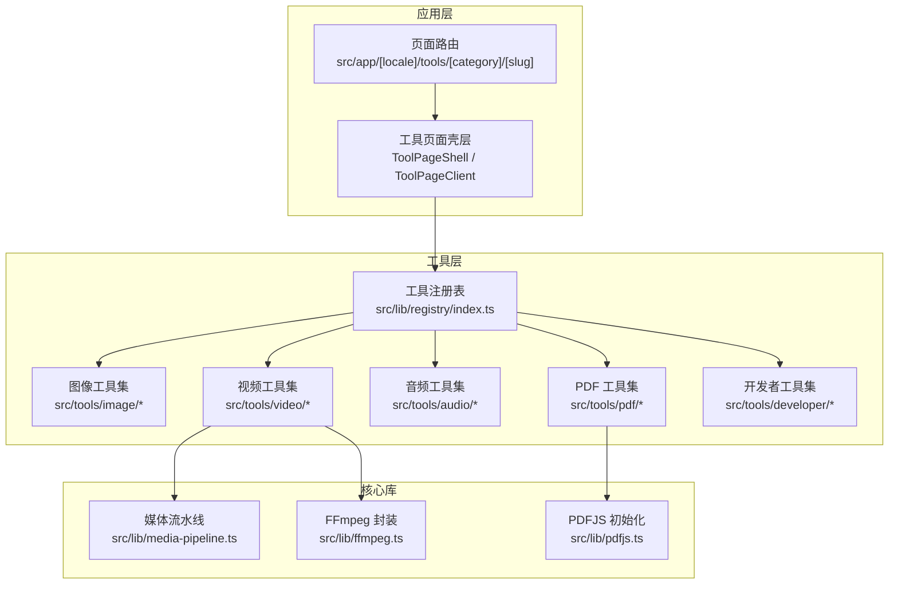
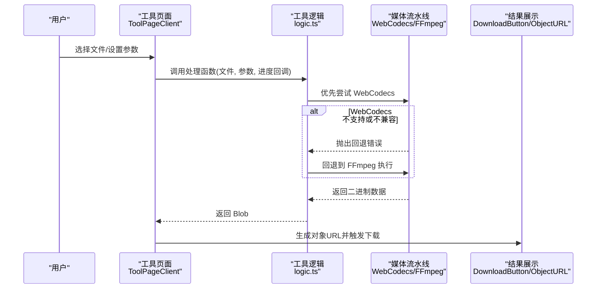
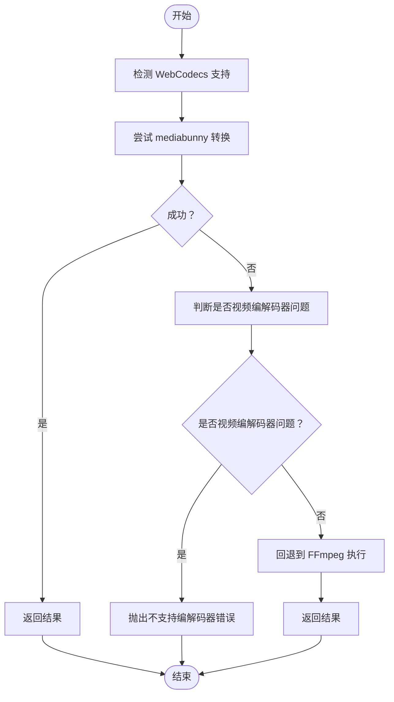
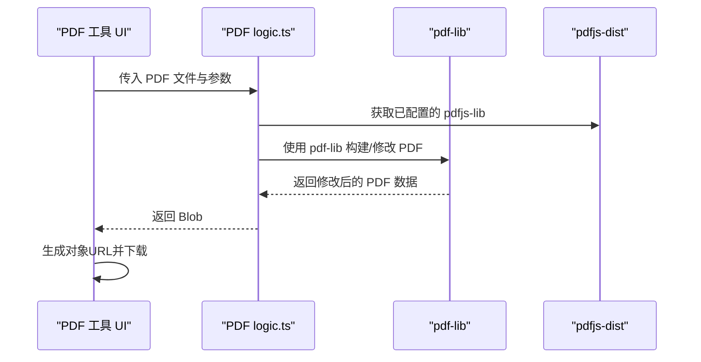
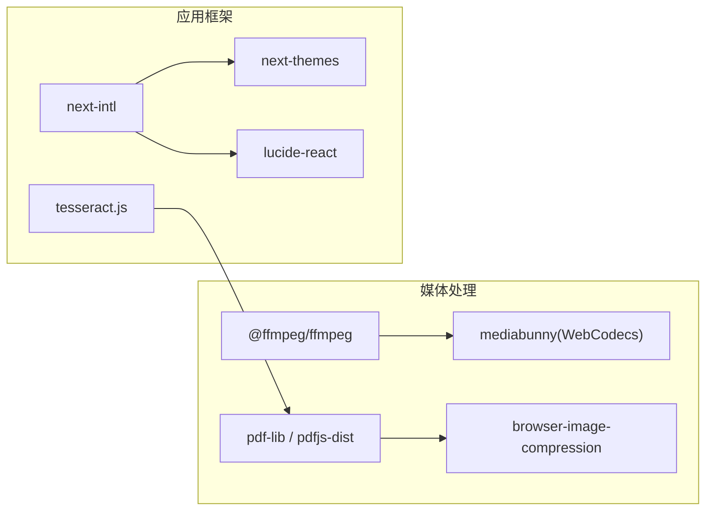
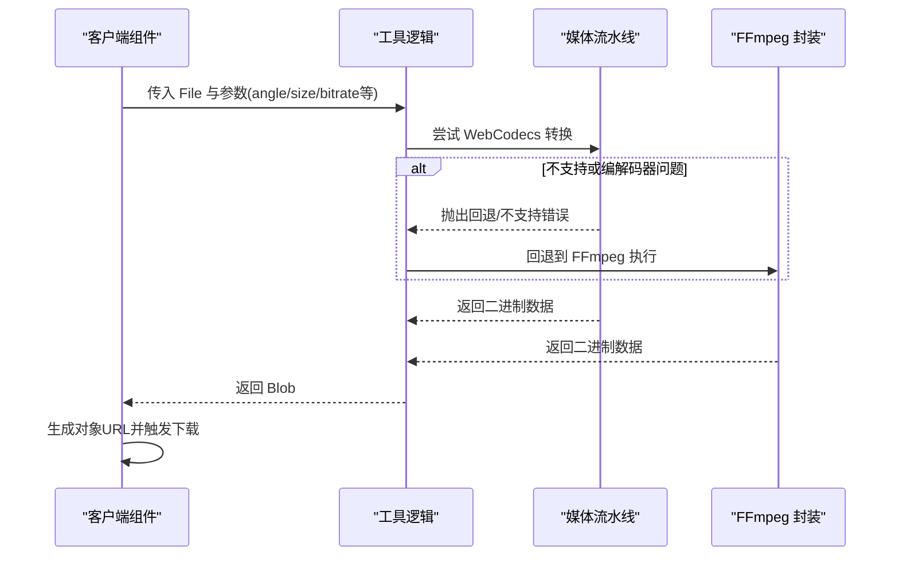

# 工具API

<cite>
**本文引用的文件**
- [README.md](file://README.md)
- [package.json](file://package.json)
- [src/lib/registry/index.ts](file://src/lib/registry/index.ts)
- [src/app/[locale]/tools/[category]/[slug]/page.tsx](file://src/app/[locale]/tools/[category]/[slug]/page.tsx)
- [src/app/[locale]/tools/[category]/[slug]/ToolPageClient.tsx](file://src/app/[locale]/tools/[category]/[slug]/ToolPageClient.tsx)
- [src/lib/media-pipeline.ts](file://src/lib/media-pipeline.ts)
- [src/lib/ffmpeg.ts](file://src/lib/ffmpeg.ts)
- [src/lib/pdfjs.ts](file://src/lib/pdfjs.ts)
- [src/tools/video/rotate/logic.ts](file://src/tools/video/rotate/logic.ts)
- [src/tools/video/resize/logic.ts](file://src/tools/video/resize/logic.ts)
</cite>

## 目录
1. [简介](#简介)
2. [项目结构](#项目结构)
3. [核心组件](#核心组件)
4. [架构总览](#架构总览)
5. [详细组件分析](#详细组件分析)
6. [依赖分析](#依赖分析)
7. [性能考虑](#性能考虑)
8. [故障排除指南](#故障排除指南)
9. [结论](#结论)
10. [附录](#附录)

## 简介
本文件为 PrivaDeck 媒体工具箱的工具API参考文档，聚焦于以下媒体处理工具类别及其统一的API设计与实现模式：
- 图像处理：格式转换、压缩、裁剪、去 EXIF、拼图、加水印等
- 视频处理：剪辑、压缩、转 GIF、格式转换、静音、旋转、缩放等
- PDF 操作：合并、拆分、压缩、转图片、提取文本、电子签名等
- 开发者工具：JSON 格式化、Base64、正则测试、OCR、哈希生成等

PrivaDeck 的核心理念是“零上传、零服务器”，所有处理均在浏览器端完成，使用 FFmpeg.wasm、pdf-lib + pdfjs-dist、browser-image-compression 等技术栈实现。

## 项目结构
PrivaDeck 采用 Next.js App Router + 静态生成（SSG）的前端架构，工具按功能分类组织在 src/tools 下，通过工具注册表集中管理，页面层负责路由与国际化，核心库提供媒体处理能力。

图表来源
- [src/app/[locale]/tools/[category]/[slug]/page.tsx](file://src/app/[locale]/tools/[category]/[slug]/page.tsx#L1-L109)
- [src/app/[locale]/tools/[category]/[slug]/ToolPageClient.tsx](file://src/app/[locale]/tools/[category]/[slug]/ToolPageClient.tsx#L1-L59)
- [src/lib/registry/index.ts:1-164](file://src/lib/registry/index.ts#L1-L164)
- [src/lib/media-pipeline.ts:1-105](file://src/lib/media-pipeline.ts#L1-L105)
- [src/lib/ffmpeg.ts:1-144](file://src/lib/ffmpeg.ts#L1-L144)
- [src/lib/pdfjs.ts:1-16](file://src/lib/pdfjs.ts#L1-L16)

章节来源
- [README.md:55-78](file://README.md#L55-L78)
- [package.json:11-32](file://package.json#L11-L32)

## 核心组件
- 工具注册表：集中声明与导出所有工具元数据，提供按分类、slug 查询与特性筛选能力。
- 媒体流水线（WebCodecs）：基于 mediabunny 的硬件加速视频/音频处理，自动回退至 FFmpeg。
- FFmpeg 封装：单例懒加载、进度事件绑定、队列化执行、WORKERFS 挂载避免内存拷贝。
- PDFJS 初始化：延迟配置 worker 路径，确保 PDF 处理运行时环境就绪。
- 页面路由与国际化：静态生成工具页，按 locale + category + slug 组合路由，动态注入 SEO 结构化数据。

章节来源
- [src/lib/registry/index.ts:66-133](file://src/lib/registry/index.ts#L66-L133)
- [src/lib/media-pipeline.ts:7-14](file://src/lib/media-pipeline.ts#L7-L14)
- [src/lib/ffmpeg.ts:10-39](file://src/lib/ffmpeg.ts#L10-L39)
- [src/lib/pdfjs.ts:3-13](file://src/lib/pdfjs.ts#L3-L13)
- [src/app/[locale]/tools/[category]/[slug]/page.tsx](file://src/app/[locale]/tools/[category]/[slug]/page.tsx#L13-L31)

## 架构总览
工具API的统一设计模式：
- 统一入口：每个工具在注册表中以 ToolDefinition 形式暴露元数据与组件路径。
- 统一处理接口：工具逻辑（logic.ts）提供纯函数式处理方法，接收 File/配置参数，返回 Blob 或二进制数据。
- 统一参数验证：在逻辑层进行参数校验与预处理，必要时抛出自定义错误类型。
- 统一结果处理：客户端组件负责状态管理（文件选择、进度、错误、下载），并通过对象URL展示结果。

图表来源
- [src/app/[locale]/tools/[category]/[slug]/ToolPageClient.tsx](file://src/app/[locale]/tools/[category]/[slug]/ToolPageClient.tsx#L29-L58)
- [src/tools/video/rotate/logic.ts:12-35](file://src/tools/video/rotate/logic.ts#L12-L35)
- [src/lib/media-pipeline.ts:59-91](file://src/lib/media-pipeline.ts#L59-L91)
- [src/lib/ffmpeg.ts:99-143](file://src/lib/ffmpeg.ts#L99-L143)

## 详细组件分析

### 图像处理工具API
- 已注册工具（节选）：格式转换、压缩、裁剪、去 EXIF、拼图、加水印、翻转、灰度、像素化、加边框、圆形裁剪、SVG 转 PNG、HEIC 转换、组合、分割、拼贴等。
- 统一模式：每个工具的 logic.ts 提供纯函数，接收 File 与配置参数，返回 Promise<Blob>；UI 组件负责交互与结果展示。
- 典型流程：参数校验 → 选择处理引擎（优先 WebCodecs，失败回退 FFmpeg）→ 输出 Blob → 对象URL下载。

章节来源
- [src/lib/registry/index.ts:67-84](file://src/lib/registry/index.ts#L67-L84)
- [src/lib/media-pipeline.ts:16-53](file://src/lib/media-pipeline.ts#L16-L53)
- [src/lib/ffmpeg.ts:99-143](file://src/lib/ffmpeg.ts#L99-L143)

### 视频处理工具API
- 已注册工具（节选）：剪辑、压缩、转 GIF、格式转换、静音、旋转、缩放、信息提取等。
- 统一模式：logic.ts 接收 File、参数（如角度、尺寸、比特率等），返回 Promise<Blob>；支持进度回调。
- 错误处理：当检测到不受支持的视频编解码器（如 H.265/HEVC、VP9、AV1）时，抛出“不支持编解码器”错误，不再回退至 FFmpeg。
- 性能优化：优先使用 WebCodecs；对 FFmpeg 使用 WORKERFS 挂载避免内存拷贝；串行队列保证单线程执行一致性。

图表来源
- [src/tools/video/rotate/logic.ts:12-35](file://src/tools/video/rotate/logic.ts#L12-L35)
- [src/tools/video/resize/logic.ts:12-35](file://src/tools/video/resize/logic.ts#L12-L35)
- [src/lib/media-pipeline.ts:28-53](file://src/lib/media-pipeline.ts#L28-L53)

章节来源
- [src/lib/registry/index.ts:85-94](file://src/lib/registry/index.ts#L85-L94)
- [src/lib/media-pipeline.ts:59-91](file://src/lib/media-pipeline.ts#L59-L91)
- [src/lib/ffmpeg.ts:99-143](file://src/lib/ffmpeg.ts#L99-L143)
- [src/tools/video/rotate/logic.ts:1-46](file://src/tools/video/rotate/logic.ts#L1-L46)
- [src/tools/video/resize/logic.ts:1-36](file://src/tools/video/resize/logic.ts#L1-L36)

### PDF 操作工具API
- 已注册工具（节选）：合并、拆分、压缩、转图片、删除页、旋转、添加页码、提取文本、重排、裁剪、添加水印、图片转 PDF、提取图片、电子签名等。
- 统一模式：logic.ts 使用 pdf-lib 与 pdfjs-dist 进行处理，返回 Blob；页面层负责预览与下载。
- 初始化：首次使用时配置 pdfjs-dist 的 worker 路径，避免重复初始化。

图表来源
- [src/lib/pdfjs.ts:3-13](file://src/lib/pdfjs.ts#L3-L13)
- [src/lib/registry/index.ts:100-114](file://src/lib/registry/index.ts#L100-L114)

章节来源
- [src/lib/registry/index.ts:100-114](file://src/lib/registry/index.ts#L100-L114)
- [src/lib/pdfjs.ts:1-16](file://src/lib/pdfjs.ts#L1-L16)

### 开发者工具API
- 已注册工具（节选）：JSON 格式化、Base64 编解码、哈希生成、URL 编解码、CSV/JSON 转换、时间戳、颜色转换、正则测试、Markdown 预览、文本差异、大小写转换、YAML/JSON、OCR、词数统计、归档等。
- 统一模式：logic.ts 为纯函数，处理字符串/文本/二进制数据，返回字符串或 Blob；UI 组件负责输入输出与复制下载。

章节来源
- [src/lib/registry/index.ts:115-133](file://src/lib/registry/index.ts#L115-L133)

## 依赖分析
- 媒体处理依赖
  - FFmpeg.wasm：用于视频/音频处理，提供单例加载、进度事件、队列化执行与 WORKERFS 挂载。
  - mediabunny：提供基于 WebCodecs 的硬件加速视频/音频转换，作为首选方案。
  - pdf-lib + pdfjs-dist：用于 PDF 文档的读取、修改与渲染。
  - browser-image-compression：用于图片压缩与格式转换。
- 应用依赖
  - next-intl：多语言支持与静态路由生成。
  - next-themes：主题切换。
  - lucide-react：图标。
  - tesseract.js：OCR 文字识别。

图表来源
- [package.json:11-31](file://package.json#L11-L31)
- [src/lib/ffmpeg.ts:1-39](file://src/lib/ffmpeg.ts#L1-L39)
- [src/lib/media-pipeline.ts:1-5](file://src/lib/media-pipeline.ts#L1-L5)
- [src/lib/pdfjs.ts:1-16](file://src/lib/pdfjs.ts#L1-L16)

章节来源
- [package.json:11-31](file://package.json#L11-L31)

## 性能考虑
- WebCodecs 优先：在支持的浏览器上优先使用 mediabunny 的硬件加速转换，显著降低 CPU 占用与处理时间。
- FFmpeg 队列化：通过 Promise 队列串行执行，避免并发挂载点冲突与内存峰值。
- WORKERFS 挂载：直接从 File 对象读取，避免完整内存拷贝，减少峰值内存占用。
- 预取与缓存：工具页在需要时预取 FFmpeg 核心资源，提升首次加载体验。
- 图片压缩：使用 browser-image-compression，支持质量与尺寸控制，兼顾体积与画质。

章节来源
- [src/lib/media-pipeline.ts:7-14](file://src/lib/media-pipeline.ts#L7-L14)
- [src/lib/ffmpeg.ts:75-82](file://src/lib/ffmpeg.ts#L75-L82)
- [src/lib/ffmpeg.ts:117-125](file://src/lib/ffmpeg.ts#L117-L125)
- [src/app/[locale]/tools/[category]/[slug]/page.tsx](file://src/app/[locale]/tools/[category]/[slug]/page.tsx#L94-L99)

## 故障排除指南
- WebCodecs 回退错误
  - 现象：转换过程中抛出回退错误。
  - 处理：捕获错误后回退到 FFmpeg；若为视频编解码器问题（如 H.265/HEVC、VP9、AV1），不再回退，直接提示不支持。
- 不支持的视频编解码器
  - 现象：抛出“视频编解码器不受支持”错误。
  - 处理：提示用户更换视频格式或安装浏览器扩展（如 Windows + Chromium 的 HEVC 扩展）。
- FFmpeg 加载失败
  - 现象：FFmpeg 核心资源加载失败。
  - 处理：重试加载、检查 CDN 可达性、降级到仅支持的工具。
- 进度事件异常
  - 现象：进度回调数值异常（超出 0-1 范围）。
  - 处理：在封装层进行范围校验与四舍五入，确保 UI 显示稳定。

章节来源
- [src/lib/media-pipeline.ts:28-53](file://src/lib/media-pipeline.ts#L28-L53)
- [src/lib/media-pipeline.ts:59-91](file://src/lib/media-pipeline.ts#L59-L91)
- [src/lib/ffmpeg.ts:20-28](file://src/lib/ffmpeg.ts#L20-L28)
- [src/lib/ffmpeg.ts:51-57](file://src/lib/ffmpeg.ts#L51-L57)

## 结论
PrivaDeck 通过统一的工具注册表与逻辑层设计，实现了跨类别的媒体处理 API 一致性：参数验证、结果处理、错误处理与性能优化均在核心库中抽象统一。开发者只需关注各自工具的 logic.ts 实现，即可快速扩展新的工具并保持一致的用户体验。

## 附录

### API 调用示例（客户端）
以下为通用调用流程示例（以视频旋转为例），具体参数请参考各工具的 logic.ts 与 UI 组件：

图表来源
- [src/tools/video/rotate/logic.ts:12-35](file://src/tools/video/rotate/logic.ts#L12-L35)
- [src/lib/media-pipeline.ts:59-91](file://src/lib/media-pipeline.ts#L59-L91)
- [src/lib/ffmpeg.ts:99-143](file://src/lib/ffmpeg.ts#L99-L143)

### 配置选项与自定义参数
- 视频工具
  - 视频旋转：支持 90°、180°、270° 角度。
  - 视频缩放：内置 720p/480p/360p 预设，支持自定义宽度。
  - 视频压缩：支持比特率字符串解析（如 "192k"、"1.5M"）。
- 图像工具
  - 压缩：支持质量与尺寸控制（由 browser-image-compression 提供）。
  - 格式转换：支持常见图片格式互转。
- PDF 工具
  - 压缩：基于 pdf-lib 的无损压缩策略。
  - 提取文本/图片：基于 pdfjs-dist 的页面解析。
- 开发者工具
  - JSON 格式化：缩进与换行控制。
  - Base64：编码/解码双向转换。
  - OCR：基于 tesseract.js 的文字识别（需网络 worker 资源）。

章节来源
- [src/tools/video/rotate/logic.ts:4-10](file://src/tools/video/rotate/logic.ts#L4-L10)
- [src/tools/video/resize/logic.ts:4-10](file://src/tools/video/resize/logic.ts#L4-L10)
- [src/lib/media-pipeline.ts:21-26](file://src/lib/media-pipeline.ts#L21-L26)
- [src/lib/pdfjs.ts:3-13](file://src/lib/pdfjs.ts#L3-L13)
- [package.json](file://package.json#L31)