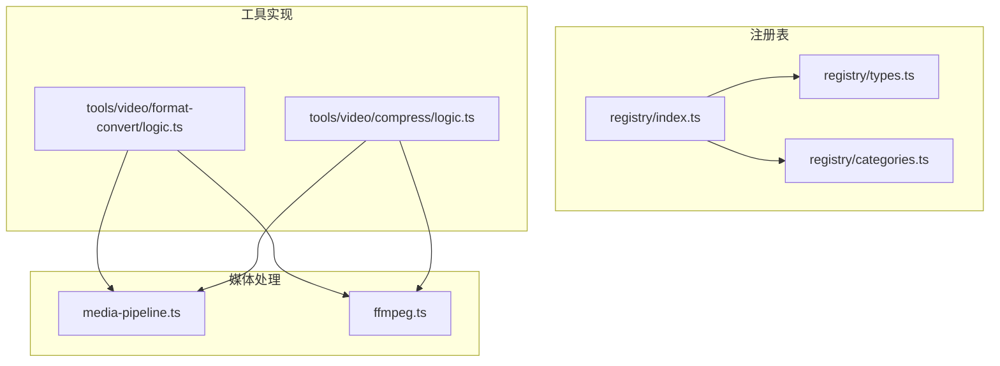
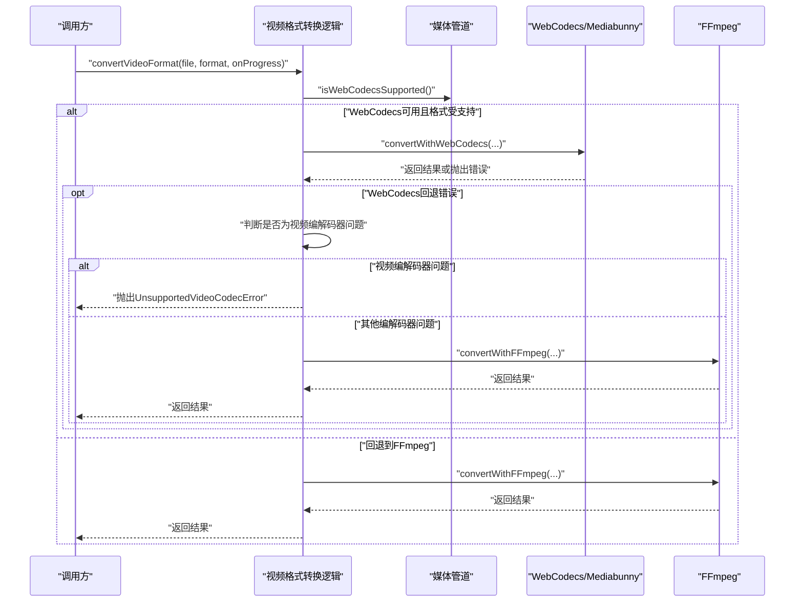
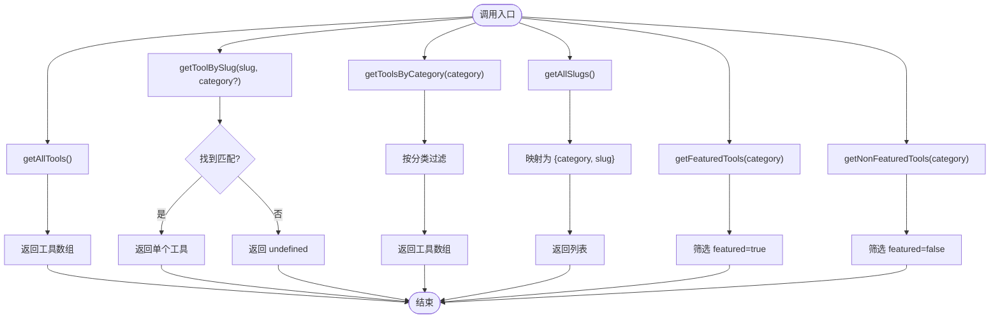
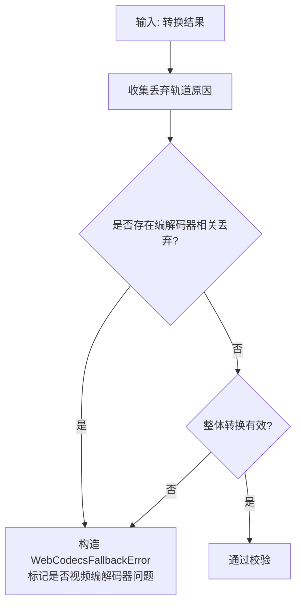
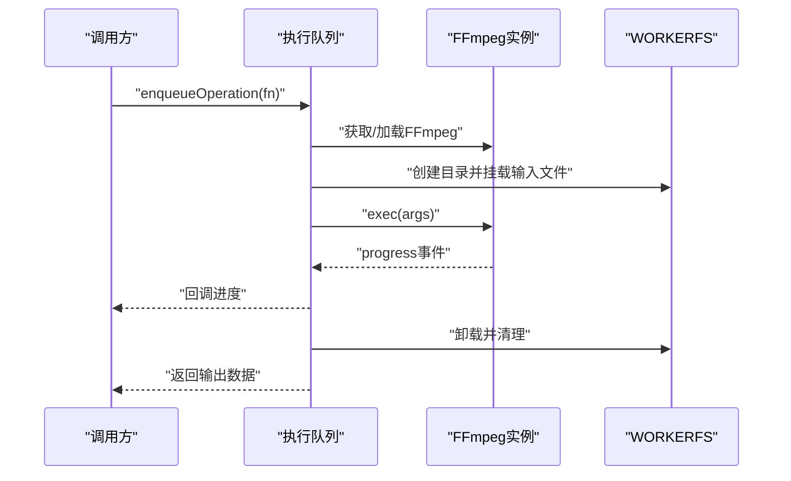
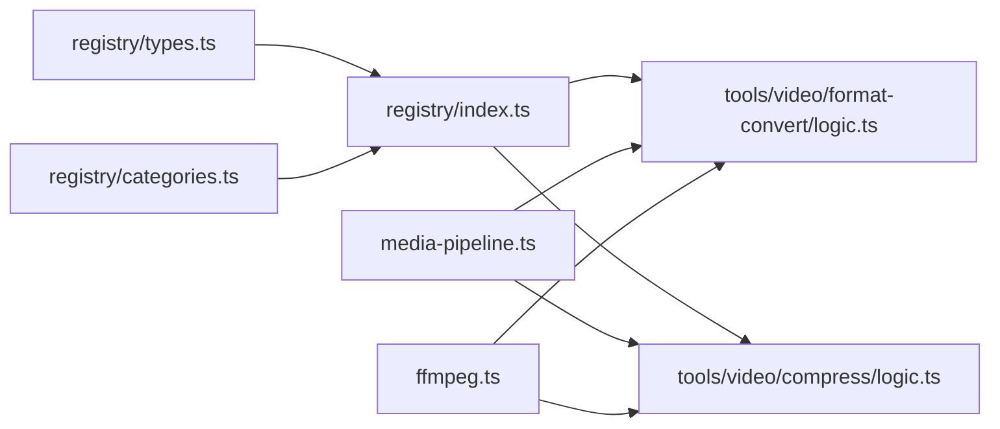

# 核心API

<cite>
**本文档引用的文件**
- [src/lib/registry/index.ts](file://src/lib/registry/index.ts)
- [src/lib/registry/types.ts](file://src/lib/registry/types.ts)
- [src/lib/registry/categories.ts](file://src/lib/registry/categories.ts)
- [src/lib/media-pipeline.ts](file://src/lib/media-pipeline.ts)
- [src/lib/ffmpeg.ts](file://src/lib/ffmpeg.ts)
- [src/tools/video/format-convert/logic.ts](file://src/tools/video/format-convert/logic.ts)
- [src/tools/video/compress/logic.ts](file://src/tools/video/compress/logic.ts)
- [src/lib/i18n/toolNavData.ts](file://src/lib/i18n/toolNavData.ts)
- [README.md](file://README.md)
- [package.json](file://package.json)
</cite>

## 目录
1. [简介](#简介)
2. [项目结构](#项目结构)
3. [核心组件](#核心组件)
4. [架构总览](#架构总览)
5. [详细组件分析](#详细组件分析)
6. [依赖关系分析](#依赖关系分析)
7. [性能考量](#性能考量)
8. [故障排查指南](#故障排查指南)
9. [结论](#结论)
10. [附录](#附录)

## 简介
本文件为 PrivaDeck 媒体工具箱的核心API参考文档，覆盖以下主题：
- 工具注册表API：getAllTools()、getToolBySlug()、getToolsByCategory()、getAllSlugs()、getFeaturedTools()、getNonFeaturedTools() 的完整接口规范与使用示例路径
- 媒体处理管道API：WebCodecs 引擎与 FFmpeg 引擎的选择机制、初始化流程与配置选项
- 工具定义类型系统：ToolDefinition 接口、ToolCategory 枚举与所有工具元数据字段说明
- 版本兼容性与扩展性：工具注册表扩展方式与自定义工具集成方法

PrivaDeck 是一个浏览器端多媒体工具箱，所有处理均在本地完成，不上传文件，支持多语言与 PWA 离线使用。

**章节来源**
- [README.md: 1-89:1-89](file://README.md#L1-L89)

## 项目结构
核心API位于 src/lib 目录下，工具注册表在 src/lib/registry，媒体处理逻辑在 src/lib/media-pipeline.ts 与 src/lib/ffmpeg.ts，具体工具的业务逻辑在 src/tools 下按类别组织。



**图表来源**
- [src/lib/registry/index.ts: 1-164:1-164](file://src/lib/registry/index.ts#L1-L164)
- [src/lib/registry/types.ts: 1-22:1-22](file://src/lib/registry/types.ts#L1-L22)
- [src/lib/registry/categories.ts: 1-10:1-10](file://src/lib/registry/categories.ts#L1-L10)
- [src/lib/media-pipeline.ts: 1-105:1-105](file://src/lib/media-pipeline.ts#L1-L105)
- [src/lib/ffmpeg.ts: 1-144:1-144](file://src/lib/ffmpeg.ts#L1-L144)
- [src/tools/video/format-convert/logic.ts: 1-134:1-134](file://src/tools/video/format-convert/logic.ts#L1-L134)
- [src/tools/video/compress/logic.ts: 1-170:1-170](file://src/tools/video/compress/logic.ts#L1-L170)

**章节来源**
- [README.md: 55-78:55-78](file://README.md#L55-L78)

## 核心组件
本节概述工具注册表与媒体处理两大核心模块的职责与交互。

- 工具注册表：集中管理工具元数据，提供查询与分类能力
- 媒体处理管道：根据浏览器能力自动选择 WebCodecs 或 FFmpeg，并提供统一的错误与进度回调

**章节来源**
- [src/lib/registry/index.ts: 135-164:135-164](file://src/lib/registry/index.ts#L135-L164)
- [src/lib/media-pipeline.ts: 7-14:7-14](file://src/lib/media-pipeline.ts#L7-L14)
- [src/lib/ffmpeg.ts: 10-39:10-39](file://src/lib/ffmpeg.ts#L10-L39)

## 架构总览
媒体处理选择机制遵循“优先 WebCodecs，必要时回退 FFmpeg”的策略。WebCodecs 支持的格式优先使用硬件加速；对于不受支持的编解码器或特定场景，抛出专用错误以避免低效回退。



**图表来源**
- [src/tools/video/format-convert/logic.ts: 32-56:32-56](file://src/tools/video/format-convert/logic.ts#L32-L56)
- [src/lib/media-pipeline.ts: 7-14:7-14](file://src/lib/media-pipeline.ts#L7-L14)
- [src/lib/media-pipeline.ts: 32-53:32-53](file://src/lib/media-pipeline.ts#L32-L53)
- [src/lib/media-pipeline.ts: 59-91:59-91](file://src/lib/media-pipeline.ts#L59-L91)
- [src/lib/ffmpeg.ts: 99-143:99-143](file://src/lib/ffmpeg.ts#L99-L143)

## 详细组件分析

### 工具注册表API
工具注册表负责集中管理工具元数据，提供多种查询方法，便于导航、SEO 与前端渲染。

- getAllTools(): 返回所有工具的只读数组
- getToolBySlug(slug, category?): 按 slug 查询工具，可选限定分类
- getToolsByCategory(category): 按分类过滤工具
- getAllSlugs(): 返回所有工具的分类与 slug 列表
- getFeaturedTools(category): 获取指定分类的精选工具
- getNonFeaturedTools(category): 获取指定分类的非精选工具



**图表来源**
- [src/lib/registry/index.ts: 135-164:135-164](file://src/lib/registry/index.ts#L135-L164)

**章节来源**
- [src/lib/registry/index.ts: 135-164:135-164](file://src/lib/registry/index.ts#L135-L164)
- [src/lib/i18n/toolNavData.ts: 16-42:16-42](file://src/lib/i18n/toolNavData.ts#L16-L42)

### 工具定义类型系统
工具元数据通过 ToolDefinition 接口描述，包含 slug、category、icon、组件懒加载、SEO 结构化数据、FAQ 键与关联工具 slug 等字段。

```mermaid
classDiagram
class ToolDefinition {
+string slug
+ToolCategory category
+string icon
+boolean featured
+() => Promise<ComponentType> component
+seo : StructuredData
+faq : FAQItem[]
+relatedSlugs : string[]
}
class CategoryDefinition {
+ToolCategory key
+string icon
}
class ToolCategory {
<<enumeration>>
"developer"
"image"
"pdf"
"video"
"audio"
}
ToolDefinition --> ToolCategory : "使用"
CategoryDefinition --> ToolCategory : "使用"
```

**图表来源**
- [src/lib/registry/types.ts: 3-16:3-16](file://src/lib/registry/types.ts#L3-L16)
- [src/lib/registry/types.ts: 18-21:18-21](file://src/lib/registry/types.ts#L18-L21)

**章节来源**
- [src/lib/registry/types.ts: 3-16:3-16](file://src/lib/registry/types.ts#L3-L16)
- [src/lib/registry/categories.ts: 3-9:3-9](file://src/lib/registry/categories.ts#L3-L9)

### 媒体处理管道API
媒体处理管道提供两类能力：
- 能力检测：isWebCodecsSupported() 判断浏览器是否支持 WebCodecs
- 错误模型：WebCodecsFallbackError 与 UnsupportedVideoCodecError 区分可回退与不可回退的编解码器问题
- 进度解析：parseBitrate() 将字符串比特率解析为数值
- 转换校验：validateConversion() 校验转换结果，确保关键轨道未被丢弃



**图表来源**
- [src/lib/media-pipeline.ts: 59-91:59-91](file://src/lib/media-pipeline.ts#L59-L91)

**章节来源**
- [src/lib/media-pipeline.ts: 7-14:7-14](file://src/lib/media-pipeline.ts#L7-L14)
- [src/lib/media-pipeline.ts: 21-26:21-26](file://src/lib/media-pipeline.ts#L21-L26)
- [src/lib/media-pipeline.ts: 32-53:32-53](file://src/lib/media-pipeline.ts#L32-L53)
- [src/lib/media-pipeline.ts: 59-91:59-91](file://src/lib/media-pipeline.ts#L59-L91)

### FFmpeg 引擎API
FFmpeg 引擎提供单例加载、进度监听、操作队列与文件挂载执行能力，确保 WASM 单线程限制下的安全并发。

- getFFmpeg(): 懒加载并返回 FFmpeg 实例
- enqueueOperation(fn): 将任意操作入队，保证串行执行
- execWithMount(file, buildArgs, outputName, onProgress?): 使用 WORKERFS 挂载输入文件，避免内存拷贝，执行 FFmpeg 并返回输出数据



**图表来源**
- [src/lib/ffmpeg.ts: 75-82:75-82](file://src/lib/ffmpeg.ts#L75-L82)
- [src/lib/ffmpeg.ts: 99-143:99-143](file://src/lib/ffmpeg.ts#L99-L143)

**章节来源**
- [src/lib/ffmpeg.ts: 10-39:10-39](file://src/lib/ffmpeg.ts#L10-L39)
- [src/lib/ffmpeg.ts: 41-58:41-58](file://src/lib/ffmpeg.ts#L41-L58)
- [src/lib/ffmpeg.ts: 75-82:75-82](file://src/lib/ffmpeg.ts#L75-L82)
- [src/lib/ffmpeg.ts: 99-143:99-143](file://src/lib/ffmpeg.ts#L99-L143)

### 工具注册表与国际化集成
工具注册表与国际化数据结合，用于构建预翻译的导航数据，避免将翻译负载序列化到 RSC payload。

- buildToolNavData(locale): 从注册表读取工具，结合多语言命名空间生成 ToolNavItem 列表

**章节来源**
- [src/lib/i18n/toolNavData.ts: 16-42:16-42](file://src/lib/i18n/toolNavData.ts#L16-L42)

## 依赖关系分析
- 工具注册表依赖工具定义类型与分类定义
- 媒体处理逻辑依赖 WebCodecs/Mediabunny 与 FFmpeg
- 工具实现依赖媒体处理管道与注册表



**图表来源**
- [src/lib/registry/types.ts: 1-22:1-22](file://src/lib/registry/types.ts#L1-L22)
- [src/lib/registry/categories.ts: 1-10:1-10](file://src/lib/registry/categories.ts#L1-L10)
- [src/lib/registry/index.ts: 1-65:1-65](file://src/lib/registry/index.ts#L1-L65)
- [src/lib/media-pipeline.ts: 1-105:1-105](file://src/lib/media-pipeline.ts#L1-L105)
- [src/lib/ffmpeg.ts: 1-144:1-144](file://src/lib/ffmpeg.ts#L1-L144)
- [src/tools/video/format-convert/logic.ts: 1-134:1-134](file://src/tools/video/format-convert/logic.ts#L1-L134)
- [src/tools/video/compress/logic.ts: 1-170:1-170](file://src/tools/video/compress/logic.ts#L1-L170)

**章节来源**
- [package.json: 11-32:11-32](file://package.json#L11-L32)

## 性能考量
- WebCodecs 优先：在支持的浏览器与格式上启用硬件加速，减少 CPU 占用
- 编解码器问题快速失败：对不可解码的视频编解码器直接抛出不可回退错误，避免低效回退
- FFmpeg 内存优化：使用 WORKERFS 挂载避免全量内存复制，及时释放 MEMFS 输出
- 进度回调：统一的进度回调接口，便于 UI 展示与用户感知

**章节来源**
- [src/lib/media-pipeline.ts: 32-53:32-53](file://src/lib/media-pipeline.ts#L32-L53)
- [src/lib/media-pipeline.ts: 98-104:98-104](file://src/lib/media-pipeline.ts#L98-L104)
- [src/lib/ffmpeg.ts: 111-141:111-141](file://src/lib/ffmpeg.ts#L111-L141)

## 故障排查指南
- WebCodecs 回退错误：当转换因编解码器问题被丢弃轨道时抛出 WebCodecsFallbackError，需区分视频编解码器问题与其他轨道问题
- 不支持的视频编解码器：若检测到视频编解码器问题，抛出 UnsupportedVideoCodecError，提示用户更换格式或安装硬件扩展（如 Windows + Chromium 的 HEVC 扩展）
- FFmpeg 加载失败：检查 CDN 可达性与核心资源加载，确认实例状态与错误清理
- 进度异常：确认 progress 事件范围在 0-1 之间，避免 UI 显示异常

**章节来源**
- [src/lib/media-pipeline.ts: 32-53:32-53](file://src/lib/media-pipeline.ts#L32-L53)
- [src/lib/media-pipeline.ts: 98-104:98-104](file://src/lib/media-pipeline.ts#L98-L104)
- [src/lib/ffmpeg.ts: 14-39:14-39](file://src/lib/ffmpeg.ts#L14-L39)
- [src/lib/ffmpeg.ts: 52-56:52-56](file://src/lib/ffmpeg.ts#L52-L56)

## 结论
PrivaDeck 的核心API围绕“工具注册表 + 媒体处理管道”两大基石构建，既保证了工具生态的可扩展性，又提供了跨引擎的高效媒体处理能力。通过清晰的类型定义与严格的错误模型，开发者可以稳定地集成新工具并维护良好的用户体验。

## 附录

### API 使用示例（示例路径）
- 注册新工具
  - 在工具目录创建工具定义与逻辑文件
  - 在注册表中导入并加入 ALL_TOOLS 列表
  - 在多语言翻译文件中添加对应键值
  - 参考路径：[src/lib/registry/index.ts: 4-63:4-63](file://src/lib/registry/index.ts#L4-L63)，[README.md: 80-84:80-84](file://README.md#L80-L84)

- 查询工具信息
  - 获取全部工具：[src/lib/registry/index.ts: 135-137:135-137](file://src/lib/registry/index.ts#L135-L137)
  - 按 slug 查询：[src/lib/registry/index.ts: 139-147:139-147](file://src/lib/registry/index.ts#L139-L147)
  - 按分类查询：[src/lib/registry/index.ts: 149-151:149-151](file://src/lib/registry/index.ts#L149-L151)
  - 获取精选与非精选工具：[src/lib/registry/index.ts: 157-163:157-163](file://src/lib/registry/index.ts#L157-L163)

- 管理工具生命周期
  - 组件懒加载：工具定义中的 component 字段返回动态导入
  - 导航数据构建：[src/lib/i18n/toolNavData.ts: 16-42:16-42](file://src/lib/i18n/toolNavData.ts#L16-L42)

- 媒体处理选择与配置
  - WebCodecs 能力检测：[src/lib/media-pipeline.ts: 7-14:7-14](file://src/lib/media-pipeline.ts#L7-L14)
  - 转换校验与错误处理：[src/lib/media-pipeline.ts: 59-91:59-91](file://src/lib/media-pipeline.ts#L59-L91)
  - FFmpeg 初始化与挂载执行：[src/lib/ffmpeg.ts: 10-39:10-39](file://src/lib/ffmpeg.ts#L10-L39)，[src/lib/ffmpeg.ts: 99-143:99-143](file://src/lib/ffmpeg.ts#L99-L143)
  - 视频格式转换示例：[src/tools/video/format-convert/logic.ts: 32-56:32-56](file://src/tools/video/format-convert/logic.ts#L32-L56)
  - 视频压缩参数与分辨率映射：[src/tools/video/compress/logic.ts: 30-66:30-66](file://src/tools/video/compress/logic.ts#L30-L66)

### 版本兼容性与扩展性
- 版本兼容性
  - FFmpeg 核心资源通过 CDN 加载，版本号在依赖中声明
  - WebCodecs 能力检测确保在不支持的环境中自动回退
- 扩展性
  - 新增工具：在工具目录创建定义与逻辑，更新注册表导入与 ALL_TOOLS 列表
  - 自定义工具集成：遵循 ToolDefinition 接口，提供组件懒加载与 SEO 元数据

**章节来源**
- [package.json: 11-32:11-32](file://package.json#L11-L32)
- [src/lib/registry/index.ts: 4-63:4-63](file://src/lib/registry/index.ts#L4-L63)
- [README.md: 80-84:80-84](file://README.md#L80-L84)