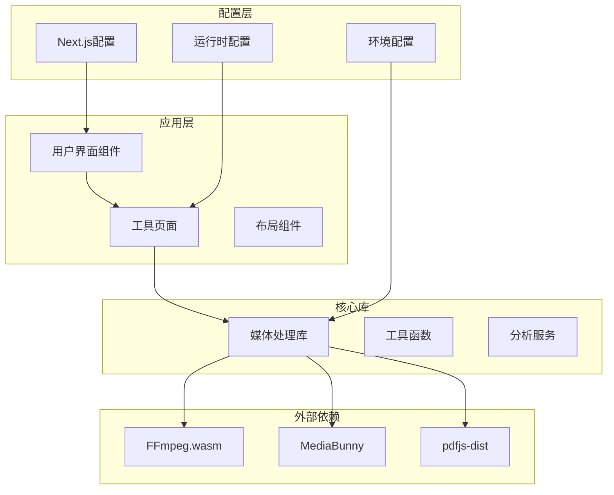
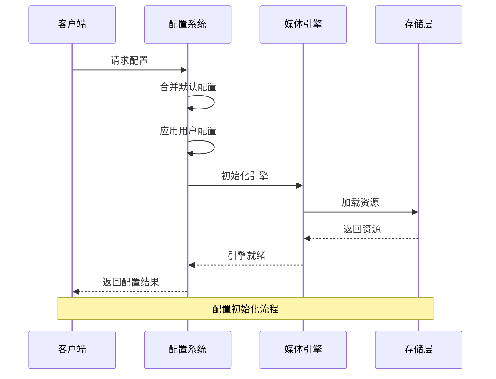
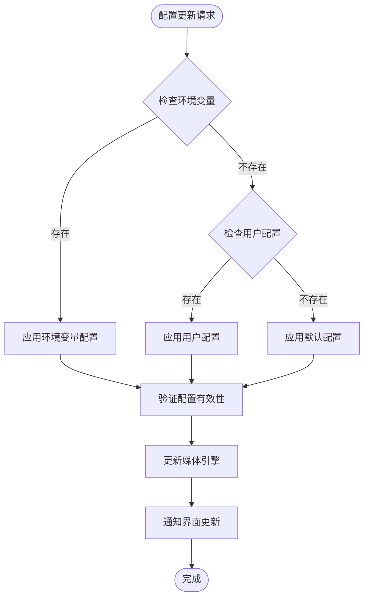
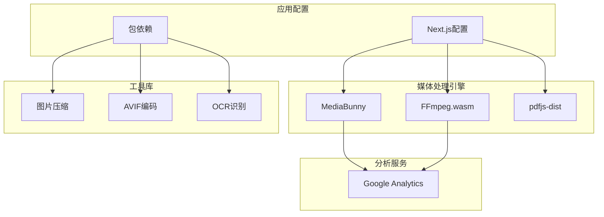
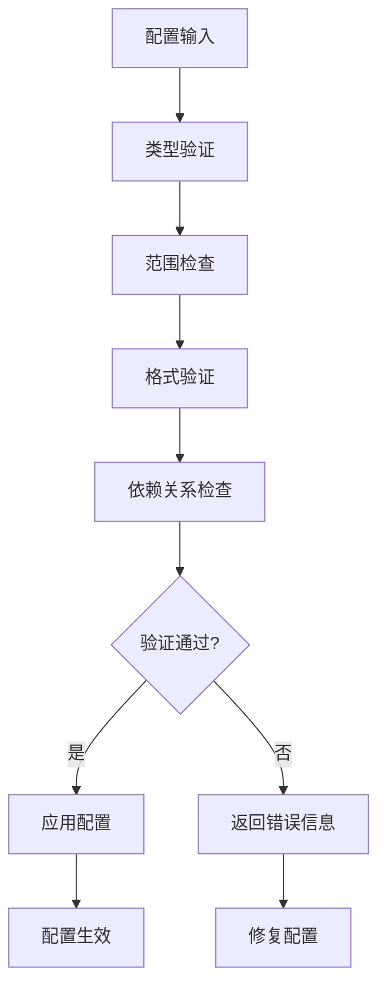

# 配置API

<cite>
**本文档引用的文件**
- [next.config.ts](file://next.config.ts)
- [package.json](file://package.json)
- [ffmpeg.ts](file://src/lib/ffmpeg.ts)
- [media-pipeline.ts](file://src/lib/media-pipeline.ts)
- [pdfjs.ts](file://src/lib/pdfjs.ts)
- [image-compress-logic.ts](file://src/tools/image/compress/logic.ts)
- [video-compress-logic.ts](file://src/tools/video/compress/logic.ts)
- [pdf-compress-logic.ts](file://src/tools/pdf/compress/logic.ts)
- [detectLocale.ts](file://src/lib/i18n/detectLocale.ts)
- [ServiceWorkerRegistration.tsx](file://src/components/shared/ServiceWorkerRegistration.tsx)
- [brand.ts](file://src/lib/brand.ts)
</cite>

## 目录
1. [简介](#简介)
2. [项目结构](#项目结构)
3. [核心组件](#核心组件)
4. [架构概览](#架构概览)
5. [详细组件分析](#详细组件分析)
6. [依赖关系分析](#依赖关系分析)
7. [性能考虑](#性能考虑)
8. [故障排除指南](#故障排除指南)
9. [结论](#结论)

## 简介

PrivaDeck 媒体工具箱是一个基于 Next.js 构建的前端媒体处理应用，提供了丰富的媒体转换和编辑功能。本文件详细说明了项目的配置API，包括全局配置选项、媒体处理引擎配置、性能优化参数和资源限制设置。

## 项目结构

项目采用模块化架构设计，主要分为以下几个核心部分：

**图表来源**
- [next.config.ts:1-30](file://next.config.ts#L1-L30)
- [package.json:11-32](file://package.json#L11-L32)

**章节来源**
- [next.config.ts:1-30](file://next.config.ts#L1-L30)
- [package.json:1-45](file://package.json#L1-L45)

## 核心组件

### 全局配置选项

#### Next.js 应用配置

应用使用 Next.js 16.2.1 进行构建，配置了以下关键选项：

- **静态导出模式**: `output: "export"` - 将应用构建为静态文件，便于部署
- **图片优化**: `images: { unoptimized: true }` - 禁用Next.js内置图片优化
- **路径配置**: `trailingSlash: true` - 在URL末尾添加斜杠
- **安全头**: 自定义 CORS 头部配置

#### 性能优化参数

应用实现了多层性能优化机制：

- **懒加载**: 工具组件使用 React.lazy 和 Suspense 实现按需加载
- **内存管理**: FFmpeg 操作使用 WORKERFS 避免内存复制
- **并发控制**: FFmpeg 操作通过 Promise 队列序列化执行
- **硬件加速**: WebCodecs 媒体管道支持硬件加速

#### 资源限制设置

- **文件大小限制**: 图片压缩默认最大 10MB
- **分辨率限制**: 图片压缩最大 16384 像素
- **视频处理限制**: 支持最高 4K 分辨率
- **内存使用**: 自动清理临时文件和缓存

**章节来源**
- [next.config.ts:6-27](file://next.config.ts#L6-L27)
- [ffmpeg.ts:75-82](file://src/lib/ffmpeg.ts#L75-L82)

### 媒体处理引擎配置

#### FFmpeg.wasm 配置

FFmpeg 引擎配置了以下参数：

- **核心URL**: CDN 加载 @ffmpeg/core@0.12.6
- **加载策略**: 动态加载核心文件和 WASM 模块
- **进度监控**: 事件驱动的进度回调机制
- **错误处理**: 完善的异常捕获和清理机制

#### WebCodecs 媒体管道

WebCodecs 引擎提供了硬件加速的媒体处理能力：

- **编解码器支持检测**: 自动检测浏览器支持的编解码器
- **硬件加速优先**: 优先使用硬件加速进行媒体处理
- **降级机制**: 不支持时自动回退到 FFmpeg
- **性能监控**: 实时进度反馈和性能指标

**章节来源**
- [ffmpeg.ts:19-39](file://src/lib/ffmpeg.ts#L19-L39)
- [media-pipeline.ts:7-14](file://src/lib/media-pipeline.ts#L7-L14)

## 架构概览

**图表来源**
- [ffmpeg.ts:10-39](file://src/lib/ffmpeg.ts#L10-L39)
- [media-pipeline.ts:16-26](file://src/lib/media-pipeline.ts#L16-L26)

## 详细组件分析

### 图片压缩配置

#### 默认参数设置

图片压缩工具提供了多种预设配置：

| 预设类型 | 质量 (%) | 最大文件大小 (MB) | 最大分辨率 | EXIF 保留 |
|---------|----------|-------------------|------------|-----------|
| high-quality | 90 | 10 | 无限制 | 是 |
| balanced | 75 | 1 | 无限制 | 是 |
| small-file | 50 | 1 | 1920 | 是 |
| custom | 80 | 1 | 无限制 | 可选 |

#### 高级配置选项

- **输出格式**: 支持原图、JPEG、PNG、WebP、AVIF
- **自定义尺寸**: 支持指定宽度和高度
- **质量控制**: 10%-100% 的可调节范围
- **EXIF 处理**: 可选择保留或移除元数据

**章节来源**
- [image-compress-logic.ts:26-34](file://src/tools/image/compress/logic.ts#L26-L34)
- [image-compress-logic.ts:7-15](file://src/tools/image/compress/logic.ts#L7-L15)

### 视频压缩配置

#### 质量预设

视频压缩提供了三种质量级别：

| 预设级别 | CRF | 编码速度 | 分辨率 | 帧率 | 音频码率 |
|---------|-----|----------|--------|------|----------|
| high | 23 | fast | 原始 | 原始 | 192k |
| medium | 28 | fast | 原始 | 原始 | 128k |
| low | 35 | fast | 720p | 原始 | 96k |

#### 高级编码参数

- **CRF 控制**: 0-51 的恒定质量因子
- **编码预设**: 从 ultrafast 到 veryslow 的九种预设
- **分辨率调整**: 支持 1080p、720p、480p、360p
- **帧率控制**: 支持 30fps、24fps、15fps
- **音频比特率**: 96k-192k 可调
- **最大码率**: 支持上限控制

**章节来源**
- [video-compress-logic.ts:30-52](file://src/tools/video/compress/logic.ts#L30-L52)
- [video-compress-logic.ts:21-28](file://src/tools/video/compress/logic.ts#L21-L28)

### PDF 压缩配置

#### 压缩质量映射

PDF 压缩根据质量级别调整渲染参数：

| 质量级别 | 缩放比例 | JPEG 质量 | 文件大小减少 |
|---------|----------|-----------|-------------|
| high | 1.5 | 0.8 | 60-70% |
| medium | 1.0 | 0.6 | 40-50% |
| low | 0.75 | 0.4 | 20-30% |

#### 处理流程

1. **页面遍历**: 逐页读取源PDF
2. **Canvas 渲染**: 使用 PDF.js 渲染到 Canvas
3. **图像压缩**: 转换为 JPEG 并应用质量设置
4. **重新构建**: 创建新PDF并添加压缩后的页面

**章节来源**
- [pdf-compress-logic.ts:6-10](file://src/tools/pdf/compress/logic.ts#L6-L10)
- [pdf-compress-logic.ts:12-66](file://src/tools/pdf/compress/logic.ts#L12-L66)

### 运行时配置管理

#### 配置优先级

配置系统遵循以下优先级顺序：

1. **系统默认配置** - 应用的基础配置
2. **用户配置** - 用户在界面上的选择
3. **环境变量** - 运行时环境设置
4. **工具特定配置** - 各工具的专用参数

#### 动态更新机制

**图表来源**
- [detectLocale.ts:7-40](file://src/lib/i18n/detectLocale.ts#L7-L40)
- [brand.ts:3-6](file://src/lib/brand.ts#L3-L6)

**章节来源**
- [detectLocale.ts:1-40](file://src/lib/i18n/detectLocale.ts#L1-L40)
- [brand.ts:1-6](file://src/lib/brand.ts#L1-L6)

## 依赖关系分析

**图表来源**
- [package.json:11-32](file://package.json#L11-L32)
- [media-pipeline.ts:16-26](file://src/lib/media-pipeline.ts#L16-L26)

**章节来源**
- [package.json:11-32](file://package.json#L11-L32)

## 性能考虑

### 内存管理优化

1. **WORKERFS 文件系统**: 避免文件在内存中的完整复制
2. **Promise 队列**: 序列化 FFmpeg 操作防止并发冲突
3. **自动清理**: 处理完成后立即释放临时文件
4. **缓存策略**: 合理使用浏览器缓存避免重复下载

### 并发控制

- **单线程约束**: FFmpeg WASM 仅支持单线程执行
- **队列管理**: 所有媒体操作通过统一队列调度
- **进度同步**: 原子性地设置和清除进度处理器
- **资源隔离**: 每个操作独立的挂载点和工作目录

### 硬件加速

- **WebCodecs 支持**: 自动检测硬件编解码器可用性
- **降级策略**: 不支持时自动回退到软件解码
- **性能监控**: 实时跟踪处理进度和性能指标
- **平台适配**: 针对不同平台优化硬件加速设置

## 故障排除指南

### 常见配置问题

#### FFmpeg 加载失败

**症状**: 应用启动时报错，无法加载 FFmpeg 核心文件

**解决方案**:
1. 检查 CDN 连接是否正常
2. 验证网络代理设置
3. 确认浏览器允许第三方 Cookie
4. 尝试手动指定不同的 CDN 基础URL

#### WebCodecs 不支持

**症状**: 视频处理功能不可用或性能不佳

**解决方案**:
1. 检查浏览器版本和兼容性
2. 确认 HTTPS 环境下的安全策略
3. 验证硬件编解码器支持情况
4. 考虑安装平台特定的编解码器扩展

#### 内存不足错误

**症状**: 处理大型文件时出现内存溢出

**解决方案**:
1. 减少输入文件的分辨率或大小
2. 调整压缩质量参数
3. 关闭其他占用内存的应用程序
4. 增加浏览器的内存限制（如果可能）

### 配置验证机制

应用实现了多层次的配置验证：

**图表来源**
- [media-pipeline.ts:59-91](file://src/lib/media-pipeline.ts#L59-L91)
- [ffmpeg.ts:51-58](file://src/lib/ffmpeg.ts#L51-L58)

**章节来源**
- [media-pipeline.ts:28-53](file://src/lib/media-pipeline.ts#L28-L53)
- [ffmpeg.ts:41-58](file://src/lib/ffmpeg.ts#L41-L58)

## 结论

PrivaDeck 媒体工具箱的配置API设计体现了现代前端应用的最佳实践。通过合理的配置层次、完善的错误处理机制和性能优化策略，为用户提供了一个稳定可靠的媒体处理平台。

关键特性包括：
- **灵活的配置系统**: 支持多层级配置和动态更新
- **强大的媒体处理能力**: FFmpeg 和 WebCodecs 双引擎架构
- **优秀的用户体验**: 智能的硬件加速和内存管理
- **完善的错误处理**: 全面的验证机制和降级策略

未来可以考虑的方向：
- 添加更多工具特定的配置选项
- 实现配置模板和批量导入功能
- 增强配置的可视化管理界面
- 提供更详细的性能监控和调试信息