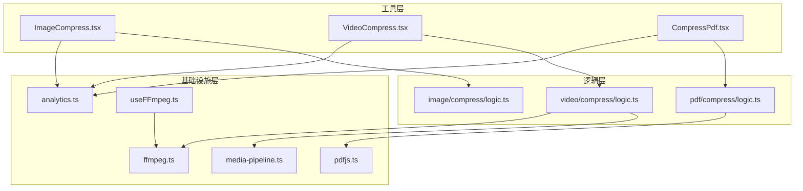
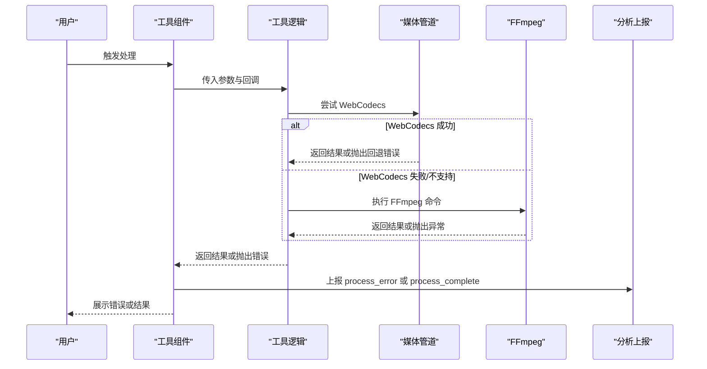
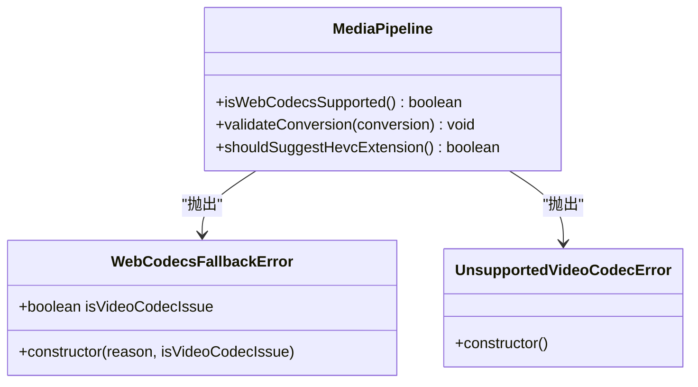
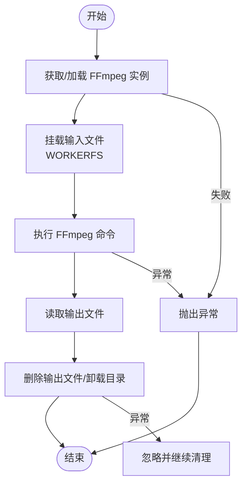
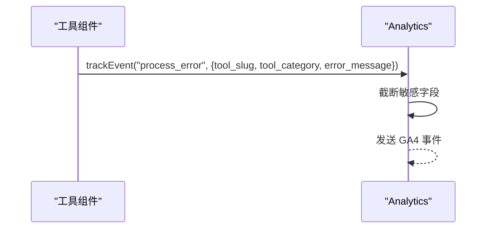
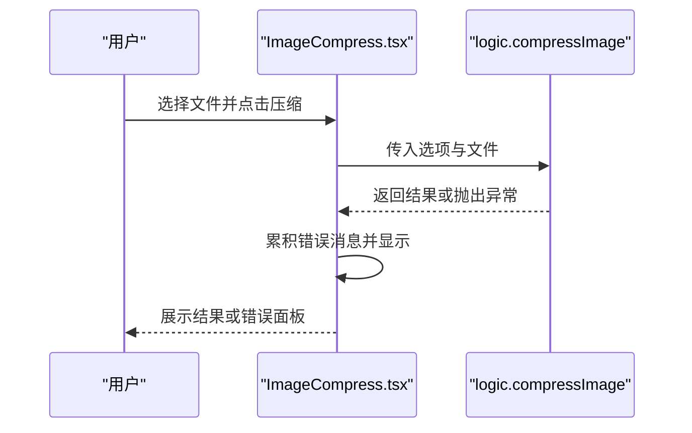
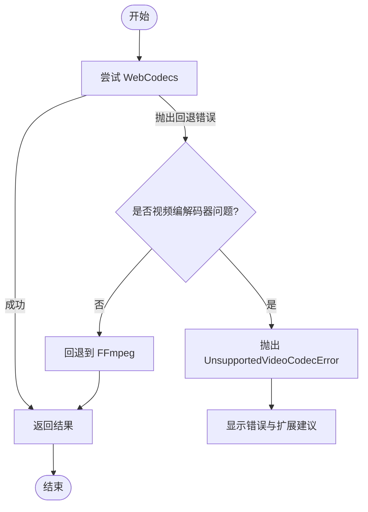
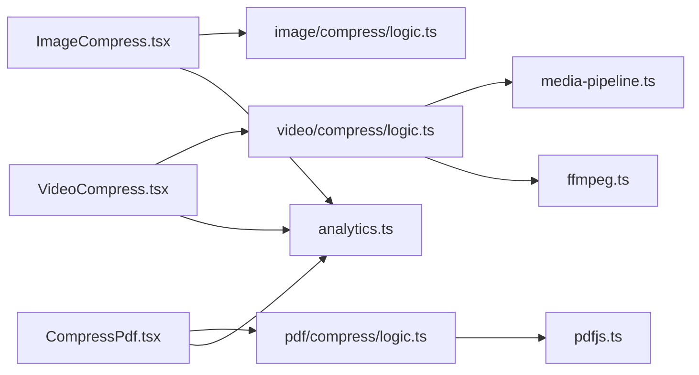

# 错误处理API

<cite>
**本文引用的文件**
- [README.md](file://README.md)
- [src/lib/analytics.ts](file://src/lib/analytics.ts)
- [src/lib/media-pipeline.ts](file://src/lib/media-pipeline.ts)
- [src/lib/ffmpeg.ts](file://src/lib/ffmpeg.ts)
- [src/lib/pdfjs.ts](file://src/lib/pdfjs.ts)
- [src/lib/hooks/useFFmpeg.ts](file://src/lib/hooks/useFFmpeg.ts)
- [src/tools/image/compress/ImageCompress.tsx](file://src/tools/image/compress/ImageCompress.tsx)
- [src/tools/video/compress/VideoCompress.tsx](file://src/tools/video/compress/VideoCompress.tsx)
- [src/tools/pdf/compress/CompressPdf.tsx](file://src/tools/pdf/compress/CompressPdf.tsx)
- [src/tools/image/compress/logic.ts](file://src/tools/image/compress/logic.ts)
- [src/tools/video/compress/logic.ts](file://src/tools/video/compress/logic.ts)
- [src/tools/pdf/compress/logic.ts](file://src/tools/pdf/compress/logic.ts)
</cite>

## 目录
1. [简介](#简介)
2. [项目结构](#项目结构)
3. [核心组件](#核心组件)
4. [架构总览](#架构总览)
5. [详细组件分析](#详细组件分析)
6. [依赖关系分析](#依赖关系分析)
7. [性能考量](#性能考量)
8. [故障排查指南](#故障排查指南)
9. [结论](#结论)
10. [附录](#附录)

## 简介
本文件为 PrivaDeck 媒体工具箱的错误处理API参考文档，覆盖以下方面：
- 错误类型与错误码体系：媒体处理错误、网络错误、用户输入错误的分类与标识
- 异步错误捕获、错误重试策略与降级处理方案
- 错误日志记录与分析API：事件收集、上报与监控机制
- 客户端环境中的错误处理示例：如何应对各类异常
- 错误恢复策略与用户友好提示机制
- 调试工具与错误诊断方法：开发与生产环境差异

PrivaDeck 是一个浏览器端多媒体工具箱，所有处理在本地完成，不涉及服务器上传。技术栈包含 FFmpeg.wasm、pdf-lib + pdfjs-dist、browser-image-compression 等，错误处理贯穿于媒体管道、工具逻辑与前端交互层。

## 项目结构
与错误处理相关的关键目录与文件：
- lib 层：媒体管道与分析工具
  - media-pipeline.ts：WebCodecs 支持检测、错误类型与验证
  - ffmpeg.ts：FFmpeg 加载、进度回调、操作队列与错误传播
  - pdfjs.ts：pdfjs 初始化与配置
  - analytics.ts：GA4 事件追踪与错误事件上报
  - hooks/useFFmpeg.ts：FFmpeg Hook 状态管理与加载失败处理
- tools 层：各工具的客户端组件与业务逻辑
  - image/compress：图片压缩组件与逻辑
  - video/compress：视频压缩组件与逻辑
  - pdf/compress：PDF 压缩组件与逻辑

图表来源
- [src/tools/image/compress/ImageCompress.tsx:138-178](file://src/tools/image/compress/ImageCompress.tsx#L138-L178)
- [src/tools/video/compress/VideoCompress.tsx:74-103](file://src/tools/video/compress/VideoCompress.tsx#L74-L103)
- [src/tools/pdf/compress/CompressPdf.tsx:28-45](file://src/tools/pdf/compress/CompressPdf.tsx#L28-L45)
- [src/tools/image/compress/logic.ts:83-123](file://src/tools/image/compress/logic.ts#L83-L123)
- [src/tools/video/compress/logic.ts:85-110](file://src/tools/video/compress/logic.ts#L85-L110)
- [src/tools/pdf/compress/logic.ts:12-66](file://src/tools/pdf/compress/logic.ts#L12-L66)
- [src/lib/media-pipeline.ts:7-14](file://src/lib/media-pipeline.ts#L7-L14)
- [src/lib/ffmpeg.ts:10-39](file://src/lib/ffmpeg.ts#L10-L39)
- [src/lib/pdfjs.ts:3-13](file://src/lib/pdfjs.ts#L3-L13)
- [src/lib/analytics.ts:106-137](file://src/lib/analytics.ts#L106-L137)
- [src/lib/hooks/useFFmpeg.ts:8-40](file://src/lib/hooks/useFFmpeg.ts#L8-L40)

章节来源
- [README.md:55-78](file://README.md#L55-L78)

## 核心组件
- 媒体管道与错误类型
  - WebCodecs 支持检测与回退策略
  - WebCodecsFallbackError：指示回退至 FFmpeg 的错误
  - UnsupportedVideoCodecError：不支持的视频编解码器（终端错误）
  - validateConversion：校验转换结果，抛出回退错误
- FFmpeg 错误与资源管理
  - getFFmpeg：懒加载与错误传播
  - execWithMount：挂载输入文件、执行命令、清理资源
  - enqueueOperation：串行化执行，避免并发冲突
- 错误事件追踪与上报
  - trackEvent：GA4 事件追踪，隐私截断敏感字段
  - createToolTracker：工具维度错误事件工厂
- Hook 状态与加载失败
  - useFFmpeg：状态机管理（idle/loading/ready/error）

章节来源
- [src/lib/media-pipeline.ts:7-14](file://src/lib/media-pipeline.ts#L7-L14)
- [src/lib/media-pipeline.ts:28-53](file://src/lib/media-pipeline.ts#L28-L53)
- [src/lib/media-pipeline.ts:55-91](file://src/lib/media-pipeline.ts#L55-L91)
- [src/lib/ffmpeg.ts:10-39](file://src/lib/ffmpeg.ts#L10-L39)
- [src/lib/ffmpeg.ts:99-143](file://src/lib/ffmpeg.ts#L99-L143)
- [src/lib/ffmpeg.ts:75-82](file://src/lib/ffmpeg.ts#L75-L82)
- [src/lib/analytics.ts:106-137](file://src/lib/analytics.ts#L106-L137)
- [src/lib/hooks/useFFmpeg.ts:8-40](file://src/lib/hooks/useFFmpeg.ts#L8-L40)

## 架构总览
错误处理在工具层、逻辑层与基础设施层形成闭环：
- 工具层负责用户交互与错误展示
- 逻辑层封装媒体处理与错误抛出
- 基础设施层提供运行时能力与错误类型，并统一上报

图表来源
- [src/tools/video/compress/logic.ts:85-110](file://src/tools/video/compress/logic.ts#L85-L110)
- [src/lib/media-pipeline.ts:28-53](file://src/lib/media-pipeline.ts#L28-L53)
- [src/lib/ffmpeg.ts:99-143](file://src/lib/ffmpeg.ts#L99-L143)
- [src/lib/analytics.ts:128-137](file://src/lib/analytics.ts#L128-L137)

## 详细组件分析

### 媒体管道与错误类型
- WebCodecs 支持检测
  - isWebCodecsSupported：检测浏览器是否具备 WebCodecs 能力
- 错误类型
  - WebCodecsFallbackError：当转换无效或编解码器问题导致轨道被丢弃时抛出，指示回退
  - UnsupportedVideoCodecError：不支持的视频编解码器（如 H.265/HEVC、VP9、AV1），为终端错误
- 转换验证
  - validateConversion：遍历 discardedTracks，若存在编解码器相关原因则抛出回退错误；若整体无效也抛出回退错误
- 平台建议
  - shouldSuggestHevcExtension：在 Windows + Chromium 浏览器上建议安装 HEVC 扩展以提升硬件解码

图表来源
- [src/lib/media-pipeline.ts:7-14](file://src/lib/media-pipeline.ts#L7-L14)
- [src/lib/media-pipeline.ts:28-53](file://src/lib/media-pipeline.ts#L28-L53)
- [src/lib/media-pipeline.ts:55-91](file://src/lib/media-pipeline.ts#L55-L91)
- [src/lib/media-pipeline.ts:93-105](file://src/lib/media-pipeline.ts#L93-L105)

章节来源
- [src/lib/media-pipeline.ts:7-14](file://src/lib/media-pipeline.ts#L7-L14)
- [src/lib/media-pipeline.ts:28-53](file://src/lib/media-pipeline.ts#L28-L53)
- [src/lib/media-pipeline.ts:55-91](file://src/lib/media-pipeline.ts#L55-L91)
- [src/lib/media-pipeline.ts:93-105](file://src/lib/media-pipeline.ts#L93-L105)

### FFmpeg 错误处理与资源管理
- 懒加载与错误传播
  - getFFmpeg：首次调用时动态加载 FFmpeg 核心与 wasm，加载失败会抛出异常并终止实例
- 进度回调与清理
  - setProgressHandler：注册/注销进度事件，确保范围校验与原子更新
  - execWithMount：通过 WORKERFS 挂载输入文件，避免内存拷贝；执行完成后释放 MEMFS 与卸载挂载点
- 串行化执行
  - enqueueOperation：将操作排队，保证单线程执行，避免挂载点冲突
- 资源回收
  - 删除输出文件、卸载目录、忽略异常，确保稳定释放

图表来源
- [src/lib/ffmpeg.ts:10-39](file://src/lib/ffmpeg.ts#L10-L39)
- [src/lib/ffmpeg.ts:41-58](file://src/lib/ffmpeg.ts#L41-L58)
- [src/lib/ffmpeg.ts:99-143](file://src/lib/ffmpeg.ts#L99-L143)
- [src/lib/ffmpeg.ts:75-82](file://src/lib/ffmpeg.ts#L75-L82)

章节来源
- [src/lib/ffmpeg.ts:10-39](file://src/lib/ffmpeg.ts#L10-L39)
- [src/lib/ffmpeg.ts:41-58](file://src/lib/ffmpeg.ts#L41-L58)
- [src/lib/ffmpeg.ts:75-82](file://src/lib/ffmpeg.ts#L75-L82)
- [src/lib/ffmpeg.ts:99-143](file://src/lib/ffmpeg.ts#L99-L143)

### 错误事件追踪与上报
- 事件参数接口
  - 包括 file_upload、file_download、copy_click、search_query、search_select、related_tool_click、faq_expand、theme_change、language_change、share_click、process_complete、process_error 等
- 隐私保护
  - 对 error_message 与 query 字段进行长度截断，避免记录过长内容
- 工具级追踪
  - createToolTracker：为每个工具创建跟踪器，自动填充 tool_slug 与 tool_category

图表来源
- [src/lib/analytics.ts:106-137](file://src/lib/analytics.ts#L106-L137)

章节来源
- [src/lib/analytics.ts:106-137](file://src/lib/analytics.ts#L106-L137)

### Hook 状态与加载失败
- useFFmpeg
  - 状态机：idle → loading → ready/error
  - 预加载选项：可按需预加载
  - 加载失败：状态切换为 error，便于 UI 提示

章节来源
- [src/lib/hooks/useFFmpeg.ts:8-40](file://src/lib/hooks/useFFmpeg.ts#L8-L40)

### 图片压缩：错误捕获与用户提示
- 组件行为
  - 逐文件处理，捕获单个文件的错误并累积显示
  - 进度条显示已处理数量与总数
- 逻辑实现
  - 使用 browser-image-compression 进行压缩
  - 输出压缩结果与节省百分比信息

图表来源
- [src/tools/image/compress/ImageCompress.tsx:138-178](file://src/tools/image/compress/ImageCompress.tsx#L138-L178)
- [src/tools/image/compress/logic.ts:83-123](file://src/tools/image/compress/logic.ts#L83-L123)

章节来源
- [src/tools/image/compress/ImageCompress.tsx:138-178](file://src/tools/image/compress/ImageCompress.tsx#L138-L178)
- [src/tools/image/compress/logic.ts:83-123](file://src/tools/image/compress/logic.ts#L83-L123)

### 视频压缩：回退策略与用户提示
- 回退策略
  - 优先尝试 WebCodecs；若抛出 WebCodecsFallbackError，则根据 isVideoCodecIssue 决定是否抛出 UnsupportedVideoCodecError（终端错误）
  - 对于非视频编解码器问题，回退至 FFmpeg
- 用户提示
  - 显示错误面板，区分编解码器错误与一般错误
  - 若建议安装 HEVC 扩展，提供提示

图表来源
- [src/tools/video/compress/logic.ts:85-110](file://src/tools/video/compress/logic.ts#L85-L110)
- [src/lib/media-pipeline.ts:28-53](file://src/lib/media-pipeline.ts#L28-L53)
- [src/lib/media-pipeline.ts:93-105](file://src/lib/media-pipeline.ts#L93-L105)
- [src/tools/video/compress/VideoCompress.tsx:92-102](file://src/tools/video/compress/VideoCompress.tsx#L92-L102)

章节来源
- [src/tools/video/compress/logic.ts:85-110](file://src/tools/video/compress/logic.ts#L85-L110)
- [src/lib/media-pipeline.ts:28-53](file://src/lib/media-pipeline.ts#L28-L53)
- [src/lib/media-pipeline.ts:93-105](file://src/lib/media-pipeline.ts#L93-L105)
- [src/tools/video/compress/VideoCompress.tsx:92-102](file://src/tools/video/compress/VideoCompress.tsx#L92-L102)

### PDF 压缩：进度与错误处理
- 进度回调
  - 逐页渲染并嵌入 JPEG，onProgress 提供当前页与总页数
- 错误处理
  - 捕获并显示错误消息，保持 UI 可用性

章节来源
- [src/tools/pdf/compress/CompressPdf.tsx:28-45](file://src/tools/pdf/compress/CompressPdf.tsx#L28-L45)
- [src/tools/pdf/compress/logic.ts:12-66](file://src/tools/pdf/compress/logic.ts#L12-L66)

## 依赖关系分析
- 工具组件依赖逻辑层
  - ImageCompress.tsx → logic.ts
  - VideoCompress.tsx → logic.ts
  - CompressPdf.tsx → logic.ts
- 逻辑层依赖基础设施层
  - video/compress/logic.ts → media-pipeline.ts、ffmpeg.ts
  - pdf/compress/logic.ts → pdfjs.ts
- 分析层独立于业务逻辑，通过工具组件间接使用
  - analytics.ts 被工具组件调用以记录错误事件

图表来源
- [src/tools/image/compress/ImageCompress.tsx:138-178](file://src/tools/image/compress/ImageCompress.tsx#L138-L178)
- [src/tools/video/compress/VideoCompress.tsx:74-103](file://src/tools/video/compress/VideoCompress.tsx#L74-L103)
- [src/tools/pdf/compress/CompressPdf.tsx:28-45](file://src/tools/pdf/compress/CompressPdf.tsx#L28-L45)
- [src/tools/image/compress/logic.ts:83-123](file://src/tools/image/compress/logic.ts#L83-L123)
- [src/tools/video/compress/logic.ts:85-110](file://src/tools/video/compress/logic.ts#L85-L110)
- [src/tools/pdf/compress/logic.ts:12-66](file://src/tools/pdf/compress/logic.ts#L12-L66)
- [src/lib/media-pipeline.ts:7-14](file://src/lib/media-pipeline.ts#L7-L14)
- [src/lib/ffmpeg.ts:10-39](file://src/lib/ffmpeg.ts#L10-L39)
- [src/lib/pdfjs.ts:3-13](file://src/lib/pdfjs.ts#L3-L13)
- [src/lib/analytics.ts:106-137](file://src/lib/analytics.ts#L106-L137)

## 性能考量
- WebCodecs 优先：硬件加速与更少的内存复制，适合大多数场景
- 回退策略：对不支持的视频编解码器直接终止，避免低效回退
- FFmpeg 优化：WORKERFS 挂载避免全量内存拷贝；执行后立即删除输出文件与卸载目录
- 串行化执行：通过 Promise 队列避免并发冲突，减少资源竞争

章节来源
- [src/lib/media-pipeline.ts:7-14](file://src/lib/media-pipeline.ts#L7-L14)
- [src/lib/media-pipeline.ts:28-53](file://src/lib/media-pipeline.ts#L28-L53)
- [src/lib/ffmpeg.ts:75-82](file://src/lib/ffmpeg.ts#L75-L82)
- [src/lib/ffmpeg.ts:99-143](file://src/lib/ffmpeg.ts#L99-L143)

## 故障排查指南
- FFmpeg 加载失败
  - 现象：Hook 状态变为 error，无法执行媒体处理
  - 排查：检查 CDN 可达性与跨域设置；确认浏览器支持 SharedArrayBuffer
  - 参考：[src/lib/ffmpeg.ts:10-39](file://src/lib/ffmpeg.ts#L10-L39)、[src/lib/hooks/useFFmpeg.ts:8-40](file://src/lib/hooks/useFFmpeg.ts#L8-L40)
- WebCodecs 不支持或编解码器不受支持
  - 现象：视频压缩界面提示不支持或抛出 UnsupportedVideoCodecError
  - 排查：确认浏览器版本与平台；Windows + Chromium 可考虑安装 HEVC 扩展
  - 参考：[src/lib/media-pipeline.ts:93-105](file://src/lib/media-pipeline.ts#L93-L105)、[src/tools/video/compress/VideoCompress.tsx:66-72](file://src/tools/video/compress/VideoCompress.tsx#L66-L72)
- 图片压缩异常
  - 现象：单个文件处理失败，错误累积显示
  - 排查：检查文件类型与大小限制；确认浏览器支持 WebCodecs 或 Worker
  - 参考：[src/tools/image/compress/ImageCompress.tsx:138-178](file://src/tools/image/compress/ImageCompress.tsx#L138-L178)、[src/tools/image/compress/logic.ts:83-123](file://src/tools/image/compress/logic.ts#L83-L123)
- PDF 压缩卡顿或失败
  - 现象：逐页处理进度缓慢或中断
  - 排查：检查页面数量与分辨率；确认 Canvas 渲染与 toBlob 成功
  - 参考：[src/tools/pdf/compress/logic.ts:12-66](file://src/tools/pdf/compress/logic.ts#L12-L66)、[src/lib/pdfjs.ts:3-13](file://src/lib/pdfjs.ts#L3-L13)
- 错误事件未上报
  - 现象：控制台无错误事件
  - 排查：确认 window.gtag 存在；检查隐私截断逻辑与事件参数
  - 参考：[src/lib/analytics.ts:106-137](file://src/lib/analytics.ts#L106-L137)

章节来源
- [src/lib/ffmpeg.ts:10-39](file://src/lib/ffmpeg.ts#L10-L39)
- [src/lib/hooks/useFFmpeg.ts:8-40](file://src/lib/hooks/useFFmpeg.ts#L8-L40)
- [src/lib/media-pipeline.ts:93-105](file://src/lib/media-pipeline.ts#L93-L105)
- [src/tools/video/compress/VideoCompress.tsx:66-72](file://src/tools/video/compress/VideoCompress.tsx#L66-L72)
- [src/tools/image/compress/ImageCompress.tsx:138-178](file://src/tools/image/compress/ImageCompress.tsx#L138-L178)
- [src/tools/image/compress/logic.ts:83-123](file://src/tools/image/compress/logic.ts#L83-L123)
- [src/tools/pdf/compress/logic.ts:12-66](file://src/tools/pdf/compress/logic.ts#L12-L66)
- [src/lib/pdfjs.ts:3-13](file://src/lib/pdfjs.ts#L3-L13)
- [src/lib/analytics.ts:106-137](file://src/lib/analytics.ts#L106-L137)

## 结论
PrivaDeck 的错误处理API通过“基础设施层错误类型 + 逻辑层回退策略 + 工具层用户提示 + 分析层事件上报”的闭环设计，实现了：
- 明确的错误分类与标识（WebCodecsFallbackError、UnsupportedVideoCodecError）
- 可靠的回退与降级（WebCodecs → FFmpeg）
- 用户友好的错误展示与建议（错误面板、HEVC 扩展提示）
- 隐私保护的错误事件上报（字段截断）
- 面向生产的稳定性（资源回收、串行化执行、状态机 Hook）

## 附录
- 错误事件类型与参数
  - process_error：包含 tool_slug、tool_category、error_message
  - process_complete：包含 tool_slug、tool_category、duration_ms
  - 参考：[src/lib/analytics.ts:72-76](file://src/lib/analytics.ts#L72-L76)、[src/lib/analytics.ts:128-137](file://src/lib/analytics.ts#L128-L137)
- 工具维度错误上报示例
  - 在工具组件中创建工具追踪器并调用 trackProcessError
  - 参考：[src/lib/analytics.ts:128-137](file://src/lib/analytics.ts#L128-L137)