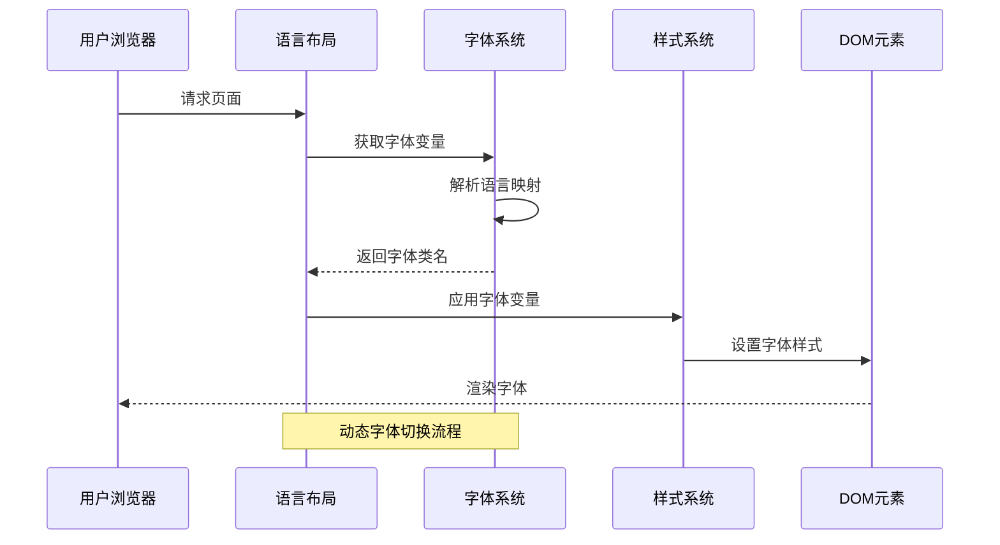
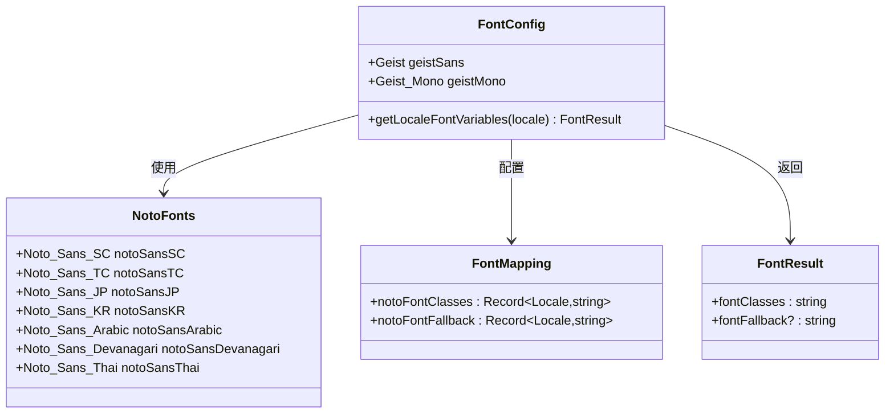
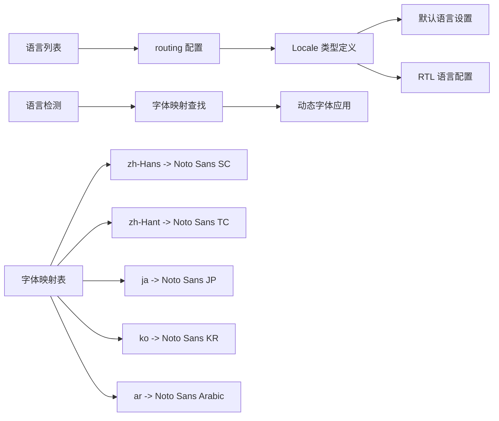
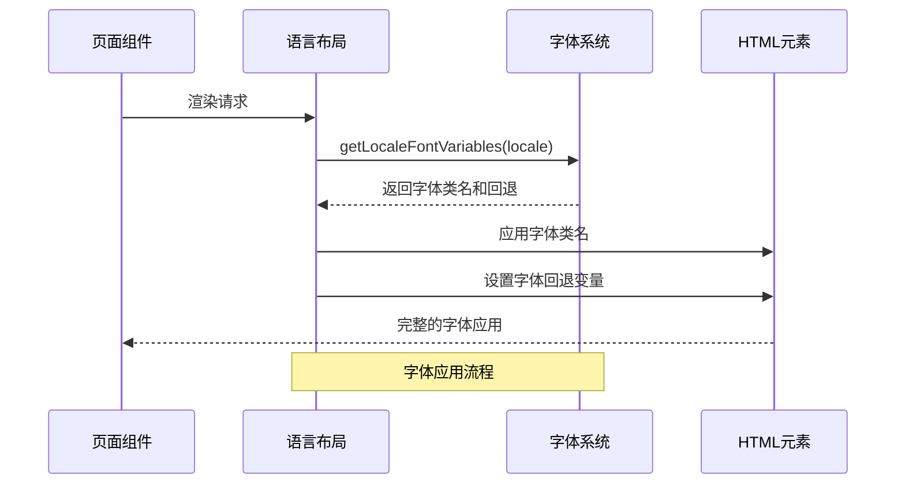
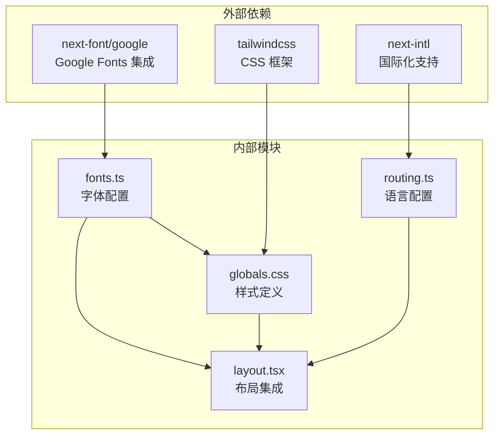

# 字体管理

<cite>
**本文档引用的文件**
- [fonts.ts](file://src/lib/fonts.ts)
- [globals.css](file://src/app/globals.css)
- [routing.ts](file://src/i18n/routing.ts)
- [navigation.ts](file://src/i18n/navigation.ts)
- [layout.tsx](file://src/app/[locale]/layout.tsx)
- [BaseLayout.tsx](file://src/components/layout/BaseLayout.tsx)
- [MainLayout.tsx](file://src/components/layout/MainLayout.tsx)
- [next.config.ts](file://next.config.ts)
- [package.json](file://package.json)
</cite>

## 目录
1. [简介](#简介)
2. [项目结构](#项目结构)
3. [核心组件](#核心组件)
4. [架构概览](#架构概览)
5. [详细组件分析](#详细组件分析)
6. [依赖关系分析](#依赖关系分析)
7. [性能考虑](#性能考虑)
8. [故障排除指南](#故障排除指南)
9. [结论](#结论)

## 简介

Media Toolbox 项目采用了一套完整的多语言字体管理系统，支持 16 种语言环境，包括中英文简繁体、日语、韩语、阿拉伯语、印地语、泰米尔语等。该系统基于 Next.js 的字体优化功能，结合 Tailwind CSS 和 CSS 变量，实现了高性能的字体加载和渲染机制。

## 项目结构

字体管理系统主要分布在以下关键文件中：

```mermaid
graph TB
subgraph "字体配置层"
F1[src/lib/fonts.ts<br/>字体定义和配置]
F2[next.config.ts<br/>Next.js 配置]
end
subgraph "样式层"
S1[src/app/globals.css<br/>全局样式和变量]
S2[src/app/[locale]/layout.tsx<br/>语言特定布局]
end
subgraph "国际化层"
I1[src/i18n/routing.ts<br/>语言路由配置]
I2[src/i18n/navigation.ts<br/>导航工具]
end
subgraph "布局层"
L1[src/components/layout/BaseLayout.tsx<br/>基础布局]
L2[src/components/layout/MainLayout.tsx<br/>主布局]
end
F1 --> S1
F1 --> S2
I1 --> S2
I1 --> L2
L1 --> L2
F2 --> S2
```

**图表来源**
- [fonts.ts:1-136](file://src/lib/fonts.ts#L1-L136)
- [globals.css:1-133](file://src/app/globals.css#L1-L133)
- [routing.ts:1-18](file://src/i18n/routing.ts#L1-L18)

**章节来源**
- [fonts.ts:1-136](file://src/lib/fonts.ts#L1-L136)
- [globals.css:1-133](file://src/app/globals.css#L1-L133)
- [routing.ts:1-18](file://src/i18n/routing.ts#L1-L18)

## 核心组件

### 字体定义系统

项目使用 Next.js Google Fonts 集成来管理字体资源：

- **Geist 字体系列**：提供现代无衬线字体和等宽字体
- **Noto Sans 多语言字体**：为不同语言提供专门的字体支持
- **字体变量系统**：通过 CSS 变量实现动态字体切换

### 国际化字体映射

系统为 16 种语言配置了专门的字体映射：

| 语言代码 | 字体名称 | 字体变量 |
|---------|----------|----------|
| zh-Hans | Noto Sans SC | --font-noto-sans-sc |
| zh-Hant | Noto Sans TC | --font-noto-sans-tc |
| ja | Noto Sans JP | --font-noto-sans-jp |
| ko | Noto Sans KR | --font-noto-sans-kr |
| ar | Noto Sans Arabic | --font-noto-sans-arabic |
| hi | Noto Sans Devanagari | --font-noto-sans-devanagari |
| th | Noto Sans Thai | --font-noto-sans-thai |

**章节来源**
- [fonts.ts:14-135](file://src/lib/fonts.ts#L14-L135)

## 架构概览

字体管理系统采用分层架构设计，确保了良好的可维护性和扩展性：



**图表来源**
- [layout.tsx:38-63](file://src/app/[locale]/layout.tsx#L38-L63)
- [fonts.ts:128-135](file://src/lib/fonts.ts#L128-L135)

## 详细组件分析

### 字体配置模块 (fonts.ts)

字体配置模块是整个系统的中枢，负责定义和管理所有字体资源：



**图表来源**
- [fonts.ts:14-135](file://src/lib/fonts.ts#L14-L135)

#### 字体加载策略

系统采用了多种优化策略来提升字体加载性能：

1. **预加载控制**：禁用字体预加载 (`preload: false`)
2. **显示优化**：使用 `display: "swap"` 避免 FOIT
3. **权重优化**：仅加载必要的字重 (400, 500, 600, 700)
4. **按需加载**：根据语言环境动态加载字体

**章节来源**
- [fonts.ts:24-78](file://src/lib/fonts.ts#L24-L78)

### 全局样式系统 (globals.css)

全局样式系统定义了字体变量和主题系统：

```mermaid
flowchart TD
A[全局样式初始化] --> B[定义字体变量]
B --> C[设置默认字体族]
C --> D[配置深色模式字体]
D --> E[应用到 body 元素]
F[字体变量定义] --> G[--font-sans: var(--font-locale-sans)]
G --> H[--font-mono: var(--font-geist-mono)]
I[回退机制] --> J[系统字体作为最后保障]
J --> K[确保字体可用性]
```

**图表来源**
- [globals.css:5-19](file://src/app/globals.css#L5-L19)
- [globals.css:17](file://src/app/globals.css#L17)

#### 字体变量系统

系统使用 CSS 变量来实现字体的动态切换：

- `--font-locale-sans`: 本地化字体变量
- `--font-geist-sans`: Geist 无衬线字体
- `--font-geist-mono`: Geist 等宽字体

**章节来源**
- [globals.css:17-18](file://src/app/globals.css#L17-L18)

### 国际化集成 (routing.ts)

国际化系统与字体管理深度集成：



**图表来源**
- [routing.ts:3-17](file://src/i18n/routing.ts#L3-L17)

**章节来源**
- [routing.ts:1-18](file://src/i18n/routing.ts#L1-L18)

### 布局集成 (layout.tsx)

语言特定布局负责将字体变量应用到页面：



**图表来源**
- [layout.tsx:38-63](file://src/app/[locale]/layout.tsx#L38-L63)
- [fonts.ts:128-135](file://src/lib/fonts.ts#L128-L135)

**章节来源**
- [layout.tsx:38-63](file://src/app/[locale]/layout.tsx#L38-L63)

## 依赖关系分析

字体管理系统与其他系统的关键依赖关系：



**图表来源**
- [package.json:11-32](file://package.json#L11-L32)
- [fonts.ts:1](file://src/lib/fonts.ts#L1)

**章节来源**
- [package.json:11-32](file://package.json#L11-L32)

## 性能考虑

### 字体加载优化

系统采用了多项性能优化措施：

1. **字体预加载禁用**：避免阻塞页面渲染
2. **字重选择优化**：仅加载必要的字体变体
3. **显示策略优化**：使用 `font-display: swap` 防止闪烁
4. **按需加载**：根据语言环境动态加载字体

### 内存使用优化

- 字体文件大小控制在合理范围内
- 避免重复加载相同字体
- 使用 CSS 变量减少样式计算开销

## 故障排除指南

### 常见问题及解决方案

#### 字体加载失败

**症状**：页面显示系统默认字体而非自定义字体

**可能原因**：
1. 字体文件加载超时
2. 语言映射配置错误
3. CSS 变量未正确应用

**解决步骤**：
1. 检查网络连接和字体服务可用性
2. 验证语言映射表中的字体变量
3. 确认 CSS 变量在 HTML 元素上正确应用

#### 字体显示异常

**症状**：某些字符显示为方块或缺失

**可能原因**：
1. 字符集不完整
2. 字体权重配置不当
3. 回退字体链配置错误

**解决步骤**：
1. 检查字体支持的字符集范围
2. 验证所需的字重是否已加载
3. 调整回退字体链顺序

**章节来源**
- [fonts.ts:80-102](file://src/lib/fonts.ts#L80-L102)
- [fonts.ts:104-126](file://src/lib/fonts.ts#L104-L126)

## 结论

Media Toolbox 的字体管理系统展现了现代 Web 应用的最佳实践：

1. **多语言支持完整性**：覆盖 16 种语言环境
2. **性能优化到位**：采用多种字体加载优化策略
3. **架构设计合理**：分层清晰，职责明确
4. **可维护性强**：配置集中，易于扩展和修改

该系统为用户提供了流畅的多语言字体体验，同时保持了优秀的性能表现。通过合理的字体管理和优化策略，确保了在不同语言环境下都能提供一致且高质量的文本渲染效果。