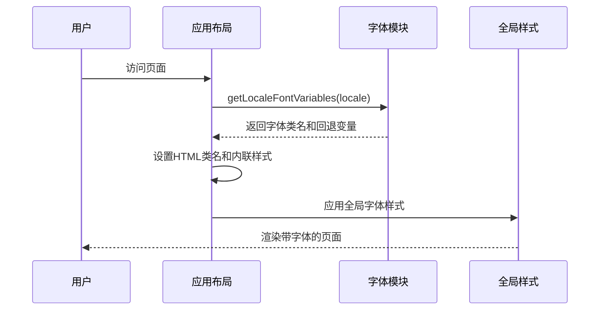
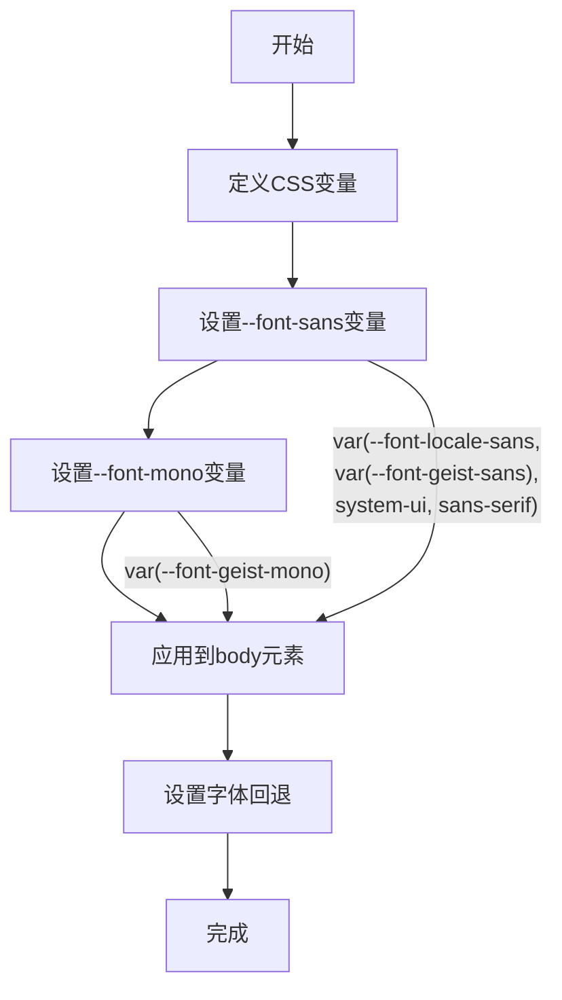
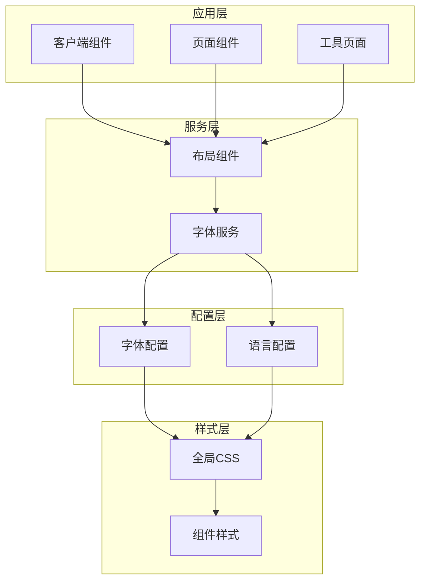
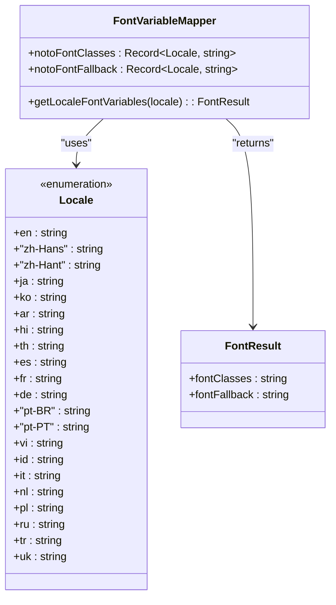
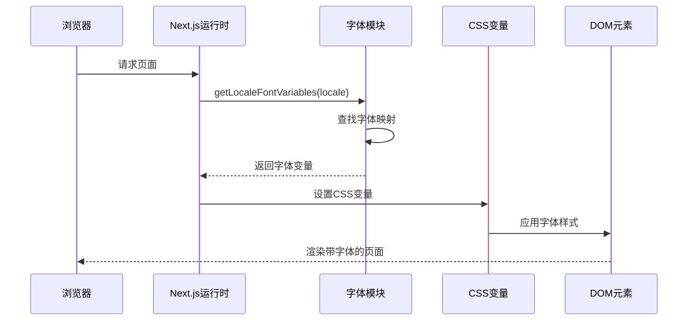

# 字体管理

<cite>
**本文档引用的文件**
- [src/lib/fonts.ts](file://src/lib/fonts.ts)
- [src/app/[locale]/layout.tsx](file://src/app/[locale]/layout.tsx)
- [src/app/globals.css](file://src/app/globals.css)
- [src/i18n/routing.ts](file://src/i18n/routing.ts)
- [src/components/shared/LanguageSwitcher.tsx](file://src/components/shared/LanguageSwitcher.tsx)
- [package.json](file://package.json)
</cite>

## 目录
1. [简介](#简介)
2. [项目结构](#项目结构)
3. [核心组件](#核心组件)
4. [架构概览](#架构概览)
5. [详细组件分析](#详细组件分析)
6. [依赖关系分析](#依赖关系分析)
7. [性能考虑](#性能考虑)
8. [故障排除指南](#故障排除指南)
9. [结论](#结论)

## 简介

Media Toolbox 项目采用了一套完整的国际化字体管理系统，支持多种语言环境下的字体渲染。该系统基于 Next.js 的现代字体优化技术，结合了本地化字体变量、CSS 变量回退机制和动态字体加载策略。

字体管理的核心目标是为不同语言用户提供最佳的阅读体验，同时确保性能优化和加载效率。系统支持从左到右（LTR）和从右到左（RTL）两种书写方向的语言环境。

## 项目结构

字体管理系统主要分布在以下关键文件中：

```mermaid
graph TB
subgraph "字体管理架构"
Fonts[src/lib/fonts.ts<br/>字体定义与配置]
Layout[src/app/[locale]/layout.tsx<br/>布局集成]
Globals[src/app/globals.css<br/>全局样式]
Routing[src/i18n/routing.ts<br/>语言路由配置]
Switcher[src/components/shared/LanguageSwitcher.tsx<br/>语言切换器]
end
subgraph "外部依赖"
NextFont[next/font/google<br/>Next.js字体优化]
TailwindCSS[Tailwind CSS<br/>样式框架]
NextIntl[next-intl<br/>国际化]
end
Fonts --> Layout
Layout --> Globals
Routing --> Layout
Switcher --> Layout
Fonts --> NextFont
Globals --> TailwindCSS
Layout --> NextIntl
```

**图表来源**
- [src/lib/fonts.ts:1-124](file://src/lib/fonts.ts#L1-L124)
- [src/app/[locale]/layout.tsx:1-71](file://src/app/[locale]/layout.tsx#L1-L71)
- [src/app/globals.css:1-133](file://src/app/globals.css#L1-L133)

**章节来源**
- [src/lib/fonts.ts:1-124](file://src/lib/fonts.ts#L1-L124)
- [src/app/[locale]/layout.tsx:1-71](file://src/app/[locale]/layout.tsx#L1-L71)
- [src/app/globals.css:1-133](file://src/app/globals.css#L1-L133)

## 核心组件

### 字体定义与配置

字体管理系统的核心是 `src/lib/fonts.ts` 文件，它定义了支持的各种字体变体：

| 字体类型 | 支持语言 | CSS 变量名 | 权重范围 |
|---------|---------|-----------|----------|
| Noto Sans SC | 中文简体 | `--font-noto-sans-sc` | 400, 500, 600, 700 |
| Noto Sans TC | 中文繁体 | `--font-noto-sans-tc` | 400, 500, 600, 700 |
| Noto Sans JP | 日语 | `--font-noto-sans-jp` | 400, 500, 600, 700 |
| Noto Sans KR | 韩语 | `--font-noto-sans-kr` | 400, 500, 600, 700 |
| Noto Sans Arabic | 阿拉伯语 | `--font-noto-sans-arabic` | 400, 500, 600, 700 |
| Noto Sans Devanagari | 北印度语 | `--font-noto-sans-devanagari` | 400, 500, 600, 700 |
| Noto Sans Thai | 泰语 | `--font-noto-sans-thai` | 400, 500, 600, 700 |

每个字体都配置了相同的优化参数：
- `preload: false` - 禁用预加载以提高初始加载性能
- `display: "swap"` - 使用字体交换策略避免闪烁
- `subsets: ["latin"]` - 仅包含拉丁字符集

**章节来源**
- [src/lib/fonts.ts:12-66](file://src/lib/fonts.ts#L12-L66)

### 布局集成

在 `src/app/[locale]/layout.tsx` 中，字体变量被集成到应用布局中：



**图表来源**
- [src/app/[locale]/layout.tsx:45-55](file://src/app/[locale]/layout.tsx#L45-L55)
- [src/lib/fonts.ts:116-123](file://src/lib/fonts.ts#L116-L123)

**章节来源**
- [src/app/[locale]/layout.tsx:45-55](file://src/app/[locale]/layout.tsx#L45-L55)

### 全局样式配置

`src/app/globals.css` 定义了字体变量的最终应用：



**图表来源**
- [src/app/globals.css:17-18](file://src/app/globals.css#L17-L18)
- [src/app/globals.css:59-63](file://src/app/globals.css#L59-L63)

**章节来源**
- [src/app/globals.css:17-18](file://src/app/globals.css#L17-L18)
- [src/app/globals.css:59-63](file://src/app/globals.css#L59-L63)

## 架构概览

字体管理系统采用分层架构设计，确保了良好的可维护性和扩展性：



**图表来源**
- [src/lib/fonts.ts:68-90](file://src/lib/fonts.ts#L68-L90)
- [src/i18n/routing.ts:3-8](file://src/i18n/routing.ts#L3-L8)

## 详细组件分析

### 字体变量映射系统

字体管理系统使用字典映射来关联语言代码和对应的字体变量：



**图表来源**
- [src/lib/fonts.ts:68-123](file://src/lib/fonts.ts#L68-L123)

### 语言路由配置

语言路由系统定义了支持的所有语言环境：

| 语言代码 | 语言名称 | 脚本方向 |
|---------|---------|---------|
| en | 英语 | LTR |
| zh-Hans | 简体中文 | LTR |
| zh-Hant | 繁體中文 | LTR |
| ja | 日语 | LTR |
| ko | 韩语 | LTR |
| es | 西班牙语 | LTR |
| fr | 法语 | LTR |
| de | 德语 | LTR |
| pt-BR | 巴西葡萄牙语 | LTR |
| pt-PT | 葡萄牙语 | LTR |
| th | 泰语 | LTR |
| vi | 越南语 | LTR |
| id | 印度尼西亚语 | LTR |
| hi | 北印度语 | LTR |
| ar | 阿拉伯语 | RTL |
| it | 意大利语 | LTR |
| nl | 荷兰语 | LTR |
| pl | 波兰语 | LTR |
| ru | 俄语 | LTR |
| tr | 土耳其语 | LTR |
| uk | 乌克兰语 | LTR |

**章节来源**
- [src/i18n/routing.ts:3-12](file://src/i18n/routing.ts#L3-L12)

### 字体加载流程

字体的加载和应用遵循以下流程：



**图表来源**
- [src/lib/fonts.ts:116-123](file://src/lib/fonts.ts#L116-L123)
- [src/app/[locale]/layout.tsx:45-55](file://src/app/[locale]/layout.tsx#L45-L55)

**章节来源**
- [src/lib/fonts.ts:116-123](file://src/lib/fonts.ts#L116-L123)
- [src/app/[locale]/layout.tsx:45-55](file://src/app/[locale]/layout.tsx#L45-L55)

## 依赖关系分析

字体管理系统与其他项目组件的依赖关系如下：

```mermaid
graph LR
subgraph "字体管理依赖"
FontsTS[src/lib/fonts.ts]
LayoutTSX[src/app/[locale]/layout.tsx]
GlobalsCSS[src/app/globals.css]
RoutingTS[src/i18n/routing.ts]
end
subgraph "外部依赖"
NextFontGoogle[next/font/google]
NextIntl[next-intl]
NextThemes[next-themes]
TailwindCSS[tailwindcss]
end
subgraph "组件依赖"
LanguageSwitcher[src/components/shared/LanguageSwitcher.tsx]
BaseLayout[src/components/layout/BaseLayout.tsx]
end
FontsTS --> NextFontGoogle
LayoutTSX --> FontsTS
LayoutTSX --> NextIntl
LayoutTSX --> NextThemes
GlobalsCSS --> TailwindCSS
LayoutTSX --> LanguageSwitcher
LanguageSwitcher --> RoutingTS
LayoutTSX --> BaseLayout
```

**图表来源**
- [package.json:11-32](file://package.json#L11-L32)
- [src/lib/fonts.ts:1-9](file://src/lib/fonts.ts#L1-L9)
- [src/app/[locale]/layout.tsx:1-10](file://src/app/[locale]/layout.tsx#L1-L10)

**章节来源**
- [package.json:11-32](file://package.json#L11-L32)
- [src/lib/fonts.ts:1-9](file://src/lib/fonts.ts#L1-L9)

## 性能考虑

字体管理系统在性能方面采用了多项优化策略：

### 加载优化
- **延迟加载**: 所有字体配置了 `preload: false`，避免阻塞初始页面渲染
- **字体交换**: 使用 `display: "swap"` 策略，确保文本快速显示而不等待字体加载
- **按需加载**: 仅对支持的语言加载相应的字体变体

### 缓存策略
- **CDN 分发**: 字体文件通过 CDN 提供，利用浏览器缓存机制
- **版本控制**: 字体文件包含版本信息，便于缓存失效管理

### 内存优化
- **最小化变量**: 仅定义必要的 CSS 变量，减少内存占用
- **条件加载**: 未使用的字体不会被加载到客户端

## 故障排除指南

### 常见问题及解决方案

#### 字体不显示问题
**症状**: 页面文字显示为默认字体而非自定义字体
**可能原因**:
1. 字体变量未正确设置到 HTML 元素
2. CSS 变量未正确应用到字体属性
3. 字体文件加载失败

**解决步骤**:
1. 检查 `getLocaleFontVariables` 函数返回值
2. 验证 HTML 元素是否包含字体类名
3. 确认 CSS 变量 `--font-locale-sans` 是否正确设置

#### 字体闪烁问题
**症状**: 页面加载时文本先显示默认字体，然后突然变为自定义字体
**解决方案**:
1. 确保 `display: "swap"` 配置正确
2. 检查字体预加载策略
3. 验证字体文件的完整性和可用性

#### RTL 语言显示问题
**症状**: 阿拉伯语等从右到左语言显示异常
**检查点**:
1. 确认 `rtlLocales` 数组包含正确的语言代码
2. 验证 `dir="rtl"` 属性是否正确设置
3. 检查 CSS 方向相关的样式规则

**章节来源**
- [src/app/[locale]/layout.tsx:46](file://src/app/[locale]/layout.tsx#L46)
- [src/i18n/routing.ts:12](file://src/i18n/routing.ts#L12)

## 结论

Media Toolbox 的字体管理系统展现了现代 Web 应用在国际化字体处理方面的最佳实践。通过精心设计的分层架构、优化的加载策略和完善的错误处理机制，系统为全球用户提供了流畅且一致的阅读体验。

该系统的成功关键在于：

1. **模块化设计**: 将字体配置、布局集成和样式应用分离，提高了代码的可维护性
2. **性能优先**: 采用延迟加载和字体交换策略，确保快速的页面渲染
3. **国际化支持**: 完整支持多种语言环境，包括 RTL 语言
4. **可扩展性**: 易于添加新的字体变体和语言支持

未来可以考虑的改进方向包括：
- 实现字体子集化以进一步减少文件大小
- 添加字体加载状态监控和错误报告
- 优化移动端字体渲染性能
- 实现字体预加载策略以提升用户体验