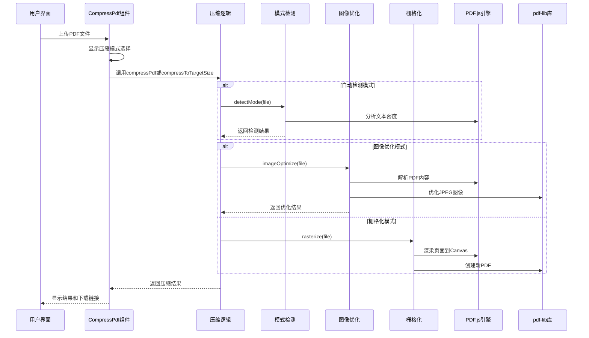
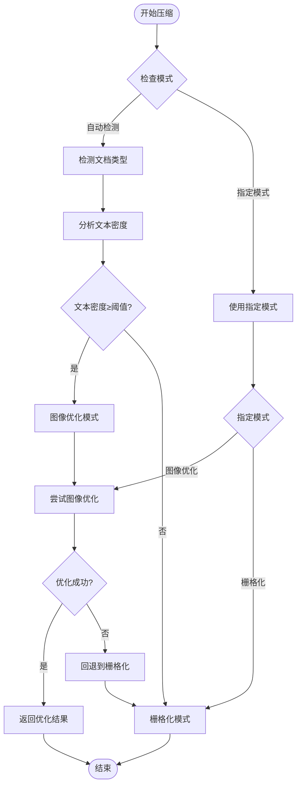
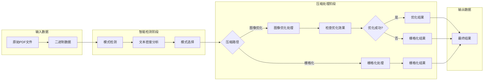
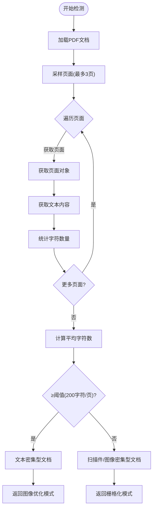
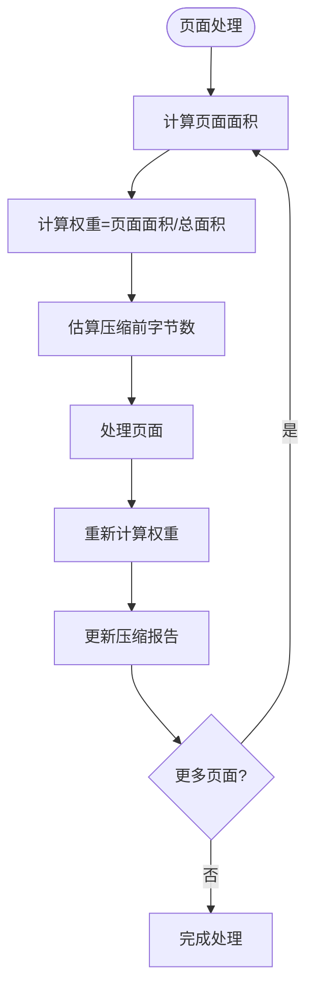
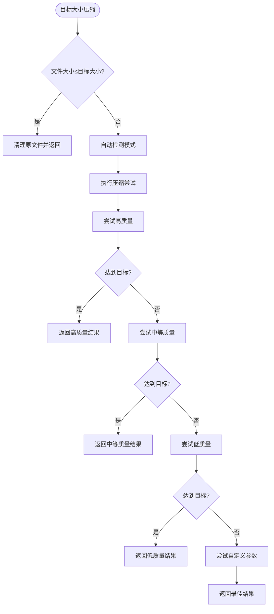

# PDF压缩工具

<cite>
**本文档引用的文件**
- [CompressPdf.tsx](file://src/tools/pdf/compress/CompressPdf.tsx)
- [logic.ts](file://src/tools/pdf/compress/logic.ts)
- [detectMode.ts](file://src/tools/pdf/compress/detectMode.ts)
- [rasterize.ts](file://src/tools/pdf/compress/rasterize.ts)
- [imageOptimize.ts](file://src/tools/pdf/compress/imageOptimize.ts)
- [targetSize.ts](file://src/tools/pdf/compress/targetSize.ts)
- [types.ts](file://src/tools/pdf/compress/types.ts)
- [cleanup.ts](file://src/tools/pdf/compress/cleanup.ts)
- [pdfjs.ts](file://src/lib/pdfjs.ts)
- [package.json](file://package.json)
- [tools-pdf.json](file://messages/en/tools-pdf.json)
- [tools-pdf.json (中文)](file://messages/zh-Hans/tools-pdf.json)
</cite>

## 更新摘要
**所做更改**
- 新增智能模式检测功能，自动识别文档类型并选择最优压缩策略
- 实现栅格化优化算法，提供更精细的图像压缩控制
- 添加目标大小计算功能，支持按指定大小精确压缩
- 扩展压缩模式选项，新增自动检测、图像优化和栅格化三种模式
- 增强压缩报告功能，提供详细的压缩效果统计
- 优化用户界面，支持预设模式和目标大小两种压缩方式

## 目录
1. [简介](#简介)
2. [项目结构](#项目结构)
3. [核心组件](#核心组件)
4. [架构概览](#架构概览)
5. [详细组件分析](#详细组件分析)
6. [智能模式检测](#智能模式检测)
7. [栅格化优化算法](#栅格化优化算法)
8. [目标大小计算](#目标大小计算)
9. [压缩报告系统](#压缩报告系统)
10. [依赖分析](#依赖分析)
11. [性能考虑](#性能考虑)
12. [故障排除指南](#故障排除指南)
13. [结论](#结论)
14. [附录](#附录)

## 简介

PDF压缩工具是一个基于浏览器的PDF文件压缩解决方案，现已升级为支持智能压缩模式检测、栅格化优化和目标大小计算的高级压缩工具。该工具通过重新渲染PDF页面为JPEG图像来实现文件大小缩减，同时提供三种智能压缩模式：自动检测、图像优化和栅格化。

工具的核心优势包括：
- **智能压缩模式**：自动检测文档类型并选择最优压缩策略
- **双重压缩方式**：支持预设质量级别和目标大小两种压缩模式
- **精细化控制**：提供自定义DPI和JPEG质量参数
- **压缩报告**：详细显示压缩效果和节省空间统计
- **隐私保护**：所有处理过程完全在本地浏览器中进行

## 项目结构

PDF压缩工具采用模块化架构设计，包含智能检测、栅格化处理、图像优化和目标大小计算等核心功能模块：

```mermaid
graph TB
subgraph "PDF压缩工具模块"
subgraph "智能检测模块"
DM[detectMode.ts<br/>智能模式检测]
TS[targetSize.ts<br/>目标大小计算]
END
subgraph "压缩处理模块"
LG[logic.ts<br/>压缩逻辑协调]
RA[rasterize.ts<br/>栅格化压缩]
IO[imageOptimize.ts<br/>图像优化]
END
subgraph "用户界面模块"
CP[CompressPdf.tsx<br/>主界面组件]
TY[types.ts<br/>类型定义]
CL[cleanup.ts<br/>清理优化]
END
subgraph "支持模块"
PDFJS[pdfjs.ts<br/>PDF.js封装]
END
end
DM --> LG
TS --> LG
LG --> RA
LG --> IO
CP --> LG
CP --> DM
CP --> TS
LG --> CL
```

**图表来源**
- [CompressPdf.tsx:1-623](file://src/tools/pdf/compress/CompressPdf.tsx#L1-L623)
- [logic.ts:1-54](file://src/tools/pdf/compress/logic.ts#L1-L54)
- [detectMode.ts:1-49](file://src/tools/pdf/compress/detectMode.ts#L1-L49)
- [rasterize.ts:1-129](file://src/tools/pdf/compress/rasterize.ts#L1-L129)
- [imageOptimize.ts:1-239](file://src/tools/pdf/compress/imageOptimize.ts#L1-L239)
- [targetSize.ts:1-117](file://src/tools/pdf/compress/targetSize.ts#L1-L117)
- [types.ts:1-51](file://src/tools/pdf/compress/types.ts#L1-L51)
- [cleanup.ts:1-25](file://src/tools/pdf/compress/cleanup.ts#L1-L25)

**章节来源**
- [CompressPdf.tsx:1-623](file://src/tools/pdf/compress/CompressPdf.tsx#L1-L623)
- [logic.ts:1-54](file://src/tools/pdf/compress/logic.ts#L1-L54)
- [types.ts:1-51](file://src/tools/pdf/compress/types.ts#L1-L51)

## 核心组件

### 压缩模式配置

工具现在提供三种智能压缩模式：

| 压缩模式 | 自动检测 | 图像优化 | 栅格化 |
|---------|---------|---------|--------|
| **自动检测 (auto)** | 智能分析文档类型 | 文档类型：文本为主 | 文档类型：扫描件/图像为主 |
| **图像优化 (image-optimize)** | 基于文本密度阈值 | 高质量压缩，保留文字清晰度 | 降级处理，转为栅格化 |
| **栅格化 (rasterize)** | 固定选择栅格化 | 固定选择图像优化 | 标准栅格化压缩 |

### 压缩级别配置

支持四种压缩级别，每种都有特定的质量参数：

| 压缩级别 | DPI设置 | JPEG质量 | 适用场景 |
|---------|---------|---------|----------|
| 高质量 (high) | 108 DPI | 0.8 | 需要保持较高视觉质量的文档 |
| 中等 (medium) | 72 DPI | 0.6 | 平衡质量和文件大小的通用场景 |
| 低质量 (low) | 54 DPI | 0.4 | 追求最大压缩比的场景 |
| 自定义 (custom) | 可调DPI | 可调质量 | 高级用户精细控制需求 |

### 用户界面组件

主要界面组件负责处理用户交互和状态管理：

- **文件上传区**：支持拖拽上传PDF文件
- **压缩模式选择**：单选按钮组选择压缩模式
- **压缩方式选择**：预设模式 vs 目标大小模式
- **质量选择器**：支持四种压缩级别
- **自定义参数**：DPI和JPEG质量滑块
- **进度指示器**：显示压缩进度条和迭代信息
- **结果展示区**：显示原始大小、压缩后大小和节省百分比
- **压缩报告**：详细显示压缩效果统计
- **下载按钮**：提供压缩后的PDF文件下载

**章节来源**
- [CompressPdf.tsx:31-623](file://src/tools/pdf/compress/CompressPdf.tsx#L31-L623)
- [types.ts:1-51](file://src/tools/pdf/compress/types.ts#L1-L51)

## 架构概览

PDF压缩工具采用分层架构设计，支持智能模式检测和双重压缩方式：



**图表来源**
- [CompressPdf.tsx:147-214](file://src/tools/pdf/compress/CompressPdf.tsx#L147-L214)
- [logic.ts:24-51](file://src/tools/pdf/compress/logic.ts#L24-L51)
- [detectMode.ts:12-48](file://src/tools/pdf/compress/detectMode.ts#L12-L48)
- [imageOptimize.ts:151-238](file://src/tools/pdf/compress/imageOptimize.ts#L151-L238)
- [rasterize.ts:27-128](file://src/tools/pdf/compress/rasterize.ts#L27-L128)

## 详细组件分析

### 压缩算法实现

#### 智能模式检测流程

压缩算法的核心流程包括智能模式检测和双路径处理：

1. **模式检测**：使用文本密度分析确定文档类型
2. **路径选择**：根据检测结果选择最优压缩路径
3. **图像优化**：优先尝试图像优化，失败时回退到栅格化
4. **栅格化处理**：标准的页面重渲染压缩
5. **结果评估**：比较压缩效果，必要时使用原文件



**图表来源**
- [logic.ts:24-51](file://src/tools/pdf/compress/logic.ts#L24-L51)
- [detectMode.ts:12-48](file://src/tools/pdf/compress/detectMode.ts#L12-L48)
- [imageOptimize.ts:151-238](file://src/tools/pdf/compress/imageOptimize.ts#L151-L238)
- [rasterize.ts:27-128](file://src/tools/pdf/compress/rasterize.ts#L27-L128)

#### 质量平衡算法

压缩算法通过多个参数实现质量平衡：

1. **DPI缩放比例**：控制Canvas的分辨率
   - 高质量：108 DPI，1.5倍缩放
   - 中等质量：72 DPI，1.0倍缩放
   - 低质量：54 DPI，0.75倍缩放
   - 自定义：可调DPI，范围72-200

2. **JPEG质量因子**：控制图像压缩强度
   - 高质量：0.8质量因子
   - 中等质量：0.6质量因子
   - 低质量：0.4质量因子
   - 自定义：10-95%质量范围

3. **图像优化阈值**：最小优化尺寸64像素
   - 防止过度压缩小图像
   - 保持图像可读性

**章节来源**
- [rasterize.ts:11-25](file://src/tools/pdf/compress/rasterize.ts#L11-L25)
- [imageOptimize.ts:10-31](file://src/tools/pdf/compress/imageOptimize.ts#L10-L31)
- [imageOptimize.ts:16-16](file://src/tools/pdf/compress/imageOptimize.ts#L16-L16)

### 数据流分析

#### 智能压缩流程数据流



**图表来源**
- [detectMode.ts:12-48](file://src/tools/pdf/compress/detectMode.ts#L12-L48)
- [imageOptimize.ts:151-238](file://src/tools/pdf/compress/imageOptimize.ts#L151-L238)
- [rasterize.ts:27-128](file://src/tools/pdf/compress/rasterize.ts#L27-L128)

#### 错误处理机制

工具实现了多层次的错误处理：

1. **文件验证**：检查上传的文件是否为PDF格式
2. **Canvas渲染失败**：捕获Canvas导出异常
3. **内存不足**：处理大文件时的内存限制
4. **模式检测失败**：回退到默认压缩模式
5. **进度回调**：提供实时进度反馈
6. **用户取消**：支持中断压缩过程

**章节来源**
- [CompressPdf.tsx:114-116](file://src/tools/pdf/compress/CompressPdf.tsx#L114-L116)
- [logic.ts:32-38](file://src/tools/pdf/compress/logic.ts#L32-L38)

## 智能模式检测

### 文本密度分析算法

智能模式检测通过分析PDF文档的文本密度来确定最优压缩策略：



**图表来源**
- [detectMode.ts:12-48](file://src/tools/pdf/compress/detectMode.ts#L12-L48)

### 检测阈值和准确性

- **文本密度阈值**：200字符/页
- **采样页面数量**：最多3页，自动根据页数调整
- **检测精度**：基于页面文本统计的平均值
- **适用场景**：
  - 文本密集型：学术论文、报告、合同
  - 图像密集型：扫描文档、照片、图表

**章节来源**
- [detectMode.ts:4-10](file://src/tools/pdf/compress/detectMode.ts#L4-L10)
- [detectMode.ts:22-44](file://src/tools/pdf/compress/detectMode.ts#L22-L44)

## 栅格化优化算法

### 高级栅格化处理

栅格化压缩算法提供了更精细的控制和优化：

#### 预设配置映射

| 压缩级别 | DPI设置 | JPEG质量 | 缩放比例 |
|---------|---------|---------|---------|
| 高质量 | 108 DPI | 0.8 | 1.5× |
| 中等 | 72 DPI | 0.6 | 1.0× |
| 低质量 | 54 DPI | 0.4 | 0.75× |

#### 页面面积加权估计

为了提供更准确的压缩效果预估，算法使用页面面积加权：



**图表来源**
- [rasterize.ts:45-97](file://src/tools/pdf/compress/rasterize.ts#L45-L97)

#### 回退机制

当压缩效果不佳时，算法会自动回退到原文件：

- **回退阈值**：95% (FALLBACK_THRESHOLD)
- **触发条件**：压缩后文件大小 ≥ 原文件大小 × 0.95
- **回退策略**：应用清理选项后返回原文件

**章节来源**
- [rasterize.ts:110-117](file://src/tools/pdf/compress/rasterize.ts#L110-L117)
- [cleanup.ts:4](file://src/tools/pdf/compress/cleanup.ts#L4)

## 目标大小计算

### 自适应压缩算法

目标大小计算功能通过多次尝试不同的压缩参数来达到目标大小：



**图表来源**
- [targetSize.ts:58-116](file://src/tools/pdf/compress/targetSize.ts#L58-L116)

### 压缩尝试序列

系统按以下顺序执行压缩尝试：

1. **高质量**：标准高质量设置
2. **中等质量**：标准中等质量设置  
3. **低质量**：标准低质量设置
4. **自定义参数**：DPI=72，JPEG质量=30%

每次尝试都会记录最佳结果，一旦达到目标大小就立即返回。

**章节来源**
- [targetSize.ts:26-31](file://src/tools/pdf/compress/targetSize.ts#L26-L31)
- [targetSize.ts:89-112](file://src/tools/pdf/compress/targetSize.ts#L89-L112)

## 压缩报告系统

### 详细统计信息

压缩报告系统提供详细的压缩效果统计：

#### 报告项目结构

每个压缩项目包含以下信息：

| 字段 | 描述 | 示例 |
|------|------|------|
| **index** | 项目索引 | 1, 2, 3... |
| **label** | 项目标签 | "page-1", "image-1" |
| **beforeBytes** | 压缩前字节数 | 1048576 |
| **afterBytes** | 压缩后字节数 | 524288 |

#### 统计计算

报告系统自动计算：

1. **节省百分比**：`(beforeBytes - afterBytes) / beforeBytes × 100%`
2. **最大节省项**：按节省字节数排序的前N项
3. **可视化展示**：使用进度条显示压缩效果

#### 报告展示

用户界面提供交互式报告：

- **折叠/展开**：控制报告显示
- **Top-N显示**：默认显示前10项
- **百分比可视化**：彩色进度条显示压缩程度
- **详细信息**：鼠标悬停显示具体数值

**章节来源**
- [types.ts:4-13](file://src/tools/pdf/compress/types.ts#L4-L13)
- [CompressPdf.tsx:544-610](file://src/tools/pdf/compress/CompressPdf.tsx#L544-L610)

## 依赖分析

### 核心依赖关系

PDF压缩工具依赖于以下关键库：

```mermaid
graph TB
subgraph "工具层"
CP[CompressPdf.tsx]
LG[logic.ts]
DM[detectMode.ts]
TS[targetSize.ts]
RA[rasterize.ts]
IO[imageOptimize.ts]
TY[types.ts]
CL[cleanup.ts]
end
subgraph "PDF处理库"
PDFJS[pdfjs-dist]
PDFLIB[pdf-lib]
END
subgraph "工具库"
FFLATE[fflate]
CLSX[clsx]
LUCIDE[lucide-react]
NEXT[next]
TSC[TypeScript]
END
subgraph "构建系统"
PKG[package.json]
END
CP --> LG
LG --> DM
LG --> TS
LG --> RA
LG --> IO
LG --> CL
DM --> PDFJS
TS --> PDFJS
RA --> PDFJS
RA --> PDFLIB
IO --> PDFLIB
CP --> TY
CP --> CL
CP --> LUCIDE
LG --> NEXT
LG --> TSC
```

**图表来源**
- [package.json:11-32](file://package.json#L11-L32)

### 依赖特性分析

#### pdfjs-dist (版本 5.5.207)
- **职责**：PDF文档解析和页面渲染
- **特性**：支持最新的PDF格式，高性能渲染引擎
- **集成方式**：动态导入，延迟初始化
- **使用场景**：智能检测、页面渲染、文本提取

#### pdf-lib (版本 1.17.1)
- **职责**：PDF文档创建和编辑
- **特性**：纯JavaScript实现，支持多种PDF特性
- **集成方式**：标准ES6模块导入
- **使用场景**：图像嵌入、PDF重建、元数据清理

#### lucide-react (版本 0.446.0)
- **职责**：图标组件库
- **特性**：轻量级SVG图标，支持主题切换
- **使用场景**：用户界面图标，状态指示

**章节来源**
- [package.json:25-26](file://package.json#L25-L26)

## 性能考虑

### 内存管理优化

压缩工具在处理大文件时采用了多项内存优化策略：

1. **Canvas内存释放**：在图像导出后立即释放Canvas内存
2. **渐进式处理**：逐页处理，避免一次性加载整个文档
3. **垃圾回收触发**：在关键节点手动触发垃圾回收
4. **页面面积加权**：减少内存峰值使用
5. **智能回退**：避免不必要的处理

### 处理速度优化

1. **并行处理**：页面间处理可以并行进行
2. **缓存机制**：PDF.js worker实例复用
3. **增量更新**：进度信息实时更新，用户体验流畅
4. **智能检测**：快速确定最优压缩路径
5. **目标大小优化**：早期退出机制

### 内存使用模式


## 故障排除指南

### 常见问题及解决方案

#### PDF文件无法加载
**症状**：上传PDF后无响应或报错
**原因**：
- PDF格式不支持
- 文件损坏
- 浏览器兼容性问题

**解决方案**：
1. 尝试使用其他PDF查看器打开文件
2. 检查文件是否完整
3. 切换到支持更好的浏览器

#### 压缩过程卡住
**症状**：进度条停止不动
**原因**：
- 文件过大导致内存不足
- Canvas渲染超时
- 网络连接问题

**解决方案**：
1. 关闭其他占用内存的程序
2. 降低压缩质量级别
3. 分批处理大文件

#### 压缩后文件质量差
**症状**：压缩后的PDF质量明显下降
**原因**：
- JPEG质量设置过低
- 缩放比例不合适
- 原始PDF分辨率过高

**解决方案**：
1. 提高压缩质量级别
2. 调整缩放比例
3. 考虑使用专业的PDF压缩工具

#### 智能检测不准确
**症状**：自动选择的压缩模式不适合
**原因**：
- 文档类型复杂
- 文本密度接近阈值
- 检测样本不足

**解决方案**：
1. 手动选择压缩模式
2. 调整检测阈值
3. 使用图像优化模式

**章节来源**
- [CompressPdf.tsx:216-259](file://src/tools/pdf/compress/CompressPdf.tsx#L216-L259)

## 结论

PDF压缩工具经过重大升级，现已发展为功能完善的智能压缩解决方案。主要改进包括：

1. **智能模式检测**：通过文本密度分析自动选择最优压缩策略
2. **栅格化优化**：提供更精细的图像压缩控制和质量平衡
3. **目标大小计算**：支持按指定大小精确压缩，满足特定需求
4. **增强的用户界面**：提供预设模式和目标大小两种压缩方式
5. **详细的压缩报告**：帮助用户了解压缩效果和节省空间

该工具在保持隐私保护特性的基础上，显著提升了压缩效果和用户体验。对于需要更高级压缩功能的用户，可以考虑集成专业的PDF压缩库如pdfcpu，以实现更精细的压缩控制和更高的压缩效率。

## 附录

### 压缩级别详细说明

| 压缩级别 | 推荐使用场景 | 预期压缩比 | 质量影响 | 适用文档类型 |
|---------|-------------|-----------|----------|-------------|
| 高质量 | 重要文档、报告、证书 | 20-40% | 几乎无质量损失 | 文本密集型文档 |
| 中等 | 日常文档、邮件附件 | 40-60% | 轻微质量损失 | 混合内容文档 |
| 低质量 | 大型文档、存储归档 | 60-80% | 可感知质量损失 | 图像密集型文档 |
| 自定义 | 高级用户、特殊需求 | 可变 | 可定制 | 所有类型文档 |

### 压缩模式选择指南

#### 自动检测模式
- **适用场景**：不确定文档类型或希望获得最佳结果
- **优点**：智能化程度高，无需用户判断
- **缺点**：可能需要额外的检测时间

#### 图像优化模式
- **适用场景**：文本为主的高质量文档
- **优点**：保持文字清晰度，压缩效果好
- **缺点**：对图像文档效果有限

#### 栅格化模式
- **适用场景**：扫描件、图像为主的文档
- **优点**：压缩率高，处理速度快
- **缺点**：文字质量可能下降

### 集成建议

对于需要更专业PDF压缩功能的场景，建议考虑以下集成方案：

1. **pdfcpu集成**：支持更精细的压缩控制
2. **Apache PDFBox**：Java生态系统的专业PDF处理
3. **Ghostscript**：命令行PDF处理工具
4. **ImageMagick**：多格式图像处理工具

### 用户反馈机制

工具提供了完整的用户反馈机制：

1. **进度显示**：实时显示处理进度
2. **结果对比**：显示压缩前后的文件大小对比
3. **压缩报告**：详细显示压缩效果统计
4. **错误提示**：友好的错误信息显示
5. **FAQ支持**：内置常见问题解答
6. **智能检测说明**：解释自动选择的原因
7. **回退机制**：确保压缩效果不会恶化