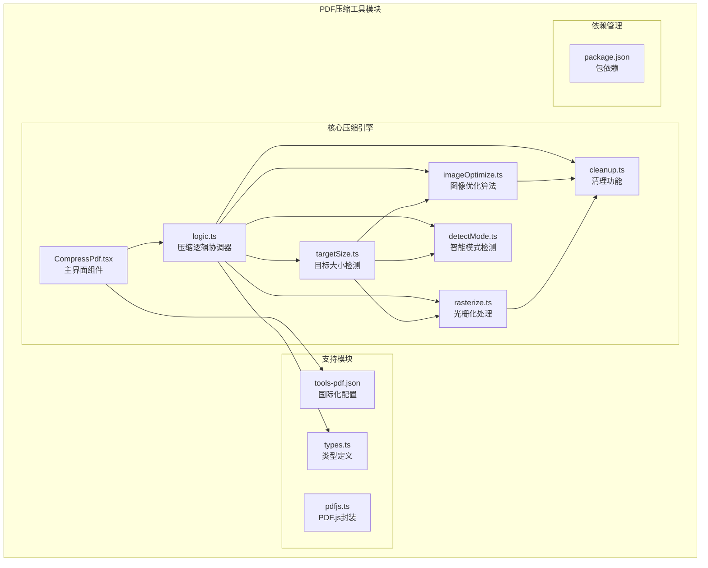
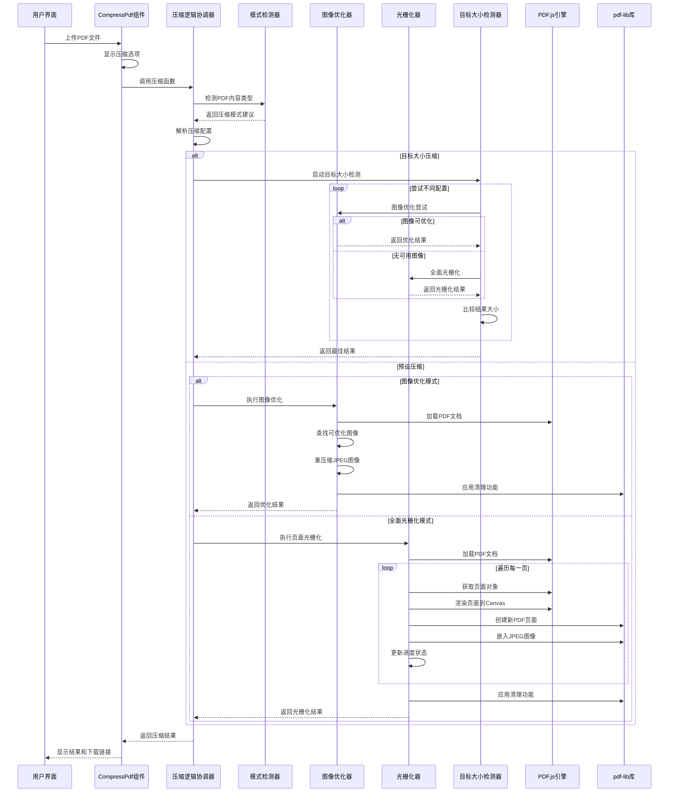
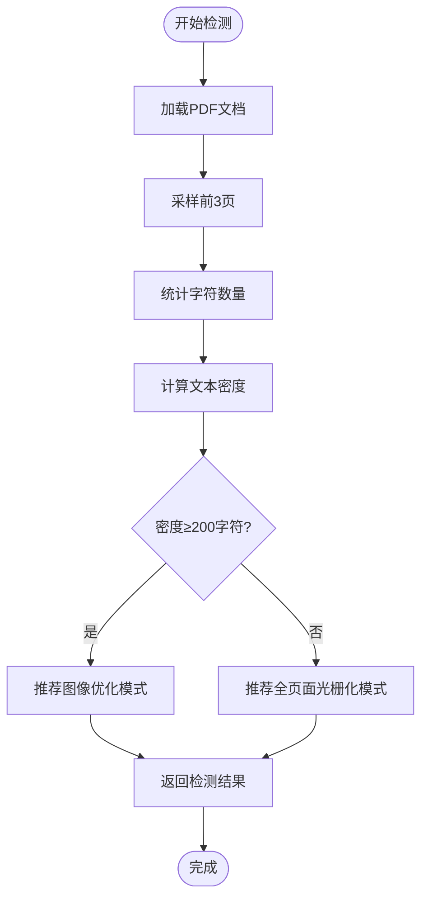
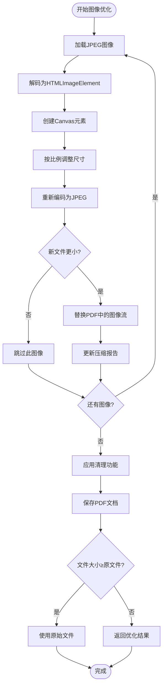
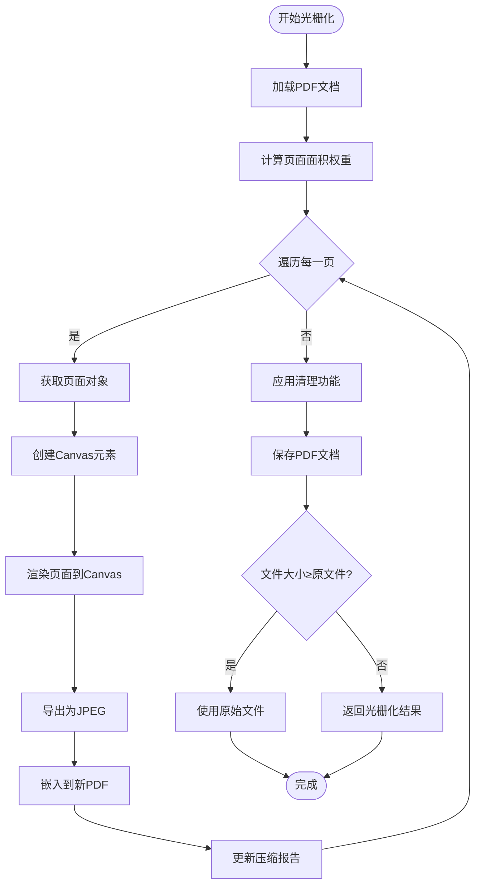
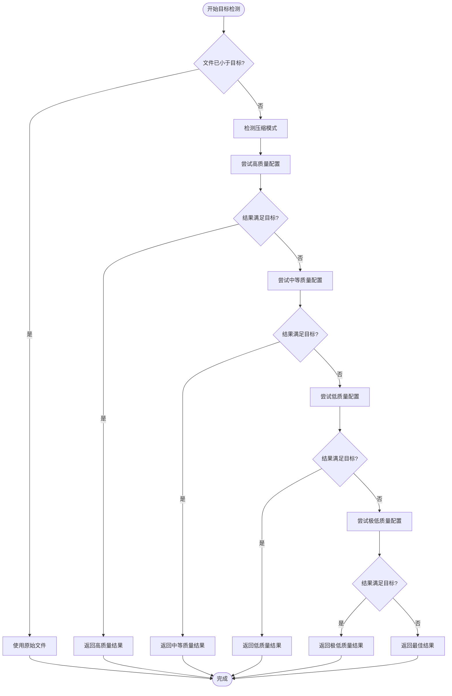
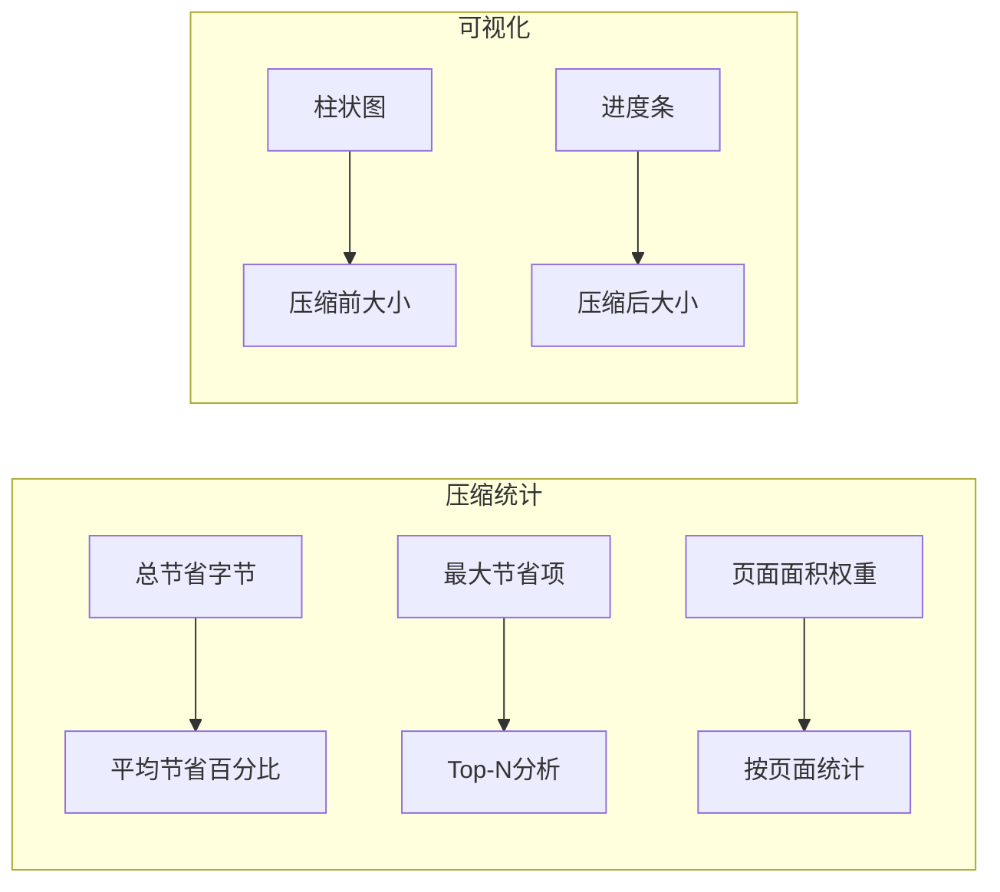
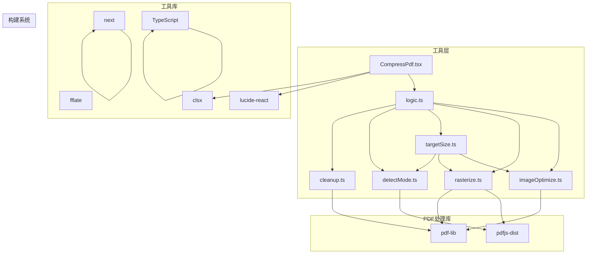
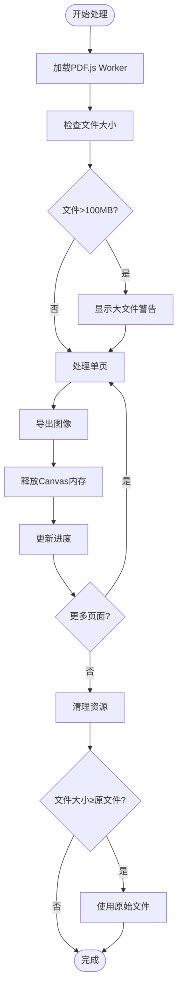

# PDF压缩工具

<cite>
**本文档引用的文件**
- [CompressPdf.tsx](file://src/tools/pdf/compress/CompressPdf.tsx)
- [logic.ts](file://src/tools/pdf/compress/logic.ts)
- [imageOptimize.ts](file://src/tools/pdf/compress/imageOptimize.ts)
- [rasterize.ts](file://src/tools/pdf/compress/rasterize.ts)
- [targetSize.ts](file://src/tools/pdf/compress/targetSize.ts)
- [detectMode.ts](file://src/tools/pdf/compress/detectMode.ts)
- [cleanup.ts](file://src/tools/pdf/compress/cleanup.ts)
- [types.ts](file://src/tools/pdf/compress/types.ts)
- [pdfjs.ts](file://src/lib/pdfjs.ts)
- [package.json](file://package.json)
- [tools-pdf.json](file://messages/en/tools-pdf.json)
- [tools-pdf.json (中文)](file://messages/zh-Hans/tools-pdf.json)
</cite>

## 更新摘要
**变更内容**
- 新增图像优化算法，支持嵌入JPEG图像的直接重压缩
- 新增目标大小检测功能，支持按指定大小自动压缩
- 新增智能模式检测，自动选择最适合的压缩策略
- 新增光栅化处理，支持高质量页面重渲染
- 新增清理功能，支持元数据移除和回退机制
- 扩展压缩级别配置，支持自定义DPI和JPEG质量
- 新增压缩报告和详细统计功能

## 目录
1. [简介](#简介)
2. [项目结构](#项目结构)
3. [核心组件](#核心组件)
4. [架构概览](#架构概览)
5. [详细组件分析](#详细组件分析)
6. [高级功能](#高级功能)
7. [依赖分析](#依赖分析)
8. [性能考虑](#性能考虑)
9. [故障排除指南](#故障排除指南)
10. [结论](#结论)
11. [附录](#附录)

## 简介

PDF压缩工具是一个基于浏览器的PDF文件压缩解决方案，现已升级为支持多种高级压缩策略的综合工具。该工具通过智能算法自动选择最适合的压缩模式，包括图像优化和全页面光栅化，确保在文件大小和视觉质量之间达到最佳平衡。

**核心功能更新**：
- **智能压缩模式**：自动检测PDF内容类型并选择最优压缩策略
- **图像优化**：直接重压缩嵌入的JPEG图像，保持文本可搜索性
- **目标大小压缩**：按指定大小自动调整压缩参数
- **高级自定义**：支持DPI和JPEG质量的精细调节
- **压缩报告**：提供详细的压缩统计和优化建议

该工具采用纯前端技术栈，确保用户隐私和数据安全，所有处理过程都在用户的浏览器中完成，无需上传到服务器。

## 项目结构

PDF压缩工具位于项目的PDF工具模块中，现已扩展为支持多种压缩策略的完整解决方案：

**图表来源**
- [CompressPdf.tsx:1-623](file://src/tools/pdf/compress/CompressPdf.tsx#L1-L623)
- [logic.ts:1-54](file://src/tools/pdf/compress/logic.ts#L1-L54)
- [imageOptimize.ts:1-239](file://src/tools/pdf/compress/imageOptimize.ts#L1-L239)
- [rasterize.ts:1-129](file://src/tools/pdf/compress/rasterize.ts#L1-L129)
- [targetSize.ts:1-117](file://src/tools/pdf/compress/targetSize.ts#L1-L117)
- [detectMode.ts:1-49](file://src/tools/pdf/compress/detectMode.ts#L1-L49)
- [cleanup.ts:1-25](file://src/tools/pdf/compress/cleanup.ts#L1-L25)

**章节来源**
- [CompressPdf.tsx:1-623](file://src/tools/pdf/compress/CompressPdf.tsx#L1-L623)
- [logic.ts:1-54](file://src/tools/pdf/compress/logic.ts#L1-L54)
- [types.ts:1-51](file://src/tools/pdf/compress/types.ts#L1-L51)

## 核心组件

### 压缩模式配置

工具现支持三种智能压缩模式，每种都有特定的适用场景：

| 压缩模式 | 适用场景 | 技术特点 | 质量影响 |
|---------|----------|----------|----------|
| **智能自动** (auto) | 未知内容类型 | 自动检测PDF类型并选择最优模式 | 自动平衡 |
| **图像优化** (image-optimize) | 图像丰富、文本可搜索 | 直接重压缩嵌入JPEG，保持文本层 | 几乎无损失 |
| **全页面光栅化** (rasterize) | 扫描文档、图像为主 | 重新渲染为JPEG，适合扫描件 | 中等质量损失 |

### 压缩级别和自定义配置

扩展的压缩配置系统：

| 压缩级别 | DPI设置 | JPEG质量 | 适用场景 |
|---------|---------|---------|----------|
| 高质量 (high) | 108 DPI | 0.8 | 重要文档、报告、证书 |
| 中等 (medium) | 72 DPI | 0.6 | 日常文档、邮件附件 |
| 低质量 (low) | 54 DPI | 0.4 | 大型文档、存储归档 |
| 自定义 (custom) | 可调DPI | 可调质量 | 专业需求、特殊用途 |

### 目标大小压缩功能

**新增** 支持按指定大小压缩PDF：

- **目标大小检测**：自动尝试多个压缩配置直到达到目标大小
- **迭代优化**：最多尝试4个预设配置，返回最接近目标的结果
- **进度反馈**：实时显示尝试次数和当前质量级别
- **结果标记**：明确标注是否达到目标大小

**章节来源**
- [CompressPdf.tsx:35-42](file://src/tools/pdf/compress/CompressPdf.tsx#L35-L42)
- [types.ts:1-51](file://src/tools/pdf/compress/types.ts#L1-L51)

## 架构概览

PDF压缩工具采用分层架构设计，现已扩展为支持多种压缩策略的智能系统：

**图表来源**
- [CompressPdf.tsx:147-214](file://src/tools/pdf/compress/CompressPdf.tsx#L147-L214)
- [logic.ts:24-51](file://src/tools/pdf/compress/logic.ts#L24-L51)
- [targetSize.ts:58-116](file://src/tools/pdf/compress/targetSize.ts#L58-L116)

## 详细组件分析

### 智能模式检测算法

**新增** 智能模式检测系统能够自动分析PDF内容并选择最优压缩策略：

**检测阈值**：文本密度≥200字符/页时推荐图像优化，否则推荐光栅化

**章节来源**
- [detectMode.ts:12-48](file://src/tools/pdf/compress/detectMode.ts#L12-L48)

### 图像优化算法实现

**新增** 高级图像优化功能，专门处理嵌入的JPEG图像：

#### 图像候选收集

算法会扫描PDF中的所有图像对象，筛选出可优化的目标：

1. **类型检查**：只处理JPEG格式的图像
2. **尺寸过滤**：忽略过小的图像（<64像素）
3. **颜色空间识别**：支持DeviceRGB和DeviceGray
4. **质量评估**：计算重压缩后的潜在收益

#### 重压缩流程

**质量参数**：
- **缩放比例**：根据DPI计算，最高1.0
- **JPEG质量**：0.45-0.85范围内的自适应质量
- **最小尺寸**：64像素的边界条件

**章节来源**
- [imageOptimize.ts:151-238](file://src/tools/pdf/compress/imageOptimize.ts#L151-L238)

### 全面光栅化处理

扩展的光栅化功能提供高质量的页面重渲染：

#### 光栅化配置

| 预设级别 | DPI设置 | JPEG质量 | 适用场景 |
|---------|---------|---------|----------|
| 高质量 | 108 DPI | 0.8 | 重要文档、高分辨率要求 |
| 中等 | 72 DPI | 0.6 | 标准文档、平衡质量与大小 |
| 低质量 | 54 DPI | 0.4 | 大型文档、存储优化 |

#### 页面处理流程

**章节来源**
- [rasterize.ts:27-128](file://src/tools/pdf/compress/rasterize.ts#L27-L128)

## 高级功能

### 目标大小检测系统

**新增** 智能的目标大小压缩功能：

#### 尝试策略

系统按优先级尝试以下配置组合：

1. **高质量**：DPI=108，JPEG质量=0.8
2. **中等质量**：DPI=72，JPEG质量=0.6  
3. **低质量**：DPI=54，JPEG质量=0.4
4. **极低质量**：DPI=72，JPEG质量=0.3（自定义）

#### 迭代优化流程

**章节来源**
- [targetSize.ts:58-116](file://src/tools/pdf/compress/targetSize.ts#L58-L116)

### 压缩报告系统

**新增** 详细的压缩统计和分析功能：

#### 报告内容

- **项目列表**：每个页面或图像的压缩详情
- **字节对比**：压缩前后的文件大小对比
- **节省百分比**：计算压缩效果
- **权重分配**：基于页面面积的比例估算

#### 统计分析

**章节来源**
- [CompressPdf.tsx:544-609](file://src/tools/pdf/compress/CompressPdf.tsx#L544-L609)

### 清理和回退机制

**新增** 智能的清理和回退功能：

#### 清理选项

- **元数据移除**：清除标题、作者、主题、关键词等
- **生产者信息**：移除工具标识和版本信息
- **时间戳清理**：移除创建和修改时间

#### 回退策略

当优化后的文件大于原始文件时，系统会自动回退到原始文件：

- **阈值判断**：文件大小≥原文件的95%
- **自动回退**：使用原始文件作为最终结果
- **标记说明**：明确标注使用了原始文件

**章节来源**
- [cleanup.ts:6-24](file://src/tools/pdf/compress/cleanup.ts#L6-L24)

## 依赖分析

### 核心依赖关系

PDF压缩工具现已扩展为支持多种压缩策略的完整生态系统：

**图表来源**
- [package.json:11-32](file://package.json#L11-L32)

### 依赖特性分析

#### pdfjs-dist (版本 5.5.207)
- **职责**：PDF文档解析和页面渲染
- **特性**：支持最新的PDF格式，高性能渲染引擎
- **集成方式**：动态导入，延迟初始化
- **新增用途**：光栅化处理和模式检测

#### pdf-lib (版本 1.17.1)
- **职责**：PDF文档创建和编辑
- **特性**：纯JavaScript实现，支持多种PDF特性
- **集成方式**：标准ES6模块导入
- **新增用途**：图像优化和清理功能

#### lucide-react (版本 0.446.0)
- **职责**：图标组件库
- **特性**：轻量级SVG图标，支持主题切换
- **集成方式**：按需导入
- **用途**：用户界面图标

**章节来源**
- [package.json:25-26](file://package.json#L25-L26)

## 性能考虑

### 内存管理优化

**新增** 针对大文件处理的内存优化策略：

1. **渐进式处理**：逐页或逐图像处理，避免一次性加载整个文档
2. **Canvas内存释放**：处理完成后立即释放Canvas内存
3. **垃圾回收触发**：在关键节点手动触发垃圾回收
4. **内存监控**：检测大文件并提供警告信息

### 处理速度优化

1. **并行处理**：页面间处理可以并行进行
2. **缓存机制**：PDF.js worker实例复用
3. **增量更新**：进度信息实时更新，用户体验流畅
4. **智能回退**：避免不必要的处理操作

### 内存使用模式

**章节来源**
- [CompressPdf.tsx:216-259](file://src/tools/pdf/compress/CompressPdf.tsx#L216-L259)

## 故障排除指南

### 常见问题及解决方案

#### PDF文件无法处理
**症状**：上传PDF后无响应或报错
**原因**：
- PDF格式不支持
- 文件损坏
- 浏览器兼容性问题
- **新增**：加密PDF文件

**解决方案**：
1. 尝试使用其他PDF查看器打开文件
2. 检查文件是否完整
3. 切换到支持更好的浏览器
4. **新增**：解锁加密文件后再上传

#### 压缩过程卡住
**症状**：进度条停止不动
**原因**：
- 文件过大导致内存不足
- Canvas渲染超时
- 网络连接问题
- **新增**：图像解码失败

**解决方案**：
1. 关闭其他占用内存的程序
2. 降低压缩质量级别
3. 分批处理大文件
4. **新增**：检查图像格式兼容性

#### 压缩后文件质量差
**症状**：压缩后的PDF质量明显下降
**原因**：
- JPEG质量设置过低
- 缩放比例不合适
- 原始PDF分辨率过高
- **新增**：模式选择不当

**解决方案**：
1. 提高压缩质量级别
2. 调整缩放比例
3. 考虑使用专业的PDF压缩工具
4. **新增**：尝试不同的压缩模式

#### 目标大小未达到
**症状**：无法达到指定的文件大小
**原因**：
- 原始文件过小
- 压缩级别过高
- **新增**：图像不可优化

**解决方案**：
1. 降低目标大小
2. 使用更低的压缩级别
3. **新增**：尝试图像优化模式

**章节来源**
- [CompressPdf.tsx:237-241](file://src/tools/pdf/compress/CompressPdf.tsx#L237-L241)

## 结论

PDF压缩工具经过重大升级，现已发展为一个功能全面、智能高效的PDF压缩解决方案。主要改进包括：

### 核心优势

1. **智能压缩模式**：自动检测PDF内容类型并选择最优压缩策略
2. **图像优化功能**：直接重压缩嵌入JPEG，保持文本可搜索性
3. **目标大小压缩**：按指定大小自动调整压缩参数
4. **高级自定义**：支持DPI和JPEG质量的精细调节
5. **压缩报告系统**：提供详细的压缩统计和分析
6. **清理和回退机制**：智能的元数据清理和文件回退

### 技术创新

- **双模式架构**：图像优化和全页面光栅化并存
- **智能检测**：基于文本密度的内容分析
- **迭代优化**：目标大小压缩的多轮尝试
- **性能监控**：内存使用和处理速度的实时监控

### 用户体验

- **直观界面**：清晰的选项和进度反馈
- **实时预览**：压缩前后对比和预览功能
- **详细报告**：压缩效果的量化分析
- **错误处理**：友好的错误提示和解决方案

该工具为用户提供了从基础压缩到高级优化的完整解决方案，既适合普通用户的一键压缩，也满足专业用户的精细化控制需求。对于需要更高级压缩功能的用户，可以考虑集成专业的PDF压缩库如pdfcpu，以实现更精细的压缩控制和更高的压缩效率。

## 附录

### 压缩模式详细对比

| 特性 | 智能自动 | 图像优化 | 全页面光栅化 |
|------|----------|----------|--------------|
| **适用场景** | 未知内容 | 图像丰富 | 扫描文档 |
| **文本质量** | 保持可搜索 | 完全保持 | 变为图像 |
| **文件大小** | 智能平衡 | 最优压缩 | 中等大小 |
| **处理速度** | 快速检测 | 中等 | 较慢 |
| **质量损失** | 无 | 无 | 中等 |
| **图像质量** | 保持 | 最佳 | 中等 |

### 压缩级别详细说明

| 压缩级别 | 推荐使用场景 | 预期压缩比 | 质量影响 | 适用模式 |
|---------|-------------|-----------|----------|----------|
| **高质量** | 重要文档、报告、证书 | 20-40% | 几乎无质量损失 | 智能自动/图像优化 |
| **中等** | 日常文档、邮件附件 | 40-60% | 轻微质量损失 | 智能自动/图像优化 |
| **低质量** | 大型文档、存储归档 | 60-80% | 可感知质量损失 | 全页面光栅化 |
| **自定义** | 专业需求、特殊用途 | 可调 | 可调 | 所有模式 |

### 目标大小压缩指南

**新增** 按目标大小压缩的最佳实践：

1. **合理设置目标**：避免过小的目标导致质量严重下降
2. **优先尝试智能模式**：自动选择最优压缩策略
3. **监控压缩报告**：了解各页面的压缩效果
4. **考虑文件类型**：扫描文档更适合全页面光栅化

### 集成建议

对于需要更专业PDF压缩功能的场景，建议考虑以下集成方案：

1. **pdfcpu集成**：支持更精细的压缩控制
2. **Apache PDFBox**：Java生态系统的专业PDF处理
3. **Ghostscript**：命令行PDF处理工具
4. **ImageMagick**：多格式图像处理工具

### 用户反馈机制

工具提供了完整的用户反馈机制：

1. **进度显示**：实时显示处理进度
2. **结果对比**：显示压缩前后的文件大小对比
3. **压缩报告**：详细的压缩统计和分析
4. **错误提示**：友好的错误信息显示
5. **FAQ支持**：内置常见问题解答
6. **预览功能**：压缩前后对比预览

**章节来源**
- [CompressPdf.tsx:497-531](file://src/tools/pdf/compress/CompressPdf.tsx#L497-L531)
- [CompressPdf.tsx:544-609](file://src/tools/pdf/compress/CompressPdf.tsx#L544-L609)