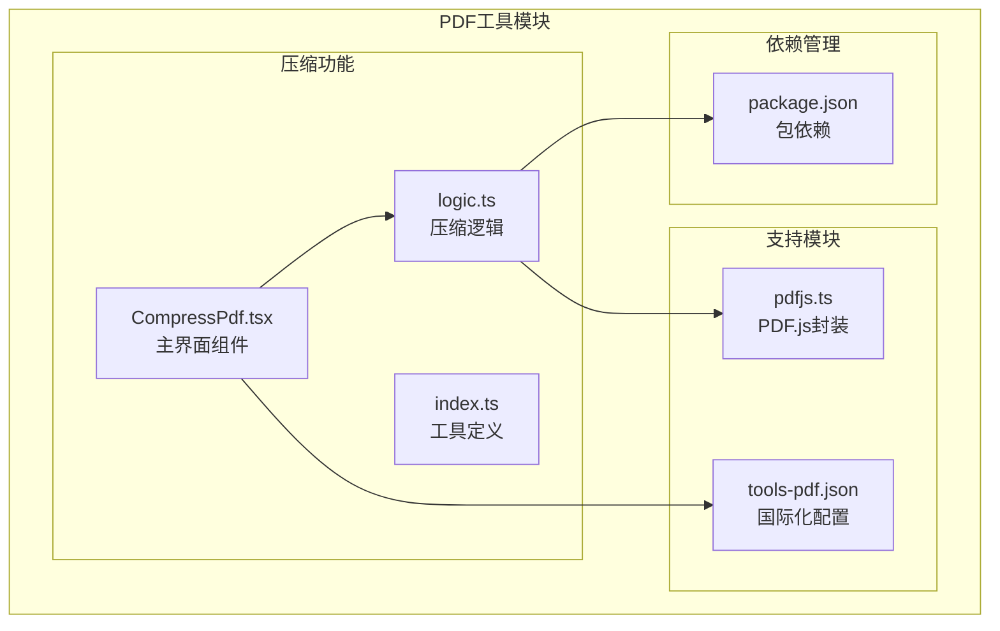
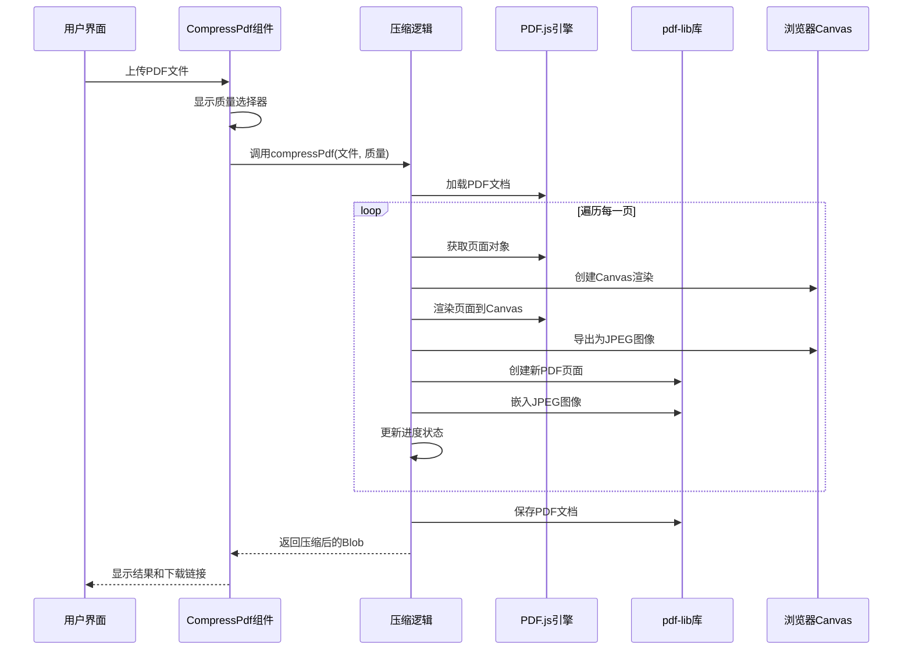
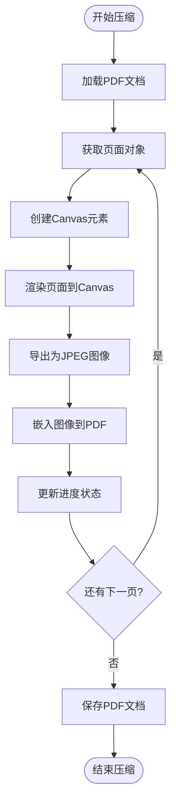
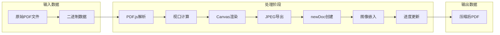
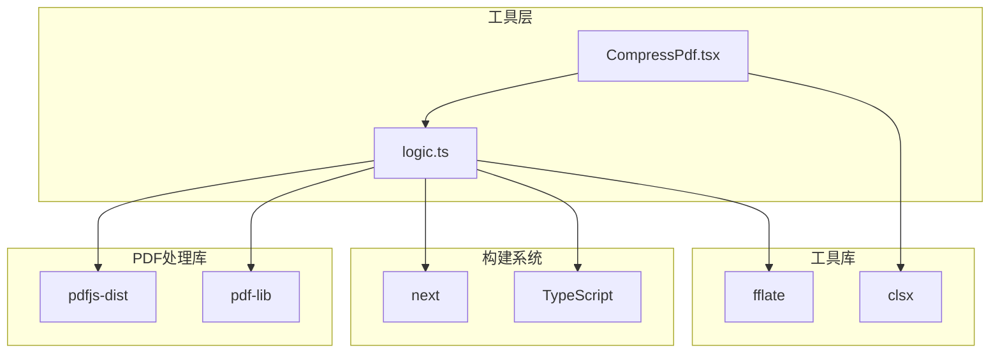
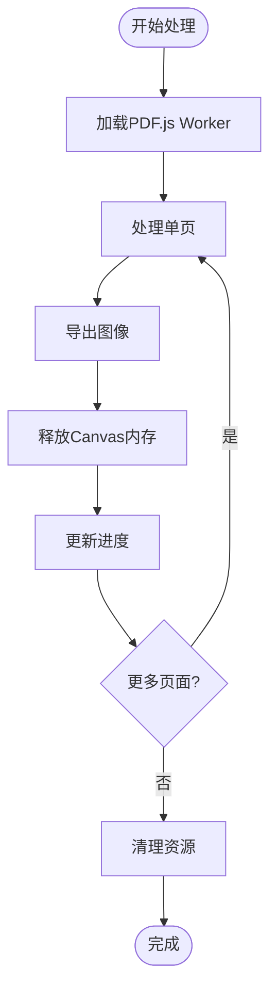

# PDF压缩工具

<cite>
**本文档引用的文件**
- [CompressPdf.tsx](file://src/tools/pdf/compress/CompressPdf.tsx)
- [logic.ts](file://src/tools/pdf/compress/logic.ts)
- [index.ts](file://src/tools/pdf/compress/index.ts)
- [pdfjs.ts](file://src/lib/pdfjs.ts)
- [package.json](file://package.json)
- [tools-pdf.json](file://messages/en/tools-pdf.json)
- [tools-pdf.json (中文)](file://messages/zh-Hans/tools-pdf.json)
</cite>

## 目录
1. [简介](#简介)
2. [项目结构](#项目结构)
3. [核心组件](#核心组件)
4. [架构概览](#架构概览)
5. [详细组件分析](#详细组件分析)
6. [依赖分析](#依赖分析)
7. [性能考虑](#性能考虑)
8. [故障排除指南](#故障排除指南)
9. [结论](#结论)
10. [附录](#附录)

## 简介

PDF压缩工具是一个基于浏览器的PDF文件压缩解决方案，通过重新渲染PDF页面为JPEG图像来实现文件大小缩减。该工具采用纯前端技术栈，确保用户隐私和数据安全，所有处理过程都在用户的浏览器中完成，无需上传到服务器。

该工具提供了三种压缩级别（高压缩比、中等压缩比、低压缩比），允许用户在文件大小和视觉质量之间进行平衡。工具的核心优势在于其隐私保护特性——所有PDF处理完全在本地进行，用户的数据永远不会离开其设备。

## 项目结构

PDF压缩工具位于项目的PDF工具模块中，采用模块化的组织方式：

**图表来源**
- [CompressPdf.tsx:1-131](file://src/tools/pdf/compress/CompressPdf.tsx#L1-L131)
- [logic.ts:1-73](file://src/tools/pdf/compress/logic.ts#L1-L73)
- [pdfjs.ts:1-16](file://src/lib/pdfjs.ts#L1-L16)

**章节来源**
- [CompressPdf.tsx:1-131](file://src/tools/pdf/compress/CompressPdf.tsx#L1-L131)
- [logic.ts:1-73](file://src/tools/pdf/compress/logic.ts#L1-L73)
- [index.ts:1-37](file://src/tools/pdf/compress/index.ts#L1-L37)

## 核心组件

### 压缩级别配置

工具实现了三档压缩级别，每档都有特定的质量参数：

| 压缩级别 | 缩放比例 | JPEG质量 | 适用场景 |
|---------|---------|---------|----------|
| 高质量 (high) | 1.5 | 0.8 | 需要保持较高视觉质量的文档 |
| 中等 (medium) | 1.0 | 0.6 | 平衡质量和文件大小的通用场景 |
| 低质量 (low) | 0.75 | 0.4 | 追求最大压缩比的场景 |

### 用户界面组件

主要界面组件负责处理用户交互和状态管理：

- **文件上传区**：支持拖拽上传PDF文件
- **质量选择器**：单选按钮组选择压缩级别
- **进度指示器**：显示压缩进度条和页码信息
- **结果展示区**：显示原始大小、压缩后大小和节省百分比
- **下载按钮**：提供压缩后的PDF文件下载

**章节来源**
- [CompressPdf.tsx:10-131](file://src/tools/pdf/compress/CompressPdf.tsx#L10-L131)
- [logic.ts:4-10](file://src/tools/pdf/compress/logic.ts#L4-L10)

## 架构概览

PDF压缩工具采用分层架构设计，确保代码的可维护性和扩展性：

**图表来源**
- [CompressPdf.tsx:28-45](file://src/tools/pdf/compress/CompressPdf.tsx#L28-L45)
- [logic.ts:12-66](file://src/tools/pdf/compress/logic.ts#L12-L66)

## 详细组件分析

### 压缩算法实现

#### 页面渲染流程

压缩算法的核心流程包括以下步骤：

1. **PDF文档加载**：使用PDF.js引擎加载源PDF文件
2. **页面遍历**：逐页处理PDF文档
3. **Canvas渲染**：将PDF页面渲染到HTML5 Canvas
4. **图像导出**：将Canvas内容导出为JPEG格式
5. **PDF重建**：使用pdf-lib库创建新的PDF文档
6. **图像嵌入**：将JPEG图像嵌入到新PDF中
7. **进度更新**：实时更新处理进度

**图表来源**
- [logic.ts:24-61](file://src/tools/pdf/compress/logic.ts#L24-L61)

#### 质量平衡算法

压缩算法通过两个关键参数实现质量平衡：

1. **缩放比例 (scale)**：控制Canvas的分辨率
   - 高质量：1.5倍缩放，提高清晰度
   - 中等质量：1.0倍缩放，标准清晰度
   - 低质量：0.75倍缩放，降低清晰度

2. **JPEG质量 (jpegQuality)**：控制图像压缩强度
   - 高质量：0.8质量因子，较小压缩比
   - 中等质量：0.6质量因子，适中压缩比
   - 低质量：0.4质量因子，较大压缩比

**章节来源**
- [logic.ts:6-10](file://src/tools/pdf/compress/logic.ts#L6-L10)
- [logic.ts:26](file://src/tools/pdf/compress/logic.ts#L26)

### 数据流分析

#### 压缩流程数据流

**图表来源**
- [logic.ts:18-65](file://src/tools/pdf/compress/logic.ts#L18-L65)

#### 错误处理机制

工具实现了多层次的错误处理：

1. **文件验证**：检查上传的文件是否为PDF格式
2. **Canvas渲染失败**：捕获Canvas导出异常
3. **内存不足**：处理大文件时的内存限制
4. **进度回调**：提供实时进度反馈

**章节来源**
- [CompressPdf.tsx:34-44](file://src/tools/pdf/compress/CompressPdf.tsx#L34-L44)

## 依赖分析

### 核心依赖关系

PDF压缩工具依赖于以下关键库：

**图表来源**
- [package.json:11-32](file://package.json#L11-L32)

### 依赖特性分析

#### pdfjs-dist (版本 5.5.207)
- **职责**：PDF文档解析和页面渲染
- **特性**：支持最新的PDF格式，高性能渲染引擎
- **集成方式**：动态导入，延迟初始化

#### pdf-lib (版本 1.17.1)
- **职责**：PDF文档创建和编辑
- **特性**：纯JavaScript实现，支持多种PDF特性
- **集成方式**：标准ES6模块导入

#### fflate (版本 0.8.2)
- **职责**：ZIP压缩和解压缩
- **特性**：高性能，零依赖
- **使用场景**：图像提取功能

**章节来源**
- [package.json:25-26](file://package.json#L25-L26)

## 性能考虑

### 内存管理

压缩工具在处理大文件时采用了多项内存优化策略：

1. **Canvas内存释放**：在图像导出后立即释放Canvas内存
2. **渐进式处理**：逐页处理，避免一次性加载整个文档
3. **垃圾回收触发**：在关键节点手动触发垃圾回收

### 处理速度优化

1. **并行处理**：页面间处理可以并行进行
2. **缓存机制**：PDF.js worker实例复用
3. **增量更新**：进度信息实时更新，用户体验流畅

### 内存使用模式

## 故障排除指南

### 常见问题及解决方案

#### PDF文件无法加载
**症状**：上传PDF后无响应或报错
**原因**：
- PDF格式不支持
- 文件损坏
- 浏览器兼容性问题

**解决方案**：
1. 尝试使用其他PDF查看器打开文件
2. 检查文件是否完整
3. 切换到支持更好的浏览器

#### 压缩过程卡住
**症状**：进度条停止不动
**原因**：
- 文件过大导致内存不足
- Canvas渲染超时
- 网络连接问题

**解决方案**：
1. 关闭其他占用内存的程序
2. 降低压缩质量级别
3. 分批处理大文件

#### 压缩后文件质量差
**症状**：压缩后的PDF质量明显下降
**原因**：
- JPEG质量设置过低
- 缩放比例不合适
- 原始PDF分辨率过高

**解决方案**：
1. 提高压缩质量级别
2. 调整缩放比例
3. 考虑使用专业的PDF压缩工具

**章节来源**
- [CompressPdf.tsx:51-55](file://src/tools/pdf/compress/CompressPdf.tsx#L51-L55)

## 结论

PDF压缩工具通过创新的页面重渲染技术，成功地在浏览器环境中实现了高效的PDF文件压缩。该工具的主要优势包括：

1. **隐私保护**：所有处理过程完全在本地进行
2. **灵活性**：提供三种压缩级别供用户选择
3. **易用性**：简洁直观的用户界面
4. **性能**：优化的内存管理和处理流程

虽然当前实现主要依赖于页面重渲染技术，但该工具为用户提供了可靠且安全的PDF压缩解决方案。对于需要更高级压缩功能的用户，可以考虑集成专业的PDF压缩库如pdfcpu，以实现更精细的压缩控制和更高的压缩效率。

## 附录

### 压缩级别详细说明

| 压缩级别 | 推荐使用场景 | 预期压缩比 | 质量影响 |
|---------|-------------|-----------|----------|
| 高质量 | 重要文档、报告、证书 | 20-40% | 几乎无质量损失 |
| 中等 | 日常文档、邮件附件 | 40-60% | 轻微质量损失 |
| 低质量 | 大型文档、存储归档 | 60-80% | 可感知质量损失 |

### 集成建议

对于需要更专业PDF压缩功能的场景，建议考虑以下集成方案：

1. **pdfcpu集成**：支持更精细的压缩控制
2. **Apache PDFBox**：Java生态系统的专业PDF处理
3. **Ghostscript**：命令行PDF处理工具
4. **ImageMagick**：多格式图像处理工具

### 用户反馈机制

工具提供了完整的用户反馈机制：

1. **进度显示**：实时显示处理进度
2. **结果对比**：显示压缩前后的文件大小对比
3. **错误提示**：友好的错误信息显示
4. **FAQ支持**：内置常见问题解答