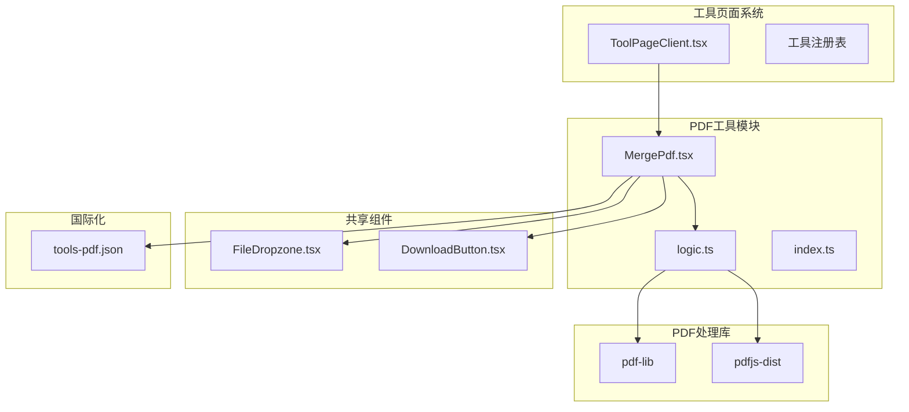
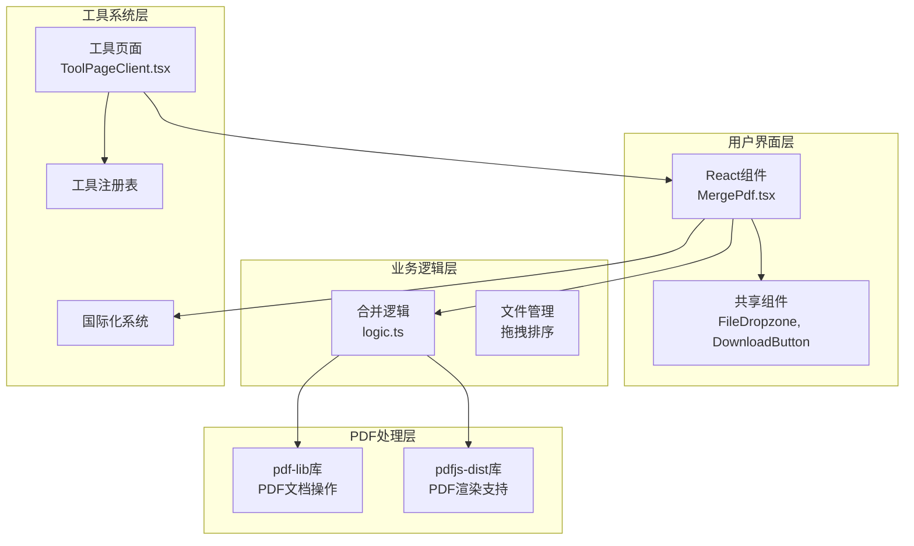
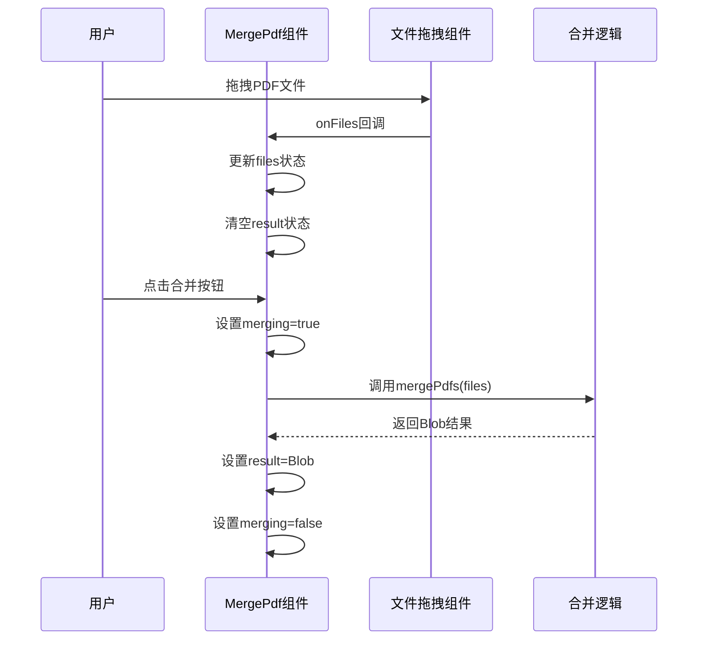
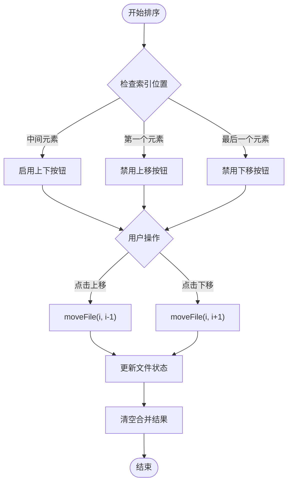
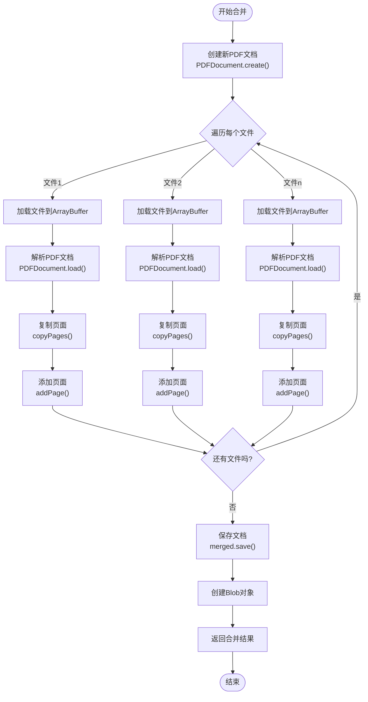
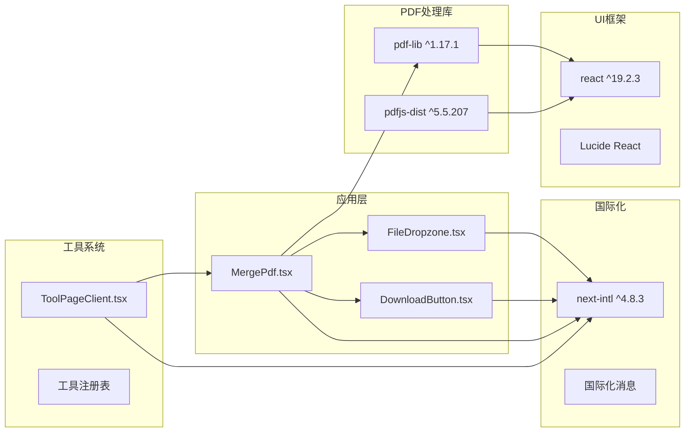
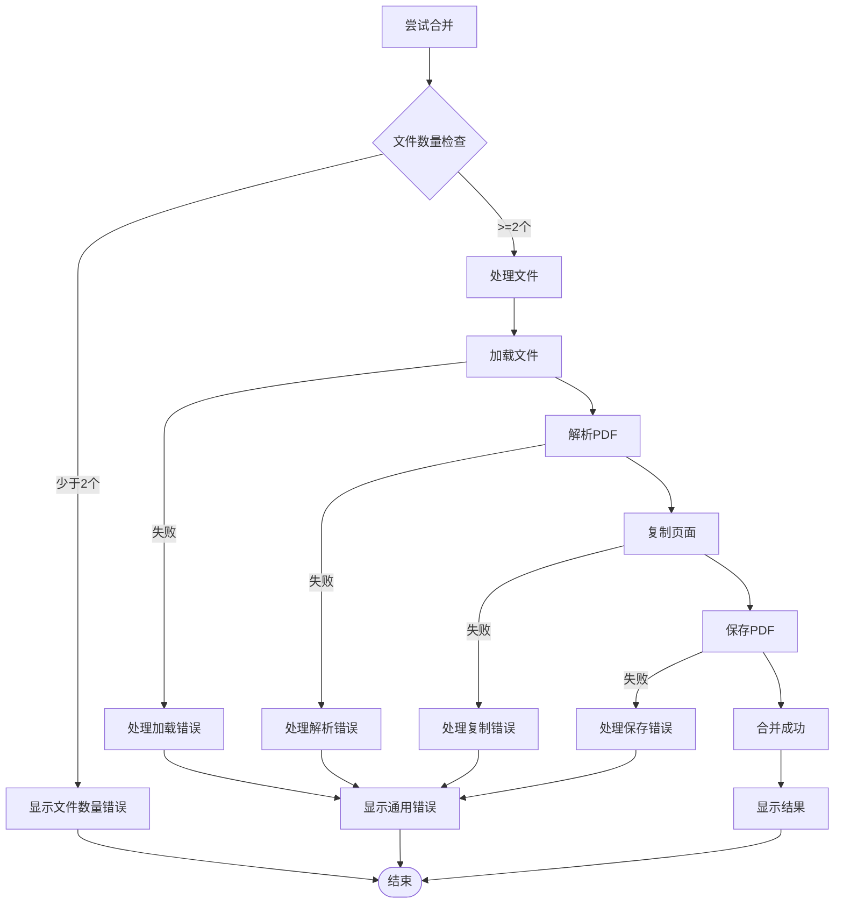

# PDF合并工具

<cite>
**本文档引用的文件**
- [src/tools/pdf/merge/MergePdf.tsx](file://src/tools/pdf/merge/MergePdf.tsx)
- [src/tools/pdf/merge/logic.ts](file://src/tools/pdf/merge/logic.ts)
- [src/tools/pdf/merge/index.ts](file://src/tools/pdf/merge/index.ts)
- [src/components/shared/FileDropzone.tsx](file://src/components/shared/FileDropzone.tsx)
- [src/components/shared/DownloadButton.tsx](file://src/components/shared/DownloadButton.tsx)
- [src/lib/pdfjs.ts](file://src/lib/pdfjs.ts)
- [messages/en/tools-pdf.json](file://messages/en/tools-pdf.json)
- [package.json](file://package.json)
- [src/app/[locale]/tools/[category]/[slug]/ToolPageClient.tsx](file://src/app/[locale]/tools/[category]/[slug]/ToolPageClient.tsx)
</cite>

## 目录
1. [简介](#简介)
2. [项目结构](#项目结构)
3. [核心组件](#核心组件)
4. [架构概览](#架构概览)
5. [详细组件分析](#详细组件分析)
6. [依赖关系分析](#依赖关系分析)
7. [性能考虑](#性能考虑)
8. [故障排除指南](#故障排除指南)
9. [结论](#结论)
10. [附录](#附录)

## 简介

PDF合并工具是一个基于浏览器的PDF文档处理工具，允许用户将多个PDF文件合并成一个单一的PDF文档。该工具完全在客户端运行，确保用户隐私和数据安全，所有处理都在用户的浏览器中完成，无需上传到服务器。

该工具的核心特性包括：
- 支持多文件拖拽上传
- 实时文件顺序调整（拖拽排序）
- 完全本地处理，无服务器上传
- 预览合并后文件大小
- 错误处理和进度反馈
- 国际化支持

## 项目结构

PDF合并工具位于媒体工具箱项目中，采用模块化架构设计：

**图表来源**
- [src/tools/pdf/merge/MergePdf.tsx:1-126](file://src/tools/pdf/merge/MergePdf.tsx#L1-L126)
- [src/tools/pdf/merge/logic.ts:1-24](file://src/tools/pdf/merge/logic.ts#L1-L24)
- [src/tools/pdf/merge/index.ts:1-37](file://src/tools/pdf/merge/index.ts#L1-L37)

**章节来源**
- [src/tools/pdf/merge/MergePdf.tsx:1-126](file://src/tools/pdf/merge/MergePdf.tsx#L1-L126)
- [src/tools/pdf/merge/logic.ts:1-24](file://src/tools/pdf/merge/logic.ts#L1-L24)
- [src/tools/pdf/merge/index.ts:1-37](file://src/tools/pdf/merge/index.ts#L1-L37)

## 核心组件

### MergePdf 组件

MergePdf 是PDF合并工具的主要界面组件，负责用户交互和状态管理。该组件实现了完整的文件上传、处理流程和结果展示功能。

主要功能特性：
- 文件拖拽上传区域
- 文件列表显示和管理
- 拖拽排序功能
- 合并按钮和下载功能
- 错误处理和状态反馈
- 文件大小格式化显示

### 合并逻辑模块

合并逻辑模块提供了核心的PDF处理功能，基于pdf-lib库实现PDF文档的读取、解析和重组。

关键实现点：
- 使用pdf-lib创建新的PDF文档
- 逐个加载源PDF文件
- 复制页面到新文档
- 保存最终的合并结果

### 工具定义模块

工具定义模块描述了PDF合并工具的元数据，包括路由配置、SEO设置和相关工具关联。

**章节来源**
- [src/tools/pdf/merge/MergePdf.tsx:11-126](file://src/tools/pdf/merge/MergePdf.tsx#L11-L126)
- [src/tools/pdf/merge/logic.ts:3-17](file://src/tools/pdf/merge/logic.ts#L3-L17)
- [src/tools/pdf/merge/index.ts:3-36](file://src/tools/pdf/merge/index.ts#L3-L36)

## 架构概览

PDF合并工具采用分层架构设计，确保了良好的可维护性和扩展性：

**图表来源**
- [src/tools/pdf/merge/MergePdf.tsx:1-126](file://src/tools/pdf/merge/MergePdf.tsx#L1-L126)
- [src/tools/pdf/merge/logic.ts:1-24](file://src/tools/pdf/merge/logic.ts#L1-L24)
- [src/app/[locale]/tools/[category]/[slug]/ToolPageClient.tsx:29-58](file://src/app/[locale]/tools/[category]/[slug]/ToolPageClient.tsx#L29-L58)

该架构实现了以下设计原则：
- **关注点分离**：UI、业务逻辑、PDF处理各司其职
- **依赖倒置**：上层不依赖具体实现，通过接口交互
- **可测试性**：每个模块都可以独立测试
- **可扩展性**：新增功能不影响现有代码

## 详细组件分析

### MergePdf 组件详细分析

MergePdf 组件是整个PDF合并工具的核心，采用了现代React Hooks模式实现状态管理和副作用处理。

#### 组件状态管理

组件维护了四个核心状态：
- `files`: 用户选择的PDF文件数组
- `result`: 合并后的Blob结果
- `merging`: 合并进行中的状态标志
- `error`: 错误信息存储

#### 文件管理功能

**图表来源**
- [src/tools/pdf/merge/MergePdf.tsx:18-32](file://src/tools/pdf/merge/MergePdf.tsx#L18-L32)
- [src/tools/pdf/merge/logic.ts:3-17](file://src/tools/pdf/merge/logic.ts#L3-L17)

#### 页面排序功能

组件实现了直观的拖拽排序功能，用户可以通过点击箭头按钮调整文件顺序：

**图表来源**
- [src/tools/pdf/merge/MergePdf.tsx:39-47](file://src/tools/pdf/merge/MergePdf.tsx#L39-L47)

**章节来源**
- [src/tools/pdf/merge/MergePdf.tsx:11-126](file://src/tools/pdf/merge/MergePdf.tsx#L11-L126)

### 合并逻辑实现分析

合并逻辑模块基于pdf-lib库实现了高效的PDF文档合并功能。pdf-lib是一个纯JavaScript的PDF处理库，能够在浏览器环境中执行复杂的PDF操作。

#### 合并算法流程

**图表来源**
- [src/tools/pdf/merge/logic.ts:3-17](file://src/tools/pdf/merge/logic.ts#L3-L17)

#### 技术实现要点

1. **异步处理**：所有操作都是异步的，避免阻塞主线程
2. **内存管理**：及时释放ArrayBuffer和PDF对象
3. **错误处理**：捕获并处理PDF解析和合并过程中的异常
4. **类型安全**：使用TypeScript确保类型安全

**章节来源**
- [src/tools/pdf/merge/logic.ts:1-24](file://src/tools/pdf/merge/logic.ts#L1-L24)

### 共享组件分析

#### FileDropzone 组件

FileDropzone 提供了用户友好的文件上传界面，支持拖拽和点击两种上传方式。

主要特性：
- 拖拽区域高亮效果
- 文件类型和大小限制
- 实时文件预览
- 分析事件追踪
- 国际化支持

#### DownloadButton 组件

DownloadButton 实现了安全的文件下载功能，支持Blob和数据URL两种格式。

关键实现：
- 动态创建临时URL
- 自动清理内存资源
- 下载事件分析追踪
- 品牌文件名处理

**章节来源**
- [src/components/shared/FileDropzone.tsx:1-144](file://src/components/shared/FileDropzone.tsx#L1-L144)
- [src/components/shared/DownloadButton.tsx:1-54](file://src/components/shared/DownloadButton.tsx#L1-L54)

## 依赖关系分析

PDF合并工具的依赖关系清晰明确，遵循了最小依赖原则：

**图表来源**
- [package.json:11-32](file://package.json#L11-L32)
- [src/tools/pdf/merge/MergePdf.tsx:3-9](file://src/tools/pdf/merge/MergePdf.tsx#L3-L9)

### 核心依赖分析

#### pdf-lib 库

pdf-lib是PDF合并功能的核心依赖，提供了完整的PDF文档操作能力：
- 文档创建和修改
- 页面复制和重组
- 字体和图像处理
- 元数据管理

#### pdfjs-dist 库

虽然PDF合并主要使用pdf-lib，但pdfjs-dist用于PDF渲染和预览支持：
- PDF文档渲染
- 页面缩略图生成
- 文本提取支持
- 图像处理能力

**章节来源**
- [package.json:25-26](file://package.json#L25-L26)
- [src/lib/pdfjs.ts:1-16](file://src/lib/pdfjs.ts#L1-L16)

## 性能考虑

### 内存优化策略

PDF合并工具采用了多种内存优化策略来处理大型PDF文件：

1. **渐进式处理**：逐个文件处理，避免同时加载多个大文件
2. **及时释放**：处理完成后立即释放ArrayBuffer和PDF对象
3. **Blob复用**：使用Blob对象减少内存复制开销
4. **状态重置**：在文件变更时重置合并结果状态

### 浏览器兼容性

工具支持现代浏览器的PDF处理能力：
- Chrome 64+
- Firefox 59+
- Safari 11.1+
- Edge 79+

### 性能监控指标

- **处理时间**：单个文件合并时间通常在几秒到几十秒之间
- **内存使用**：峰值内存使用量约为文件大小的2-3倍
- **并发限制**：建议同时处理不超过5个大文件

## 故障排除指南

### 常见问题及解决方案

#### PDF文件无法加载

**症状**：上传PDF文件后出现错误提示

**可能原因**：
- PDF文件损坏或加密
- 不支持的PDF版本
- 文件格式不正确

**解决方法**：
1. 验证PDF文件完整性
2. 尝试使用其他PDF查看器打开文件
3. 检查PDF版本兼容性

#### 合并过程中断

**症状**：合并过程中页面刷新或浏览器崩溃

**可能原因**：
- 内存不足
- 大文件处理超时
- 浏览器兼容性问题

**解决方法**：
1. 关闭其他占用内存的标签页
2. 分批处理大文件
3. 更新浏览器到最新版本

#### 合并结果异常

**症状**：合并后的PDF文件显示异常或内容丢失

**可能原因**：
- PDF中包含特殊字体或图像
- PDF版本过旧
- 页面旋转或裁剪问题

**解决方法**：
1. 检查原始PDF文件质量
2. 尝试重新导出PDF文件
3. 使用PDF优化工具清理文件

### 错误处理机制

组件实现了完善的错误处理机制：

**图表来源**
- [src/tools/pdf/merge/MergePdf.tsx:18-32](file://src/tools/pdf/merge/MergePdf.tsx#L18-L32)

**章节来源**
- [src/tools/pdf/merge/MergePdf.tsx:100-104](file://src/tools/pdf/merge/MergePdf.tsx#L100-L104)

## 结论

PDF合并工具是一个功能完整、性能优良的浏览器端PDF处理工具。通过采用现代前端技术栈和精心设计的架构，该工具实现了以下目标：

### 技术优势

1. **完全本地化**：所有处理都在用户浏览器中完成，确保数据隐私
2. **高性能**：基于pdf-lib的高效PDF处理引擎
3. **用户友好**：直观的拖拽界面和实时反馈
4. **可扩展性**：模块化设计便于功能扩展

### 适用场景

- **文档归档**：合并多个扫描文档形成统一档案
- **报告整合**：将不同部门的报告合并成完整文档
- **合同管理**：整合相关合同文件
- **学术研究**：合并论文的不同部分

### 发展建议

1. **性能优化**：考虑实现分块处理以支持超大文件
2. **格式扩展**：支持更多文档格式的导入
3. **批量处理**：增强批量操作功能
4. **云端同步**：提供本地与云端的同步选项

## 附录

### 使用示例

#### 基本合并操作

1. 打开PDF合并工具页面
2. 将多个PDF文件拖拽到上传区域
3. 使用箭头按钮调整文件顺序
4. 点击"合并PDF"按钮开始处理
5. 下载合并后的文件

#### 高级用法

- **文件预览**：在合并前预览每个PDF的内容
- **批量处理**：一次处理多个PDF文件
- **格式转换**：结合其他PDF工具进行格式转换

### 支持的PDF版本

工具支持以下PDF版本：
- PDF 1.4 (Acrobat 5.0)
- PDF 1.5 (Acrobat 6.0)
- PDF 1.6 (Acrobat 7.0)
- PDF 1.7 (Acrobat 8.0)

### 文件格式兼容性

- **输入格式**：PDF (application/pdf)
- **输出格式**：PDF (application/pdf)
- **文件大小**：理论上无限制，实际受设备内存限制

### 性能基准

- **小文件** (< 10MB)：合并时间 < 5秒
- **中等文件** (10-50MB)：合并时间 < 30秒  
- **大文件** (> 50MB)：合并时间 < 2分钟