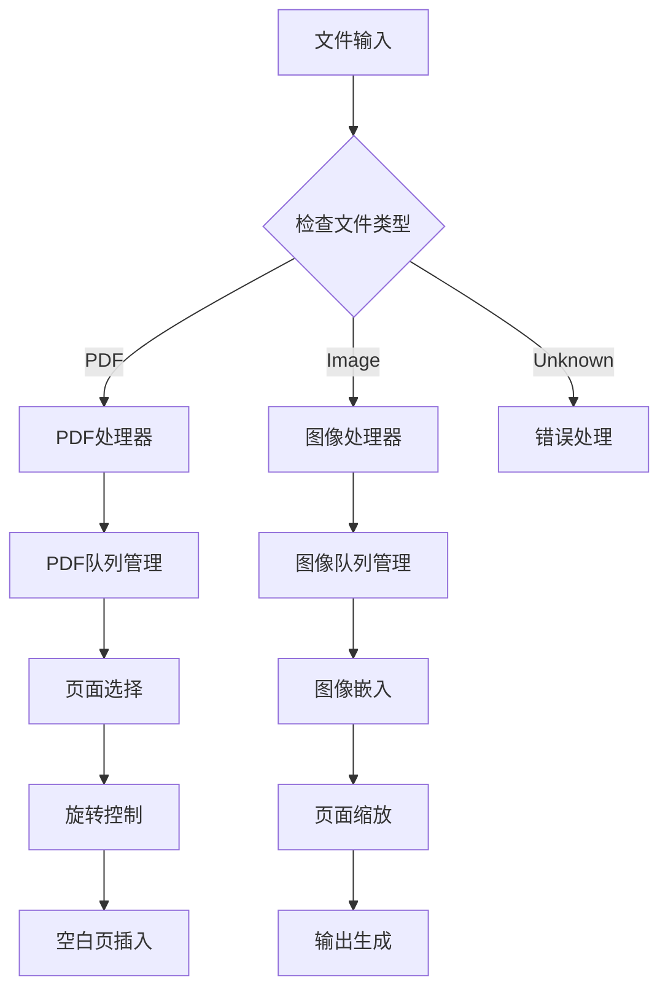
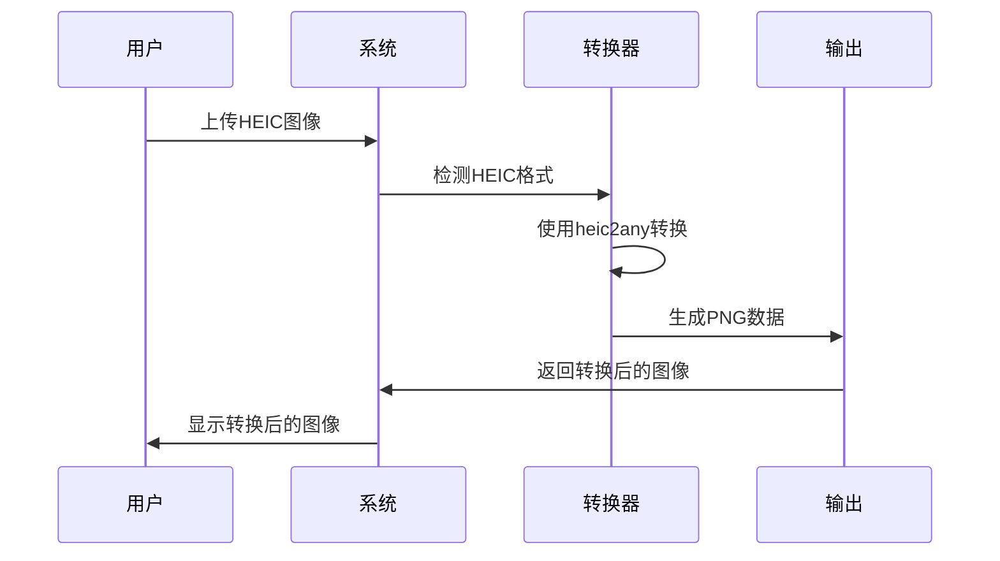
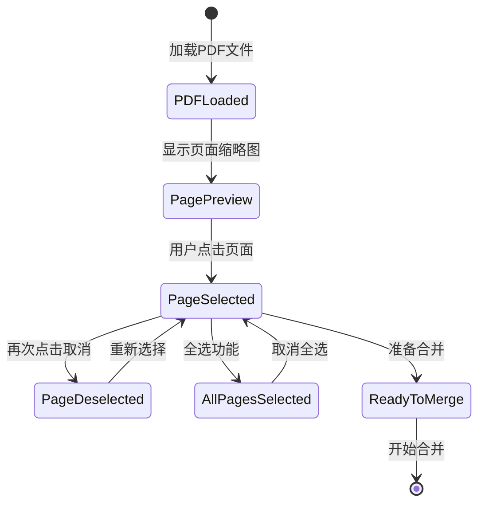
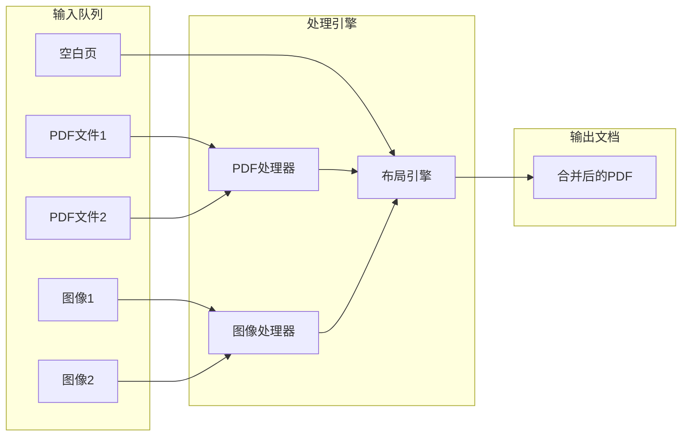
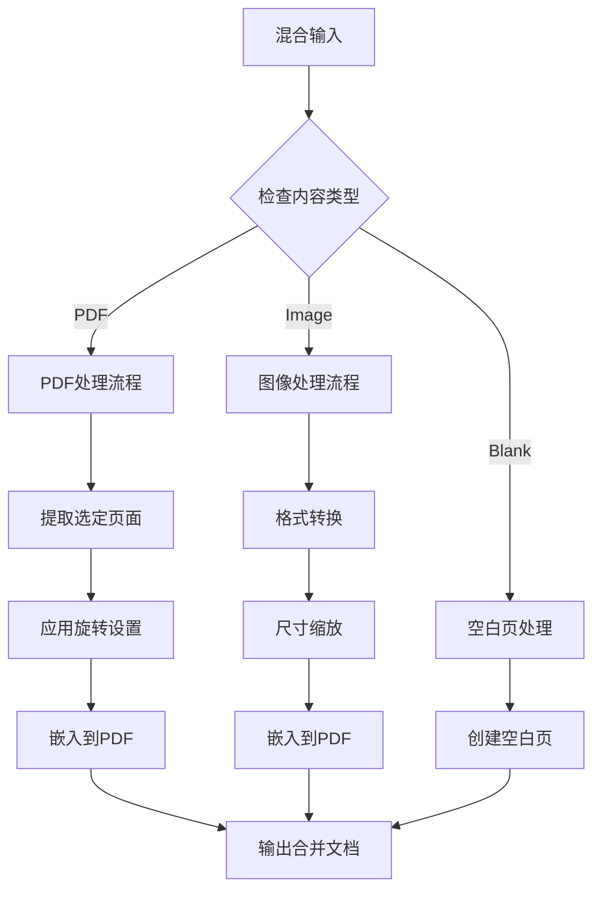
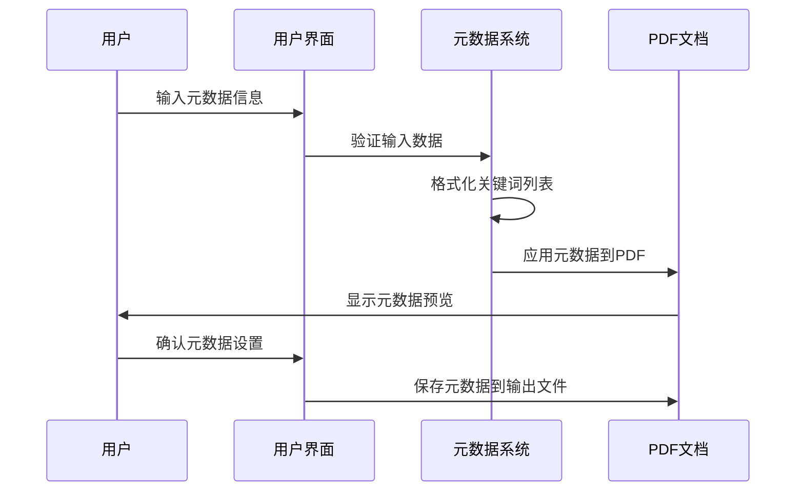
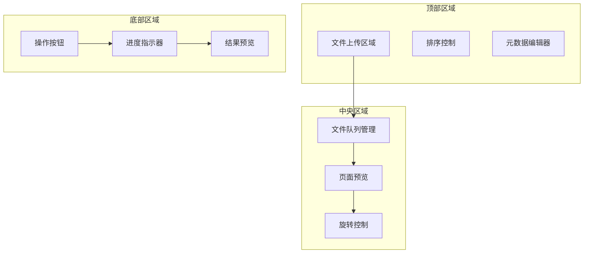
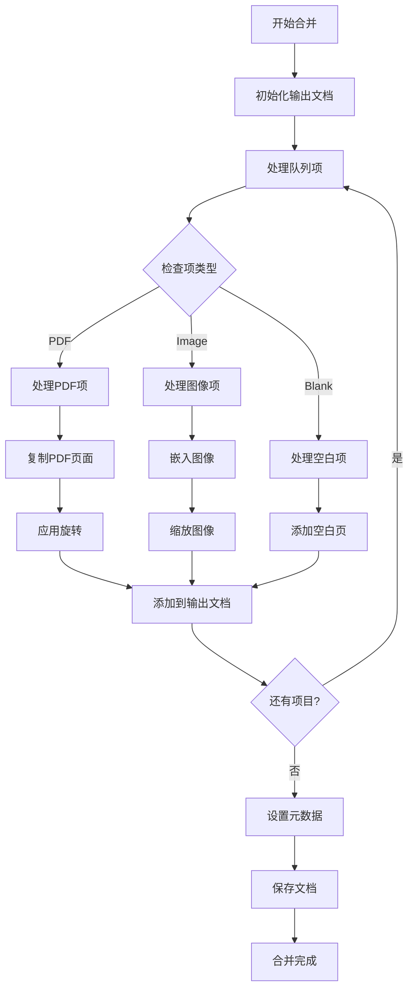
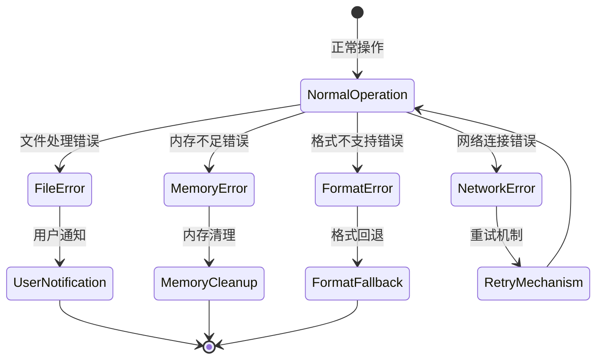
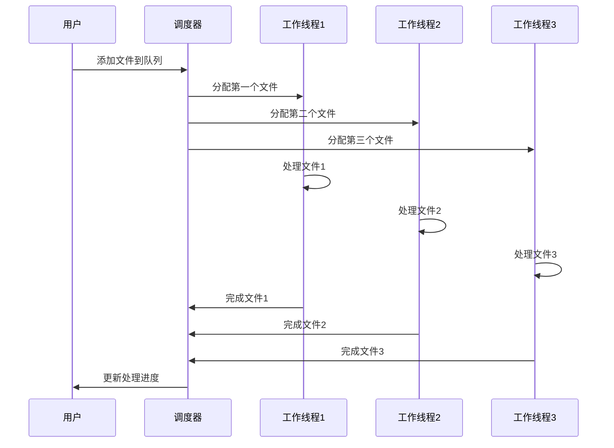

# PDF合并工具

<cite>
**本文档引用的文件**
- [src/tools/pdf/merge/MergePdf.tsx](file://src/tools/pdf/merge/MergePdf.tsx)
- [src/tools/pdf/merge/MergeItemCard.tsx](file://src/tools/pdf/merge/MergeItemCard.tsx)
- [src/tools/pdf/merge/PdfDetailDialog.tsx](file://src/tools/pdf/merge/PdfDetailDialog.tsx)
- [src/tools/pdf/merge/logic.ts](file://src/tools/pdf/merge/logic.ts)
- [src/components/shared/PdfFullscreenPreview.tsx](file://src/components/shared/PdfFullscreenPreview.tsx)
- [src/components/shared/PdfPagePreview.tsx](file://src/components/shared/PdfPagePreview.tsx)
- [src/lib/utils/formatFileSize.ts](file://src/lib/utils/formatFileSize.ts)
- [package.json](file://package.json)
</cite>

## 更新摘要
**所做更改**
- 重大架构升级：从简单PDF合并升级为综合PDF/图像处理系统
- 新增多格式支持：支持JPG、PNG、HEIC、WebP、AVIF等多种图像格式
- 引入页面级控制：PDF页面选择、旋转、空白页插入功能
- 增强混合内容创建：PDF与图像混合队列处理
- 扩展元数据编辑：标题、作者、主题、关键词自定义
- 改进用户体验：拖拽排序、实时预览、批量操作
- 新增组件：PdfFullscreenPreview、MergeItemCard、PdfDetailDialog
- 更新预览组件：PdfBlobPreview → PdfFullscreenPreview

## 目录
1. [简介](#简介)
2. [系统架构](#系统架构)
3. [核心功能特性](#核心功能特性)
4. [多格式支持体系](#多格式支持体系)
5. [页面级控制机制](#页面级控制机制)
6. [混合内容处理](#混合内容处理)
7. [元数据管理系统](#元数据管理系统)
8. [用户界面设计](#用户界面设计)
9. [技术实现细节](#技术实现细节)
10. [性能优化策略](#性能优化策略)
11. [使用示例与最佳实践](#使用示例与最佳实践)
12. [故障排除指南](#故障排除指南)
13. [总结与展望](#总结与展望)

## 简介

PDF合并工具已从简单的PDF文档合并功能升级为全面的PDF/图像综合处理系统。该系统不仅支持传统的PDF文件合并，还集成了强大的图像处理能力，能够处理多种图像格式并提供精细的页面级控制功能。

### 核心升级亮点

**多格式支持**
- PDF文档：标准PDF格式处理
- 图像格式：JPG、PNG、HEIC、WebP、AVIF、BMP等
- 混合队列：PDF与图像文件的任意组合处理

**页面级控制**
- 精确页面选择：可选择PDF的特定页面
- 旋转功能：支持90°、180°、270°旋转
- 空白页插入：智能继承前一页尺寸的空白页
- 排序管理：拖拽排序和多种排序模式

**高级编辑功能**
- 元数据编辑：标题、作者、主题、关键词
- 自定义命名：输出文件名定制
- 实时预览：合并前的在线预览功能
- 批量操作：多文件同时处理

## 系统架构

PDF合并工具采用模块化的微服务架构，将PDF处理、图像处理、用户界面和数据管理功能分离，确保系统的可扩展性和维护性。

```mermaid
graph TB
subgraph "用户界面层"
UI[主界面组件<br/>MergePdf.tsx]
Preview[全屏预览组件<br/>PdfFullscreenPreview.tsx]
Controls[控制面板<br/>排序/元数据]
Card[卡片组件<br/>MergeItemCard.tsx]
Dialog[详情对话框<br/>PdfDetailDialog.tsx]
end
subgraph "业务逻辑层"
MergeLogic[合并逻辑<br/>mergeItems函数]
ImageLogic[图像处理<br/>embedImage函数]
QueueManager[队列管理<br/>状态同步]
end
subgraph "PDF处理层"
PdfLib[pdf-lib库<br/>PDF文档操作]
PdfJsDist[pdfjs-dist库<br/>PDF渲染支持]
ImageConverter[图像转换器<br/>HEIC转PNG]
end
subgraph "数据存储层"
FileSystem[文件系统API<br/>本地存储]
MemoryCache[内存缓存<br/>预览图缓存]
Analytics[分析系统<br/>用户行为追踪]
UI --> MergeLogic
UI --> Preview
UI --> Card
UI --> Dialog
MergeLogic --> PdfLib
MergeLogic --> ImageLogic
ImageLogic --> ImageConverter
PdfLib --> PdfJsDist
UI --> FileSystem
UI --> MemoryCache
UI --> Analytics
```

**图表来源**
- [src/tools/pdf/merge/MergePdf.tsx:1-677](file://src/tools/pdf/merge/MergePdf.tsx#L1-L677)
- [src/tools/pdf/merge/logic.ts:1-141](file://src/tools/pdf/merge/logic.ts#L1-L141)

### 架构设计原则

1. **模块化设计**：每个功能模块独立封装，便于测试和维护
2. **异步处理**：所有文件操作采用异步模式，避免阻塞UI线程
3. **内存优化**：合理管理内存使用，支持大文件处理
4. **错误隔离**：单个文件处理失败不影响整体流程
5. **状态管理**：集中式状态管理，确保数据一致性

## 核心功能特性

### 1. 多格式文件支持

系统支持广泛的文件格式，包括传统PDF文档和现代图像格式：

**PDF格式支持**
- 标准PDF 1.4-1.7版本
- 加密PDF文件（需密码）
- 多页PDF文档
- 嵌入字体和图像

**图像格式支持**
- **JPG/JPEG**：最常用的图像格式
- **PNG**：无损压缩，支持透明度
- **HEIC/HEIF**：苹果设备专用格式，自动转换
- **WebP**：现代网络图像格式
- **AVIF**：新一代高效图像格式
- **BMP/GIF**：传统图像格式支持

### 2. 智能文件识别



**图表来源**
- [src/tools/pdf/merge/MergePdf.tsx:74-80](file://src/tools/pdf/merge/MergePdf.tsx#L74-L80)

### 3. 队列管理系统

系统采用灵活的队列管理机制，支持动态添加、删除和重新排序文件：

**队列项类型**
- PDF文件：包含页面选择、旋转状态
- 图像文件：包含缩放和定位信息
- 空白页：继承前一页尺寸的占位符

**排序模式**
- 手动排序：拖拽调整顺序
- 按名称排序：A-Z或Z-A
- 按大小排序：从小到大或从大到小

## 多格式支持体系

### 图像格式转换机制

系统内置多种图像格式转换器，确保所有图像都能正确处理：



**图表来源**
- [src/tools/pdf/merge/logic.ts:97-138](file://src/tools/pdf/merge/logic.ts#L97-L138)

### 支持的图像格式特性

| 格式 | MIME类型 | 特性 | 处理方式 |
|------|----------|------|----------|
| JPG | image/jpeg | 有损压缩，高压缩比 | 直接嵌入 |
| PNG | image/png | 无损压缩，支持透明度 | 直接嵌入 |
| HEIC | image/heic | 现代苹果格式 | 转换为PNG |
| WebP | image/webp | 现代高效格式 | 转换为PNG |
| AVIF | image/avif | 最新一代格式 | 转换为PNG |
| BMP | image/bmp | 无压缩，文件大 | 转换为PNG |
| GIF | image/gif | 动画支持 | 转换为PNG |

### 图像处理算法

系统采用智能的图像处理算法，确保输出质量：

1. **尺寸适配**：自动调整图像尺寸以适应页面
2. **质量保持**：在转换过程中保持最佳视觉效果
3. **格式优化**：选择最适合的输出格式
4. **内存管理**：高效处理大图像文件

## 页面级控制机制

### PDF页面选择系统

系统提供精细的PDF页面控制功能，允许用户精确选择需要的页面：



**图表来源**
- [src/tools/pdf/merge/MergePdf.tsx:233-244](file://src/tools/pdf/merge/MergePdf.tsx#L233-L244)

### 页面旋转控制

每个PDF页面都支持独立的旋转控制：

**旋转角度支持**
- 90°顺时针旋转
- 90°逆时针旋转  
- 180°翻转
- 保持原状

**旋转状态管理**
- 独立的旋转记录
- 实时预览旋转效果
- 合并时应用旋转设置

### 空白页插入功能

系统提供智能的空白页插入功能：

**空白页特性**
- 继承前一页的页面尺寸
- 自动匹配PDF页面规格
- 可插入到任意位置
- 支持连续插入

**应用场景**
- 分隔不同章节
- 为手写笔记留白
- 创建目录页
- 添加页码页

## 混合内容处理

### PDF与图像混合队列

系统支持PDF文档和图像文件的混合处理，创建统一的输出文档：



**图表来源**
- [src/tools/pdf/merge/logic.ts:30-63](file://src/tools/pdf/merge/logic.ts#L30-L63)

### 混合内容布局策略

系统采用智能的布局策略，确保混合内容的协调一致：

**页面尺寸管理**
- PDF页面尺寸优先
- 图像按比例缩放
- 空白页继承尺寸
- 统一页面规格

**内容对齐方式**
- 居中对齐
- 顶部对齐
- 底部对齐
- 自适应填充

### 内容转换流程



**图表来源**
- [src/tools/pdf/merge/logic.ts:23-83](file://src/tools/pdf/merge/logic.ts#L23-L83)

## 元数据管理系统

### 元数据编辑功能

系统提供完整的PDF元数据编辑功能，允许用户自定义文档属性：

**可编辑元数据字段**
- 标题（Title）：文档的简短描述
- 作者（Author）：文档创建者信息
- 主题（Subject）：文档主题说明
- 关键词（Keywords）：搜索关键词列表
- 生成器（Creator）：软件生成信息
- 生产商（Producer）：PDF生成器信息

### 元数据处理流程



**图表来源**
- [src/tools/pdf/merge/logic.ts:65-80](file://src/tools/pdf/merge/logic.ts#L65-L80)

### 元数据安全策略

系统采用隐私优先的元数据处理策略：

**隐私保护措施**
- 默认不设置生产商标识
- 关键词自动去重和清理
- 避免第三方软件标识
- 支持完全清空元数据

**安全考虑**
- 所有元数据处理在本地完成
- 不向任何服务器发送元数据
- 支持敏感文档的隐私保护

## 用户界面设计

### 主界面布局

系统采用现代化的响应式设计，提供直观易用的操作界面：



**图表来源**
- [src/tools/pdf/merge/MergePdf.tsx:477-647](file://src/tools/pdf/merge/MergePdf.tsx#L477-L647)

### 交互设计原则

**直观性**
- 清晰的视觉层次
- 直观的操作反馈
- 即时的状态更新

**可用性**
- 支持键盘快捷键
- 触摸友好的界面元素
- 响应式设计适配各种设备

**可访问性**
- 屏幕阅读器支持
- 键盘导航支持
- 高对比度模式

### 实时预览功能

系统提供强大的实时预览功能：

**预览特性**
- 合并前的在线预览
- 支持页面缩放和滚动
- 实时显示旋转效果
- 快速错误检测

**预览优化**
- 智能缩放算法
- 平滑的滚动体验
- 高效的渲染性能
- 内存使用优化

## 技术实现细节

### 核心算法实现

#### PDF合并算法

系统采用高效的PDF合并算法，确保处理速度和质量：



**图表来源**
- [src/tools/pdf/merge/logic.ts:23-83](file://src/tools/pdf/merge/logic.ts#L23-L83)

#### 图像嵌入算法

系统采用智能的图像嵌入算法，支持多种图像格式：

**图像处理流程**
1. **格式检测**：识别图像文件类型
2. **格式转换**：必要时转换为PNG格式
3. **尺寸计算**：根据页面尺寸计算缩放比例
4. **居中定位**：将图像放置在页面中心
5. **质量优化**：确保输出图像质量

**内存管理策略**
- 分块处理大图像文件
- 及时释放临时内存
- 智能缓存机制
- 内存使用监控

### 错误处理机制

系统实现了全面的错误处理机制：



**图表来源**
- [src/tools/pdf/merge/MergePdf.tsx:177-188](file://src/tools/pdf/merge/MergePdf.tsx#L177-L188)

### 性能监控系统

系统内置性能监控功能：

**监控指标**
- 处理时间统计
- 内存使用情况
- CPU使用率
- 网络请求统计

**性能优化**
- 异步文件处理
- 并发任务管理
- 缓存策略优化
- 内存泄漏防护

## 性能优化策略

### 内存管理优化

系统采用多层次的内存管理策略：

**文件处理优化**
- 分块读取大文件
- 及时释放临时文件句柄
- 智能垃圾回收
- 内存池管理

**图像处理优化**
- Canvas内存复用
- 图像数据压缩
- 临时文件清理
- WebGL加速支持

### 并发处理机制

系统支持多文件并发处理：



**图表来源**
- [src/tools/pdf/merge/MergePdf.tsx:211-221](file://src/tools/pdf/merge/MergePdf.tsx#L211-L221)

### 缓存策略

系统采用智能缓存策略提升性能：

**缓存层次**
- **内存缓存**：最近使用的PDF预览图
- **磁盘缓存**：转换后的图像文件
- **浏览器缓存**：静态资源和配置文件
- **CDN缓存**：外部依赖库和字体

**缓存管理**
- LRU缓存淘汰算法
- 自适应缓存大小
- 异步缓存更新
- 缓存一致性保证

## 使用示例与最佳实践

### 基础合并操作

#### PDF文件合并
1. 打开PDF合并工具页面
2. 拖拽多个PDF文件到上传区域
3. 使用排序按钮调整文件顺序
4. 点击"合并PDF"按钮开始处理
5. 下载合并后的文件

#### 图像文件合并
1. 上传JPG、PNG、HEIC等图像文件
2. 系统自动检测图像格式
3. 图像按顺序嵌入到PDF中
4. 每个图像成为单独的PDF页面

### 高级功能使用

#### 页面级控制
1. 展开PDF文件查看页面缩略图
2. 点击页面切换选中状态
3. 使用旋转按钮调整页面方向
4. 插入空白页分隔不同内容

#### 元数据编辑
1. 展开高级选项面板
2. 输入文档标题、作者等信息
3. 设置关键词列表
4. 自定义输出文件名

### 最佳实践建议

**文件组织**
- 合理安排文件顺序
- 使用有意义的文件名
- 预先整理好要处理的文件

**性能优化**
- 控制同时处理的文件数量
- 避免同时处理多个超大文件
- 定期清理浏览器缓存

**质量保证**
- 预览合并结果
- 检查页面顺序和方向
- 验证元数据设置

## 故障排除指南

### 常见问题诊断

#### 文件加载失败
**症状**：文件上传后显示加载错误

**可能原因**
- 文件格式不受支持
- 文件损坏或不完整
- 浏览器兼容性问题

**解决步骤**
1. 检查文件格式是否在支持列表内
2. 尝试重新上传文件
3. 更新浏览器到最新版本
4. 清除浏览器缓存后重试

#### 合并过程异常
**症状**：合并过程中页面刷新或处理中断

**可能原因**
- 内存不足
- 处理时间过长
- 浏览器安全策略限制

**解决方法**
1. 关闭其他占用内存的标签页
2. 分批处理大文件
3. 在隐身模式下重试
4. 检查浏览器扩展程序

#### 输出文件问题
**症状**：合并后的PDF文件显示异常

**可能原因**
- 页面旋转设置错误
- 图像格式转换失败
- 元数据冲突

**修复方案**
1. 检查页面旋转设置
2. 验证图像格式支持
3. 清空元数据后重试
4. 使用不同的浏览器

### 错误代码参考

| 错误代码 | 错误类型 | 可能原因 | 解决方案 |
|----------|----------|----------|----------|
| 0x001 | 文件格式错误 | 不支持的文件类型 | 检查文件格式 |
| 0x002 | 内存不足 | 浏览器内存限制 | 关闭其他标签页 |
| 0x003 | PDF解析失败 | PDF文件损坏 | 重新获取PDF文件 |
| 0x004 | 图像转换错误 | 图像格式不支持 | 转换为PNG格式 |
| 0x005 | 网络连接错误 | 网络不稳定 | 检查网络连接 |

### 性能监控指标

**正常性能范围**
- 小文件（<10MB）：处理时间 < 10秒
- 中等文件（10-50MB）：处理时间 < 1分钟
- 大文件（>50MB）：处理时间 < 5分钟

**性能警告指标**
- 处理时间超过预期2倍
- 内存使用率持续高于80%
- 浏览器响应缓慢

## 总结与展望

### 系统优势总结

PDF合并工具经过重大升级后，已成为一个功能完备的PDF/图像综合处理平台：

**技术优势**
- 完全本地化处理，确保数据隐私
- 支持多种文件格式，满足多样化需求
- 提供精细的页面级控制功能
- 采用现代化的前端技术栈
- 具备良好的性能和可扩展性

**用户体验优势**
- 直观的拖拽式操作界面
- 实时的处理进度反馈
- 丰富的预览和编辑功能
- 多种排序和组织方式
- 完善的帮助和故障排除

### 未来发展方向

**功能扩展计划**
- 支持更多PDF编辑功能（注释、表单等）
- 增加批量处理和自动化功能
- 提供云端同步和备份选项
- 集成OCR文字识别功能
- 支持更多输出格式（Word、Excel等）

**性能优化目标**
- 进一步提升大文件处理能力
- 优化移动端用户体验
- 增强离线处理功能
- 改进内存使用效率
- 提供更详细的性能分析

**技术演进路线**
- 采用更先进的前端框架
- 集成AI辅助功能
- 支持WebAssembly加速
- 增强安全性保障
- 优化可访问性支持

PDF合并工具作为媒体工具箱的重要组成部分，将继续致力于为用户提供免费、安全、高效的PDF处理解决方案。通过持续的功能改进和技术升级，该工具将在数字文档处理领域发挥越来越重要的作用。