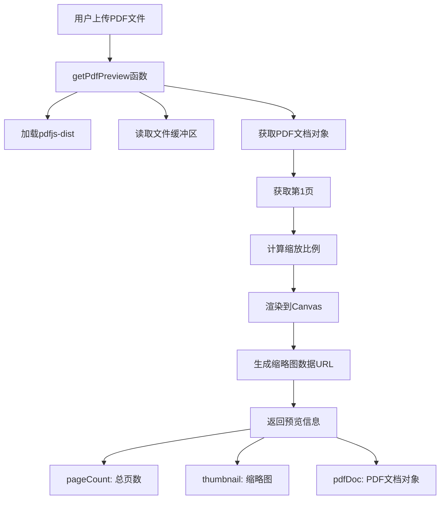
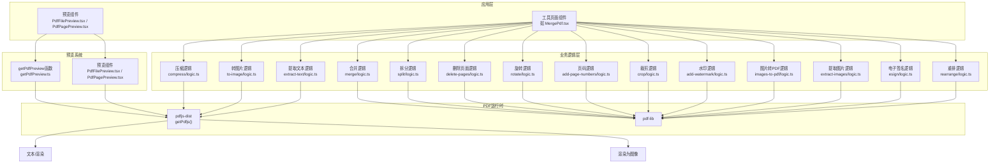
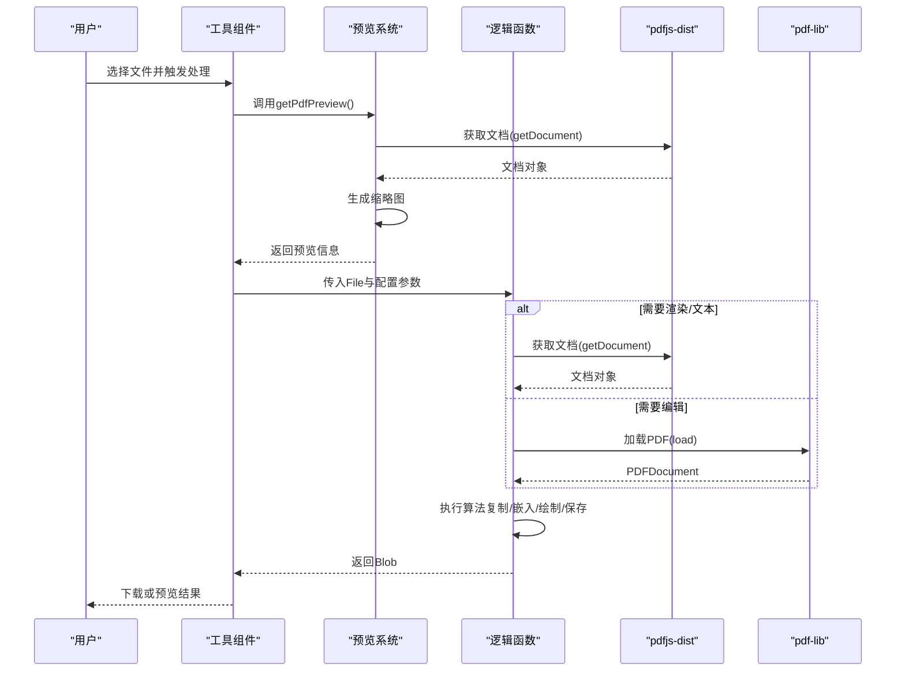
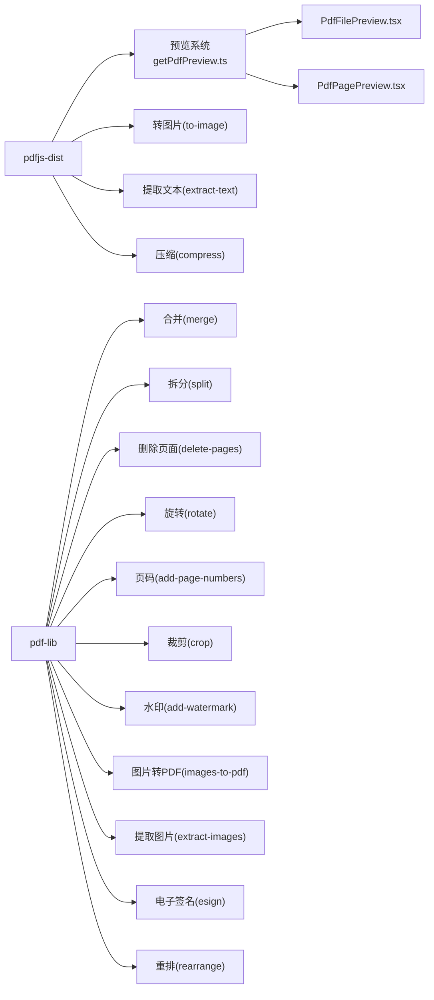

# PDF工具

<cite>
**本文引用的文件**
- [README.md](file://README.md)
- [package.json](file://package.json)
- [src/lib/pdfjs.ts](file://src/lib/pdfjs.ts)
- [src/lib/pdf/getPdfPreview.ts](file://src/lib/pdf/getPdfPreview.ts)
- [src/components/shared/PdfFilePreview.tsx](file://src/components/shared/PdfFilePreview.tsx)
- [src/components/shared/PdfPagePreview.tsx](file://src/components/shared/PdfPagePreview.tsx)
- [src/tools/pdf/merge/logic.ts](file://src/tools/pdf/merge/logic.ts)
- [src/tools/pdf/split/logic.ts](file://src/tools/pdf/split/logic.ts)
- [src/tools/pdf/compress/logic.ts](file://src/tools/pdf/compress/logic.ts)
- [src/tools/pdf/to-image/logic.ts](file://src/tools/pdf/to-image/logic.ts)
- [src/tools/pdf/extract-text/logic.ts](file://src/tools/pdf/extract-text/logic.ts)
- [src/tools/pdf/delete-pages/logic.ts](file://src/tools/pdf/delete-pages/logic.ts)
- [src/tools/pdf/rotate/logic.ts](file://src/tools/pdf/rotate/logic.ts)
- [src/tools/pdf/add-page-numbers/logic.ts](file://src/tools/pdf/add-page-numbers/logic.ts)
- [src/tools/pdf/crop/logic.ts](file://src/tools/pdf/crop/logic.ts)
- [src/tools/pdf/add-watermark/logic.ts](file://src/tools/pdf/add-watermark/logic.ts)
- [src/tools/pdf/images-to-pdf/logic.ts](file://src/tools/pdf/images-to-pdf/logic.ts)
- [src/tools/pdf/extract-images/logic.ts](file://src/tools/pdf/extract-images/logic.ts)
- [src/tools/pdf/esign/logic.ts](file://src/tools/pdf/esign/logic.ts)
- [src/tools/pdf/rearrange/logic.ts](file://src/tools/pdf/rearrange/logic.ts)
- [src/tools/pdf/merge/MergePdf.tsx](file://src/tools/pdf/merge/MergePdf.tsx)
- [src/tools/pdf/split/SplitPdf.tsx](file://src/tools/pdf/split/SplitPdf.tsx)
- [src/tools/pdf/compress/CompressPdf.tsx](file://src/tools/pdf/compress/CompressPdf.tsx)
- [src/tools/pdf/to-image/PdfToImage.tsx](file://src/tools/pdf/to-image/PdfToImage.tsx)
- [src/tools/pdf/extract-text/ExtractText.tsx](file://src/tools/pdf/extract-text/ExtractText.tsx)
- [src/tools/pdf/delete-pages/DeletePages.tsx](file://src/tools/pdf/delete-pages/DeletePages.tsx)
- [src/tools/pdf/rotate/RotatePdf.tsx](file://src/tools/pdf/rotate/RotatePdf.tsx)
- [src/tools/pdf/add-page-numbers/AddPageNumbers.tsx](file://src/tools/pdf/add-page-numbers/AddPageNumbers.tsx)
- [src/tools/pdf/crop/CropPdf.tsx](file://src/tools/pdf/crop/CropPdf.tsx)
- [src/tools/pdf/add-watermark/AddWatermarkPdf.tsx](file://src/tools/pdf/add-watermark/AddWatermarkPdf.tsx)
</cite>

## 更新摘要
**所做更改**
- 新增PDF文件预览系统集成章节，详细介绍新的getPdfPreview函数和预览组件
- 更新所有PDF工具的客户端组件，集成新的预览系统
- 新增PdfFilePreview和PdfPagePreview组件的详细说明
- 更新架构图以反映预览系统的集成
- 增强性能考量章节，包含预览系统的优化建议

## 目录
1. [简介](#简介)
2. [PDF文件预览系统](#pdf文件预览系统)
3. [项目结构](#项目结构)
4. [核心组件](#核心组件)
5. [架构总览](#架构总览)
6. [详细组件分析](#详细组件分析)
7. [依赖关系分析](#依赖关系分析)
8. [性能考量](#性能考量)
9. [故障排除指南](#故障排除指南)
10. [结论](#结论)
11. [附录](#附录)

## 简介
本文件面向"PDF工具"模块，系统梳理并解释14项PDF处理能力：合并、拆分、压缩、转图片、删除页面、旋转、提取文本、添加页码、重新排列、裁剪、添加水印、图片转PDF、提取图片与电子签名。文档覆盖技术原理（PDF解析、内容提取、格式转换）、标准与兼容性、算法实现（文本识别、图像嵌入、元数据管理）、使用场景与参数配置，并说明与pdfjs-dist和pdf-lib的集成方式，最后提供质量保障与故障排除建议。

**更新** 本版本重点介绍了新的PDF文件预览系统，该系统提供了高效的PDF文件信息预览和页面缩略图生成功能，显著提升了用户体验。

## PDF文件预览系统

### getPdfPreview函数
新的PDF文件预览系统通过getPdfPreview函数提供核心预览功能：

**图表来源**
- [src/lib/pdf/getPdfPreview.ts:10-30](file://src/lib/pdf/getPdfPreview.ts#L10-L30)

### PdfFilePreview组件
PdfFilePreview组件提供PDF文件的可视化预览：

- 显示PDF缩略图或默认图标
- 展示文件名称、页数和文件大小
- 支持替换文件和删除操作
- 在禁用状态下提供适当的交互状态

### PdfPagePreview组件
PdfPagePreview组件用于渲染单个PDF页面的缩略图：

- 支持自定义宽度和选中状态
- 实现懒加载和错误处理
- 提供页面编号显示
- 支持点击事件回调

**章节来源**
- [src/lib/pdf/getPdfPreview.ts:1-30](file://src/lib/pdf/getPdfPreview.ts#L1-L30)
- [src/components/shared/PdfFilePreview.tsx:1-86](file://src/components/shared/PdfFilePreview.tsx#L1-L86)
- [src/components/shared/PdfPagePreview.tsx:1-80](file://src/components/shared/PdfPagePreview.tsx#L1-L80)

## 项目结构
- 工具分类与数量：PDF工具包含14个子功能，分布在src/tools/pdf目录下，每个工具由index.ts（工具定义）、客户端组件（例如MergePdf.tsx）与纯逻辑处理文件（logic.ts）组成。
- 技术栈：前端全栈在浏览器端执行，使用pdf-lib进行PDF编辑、pdfjs-dist进行PDF渲染与文本提取、FFmpeg.wasm用于视频/音频处理（图片转PDF时可能涉及）、tesseract.js用于OCR（开发者工具中提供）。
- **新增** 预览系统：新增getPdfPreview函数和相关预览组件，提供PDF文件信息的快速预览。

**图表来源**
- [src/lib/pdf/getPdfPreview.ts:1-30](file://src/lib/pdf/getPdfPreview.ts#L1-L30)
- [src/components/shared/PdfFilePreview.tsx:1-86](file://src/components/shared/PdfFilePreview.tsx#L1-L86)
- [src/components/shared/PdfPagePreview.tsx:1-80](file://src/components/shared/PdfPagePreview.tsx#L1-L80)
- [src/lib/pdfjs.ts:1-15](file://src/lib/pdfjs.ts#L1-L15)

**章节来源**
- [README.md: 22](file://README.md#L22)
- [README.md: 32](file://README.md#L32)
- [package.json: 25](file://package.json#L25)
- [package.json: 26](file://package.json#L26)

## 核心组件
- pdfjs-dist封装：统一初始化worker路径，按需获取PDF文档对象，支持渲染、文本提取、视口计算等。
- pdf-lib封装：统一创建、复制页面、嵌入图像/字体、设置旋转、绘制文本、保存PDF。
- **新增** 预览系统：getPdfPreview函数提供PDF文件的快速预览，包括页数统计和缩略图生成。
- **新增** 预览组件：PdfFilePreview和PdfPagePreview提供直观的PDF文件和页面预览界面。
- 各工具逻辑：以纯函数形式封装具体算法，接收File输入、返回Blob输出；多数提供进度回调与文件大小格式化工具。

**章节来源**
- [src/lib/pdfjs.ts: 1-15:1-15](file://src/lib/pdfjs.ts#L1-L15)
- [src/lib/pdf/getPdfPreview.ts: 1-30:1-30](file://src/lib/pdf/getPdfPreview.ts#L1-L30)
- [src/components/shared/PdfFilePreview.tsx: 1-86:1-86](file://src/components/shared/PdfFilePreview.tsx#L1-L86)
- [src/components/shared/PdfPagePreview.tsx: 1-80:1-80](file://src/components/shared/PdfPagePreview.tsx#L1-L80)

## 架构总览
- 输入：用户上传的PDF文件（File）
- **新增** 预览：通过getPdfPreview函数获取PDF文档信息和缩略图
- 解析：pdfjs-dist读取PDF元信息与页面；pdf-lib加载PDF文档以进行编辑
- 处理：各工具逻辑对页面进行复制、嵌入、重排、旋转、绘制等操作
- 输出：生成新的PDF Blob，供下载或进一步处理

**图表来源**
- [src/lib/pdf/getPdfPreview.ts:10-30](file://src/lib/pdf/getPdfPreview.ts#L10-L30)
- [src/lib/pdfjs.ts:1-15](file://src/lib/pdfjs.ts#L1-L15)

## 详细组件分析

### 合并（MergePdf）
- 功能：将多个PDF文件合并为一个PDF。
- **更新** 集成预览：虽然合并操作不需要预览，但UI层仍可显示文件信息。
- 算法要点：
  - 使用pdf-lib创建新文档，逐个加载源PDF，复制页面索引，批量添加到新文档。
  - 保持原页面布局与资源引用。
- 性能：O(N)页面复制，内存占用与总页数成正比。
- 参数与行为：无额外参数，直接合并。

**章节来源**
- [src/tools/pdf/merge/MergePdf.tsx:1-126](file://src/tools/pdf/merge/MergePdf.tsx#L1-L126)
- [src/tools/pdf/merge/logic.ts:1-24](file://src/tools/pdf/merge/logic.ts#L1-L24)

### 拆分（SplitPdf）
- 功能：按单页或页码范围拆分为多个PDF。
- **更新** 集成预览：使用getPdfPreview获取PDF信息，显示缩略图和页数。
- 算法要点：
  - 单页拆分：循环每一页，创建新PDF并复制该页。
  - 范围拆分：根据起止范围构造索引数组，复制对应页集合。
- 输出：返回每个拆分结果的Blob、文件名与页数。
- 参数与行为：支持页码范围列表，文件名包含基础名与页码段标识。

**章节来源**
- [src/tools/pdf/split/SplitPdf.tsx:1-183](file://src/tools/pdf/split/SplitPdf.tsx#L1-L183)
- [src/tools/pdf/split/logic.ts:1-73](file://src/tools/pdf/split/logic.ts#L1-L73)

### 压缩（CompressPdf）
- 功能：通过将每页渲染为图像再嵌入的方式降低PDF体积（适合扫描版PDF）。
- **更新** 集成预览：使用getPdfPreview显示PDF基本信息。
- 算法要点：
  - 使用pdfjs-dist按比例渲染为Canvas，转为JPEG Blob。
  - 使用pdf-lib嵌入JPEG为新PDF页面，尺寸采用原始视口。
  - 提供进度回调，逐页处理。
- 质量控制：通过scale与jpeg质量参数平衡体积与清晰度。
- 参数与行为：quality高/中/低三档，内部映射scale与jpeg质量。

**章节来源**
- [src/tools/pdf/compress/CompressPdf.tsx:1-158](file://src/tools/pdf/compress/CompressPdf.tsx#L1-L158)
- [src/tools/pdf/compress/logic.ts:1-73](file://src/tools/pdf/compress/logic.ts#L1-L73)

### 转图片（PdfToImage）
- 功能：将PDF每页渲染为PNG/JPEG图像，支持打包为ZIP下载。
- **更新** 集成预览：使用getPdfPreview获取PDF信息，提供预览功能。
- 算法要点：
  - 使用pdfjs-dist渲染每页到Canvas，按格式与质量参数导出Blob。
  - 支持逐页回调与全局进度回调。
- 输出：每页图像对象数组，可打包为ZIP。
- 参数与行为：format（png/jpg）、quality（1-100）、scale（缩放系数）。

**章节来源**
- [src/tools/pdf/to-image/PdfToImage.tsx:1-302](file://src/tools/pdf/to-image/PdfToImage.tsx#L1-L302)
- [src/tools/pdf/to-image/logic.ts:1-86](file://src/tools/pdf/to-image/logic.ts#L1-L86)

### 提取文本（ExtractText）
- 功能：提取PDF每页文本内容，按页拼接。
- **更新** 集成预览：使用getPdfPreview显示PDF基本信息。
- 算法要点：
  - 使用pdfjs-dist获取每页文本内容，过滤有效字符串并拼接。
- 输出：包含页头标记的完整文本。
- 参数与行为：无额外参数。

**章节来源**
- [src/tools/pdf/extract-text/ExtractText.tsx:1-105](file://src/tools/pdf/extract-text/ExtractText.tsx#L1-L105)
- [src/tools/pdf/extract-text/logic.ts:1-25](file://src/tools/pdf/extract-text/logic.ts#L1-L25)

### 删除页面（DeletePages）
- 功能：删除指定页号集合。
- **更新** 集成预览：使用getPdfPreview获取PDF文档对象，PdfPagePreview组件渲染页面缩略图。
- 算法要点：
  - 构造保留页索引集，复制并添加到新PDF。
- 输出：新PDF Blob。
- 参数与行为：以页号集合表示待删页。

**章节来源**
- [src/tools/pdf/delete-pages/DeletePages.tsx:1-152](file://src/tools/pdf/delete-pages/DeletePages.tsx#L1-L152)
- [src/tools/pdf/delete-pages/logic.ts:1-39](file://src/tools/pdf/delete-pages/logic.ts#L1-L39)

### 旋转（RotatePdf）
- 功能：对指定页设置旋转角度（叠加当前角度，归一化到0-360）。
- **更新** 集成预览：使用getPdfPreview显示PDF基本信息。
- 算法要点：
  - 读取每页当前旋转，累加目标角度并标准化。
- 输出：新PDF Blob。
- 参数与行为：以页索引到角度的映射描述旋转。

**章节来源**
- [src/tools/pdf/rotate/RotatePdf.tsx:1-144](file://src/tools/pdf/rotate/RotatePdf.tsx#L1-L144)
- [src/tools/pdf/rotate/logic.ts:1-30](file://src/tools/pdf/rotate/logic.ts#L1-L30)

### 添加页码（AddPageNumbers）
- 功能：在指定位置绘制页码，支持多种格式与起始页。
- **更新** 集成预览：使用getPdfPreview显示PDF基本信息。
- 算法要点：
  - 嵌入标准字体，计算文本宽度与视觉坐标系，考虑页面旋转进行坐标变换。
  - 支持顶部/底部、居中/左/右定位。
- 输出：新PDF Blob。
- 参数与行为：position（位置）、fontSize（字号）、format（数字/带"Page"/"n/MAX"）、startPage（起始页）。

**章节来源**
- [src/tools/pdf/add-page-numbers/AddPageNumbers.tsx:1-204](file://src/tools/pdf/add-page-numbers/AddPageNumbers.tsx#L1-L204)
- [src/tools/pdf/add-page-numbers/logic.ts:1-94](file://src/tools/pdf/add-page-numbers/logic.ts#L1-L94)

### 裁剪（CropPdf）
- 功能：按矩形区域裁剪页面。
- **更新** 集成预览：使用getPdfPreview显示PDF基本信息。
- 算法要点：
  - 使用pdf-lib的裁剪盒（CropBox）或通过重绘与裁剪路径实现。
  - 保持页面内容在裁剪区域内显示。
- 输出：新PDF Blob。
- 参数与行为：矩形坐标（x0, y0, width, height）。

**章节来源**
- [src/tools/pdf/crop/CropPdf.tsx:1-149](file://src/tools/pdf/crop/CropPdf.tsx#L1-L149)
- [src/tools/pdf/crop/logic.ts](file://src/tools/pdf/crop/logic.ts)

### 添加水印（AddWatermarkPdf）
- 功能：为PDF添加文字或图片水印。
- **更新** 集成预览：使用getPdfPreview显示PDF基本信息。
- 算法要点：
  - 文字水印：嵌入字体，计算位置与透明度，绘制于每页。
  - 图片水印：嵌入图片，设置尺寸与位置，必要时旋转或透明化。
- 输出：新PDF Blob。
- 参数与行为：水印类型、内容、位置、透明度、尺寸、角度等。

**章节来源**
- [src/tools/pdf/add-watermark/AddWatermarkPdf.tsx:1-173](file://src/tools/pdf/add-watermark/AddWatermarkPdf.tsx#L1-L173)
- [src/tools/pdf/add-watermark/logic.ts](file://src/tools/pdf/add-watermark/logic.ts)

### 图片转PDF（ImagesToPdf）
- 功能：将多张图片合并为PDF。
- 算法要点：
  - 读取图片尺寸，按页面尺寸嵌入图片，支持多页。
  - 可选缩放策略与布局。
- 输出：新PDF Blob。
- 参数与行为：图片数组、页面尺寸、对齐方式等。

**章节来源**
- [src/tools/pdf/images-to-pdf/logic.ts](file://src/tools/pdf/images-to-pdf/logic.ts)

### 提取图片（ExtractImages）
- 功能：从PDF中提取嵌入的图片资源。
- 算法要点：
  - 遍历页面资源，提取XObject中的图片数据，导出为图像文件。
- 输出：图片文件数组（PNG/JPEG等）。
- 参数与行为：无额外参数。

**章节来源**
- [src/tools/pdf/extract-images/logic.ts](file://src/tools/pdf/extract-images/logic.ts)

### 电子签名（ESign）
- 功能：为PDF添加电子签名（如图片印章或手写签名）。
- 算法要点：
  - 将签名图片作为水印叠加到指定页，控制位置与透明度。
  - 或嵌入手写路径形成矢量签名。
- 输出：新PDF Blob。
- 参数与行为：签名图片、页码、位置、尺寸、透明度等。

**章节来源**
- [src/tools/pdf/esign/logic.ts](file://src/tools/pdf/esign/logic.ts)

### 重新排列（RearrangePdf）
- 功能：调整页面顺序。
- 算法要点：
  - 复制页面到新顺序，保持每页内容不变。
- 输出：新PDF Blob。
- 参数与行为：目标页序数组。

**章节来源**
- [src/tools/pdf/rearrange/logic.ts](file://src/tools/pdf/rearrange/logic.ts)

## 依赖关系分析

**图表来源**
- [src/lib/pdf/getPdfPreview.ts:1-30](file://src/lib/pdf/getPdfPreview.ts#L1-L30)
- [src/components/shared/PdfFilePreview.tsx:1-86](file://src/components/shared/PdfFilePreview.tsx#L1-L86)
- [src/components/shared/PdfPagePreview.tsx:1-80](file://src/components/shared/PdfPagePreview.tsx#L1-L80)
- [src/lib/pdfjs.ts:1-15](file://src/lib/pdfjs.ts#L1-L15)

## 性能考量
- **新增** 预览系统优化
  - 缩略图生成：getPdfPreview函数使用160像素宽度作为默认缩放，平衡了预览质量和性能。
  - Canvas复用：PdfPagePreview组件在渲染完成后会清理Canvas上下文，避免内存泄漏。
  - 懒加载：PdfPagePreview组件仅在需要时渲染页面，提高大PDF文件的响应速度。
- 渲染与压缩
  - 转图片/压缩均涉及Canvas渲染，大页或高分辨率会显著增加内存与CPU消耗。建议合理设置scale与质量参数。
  - 压缩流程中及时释放Canvas内存，避免GPU内存泄漏。
- 并行与进度
  - 对于多页处理，建议在UI层提供进度条与取消机制，避免长时间阻塞。
- 内存管理
  - 大文件合并/拆分时注意分批处理，避免一次性加载过多页面导致内存峰值过高。
  - **新增** 预览URL管理：PdfToImage组件使用URL映射表管理生成的Blob URL，及时清理不再使用的URL。
- 输出优化
  - 压缩后PDF仍可能包含高分辨率图像资源，可结合外部工具二次压缩（本项目为浏览器端，建议在UI提示后续步骤）。

## 故障排除指南
- **新增** 预览系统问题
  - 现象：预览无法生成或显示空白。
  - 排查：检查getPdfPreview函数的Canvas上下文是否可用，确认PDF文件格式正确。
  - 参考：[src/lib/pdf/getPdfPreview.ts:22-28](file://src/lib/pdf/getPdfPreview.ts#L22-L28)
- pdfjs-dist worker未配置
  - 现象：渲染失败或报错。
  - 排查：确认已调用pdfjs封装函数以设置worker路径。
  - 参考：[src/lib/pdfjs.ts:1-15](file://src/lib/pdfjs.ts#L1-L15)
- Canvas上下文不可用
  - 现象：转图片或预览时报Canvas上下文错误。
  - 排查：确保在受支持的环境中运行，且页面可见。
  - 参考：[src/lib/pdf/getPdfPreview.ts:25-26](file://src/lib/pdf/getPdfPreview.ts#L25-L26)
- 图像嵌入失败
  - 现象：图片转PDF或添加水印时报错。
  - 排查：确认图片数据有效且尺寸合理；pdf-lib版本兼容性。
  - 参考：[src/tools/pdf/images-to-pdf/logic.ts](file://src/tools/pdf/images-to-pdf/logic.ts)
- 旋转后坐标异常
  - 现象：页码或水印位置不正确。
  - 排查：检查坐标变换逻辑与页面旋转角度，确保在绘制前完成坐标换算。
  - 参考：[src/tools/pdf/add-page-numbers/logic.ts:66-74](file://src/tools/pdf/add-page-numbers/logic.ts#L66-L74)
- 大文件处理卡顿
  - 现象：合并/拆分/压缩耗时过长。
  - 排查：降低scale、减少并发、分批处理；在UI层提供取消与进度反馈。
  - 参考：[src/tools/pdf/compress/logic.ts:24-61](file://src/tools/pdf/compress/logic.ts#L24-L61)

## 结论
本PDF工具模块基于pdfjs-dist与pdf-lib实现了完整的浏览器端PDF处理能力，覆盖合并、拆分、压缩、转图片、删除页面、旋转、提取文本、添加页码、重新排列、裁剪、添加水印、图片转PDF、提取图片与电子签名等场景。**更新** 新的PDF文件预览系统显著提升了用户体验，通过getPdfPreview函数和预览组件提供了快速的PDF文件信息展示和页面缩略图生成功能。通过合理的参数配置与内存管理，可在浏览器端高效完成常见PDF任务。建议在生产使用中结合进度反馈与错误提示，提升用户体验与稳定性。

## 附录

### 使用场景与参数配置建议
- 合并：适用于多份文档拼接，注意页数较多时的内存占用。
- 拆分：单页或范围拆分，便于分发与归档。**更新** 集成预览后可直观看到PDF信息。
- 压缩：扫描版PDF降体积，建议先试用中档质量评估效果。**更新** 预览系统可快速确认压缩前后的变化。
- 转图片：批量导出页面为图像，支持PNG/JPEG与质量控制。**更新** 预览功能提供实时页面预览。
- 删除页面：移除不需要的空白或水印页。**更新** PdfPagePreview组件提供直观的选择界面。
- 旋转：统一页面方向，配合页码/水印定位。
- 提取文本：用于检索与二次加工，注意非结构化文本的清洗。
- 添加页码：多种格式与起始页，适配不同报告模板。
- 重新排列：调整目录或顺序，保持内容完整性。
- 裁剪：聚焦页面特定区域，去除边距。
- 添加水印：文字或图片水印，控制透明度与位置。
- 图片转PDF：批量图片生成PDF，注意图片尺寸与对齐。
- 提取图片：导出嵌入图片，便于二次编辑。
- 电子签名：图片印章或手写签名，确保位置与透明度。

### 与pdfjs-dist和pdf-lib的集成方式
- pdfjs-dist：通过统一封装设置worker路径，按需获取文档对象，支持渲染与文本提取。
- pdf-lib：用于PDF编辑，包括复制页面、嵌入图像/字体、设置旋转、绘制文本与保存。
- **新增** 预览系统：getPdfPreview函数提供PDF文件的快速预览，包括页数统计和缩略图生成。

### 预览系统集成指南
- **getPdfPreview函数**：提供PDF文件的基本信息和缩略图，支持自定义缩略图宽度。
- **PdfFilePreview组件**：显示PDF文件的缩略图、名称、页数和文件大小，支持文件替换和删除。
- **PdfPagePreview组件**：渲染单个PDF页面的缩略图，支持自定义宽度和选中状态。

**章节来源**
- [src/lib/pdfjs.ts: 1-15:1-15](file://src/lib/pdfjs.ts#L1-L15)
- [src/lib/pdf/getPdfPreview.ts: 1-30:1-30](file://src/lib/pdf/getPdfPreview.ts#L1-L30)
- [src/components/shared/PdfFilePreview.tsx: 1-86:1-86](file://src/components/shared/PdfFilePreview.tsx#L1-L86)
- [src/components/shared/PdfPagePreview.tsx: 1-80:1-80](file://src/components/shared/PdfPagePreview.tsx#L1-L80)
- [package.json: 25](file://package.json#L25)
- [package.json: 26](file://package.json#L26)