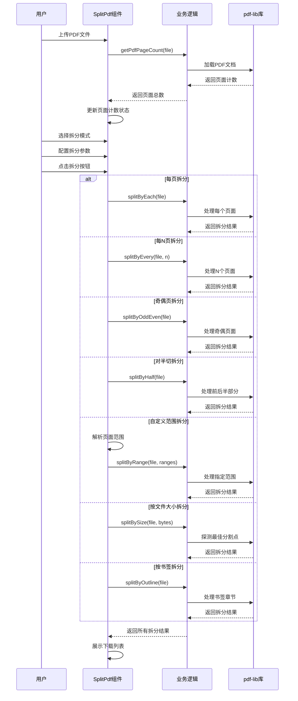
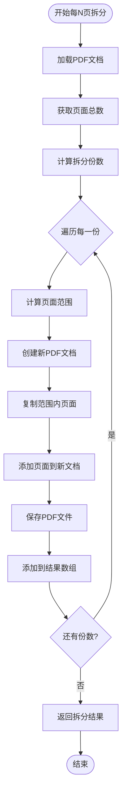
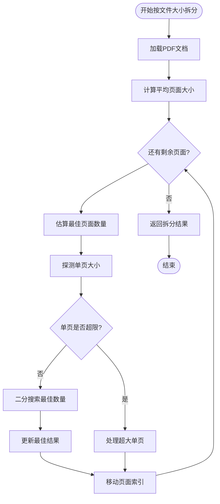
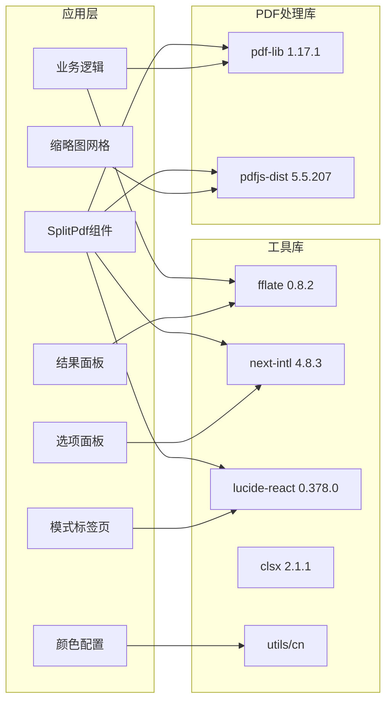

# PDF拆分工具

<cite>
**本文档引用的文件**
- [SplitPdf.tsx](file://src/tools/pdf/split/SplitPdf.tsx)
- [logic.ts](file://src/tools/pdf/split/logic.ts)
- [index.ts](file://src/tools/pdf/split/index.ts)
- [ModeTabs.tsx](file://src/tools/pdf/split/components/ModeTabs.tsx)
- [ModeOptionsPanel.tsx](file://src/tools/pdf/split/components/ModeOptionsPanel.tsx)
- [ThumbnailGrid.tsx](file://src/tools/pdf/split/components/ThumbnailGrid.tsx)
- [ResultsPanel.tsx](file://src/tools/pdf/split/components/ResultsPanel.tsx)
- [colors.ts](file://src/tools/pdf/split/colors.ts)
- [tools-pdf.json](file://messages/zh-Hans/tools-pdf.json)
- [pdfjs.ts](file://src/lib/pdfjs.ts)
- [package.json](file://package.json)
- [ToolPageClient.tsx](file://src/app/[locale]/tools/[category]/[slug]/ToolPageClient.tsx)
- [ToolPageShell.tsx](file://src/components/tool/ToolPageShell.tsx)
- [MergePdf.tsx](file://src/tools/pdf/merge/MergePdf.tsx)
- [DeletePages.tsx](file://src/tools/pdf/delete-pages/DeletePages.tsx)
</cite>

## 更新摘要
**变更内容**
- 新增七种拆分模式的完整实现和文档
- 更新架构图为模块化组件设计
- 增强用户界面和交互体验
- 添加彩色预览系统和进度监控
- 完善错误处理和国际化支持

## 目录
1. [简介](#简介)
2. [项目结构](#项目结构)
3. [核心组件](#核心组件)
4. [架构概览](#架构概览)
5. [详细组件分析](#详细组件分析)
6. [拆分模式详解](#拆分模式详解)
7. [依赖分析](#依赖分析)
8. [性能考虑](#性能考虑)
9. [故障排除指南](#故障排除指南)
10. [结论](#结论)
11. [附录](#附录)

## 简介

PDF拆分工具是一个功能强大的基于浏览器的PDF处理工具，支持七种不同的拆分策略。该工具完全在浏览器中运行，无需上传文件到服务器，确保用户隐私和数据安全。

**新增的七种拆分模式**：
- **每页一份**：将PDF的每个页面拆分为独立的PDF文件
- **每N页**：将连续的N个页面合为一份PDF
- **奇偶页**：拆分为奇数页和偶数页两个文件
- **对半切**：将PDF平均分为前后两部分
- **自定义范围**：允许用户指定任意页面范围进行拆分
- **按文件大小**：根据文件大小限制自动拆分
- **按书签**：使用PDF大纲书签进行拆分

工具集成了pdf-lib库进行PDF操作，支持完整的页面提取、内容重排和格式保持，同时提供直观的用户界面、彩色预览和实时反馈。

## 项目结构

PDF拆分工具位于媒体工具箱项目的PDF工具模块中，采用高度模块化的架构设计：

```mermaid
graph TB
subgraph "PDF拆分工具模块"
SplitPdf[SplitPdf.tsx<br/>主组件]
SplitLogic[logic.ts<br/>业务逻辑]
SplitIndex[index.ts<br/>工具定义]
subgraph "组件层"
ModeTabs[ModeTabs.tsx<br/>模式标签页]
ModeOptions[ModeOptionsPanel.tsx<br/>选项面板]
ThumbnailGrid[ThumbnailGrid.tsx<br/>缩略图网格]
ResultsPanel[ResultsPanel.tsx<br/>结果面板]
Colors[colors.ts<br/>颜色配置]
end
subgraph "工具页面层"
ToolClient[ToolPageClient.tsx<br/>客户端壳层]
ToolShell[ToolPageShell.tsx<br/>工具外壳]
end
subgraph "国际化支持"
ToolsJson[tools-pdf.json<br/>中文翻译]
end
end
subgraph "依赖库"
PdfLib[pdf-lib<br/>PDF操作库]
PdfJs[pdfjs-dist<br/>PDF渲染库]
Fflate[fflate<br/>压缩库]
Intl[next-intl<br/>国际化]
Lucide[lucide-react<br/>图标库]
</subgraph>
SplitPdf --> SplitLogic
SplitPdf --> SplitIndex
SplitPdf --> ModeTabs
SplitPdf --> ModeOptions
SplitPdf --> ThumbnailGrid
SplitPdf --> ResultsPanel
SplitPdf --> Colors
ModeTabs --> Colors
ModeOptions --> SplitLogic
ThumbnailGrid --> Colors
ResultsPanel --> SplitLogic
SplitLogic --> PdfLib
SplitPdf --> ToolsJson
```

**图表来源**
- [SplitPdf.tsx:1-369](file://src/tools/pdf/split/SplitPdf.tsx#L1-L369)
- [logic.ts:1-462](file://src/tools/pdf/split/logic.ts#L1-L462)
- [index.ts:1-49](file://src/tools/pdf/split/index.ts#L1-L49)

**章节来源**
- [SplitPdf.tsx:1-369](file://src/tools/pdf/split/SplitPdf.tsx#L1-L369)
- [logic.ts:1-462](file://src/tools/pdf/split/logic.ts#L1-L462)
- [index.ts:1-49](file://src/tools/pdf/split/index.ts#L1-L49)

## 核心组件

### SplitPdf 主组件

SplitPdf是PDF拆分工具的核心UI组件，负责处理用户交互和展示拆分结果。该组件实现了以下关键功能：

- **文件上传处理**：通过FileDropzone组件接收PDF文件输入
- **页面计数显示**：动态显示PDF的总页数
- **拆分模式切换**：支持七种不同的拆分策略
- **彩色预览系统**：实时显示页面归属关系
- **结果展示**：以卡片形式展示拆分后的文件列表
- **批量下载**：支持ZIP打包下载所有结果
- **进度监控**：提供详细的处理进度反馈

### 业务逻辑模块

logic.ts模块封装了PDF拆分的核心算法，提供了七个主要的拆分函数：

- **splitByEach**：实现每页一份拆分功能
- **splitByEvery**：实现每N页拆分功能
- **splitByOddEven**：实现奇偶页拆分功能
- **splitByHalf**：实现对半切拆分功能
- **splitByRange**：实现自定义范围拆分功能
- **splitBySize**：实现按文件大小拆分功能
- **splitByOutline**：实现按书签拆分功能

### 模式配置系统

colors.ts文件定义了页面颜色映射系统，为每种拆分模式提供独特的视觉标识：

- **SPLIT_COLORS**：八种不同的颜色方案
- **pageColor**：根据页面和模式返回对应颜色类名
- **partsCount**：计算拆分结果的数量

### 工具定义模块

index.ts文件定义了工具的基本信息，包括：
- 工具标识符和分类
- 图标设置和SEO配置
- 相关工具链接
- FAQ内容

**章节来源**
- [SplitPdf.tsx:36-369](file://src/tools/pdf/split/SplitPdf.tsx#L36-L369)
- [logic.ts:5-462](file://src/tools/pdf/split/logic.ts#L5-L462)
- [colors.ts:1-79](file://src/tools/pdf/split/colors.ts#L1-L79)
- [index.ts:1-49](file://src/tools/pdf/split/index.ts#L1-L49)

## 架构概览

PDF拆分工具采用分层架构设计，确保代码的可维护性和扩展性：

```mermaid
graph TD
subgraph "表现层"
UI[SplitPdf.tsx<br/>主界面]
ModeTabs[ModeTabs.tsx<br/>模式选择]
ModeOptions[ModeOptionsPanel.tsx<br/>参数配置]
ThumbnailGrid[ThumbnailGrid.tsx<br/>页面预览]
ResultsPanel[ResultsPanel.tsx<br/>结果展示]
end
subgraph "业务逻辑层"
Logic[logic.ts<br/>拆分算法]
Utils[工具函数<br/>格式化/验证]
Colors[colors.ts<br/>颜色映射]
end
subgraph "数据持久层"
Results[SplitResult[]<br/>拆分结果]
State[React状态<br/>组件状态]
Progress[SplitProgress<br/>进度信息]
Abort[AbortController<br/>取消控制]
end
subgraph "外部依赖"
PdfLib[pdf-lib<br/>PDF操作]
PdfJs[pdfjs-dist<br/>PDF渲染]
Intl[next-intl<br/>国际化]
Fflate[fflate<br/>ZIP压缩]
Lucide[lucide-react<br/>图标]
</subgraph>
UI --> Logic
UI --> Utils
UI --> Colors
ModeTabs --> Colors
ModeOptions --> Logic
ThumbnailGrid --> Colors
ResultsPanel --> Logic
Logic --> PdfLib
Logic --> Fflate
UI --> PdfJs
UI --> Intl
UI --> State
Logic --> Results
Logic --> Progress
Logic --> Abort
```

**图表来源**
- [SplitPdf.tsx:3-15](file://src/tools/pdf/split/SplitPdf.tsx#L3-L15)
- [logic.ts:1](file://src/tools/pdf/split/logic.ts#L1)
- [colors.ts:14-21](file://src/tools/pdf/split/colors.ts#L14-L21)

该架构实现了以下设计原则：
- **关注点分离**：UI逻辑与业务逻辑完全分离
- **依赖注入**：通过导入语句明确依赖关系
- **状态管理**：使用React Hooks管理组件状态
- **异步处理**：所有PDF操作都是异步执行
- **模块化设计**：功能按职责划分为独立模块

## 详细组件分析

### SplitPdf 组件详细分析

SplitPdf组件是整个工具的核心，实现了完整的用户交互流程：



**图表来源**
- [SplitPdf.tsx:164-260](file://src/tools/pdf/split/SplitPdf.tsx#L164-L260)
- [logic.ts:79-418](file://src/tools/pdf/split/logic.ts#L79-L418)

#### 页面选择界面设计

组件提供了直观的页面选择界面：

- **文件上传区**：支持拖拽和点击上传PDF文件
- **页面计数显示**：实时显示PDF的总页数
- **拆分模式选择**：七种模式的标签页切换
- **彩色预览**：缩略图网格显示页面归属关系
- **范围输入框**：当选择范围拆分时显示，支持逗号分隔的页码范围
- **结果展示区**：以卡片形式展示所有拆分结果

#### 拆分参数配置

组件支持灵活的拆分参数配置：

- **每页拆分模式**：将每个页面拆分为独立文件
- **每N页拆分模式**：每N个连续页面合为一份文件
- **奇偶页拆分模式**：拆分为奇数页和偶数页两份文件
- **对半切拆分模式**：将文档平均分为前后两部分
- **范围拆分模式**：允许用户自定义页面范围
- **按文件大小拆分模式**：设置每份文件的最大大小
- **按书签拆分模式**：使用PDF大纲书签进行拆分

**章节来源**
- [SplitPdf.tsx:36-369](file://src/tools/pdf/split/SplitPdf.tsx#L36-L369)

### 拆分算法实现

#### 每页拆分算法

每页拆分算法是最基础的拆分策略，实现简单且高效：


**图表来源**
- [logic.ts:79-105](file://src/tools/pdf/split/logic.ts#L79-L105)

#### 每N页拆分算法

每N页拆分算法支持批量处理连续页面：



**图表来源**
- [logic.ts:107-138](file://src/tools/pdf/split/logic.ts#L107-L138)

#### 按文件大小拆分算法

按文件大小拆分算法是最复杂的策略，包含二分搜索优化：



**图表来源**
- [logic.ts:262-340](file://src/tools/pdf/split/logic.ts#L262-L340)

#### 输出文件命名规则

拆分工具遵循统一的文件命名规则：

- **每页拆分**：`原文件名_page_X.pdf`（X为页面序号）
- **每N页拆分**：`原文件名_起始-结束.pdf`（如"document_1-3.pdf"）
- **奇偶页拆分**：`原文件名_odd.pdf`和`原文件名_even.pdf`
- **对半切拆分**：`原文件名_part1.pdf`和`原文件名_part2.pdf`
- **按书签拆分**：使用书签标题作为文件名，如"第一章.pdf"

这种命名规则确保了文件的有序性和可识别性。

**章节来源**
- [logic.ts:56-67](file://src/tools/pdf/split/logic.ts#L56-L67)
- [logic.ts:79-418](file://src/tools/pdf/split/logic.ts#L79-L418)

### 错误处理机制

组件实现了完善的错误处理机制：

- **输入验证**：检查文件类型和各种参数的有效性
- **异常捕获**：使用AbortSignal和DOMException处理取消操作
- **用户反馈**：通过错误消息向用户显示问题详情
- **状态管理**：在错误发生时正确更新组件状态
- **错误映射**：将内部错误映射为用户友好的本地化消息

**章节来源**
- [SplitPdf.tsx:233-259](file://src/tools/pdf/split/SplitPdf.tsx#L233-L259)

## 拆分模式详解

### 每页拆分模式

**功能描述**：将PDF的每个页面拆分为独立的PDF文件。

**适用场景**：
- 需要单独处理或分享单个页面
- 批量处理扫描文档
- 提取特定页面进行编辑

**算法特点**：
- 时间复杂度：O(n)，其中n为页面总数
- 内存使用：逐页处理，内存占用稳定
- 适用性：适合中小型PDF文档

### 每N页拆分模式

**功能描述**：将连续的N个页面合为一份PDF文件。

**适用场景**：
- 批量处理长文档
- 按章节或主题组织内容
- 控制输出文件数量

**参数配置**：
- **每份页数**：1到总页数减1之间的数值
- **预览功能**：实时显示拆分结果数量
- **边界处理**：最后一份可能少于N页

### 奇偶页拆分模式

**功能描述**：将PDF拆分为奇数页和偶数页两个文件。

**适用场景**：
- 双面扫描文档的页面修复
- 教学材料的分组处理
- 特定格式文档的预处理

**算法特点**：
- 时间复杂度：O(n)
- 空间复杂度：O(n)
- 无序处理：奇偶页分别处理

### 对半切拆分模式

**功能描述**：将PDF平均分为前后两部分。

**适用场景**：
- 长文档的快速分割
- 双人协作的文档分发
- 学习材料的阶段性处理

**算法特点**：
- 需要至少2页文档
- 前半部分：floor(total/2)页
- 后半部分：total - floor(total/2)页

### 自定义范围拆分模式

**功能描述**：允许用户指定任意页面范围进行拆分。

**适用场景**：
- 提取特定章节或段落
- 删除不需要的页面
- 组织特定内容序列

**范围格式**：
- **单页**：`5` 表示第5页
- **连续范围**：`1-3` 表示第1到第3页
- **多个范围**：`1-3, 5, 7-10` 表示多个不连续范围
- **合并选项**：可选择将所有范围合并为单个文件

### 按文件大小拆分模式

**功能描述**：根据文件大小限制自动拆分PDF。

**适用场景**：
- 邮件附件大小限制
- 云存储容量限制
- 网络传输优化

**算法特点**：
- 使用二分搜索优化页面数量
- 支持超大单页处理
- 探测阶段提供进度反馈
- 自适应页面大小变化

### 按书签拆分模式

**功能描述**：使用PDF的大纲书签进行拆分。

**适用场景**：
- 书籍和手册的章节拆分
- 学术论文的章节提取
- 技术文档的模块化处理

**算法特点**：
- 自动检测PDF书签
- 支持嵌套书签结构
- 书签标题作为文件名
- 边界处理：相邻书签间的页面

**章节来源**
- [logic.ts:79-418](file://src/tools/pdf/split/logic.ts#L79-L418)
- [ModeOptionsPanel.tsx:47-177](file://src/tools/pdf/split/components/ModeOptionsPanel.tsx#L47-L177)

## 依赖分析

### 核心依赖关系

PDF拆分工具的依赖关系相对简洁，主要依赖于几个关键库：



**图表来源**
- [package.json:11-32](file://package.json#L11-L32)
- [pdfjs.ts:1-16](file://src/lib/pdfjs.ts#L1-L16)

### 依赖特性分析

#### pdf-lib库集成

pdf-lib是PDF操作的核心库，提供了以下关键功能：
- PDF文档加载和保存
- 页面复制和添加
- 内容重排和格式保持
- 高效的内存管理

#### pdfjs-dist库支持

pdfjs-dist主要用于PDF渲染和预览功能：
- PDF文档解析
- 页面渲染
- 文本提取
- 图片处理

#### 性能优化策略

工具采用了多种性能优化策略：
- **异步处理**：所有PDF操作都是异步执行
- **内存管理**：及时释放不再使用的PDF对象
- **增量处理**：避免一次性处理大量数据
- **缓存机制**：复用已加载的PDF文档
- **事件循环让渡**：防止UI阻塞

**章节来源**
- [package.json:11-32](file://package.json#L11-L32)
- [pdfjs.ts:1-16](file://src/lib/pdfjs.ts#L1-L16)

## 性能考虑

### 浏览器环境限制

由于工具完全在浏览器中运行，需要考虑以下性能限制：

- **内存限制**：浏览器对单个标签页的内存使用有限制
- **CPU限制**：PDF处理是计算密集型操作
- **网络限制**：大文件处理可能影响用户体验

### 优化策略

针对这些限制，工具采用了以下优化策略：

1. **渐进式处理**：逐页处理PDF，避免一次性加载所有页面
2. **智能缓存**：复用已加载的PDF文档，避免重复解析
3. **异步操作**：使用Promise和async/await避免阻塞UI线程
4. **内存清理**：及时释放不再使用的PDF对象和Blob引用
5. **进度监控**：提供详细的处理进度反馈
6. **取消机制**：支持用户中断长时间操作

### 批量操作优化

工具支持批量处理的架构设计：

- **队列管理**：可以实现任务队列管理多个拆分任务
- **并发控制**：限制同时进行的PDF处理任务数量
- **进度跟踪**：为批量操作提供进度监控功能
- **错误隔离**：单个任务失败不影响其他任务

## 故障排除指南

### 常见问题及解决方案

#### 文件格式问题

**问题**：上传的文件不是PDF格式
**解决方案**：确保上传的是标准PDF文件，检查文件扩展名和文件头

#### 内存不足问题

**问题**：处理大文件时出现内存不足错误
**解决方案**：
- 关闭其他占用内存的标签页
- 尝试使用"每N页"而非"每页一份"模式
- 分批处理大型文档
- 使用"按文件大小"模式控制输出大小

#### 页面范围无效

**问题**：输入的页面范围超出文档页数或格式错误
**解决方案**：检查页码范围是否在有效范围内，确保格式正确

#### 浏览器兼容性

**问题**：在某些浏览器中无法正常工作
**解决方案**：使用最新版本的主流浏览器，如Chrome、Firefox、Safari或Edge

#### 加密PDF处理

**问题**：加密PDF无法处理
**解决方案**：当前版本不支持加密PDF，需要先解密后再使用

### 调试技巧

1. **开发者工具**：使用浏览器开发者工具查看JavaScript错误
2. **控制台日志**：利用console.log输出调试信息
3. **网络监控**：检查文件上传和下载的状态
4. **内存监控**：观察内存使用情况，避免内存泄漏
5. **进度跟踪**：利用进度回调监控处理状态

**章节来源**
- [SplitPdf.tsx:233-259](file://src/tools/pdf/split/SplitPdf.tsx#L233-L259)

## 结论

PDF拆分工具是一个设计精良的浏览器端PDF处理工具，具有以下突出特点：

### 技术优势

- **完全本地化**：所有处理都在浏览器中完成，确保用户隐私
- **七种拆分模式**：满足各种复杂的拆分需求
- **算法优化**：针对不同模式采用最优算法
- **用户友好**：提供直观的界面和清晰的反馈
- **性能优化**：采用异步处理和内存管理策略
- **模块化设计**：组件职责清晰，易于维护和扩展

### 功能完整性

- 支持七种主要拆分策略：每页一份、每N页、奇偶页、对半切、自定义范围、按文件大小、按书签
- 提供完整的错误处理和用户反馈机制
- 实现了合理的文件命名规则
- 集成了国际化支持和进度监控
- 支持批量下载和ZIP打包

### 扩展潜力

该工具为未来的功能扩展奠定了良好的基础：
- 支持批量文件处理
- 可扩展的拆分策略
- 模块化的代码结构
- 清晰的依赖关系
- 完善的错误处理机制

## 附录

### 实际使用场景示例

#### 批量处理长文档

对于超过100页的长文档，推荐使用"每N页"拆分模式：
- 将文档拆分为章节：每份10-20页
- 按主题或内容组织拆分结果
- 便于后续的编辑和分享

#### 教育场景应用

**教材整理**：使用"按书签"模式自动拆分教材章节
**练习册生成**：使用"每N页"模式生成练习册
**考试卷整理**：使用"奇偶页"模式处理双面打印

#### 商务文档处理

**报告拆分**：使用"按文件大小"模式控制附件大小
**合同管理**：使用"自定义范围"提取特定条款
**会议材料**：使用"对半切"模式分发材料

#### 学术研究应用

**论文处理**：使用"按书签"模式拆分章节
**文献整理**：使用"每页一份"模式处理参考文献
**数据提取**：使用"范围拆分"模式提取特定数据

### 最佳实践建议

1. **文件大小控制**：单次处理建议不超过200MB，避免浏览器内存压力
2. **拆分策略选择**：根据使用场景选择最适合的拆分模式
3. **参数合理配置**：合理设置每N页数量和文件大小限制
4. **命名规范**：使用有意义的文件名，便于后续管理和查找
5. **备份重要文件**：处理前先备份原始PDF文件
6. **定期更新浏览器**：使用最新版本的浏览器以获得最佳性能
7. **进度监控**：注意处理进度，避免长时间无响应

### 未来发展方向

基于当前的架构设计，该工具可以在以下方面进行扩展：
- 支持批量文件处理
- 添加更多拆分策略（如按日期、按类型等）
- 实现进度监控和取消功能
- 提供拆分预览和确认功能
- 增加拆分结果的合并功能
- 支持更多输出格式
- 实现云端同步和历史记录