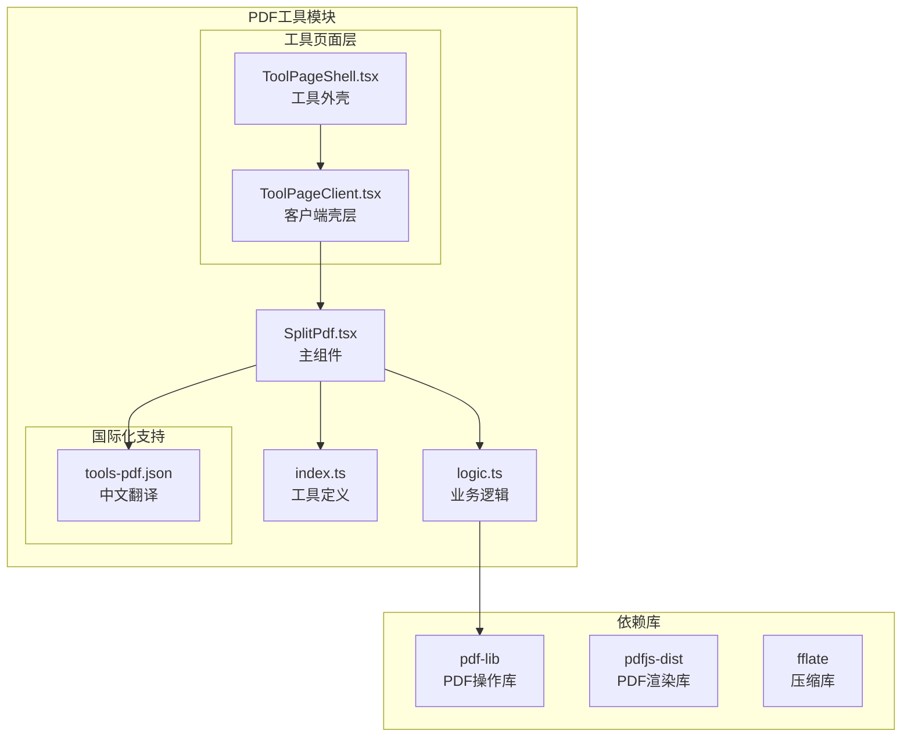
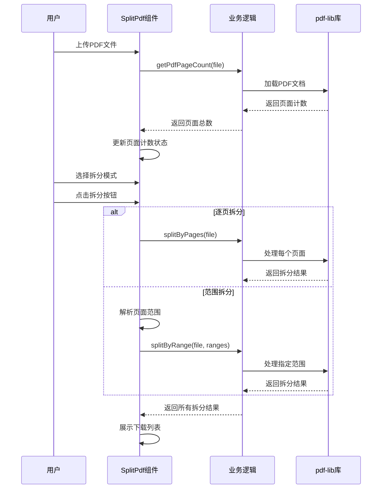
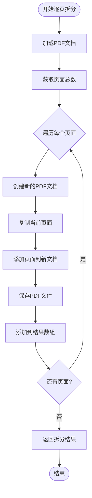
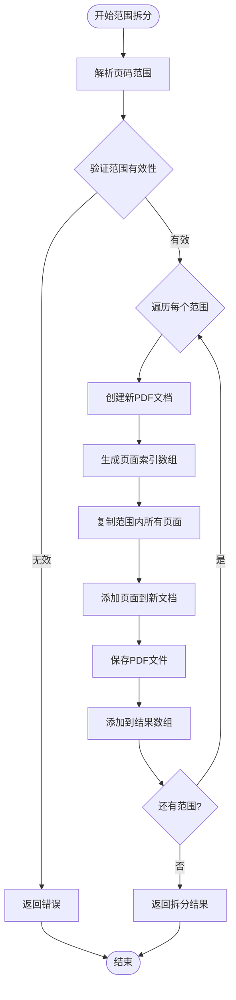
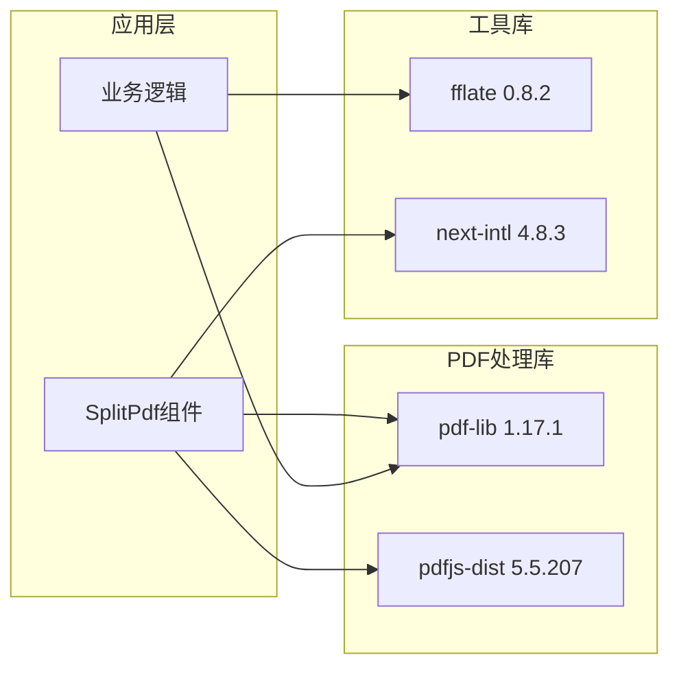

# PDF拆分工具

<cite>
**本文档引用的文件**
- [SplitPdf.tsx](file://src/tools/pdf/split/SplitPdf.tsx)
- [logic.ts](file://src/tools/pdf/split/logic.ts)
- [index.ts](file://src/tools/pdf/split/index.ts)
- [tools-pdf.json](file://messages/zh-Hans/tools-pdf.json)
- [pdfjs.ts](file://src/lib/pdfjs.ts)
- [package.json](file://package.json)
- [ToolPageClient.tsx](file://src/app/[locale]/tools/[category]/[slug]/ToolPageClient.tsx)
- [ToolPageShell.tsx](file://src/components/tool/ToolPageShell.tsx)
- [MergePdf.tsx](file://src/tools/pdf/merge/MergePdf.tsx)
- [DeletePages.tsx](file://src/tools/pdf/delete-pages/DeletePages.tsx)
</cite>

## 目录
1. [简介](#简介)
2. [项目结构](#项目结构)
3. [核心组件](#核心组件)
4. [架构概览](#架构概览)
5. [详细组件分析](#详细组件分析)
6. [依赖分析](#依赖分析)
7. [性能考虑](#性能考虑)
8. [故障排除指南](#故障排除指南)
9. [结论](#结论)
10. [附录](#附录)

## 简介

PDF拆分工具是一个基于浏览器的PDF处理工具，允许用户将PDF文档拆分为单个页面或自定义页面范围。该工具完全在浏览器中运行，无需上传文件到服务器，确保用户隐私和数据安全。

该工具提供了两种主要的拆分策略：
- **逐页拆分**：将PDF的每个页面拆分为独立的PDF文件
- **范围拆分**：允许用户指定自定义的页面范围进行拆分

工具集成了pdf-lib库进行PDF操作，支持完整的页面提取、内容重排和格式保持，同时提供直观的用户界面和实时反馈。

## 项目结构

PDF拆分工具位于媒体工具箱项目的PDF工具模块中，采用模块化架构设计：



**图表来源**
- [SplitPdf.tsx:1-158](file://src/tools/pdf/split/SplitPdf.tsx#L1-L158)
- [logic.ts:1-73](file://src/tools/pdf/split/logic.ts#L1-L73)
- [index.ts:1-37](file://src/tools/pdf/split/index.ts#L1-L37)

**章节来源**
- [SplitPdf.tsx:1-158](file://src/tools/pdf/split/SplitPdf.tsx#L1-L158)
- [logic.ts:1-73](file://src/tools/pdf/split/logic.ts#L1-L73)
- [index.ts:1-37](file://src/tools/pdf/split/index.ts#L1-L37)

## 核心组件

### SplitPdf 主组件

SplitPdf是PDF拆分工具的核心UI组件，负责处理用户交互和展示拆分结果。该组件实现了以下关键功能：

- **文件上传处理**：通过FileDropzone组件接收PDF文件输入
- **页面计数显示**：动态显示PDF的总页数
- **拆分模式切换**：支持逐页拆分和范围拆分两种模式
- **结果展示**：以卡片形式展示拆分后的文件列表
- **下载功能**：为每个拆分结果提供独立的下载按钮

### 业务逻辑模块

logic.ts模块封装了PDF拆分的核心算法，提供了两个主要的拆分函数：

- **splitByPages**：实现逐页拆分功能
- **splitByRange**：实现范围拆分功能
- **辅助函数**：页面计数、文件大小格式化等

### 工具定义模块

index.ts文件定义了工具的基本信息，包括：
- 工具标识符和分类
- 图标设置和SEO配置
- 相关工具链接
- FAQ内容

**章节来源**
- [SplitPdf.tsx:18-158](file://src/tools/pdf/split/SplitPdf.tsx#L18-L158)
- [logic.ts:3-73](file://src/tools/pdf/split/logic.ts#L3-L73)
- [index.ts:3-37](file://src/tools/pdf/split/index.ts#L3-L37)

## 架构概览

PDF拆分工具采用分层架构设计，确保代码的可维护性和扩展性：

```mermaid
graph TD
subgraph "表现层"
UI[SplitPdf.tsx<br/>用户界面]
Preview[PdfPagePreview<br/>页面预览]
Dropzone[FileDropzone<br/>文件拖拽]
end
subgraph "业务逻辑层"
Logic[logic.ts<br/>拆分算法]
Utils[工具函数<br/>格式化/验证]
end
subgraph "数据持久层"
Results[SplitResult[]<br/>拆分结果]
State[React状态<br/>组件状态]
end
subgraph "外部依赖"
PdfLib[pdf-lib<br/>PDF操作]
PdfJs[pdfjs-dist<br/>PDF渲染]
Intl[next-intl<br/>国际化]
end
UI --> Logic
UI --> Utils
Logic --> PdfLib
UI --> PdfJs
UI --> Intl
UI --> State
Logic --> Results
```

**图表来源**
- [SplitPdf.tsx:3-14](file://src/tools/pdf/split/SplitPdf.tsx#L3-L14)
- [logic.ts:1](file://src/tools/pdf/split/logic.ts#L1)
- [pdfjs.ts:3-13](file://src/lib/pdfjs.ts#L3-L13)

该架构实现了以下设计原则：
- **关注点分离**：UI逻辑与业务逻辑完全分离
- **依赖注入**：通过导入语句明确依赖关系
- **状态管理**：使用React Hooks管理组件状态
- **异步处理**：所有PDF操作都是异步执行

## 详细组件分析

### SplitPdf 组件详细分析

SplitPdf组件是整个工具的核心，实现了完整的用户交互流程：



**图表来源**
- [SplitPdf.tsx:28-73](file://src/tools/pdf/split/SplitPdf.tsx#L28-L73)
- [logic.ts:9-60](file://src/tools/pdf/split/logic.ts#L9-L60)

#### 页面选择界面设计

组件提供了直观的页面选择界面：

- **文件上传区**：支持拖拽和点击上传PDF文件
- **页面计数显示**：实时显示PDF的总页数
- **拆分模式选择**：单选按钮切换不同拆分策略
- **范围输入框**：当选择范围拆分时显示，支持逗号分隔的页码范围
- **结果展示区**：以卡片形式展示所有拆分结果

#### 拆分参数配置

组件支持灵活的拆分参数配置：

- **逐页拆分模式**：将每个页面拆分为独立文件
- **范围拆分模式**：允许用户自定义页面范围
- **范围格式**：支持"起始-结束"格式，如"1-3, 4-6, 7-10"
- **输入验证**：自动验证页码范围的有效性

**章节来源**
- [SplitPdf.tsx:18-158](file://src/tools/pdf/split/SplitPdf.tsx#L18-L158)

### 拆分算法实现

#### 逐页拆分算法

逐页拆分算法是最基础的拆分策略，实现简单且高效：



**图表来源**
- [logic.ts:9-29](file://src/tools/pdf/split/logic.ts#L9-L29)

#### 范围拆分算法

范围拆分算法支持更复杂的拆分需求：



**图表来源**
- [logic.ts:31-60](file://src/tools/pdf/split/logic.ts#L31-L60)

#### 输出文件命名规则

拆分工具遵循统一的文件命名规则：

- **逐页拆分**：`原文件名_page_X.pdf`（X为页面序号）
- **范围拆分**：`原文件名_起始-结束.pdf`（如"document_1-3.pdf"）

这种命名规则确保了文件的有序性和可识别性。

**章节来源**
- [logic.ts:3-73](file://src/tools/pdf/split/logic.ts#L3-L73)

### 错误处理机制

组件实现了完善的错误处理机制：

- **输入验证**：检查文件类型和页码范围的有效性
- **异常捕获**：使用try-catch处理PDF操作异常
- **用户反馈**：通过错误消息向用户显示问题详情
- **状态管理**：在错误发生时正确更新组件状态

**章节来源**
- [SplitPdf.tsx:50-73](file://src/tools/pdf/split/SplitPdf.tsx#L50-L73)

## 依赖分析

### 核心依赖关系

PDF拆分工具的依赖关系相对简洁，主要依赖于几个关键库：



**图表来源**
- [package.json:25-26](file://package.json#L25-L26)
- [pdfjs.ts:3-13](file://src/lib/pdfjs.ts#L3-L13)

### 依赖特性分析

#### pdf-lib库集成

pdf-lib是PDF操作的核心库，提供了以下关键功能：
- PDF文档加载和保存
- 页面复制和添加
- 内容重排和格式保持
- 高效的内存管理

#### pdfjs-dist库支持

pdfjs-dist主要用于PDF渲染和预览功能：
- PDF文档解析
- 页面渲染
- 文本提取
- 图片处理

#### 性能优化策略

工具采用了多种性能优化策略：
- **异步处理**：所有PDF操作都是异步执行
- **内存管理**：及时释放不再使用的PDF对象
- **增量处理**：避免一次性处理大量数据
- **缓存机制**：复用已加载的PDF文档

**章节来源**
- [package.json:11-32](file://package.json#L11-L32)
- [pdfjs.ts:1-16](file://src/lib/pdfjs.ts#L1-L16)

## 性能考虑

### 浏览器环境限制

由于工具完全在浏览器中运行，需要考虑以下性能限制：

- **内存限制**：浏览器对单个标签页的内存使用有限制
- **CPU限制**：PDF处理是计算密集型操作
- **网络限制**：大文件处理可能影响用户体验

### 优化策略

针对这些限制，工具采用了以下优化策略：

1. **渐进式处理**：逐页处理PDF，避免一次性加载所有页面
2. **智能缓存**：复用已加载的PDF文档，避免重复解析
3. **异步操作**：使用Promise和async/await避免阻塞UI线程
4. **内存清理**：及时释放不再使用的PDF对象和Blob引用

### 批量操作优化

虽然当前版本主要支持单文件处理，但架构设计支持未来的批量操作扩展：

- **队列管理**：可以实现任务队列管理多个拆分任务
- **并发控制**：限制同时进行的PDF处理任务数量
- **进度跟踪**：为批量操作提供进度监控功能

## 故障排除指南

### 常见问题及解决方案

#### 文件格式问题

**问题**：上传的文件不是PDF格式
**解决方案**：确保上传的是标准PDF文件，检查文件扩展名和文件头

#### 内存不足问题

**问题**：处理大文件时出现内存不足错误
**解决方案**：
- 关闭其他占用内存的标签页
- 尝试处理较小的PDF文件
- 分批处理大型文档

#### 页面范围无效

**问题**：输入的页面范围超出文档页数
**解决方案**：检查页码范围是否在有效范围内，确保起始页不大于结束页

#### 浏览器兼容性

**问题**：在某些浏览器中无法正常工作
**解决方案**：使用最新版本的主流浏览器，如Chrome、Firefox、Safari或Edge

### 调试技巧

1. **开发者工具**：使用浏览器开发者工具查看JavaScript错误
2. **控制台日志**：利用console.log输出调试信息
3. **网络监控**：检查文件上传和下载的状态
4. **内存监控**：观察内存使用情况，避免内存泄漏

**章节来源**
- [SplitPdf.tsx:67-73](file://src/tools/pdf/split/SplitPdf.tsx#L67-L73)

## 结论

PDF拆分工具是一个设计精良的浏览器端PDF处理工具，具有以下突出特点：

### 技术优势

- **完全本地化**：所有处理都在浏览器中完成，确保用户隐私
- **算法简洁**：拆分算法实现简单，易于理解和维护
- **用户友好**：提供直观的界面和清晰的反馈
- **性能优化**：采用异步处理和内存管理策略

### 功能完整性

- 支持两种主要拆分策略：逐页拆分和范围拆分
- 提供完整的错误处理和用户反馈机制
- 实现了合理的文件命名规则
- 集成了国际化支持

### 扩展潜力

该工具为未来的功能扩展奠定了良好的基础：
- 支持批量处理的架构设计
- 可扩展的拆分策略
- 模块化的代码结构
- 清晰的依赖关系

## 附录

### 实际使用场景示例

#### 批量处理长文档

对于超过100页的长文档，推荐使用范围拆分功能：
- 将文档拆分为章节：`1-10, 11-30, 31-60, 61-100`
- 按主题或内容组织拆分结果
- 便于后续的编辑和分享

#### 按章节拆分

学术论文或技术文档的章节拆分：
- 论文主体：`1-50`（正文）
- 参考文献：`51-60`（单独文件）
- 附录：`61-80`（附加材料）

#### 生成练习册

教育场景下的练习册生成：
- 将题目按难度分组：`1-10, 11-20, 21-30`
- 每组生成独立的练习文件
- 方便学生按难度逐步练习

### 最佳实践建议

1. **文件大小控制**：单次处理建议不超过200MB，避免浏览器内存压力
2. **页面范围规划**：合理规划拆分范围，避免产生过多小文件
3. **命名规范**：使用有意义的文件名，便于后续管理和查找
4. **备份重要文件**：处理前先备份原始PDF文件
5. **定期更新浏览器**：使用最新版本的浏览器以获得最佳性能

### 未来发展方向

基于当前的架构设计，该工具可以在以下方面进行扩展：
- 支持批量文件处理
- 添加更多拆分策略（按文件大小、按固定页数等）
- 实现进度监控和取消功能
- 提供拆分预览和确认功能
- 增加拆分结果的合并功能