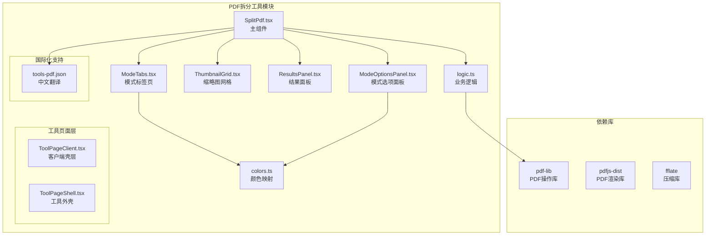
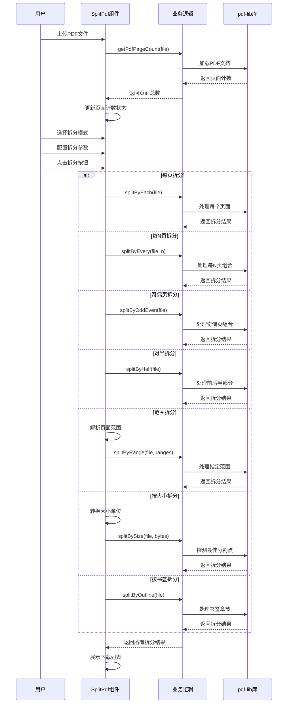
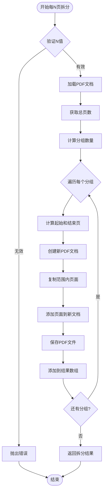
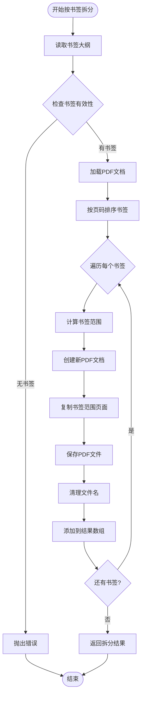
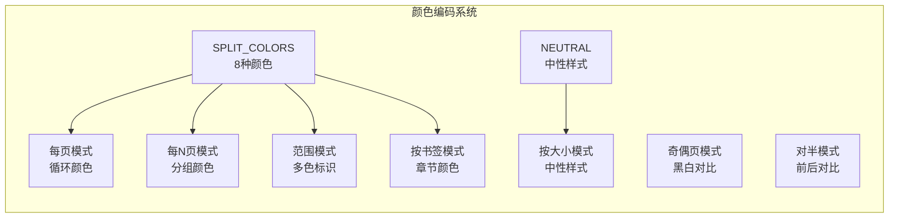

# PDF拆分工具

<cite>
**本文档引用的文件**
- [SplitPdf.tsx](file://src/tools/pdf/split/SplitPdf.tsx)
- [logic.ts](file://src/tools/pdf/split/logic.ts)
- [ModeTabs.tsx](file://src/tools/pdf/split/components/ModeTabs.tsx)
- [ModeOptionsPanel.tsx](file://src/tools/pdf/split/components/ModeOptionsPanel.tsx)
- [ThumbnailGrid.tsx](file://src/tools/pdf/split/components/ThumbnailGrid.tsx)
- [ResultsPanel.tsx](file://src/tools/pdf/split/components/ResultsPanel.tsx)
- [colors.ts](file://src/tools/pdf/split/colors.ts)
- [index.ts](file://src/tools/pdf/split/index.ts)
- [pdfjs.ts](file://src/lib/pdfjs.ts)
- [package.json](file://package.json)
- [ToolPageClient.tsx](file://src/app/[locale]/tools/[category]/[slug]/ToolPageClient.tsx)
- [ToolPageShell.tsx](file://src/components/tool/ToolPageShell.tsx)
</cite>

## 更新摘要
**所做更改**
- 更新了七种拆分模式的完整架构描述
- 新增了ModeTabs、ModeOptionsPanel、ThumbnailGrid、ResultsPanel等专门UI组件的详细分析
- 引入了颜色编码系统的完整说明
- 更新了拆分算法的技术实现细节
- 增强了用户界面组件的架构分析
- 完善了错误处理和进度监控机制的说明

## 目录
1. [简介](#简介)
2. [项目结构](#项目结构)
3. [核心组件](#核心组件)
4. [架构概览](#架构概览)
5. [详细组件分析](#详细组件分析)
6. [拆分模式详解](#拆分模式详解)
7. [颜色编码系统](#颜色编码系统)
8. [依赖分析](#依赖分析)
9. [性能考虑](#性能考虑)
10. [故障排除指南](#故障排除指南)
11. [结论](#结论)
12. [附录](#附录)

## 简介

PDF拆分工具是一个基于浏览器的PDF处理工具，现已升级为支持七种拆分模式的复杂系统。该工具允许用户将PDF文档拆分为单个页面或自定义页面范围，完全在浏览器中运行，无需上传文件到服务器，确保用户隐私和数据安全。

**更新** 从简单的两模式拆分升级为七种模式的复杂拆分系统，包括每页拆分、每N页拆分、奇偶页拆分、对半拆分、范围拆分、按大小拆分和按书签拆分模式。

该工具提供了七种主要的拆分策略：
- **每页拆分**：将PDF的每个页面拆分为独立的PDF文件
- **每N页拆分**：将连续的N个页面合为一份PDF文件
- **奇偶页拆分**：拆分为奇数页和偶数页两份文件
- **对半拆分**：将PDF平均分为前后两部分
- **范围拆分**：允许用户指定自定义的页面范围进行拆分
- **按大小拆分**：根据文件大小限制自动拆分
- **按书签拆分**：使用PDF大纲目录自动拆分

工具集成了pdf-lib库进行PDF操作，支持完整的页面提取、内容重排和格式保持，同时提供直观的用户界面和实时反馈。

## 项目结构

PDF拆分工具位于媒体工具箱项目的PDF工具模块中，采用模块化架构设计，现已升级为支持七种拆分模式的完整系统：



**图表来源**
- [SplitPdf.tsx:1-368](file://src/tools/pdf/split/SplitPdf.tsx#L1-L368)
- [logic.ts:1-462](file://src/tools/pdf/split/logic.ts#L1-L462)
- [ModeTabs.tsx:1-66](file://src/tools/pdf/split/components/ModeTabs.tsx#L1-L66)
- [ModeOptionsPanel.tsx:1-177](file://src/tools/pdf/split/components/ModeOptionsPanel.tsx#L1-L177)
- [ThumbnailGrid.tsx:1-57](file://src/tools/pdf/split/components/ThumbnailGrid.tsx#L1-L57)
- [ResultsPanel.tsx:1-78](file://src/tools/pdf/split/components/ResultsPanel.tsx#L1-L78)
- [colors.ts:1-79](file://src/tools/pdf/split/colors.ts#L1-L79)

**章节来源**
- [SplitPdf.tsx:1-368](file://src/tools/pdf/split/SplitPdf.tsx#L1-L368)
- [logic.ts:1-462](file://src/tools/pdf/split/logic.ts#L1-L462)
- [index.ts:1-49](file://src/tools/pdf/split/index.ts#L1-L49)

## 核心组件

### SplitPdf 主组件

SplitPdf是PDF拆分工具的核心UI组件，负责处理用户交互和展示拆分结果。该组件实现了以下关键功能：

- **文件上传处理**：通过FileDropzone组件接收PDF文件输入
- **页面计数显示**：动态显示PDF的总页数
- **七种拆分模式**：支持每页拆分、每N页拆分、奇偶页拆分、对半拆分、范围拆分、按大小拆分和按书签拆分
- **模式切换界面**：通过ModeTabs组件提供直观的模式选择
- **参数配置面板**：通过ModeOptionsPanel组件提供详细的参数配置
- **结果展示**：通过ResultsPanel组件以卡片形式展示拆分后的文件列表
- **下载功能**：为每个拆分结果提供独立的下载按钮和ZIP打包下载

### 业务逻辑模块

logic.ts模块封装了PDF拆分的核心算法，提供了七个主要的拆分函数：

- **splitByEach**：实现每页拆分功能
- **splitByEvery**：实现每N页拆分功能
- **splitByOddEven**：实现奇偶页拆分功能
- **splitByHalf**：实现对半拆分功能
- **splitByRange**：实现范围拆分功能
- **splitBySize**：实现按大小拆分功能
- **splitByOutline**：实现按书签拆分功能

### 模式管理组件

#### ModeTabs 组件
提供七种拆分模式的标签页界面，支持图标和禁用状态管理。

#### ModeOptionsPanel 组件
提供每种拆分模式的专用参数配置界面，包括：
- 每N页拆分的N值设置
- 范围拆分的页码范围输入
- 按大小拆分的文件大小限制
- 按书签拆分的书签预览

### 视觉反馈组件

#### ThumbnailGrid 组件
提供PDF页面缩略图网格，实时显示每页所属的拆分结果，支持彩色预览。

#### ResultsPanel 组件
展示拆分结果，支持单个下载和ZIP打包下载功能。

**章节来源**
- [SplitPdf.tsx:36-368](file://src/tools/pdf/split/SplitPdf.tsx#L36-L368)
- [logic.ts:79-462](file://src/tools/pdf/split/logic.ts#L79-L462)
- [ModeTabs.tsx:22-66](file://src/tools/pdf/split/components/ModeTabs.tsx#L22-L66)
- [ModeOptionsPanel.tsx:23-177](file://src/tools/pdf/split/components/ModeOptionsPanel.tsx#L23-L177)
- [ThumbnailGrid.tsx:18-57](file://src/tools/pdf/split/components/ThumbnailGrid.tsx#L18-L57)
- [ResultsPanel.tsx:15-78](file://src/tools/pdf/split/components/ResultsPanel.tsx#L15-L78)

## 架构概览

PDF拆分工具采用分层架构设计，现已升级为支持七种拆分模式的完整系统：

```mermaid
graph TD
subgraph "表现层"
UI[SplitPdf.tsx<br/>主界面]
ModeTabs[ModeTabs.tsx<br/>模式选择]
ModeOptions[ModeOptionsPanel.tsx<br/>参数配置]
Thumbnail[ThumbnailGrid.tsx<br/>缩略图预览]
Results[ResultsPanel.tsx<br/>结果展示]
end
subgraph "业务逻辑层"
Logic[logic.ts<br/>拆分算法]
Utils[工具函数<br/>格式化/验证]
Colors[colors.ts<br/>颜色映射]
end
subgraph "数据持久层"
ResultsState[SplitResult[]<br/>拆分结果]
ModeContext[ModeContext<br/>模式上下文]
Progress[SplitProgress<br/>进度状态]
end
subgraph "外部依赖"
PdfLib[pdf-lib<br/>PDF操作]
PdfJs[pdfjs-dist<br/>PDF渲染]
Intl[next-intl<br/>国际化]
Fflate[fflate<br/>ZIP压缩]
end
UI --> Logic
UI --> Utils
UI --> Colors
Logic --> PdfLib
Logic --> PdfJs
Logic --> Fflate
UI --> ModeTabs
UI --> ModeOptions
UI --> Thumbnail
UI --> Results
Logic --> ResultsState
Logic --> ModeContext
Logic --> Progress
```

**图表来源**
- [SplitPdf.tsx:16-30](file://src/tools/pdf/split/SplitPdf.tsx#L16-L30)
- [logic.ts:14-29](file://src/tools/pdf/split/logic.ts#L14-L29)
- [colors.ts:14-21](file://src/tools/pdf/split/colors.ts#L14-L21)

该架构实现了以下设计原则：
- **关注点分离**：UI逻辑与业务逻辑完全分离
- **模式抽象**：通过ModeContext统一管理七种拆分模式
- **依赖注入**：通过导入语句明确依赖关系
- **状态管理**：使用React Hooks管理组件状态
- **异步处理**：所有PDF操作都是异步执行
- **进度监控**：支持拆分进度和探测进度的双重状态

## 详细组件分析

### SplitPdf 组件详细分析

SplitPdf组件是整个工具的核心，实现了完整的用户交互流程和七种拆分模式的支持：



**图表来源**
- [SplitPdf.tsx:154-248](file://src/tools/pdf/split/SplitPdf.tsx#L154-L248)
- [logic.ts:79-418](file://src/tools/pdf/split/logic.ts#L79-L418)

#### 模式上下文管理

组件通过ModeContext接口统一管理七种拆分模式的上下文信息：

- **每页模式**：包含总页数信息
- **每N页模式**：包含总页数和N值
- **奇偶页模式**：无额外参数
- **对半模式**：包含总页数信息
- **范围模式**：包含页码范围数组
- **按大小模式**：包含总页数信息
- **按书签模式**：包含书签起始页数组

#### 错误处理和用户反馈

组件实现了完善的错误处理机制：
- **输入验证**：检查文件类型、页码范围和参数有效性
- **异常捕获**：使用try-catch处理PDF操作异常
- **用户反馈**：通过错误消息向用户显示问题详情
- **状态管理**：在错误发生时正确更新组件状态
- **进度监控**：实时显示拆分进度和探测进度

**章节来源**
- [SplitPdf.tsx:119-248](file://src/tools/pdf/split/SplitPdf.tsx#L119-L248)

### 拆分算法实现

#### 每页拆分算法

每页拆分算法是最基础的拆分策略，实现简单且高效：


**图表来源**
- [logic.ts:79-105](file://src/tools/pdf/split/logic.ts#L79-L105)

#### 每N页拆分算法

每N页拆分算法支持连续页面的批量处理：



**图表来源**
- [logic.ts:107-138](file://src/tools/pdf/split/logic.ts#L107-L138)

#### 按大小拆分算法

按大小拆分算法是最复杂的拆分策略，使用二分搜索优化：

```mermaid
flowchart TD
Start([开始按大小拆分]) --> ValidateSize{验证大小限制}
ValidateSize --> |无效| Error[抛出错误]
ValidateSize --> |有效| LoadPdf[加载PDF文档]
LoadPdf --> GetAvg[计算平均页大小]
GetAvg --> WhileLoop{i < 总页数}
WhileLoop --> ProbeSingle[探测单页大小]
ProbeSingle --> CheckOversized{单页超限?}
CheckOversized --> |是| HandleOversized[处理超大单页]
HandleOversized --> AddResult[添加到结果数组]
AddResult --> IncI[i += 1]
IncI --> WhileLoop
CheckOversized --> |否| BinarySearch[二分搜索最佳K值]
BinarySearch --> LowHighInit[初始化low=2, high=剩余页数]
LowHighInit --> WhileCond{low ≤ high}
WhileCond --> |否| Finalize[确定最佳分组]
Finalize --> AddResult2[添加到结果数组]
AddResult2 --> IncI2[i += best]
IncI2 --> WhileLoop
WhileCond --> |是| MidCalc[计算mid=(low+high)/2]
MidCalc --> ProbeRange[探测mid页大小]
ProbeRange --> CheckRange{大小合适?}
CheckRange --> |合适| UpdateBest[更新最佳值]
UpdateBest --> SetLow[low = mid + 1]
SetLow --> WhileCond
CheckRange --> |不合适| SetHigh[high = mid - 1]
SetHigh --> WhileCond
Error --> End([结束])
WhileLoop --> End
```

**图表来源**
- [logic.ts:262-340](file://src/tools/pdf/split/logic.ts#L262-L340)

#### 按书签拆分算法

按书签拆分算法利用PDF大纲信息进行智能拆分：



**图表来源**
- [logic.ts:381-418](file://src/tools/pdf/split/logic.ts#L381-L418)

#### 输出文件命名规则

拆分工具遵循统一的文件命名规则：

- **每页拆分**：`原文件名_page_X.pdf`（X为页面序号）
- **每N页拆分**：`原文件名_起始-结束.pdf`（如"document_1-3.pdf"）
- **奇偶页拆分**：`原文件名_odd.pdf`和`原文件名_even.pdf`
- **对半拆分**：`原文件名_part1.pdf`和`原文件名_part2.pdf`
- **范围拆分**：`原文件名_起始-结束.pdf`
- **按大小拆分**：`原文件名_起始-结束.pdf`
- **按书签拆分**：使用书签标题作为文件名，如"第一章.pdf"

**章节来源**
- [logic.ts:79-462](file://src/tools/pdf/split/logic.ts#L79-L462)

### 错误处理机制

组件实现了完善的错误处理机制：

- **输入验证**：检查文件类型、页码范围和参数有效性
- **异常捕获**：使用try-catch处理PDF操作异常
- **用户反馈**：通过错误消息向用户显示问题详情
- **状态管理**：在错误发生时正确更新组件状态
- **进度监控**：实时显示拆分进度和探测进度

**章节来源**
- [SplitPdf.tsx:223-247](file://src/tools/pdf/split/SplitPdf.tsx#L223-L247)

## 拆分模式详解

### 每页拆分模式 (each)

每页拆分模式将PDF的每个页面拆分为独立的PDF文件，适用于需要单独处理每页的场景。

**特点**：
- 生成文件数量等于总页数
- 每个文件仅包含一页
- 文件名格式：`原文件名_page_X.pdf`

**适用场景**：
- 单独编辑或分享特定页面
- 页面提取和重组
- 批量页面处理

### 每N页拆分模式 (every)

每N页拆分模式将连续的N个页面合为一份PDF文件，适用于批量处理场景。

**特点**：
- 参数N控制每份文件的页数
- 自动计算分组数量
- 文件名格式：`原文件名_起始-结束.pdf`

**适用场景**：
- 批量处理长文档
- 按章节或主题分组
- 控制文件数量

### 奇偶页拆分模式 (oddEven)

奇偶页拆分模式将PDF拆分为奇数页和偶数页两份文件，适用于双面打印修复。

**特点**：
- 生成两份文件
- 自动区分奇偶页
- 文件名格式：`原文件名_odd.pdf`和`原文件名_even.pdf`

**适用场景**：
- 双面扫描修复
- 打印前页面重组
- 特殊格式需求

### 对半拆分模式 (half)

对半拆分模式将PDF平均分为前后两部分，适用于文档分割。

**特点**：
- 自动计算分割点
- 生成两份文件
- 文件名格式：`原文件名_part1.pdf`和`原文件名_part2.pdf`

**适用场景**：
- 文档对半分割
- 双人协作处理
- 学习资料分配

### 范围拆分模式 (range)

范围拆分模式允许用户指定自定义的页面范围进行拆分，提供最大的灵活性。

**特点**：
- 支持逗号分隔的多个范围
- 实时页面预览和选择
- 可选合并所有范围为单个文件
- 输入格式：`起始-结束`或单个页码

**适用场景**：
- 页面提取和重组
- 章节分离
- 特定内容筛选

### 按大小拆分模式 (size)

按大小拆分模式根据文件大小限制自动拆分，适用于邮件附件或存储限制。

**特点**：
- 支持MB和KB单位
- 使用二分搜索优化分割点
- 处理超大单页情况
- 实时进度显示

**适用场景**：
- 邮件附件限制
- 存储空间管理
- 网络传输优化

### 按书签拆分模式 (outline)

按书签拆分模式使用PDF的大纲信息自动拆分，适用于结构化文档。

**特点**：
- 自动检测PDF书签
- 使用书签标题作为文件名
- 支持嵌套书签结构
- 文件名自动去重

**适用场景**：
- 书籍和手册拆分
- 学术论文章节分离
- 报告和文档结构化

**章节来源**
- [SplitPdf.tsx:119-139](file://src/tools/pdf/split/SplitPdf.tsx#L119-L139)
- [ModeOptionsPanel.tsx:43-177](file://src/tools/pdf/split/components/ModeOptionsPanel.tsx#L43-L177)

## 颜色编码系统

### 颜色映射设计

PDF拆分工具引入了完整的颜色编码系统，用于直观地显示不同拆分模式的结果：



**图表来源**
- [colors.ts:1-10](file://src/tools/pdf/split/colors.ts#L1-L10)

### 颜色应用策略

#### 每页拆分模式
- 使用8种颜色循环应用
- 每个页面对应一个独特的颜色
- 便于快速识别页面归属

#### 每N页拆分模式
- 按N值计算分组索引
- 每个分组使用相同颜色
- 颜色在组内保持一致

#### 奇偶页拆分模式
- 奇数页使用第一种颜色
- 偶数页使用第二种颜色
- 简单直观的颜色对比

#### 对半拆分模式
- 前半部分使用第一种颜色
- 后半部分使用第二种颜色
- 明确的前后区分

#### 范围拆分模式
- 每个范围使用不同颜色
- 超出范围的页面使用中性样式
- 多色标识便于范围识别

#### 按大小拆分模式
- 使用中性样式
- 不进行颜色编码
- 专注于文件大小控制

#### 按书签拆分模式
- 按书签顺序使用不同颜色
- 章节间颜色自然过渡
- 保持书签结构的完整性

**章节来源**
- [colors.ts:23-57](file://src/tools/pdf/split/colors.ts#L23-L57)

## 依赖分析

### 核心依赖关系

PDF拆分工具的依赖关系相对简洁，主要依赖于几个关键库：

```mermaid
graph LR
subgraph "应用层"
SplitPdf[SplitPdf组件]
Logic[业务逻辑]
ModeTabs[模式标签]
ModeOptions[选项面板]
Thumbnail[缩略图]
Results[结果面板]
Colors[颜色映射]
end
subgraph "PDF处理库"
PdfLib[pdf-lib 1.17.1]
PdfJs[pdfjs-dist 5.5.207]
end
subgraph "工具库"
Fflate[fflate 0.8.2]
Intl[next-intl 4.8.3]
```

**图表来源**
- [package.json:25-26](file://package.json#L25-L26)
- [pdfjs.ts:3-13](file://src/lib/pdfjs.ts#L3-L13)

### 依赖特性分析

#### pdf-lib库集成

pdf-lib是PDF操作的核心库，提供了以下关键功能：
- PDF文档加载和保存
- 页面复制和添加
- 内容重排和格式保持
- 高效的内存管理

#### pdfjs-dist库支持

pdfjs-dist主要用于PDF渲染和预览功能：
- PDF文档解析
- 页面渲染
- 文本提取
- 图片处理

#### 性能优化策略

工具采用了多种性能优化策略：
- **异步处理**：所有PDF操作都是异步执行
- **内存管理**：及时释放不再使用的PDF对象
- **增量处理**：避免一次性处理大量数据
- **缓存机制**：复用已加载的PDF文档
- **二分搜索**：优化按大小拆分的分割点探测

**章节来源**
- [package.json:11-32](file://package.json#L11-L32)
- [pdfjs.ts:1-16](file://src/lib/pdfjs.ts#L1-L16)

## 性能考虑

### 浏览器环境限制

由于工具完全在浏览器中运行，需要考虑以下性能限制：

- **内存限制**：浏览器对单个标签页的内存使用有限制
- **CPU限制**：PDF处理是计算密集型操作
- **网络限制**：大文件处理可能影响用户体验

### 优化策略

针对这些限制，工具采用了以下优化策略：

1. **渐进式处理**：逐页处理PDF，避免一次性加载所有页面
2. **智能缓存**：复用已加载的PDF文档，避免重复解析
3. **异步操作**：使用Promise和async/await避免阻塞UI线程
4. **内存清理**：及时释放不再使用的PDF对象和Blob引用
5. **二分搜索优化**：按大小拆分时使用高效的二分搜索算法
6. **进度监控**：提供实时进度反馈，改善用户体验

### 批量操作优化

工具支持多种拆分模式的批量处理：
- **队列管理**：可以实现任务队列管理多个拆分任务
- **并发控制**：限制同时进行的PDF处理任务数量
- **进度跟踪**：为批量操作提供进度监控功能
- **错误恢复**：支持任务中断和恢复机制

## 故障排除指南

### 常见问题及解决方案

#### 文件格式问题

**问题**：上传的文件不是PDF格式
**解决方案**：确保上传的是标准PDF文件，检查文件扩展名和文件头

#### 内存不足问题

**问题**：处理大文件时出现内存不足错误
**解决方案**：
- 关闭其他占用内存的标签页
- 尝试使用每N页拆分而非每页拆分
- 分批处理大型文档

#### 页面范围无效

**问题**：输入的页面范围超出文档页数
**解决方案**：检查页码范围是否在有效范围内，确保起始页不大于结束页

#### 浏览器兼容性

**问题**：在某些浏览器中无法正常工作
**解决方案**：使用最新版本的主流浏览器，如Chrome、Firefox、Safari或Edge

#### 加密PDF处理

**问题**：PDF文件受密码保护
**解决方案**：当前版本不支持加密PDF文件，需要先解除密码保护

### 调试技巧

1. **开发者工具**：使用浏览器开发者工具查看JavaScript错误
2. **控制台日志**：利用console.log输出调试信息
3. **网络监控**：检查文件上传和下载的状态
4. **内存监控**：观察内存使用情况，避免内存泄漏
5. **进度跟踪**：利用进度监控功能了解处理状态

**章节来源**
- [SplitPdf.tsx:223-247](file://src/tools/pdf/split/SplitPdf.tsx#L223-L247)

## 结论

PDF拆分工具是一个设计精良的浏览器端PDF处理工具，现已升级为支持七种拆分模式的完整系统，具有以下突出特点：

### 技术优势

- **完全本地化**：所有处理都在浏览器中完成，确保用户隐私
- **七种拆分模式**：提供从基础到高级的完整拆分策略
- **智能算法**：采用二分搜索等优化算法提升性能
- **用户友好**：提供直观的界面和清晰的反馈
- **性能优化**：采用异步处理和内存管理策略
- **颜色编码**：通过视觉化颜色系统增强用户体验

### 功能完整性

- 支持七种主要拆分策略：每页拆分、每N页拆分、奇偶页拆分、对半拆分、范围拆分、按大小拆分和按书签拆分
- 提供完整的错误处理和用户反馈机制
- 实现了合理的文件命名规则
- 集成了国际化支持
- 支持ZIP打包下载功能
- 引入了专业的UI组件架构

### 扩展潜力

该工具为未来的功能扩展奠定了良好的基础：
- 支持批量处理的架构设计
- 可扩展的拆分策略
- 模块化的代码结构
- 清晰的依赖关系
- 完善的进度监控系统
- 专业的颜色编码系统

## 附录

### 实际使用场景示例

#### 批量处理长文档

对于超过100页的长文档，推荐使用每N页拆分功能：
- 将文档拆分为章节：`每N页拆分，N=20`
- 按主题或内容组织拆分结果
- 便于后续的编辑和分享

#### 学术论文处理

学术论文的章节拆分：
- 使用按书签拆分模式自动按章节拆分
- 每个章节生成独立的PDF文件
- 方便导师审阅和学生学习

#### 邮件附件优化

邮件发送前的文件优化：
- 使用按大小拆分模式，设置5MB上限
- 自动将大文件分割为符合邮件限制的小文件
- 保持内容完整性

#### 双面扫描修复

双面扫描文档的页面重组：
- 使用奇偶页拆分模式
- 分别处理奇数页和偶数页
- 重新排列页面顺序

#### 页面提取和重组

从大型文档中提取特定内容：
- 使用范围拆分模式
- 指定需要的页面范围
- 生成包含所需内容的PDF文件

### 最佳实践建议

1. **文件大小控制**：单次处理建议不超过200MB，避免浏览器内存压力
2. **拆分策略选择**：根据使用场景选择合适的拆分模式
3. **页面范围规划**：合理规划拆分范围，避免产生过多小文件
4. **命名规范**：使用有意义的文件名，便于后续管理和查找
5. **备份重要文件**：处理前先备份原始PDF文件
6. **定期更新浏览器**：使用最新版本的浏览器以获得最佳性能
7. **利用进度监控**：关注处理进度，及时发现和解决问题
8. **颜色编码理解**：利用颜色系统快速识别拆分结果
9. **批量操作管理**：合理安排拆分任务，避免资源竞争
10. **错误处理准备**：熟悉常见错误及其解决方案

### 未来发展方向

基于当前的架构设计，该工具可以在以下方面进行扩展：
- 支持更多拆分模式的自定义
- 增强批量处理和队列管理功能
- 提供拆分预览和确认功能
- 增加拆分结果的合并功能
- 优化大文件处理性能
- 支持更多PDF格式和特性
- 扩展颜色编码系统
- 增强用户界面的可访问性