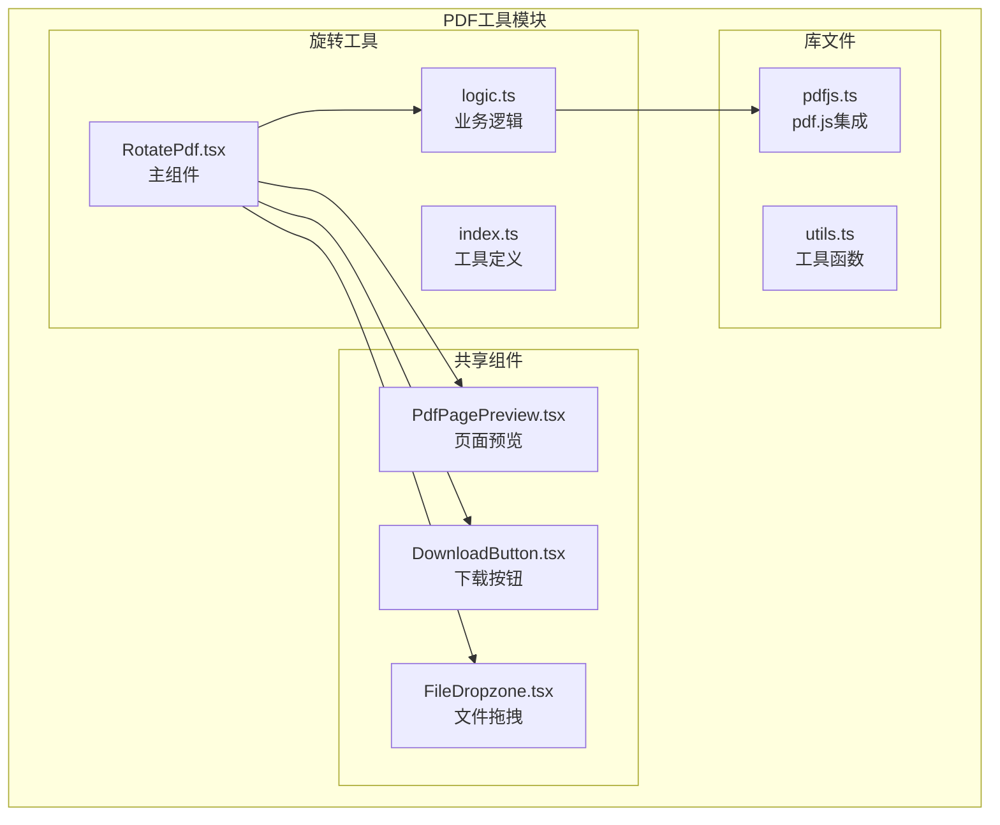
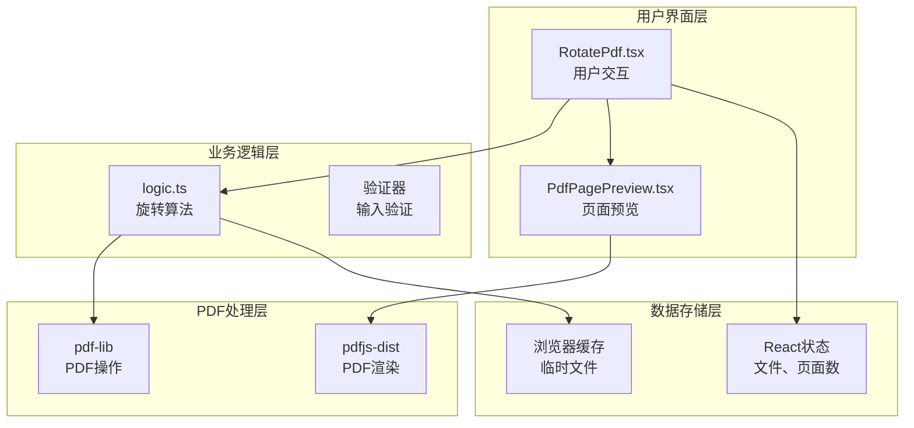
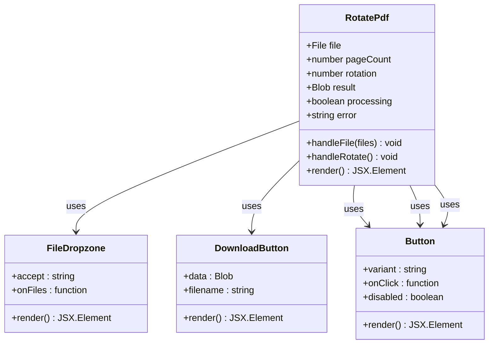
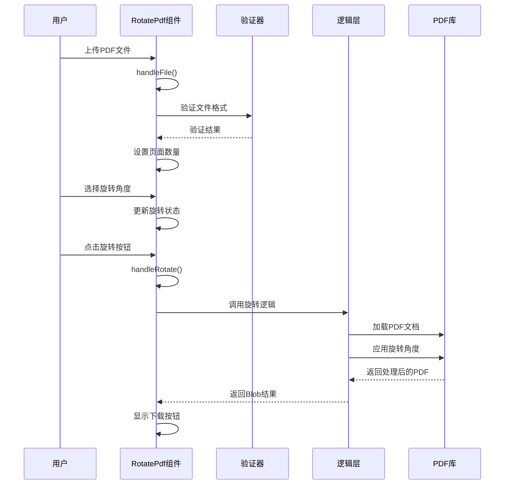
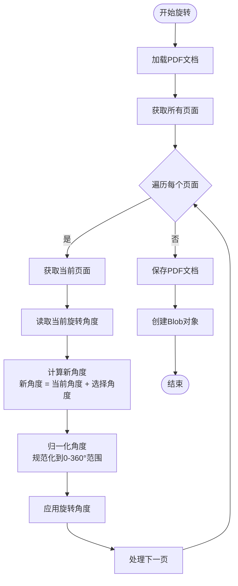
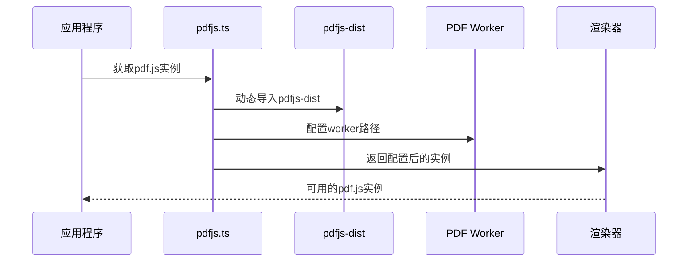
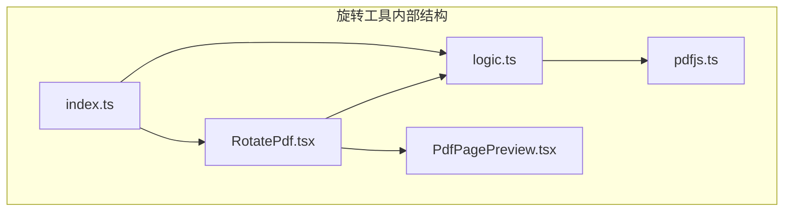

# PDF旋转工具

<cite>
**本文档引用的文件**
- [RotatePdf.tsx](file://src/tools/pdf/rotate/RotatePdf.tsx)
- [logic.ts](file://src/tools/pdf/rotate/logic.ts)
- [index.ts](file://src/tools/pdf/rotate/index.ts)
- [pdfjs.ts](file://src/lib/pdfjs.ts)
- [tools-pdf.json](file://messages/en/tools-pdf.json)
- [package.json](file://package.json)
- [PdfPagePreview.tsx](file://src/components/shared/PdfPagePreview.tsx)
- [PdfToImage.tsx](file://src/tools/pdf/to-image/PdfToImage.tsx)
- [add-page-numbers logic.ts](file://src/tools/pdf/add-page-numbers/logic.ts)
- [crop logic.ts](file://src/tools/pdf/crop/logic.ts)
</cite>

## 目录
1. [简介](#简介)
2. [项目结构](#项目结构)
3. [核心组件](#核心组件)
4. [架构概览](#架构概览)
5. [详细组件分析](#详细组件分析)
6. [依赖关系分析](#依赖关系分析)
7. [性能考虑](#性能考虑)
8. [故障排除指南](#故障排除指南)
9. [结论](#结论)

## 简介

PDF旋转工具是一个基于浏览器的PDF页面旋转解决方案，允许用户将PDF文档中的所有页面按90°、180°、270°顺时针方向进行批量旋转。该工具采用纯前端技术实现，确保用户隐私安全，所有处理都在本地浏览器中完成。

本工具支持以下核心功能：
- 批量页面旋转（所有页面应用相同角度）
- 支持90°、180°、270°顺时针旋转
- 实时错误处理和用户反馈
- 文件大小格式化显示
- 与pdf.js渲染引擎的集成

## 项目结构

PDF旋转工具位于媒体工具箱项目的PDF工具模块中，采用模块化架构设计：



**图表来源**
- [RotatePdf.tsx:1-123](file://src/tools/pdf/rotate/RotatePdf.tsx#L1-L123)
- [logic.ts:1-30](file://src/tools/pdf/rotate/logic.ts#L1-L30)
- [index.ts:1-37](file://src/tools/pdf/rotate/index.ts#L1-L37)

**章节来源**
- [RotatePdf.tsx:1-123](file://src/tools/pdf/rotate/RotatePdf.tsx#L1-L123)
- [index.ts:1-37](file://src/tools/pdf/rotate/index.ts#L1-L37)

## 核心组件

### 主要组件架构

PDF旋转工具由三个核心组件构成：

1. **RotatePdf.tsx** - 用户界面组件，负责用户交互和状态管理
2. **logic.ts** - 业务逻辑组件，处理PDF旋转的核心算法
3. **index.ts** - 工具配置组件，定义工具元数据和SEO信息

### 技术栈

项目使用以下关键技术：
- **React 19** - 用户界面框架
- **pdf-lib** - PDF文档操作库
- **pdfjs-dist** - PDF渲染引擎
- **Next.js** - Web应用框架
- **TypeScript** - 类型安全编程

**章节来源**
- [package.json:11-32](file://package.json#L11-L32)
- [RotatePdf.tsx:1-123](file://src/tools/pdf/rotate/RotatePdf.tsx#L1-L123)

## 架构概览

PDF旋转工具采用分层架构设计，确保代码的可维护性和扩展性：



**图表来源**
- [RotatePdf.tsx:36-122](file://src/tools/pdf/rotate/RotatePdf.tsx#L36-L122)
- [logic.ts:3-23](file://src/tools/pdf/rotate/logic.ts#L3-L23)
- [pdfjs.ts:1-16](file://src/lib/pdfjs.ts#L1-L16)

## 详细组件分析

### RotatePdf.tsx 组件分析

#### 组件架构设计



**图表来源**
- [RotatePdf.tsx:11-122](file://src/tools/pdf/rotate/RotatePdf.tsx#L11-L122)

#### 用户交互流程



**图表来源**
- [RotatePdf.tsx:20-55](file://src/tools/pdf/rotate/RotatePdf.tsx#L20-L55)
- [logic.ts:3-23](file://src/tools/pdf/rotate/logic.ts#L3-L23)

#### 支持的旋转角度

组件支持三种标准旋转角度：
- **90°顺时针** (Clockwise)
- **180°** (Upside Down)
- **270°顺时针** (Counter-Clockwise)

每种角度都有对应的视觉反馈和用户界面元素。

**章节来源**
- [RotatePdf.tsx:74-98](file://src/tools/pdf/rotate/RotatePdf.tsx#L74-L98)
- [tools-pdf.json:235-282](file://messages/en/tools-pdf.json#L235-L282)

### 旋转算法实现

#### 核心旋转逻辑



**图表来源**
- [logic.ts:11-19](file://src/tools/pdf/rotate/logic.ts#L11-L19)

#### 角度计算算法

旋转算法采用数学角度归一化处理：

1. **角度累加**：新角度 = 当前角度 + 选择角度
2. **模运算**：规范化到0-360°范围
3. **标准化**：确保角度值在有效范围内

这个算法确保了多次旋转操作的正确性。

**章节来源**
- [logic.ts:14-17](file://src/tools/pdf/rotate/logic.ts#L14-L17)

### PDF.js渲染引擎集成

#### 渲染引擎配置



**图表来源**
- [pdfjs.ts:3-13](file://src/lib/pdfjs.ts#L3-L13)

#### 页面预览功能

工具集成了PDF页面预览功能，使用pdf.js的渲染能力：

- **Canvas渲染**：使用HTML5 Canvas进行高效渲染
- **缩放控制**：支持自定义缩放比例
- **异步加载**：避免阻塞用户界面
- **内存管理**：及时释放渲染资源

**章节来源**
- [pdfjs.ts:1-16](file://src/lib/pdfjs.ts#L1-L16)
- [PdfPagePreview.tsx:27-52](file://src/components/shared/PdfPagePreview.tsx#L27-L52)

## 依赖关系分析

### 外部依赖

PDF旋转工具依赖以下关键库：

```mermaid
graph LR
subgraph "核心依赖"
REACT[react@19.2.3]
NEXT[next@16.2.1]
TYPESCRIPT[typescript^5]
end
subgraph "PDF处理"
PDF_LIB[pdf-lib@1.17.1]
PDF_JS[pdfjs-dist@5.5.207]
end
subgraph "UI组件"
LUCIDE[lucide-react^0.577.0]
TAILWIND[tailwind-merge^3.5.0]
end
subgraph "国际化"
NEXT_INTL[next-intl@4.8.3]
end
RotatePdf --> REACT
RotatePdf --> NEXT
RotatePdf --> PDF_LIB
RotatePdf --> PDF_JS
RotatePdf --> LUCIDE
RotatePdf --> NEXT_INTL
```

**图表来源**
- [package.json:11-32](file://package.json#L11-L32)

### 内部依赖关系



**图表来源**
- [RotatePdf.tsx:8-9](file://src/tools/pdf/rotate/RotatePdf.tsx#L8-L9)
- [index.ts:8](file://src/tools/pdf/rotate/index.ts#L8)

**章节来源**
- [package.json:11-32](file://package.json#L11-L32)

## 性能考虑

### 浏览器性能优化

1. **异步处理**：所有PDF操作都是异步执行，避免阻塞主线程
2. **内存管理**：及时释放不再使用的PDF对象和Canvas资源
3. **增量更新**：只在状态变化时重新渲染相关组件
4. **文件大小限制**：根据设备内存动态调整处理策略

### 处理速度优化

- **并行处理**：多个页面的旋转操作可以并行执行
- **缓存机制**：已处理的页面结果可以缓存以提高重复访问速度
- **进度反馈**：对于大文件提供处理进度指示

## 故障排除指南

### 常见问题及解决方案

#### 文件加载失败

**症状**：上传PDF文件后无法获取页面数量
**原因**：文件损坏或格式不支持
**解决方案**：
1. 检查PDF文件完整性
2. 确认文件不是加密保护的PDF
3. 尝试使用其他PDF查看器打开文件

#### 旋转操作异常

**症状**：旋转后页面显示异常
**原因**：PDF文档结构复杂或包含特殊内容
**解决方案**：
1. 尝试在其他PDF编辑软件中打开确认
2. 检查是否有注释或表单字段影响旋转
3. 联系技术支持获取进一步帮助

#### 内存不足错误

**症状**：处理大型PDF文件时出现内存错误
**原因**：文件过大超出浏览器内存限制
**解决方案**：
1. 分批处理大文件
2. 关闭其他占用内存的标签页
3. 使用更高性能的设备

**章节来源**
- [RotatePdf.tsx:31-33](file://src/tools/pdf/rotate/RotatePdf.tsx#L31-L33)
- [logic.ts:24-29](file://src/tools/pdf/rotate/logic.ts#L24-L29)

## 结论

PDF旋转工具是一个功能完善、用户友好的PDF处理解决方案。通过采用现代前端技术和最佳实践，该工具实现了：

### 技术优势
- **纯前端实现**：确保用户隐私和数据安全
- **响应式设计**：适应不同设备和屏幕尺寸
- **实时反馈**：提供清晰的处理状态和结果展示
- **国际化支持**：多语言界面适应全球用户

### 功能特性
- **简单易用**：直观的用户界面和操作流程
- **批量处理**：支持一次性旋转所有页面
- **多种角度**：提供常用的旋转角度选项
- **质量保证**：保持原始PDF内容和格式不变

### 扩展潜力
该工具架构设计良好，易于扩展和维护。未来可以考虑添加的功能包括：
- 逐页独立旋转支持
- 自定义角度旋转
- 批量处理多个PDF文件
- 更丰富的PDF编辑功能集成

通过持续的优化和改进，PDF旋转工具将继续为用户提供优质的PDF处理体验。