# PDF裁剪工具

<cite>
**本文档引用的文件**
- [CropPdf.tsx](file://src/tools/pdf/crop/CropPdf.tsx)
- [logic.ts](file://src/tools/pdf/crop/logic.ts)
- [pdfjs.ts](file://src/lib/pdfjs.ts)
- [PdfPagePreview.tsx](file://src/components/shared/PdfPagePreview.tsx)
- [index.ts](file://src/tools/pdf/crop/index.ts)
- [ToolPageClient.tsx](file://src/app/[locale]/tools/[category]/[slug]/ToolPageClient.tsx)
- [ToolPageShell.tsx](file://src/components/tool/ToolPageShell.tsx)
- [tools-pdf.json](file://messages/zh-Hans/tools-pdf.json)
- [types.ts](file://src/lib/registry/types.ts)
- [package.json](file://package.json)
</cite>

## 目录
1. [简介](#简介)
2. [项目结构](#项目结构)
3. [核心组件](#核心组件)
4. [架构概览](#架构概览)
5. [详细组件分析](#详细组件分析)
6. [依赖分析](#依赖分析)
7. [性能考虑](#性能考虑)
8. [故障排除指南](#故障排除指南)
9. [结论](#结论)

## 简介

PDF裁剪工具是一个基于浏览器的PDF页面裁剪解决方案，允许用户通过设置每侧的边距来精确控制PDF页面的裁剪区域。该工具采用纯前端技术实现，所有处理过程都在用户的浏览器中完成，确保了数据隐私和安全性。

该工具的核心功能包括：
- 四侧独立的裁剪边距控制（上、下、左、右）
- 实时预览功能
- 支持多种PDF页面尺寸
- 无损裁剪操作
- 批量处理能力

## 项目结构

PDF裁剪工具位于媒体工具箱项目的PDF工具模块中，采用模块化的架构设计：

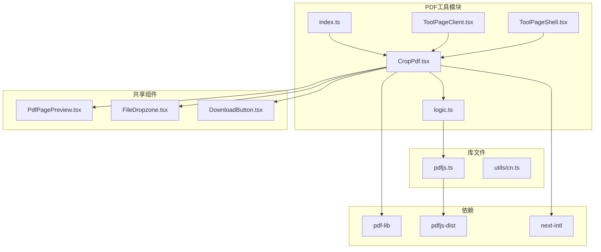

**图表来源**
- [CropPdf.tsx:1-130](file://src/tools/pdf/crop/CropPdf.tsx#L1-L130)
- [logic.ts:1-49](file://src/tools/pdf/crop/logic.ts#L1-L49)
- [index.ts:1-37](file://src/tools/pdf/crop/index.ts#L1-L37)

**章节来源**
- [CropPdf.tsx:1-130](file://src/tools/pdf/crop/CropPdf.tsx#L1-L130)
- [index.ts:1-37](file://src/tools/pdf/crop/index.ts#L1-L37)

## 核心组件

### CropPdf组件架构

CropPdf组件是PDF裁剪工具的主界面组件，采用了React Hooks的状态管理模式：

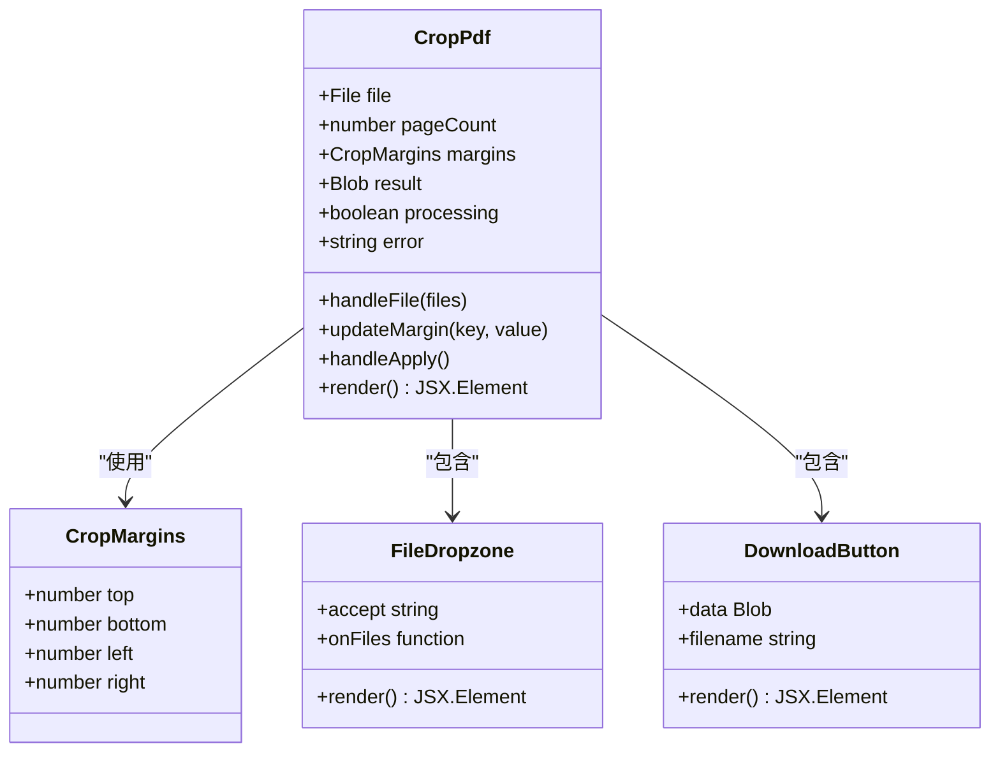

**图表来源**
- [CropPdf.tsx:10-130](file://src/tools/pdf/crop/CropPdf.tsx#L10-L130)
- [logic.ts:4-9](file://src/tools/pdf/crop/logic.ts#L4-L9)

### 裁剪逻辑实现

裁剪功能的核心逻辑集中在logic.ts文件中，使用pdf-lib库进行PDF文档操作：

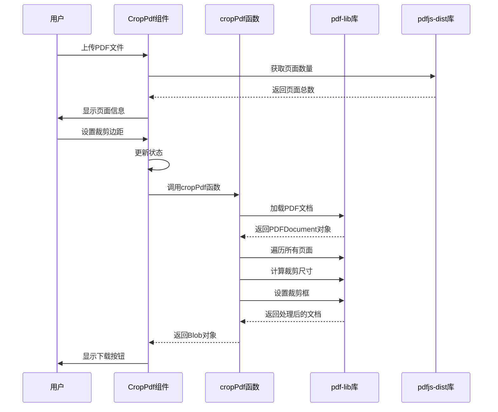

**图表来源**
- [CropPdf.tsx:24-59](file://src/tools/pdf/crop/CropPdf.tsx#L24-L59)
- [logic.ts:11-33](file://src/tools/pdf/crop/logic.ts#L11-L33)

**章节来源**
- [CropPdf.tsx:10-130](file://src/tools/pdf/crop/CropPdf.tsx#L10-L130)
- [logic.ts:1-49](file://src/tools/pdf/crop/logic.ts#L1-L49)

## 架构概览

PDF裁剪工具采用了分层架构设计，确保了良好的可维护性和扩展性：

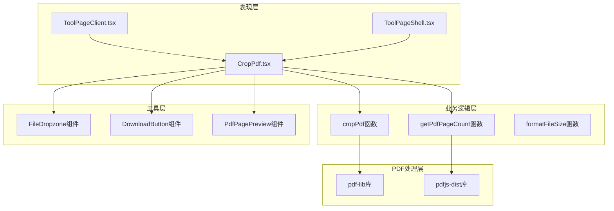

**图表来源**
- [CropPdf.tsx:1-130](file://src/tools/pdf/crop/CropPdf.tsx#L1-L130)
- [logic.ts:1-49](file://src/tools/pdf/crop/logic.ts#L1-L49)
- [ToolPageShell.tsx:1-54](file://src/components/tool/ToolPageShell.tsx#L1-L54)
- [ToolPageClient.tsx:29-58](file://src/app/[locale]/tools/[category]/[slug]/ToolPageClient.tsx#L29-L58)

### 技术栈分析

该工具使用了现代化的前端技术栈：

| 层级 | 技术 | 版本 | 用途 |
|------|------|------|------|
| 前端框架 | Next.js | 16.2.1 | 应用框架 |
| UI库 | lucide-react | ^0.577.0 | 图标组件 |
| PDF处理 | pdf-lib | ^1.17.1 | PDF文档操作 |
| PDF渲染 | pdfjs-dist | ^5.5.207 | PDF页面渲染 |
| 国际化 | next-intl | ^4.8.3 | 多语言支持 |
| 类型系统 | TypeScript | ^5 | 类型安全 |

**章节来源**
- [package.json:11-32](file://package.json#L11-L32)

## 详细组件分析

### CropPdf组件详细分析

CropPdf组件是整个裁剪工具的核心界面组件，实现了完整的用户交互流程：

#### 状态管理

组件使用React Hooks管理状态，包括文件状态、页面计数、裁剪参数、处理状态等：

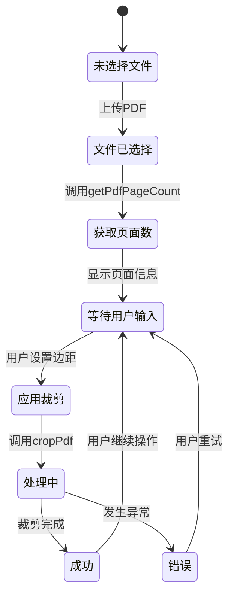

**图表来源**
- [CropPdf.tsx:10-130](file://src/tools/pdf/crop/CropPdf.tsx#L10-L130)

#### 边距控制系统

组件提供了四个独立的边距输入框，支持实时验证和更新：

| 方向 | 输入属性 | 验证规则 | 默认值 |
|------|----------|----------|--------|
| 上边距 | top | 数字 >= 0 | 0 |
| 下边距 | bottom | 数字 >= 0 | 0 |
| 左边距 | left | 数字 >= 0 | 0 |
| 右边距 | right | 数字 >= 0 | 0 |

#### 错误处理机制

组件实现了多层次的错误处理：

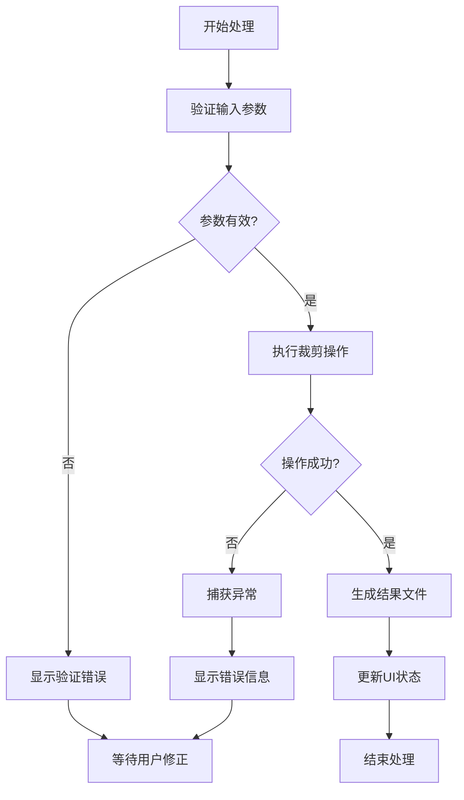

**图表来源**
- [CropPdf.tsx:38-59](file://src/tools/pdf/crop/CropPdf.tsx#L38-L59)

**章节来源**
- [CropPdf.tsx:10-130](file://src/tools/pdf/crop/CropPdf.tsx#L10-L130)

### 裁剪算法实现

裁剪算法的核心逻辑在cropPdf函数中实现，采用了pdf-lib库的标准裁剪方法：

#### 裁剪矩阵计算

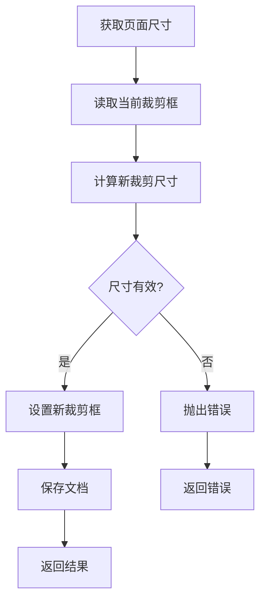

**图表来源**
- [logic.ts:11-33](file://src/tools/pdf/crop/logic.ts#L11-L33)

#### 页面遍历策略

算法采用顺序遍历的方式处理PDF文档中的所有页面，确保每个页面都应用相同的裁剪参数。

**章节来源**
- [logic.ts:11-33](file://src/tools/pdf/crop/logic.ts#L11-L33)

### PDF页面预览组件

PdfPagePreview组件提供了PDF页面的缩略图预览功能：

#### 渲染流程

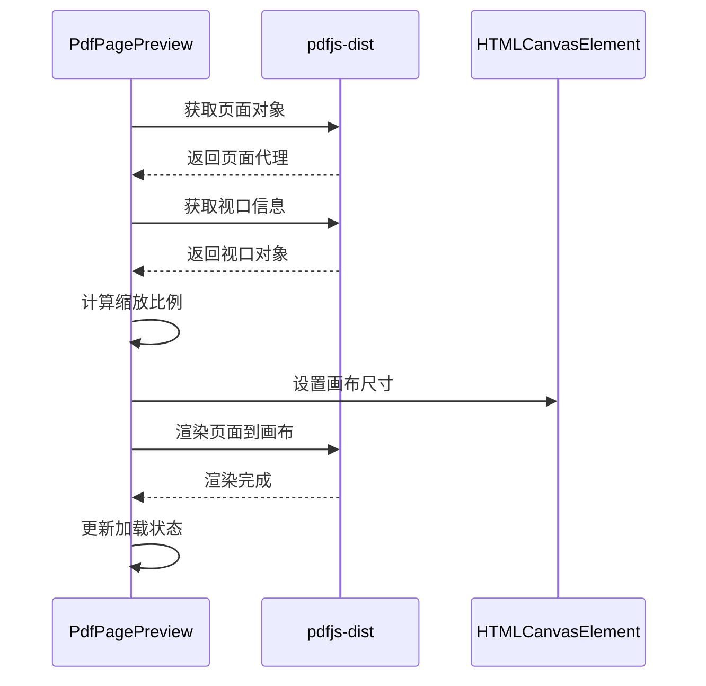

**图表来源**
- [PdfPagePreview.tsx:27-52](file://src/components/shared/PdfPagePreview.tsx#L27-L52)

**章节来源**
- [PdfPagePreview.tsx:16-80](file://src/components/shared/PdfPagePreview.tsx#L16-L80)

## 依赖分析

### 外部依赖关系

PDF裁剪工具依赖于多个关键库来实现其功能：

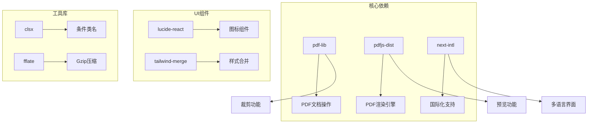

**图表来源**
- [package.json:11-32](file://package.json#L11-L32)

### 内部模块依赖

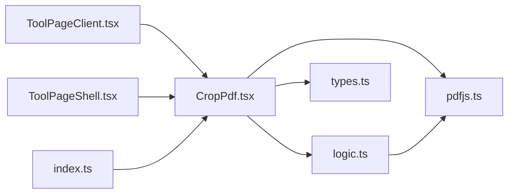

**图表来源**
- [CropPdf.tsx:8](file://src/tools/pdf/crop/CropPdf.tsx#L8)
- [logic.ts:2](file://src/tools/pdf/crop/logic.ts#L2)
- [index.ts:8](file://src/tools/pdf/crop/index.ts#L8)

**章节来源**
- [package.json:11-32](file://package.json#L11-L32)
- [types.ts:5-16](file://src/lib/registry/types.ts#L5-L16)

## 性能考虑

### 大文档处理策略

对于大型PDF文档，系统采用了以下优化策略：

1. **渐进式处理**：使用异步处理避免阻塞UI线程
2. **内存管理**：及时释放PDF对象和Canvas资源
3. **批量操作**：一次性处理所有页面而非逐页处理
4. **缓存机制**：复用已配置的pdfjs实例

### 内存优化

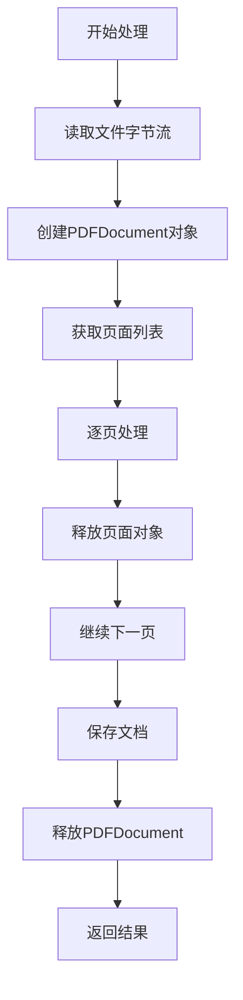

**图表来源**
- [logic.ts:15-32](file://src/tools/pdf/crop/logic.ts#L15-L32)

### 并发处理

系统支持同时处理多个PDF文件，但每个文件的处理是串行的，避免了内存峰值。

## 故障排除指南

### 常见问题及解决方案

| 问题类型 | 症状 | 可能原因 | 解决方案 |
|----------|------|----------|----------|
| 文件上传失败 | 无法选择PDF文件 | 文件格式不支持 | 确认文件扩展名为.pdf |
| 裁剪失败 | 显示错误信息 | 边距设置过大 | 减少边距值或增加页面尺寸 |
| 页面预览空白 | 预览显示加载状态 | PDF渲染超时 | 检查网络连接或文件完整性 |
| 处理速度慢 | 裁剪过程耗时较长 | 文档过大或内存不足 | 关闭其他标签页释放内存 |

### 错误诊断流程

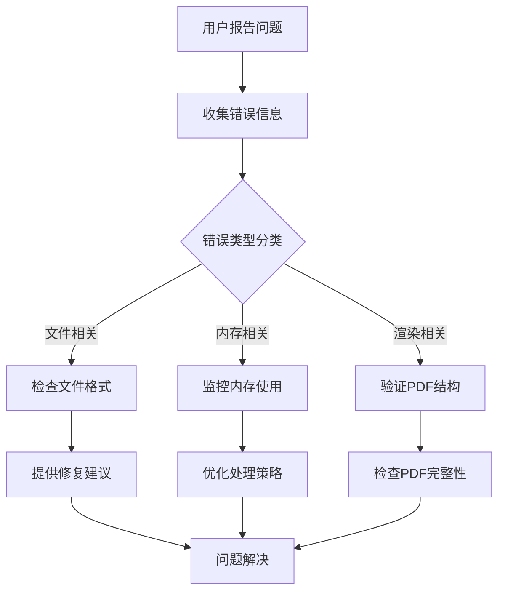

**章节来源**
- [CropPdf.tsx:71-75](file://src/tools/pdf/crop/CropPdf.tsx#L71-L75)
- [logic.ts:23-27](file://src/tools/pdf/crop/logic.ts#L23-L27)

## 结论

PDF裁剪工具是一个功能完善、架构清晰的浏览器端PDF处理解决方案。它通过以下特点实现了优秀的用户体验：

1. **隐私保护**：所有处理过程都在本地完成，确保用户数据安全
2. **精确控制**：支持四侧独立的边距控制，提供精确的裁剪精度
3. **用户友好**：直观的界面设计和实时预览功能
4. **性能优化**：针对大文档的处理策略和内存管理
5. **可扩展性**：模块化的架构设计便于功能扩展

该工具为PDF文档处理提供了可靠的技术基础，特别适用于需要精确页面裁剪和批量处理的场景。通过持续的优化和功能增强，该工具将继续为用户提供优质的PDF处理体验。