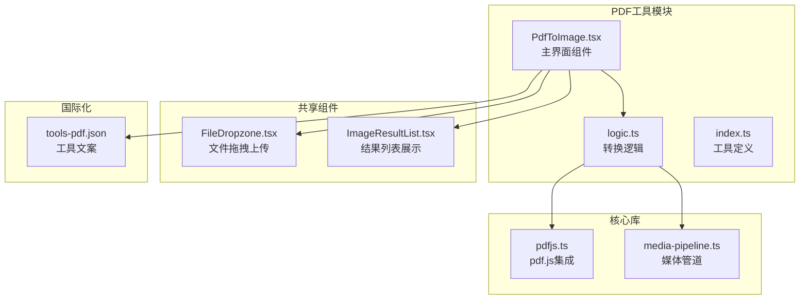
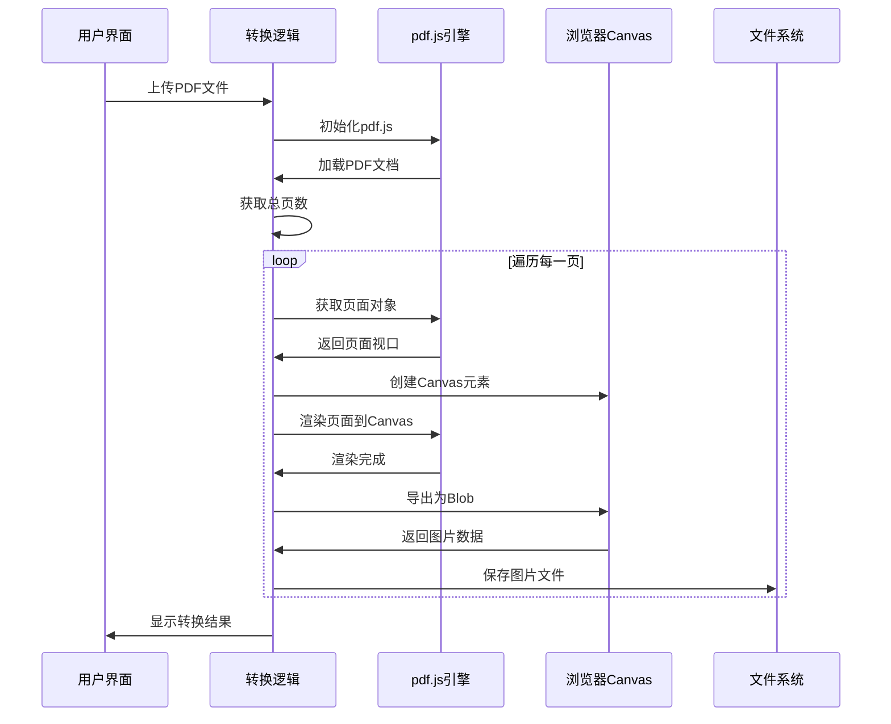
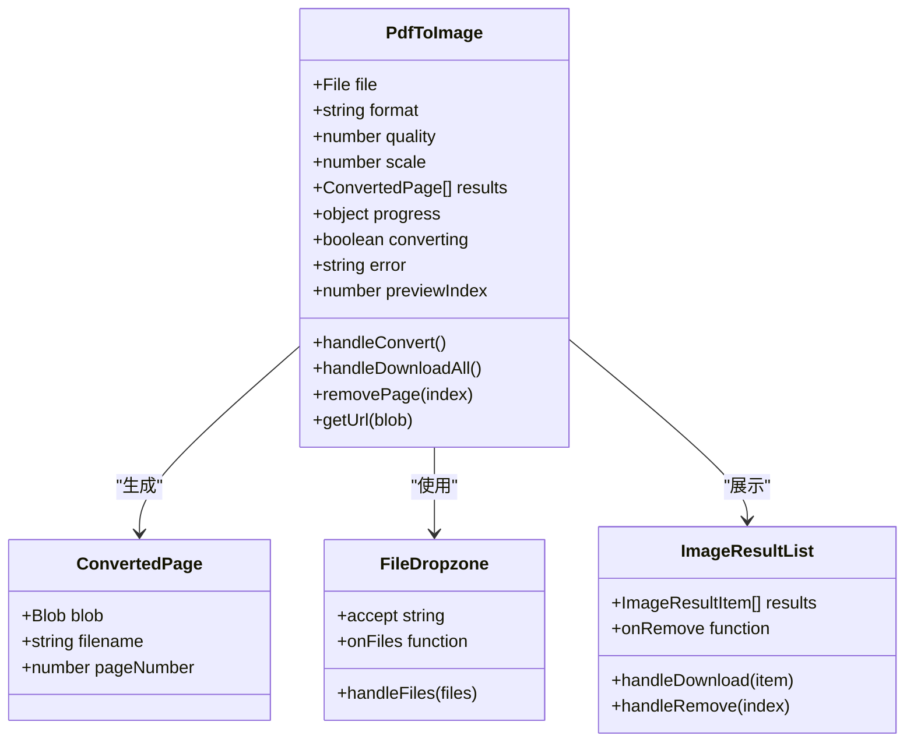
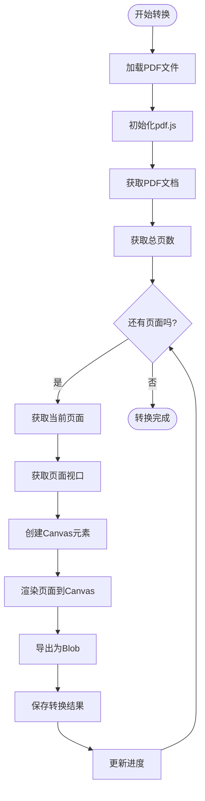
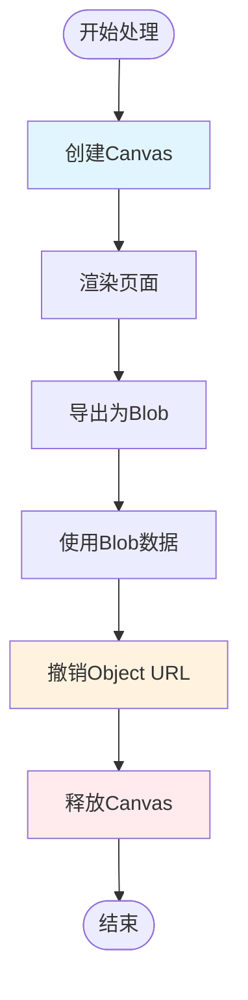
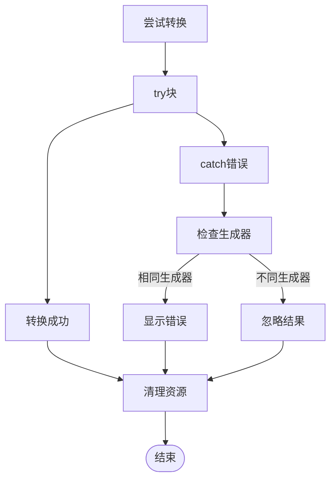

# PDF转图片工具

<cite>
**本文档引用的文件**
- [PdfToImage.tsx](file://src/tools/pdf/to-image/PdfToImage.tsx)
- [logic.ts](file://src/tools/pdf/to-image/logic.ts)
- [pdfjs.ts](file://src/lib/pdfjs.ts)
- [media-pipeline.ts](file://src/lib/media-pipeline.ts)
- [tools-pdf.json](file://messages/zh-Hans/tools-pdf.json)
- [index.ts](file://src/tools/pdf/to-image/index.ts)
- [FileDropzone.tsx](file://src/components/shared/FileDropzone.tsx)
- [ImageResultList.tsx](file://src/components/shared/ImageResultList.tsx)
- [package.json](file://package.json)
</cite>

## 目录
1. [简介](#简介)
2. [项目结构](#项目结构)
3. [核心组件](#核心组件)
4. [架构概览](#架构概览)
5. [详细组件分析](#详细组件分析)
6. [PDF渲染技术原理](#pdf渲染技术原理)
7. [输出格式与质量配置](#输出格式与质量配置)
8. [使用场景与最佳实践](#使用场景与最佳实践)
9. [性能优化与内存管理](#性能优化与内存管理)
10. [故障排除指南](#故障排除指南)
11. [结论](#结论)

## 简介

PDF转图片工具是一个基于浏览器的PDF页面转换解决方案，能够将PDF文档的每个页面转换为高质量的图片文件。该工具采用pdf.js渲染引擎，支持PNG和JPG格式输出，提供灵活的分辨率控制和质量参数配置，适用于缩略图生成、OCR预处理、网页展示等多种应用场景。

该工具的核心优势在于完全在浏览器本地运行，无需上传文件到服务器，确保用户隐私和数据安全。同时，工具提供了直观的用户界面，支持批量处理和实时预览功能。

## 项目结构

PDF转图片工具位于媒体工具箱项目中，采用模块化的架构设计：

**图表来源**
- [PdfToImage.tsx:1-229](file://src/tools/pdf/to-image/PdfToImage.tsx#L1-L229)
- [logic.ts:1-86](file://src/tools/pdf/to-image/logic.ts#L1-L86)
- [pdfjs.ts:1-16](file://src/lib/pdfjs.ts#L1-L16)

**章节来源**
- [PdfToImage.tsx:1-229](file://src/tools/pdf/to-image/PdfToImage.tsx#L1-L229)
- [index.ts:1-37](file://src/tools/pdf/to-image/index.ts#L1-L37)

## 核心组件

### 主界面组件 (PdfToImage)

PdfToImage组件是工具的用户界面入口，负责处理用户交互和状态管理。该组件实现了以下核心功能：

- **文件上传处理**：通过FileDropzone组件接收PDF文件
- **参数配置**：提供格式选择、质量控制和缩放比例设置
- **进度跟踪**：实时显示转换进度和页面状态
- **结果展示**：网格形式展示转换后的图片
- **批量操作**：支持单个下载和ZIP打包下载

### 转换逻辑 (logic.ts)

logic.ts模块封装了PDF到图片转换的核心算法，包括：

- **PDF文档解析**：使用pdf.js库读取PDF文件
- **页面遍历**：逐页处理PDF文档
- **渲染引擎**：调用pdf.js的渲染接口
- **图像生成**：将渲染结果转换为Blob对象
- **批量处理**：支持多页面并发转换

### pdf.js集成 (pdfjs.ts)

pdfjs.ts模块负责pdf.js库的初始化和配置：

- **Worker配置**：设置pdf.js Worker的路径
- **懒加载机制**：按需加载pdf.js库
- **全局配置**：确保Worker只初始化一次

**章节来源**
- [PdfToImage.tsx:17-229](file://src/tools/pdf/to-image/PdfToImage.tsx#L17-L229)
- [logic.ts:16-86](file://src/tools/pdf/to-image/logic.ts#L16-L86)
- [pdfjs.ts:1-16](file://src/lib/pdfjs.ts#L1-L16)

## 架构概览

PDF转图片工具采用分层架构设计，确保代码的可维护性和扩展性：

**图表来源**
- [logic.ts:16-65](file://src/tools/pdf/to-image/logic.ts#L16-L65)
- [pdfjs.ts:3-12](file://src/lib/pdfjs.ts#L3-L12)

该架构的主要特点：

1. **模块化设计**：每个组件职责明确，便于测试和维护
2. **异步处理**：采用Promise和async/await模式处理耗时操作
3. **内存管理**：及时释放Canvas和Blob对象，避免内存泄漏
4. **错误处理**：完善的异常捕获和用户反馈机制

## 详细组件分析

### PdfToImage组件架构

**图表来源**
- [PdfToImage.tsx:17-229](file://src/tools/pdf/to-image/PdfToImage.tsx#L17-L229)
- [logic.ts:10-14](file://src/tools/pdf/to-image/logic.ts#L10-L14)

### 转换流程详解

PDF转图片的核心转换流程如下：

**图表来源**
- [logic.ts:16-65](file://src/tools/pdf/to-image/logic.ts#L16-L65)

**章节来源**
- [PdfToImage.tsx:84-110](file://src/tools/pdf/to-image/PdfToImage.tsx#L84-L110)
- [logic.ts:16-65](file://src/tools/pdf/to-image/logic.ts#L16-L65)

## PDF渲染技术原理

### pdf.js渲染引擎

PDF转图片工具基于Mozilla开发的pdf.js库，这是一个强大的JavaScript PDF渲染引擎。pdf.js的核心特性包括：

- **矢量图形渲染**：精确渲染PDF中的矢量图形和路径
- **字体嵌入支持**：支持Type1、Type3、TrueType、OpenType等字体格式
- **透明度处理**：正确处理半透明、遮罩和混合模式
- **图像嵌入**：支持JPEG、FlateDecode等图像格式
- **硬件加速**：利用Canvas API进行GPU加速渲染

### 渲染参数配置

工具通过以下参数控制渲染质量：

- **scale参数**：控制输出分辨率，1.0为标准分辨率，2.0为双倍分辨率
- **quality参数**：JPG格式的质量控制，10-100范围
- **viewport设置**：根据目标分辨率计算Canvas尺寸

### 字体渲染机制

pdf.js采用以下策略处理字体：

1. **嵌入字体**：直接使用PDF中嵌入的字体文件
2. **系统字体回退**：当嵌入字体不可用时使用系统字体
3. **字体子集化**：只加载实际使用的字符子集
4. **字体缓存**：重复使用已加载的字体资源

**章节来源**
- [pdfjs.ts:3-12](file://src/lib/pdfjs.ts#L3-L12)
- [logic.ts:32-44](file://src/tools/pdf/to-image/logic.ts#L32-L44)

## 输出格式与质量配置

### 支持的输出格式

工具当前支持两种主要输出格式：

| 格式 | 扩展名 | 特点 | 适用场景 |
|------|--------|------|----------|
| PNG | .png | 无损压缩，支持透明度 | 需要高质量的文档截图、图标提取 |
| JPG | .jpg | 有损压缩，文件较小 | 网页展示、缩略图生成 |

### 质量参数配置

#### PNG格式
- **无质量参数**：PNG采用无损压缩，不支持质量控制
- **文件大小**：主要取决于PDF内容的复杂度和分辨率

#### JPG格式
- **质量范围**：10-100（百分比）
- **默认值**：90
- **性能影响**：质量越高，CPU使用率越高，处理时间越长

### 分辨率控制

工具通过scale参数控制输出分辨率：

- **1x**：标准分辨率（约72 DPI）
- **2x**：双倍分辨率（约144 DPI）
- **3x**：三倍分辨率（约216 DPI）
- **4x**：四倍分辨率（约288 DPI）

**章节来源**
- [PdfToImage.tsx:19-21](file://src/tools/pdf/to-image/PdfToImage.tsx#L19-L21)
- [logic.ts:4-8](file://src/tools/pdf/to-image/logic.ts#L4-L8)

## 使用场景与最佳实践

### 常见使用场景

#### 缩略图生成
- **推荐设置**：scale=1.0, format=PNG
- **用途**：文档管理系统中的页面预览
- **优势**：高质量的无损缩略图

#### OCR预处理
- **推荐设置**：scale=2.0-3.0, format=PNG
- **用途**：提高OCR识别准确率
- **注意**：高分辨率会增加处理时间和内存占用

#### 网页展示
- **推荐设置**：scale=1.0-1.5, format=JPG, quality=80-90
- **用途**：在线文档浏览
- **优势**：文件体积小，加载速度快

### 最佳实践建议

1. **内存管理**：处理大型PDF时，建议使用较低的分辨率
2. **批处理优化**：合理安排页面转换顺序，避免同时处理过多页面
3. **错误处理**：为网络不稳定的情况准备重试机制
4. **用户体验**：提供进度条和取消功能

**章节来源**
- [tools-pdf.json:143-189](file://messages/zh-Hans/tools-pdf.json#L143-L189)

## 性能优化与内存管理

### 内存管理策略

工具采用了多种内存管理策略来处理大文件：

**图表来源**
- [PdfToImage.tsx:32-64](file://src/tools/pdf/to-image/PdfToImage.tsx#L32-L64)

### 性能优化技巧

1. **Canvas复用**：在单次转换过程中复用Canvas元素
2. **URL缓存**：使用Map缓存Object URL，避免重复创建
3. **渐进式渲染**：先显示缩略图，再加载高清版本
4. **并发控制**：限制同时处理的页面数量

### 大文件处理方案

对于超大PDF文件，建议采用以下策略：

- **分批处理**：将大文件分割为多个小批次处理
- **增量显示**：先显示前N页，后台继续处理剩余页面
- **内存监控**：实时监控内存使用情况，必要时暂停处理
- **错误恢复**：支持断点续传和错误恢复

**章节来源**
- [PdfToImage.tsx:32-64](file://src/tools/pdf/to-image/PdfToImage.tsx#L32-L64)
- [logic.ts:16-65](file://src/tools/pdf/to-image/logic.ts#L16-L65)

## 故障排除指南

### 常见问题及解决方案

#### PDF加载失败
**症状**：转换按钮禁用，显示错误信息
**原因**：
- 文件损坏或格式不支持
- 浏览器兼容性问题
- 内存不足

**解决方案**：
1. 验证PDF文件完整性
2. 尝试在不同浏览器中打开
3. 关闭其他占用内存的应用程序

#### 渲染性能问题
**症状**：转换过程卡顿或长时间无响应
**原因**：
- PDF内容过于复杂
- 分辨率设置过高
- 设备性能不足

**解决方案**：
1. 降低scale参数
2. 简化PDF内容
3. 升级硬件设备

#### 内存溢出错误
**症状**：浏览器崩溃或页面无响应
**原因**：
- 处理超大PDF文件
- 同时处理多个大文件
- 内存泄漏

**解决方案**：
1. 分批处理大文件
2. 及时释放Canvas和Blob对象
3. 监控内存使用情况

### 错误处理机制

工具实现了多层次的错误处理：

**图表来源**
- [PdfToImage.tsx:84-109](file://src/tools/pdf/to-image/PdfToImage.tsx#L84-L109)

**章节来源**
- [PdfToImage.tsx:84-109](file://src/tools/pdf/to-image/PdfToImage.tsx#L84-L109)

## 结论

PDF转图片工具是一个功能完善、性能优异的浏览器端PDF处理解决方案。通过采用pdf.js渲染引擎和现代化的前端架构，该工具实现了高质量的PDF到图片转换，同时确保了用户数据的安全性和隐私保护。

### 主要优势

1. **完全本地化**：所有处理都在浏览器中完成，无需服务器参与
2. **高质量输出**：支持多种输出格式和分辨率配置
3. **用户友好**：直观的界面设计和实时进度反馈
4. **性能优化**：智能的内存管理和并发处理机制
5. **扩展性强**：模块化设计便于功能扩展和维护

### 技术特色

- **pdf.js深度集成**：充分利用pdf.js的强大渲染能力
- **Canvas API优化**：通过Canvas进行高效的图像渲染
- **异步处理模式**：避免阻塞用户界面
- **内存安全设计**：完善的资源管理和清理机制

该工具为PDF文档处理提供了可靠的技术解决方案，适用于各种文档转换和预处理场景，是现代Web应用中PDF处理的理想选择。