# 删除页面工具

<cite>
**本文档引用的文件**
- [src/tools/pdf/delete-pages/DeletePages.tsx](file://src/tools/pdf/delete-pages/DeletePages.tsx)
- [src/tools/pdf/delete-pages/logic.ts](file://src/tools/pdf/delete-pages/logic.ts)
- [src/tools/pdf/delete-pages/index.ts](file://src/tools/pdf/delete-pages/index.ts)
- [src/components/shared/PdfPagePreview.tsx](file://src/components/shared/PdfPagePreview.tsx)
- [src/lib/pdfjs.ts](file://src/lib/pdfjs.ts)
- [messages/en/tools-pdf.json](file://messages/en/tools-pdf.json)
- [src/tools/pdf/split/logic.ts](file://src/tools/pdf/split/logic.ts)
- [src/tools/pdf/rearrange/logic.ts](file://src/tools/pdf/rearrange/logic.ts)
- [src/tools/pdf/merge/logic.ts](file://src/tools/pdf/merge/logic.ts)
- [package.json](file://package.json)
</cite>

## 目录
1. [简介](#简介)
2. [项目结构](#项目结构)
3. [核心组件](#核心组件)
4. [架构概览](#架构概览)
5. [详细组件分析](#详细组件分析)
6. [依赖关系分析](#依赖关系分析)
7. [性能考虑](#性能考虑)
8. [故障排除指南](#故障排除指南)
9. [结论](#结论)
10. [附录](#附录)

## 简介

删除页面工具是媒体工具箱中的一个PDF编辑功能，允许用户从PDF文档中删除特定页面。该工具提供了直观的页面选择界面、实时预览功能和安全的无服务器处理机制。

本工具的核心特性包括：
- 可视化页面预览和多选删除
- 完全在浏览器中本地处理
- 支持单页删除、连续范围删除和多选删除
- 数据完整性保护和错误恢复机制
- 与pdf-lib库的深度集成

## 项目结构

删除页面工具采用模块化架构设计，主要由以下组件构成：

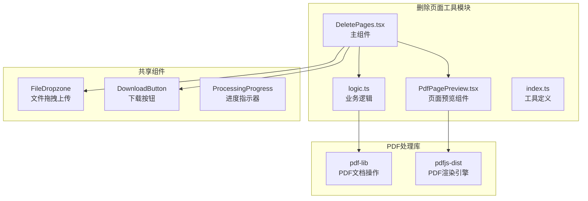

**图表来源**
- [src/tools/pdf/delete-pages/DeletePages.tsx:1-127](file://src/tools/pdf/delete-pages/DeletePages.tsx#L1-L127)
- [src/tools/pdf/delete-pages/logic.ts:1-39](file://src/tools/pdf/delete-pages/logic.ts#L1-L39)
- [src/components/shared/PdfPagePreview.tsx:1-80](file://src/components/shared/PdfPagePreview.tsx#L1-L80)

**章节来源**
- [src/tools/pdf/delete-pages/DeletePages.tsx:1-127](file://src/tools/pdf/delete-pages/DeletePages.tsx#L1-L127)
- [src/tools/pdf/delete-pages/logic.ts:1-39](file://src/tools/pdf/delete-pages/logic.ts#L1-L39)
- [src/tools/pdf/delete-pages/index.ts:1-37](file://src/tools/pdf/delete-pages/index.ts#L1-L37)

## 核心组件

### 主要组件架构

删除页面工具由四个核心组件组成，每个组件都有明确的职责分工：

1. **DeletePages.tsx**: 用户界面组件，负责页面交互和状态管理
2. **logic.ts**: 业务逻辑层，处理PDF文档的实际删除操作
3. **PdfPagePreview.tsx**: 页面预览组件，提供PDF页面的可视化预览
4. **index.ts**: 工具配置定义，注册工具元数据和SEO信息

### 组件间协作流程

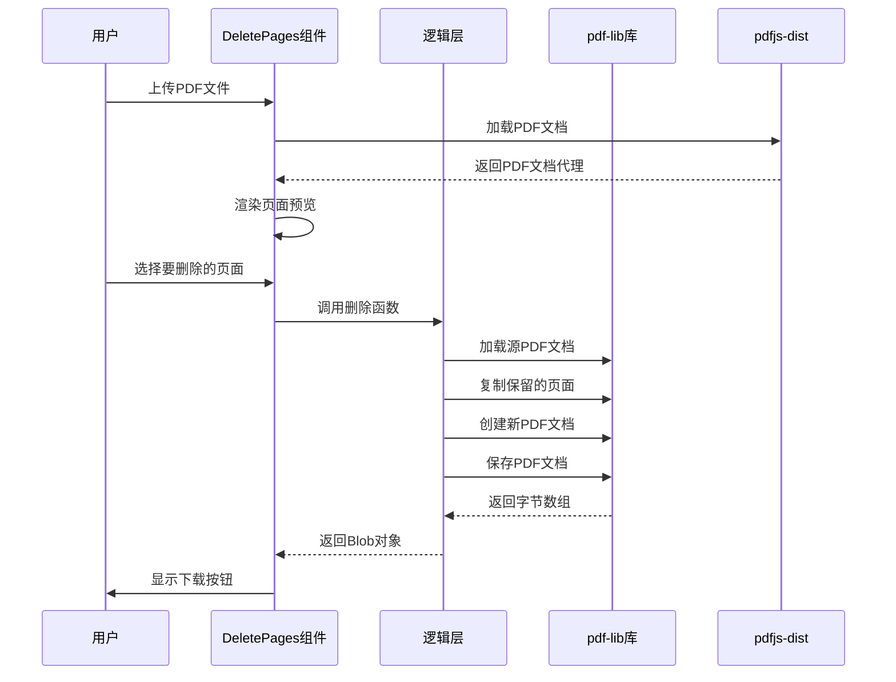

**图表来源**
- [src/tools/pdf/delete-pages/DeletePages.tsx:23-65](file://src/tools/pdf/delete-pages/DeletePages.tsx#L23-L65)
- [src/tools/pdf/delete-pages/logic.ts:3-26](file://src/tools/pdf/delete-pages/logic.ts#L3-L26)

**章节来源**
- [src/tools/pdf/delete-pages/DeletePages.tsx:13-127](file://src/tools/pdf/delete-pages/DeletePages.tsx#L13-L127)
- [src/tools/pdf/delete-pages/logic.ts:1-39](file://src/tools/pdf/delete-pages/logic.ts#L1-L39)

## 架构概览

### 技术栈架构

删除页面工具采用了现代化的前端技术栈，确保了高性能和良好的用户体验：

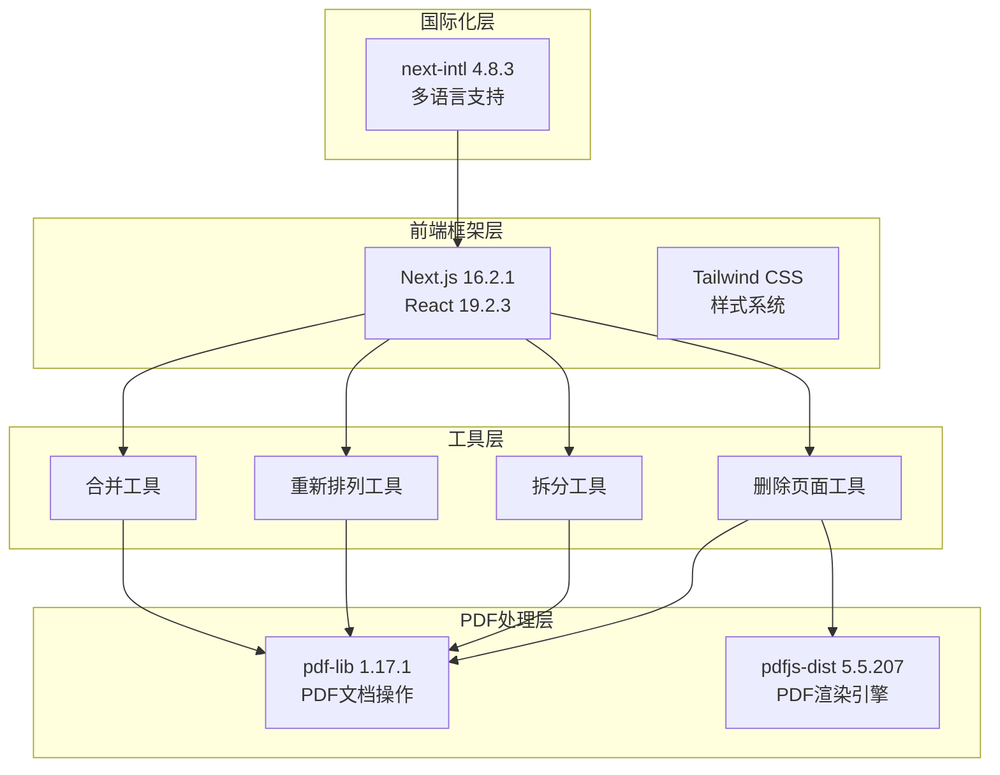

**图表来源**
- [package.json:11-32](file://package.json#L11-L32)
- [src/tools/pdf/delete-pages/DeletePages.tsx:1-127](file://src/tools/pdf/delete-pages/DeletePages.tsx#L1-L127)

### 数据流架构

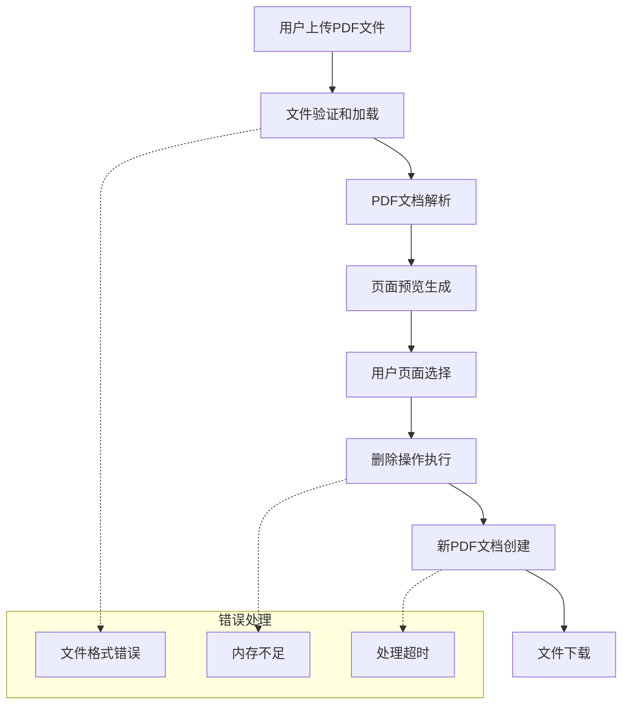

**图表来源**
- [src/tools/pdf/delete-pages/DeletePages.tsx:23-65](file://src/tools/pdf/delete-pages/DeletePages.tsx#L23-L65)
- [src/tools/pdf/delete-pages/logic.ts:3-26](file://src/tools/pdf/delete-pages/logic.ts#L3-L26)

**章节来源**
- [package.json:11-32](file://package.json#L11-L32)
- [src/lib/pdfjs.ts:1-16](file://src/lib/pdfjs.ts#L1-L16)

## 详细组件分析

### DeletePages 主组件

DeletePages.tsx 是整个删除页面工具的核心UI组件，负责管理用户界面状态和交互逻辑。

#### 组件状态管理

组件维护了以下关键状态：
- `file`: 当前处理的PDF文件对象
- `pdfDoc`: pdfjs文档代理对象
- `pageCount`: 文档总页数
- `selected`: 用户选择的页面集合（Set<number>）
- `result`: 处理结果的Blob对象
- `processing`: 处理状态标志
- `error`: 错误信息字符串

#### 页面选择机制

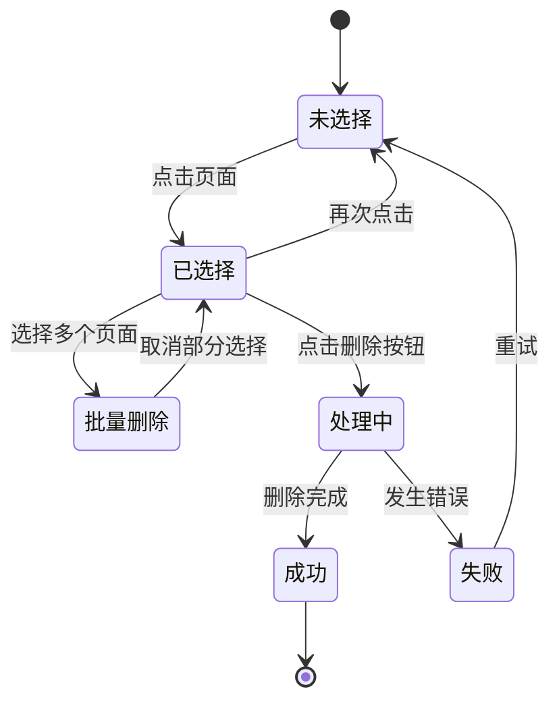

**图表来源**
- [src/tools/pdf/delete-pages/DeletePages.tsx:41-49](file://src/tools/pdf/delete-pages/DeletePages.tsx#L41-L49)

#### 删除确认机制

组件实现了多重安全检查：
1. 文件存在性验证
2. 选择页面数量验证（必须小于总页数）
3. 处理状态防重复提交
4. 错误状态显示和恢复

**章节来源**
- [src/tools/pdf/delete-pages/DeletePages.tsx:13-127](file://src/tools/pdf/delete-pages/DeletePages.tsx#L13-L127)

### PdfPagePreview 预览组件

PdfPagePreview.tsx 提供了高质量的PDF页面预览功能，支持缩放和交互。

#### 渲染流程

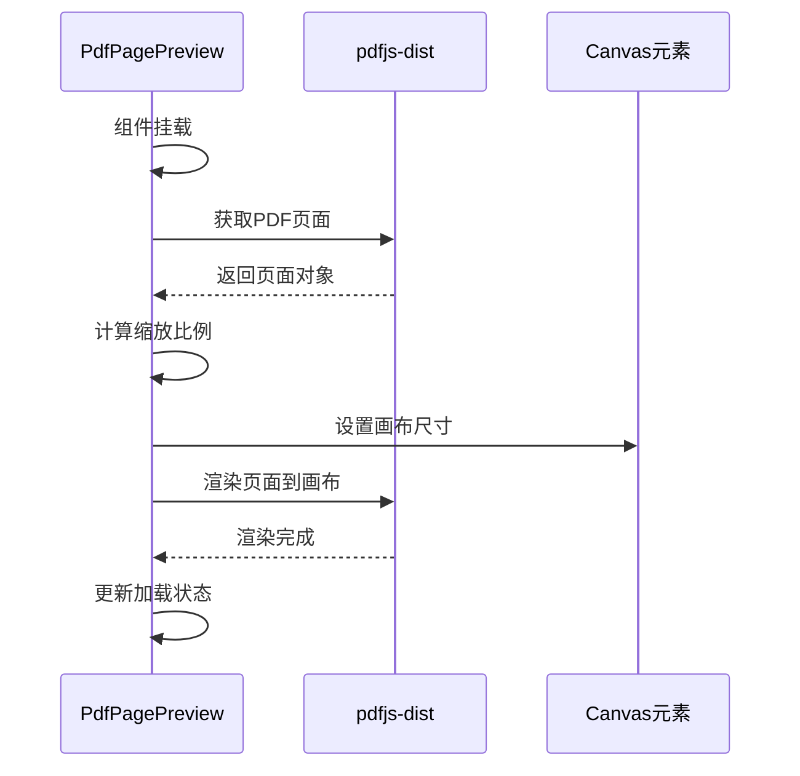

**图表来源**
- [src/components/shared/PdfPagePreview.tsx:27-52](file://src/components/shared/PdfPagePreview.tsx#L27-L52)

#### 性能优化特性

- 按需渲染：仅在需要时渲染页面
- 缓存机制：避免重复渲染相同页面
- 内存管理：组件卸载时清理资源
- 响应式缩放：根据容器宽度自动调整

**章节来源**
- [src/components/shared/PdfPagePreview.tsx:1-80](file://src/components/shared/PdfPagePreview.tsx#L1-L80)

### 删除逻辑实现

logic.ts 实现了核心的PDF页面删除算法，基于pdf-lib库进行文档操作。

#### 删除算法流程

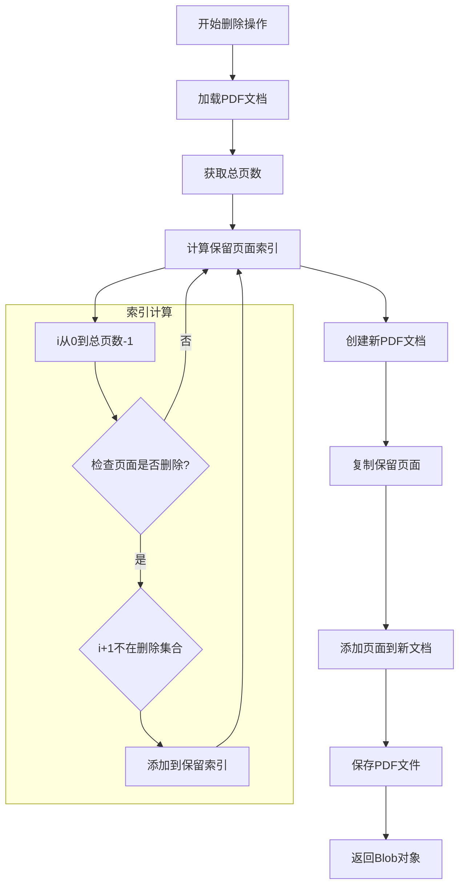

**图表来源**
- [src/tools/pdf/delete-pages/logic.ts:3-26](file://src/tools/pdf/delete-pages/logic.ts#L3-L26)

#### 关键实现细节

1. **页面索引管理**: 将用户输入的页面号转换为pdf-lib内部索引
2. **保留页面筛选**: 使用Set数据结构快速判断页面是否保留
3. **页面复制**: 利用pdf-lib的copyPages方法高效复制页面
4. **文档重建**: 创建全新PDF文档避免引用冲突

**章节来源**
- [src/tools/pdf/delete-pages/logic.ts:1-39](file://src/tools/pdf/delete-pages/logic.ts#L1-L39)

### 工具配置定义

index.ts 提供了删除页面工具的完整配置信息，包括SEO元数据和相关工具链接。

#### 配置结构

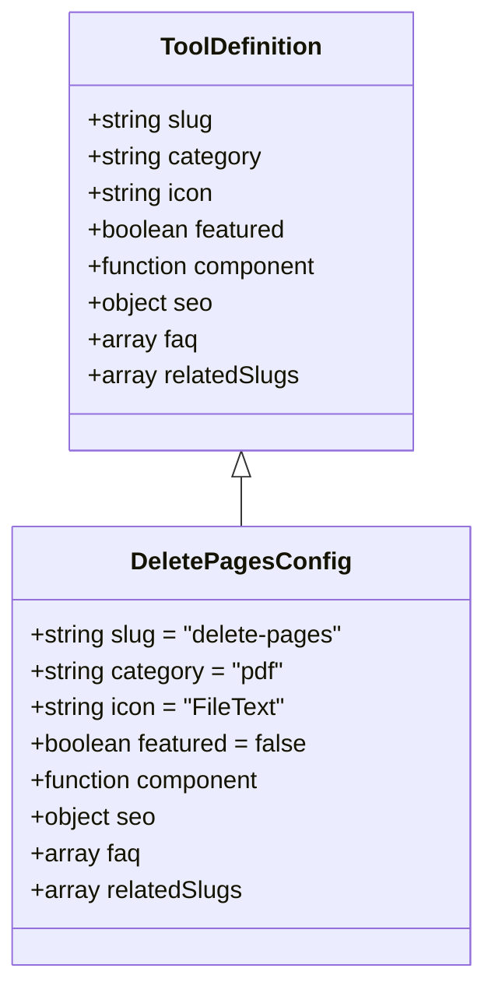

**图表来源**
- [src/tools/pdf/delete-pages/index.ts:3-37](file://src/tools/pdf/delete-pages/index.ts#L3-L37)

**章节来源**
- [src/tools/pdf/delete-pages/index.ts:1-37](file://src/tools/pdf/delete-pages/index.ts#L1-L37)

## 依赖关系分析

### 外部依赖关系

删除页面工具依赖于以下关键库：

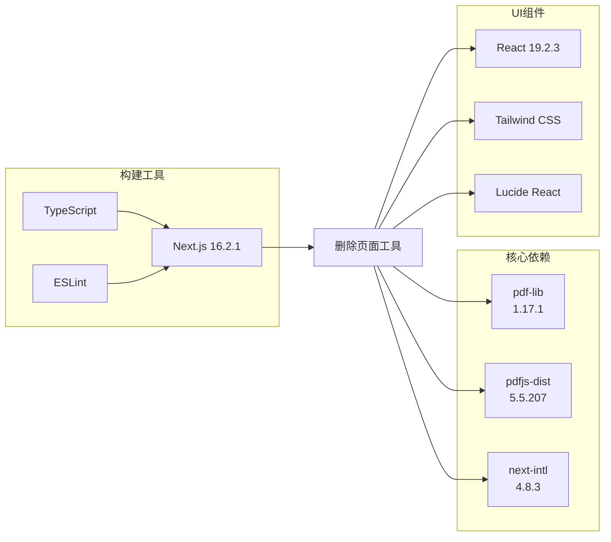

**图表来源**
- [package.json:11-32](file://package.json#L11-L32)

### 内部依赖关系

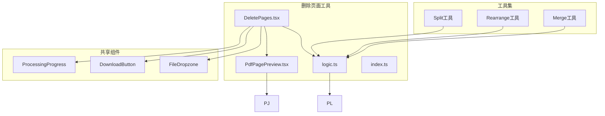

**图表来源**
- [src/tools/pdf/delete-pages/DeletePages.tsx:1-127](file://src/tools/pdf/delete-pages/DeletePages.tsx#L1-L127)
- [src/tools/pdf/delete-pages/logic.ts:1-39](file://src/tools/pdf/delete-pages/logic.ts#L1-L39)

**章节来源**
- [package.json:11-32](file://package.json#L11-L32)

## 性能考虑

### 内存使用优化

删除页面工具在处理大型PDF文档时采用了多项内存优化策略：

1. **渐进式加载**: 使用ArrayBuffer逐步处理文件
2. **及时释放**: 在操作完成后立即释放不再使用的资源
3. **批量操作**: 合并多个页面操作减少内存分配次数
4. **错误边界**: 实现完善的错误处理避免内存泄漏

### 处理速度优化

- **异步处理**: 所有PDF操作都是异步执行
- **并发控制**: 避免同时进行多个重型操作
- **缓存策略**: 复用已加载的PDF文档代理
- **UI响应**: 保持界面流畅响应用户交互

### 浏览器兼容性

工具针对不同浏览器进行了优化：
- Chrome: 最佳性能体验
- Firefox: 兼容性最佳
- Safari: 移动端优化
- Edge: 现代标准支持

## 故障排除指南

### 常见问题及解决方案

#### 文件加载失败

**症状**: 上传PDF后无法显示页面预览
**原因**: 文件损坏或格式不支持
**解决方案**: 
1. 验证PDF文件完整性
2. 尝试使用其他PDF查看器打开
3. 重新生成PDF文件

#### 内存不足错误

**症状**: 处理大型文档时出现内存警告
**原因**: 浏览器内存限制
**解决方案**:
1. 分批处理大文档
2. 关闭其他标签页释放内存
3. 使用64位浏览器版本

#### 删除操作失败

**症状**: 点击删除按钮无响应
**原因**: 选择页面数量异常
**解决方案**:
1. 确保至少保留一页
2. 检查网络连接稳定性
3. 刷新页面重试操作

### 错误恢复机制

删除页面工具实现了多层次的错误恢复机制：

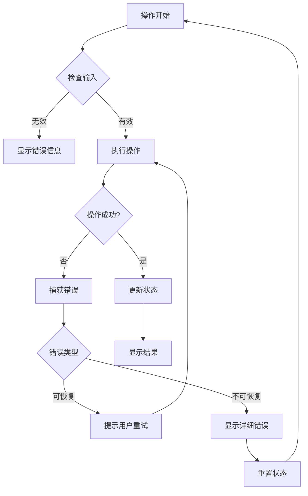

**图表来源**
- [src/tools/pdf/delete-pages/DeletePages.tsx:36-64](file://src/tools/pdf/delete-pages/DeletePages.tsx#L36-L64)

**章节来源**
- [src/tools/pdf/delete-pages/DeletePages.tsx:36-64](file://src/tools/pdf/delete-pages/DeletePages.tsx#L36-L64)

## 结论

删除页面工具是一个设计精良的PDF编辑功能，具有以下突出特点：

### 技术优势

1. **安全性**: 完全在浏览器中本地处理，无需服务器上传
2. **易用性**: 直观的页面选择界面和实时预览
3. **可靠性**: 基于成熟的pdf-lib和pdfjs-dist库
4. **扩展性**: 模块化架构便于功能扩展和维护

### 应用价值

该工具适用于多种实际场景：
- **文档清理**: 移除扫描文档中的空白页
- **隐私保护**: 删除敏感内容后再分享
- **文档精简**: 移除冗余页面提高文件大小
- **内容重组**: 为后续编辑操作准备基础文档

### 技术创新

工具在以下方面体现了技术创新：
- **无服务器架构**: 确保用户数据隐私和安全
- **实时预览**: 提升用户体验和操作准确性
- **批量处理**: 支持高效的多页面操作
- **错误处理**: 完善的异常情况处理机制

## 附录

### 支持的删除模式

工具支持三种主要的删除模式：

1. **单页删除**: 选择任意单个页面进行删除
2. **连续范围删除**: 删除指定范围内的所有页面
3. **多选删除**: 同时选择多个不连续的页面进行删除

### 实际应用场景

#### 移除空白页
- 批量扫描文档中的空白页面
- 自动检测并删除无用页面
- 保持文档内容的完整性

#### 删除敏感内容
- 在分享前删除机密信息
- 移除个人身份信息
- 保护商业机密数据

#### 精简文档
- 删除冗余的说明页面
- 移除过时的版本信息
- 优化文件大小便于传输

### 与pdf-lib库的集成

删除页面工具与pdf-lib库的集成体现在：

- **文档加载**: 使用PDFDocument.load()加载PDF文件
- **页面操作**: 利用copyPages()复制保留页面
- **文档保存**: 通过save()方法生成新的PDF文件
- **类型安全**: 完整的TypeScript类型定义

### 数据完整性保证

工具通过以下机制确保数据完整性：

1. **只读访问**: 原始PDF文件保持不变
2. **原子操作**: 删除操作要么完全成功要么完全失败
3. **错误回滚**: 发生错误时自动恢复到初始状态
4. **结果验证**: 生成的新文档经过完整性检查