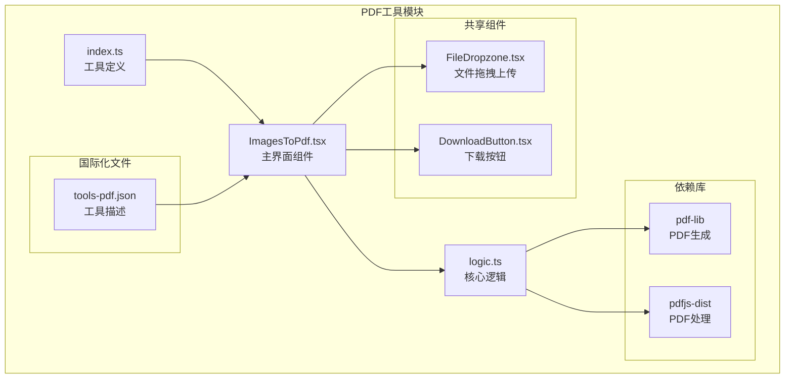
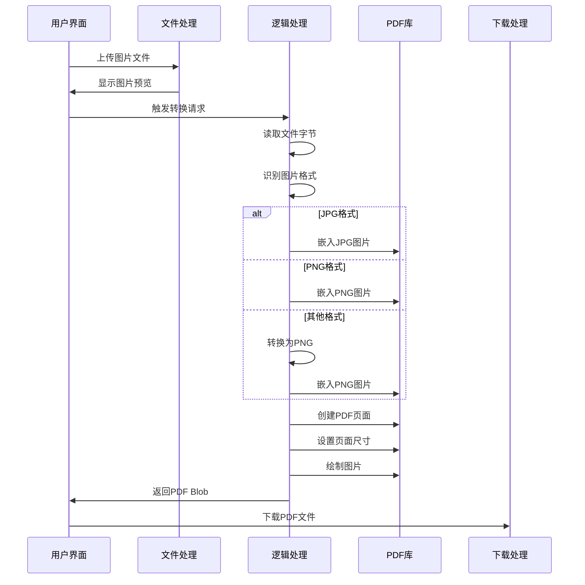
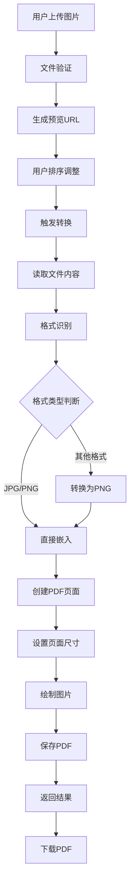
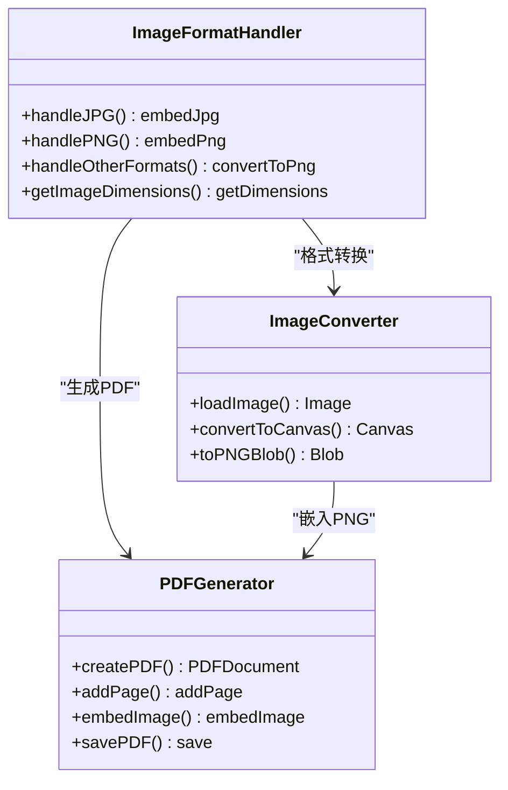
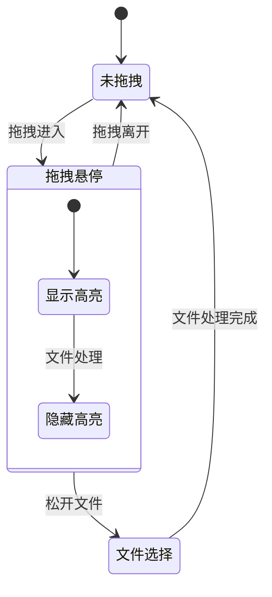
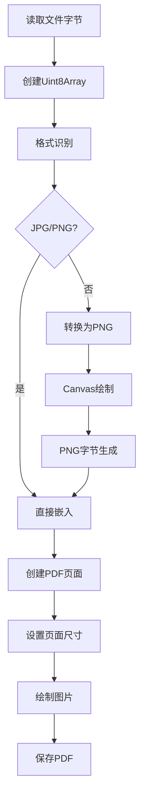
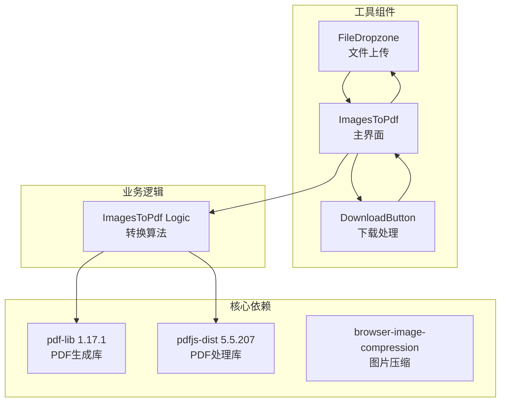
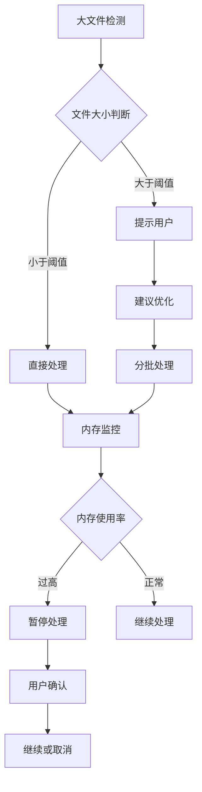
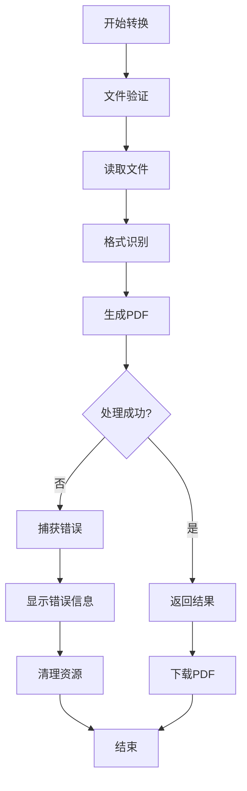

# 图片转PDF工具

<cite>
**本文档引用的文件**
- [ImagesToPdf.tsx](file://src/tools/pdf/images-to-pdf/ImagesToPdf.tsx)
- [logic.ts](file://src/tools/pdf/images-to-pdf/logic.ts)
- [index.ts](file://src/tools/pdf/images-to-pdf/index.ts)
- [FileDropzone.tsx](file://src/components/shared/FileDropzone.tsx)
- [DownloadButton.tsx](file://src/components/shared/DownloadButton.tsx)
- [tools-pdf.json](file://messages/zh-Hans/tools-pdf.json)
- [package.json](file://package.json)
</cite>

## 目录
1. [简介](#简介)
2. [项目结构](#项目结构)
3. [核心组件](#核心组件)
4. [架构概览](#架构概览)
5. [详细组件分析](#详细组件分析)
6. [依赖关系分析](#依赖关系分析)
7. [性能考虑](#性能考虑)
8. [故障排除指南](#故障排除指南)
9. [结论](#结论)

## 简介

图片转PDF工具是一个基于Web的图片转PDF转换器，允许用户将多张图片合并为一个PDF文档。该工具支持多种图片格式，包括JPG、PNG、BMP、TIFF等，并提供拖拽排序功能，让用户可以自定义PDF页面的顺序。

该工具采用纯前端技术实现，所有处理过程都在用户的浏览器中完成，确保了数据隐私和安全性。工具使用pdf-lib库进行PDF生成，支持批量处理和实时预览功能。

## 项目结构

图片转PDF工具位于项目的PDF工具模块中，采用模块化的设计结构：

**图表来源**
- [ImagesToPdf.tsx:1-156](file://src/tools/pdf/images-to-pdf/ImagesToPdf.tsx#L1-L156)
- [logic.ts:1-68](file://src/tools/pdf/images-to-pdf/logic.ts#L1-L68)
- [index.ts:1-37](file://src/tools/pdf/images-to-pdf/index.ts#L1-L37)

**章节来源**
- [ImagesToPdf.tsx:1-156](file://src/tools/pdf/images-to-pdf/ImagesToPdf.tsx#L1-L156)
- [logic.ts:1-68](file://src/tools/pdf/images-to-pdf/logic.ts#L1-L68)
- [index.ts:1-37](file://src/tools/pdf/images-to-pdf/index.ts#L1-L37)

## 核心组件

### 主界面组件 ImagesToPdf

ImagesToPdf.tsx是整个工具的主界面组件，负责用户交互和状态管理。该组件实现了以下核心功能：

- **文件上传处理**：通过FileDropzone组件接收用户上传的图片文件
- **图片预览**：实时生成图片预览缩略图
- **拖拽排序**：允许用户调整图片的显示顺序
- **转换执行**：调用核心逻辑函数生成PDF
- **结果下载**：提供PDF文件的下载功能

### 核心逻辑组件 logic.ts

logic.ts文件包含了图片转PDF的核心算法实现：

- **格式识别**：自动识别图片格式并选择合适的嵌入方式
- **PDF生成**：使用pdf-lib库创建PDF文档
- **页面布局**：根据图片尺寸自动调整页面大小
- **图像嵌入**：支持多种图片格式的嵌入

### 工具定义 index.ts

index.ts文件定义了工具的基本信息和SEO配置，包括工具的标识符、分类、图标等元数据。

**章节来源**
- [ImagesToPdf.tsx:11-156](file://src/tools/pdf/images-to-pdf/ImagesToPdf.tsx#L11-L156)
- [logic.ts:3-31](file://src/tools/pdf/images-to-pdf/logic.ts#L3-L31)
- [index.ts:3-36](file://src/tools/pdf/images-to-pdf/index.ts#L3-L36)

## 架构概览

图片转PDF工具采用分层架构设计，确保了良好的可维护性和扩展性：

**图表来源**
- [ImagesToPdf.tsx:58-72](file://src/tools/pdf/images-to-pdf/ImagesToPdf.tsx#L58-L72)
- [logic.ts:6-27](file://src/tools/pdf/images-to-pdf/logic.ts#L6-L27)

### 数据流架构

**图表来源**
- [logic.ts:3-31](file://src/tools/pdf/images-to-pdf/logic.ts#L3-L31)
- [ImagesToPdf.tsx:28-56](file://src/tools/pdf/images-to-pdf/ImagesToPdf.tsx#L28-L56)

## 详细组件分析

### 图片格式支持与识别

工具支持多种图片格式的转换，通过文件的MIME类型进行识别：

**图表来源**
- [logic.ts:10-18](file://src/tools/pdf/images-to-pdf/logic.ts#L10-L18)
- [logic.ts:33-61](file://src/tools/pdf/images-to-pdf/logic.ts#L33-L61)

#### 支持的输入格式

工具支持以下图片格式的转换：

- **JPG/JPEG**：通过`embedJpg`方法直接嵌入
- **PNG**：通过`embedPng`方法直接嵌入
- **其他格式**：自动转换为PNG格式后嵌入

#### 输出选项配置

当前实现支持以下输出配置：

- **页面尺寸**：根据图片原始尺寸自动调整
- **页面布局**：单图单页布局
- **文件格式**：PDF格式输出

**章节来源**
- [logic.ts:10-18](file://src/tools/pdf/images-to-pdf/logic.ts#L10-L18)
- [logic.ts:20-26](file://src/tools/pdf/images-to-pdf/logic.ts#L20-L26)

### 用户界面组件

#### 文件拖拽上传组件

FileDropzone组件提供了直观的文件上传体验：

**图表来源**
- [FileDropzone.tsx:50-95](file://src/components/shared/FileDropzone.tsx#L50-L95)

#### 图片预览与排序

ImagesToPdf组件实现了图片的实时预览和拖拽排序功能：

- **预览生成**：使用`URL.createObjectURL`生成图片预览
- **排序控制**：通过拖拽箭头按钮调整图片顺序
- **移除功能**：提供X按钮移除不需要的图片

**章节来源**
- [ImagesToPdf.tsx:76-128](file://src/tools/pdf/images-to-pdf/ImagesToPdf.tsx#L76-L128)
- [FileDropzone.tsx:1-144](file://src/components/shared/FileDropzone.tsx#L1-L144)

### PDF生成算法

#### 图像嵌入流程

**图表来源**
- [logic.ts:6-31](file://src/tools/pdf/images-to-pdf/logic.ts#L6-L31)

#### 页面布局设计

工具采用自动页面布局策略：

- **尺寸适配**：页面尺寸与图片尺寸完全匹配
- **无缩放**：图片按照原始尺寸显示
- **单图单页**：每张图片生成一个独立页面

**章节来源**
- [logic.ts:20-26](file://src/tools/pdf/images-to-pdf/logic.ts#L20-L26)

## 依赖关系分析

### 核心依赖库

图片转PDF工具主要依赖以下库：

**图表来源**
- [package.json:11-32](file://package.json#L11-L32)
- [ImagesToPdf.tsx:3-9](file://src/tools/pdf/images-to-pdf/ImagesToPdf.tsx#L3-L9)

### 依赖版本兼容性

工具使用的主要依赖版本：
- **pdf-lib**: ^1.17.1 - 用于PDF文档创建和操作
- **pdfjs-dist**: ^5.5.207 - 用于PDF处理和渲染
- **browser-image-compression**: ^2.0.2 - 用于图片压缩（备用）

**章节来源**
- [package.json:25](file://package.json#L25)
- [package.json:26](file://package.json#L26)
- [package.json:15](file://package.json#L15)

## 性能考虑

### 内存管理策略

图片转PDF工具采用了多项内存管理策略来优化性能：

1. **预览URL管理**：组件卸载时自动撤销所有预览URL
2. **Canvas内存释放**：转换完成后及时释放Canvas内存
3. **文件对象URL清理**：及时撤销临时的文件对象URL

### 大文件处理策略

### 批量处理优化

- **异步处理**：使用Promise和async/await避免阻塞UI
- **进度反馈**：提供实时的处理进度显示
- **错误处理**：完善的错误捕获和用户提示机制

## 故障排除指南

### 常见问题及解决方案

#### 图片格式不支持

**问题**：某些图片格式无法转换
**解决方案**：工具会自动将非JPG/PNG格式转换为PNG格式

#### 内存不足错误

**问题**：处理大图片时出现内存不足
**解决方案**：
1. 关闭其他占用内存的应用程序
2. 尝试处理较小的图片
3. 分批处理大量图片

#### 转换失败

**问题**：图片转换过程中出现错误
**解决方案**：
1. 检查图片文件是否损坏
2. 确认图片格式是否受支持
3. 尝试重新上传图片

### 错误处理机制

**图表来源**
- [ImagesToPdf.tsx:64-71](file://src/tools/pdf/images-to-pdf/ImagesToPdf.tsx#L64-L71)

**章节来源**
- [ImagesToPdf.tsx:64-71](file://src/tools/pdf/images-to-pdf/ImagesToPdf.tsx#L64-L71)
- [logic.ts:33-61](file://src/tools/pdf/images-to-pdf/logic.ts#L33-L61)

## 结论

图片转PDF工具是一个功能完善、用户体验优秀的图片转换工具。其主要特点包括：

### 技术优势

- **纯前端实现**：所有处理在浏览器中完成，确保数据安全
- **多格式支持**：支持JPG、PNG、BMP、TIFF等多种图片格式
- **智能转换**：自动识别格式并进行相应的处理
- **实时预览**：提供拖拽排序和实时预览功能

### 功能特性

- **批量处理**：支持多张图片同时转换
- **灵活布局**：根据图片尺寸自动调整页面大小
- **质量保证**：保持图片的原始质量和分辨率
- **用户友好**：简洁直观的操作界面

### 扩展潜力

该工具为未来的功能扩展提供了良好的基础，包括：
- 支持更多页面布局选项
- 添加图像压缩功能
- 实现批量转换的进度跟踪
- 提供更多的PDF定制选项

通过持续的优化和改进，图片转PDF工具将成为一个强大而易用的图片处理工具。