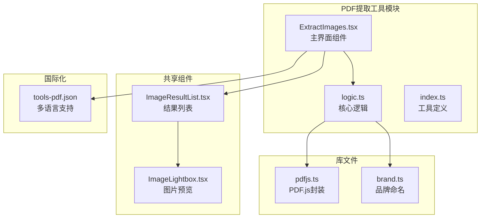
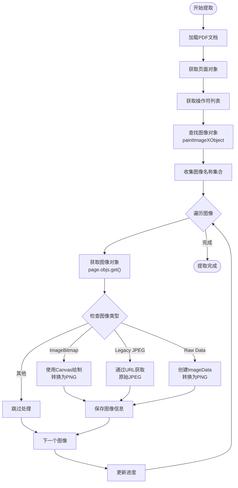
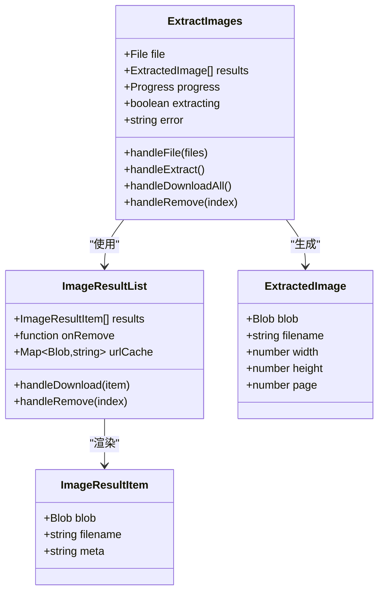
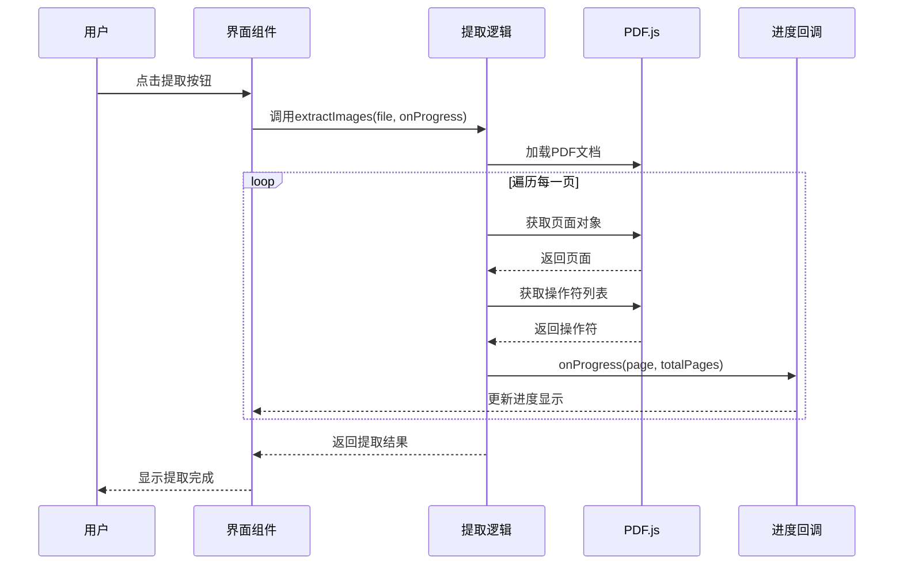
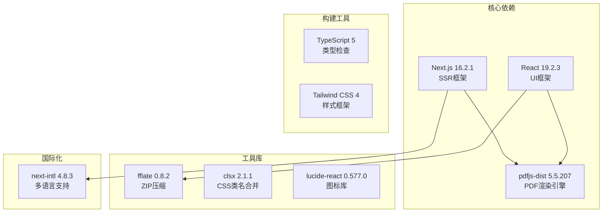

# 提取图片工具

<cite>
**本文档引用的文件**
- [ExtractImages.tsx](file://src/tools/pdf/extract-images/ExtractImages.tsx)
- [logic.ts](file://src/tools/pdf/extract-images/logic.ts)
- [index.ts](file://src/tools/pdf/extract-images/index.ts)
- [pdfjs.ts](file://src/lib/pdfjs.ts)
- [ImageResultList.tsx](file://src/components/shared/ImageResultList.tsx)
- [ImageLightbox.tsx](file://src/components/shared/ImageLightbox.tsx)
- [brand.ts](file://src/lib/brand.ts)
- [tools-pdf.json](file://messages/en/tools-pdf.json)
- [package.json](file://package.json)
</cite>

## 目录
1. [简介](#简介)
2. [项目结构](#项目结构)
3. [核心组件](#核心组件)
4. [架构概览](#架构概览)
5. [详细组件分析](#详细组件分析)
6. [依赖关系分析](#依赖关系分析)
7. [性能考量](#性能考量)
8. [故障排除指南](#故障排除指南)
9. [结论](#结论)
10. [附录](#附录)

## 简介
提取图片工具是一个基于浏览器的PDF图片提取解决方案，允许用户从PDF文档中提取嵌入的图像并以PNG或JPEG格式下载。该工具采用纯前端技术实现，确保用户隐私和数据安全，所有处理都在用户的浏览器中完成。

## 项目结构
提取图片工具位于媒体工具箱项目中，采用模块化架构设计：



**图表来源**
- [ExtractImages.tsx:1-133](file://src/tools/pdf/extract-images/ExtractImages.tsx#L1-L133)
- [logic.ts:1-161](file://src/tools/pdf/extract-images/logic.ts#L1-L161)
- [index.ts:1-37](file://src/tools/pdf/extract-images/index.ts#L1-L37)

**章节来源**
- [ExtractImages.tsx:1-133](file://src/tools/pdf/extract-images/ExtractImages.tsx#L1-L133)
- [logic.ts:1-161](file://src/tools/pdf/extract-images/logic.ts#L1-L161)
- [index.ts:1-37](file://src/tools/pdf/extract-images/index.ts#L1-L37)

## 核心组件
提取图片工具由以下核心组件构成：

### 主界面组件 (ExtractImages)
负责用户交互和状态管理，提供文件上传、进度显示、结果展示等功能。

### 核心逻辑 (logic.ts)
实现PDF图片提取的核心算法，包括图像对象识别、嵌入图像提取、格式转换等。

### 共享组件
- **ImageResultList**: 图片结果列表，支持预览、下载、删除操作
- **ImageLightbox**: 图片放大预览组件

**章节来源**
- [ExtractImages.tsx:19-133](file://src/tools/pdf/extract-images/ExtractImages.tsx#L19-L133)
- [logic.ts:4-161](file://src/tools/pdf/extract-images/logic.ts#L4-L161)
- [ImageResultList.tsx:1-141](file://src/components/shared/ImageResultList.tsx#L1-L141)

## 架构概览
提取图片工具采用分层架构设计，确保代码的可维护性和扩展性：

```mermaid
graph TB
subgraph "表现层"
UI[ExtractImages.tsx<br/>用户界面]
RESULT[ImageResultList.tsx<br/>结果展示]
LIGHTBOX[ImageLightbox.tsx<br/>图片预览]
end
subgraph "业务逻辑层"
EXTRACT[extractImages()<br/>图片提取逻辑]
ZIP[downloadImagesAsZip()<br/>批量下载]
FORMAT[formatFileSize()<br/>文件大小格式化]
end
subgraph "PDF处理层"
PDFJS[pdfjs.ts<br/>PDF.js封装]
PDFDOC[PdfDocumentProxy<br/>PDF文档对象]
PAGE[PdfPageProxy<br/>页面对象]
OBJLIST[OperatorList<br/>操作符列表]
end
subgraph "数据存储层"
CACHE[URL缓存<br/>ObjectURL管理]
ZIPCACHE[ZIP缓存<br/>压缩包缓存]
end
UI --> EXTRACT
UI --> RESULT
RESULT --> LIGHTBOX
EXTRACT --> PDFJS
EXTRACT --> PDFDOC
EXTRACT --> PAGE
EXTRACT --> OBJLIST
EXTRACT --> CACHE
ZIP --> ZIPCACHE
```

**图表来源**
- [ExtractImages.tsx:16-133](file://src/tools/pdf/extract-images/ExtractImages.tsx#L16-L133)
- [logic.ts:12-161](file://src/tools/pdf/extract-images/logic.ts#L12-L161)
- [pdfjs.ts:1-16](file://src/lib/pdfjs.ts#L1-L16)

## 详细组件分析

### PDF图片提取算法
提取图片工具的核心算法基于pdf.js的图像对象识别机制：



**图表来源**
- [logic.ts:25-140](file://src/tools/pdf/extract-images/logic.ts#L25-L140)

#### 图像对象识别机制
工具通过分析PDF的操作符列表来识别图像对象：
- 使用`paintImageXObject`操作符定位图像位置
- 收集所有图像对象名称到集合中
- 遍历集合获取每个图像对象的详细信息

#### 嵌入图像提取流程
针对不同类型的图像数据，工具采用相应的提取策略：

1. **ImageBitmap路径**（推荐）
   - 直接从ImageBitmap对象绘制到Canvas
   - 转换为PNG格式的Blob对象

2. **Legacy JPEG路径**
   - 通过URL获取原始JPEG图像
   - 直接保存为JPEG格式

3. **Raw Pixel Data路径**
   - 创建ImageData对象
   - 处理RGB和RGBA像素数据
   - 绘制到Canvas并转换为PNG

**章节来源**
- [logic.ts:30-140](file://src/tools/pdf/extract-images/logic.ts#L30-L140)

### 用户界面组件设计
提取图片工具的用户界面采用响应式设计，提供直观的操作体验：



**图表来源**
- [ExtractImages.tsx:19-133](file://src/tools/pdf/extract-images/ExtractImages.tsx#L19-L133)
- [ImageResultList.tsx:16-141](file://src/components/shared/ImageResultList.tsx#L16-L141)
- [logic.ts:4-10](file://src/tools/pdf/extract-images/logic.ts#L4-L10)

#### 图片预览功能
- 支持网格布局显示缩略图
- 点击图片弹出全屏预览对话框
- 自动管理ObjectURL缓存，避免内存泄漏

#### 批量下载功能
- 支持单个图片下载
- 支持全部图片打包为ZIP文件下载
- 使用fflate库进行高效的ZIP压缩

**章节来源**
- [ExtractImages.tsx:56-133](file://src/tools/pdf/extract-images/ExtractImages.tsx#L56-L133)
- [ImageResultList.tsx:21-141](file://src/components/shared/ImageResultList.tsx#L21-L141)
- [logic.ts:142-161](file://src/tools/pdf/extract-images/logic.ts#L142-L161)

### 进度监控系统
提取图片工具实现了完整的进度监控机制：



**图表来源**
- [ExtractImages.tsx:40-54](file://src/tools/pdf/extract-images/ExtractImages.tsx#L40-L54)
- [logic.ts:12-15](file://src/tools/pdf/extract-images/logic.ts#L12-L15)

**章节来源**
- [ExtractImages.tsx:40-54](file://src/tools/pdf/extract-images/ExtractImages.tsx#L40-L54)
- [logic.ts:12-15](file://src/tools/pdf/extract-images/logic.ts#L12-L15)

## 依赖关系分析

### 技术栈依赖
提取图片工具使用了现代化的前端技术栈：



**图表来源**
- [package.json:11-32](file://package.json#L11-L32)

### 关键依赖说明
- **pdfjs-dist**: 提供PDF文档解析和图像提取能力
- **fflate**: 实现高效的ZIP文件压缩功能
- **next-intl**: 支持多语言国际化
- **lucide-react**: 提供简洁的SVG图标

**章节来源**
- [package.json:11-32](file://package.json#L11-L32)

## 性能考量

### 浏览器兼容性
提取图片工具针对现代浏览器进行了优化：
- 支持ImageBitmap API用于高效图像处理
- 使用Canvas 2D上下文进行图像转换
- 采用URL.createObjectURL管理内存

### 大文档处理策略
对于大型PDF文档，工具采用了以下优化策略：
- 分页处理，避免一次性加载整个文档
- 智能进度反馈，让用户了解处理状态
- 内存管理优化，及时释放ObjectURL

### 批量处理优化
- 使用Set数据结构去重图像对象名称
- 并行处理不同页面的图像提取
- 智能错误处理，跳过无法提取的图像

## 故障排除指南

### 常见问题及解决方案
1. **无法提取图像**
   - 检查PDF是否包含嵌入图像
   - 确认浏览器支持必要的API
   - 尝试重新上传PDF文件

2. **提取速度慢**
   - 减少同时打开的标签页
   - 关闭不必要的应用程序
   - 使用更高性能的设备

3. **内存不足错误**
   - 分批处理大型PDF文档
   - 清理浏览器缓存
   - 关闭其他占用内存的应用

### 错误处理机制
提取图片工具实现了完善的错误处理：
- 捕获PDF加载失败
- 处理图像提取异常
- 提供用户友好的错误提示

**章节来源**
- [ExtractImages.tsx:48-51](file://src/tools/pdf/extract-images/ExtractImages.tsx#L48-L51)
- [logic.ts:127-131](file://src/tools/pdf/extract-images/logic.ts#L127-L131)

## 结论
提取图片工具是一个功能完整、性能优秀的PDF图像提取解决方案。它采用纯前端技术实现，确保用户隐私和数据安全，同时提供了直观易用的用户界面和强大的批量处理能力。

该工具的主要优势包括：
- 完全本地处理，无需服务器参与
- 支持多种图像格式提取
- 提供丰富的用户交互功能
- 优化的大文档处理能力
- 完善的错误处理机制

## 附录

### 支持的提取模式
- **整页提取**: 提取PDF中所有嵌入的图像
- **对象级提取**: 精确识别和提取图像对象
- **格式转换**: 自动转换为PNG或JPEG格式

### 支持的输出格式
- **PNG**: 无损压缩，支持透明度
- **JPEG**: 有损压缩，文件体积小

### 使用场景示例
1. **素材收集**: 从PDF报告中提取图表和插图
2. **设计复用**: 获取设计元素和模板资源
3. **内容分析**: 提取图像进行内容识别和分析
4. **归档整理**: 保存PDF中的重要图像资料

### 版权考虑
- 工具仅提取PDF中已嵌入的图像
- 不涉及PDF内容的复制或修改
- 用户需遵守相关版权法律法规