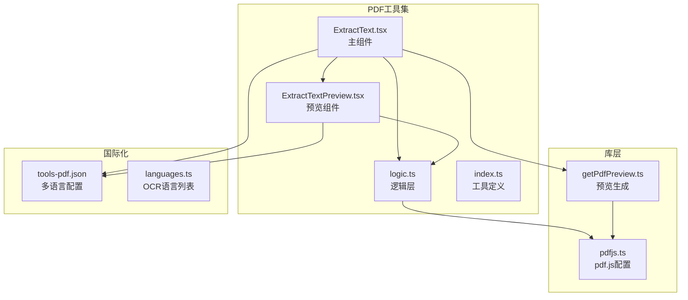
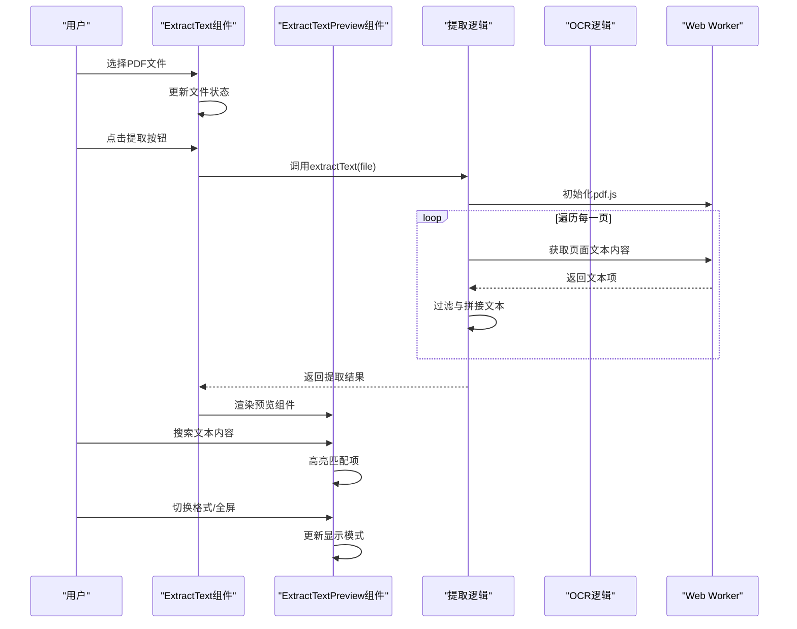
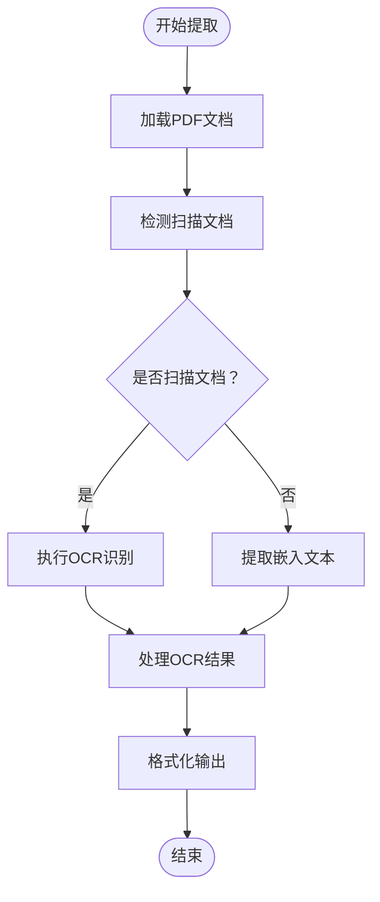
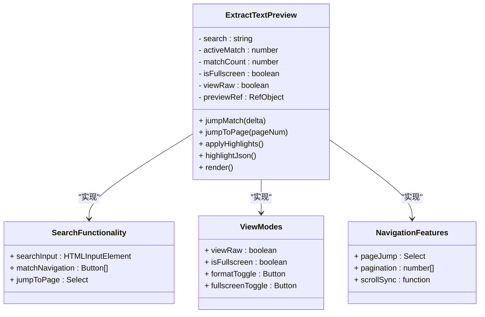
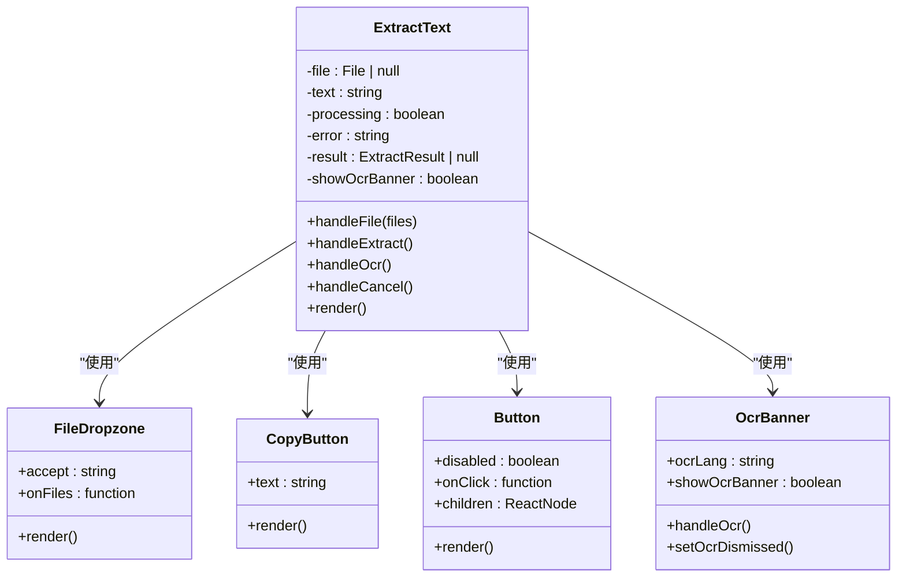

# 提取文本工具

<cite>
**本文档引用的文件**
- [ExtractText.tsx](file://src/tools/pdf/extract-text/ExtractText.tsx)
- [ExtractTextPreview.tsx](file://src/tools/pdf/extract-text/ExtractTextPreview.tsx)
- [logic.ts](file://src/tools/pdf/extract-text/logic.ts)
- [pdfjs.ts](file://src/lib/pdfjs.ts)
- [getPdfPreview.ts](file://src/lib/pdf/getPdfPreview.ts)
- [index.ts](file://src/tools/pdf/extract-text/index.ts)
- [tools-pdf.json](file://messages/en/tools-pdf.json)
- [languages.ts](file://src/lib/ocr/languages.ts)
- [package.json](file://package.json)
- [README.md](file://README.md)
- [Ocr.tsx](file://src/tools/developer/ocr/Ocr.tsx)
- [logic.ts](file://src/tools/developer/ocr/logic.ts)
- [extract-images/logic.ts](file://src/tools/pdf/extract-images/logic.ts)
</cite>

## 更新摘要
**变更内容**
- 新增 ExtractTextPreview 组件，提供增强的文本预览和交互功能
- 增强的 OCR 辅助提取功能，支持智能扫描检测
- 改进的文本格式化和输出选项
- 增强的用户界面和用户体验
- 新增全文搜索和页面跳转功能

## 目录
1. [简介](#简介)
2. [项目结构](#项目结构)
3. [核心组件](#核心组件)
4. [架构总览](#架构总览)
5. [详细组件分析](#详细组件分析)
6. [依赖关系分析](#依赖关系分析)
7. [性能考虑](#性能考虑)
8. [故障排除指南](#故障排除指南)
9. [结论](#结论)
10. [附录](#附录)

## 简介
本工具用于从PDF文档中提取纯文本内容，支持多语言界面与隐私优先的本地处理模式。该实现基于pdf.js引擎进行文本内容提取，并通过浏览器端完成整个流程，确保文件不离开用户设备。新增的文本提取预览组件提供了丰富的交互功能，包括全文搜索、页面跳转、格式切换等。

## 项目结构
提取文本工具位于PDF工具集内，采用标准的工具模块化组织方式，现已增强为包含预览组件的完整架构：



**图表来源**
- [ExtractText.tsx:1-423](file://src/tools/pdf/extract-text/ExtractText.tsx#L1-L423)
- [ExtractTextPreview.tsx:1-378](file://src/tools/pdf/extract-text/ExtractTextPreview.tsx#L1-L378)
- [logic.ts:1-265](file://src/tools/pdf/extract-text/logic.ts#L1-L265)
- [pdfjs.ts:1-16](file://src/lib/pdfjs.ts#L1-L16)
- [getPdfPreview.ts:1-72](file://src/lib/pdf/getPdfPreview.ts#L1-L72)
- [index.ts:1-37](file://src/tools/pdf/extract-text/index.ts#L1-L37)

**章节来源**
- [ExtractText.tsx:1-423](file://src/tools/pdf/extract-text/ExtractText.tsx#L1-L423)
- [ExtractTextPreview.tsx:1-378](file://src/tools/pdf/extract-text/ExtractTextPreview.tsx#L1-L378)
- [logic.ts:1-265](file://src/tools/pdf/extract-text/logic.ts#L1-L265)
- [pdfjs.ts:1-16](file://src/lib/pdfjs.ts#L1-L16)
- [getPdfPreview.ts:1-72](file://src/lib/pdf/getPdfPreview.ts#L1-L72)
- [index.ts:1-37](file://src/tools/pdf/extract-text/index.ts#L1-L37)

## 核心组件
提取文本工具现由四个核心部分组成，形成了完整的文本提取和预览系统：

### 主组件层（ExtractText.tsx）
- 文件拖拽上传与状态管理
- 错误处理与用户反馈
- OCR辅助提取功能
- 进度监控与取消操作
- 结果展示与下载功能

### 预览组件层（ExtractTextPreview.tsx）
- 增强的文本预览界面
- 全文搜索和高亮显示
- 页面跳转和导航功能
- 格式切换（原始/渲染）
- 全屏查看模式
- 复制和下载功能

### 逻辑层（logic.ts）
- pdf.js文档加载与页遍历
- 文本内容提取与格式化
- OCR辅助提取算法
- 智能扫描检测
- 结果聚合与返回

### 配置层（pdfjs.ts, getPdfPreview.ts）
- pdf.js库动态导入
- Web Worker路径配置
- 全局选项初始化
- PDF预览生成
- 密码保护处理

**章节来源**
- [ExtractText.tsx:51-423](file://src/tools/pdf/extract-text/ExtractText.tsx#L51-L423)
- [ExtractTextPreview.tsx:47-378](file://src/tools/pdf/extract-text/ExtractTextPreview.tsx#L47-L378)
- [logic.ts:44-265](file://src/tools/pdf/extract-text/logic.ts#L44-L265)
- [pdfjs.ts:3-13](file://src/lib/pdfjs.ts#L3-L13)
- [getPdfPreview.ts:24-72](file://src/lib/pdf/getPdfPreview.ts#L24-L72)

## 架构总览
工具采用分层架构设计，现已增强为包含预览组件的完整系统，确保职责分离与可维护性。



**图表来源**
- [ExtractText.tsx:161-234](file://src/tools/pdf/extract-text/ExtractText.tsx#L161-L234)
- [ExtractTextPreview.tsx:63-97](file://src/tools/pdf/extract-text/ExtractTextPreview.tsx#L63-L97)
- [logic.ts:44-87](file://src/tools/pdf/extract-text/logic.ts#L44-L87)

## 详细组件分析

### 文本提取算法实现
当前实现采用pdf.js的getTextContent()方法，通过以下步骤完成文本提取：



**图表来源**
- [logic.ts:44-87](file://src/tools/pdf/extract-text/logic.ts#L44-L87)
- [logic.ts:174-262](file://src/tools/pdf/extract-text/logic.ts#L174-L262)

#### 文本坐标获取机制
实现使用pdf.js的文本对象结构，通过坐标信息重建段落结构：

- **Y坐标变化检测**：通过相邻文本项的Y坐标差值判断换行
- **X坐标间距检测**：通过X坐标间距判断空格插入
- **EOL标志处理**：利用hasEOL标志进行强制换行
- **阈值参数**：使用Y_NEWLINE_THRESHOLD和X_SPACE_THRESHOLD进行精确控制

#### 字符编码处理
- 使用ArrayBuffer读取原始字节
- 通过pdf.js自动处理字符编码
- 支持Unicode字符集和多语言文本
- OCR模式下支持多种语言识别

#### 段落结构重建
- 基于坐标信息重建阅读顺序
- 使用阈值算法判断换行和空格
- 合并连续的空白字符
- 保持基本的段落格式

**章节来源**
- [logic.ts:94-142](file://src/tools/pdf/extract-text/logic.ts#L94-L142)

### 预览组件详细分析
新增的ExtractTextPreview组件提供了丰富的交互功能：



**图表来源**
- [ExtractTextPreview.tsx:47-378](file://src/tools/pdf/extract-text/ExtractTextPreview.tsx#L47-L378)

#### 全文搜索功能
- **实时搜索**：输入即搜索，无需提交
- **高亮显示**：自动高亮所有匹配项
- **匹配导航**：前后跳转匹配项
- **搜索计数**：显示匹配总数和当前位置
- **树遍历**：使用DocumentTreeWalker遍历DOM节点

#### 视图模式切换
- **原始视图**：显示未格式化的纯文本
- **渲染视图**：根据格式渲染Markdown或HTML
- **JSON视图**：专门的JSON语法高亮显示
- **全屏模式**：最大化预览窗口

#### 页面导航功能
- **页面跳转**：快速跳转到指定页面
- **滚动同步**：页面切换时自动滚动定位
- **页码标记**：每个页面顶部显示页码徽章
- **分页显示**：长文档按页面分段显示

**章节来源**
- [ExtractTextPreview.tsx:150-275](file://src/tools/pdf/extract-text/ExtractTextPreview.tsx#L150-L275)

### 用户界面组件分析
组件采用React Hooks管理状态，提供直观的用户体验。



**图表来源**
- [ExtractText.tsx:51-423](file://src/tools/pdf/extract-text/ExtractText.tsx#L51-L423)

**章节来源**
- [ExtractText.tsx:51-423](file://src/tools/pdf/extract-text/ExtractText.tsx#L51-L423)

### 工具注册与配置
工具通过统一的注册表进行管理，支持SEO和多语言特性。

**章节来源**
- [index.ts:3-34](file://src/tools/pdf/extract-text/index.ts#L3-L34)

## 依赖关系分析
工具依赖关系清晰，遵循最小依赖原则，现已增强为包含更多功能的完整系统。

```mermaid
graph LR
subgraph "外部依赖"
PDFJS["pdfjs-dist@^5.5.207"]
TESSERACT["tesseract.js"]
NEXT["next@16.2.1"]
REACT["react@19.2.3"]
TYPES["typescript"]
LUCIDE["lucide-react"]
MONACO["@monaco-editor/react"]
END
subgraph "工具内部"
ET["ExtractText组件"]
ETP["ExtractTextPreview组件"]
LOGIC["提取逻辑"]
PDFJS_LIB["pdfjs配置"]
PREVIEW["预览生成"]
OCR_LANG["OCR语言列表"]
END
ET --> ETP
ET --> LOGIC
ETP --> LOGIC
LOGIC --> PDFJS_LIB
ET --> PREVIEW
PREVIEW --> PDFJS_LIB
ET --> OCR_LANG
LOGIC --> TESSERACT
ET --> NEXT
ETP --> REACT
LOGIC --> LUCIDE
PREVIEW --> MONACO
```

**图表来源**
- [package.json:11-32](file://package.json#L11-L32)
- [pdfjs.ts:3-13](file://src/lib/pdfjs.ts#L3-L13)
- [languages.ts:1-17](file://src/lib/ocr/languages.ts#L1-L17)

**章节来源**
- [package.json:11-32](file://package.json#L11-L32)
- [README.md:26-33](file://README.md#L26-L33)

## 性能考虑
基于当前实现的性能特征：

### 处理能力
- 支持多百页文档处理
- 浏览器端内存限制影响最大文件大小
- 大文档可能需要较长时间处理
- OCR处理比纯文本提取更耗时

### 优化建议
1. **分页处理**：对于超大文档，可考虑分批处理页面
2. **进度反馈**：添加页面级进度指示器
3. **内存管理**：及时清理DOM和临时变量
4. **并发优化**：利用Web Workers进行后台处理
5. **缓存策略**：缓存预览结果减少重复计算
6. **懒加载**：延迟加载预览组件以提升初始性能

### OCR性能优化
- **语言模型预加载**：提前加载OCR语言包
- **缩放优化**：合理设置OCR缩放比例
- **进度回调**：提供详细的OCR进度反馈
- **取消支持**：允许用户取消长时间的OCR任务

## 故障排除指南
常见问题及解决方案：

### 文档类型兼容性
- **纯文本PDF**：正常提取，格式保持良好
- **扫描版PDF**：检测到扫描文档时显示OCR提示
- **图像PDF**：无文本内容可提取，显示相应提示

### 错误处理机制
组件提供完善的错误捕获与用户提示：
- 文件格式验证
- 网络异常处理
- 内存不足警告
- 密码保护处理
- OCR引擎错误处理

### OCR辅助方案
对于扫描版PDF，提供智能OCR检测和辅助提取：
- **自动检测**：基于平均字符数阈值检测扫描文档
- **多语言支持**：支持11种语言的OCR识别
- **进度监控**：实时显示OCR处理进度
- **取消操作**：允许用户取消长时间的OCR任务

**章节来源**
- [tools-pdf.json:670-677](file://messages/en/tools-pdf.json#L670-L677)
- [Ocr.tsx:28-42](file://src/tools/developer/ocr/Ocr.tsx#L28-L42)

## 结论
提取文本工具现已发展为功能完整的文本提取和预览系统，具有以下特点：
- **隐私安全**：完全本地处理，无文件上传
- **智能检测**：自动识别扫描文档并提供OCR辅助
- **丰富预览**：提供多种视图模式和交互功能
- **全文搜索**：支持在提取文本中进行搜索和导航
- **格式多样**：支持纯文本、Markdown、JSON等多种输出格式
- **易于使用**：简洁的拖拽式界面和直观的操作流程
- **可扩展性**：基于pdf.js的良好生态支持，易于功能扩展

对于扫描版PDF需求，智能OCR检测功能提供了完整的文字识别解决方案。

## 附录

### 使用场景示例
1. **内容检索**：将PDF内容转换为可搜索的文本，支持全文搜索和高亮
2. **数据分析**：提取文本进行统计分析和内容挖掘
3. **二次编辑**：将PDF内容复制到文档编辑器进行进一步处理
4. **无障碍访问**：为视障用户提供文本朗读支持
5. **内容重用**：提取文本用于翻译、改写或其他用途

### 多语言支持
工具支持21种语言的界面本地化，包括简体中文、繁体中文、英语、日语、韩语等。

### 批量处理策略
- 单文件处理：适合一般使用场景
- 多文件队列：可扩展实现批量处理
- 进度监控：实时显示处理状态
- 取消操作：允许用户中断长时间任务

### 预览功能特性
- **实时搜索**：在提取文本中进行即时搜索和高亮
- **页面导航**：快速跳转到指定页面
- **格式切换**：在原始文本和渲染视图间切换
- **全屏模式**：最大化预览窗口进行详细查看
- **复制下载**：一键复制文本或下载文件