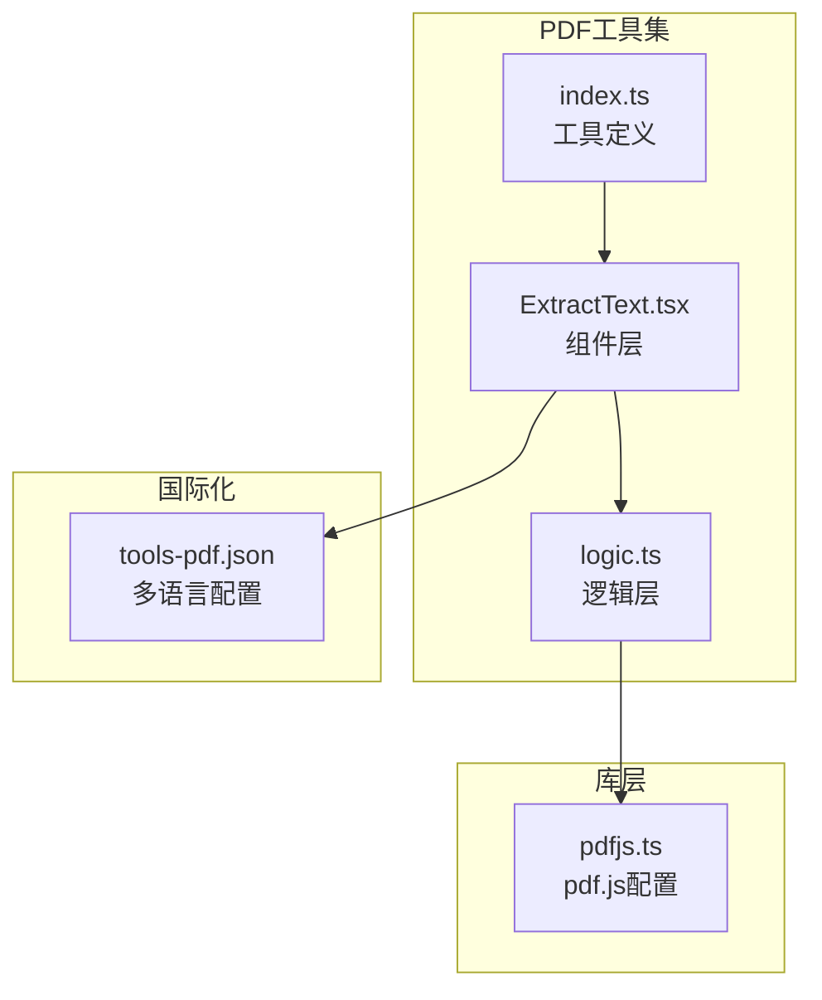
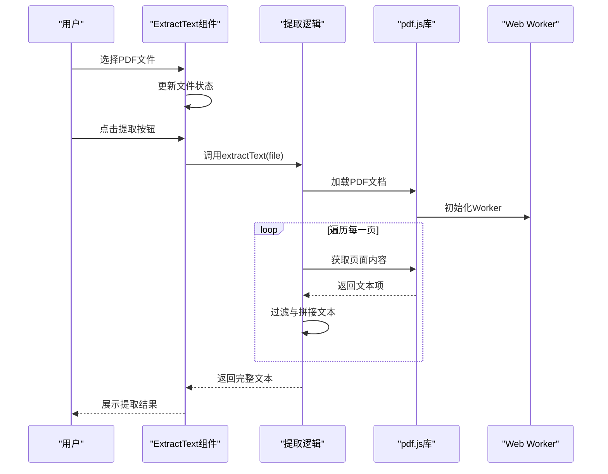
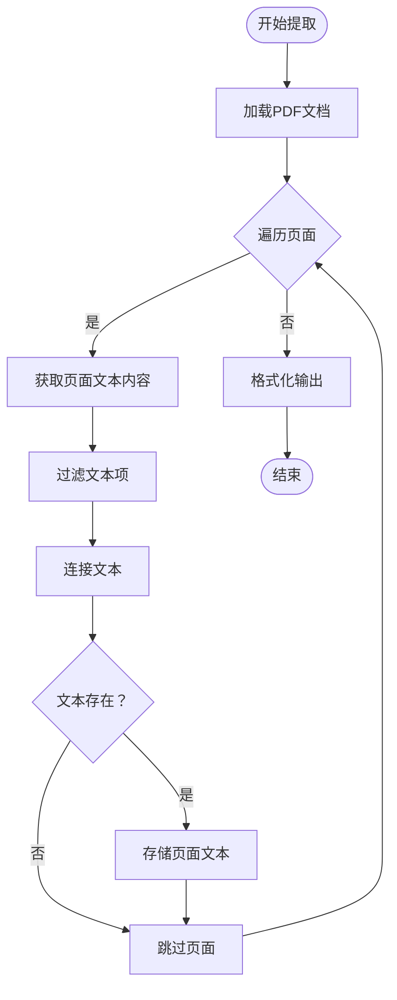
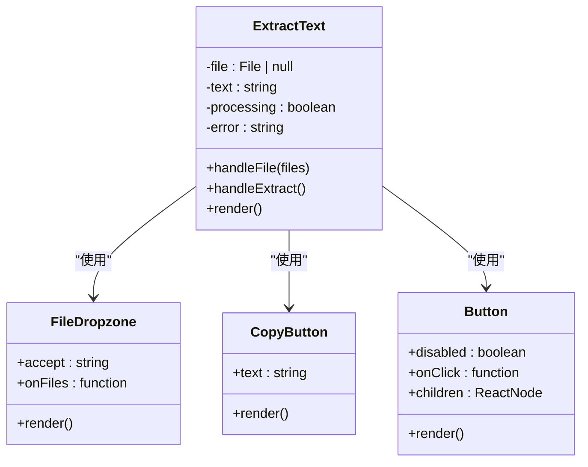
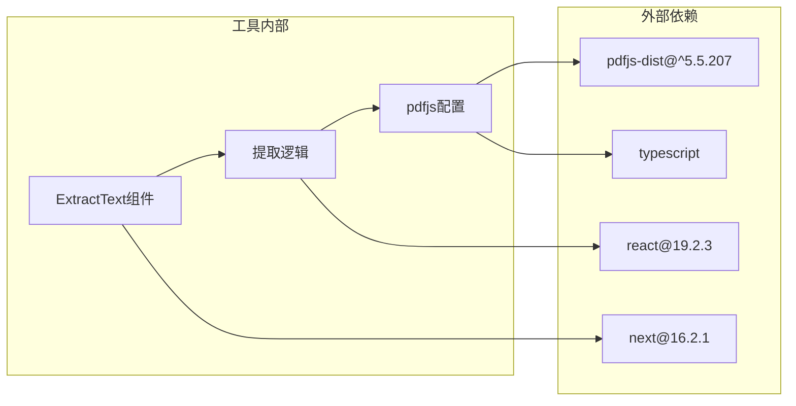

# 提取文本工具

<cite>
**本文档引用的文件**
- [ExtractText.tsx](file://src/tools/pdf/extract-text/ExtractText.tsx)
- [logic.ts](file://src/tools/pdf/extract-text/logic.ts)
- [pdfjs.ts](file://src/lib/pdfjs.ts)
- [index.ts](file://src/tools/pdf/extract-text/index.ts)
- [tools-pdf.json](file://messages/en/tools-pdf.json)
- [package.json](file://package.json)
- [README.md](file://README.md)
- [Ocr.tsx](file://src/tools/developer/ocr/Ocr.tsx)
- [logic.ts](file://src/tools/developer/ocr/logic.ts)
- [extract-images/logic.ts](file://src/tools/pdf/extract-images/logic.ts)
</cite>

## 目录
1. [简介](#简介)
2. [项目结构](#项目结构)
3. [核心组件](#核心组件)
4. [架构总览](#架构总览)
5. [详细组件分析](#详细组件分析)
6. [依赖关系分析](#依赖关系分析)
7. [性能考虑](#性能考虑)
8. [故障排除指南](#故障排除指南)
9. [结论](#结论)
10. [附录](#附录)

## 简介
本工具用于从PDF文档中提取纯文本内容，支持多语言界面与隐私优先的本地处理模式。该实现基于pdf.js引擎进行文本内容提取，并通过浏览器端完成整个流程，确保文件不离开用户设备。

## 项目结构
提取文本工具位于PDF工具集内，采用标准的工具模块化组织方式：
- 组件层：负责UI交互与状态管理
- 逻辑层：封装pdf.js调用与文本提取算法
- 配置层：统一管理pdf.js worker配置

**图表来源**
- [ExtractText.tsx:1-77](file://src/tools/pdf/extract-text/ExtractText.tsx#L1-L77)
- [logic.ts:1-25](file://src/tools/pdf/extract-text/logic.ts#L1-L25)
- [pdfjs.ts:1-16](file://src/lib/pdfjs.ts#L1-L16)
- [index.ts:1-37](file://src/tools/pdf/extract-text/index.ts#L1-L37)

**章节来源**
- [ExtractText.tsx:1-77](file://src/tools/pdf/extract-text/ExtractText.tsx#L1-L77)
- [logic.ts:1-25](file://src/tools/pdf/extract-text/logic.ts#L1-L25)
- [pdfjs.ts:1-16](file://src/lib/pdfjs.ts#L1-L16)
- [index.ts:1-37](file://src/tools/pdf/extract-text/index.ts#L1-L37)

## 核心组件
提取文本工具由三个核心部分组成：

### 组件层（ExtractText.tsx）
- 文件拖拽上传与状态管理
- 错误处理与用户反馈
- 文本复制与展示功能

### 逻辑层（logic.ts）
- pdf.js文档加载与页遍历
- 文本内容提取与格式化
- 结果聚合与返回

### 配置层（pdfjs.ts）
- pdf.js库动态导入
- Web Worker路径配置
- 全局选项初始化

**章节来源**
- [ExtractText.tsx:10-76](file://src/tools/pdf/extract-text/ExtractText.tsx#L10-L76)
- [logic.ts:3-24](file://src/tools/pdf/extract-text/logic.ts#L3-L24)
- [pdfjs.ts:3-12](file://src/lib/pdfjs.ts#L3-L12)

## 架构总览
工具采用分层架构设计，确保职责分离与可维护性。

**图表来源**
- [ExtractText.tsx:25-39](file://src/tools/pdf/extract-text/ExtractText.tsx#L25-L39)
- [logic.ts:9-21](file://src/tools/pdf/extract-text/logic.ts#L9-L21)
- [pdfjs.ts:3-12](file://src/lib/pdfjs.ts#L3-L12)

## 详细组件分析

### 文本提取算法实现
当前实现采用pdf.js的getTextContent()方法，通过以下步骤完成文本提取：

**图表来源**
- [logic.ts:9-21](file://src/tools/pdf/extract-text/logic.ts#L9-L21)

#### 文本坐标获取机制
当前实现未直接使用坐标信息，而是依赖pdf.js的文本对象结构。pdf.js内部会维护字符位置信息，但提取逻辑主要关注文本字符串本身。

#### 字符编码处理
- 使用ArrayBuffer读取原始字节
- 通过pdf.js自动处理字符编码
- 支持Unicode字符集

#### 段落结构重建
- 按页面边界分割内容
- 使用分隔符标识页面起始
- 保持基本的换行和空格结构

**章节来源**
- [logic.ts:3-24](file://src/tools/pdf/extract-text/logic.ts#L3-L24)

### 用户界面组件分析
组件采用React Hooks管理状态，提供直观的用户体验。

**图表来源**
- [ExtractText.tsx:10-76](file://src/tools/pdf/extract-text/ExtractText.tsx#L10-L76)

**章节来源**
- [ExtractText.tsx:10-76](file://src/tools/pdf/extract-text/ExtractText.tsx#L10-L76)

### 工具注册与配置
工具通过统一的注册表进行管理，支持SEO和多语言特性。

**章节来源**
- [index.ts:3-34](file://src/tools/pdf/extract-text/index.ts#L3-L34)

## 依赖关系分析
工具依赖关系清晰，遵循最小依赖原则。

**图表来源**
- [package.json:11-32](file://package.json#L11-L32)
- [pdfjs.ts:3-12](file://src/lib/pdfjs.ts#L3-L12)

**章节来源**
- [package.json:11-32](file://package.json#L11-L32)
- [README.md:26-33](file://README.md#L26-L33)

## 性能考虑
基于当前实现的性能特征：

### 处理能力
- 支持多百页文档处理
- 浏览器端内存限制影响最大文件大小
- 大文档可能需要较长时间处理

### 优化建议
1. **分页处理**：对于超大文档，可考虑分批处理页面
2. **进度反馈**：添加页面级进度指示器
3. **内存管理**：及时清理DOM和临时变量
4. **并发优化**：利用Web Workers进行后台处理

## 故障排除指南
常见问题及解决方案：

### 文档类型兼容性
- **纯文本PDF**：正常提取，格式保持良好
- **扫描版PDF**：仅提取嵌入文本，无法识别图像文字
- **图像PDF**：无文本内容可提取

### 错误处理机制
组件提供完善的错误捕获与用户提示：
- 文件格式验证
- 网络异常处理
- 内存不足警告

### OCR辅助方案
对于扫描版PDF，建议使用OCR工具进行文字识别：
- Tesseract.js引擎驱动
- 支持多种语言
- 实时进度显示

**章节来源**
- [tools-pdf.json:350-357](file://messages/en/tools-pdf.json#L350-L357)
- [Ocr.tsx:28-42](file://src/tools/developer/ocr/Ocr.tsx#L28-L42)

## 结论
提取文本工具实现了PDF纯文本内容的高效提取，具有以下特点：
- 隐私安全：完全本地处理，无文件上传
- 易于使用：简洁的拖拽式界面
- 功能明确：专注于文本提取核心功能
- 可扩展性：基于pdf.js的良好生态支持

对于扫描版PDF需求，建议结合OCR工具实现完整的文字识别解决方案。

## 附录

### 使用场景示例
1. **内容检索**：将PDF内容转换为可搜索的文本
2. **数据分析**：提取文本进行统计分析
3. **二次编辑**：将PDF内容复制到文档编辑器
4. **无障碍访问**：为视障用户提供文本朗读支持

### 多语言支持
工具支持21种语言的界面本地化，包括简体中文、繁体中文、英语、日语、韩语等。

### 批量处理策略
- 单文件处理：适合一般使用场景
- 多文件队列：可扩展实现批量处理
- 进度监控：实时显示处理状态