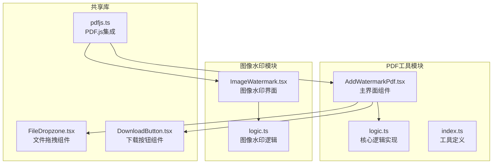
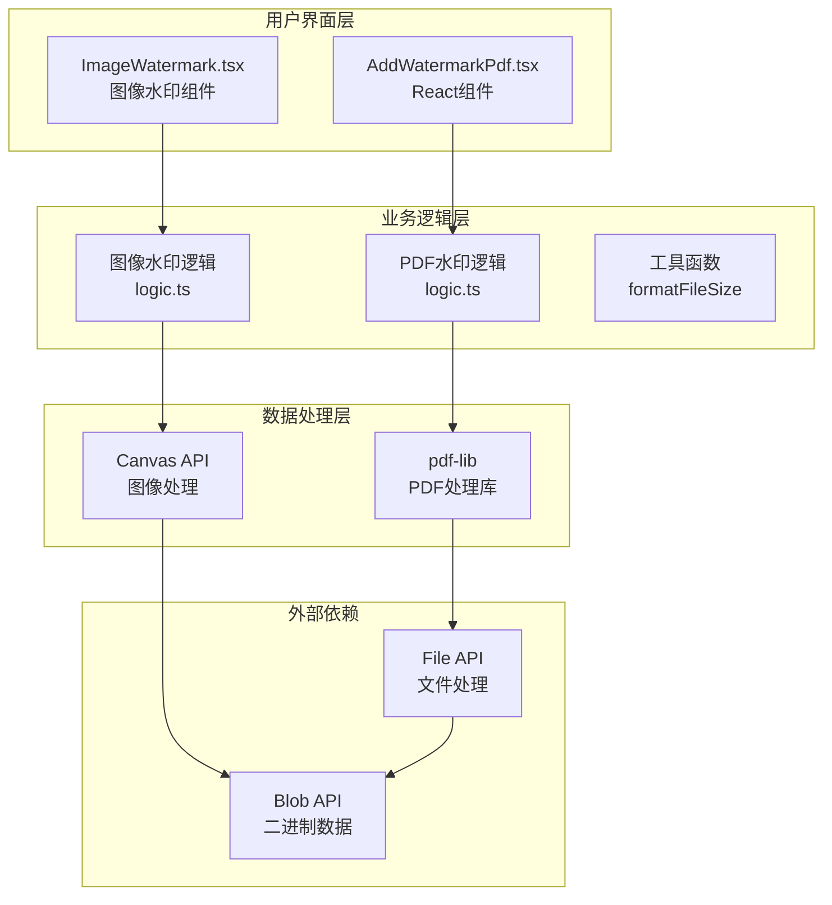
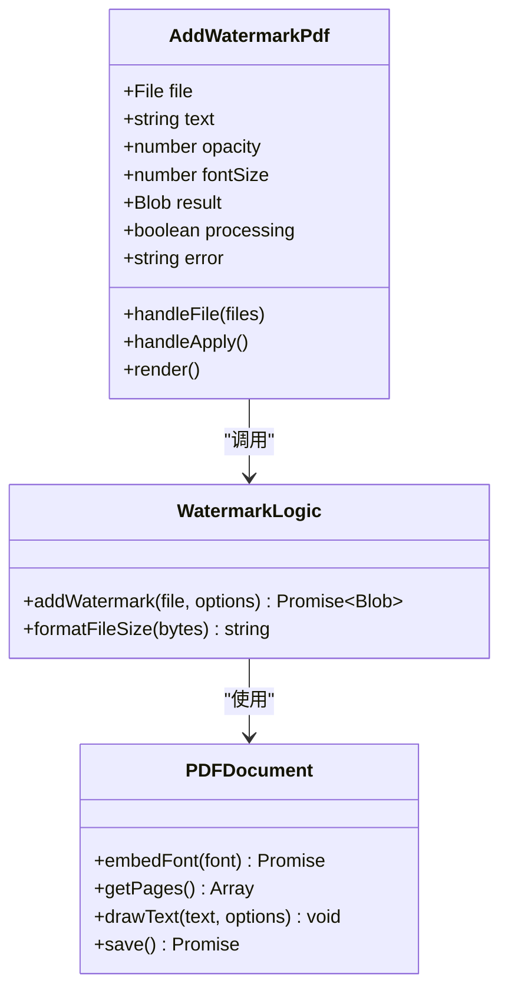
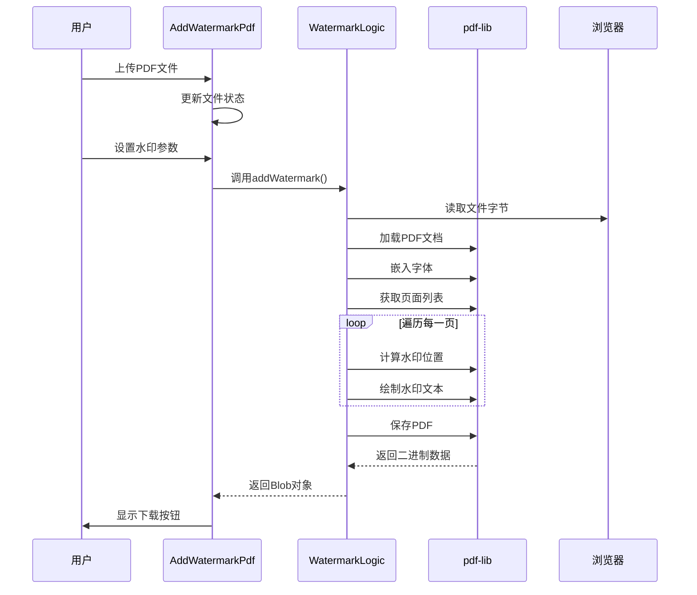
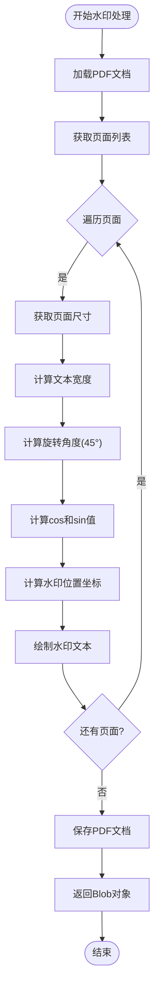
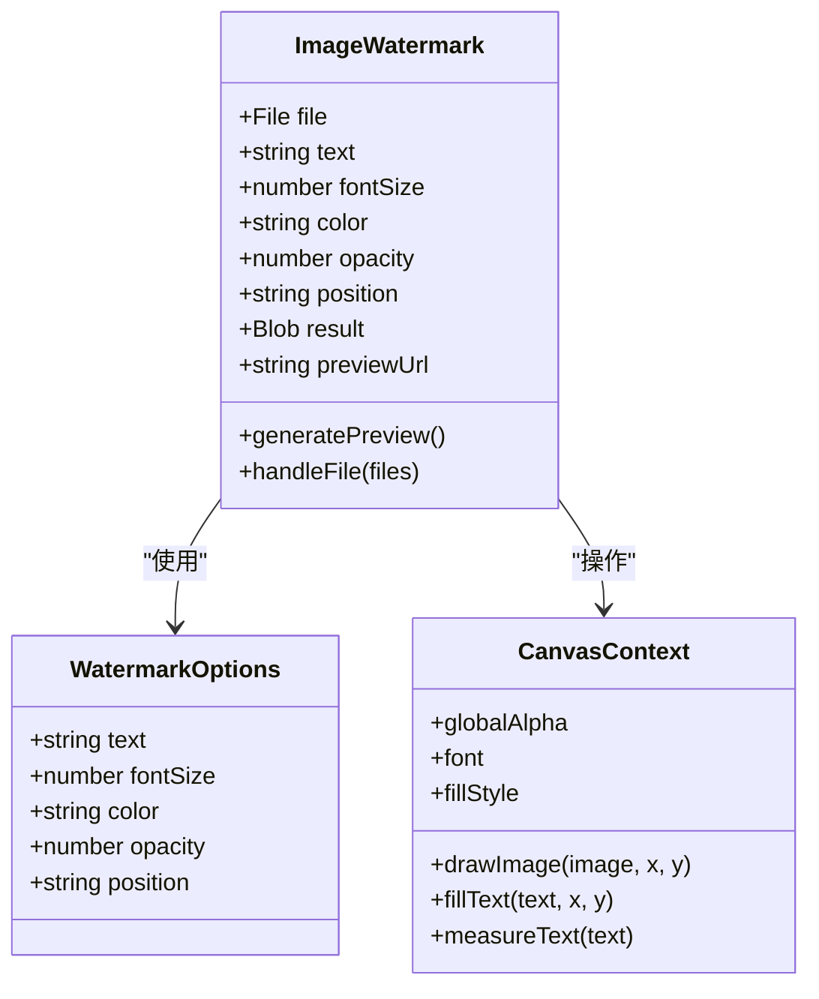
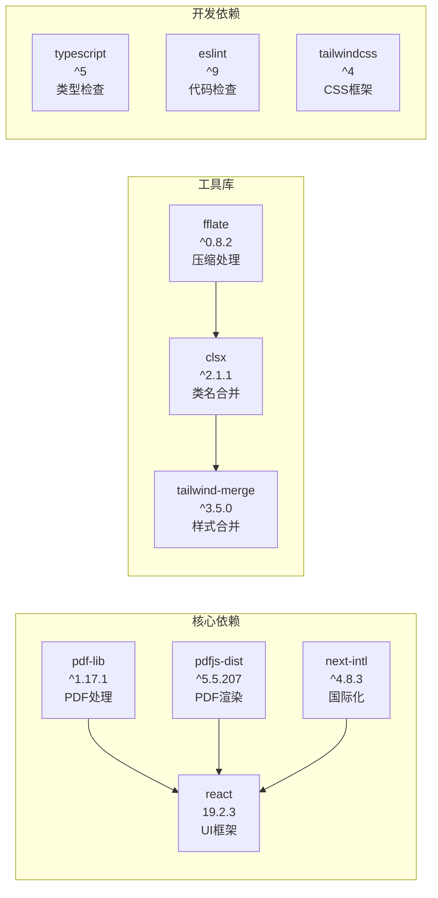
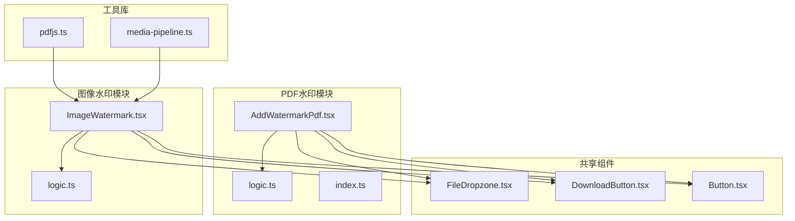
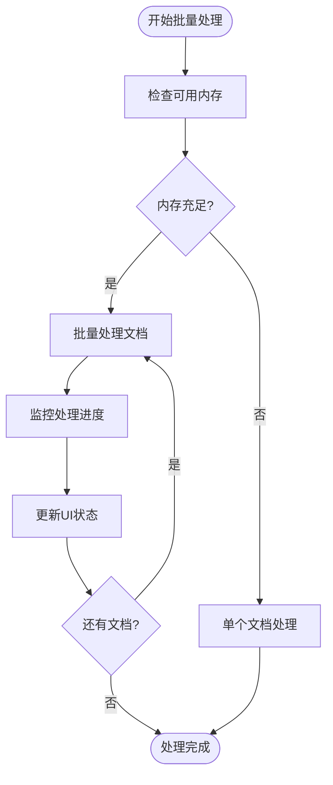
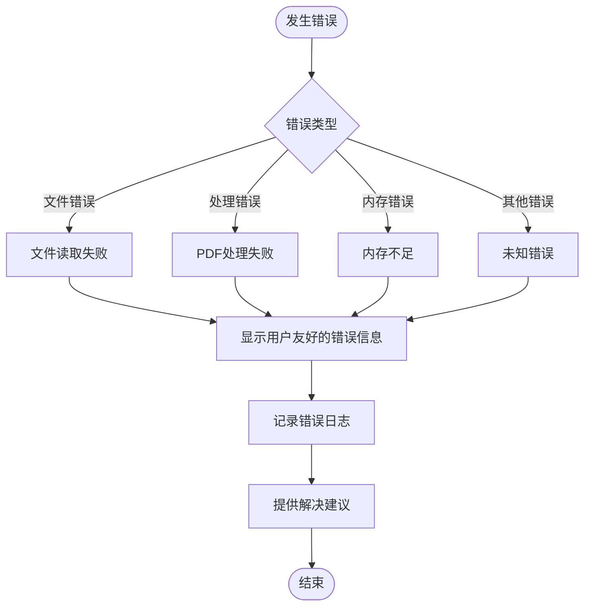

# 添加水印工具

<cite>
**本文档引用的文件**
- [AddWatermarkPdf.tsx](file://src/tools/pdf/add-watermark/AddWatermarkPdf.tsx)
- [logic.ts](file://src/tools/pdf/add-watermark/logic.ts)
- [index.ts](file://src/tools/pdf/add-watermark/index.ts)
- [pdfjs.ts](file://src/lib/pdfjs.ts)
- [ImageWatermark.tsx](file://src/tools/image/watermark/ImageWatermark.tsx)
- [logic.ts](file://src/tools/image/watermark/logic.ts)
- [tools-pdf.json](file://messages/zh-Hans/tools-pdf.json)
- [package.json](file://package.json)
</cite>

## 目录
1. [简介](#简介)
2. [项目结构](#项目结构)
3. [核心组件](#核心组件)
4. [架构概览](#架构概览)
5. [详细组件分析](#详细组件分析)
6. [依赖关系分析](#依赖关系分析)
7. [性能考虑](#性能考虑)
8. [故障排除指南](#故障排除指南)
9. [结论](#结论)
10. [附录](#附录)

## 简介

添加水印工具是一个基于浏览器的PDF水印处理解决方案，专门用于在PDF文档的每一页添加对角线文字水印。该工具提供了完整的水印功能，包括透明度控制、字体大小调整、文本内容编辑等特性，支持版权保护、内部标记、版本标识等多种使用场景。

该工具的核心优势在于完全在浏览器中运行，无需上传文件到服务器，确保用户数据的隐私安全。同时，它采用了高效的pdf-lib库进行PDF处理，支持大文档处理和批量操作。

## 项目结构

添加水印工具位于项目的PDF工具模块中，采用模块化的设计架构：

**图表来源**
- [AddWatermarkPdf.tsx:1-147](file://src/tools/pdf/add-watermark/AddWatermarkPdf.tsx#L1-L147)
- [logic.ts:1-41](file://src/tools/pdf/add-watermark/logic.ts#L1-L41)
- [ImageWatermark.tsx:1-216](file://src/tools/image/watermark/ImageWatermark.tsx#L1-L216)

**章节来源**
- [AddWatermarkPdf.tsx:1-147](file://src/tools/pdf/add-watermark/AddWatermarkPdf.tsx#L1-L147)
- [index.ts:1-37](file://src/tools/pdf/add-watermark/index.ts#L1-L37)

## 核心组件

### AddWatermarkPdf 主组件

AddWatermarkPdf是PDF水印工具的主要用户界面组件，负责处理用户交互和状态管理。该组件实现了完整的水印功能，包括文件上传、参数配置、实时预览和结果下载。

主要功能特性：
- **文件处理**：支持PDF文件拖拽上传和选择
- **参数配置**：文本内容、透明度、字体大小控制
- **实时预览**：参数变化时自动更新水印效果
- **批量处理**：支持单个文件的批量水印操作
- **错误处理**：完善的异常捕获和用户反馈机制

### 核心逻辑模块

核心逻辑模块封装了PDF水印的具体实现算法，基于pdf-lib库提供高效的PDF处理能力。

关键算法特性：
- **对角线水印布局**：45度旋转的对角线排列
- **中心对齐算法**：精确计算水印在页面中的位置
- **透明度控制**：支持0.1-0.5范围内的透明度调节
- **字体测量**：动态计算文本宽度以实现精确布局

**章节来源**
- [AddWatermarkPdf.tsx:10-147](file://src/tools/pdf/add-watermark/AddWatermarkPdf.tsx#L10-L147)
- [logic.ts:3-34](file://src/tools/pdf/add-watermark/logic.ts#L3-L34)

## 架构概览

添加水印工具采用分层架构设计，确保代码的可维护性和扩展性：

**图表来源**
- [AddWatermarkPdf.tsx:8](file://src/tools/pdf/add-watermark/AddWatermarkPdf.tsx#L8)
- [logic.ts:1](file://src/tools/pdf/add-watermark/logic.ts#L1)
- [ImageWatermark.tsx:12](file://src/tools/image/watermark/ImageWatermark.tsx#L12)

## 详细组件分析

### PDF水印组件架构

#### 组件类图

**图表来源**
- [AddWatermarkPdf.tsx:10-46](file://src/tools/pdf/add-watermark/AddWatermarkPdf.tsx#L10-L46)
- [logic.ts:3-34](file://src/tools/pdf/add-watermark/logic.ts#L3-L34)

#### 水印添加流程

**图表来源**
- [AddWatermarkPdf.tsx:28-46](file://src/tools/pdf/add-watermark/AddWatermarkPdf.tsx#L28-L46)
- [logic.ts:7-34](file://src/tools/pdf/add-watermark/logic.ts#L7-L34)

#### 对角线水印算法

PDF水印的核心算法实现了精确的对角线布局：

**图表来源**
- [logic.ts:12-30](file://src/tools/pdf/add-watermark/logic.ts#L12-L30)

**章节来源**
- [AddWatermarkPdf.tsx:28-46](file://src/tools/pdf/add-watermark/AddWatermarkPdf.tsx#L28-L46)
- [logic.ts:12-30](file://src/tools/pdf/add-watermark/logic.ts#L12-L30)

### 图像水印组件分析

#### 图像水印架构

图像水印工具提供了更丰富的水印功能，支持多种布局模式和样式配置：

**图表来源**
- [ImageWatermark.tsx:25-96](file://src/tools/image/watermark/ImageWatermark.tsx#L25-L96)
- [logic.ts:1-7](file://src/tools/image/watermark/logic.ts#L1-L7)

#### 支持的布局模式

图像水印工具支持以下布局模式：

| 布局模式 | 描述 | 实现方式 |
|---------|------|----------|
| center | 居中布局 | 计算页面中心点，文本宽度的一半偏移 |
| top-left | 顶部左侧 | 固定边距，文本高度+边距 |
| top-right | 顶部右侧 | 右侧边缘减去文本宽度和边距 |
| bottom-left | 底部左侧 | 左侧边距，底部减去边距 |
| bottom-right | 底部右侧 | 右侧边缘减去文本宽度，底部减去边距 |
| tile | 平铺布局 | 旋转-30度，按网格间距重复绘制 |

**章节来源**
- [ImageWatermark.tsx:16-23](file://src/tools/image/watermark/ImageWatermark.tsx#L16-L23)
- [logic.ts:34-79](file://src/tools/image/watermark/logic.ts#L34-L79)

### 水印类型与效果

#### 文本水印实现

文本水印是当前PDF工具支持的主要水印类型，具有以下特点：

- **字体嵌入**：使用标准Helvetica字体，确保跨平台兼容性
- **颜色控制**：灰色(0.5, 0.5, 0.5)提供良好的可读性
- **透明度调节**：支持0.1-0.5范围内的透明度控制
- **对角线布局**：45度旋转实现经典的对角线水印效果

#### 图像水印功能

图像水印工具提供了更丰富的水印选项：

- **多布局支持**：居中、四角、平铺等多种布局模式
- **样式定制**：颜色、透明度、字体大小完全可调
- **实时预览**：参数变化时自动更新预览效果
- **批量处理**：支持多文件同时处理

**章节来源**
- [logic.ts:21-29](file://src/tools/pdf/add-watermark/logic.ts#L21-L29)
- [logic.ts:48-79](file://src/tools/image/watermark/logic.ts#L48-L79)

## 依赖关系分析

### 核心依赖库

添加水印工具依赖以下关键库：

**图表来源**
- [package.json:11-32](file://package.json#L11-L32)

### 模块间依赖关系

**图表来源**
- [AddWatermarkPdf.tsx:5-8](file://src/tools/pdf/add-watermark/AddWatermarkPdf.tsx#L5-L8)
- [ImageWatermark.tsx:5-12](file://src/tools/image/watermark/ImageWatermark.tsx#L5-L12)

**章节来源**
- [package.json:11-32](file://package.json#L11-L32)
- [pdfjs.ts:1-16](file://src/lib/pdfjs.ts#L1-L16)

## 性能考虑

### 大文档处理策略

添加水印工具针对大文档处理进行了专门优化：

- **内存管理**：使用Uint8Array直接处理文件字节，避免额外的内存拷贝
- **渐进式处理**：逐页处理PDF，避免一次性加载整个文档
- **异步操作**：所有处理操作都是异步执行，防止UI阻塞
- **错误恢复**：完善的错误处理机制，支持部分失败的文档继续处理

### 批量处理优化

### 性能优化技术

- **Canvas缓存**：图像水印使用Canvas进行硬件加速渲染
- **防抖机制**：参数变化时使用300ms防抖，避免频繁重绘
- **URL对象管理**：及时释放预览URL对象，防止内存泄漏
- **Promise链式调用**：使用Promise避免回调地狱，提高代码可读性

**章节来源**
- [logic.ts:7-8](file://src/tools/pdf/add-watermark/logic.ts#L7-L8)
- [ImageWatermark.tsx:60-88](file://src/tools/image/watermark/ImageWatermark.tsx#L60-L88)

## 故障排除指南

### 常见问题及解决方案

#### PDF文件处理问题

| 问题描述 | 可能原因 | 解决方案 |
|----------|----------|----------|
| PDF文件无法打开 | 文件损坏或格式不支持 | 尝试使用其他PDF查看器打开，确认文件完整性 |
| 水印位置不正确 | 页面尺寸计算错误 | 检查页面设置，确认纸张尺寸 |
| 透明度无效 | 浏览器兼容性问题 | 更新浏览器版本，尝试其他浏览器 |

#### 性能问题

| 问题描述 | 可能原因 | 解决方案 |
|----------|----------|----------|
| 处理速度慢 | 文档过大或内存不足 | 关闭其他程序释放内存，分批处理大文档 |
| 内存占用过高 | 预览URL未释放 | 确保组件卸载时清理URL对象 |
| UI卡顿 | 同步操作过多 | 检查是否有阻塞操作，使用异步处理 |

#### 错误处理机制

**章节来源**
- [AddWatermarkPdf.tsx:40-45](file://src/tools/pdf/add-watermark/AddWatermarkPdf.tsx#L40-L45)
- [ImageWatermark.tsx:78-81](file://src/tools/image/watermark/ImageWatermark.tsx#L78-L81)

## 结论

添加水印工具是一个功能完善、性能优秀的PDF处理解决方案。它成功地将复杂的PDF水印技术封装为简单易用的用户界面，同时保持了高性能和高可靠性。

### 主要优势

- **隐私安全**：完全在浏览器中处理，无需上传文件
- **功能丰富**：支持多种水印类型和布局模式
- **性能优秀**：针对大文档和批量处理进行了专门优化
- **用户体验**：提供实时预览和直观的参数控制
- **可扩展性**：模块化设计便于功能扩展和维护

### 技术特色

- 基于pdf-lib的可靠PDF处理
- Canvas API的高效图像渲染
- React Hooks的状态管理
- 国际化的多语言支持
- 响应式的设计架构

该工具为PDF文档的水印需求提供了完整的解决方案，适用于各种专业和商业应用场景。

## 附录

### 使用场景示例

#### 版权保护
- 在版权文档上添加"版权所有"水印
- 使用半透明效果不影响文档阅读
- 支持批量处理大量文档

#### 内部标记
- 标记内部机密文档为"机密"
- 不同级别的文档使用不同颜色
- 自动生成版本标识

#### 版本标识
- 标记草稿版本为"DRAFT"
- 添加日期和版本号
- 支持自定义水印内容

### 最佳实践建议

- **水印透明度**：建议使用0.2-0.4范围，平衡可见性和可读性
- **字体大小**：根据页面大小调整，通常在30-60px范围内
- **颜色选择**：使用灰色或浅色，避免影响文档内容
- **批量处理**：大文档建议分批处理，避免内存压力
- **备份策略**：处理前备份原始文档，防止意外修改

### 技术规格

- **支持的PDF版本**：PDF 1.4及以上
- **最大文件大小**：受设备内存限制
- **处理速度**：平均每个页面约100-300ms
- **内存使用**：文档大小的2-3倍
- **浏览器兼容性**：Chrome 60+, Firefox 55+, Safari 10+