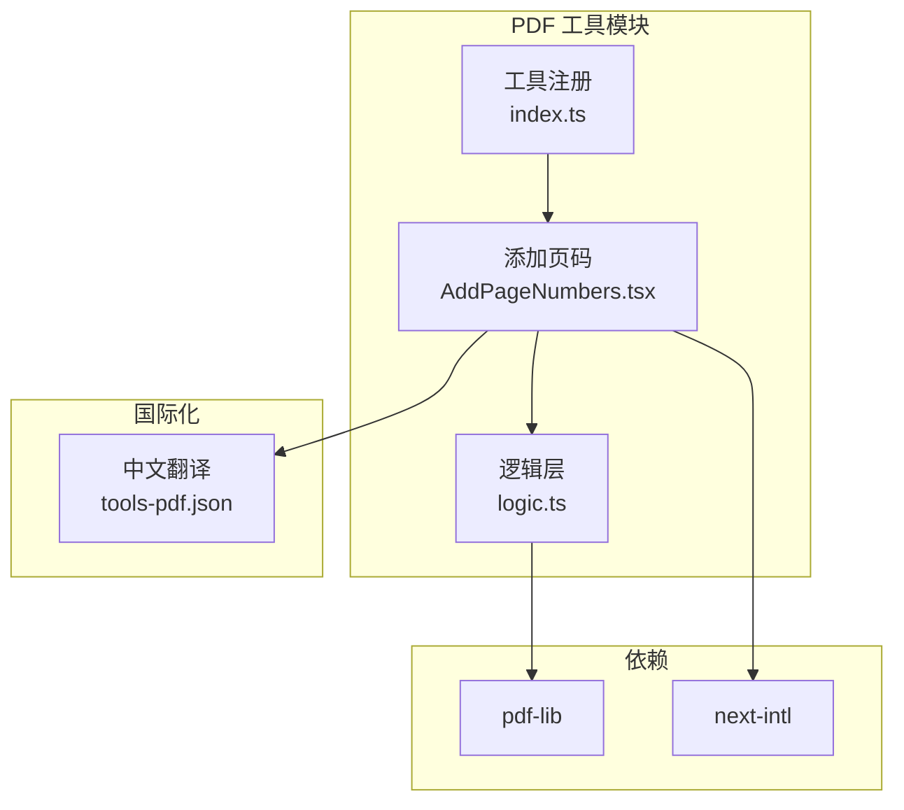
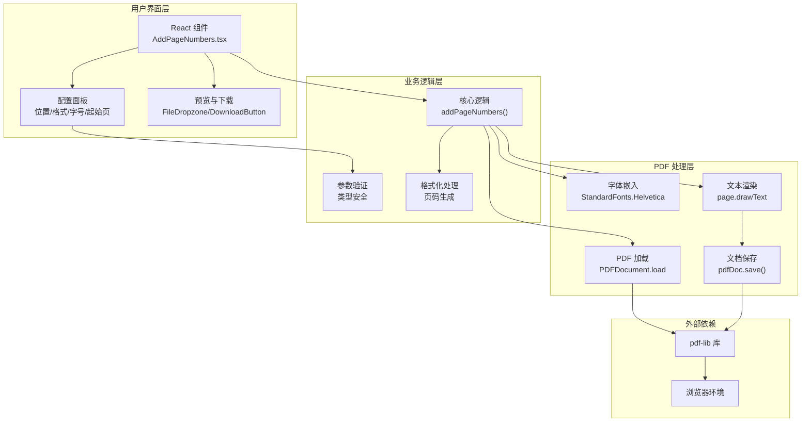
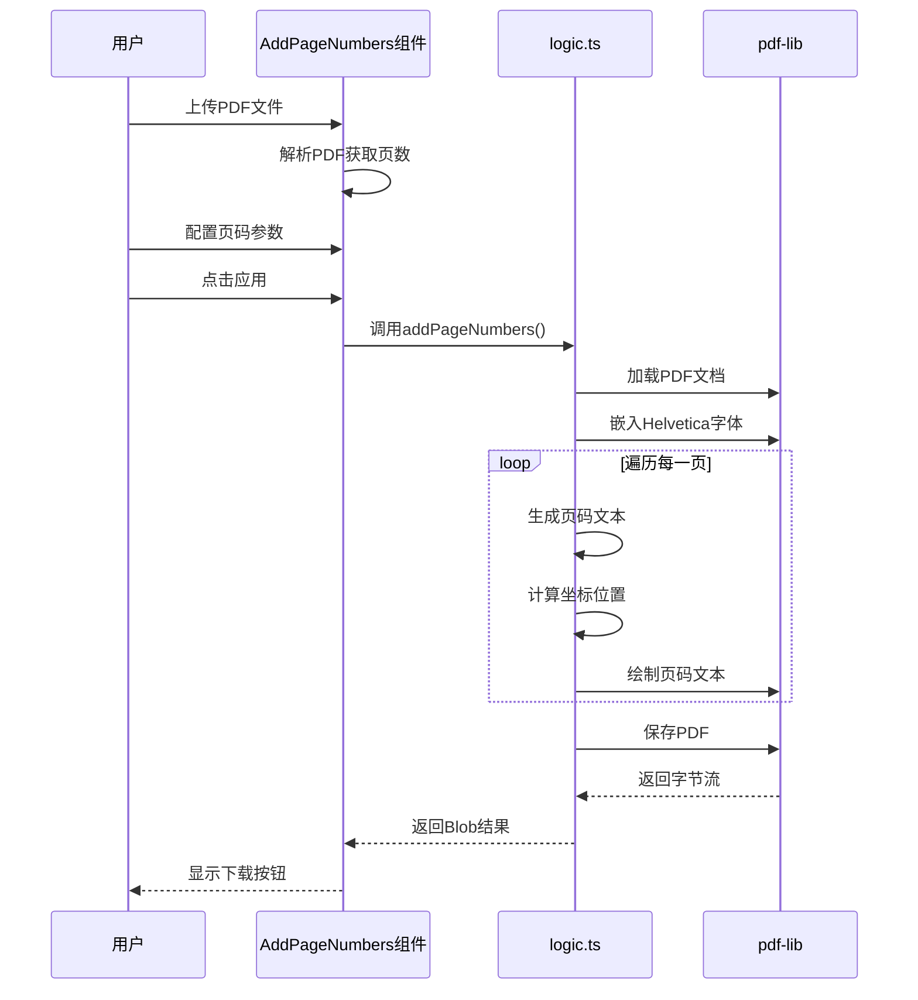
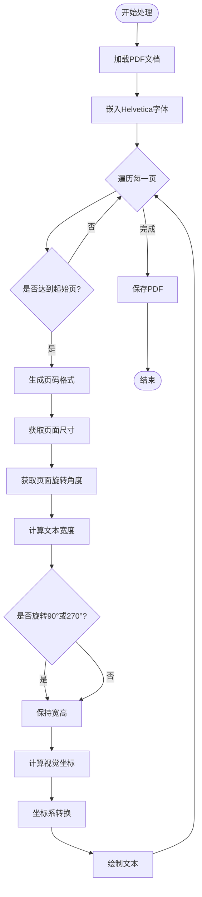
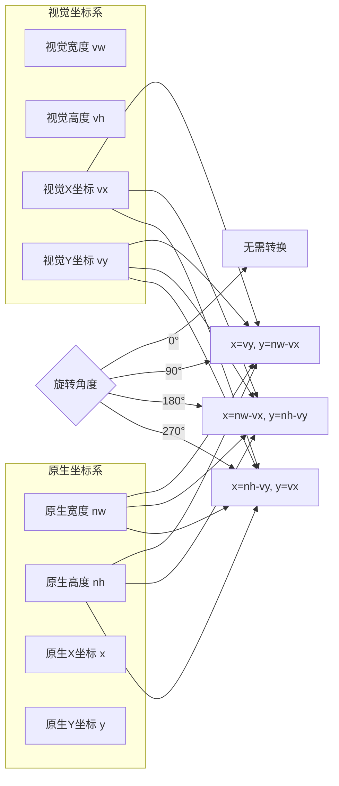
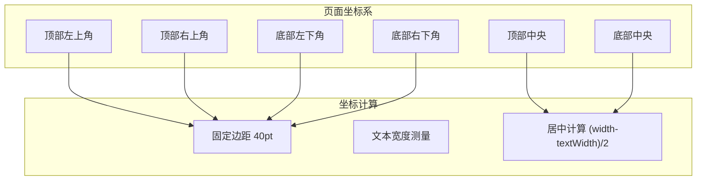
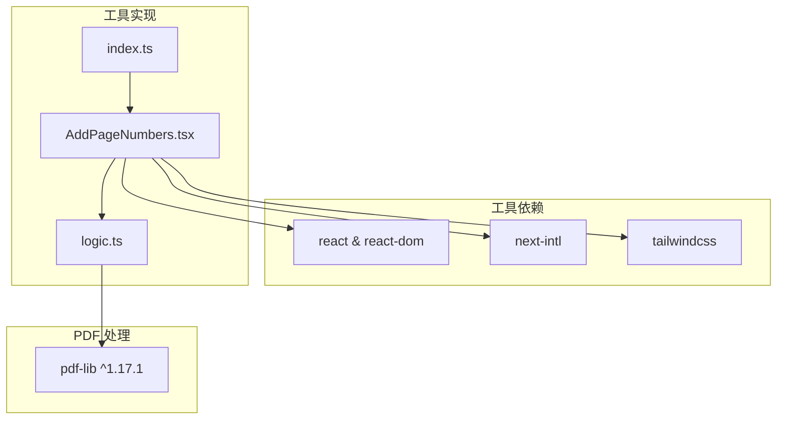

# 添加页码工具

<cite>
**本文引用的文件**
- [AddPageNumbers.tsx](file://src/tools/pdf/add-page-numbers/AddPageNumbers.tsx)
- [logic.ts](file://src/tools/pdf/add-page-numbers/logic.ts)
- [index.ts](file://src/tools/pdf/add-page-numbers/index.ts)
- [tools-pdf.json](file://messages/zh-Hans/tools-pdf.json)
- [package.json](file://package.json)
- [README.md](file://README.md)
- [ToolPageShell.tsx](file://src/components/tool/ToolPageShell.tsx)
</cite>

## 目录
1. [简介](#简介)
2. [项目结构](#项目结构)
3. [核心组件](#核心组件)
4. [架构总览](#架构总览)
5. [详细组件分析](#详细组件分析)
6. [依赖关系分析](#依赖关系分析)
7. [性能考虑](#性能考虑)
8. [故障排除指南](#故障排除指南)
9. [结论](#结论)
10. [附录](#附录)

## 简介
添加页码工具允许用户在 PDF 文档的每一页上添加页码，支持多种页码格式、位置选择以及起始页配置。该工具完全在浏览器端运行，使用 pdf-lib 库进行 PDF 操作，确保文件不离开用户设备，符合隐私优先的设计理念。

## 项目结构
添加页码工具位于 PDF 工具模块中，采用标准的工具目录结构：
- 组件层：AddPageNumbers.tsx（UI 组件）
- 逻辑层：logic.ts（核心业务逻辑）
- 注册层：index.ts（工具定义与 SEO 配置）



**图表来源**
- [AddPageNumbers.tsx:1-183](file://src/tools/pdf/add-page-numbers/AddPageNumbers.tsx#L1-L183)
- [logic.ts:1-94](file://src/tools/pdf/add-page-numbers/logic.ts#L1-L94)
- [index.ts:1-37](file://src/tools/pdf/add-page-numbers/index.ts#L1-L37)

**章节来源**
- [README.md:26-33](file://README.md#L26-L33)
- [package.json:11-32](file://package.json#L11-L32)

## 核心组件
添加页码工具的核心由以下组件构成：

### UI 组件（AddPageNumbers.tsx）
- 文件拖拽上传：支持 PDF 文件选择
- 参数配置面板：位置、格式、字号、起始页
- 实时预览：处理进度与结果展示
- 结果下载：生成带页码的 PDF 文件

### 逻辑组件（logic.ts）
- PDF 加载与解析
- 页码生成算法
- 坐标系统转换
- 文本渲染与保存

### 工具注册（index.ts）
- 工具元数据定义
- SEO 结构化数据
- FAQ 配置

**章节来源**
- [AddPageNumbers.tsx:26-183](file://src/tools/pdf/add-page-numbers/AddPageNumbers.tsx#L26-L183)
- [logic.ts:13-87](file://src/tools/pdf/add-page-numbers/logic.ts#L13-L87)
- [index.ts:3-36](file://src/tools/pdf/add-page-numbers/index.ts#L3-L36)

## 架构总览
工具采用分层架构设计，确保关注点分离和可维护性。



**图表来源**
- [AddPageNumbers.tsx:8-13](file://src/tools/pdf/add-page-numbers/AddPageNumbers.tsx#L8-L13)
- [logic.ts:13-24](file://src/tools/pdf/add-page-numbers/logic.ts#L13-L24)
- [logic.ts:76-83](file://src/tools/pdf/add-page-numbers/logic.ts#L76-L83)

## 详细组件分析

### AddPageNumbers 组件架构
AddPageNumbers 是一个完整的 React 客户端组件，负责用户交互和状态管理。

```mermaid
classDiagram
class AddPageNumbers {
+File file
+number pageCount
+NumberPosition position
+number fontSize
+NumberFormat format
+number startPage
+Blob result
+boolean processing
+string error
+handleFile(files)
+handleApply()
+render()
}
class NumberPosition {
<<enumeration>>
"bottom-center"
"bottom-left"
"bottom-right"
"top-center"
"top-left"
"top-right"
}
class NumberFormat {
<<enumeration>>
"number"
"pageN"
"nOfTotal"
}
AddPageNumbers --> NumberPosition : uses
AddPageNumbers --> NumberFormat : uses
AddPageNumbers --> FileDropzone : uses
AddPageNumbers --> DownloadButton : uses
```

**图表来源**
- [AddPageNumbers.tsx:3-13](file://src/tools/pdf/add-page-numbers/AddPageNumbers.tsx#L3-L13)
- [AddPageNumbers.tsx:15-24](file://src/tools/pdf/add-page-numbers/AddPageNumbers.tsx#L15-L24)

#### 用户界面流程


**图表来源**
- [AddPageNumbers.tsx:54-73](file://src/tools/pdf/add-page-numbers/AddPageNumbers.tsx#L54-L73)
- [logic.ts:13-87](file://src/tools/pdf/add-page-numbers/logic.ts#L13-L87)

**章节来源**
- [AddPageNumbers.tsx:26-183](file://src/tools/pdf/add-page-numbers/AddPageNumbers.tsx#L26-L183)

### 页码生成算法详解
页码生成算法是工具的核心，涉及坐标系统转换和文本渲染。



**图表来源**
- [logic.ts:28-83](file://src/tools/pdf/add-page-numbers/logic.ts#L28-L83)

#### 坐标系统转换机制
工具实现了复杂的坐标系统转换，以处理页面旋转的情况：



**图表来源**
- [logic.ts:45-74](file://src/tools/pdf/add-page-numbers/logic.ts#L45-L74)

**章节来源**
- [logic.ts:13-87](file://src/tools/pdf/add-page-numbers/logic.ts#L13-L87)

### 支持的页码格式
工具支持三种页码格式，每种格式都有特定的生成逻辑：

| 格式类型 | 描述 | 生成规则 | 示例 |
|---------|------|----------|------|
| number | 纯数字 | 直接使用页码数字 | 1, 2, 3... |
| pageN | 带前缀 | "Page " + 页码 | Page 1, Page 2... |
| nOfTotal | 分式格式 | 页码 + " / " + 总页数 | 1 / N, 2 / N... |

**章节来源**
- [logic.ts:33-43](file://src/tools/pdf/add-page-numbers/logic.ts#L33-L43)
- [AddPageNumbers.tsx:75-79](file://src/tools/pdf/add-page-numbers/AddPageNumbers.tsx#L75-L79)

### 位置配置系统
工具提供六种预定义位置，覆盖页眉和页脚的各种对齐方式：



**图表来源**
- [logic.ts:48](file://src/tools/pdf/add-page-numbers/logic.ts#L48)
- [logic.ts:57-64](file://src/tools/pdf/add-page-numbers/logic.ts#L57-L64)

**章节来源**
- [AddPageNumbers.tsx:15-22](file://src/tools/pdf/add-page-numbers/AddPageNumbers.tsx#L15-L22)
- [logic.ts:57-64](file://src/tools/pdf/add-page-numbers/logic.ts#L57-L64)

## 依赖关系分析
添加页码工具的依赖关系相对简洁，主要依赖于 pdf-lib 库和 React 生态系统。



**图表来源**
- [package.json:25](file://package.json#L25)
- [AddPageNumbers.tsx:3](file://src/tools/pdf/add-page-numbers/AddPageNumbers.tsx#L3)
- [index.ts:8](file://src/tools/pdf/add-page-numbers/index.ts#L8)

**章节来源**
- [package.json:11-32](file://package.json#L11-L32)
- [README.md:32](file://README.md#L32)

## 性能考虑
添加页码工具在性能方面采用了多项优化策略：

### 内存优化
- **单次加载**：PDF 文档只加载一次，避免重复内存占用
- **流式处理**：使用 ArrayBuffer 直接处理二进制数据
- **及时释放**：处理完成后立即释放中间变量

### 计算优化
- **缓存字体宽度**：使用 pdf-lib 的 widthOfTextAtSize 方法进行精确测量
- **批量操作**：在单个 PDF 文档内进行批量页码添加
- **坐标预计算**：预先计算所有页面的坐标，避免重复计算

### 浏览器兼容性
- **异步加载**：pdf-lib 采用动态导入，减少初始包体积
- **错误处理**：完善的异常捕获和用户提示机制
- **进度反馈**：处理过程中的实时状态更新

**章节来源**
- [logic.ts:22-24](file://src/tools/pdf/add-page-numbers/logic.ts#L22-L24)
- [AddPageNumbers.tsx:45](file://src/tools/pdf/add-page-numbers/AddPageNumbers.tsx#L45)

## 故障排除指南
常见问题及解决方案：

### PDF 加载失败
**症状**：上传 PDF 后出现错误提示
**原因**：文件损坏或格式不支持
**解决**：尝试使用其他 PDF 文件，确保文件完整性

### 页码位置异常
**症状**：页码出现在意外位置
**原因**：页面旋转角度导致坐标转换错误
**解决**：检查页面旋转设置，工具会自动处理旋转情况

### 字体渲染问题
**症状**：页码显示为方块或缺失字符
**原因**：字体嵌入失败
**解决**：刷新页面重试，确保网络连接正常

### 性能问题
**症状**：大文件处理缓慢
**原因**：浏览器内存限制
**解决**：关闭其他标签页释放内存，或分批处理大文档

**章节来源**
- [AddPageNumbers.tsx:49-51](file://src/tools/pdf/add-page-numbers/AddPageNumbers.tsx#L49-L51)
- [AddPageNumbers.tsx:68-70](file://src/tools/pdf/add-page-numbers/AddPageNumbers.tsx#L68-L70)

## 结论
添加页码工具是一个设计精良的浏览器端 PDF 处理工具，具有以下特点：

- **隐私安全**：所有处理在本地完成，文件永不离开用户设备
- **功能完整**：支持多种页码格式、位置和配置选项
- **性能优秀**：采用优化的算法和内存管理策略
- **用户体验**：直观的界面设计和实时反馈机制

该工具为 PDF 文档处理提供了可靠的解决方案，特别适用于需要批量添加页码的场景，如报告、论文、手册等文档的标准化处理。

## 附录

### 使用场景示例
1. **学术论文**：为长篇论文添加连续页码，便于引用和索引
2. **企业报告**：为季度报告添加页码，方便内部审阅和归档
3. **技术文档**：为用户手册添加页码，提升文档的专业性和易用性
4. **法律文件**：为合同和协议添加页码，确保文档的完整性和可追溯性

### 未来扩展建议
- 支持自定义字体和颜色
- 添加批量处理功能
- 实现分节编号和复杂页码格式
- 增加页眉页脚模板功能