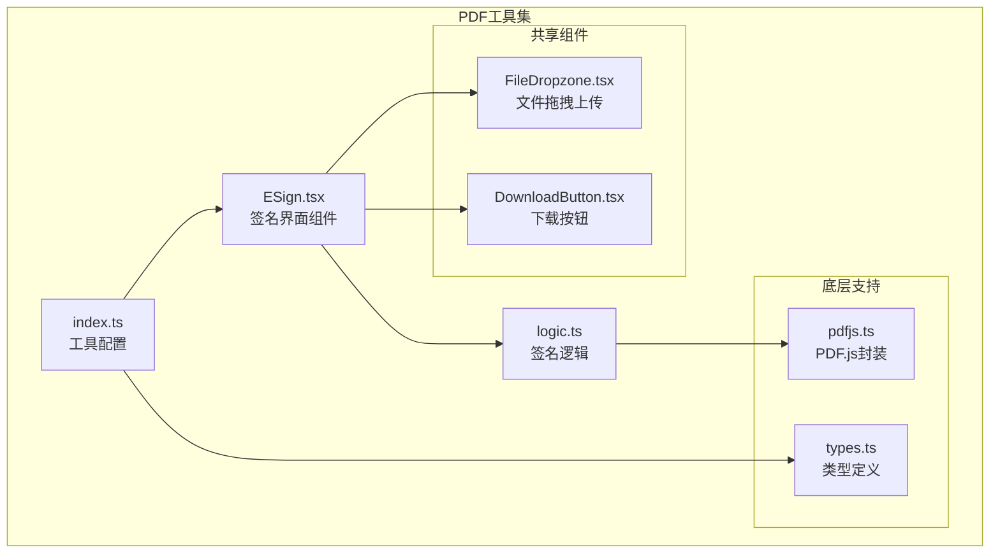
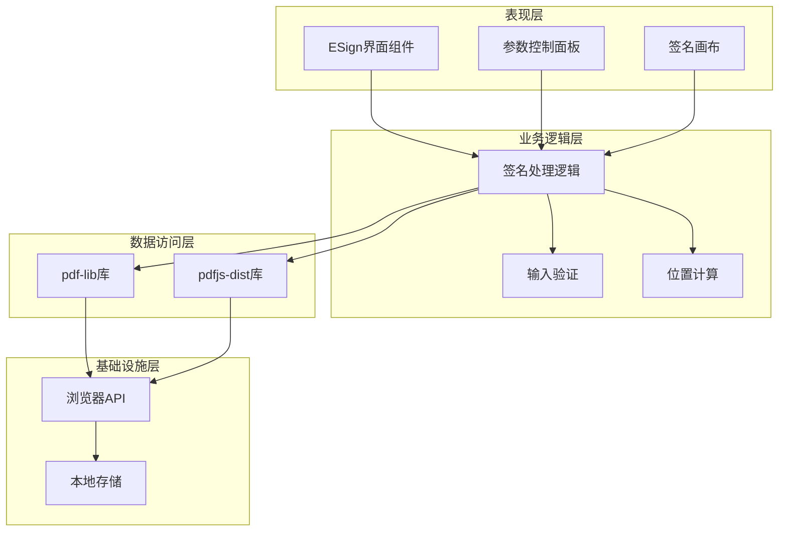
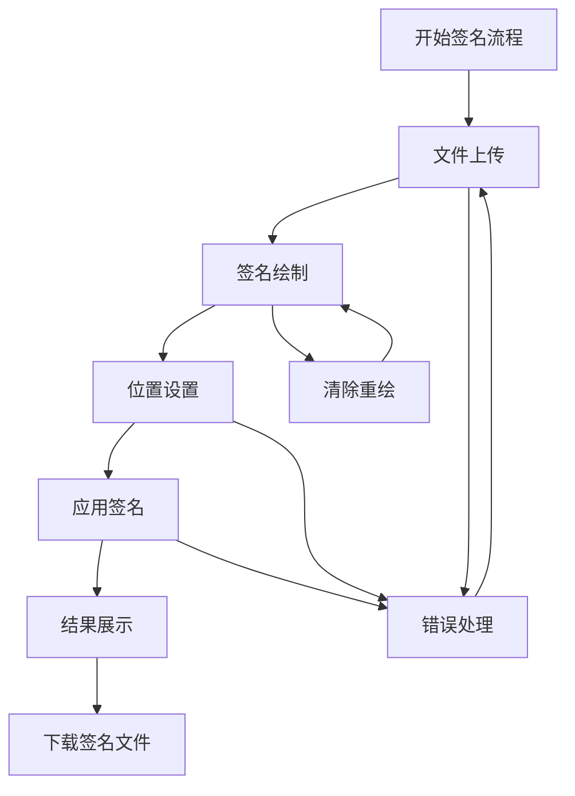
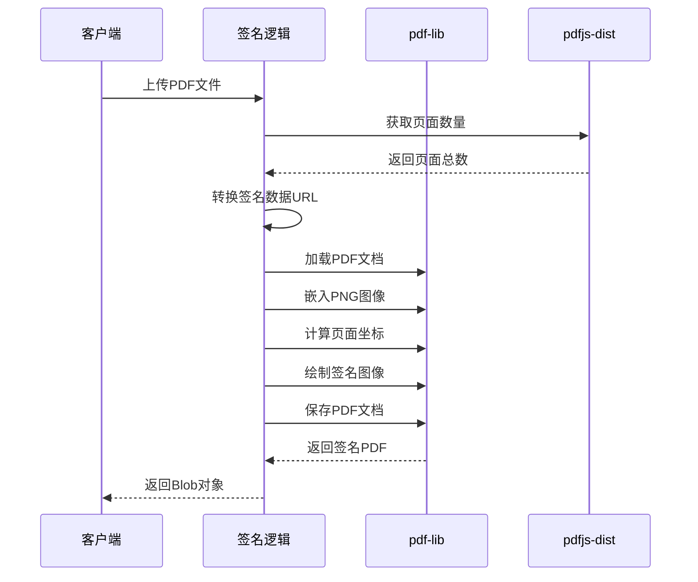
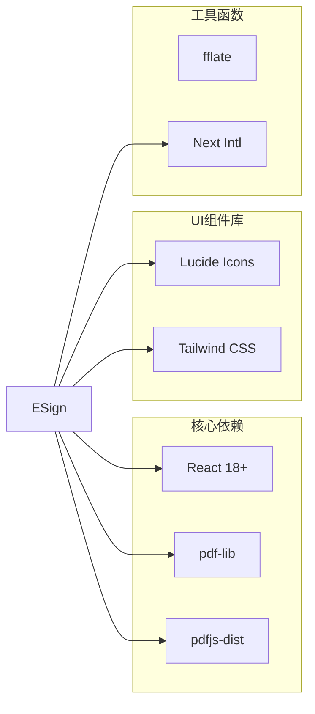
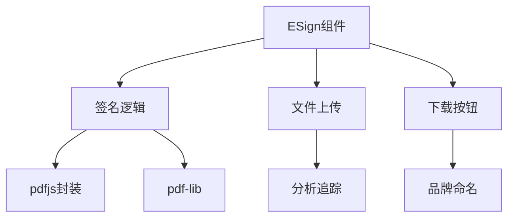
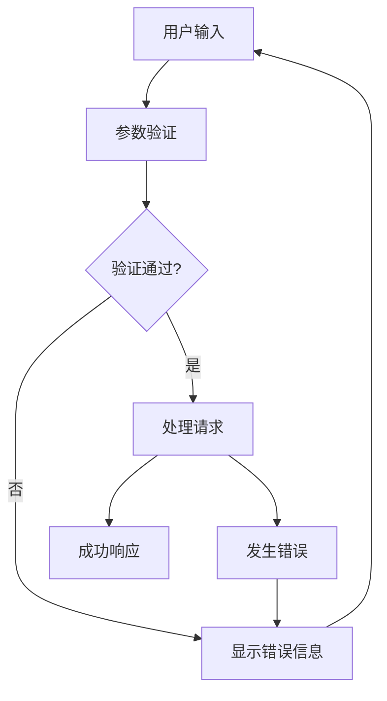

# 电子签名工具

<cite>
**本文引用的文件**
- [ESign.tsx](file://src/tools/pdf/esign/ESign.tsx)
- [logic.ts](file://src/tools/pdf/esign/logic.ts)
- [index.ts](file://src/tools/pdf/esign/index.ts)
- [pdfjs.ts](file://src/lib/pdfjs.ts)
- [types.ts](file://src/lib/registry/types.ts)
- [FileDropzone.tsx](file://src/components/shared/FileDropzone.tsx)
- [DownloadButton.tsx](file://src/components/shared/DownloadButton.tsx)
- [tools-pdf.json](file://messages/en/tools-pdf.json)
- [tools-pdf.json](file://messages/zh-Hans/tools-pdf.json)
- [tools-pdf.json](file://messages/ar/tools-pdf.json)
- [tools-pdf.json](file://messages/pl/tools-pdf.json)
- [logic.ts](file://src/tools/developer/hash-generator/logic.ts)
</cite>

## 目录
1. [简介](#简介)
2. [项目结构](#项目结构)
3. [核心组件](#核心组件)
4. [架构概览](#架构概览)
5. [详细组件分析](#详细组件分析)
6. [依赖关系分析](#依赖关系分析)
7. [性能考量](#性能考量)
8. [故障排除指南](#故障排除指南)
9. [结论](#结论)
10. [附录](#附录)

## 简介
本电子签名工具为PDF文档提供浏览器内签名能力，支持用户通过手写签名板生成个人签名，并将其嵌入到PDF文档的指定页面和位置。该工具采用纯前端技术栈，在客户端完成所有处理，确保数据隐私和离线使用能力。

## 项目结构
电子签名工具位于PDF工具集中的独立模块，采用模块化设计，包含界面组件、业务逻辑和配置定义三个主要层次。

**图表来源**
- [ESign.tsx:1-278](file://src/tools/pdf/esign/ESign.tsx#L1-L278)
- [logic.ts:1-56](file://src/tools/pdf/esign/logic.ts#L1-L56)
- [index.ts:1-37](file://src/tools/pdf/esign/index.ts#L1-L37)

**章节来源**
- [ESign.tsx:1-278](file://src/tools/pdf/esign/ESign.tsx#L1-L278)
- [logic.ts:1-56](file://src/tools/pdf/esign/logic.ts#L1-L56)
- [index.ts:1-37](file://src/tools/pdf/esign/index.ts#L1-L37)

## 核心组件
电子签名工具由以下核心组件构成：

### 签名界面组件 (ESign)
负责提供用户交互界面，包括签名板、参数设置和结果展示。

### 签名逻辑组件 (logic)
实现PDF签名的具体业务逻辑，包括签名图像嵌入和页面坐标转换。

### 工具配置组件 (index)
定义工具的基本信息、SEO配置和相关工具关联。

**章节来源**
- [ESign.tsx:10-278](file://src/tools/pdf/esign/ESign.tsx#L10-L278)
- [logic.ts:4-40](file://src/tools/pdf/esign/logic.ts#L4-L40)
- [index.ts:3-34](file://src/tools/pdf/esign/index.ts#L3-L34)

## 架构概览
系统采用分层架构设计，确保职责分离和代码可维护性。

**图表来源**
- [ESign.tsx:105-146](file://src/tools/pdf/esign/ESign.tsx#L105-L146)
- [logic.ts:4-40](file://src/tools/pdf/esign/logic.ts#L4-L40)
- [pdfjs.ts:3-13](file://src/lib/pdfjs.ts#L3-L13)

## 详细组件分析

### 签名界面组件 (ESign)
签名界面组件是用户交互的核心，提供了完整的签名工作流程。

#### 用户界面设计
界面采用响应式设计，支持桌面和移动设备操作：

**图表来源**
- [ESign.tsx:148-277](file://src/tools/pdf/esign/ESign.tsx#L148-L277)

#### 交互功能实现
- **签名绘制**：基于HTML5 Canvas API实现手写签名功能
- **参数调节**：支持页面选择、坐标调整和尺寸设置
- **实时预览**：修改参数时即时更新签名效果

**章节来源**
- [ESign.tsx:105-146](file://src/tools/pdf/esign/ESign.tsx#L105-L146)
- [ESign.tsx:165-186](file://src/tools/pdf/esign/ESign.tsx#L165-L186)
- [ESign.tsx:188-254](file://src/tools/pdf/esign/ESign.tsx#L188-L254)

### 签名逻辑组件 (logic)
签名逻辑组件实现了PDF签名的核心算法和技术细节。

#### PDF签名算法
签名过程采用以下步骤序列：

**图表来源**
- [logic.ts:4-40](file://src/tools/pdf/esign/logic.ts#L4-L40)
- [logic.ts:42-49](file://src/tools/pdf/esign/logic.ts#L42-L49)

#### 技术实现细节
- **坐标系统转换**：从用户友好的左上角原点转换为PDF标准的左下角原点
- **图像嵌入**：使用pdf-lib库将PNG格式签名图像嵌入PDF
- **边界检查**：验证页面索引的有效性

**章节来源**
- [logic.ts:4-40](file://src/tools/pdf/esign/logic.ts#L4-L40)
- [logic.ts:42-49](file://src/tools/pdf/esign/logic.ts#L42-L49)

### 工具配置组件 (index)
工具配置组件定义了电子签名工具的元数据和SEO信息。

#### 配置结构
工具配置包含以下关键信息：
- **工具标识**：唯一slug标识符
- **分类信息**：PDF工具类别
- **图标定义**：界面显示图标
- **SEO配置**：搜索引擎优化设置
- **FAQ关联**：多语言FAQ内容

**章节来源**
- [index.ts:3-34](file://src/tools/pdf/esign/index.ts#L3-L34)

## 依赖关系分析

### 外部依赖
系统依赖以下关键外部库：

**图表来源**
- [ESign.tsx:3-8](file://src/tools/pdf/esign/ESign.tsx#L3-L8)
- [pdfjs.ts:4](file://src/lib/pdfjs.ts#L4)

### 内部依赖关系
组件间的依赖关系清晰明确：

**图表来源**
- [ESign.tsx:5-8](file://src/tools/pdf/esign/ESign.tsx#L5-L8)
- [logic.ts:1-2](file://src/tools/pdf/esign/logic.ts#L1-L2)

**章节来源**
- [ESign.tsx:3-8](file://src/tools/pdf/esign/ESign.tsx#L3-L8)
- [logic.ts:1-2](file://src/tools/pdf/esign/logic.ts#L1-L2)

## 性能考量
电子签名工具在性能方面采用了多项优化措施：

### 浏览器端处理优势
- **零服务器依赖**：所有处理在客户端完成，避免网络延迟
- **内存优化**：使用Uint8Array进行二进制数据处理
- **异步处理**：采用Promise和async/await避免阻塞UI

### 性能优化策略
- **增量更新**：参数修改时仅更新必要的DOM元素
- **事件节流**：触摸和鼠标事件的防抖处理
- **资源复用**：Canvas上下文和PDF文档对象的缓存

## 故障排除指南

### 常见问题及解决方案
1. **签名无法显示**
   - 检查Canvas是否正确初始化
   - 确认签名数据URL格式正确
   
2. **页面坐标错误**
   - 验证页面索引范围（1到页面总数）
   - 检查坐标值是否超出页面边界
   
3. **文件过大处理失败**
   - 浏览器内存限制约为1-4GB
   - 建议使用压缩后的PDF文件

### 错误处理机制
系统实现了多层次的错误处理：

**图表来源**
- [ESign.tsx:140-145](file://src/tools/pdf/esign/ESign.tsx#L140-L145)

**章节来源**
- [ESign.tsx:140-145](file://src/tools/pdf/esign/ESign.tsx#L140-L145)
- [ESign.tsx:152-156](file://src/tools/pdf/esign/ESign.tsx#L152-L156)

## 结论
电子签名工具通过采用现代前端技术栈，成功实现了浏览器内PDF签名功能。该工具具有以下特点：

- **隐私保护**：所有处理在客户端完成，数据永不离开用户设备
- **跨平台兼容**：支持桌面和移动设备，提供一致的用户体验
- **功能完整**：提供手写签名、参数调节和结果下载等完整功能
- **性能优异**：采用异步处理和内存优化，确保流畅的用户体验

该工具为PDF文档签名提供了一个安全、便捷且符合隐私要求的解决方案。

## 附录

### 使用场景示例
1. **合同签署**：电子签署商业合同和协议
2. **表单填写**：在各类申请表格上添加个人签名
3. **文件认证**：为重要文档添加电子签名以证明真实性
4. **法律文档**：签署法律文件和法院文档

### 技术规格
- **支持的签名类型**：手写签名（PNG格式）
- **支持的文件格式**：PDF文档
- **浏览器要求**：现代浏览器（Chrome、Firefox、Safari、Edge）
- **离线能力**：完全离线工作模式

### 安全性保障
- **数据本地化**：所有处理在用户浏览器内完成
- **无服务器存储**：不收集或存储任何用户数据
- **加密传输**：使用HTTPS协议确保传输安全