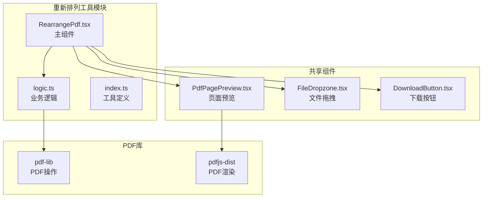
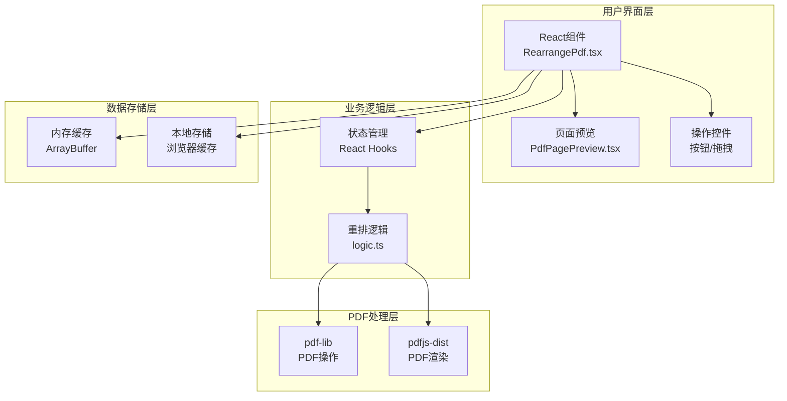
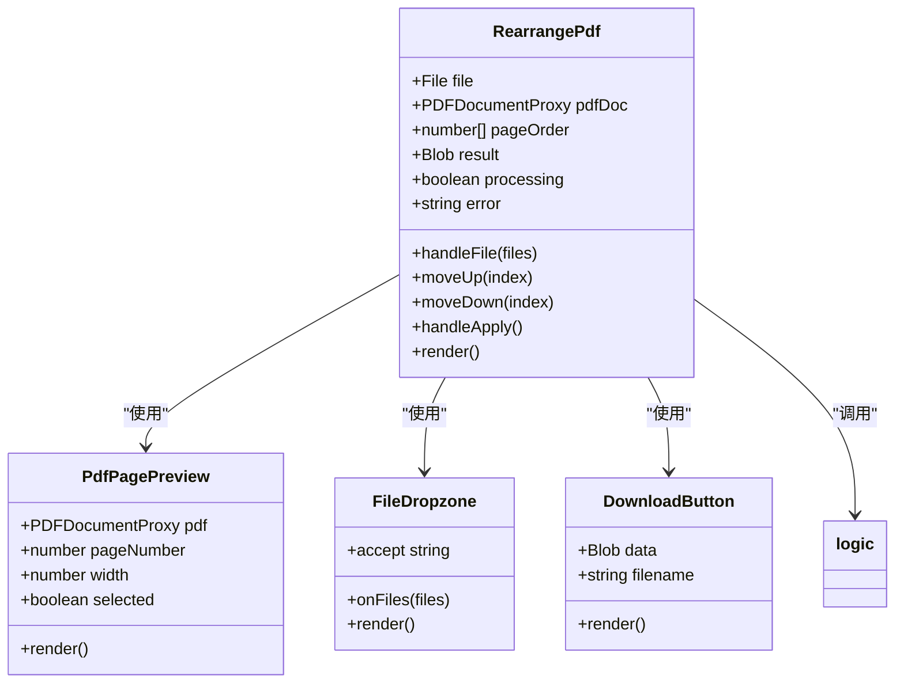
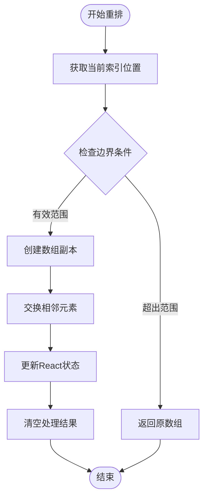
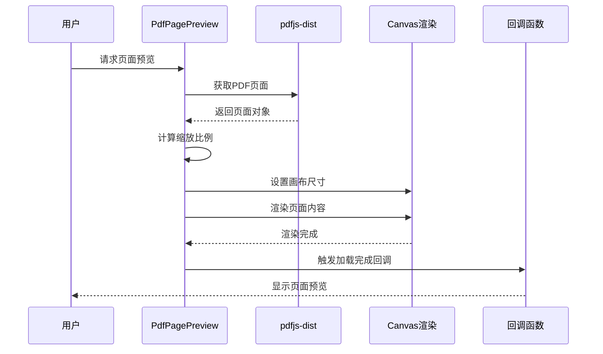
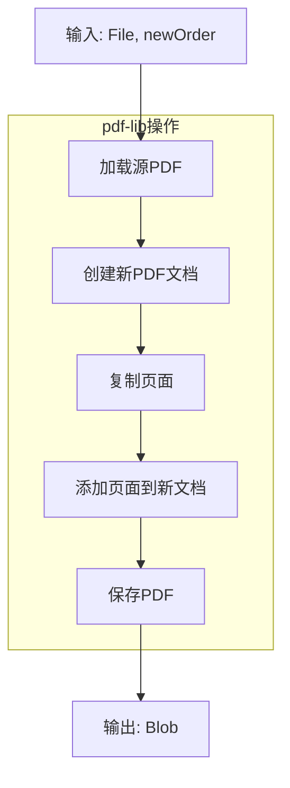
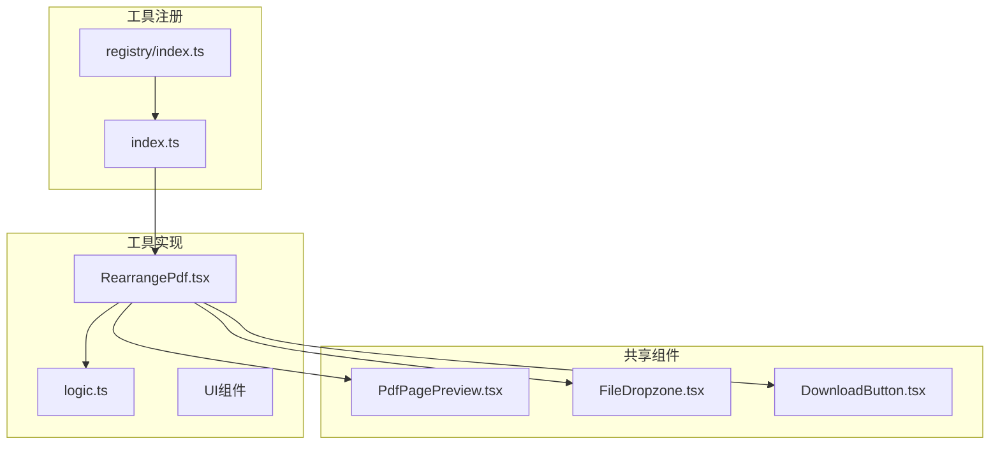
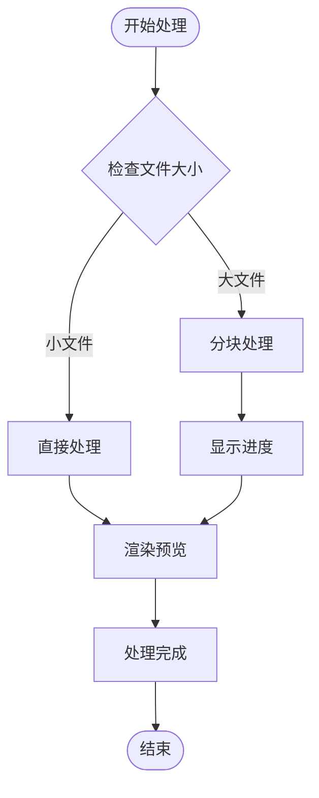
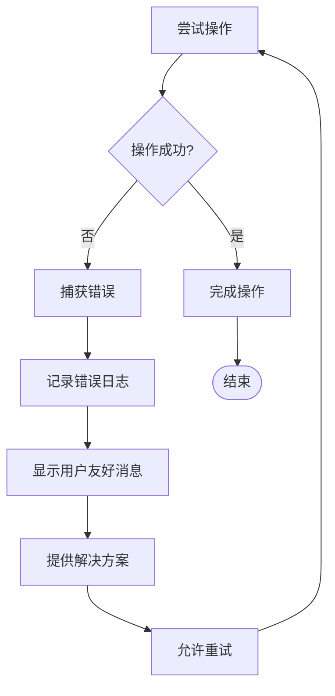

# 重新排列工具

<cite>
**本文档引用的文件**
- [RearrangePdf.tsx](file://src/tools/pdf/rearrange/RearrangePdf.tsx)
- [logic.ts](file://src/tools/pdf/rearrange/logic.ts)
- [index.ts](file://src/tools/pdf/rearrange/index.ts)
- [PdfPagePreview.tsx](file://src/components/shared/PdfPagePreview.tsx)
- [pdfjs.ts](file://src/lib/pdfjs.ts)
- [tools-pdf.json](file://messages/en/tools-pdf.json)
- [tools-pdf-zh.json](file://messages/zh-Hans/tools-pdf.json)
- [package.json](file://package.json)
- [registry/index.ts](file://src/lib/registry/index.ts)
</cite>

## 目录
1. [简介](#简介)
2. [项目结构](#项目结构)
3. [核心组件](#核心组件)
4. [架构概览](#架构概览)
5. [详细组件分析](#详细组件分析)
6. [依赖关系分析](#依赖关系分析)
7. [性能考量](#性能考量)
8. [故障排除指南](#故障排除指南)
9. [结论](#结论)
10. [附录](#附录)

## 简介
重新排列工具是一个基于浏览器的PDF页面重排工具，允许用户通过拖拽或按钮操作重新排列PDF文档中的页面顺序。该工具采用纯前端技术栈，所有处理都在用户的浏览器中完成，确保数据隐私和安全。

该工具的核心特性包括：
- 直观的页面拖拽界面
- 实时页面预览
- 批量操作支持
- 无服务器上传的数据处理
- 支持多种PDF操作模式

## 项目结构
重新排列工具位于PDF工具模块中，采用模块化设计，包含UI组件、业务逻辑和配置文件。



**图表来源**
- [RearrangePdf.tsx:1-156](file://src/tools/pdf/rearrange/RearrangePdf.tsx#L1-L156)
- [logic.ts:1-25](file://src/tools/pdf/rearrange/logic.ts#L1-L25)
- [index.ts:1-37](file://src/tools/pdf/rearrange/index.ts#L1-L37)

**章节来源**
- [RearrangePdf.tsx:1-156](file://src/tools/pdf/rearrange/RearrangePdf.tsx#L1-L156)
- [logic.ts:1-25](file://src/tools/pdf/rearrange/logic.ts#L1-L25)
- [index.ts:1-37](file://src/tools/pdf/rearrange/index.ts#L1-L37)

## 核心组件
重新排列工具由三个主要组件构成，每个组件负责不同的功能层面：

### 主界面组件 (RearrangePdf.tsx)
这是用户交互的主要界面，负责：
- 文件上传和处理
- 页面顺序管理
- 用户界面状态控制
- 结果下载功能

### 业务逻辑组件 (logic.ts)
封装了PDF重排的核心算法：
- 页面复制和重组
- 新PDF文档创建
- 数据格式化

### 工具定义组件 (index.ts)
定义了工具的元数据和SEO信息：
- 工具标识符
- 分类信息
- 国际化配置
- 相关工具关联

**章节来源**
- [RearrangePdf.tsx:14-156](file://src/tools/pdf/rearrange/RearrangePdf.tsx#L14-L156)
- [logic.ts:3-18](file://src/tools/pdf/rearrange/logic.ts#L3-L18)
- [index.ts:3-36](file://src/tools/pdf/rearrange/index.ts#L3-L36)

## 架构概览
重新排列工具采用分层架构设计，确保了良好的可维护性和扩展性。



**图表来源**
- [RearrangePdf.tsx:3-12](file://src/tools/pdf/rearrange/RearrangePdf.tsx#L3-L12)
- [logic.ts:1](file://src/tools/pdf/rearrange/logic.ts#L1)
- [PdfPagePreview.tsx:3-52](file://src/components/shared/PdfPagePreview.tsx#L3-L52)

该架构实现了以下关键特性：
- **纯前端处理**：所有PDF操作在浏览器中完成
- **模块化设计**：各层职责明确，易于维护
- **异步处理**：支持大文件的渐进式处理
- **状态隔离**：UI状态与业务逻辑分离

## 详细组件分析

### RearrangePdf 主组件分析
主组件是整个工具的核心，负责协调所有子组件和处理用户交互。



**图表来源**
- [RearrangePdf.tsx:14-156](file://src/tools/pdf/rearrange/RearrangePdf.tsx#L14-L156)
- [PdfPagePreview.tsx:16-79](file://src/components/shared/PdfPagePreview.tsx#L16-L79)

#### 页面拖拽排序实现
工具提供了两种页面排序方式：

1. **按钮驱动排序**：通过向上/向下按钮进行页面移动
2. **预览驱动排序**：通过页面预览组件进行拖拽操作

#### 索引重排算法
页面索引重排采用数组操作实现：



**图表来源**
- [RearrangePdf.tsx:45-63](file://src/tools/pdf/rearrange/RearrangePdf.tsx#L45-L63)

#### 批量操作支持
工具支持批量页面操作，包括：
- 多页面同时移动
- 批量重排
- 状态同步更新

**章节来源**
- [RearrangePdf.tsx:24-79](file://src/tools/pdf/rearrange/RearrangePdf.tsx#L24-L79)

### PdfPagePreview 组件分析
页面预览组件负责渲染PDF页面的缩略图，提供用户友好的视觉反馈。



**图表来源**
- [PdfPagePreview.tsx:27-52](file://src/components/shared/PdfPagePreview.tsx#L27-L52)

#### 渲染优化策略
页面预览组件采用了多项优化措施：
- **延迟渲染**：仅在需要时渲染页面
- **内存管理**：及时清理取消的渲染任务
- **缩放适配**：根据容器宽度动态计算缩放比例
- **占位符显示**：渲染期间显示加载指示器

**章节来源**
- [PdfPagePreview.tsx:16-79](file://src/components/shared/PdfPagePreview.tsx#L16-L79)

### 业务逻辑组件分析
业务逻辑组件封装了PDF重排的核心算法，确保数据处理的正确性和效率。



**图表来源**
- [logic.ts:3-18](file://src/tools/pdf/rearrange/logic.ts#L3-L18)

#### 页面对象移动机制
PDF页面重排的核心是页面对象的移动，而非内容重排：

1. **页面引用管理**：通过页面索引数组管理页面引用
2. **对象复制**：使用pdf-lib的copyPages方法复制页面对象
3. **顺序重组**：按照新的索引顺序添加页面
4. **内存优化**：避免重复加载相同页面内容

#### 交叉引用更新
工具在重排过程中自动处理PDF内部的交叉引用：
- **自动更新**：pdf-lib自动处理页面间的交叉引用
- **对象映射**：维护页面对象与新索引的映射关系
- **完整性保证**：确保重排后的PDF结构完整

**章节来源**
- [logic.ts:3-18](file://src/tools/pdf/rearrange/logic.ts#L3-L18)

## 依赖关系分析

### 外部依赖关系
重新排列工具依赖于以下关键库：

```mermaid
graph LR
subgraph "核心依赖"
A[pdf-lib<br/>^1.17.1]
B[pdfjs-dist<br/>^5.5.207]
C[react<br/>19.2.3]
D[lucide-react<br/>^0.577.0]
end
subgraph "工具链"
E[next<br/>16.2.1]
F[next-intl<br/>^4.8.3]
G[tailwindcss<br/>^4]
H[TypeScript<br/>^5]
end
subgraph "开发依赖"
I[eslint<br/>^9]
J[@types/*<br/>^20]
end
Rearrange --> A
Rearrange --> B
Rearrange --> C
Rearrange --> D
UI --> E
UI --> F
UI --> G
UI --> H
```

**图表来源**
- [package.json:11-31](file://package.json#L11-L31)

### 内部依赖关系
工具的内部模块间存在清晰的依赖层次：



**图表来源**
- [registry/index.ts:47](file://src/lib/registry/index.ts#L47)
- [index.ts:8](file://src/tools/pdf/rearrange/index.ts#L8)

**章节来源**
- [package.json:11-31](file://package.json#L11-L31)
- [registry/index.ts:47](file://src/lib/registry/index.ts#L47)

## 性能考量

### 大文档处理优化
重新排列工具针对大文档进行了专门优化：

#### 内存管理策略
- **渐进式加载**：仅在需要时加载页面内容
- **及时释放**：使用destroy方法释放PDF文档资源
- **状态清理**：重置处理状态以释放内存

#### 处理流程优化


#### 性能监控指标
- **处理时间**：记录重排操作的执行时间
- **内存使用**：监控内存占用情况
- **渲染性能**：跟踪页面预览的渲染速度

### 用户体验优化
工具在用户体验方面采用了多项优化措施：

#### 加载状态管理
- **实时进度**：显示处理进度百分比
- **状态提示**：提供清晰的操作反馈
- **错误处理**：友好的错误信息展示

#### 响应式设计
- **自适应布局**：支持不同屏幕尺寸
- **触摸优化**：移动端友好的交互设计
- **键盘导航**：支持键盘快捷键操作

## 故障排除指南

### 常见问题及解决方案

#### PDF加载失败
**症状**：上传PDF后无法显示页面预览
**原因分析**：
- PDF格式不支持
- 文件损坏
- 浏览器兼容性问题

**解决步骤**：
1. 验证PDF文件完整性
2. 尝试使用其他PDF查看器打开
3. 更新浏览器版本
4. 清除浏览器缓存

#### 内存不足错误
**症状**：处理大文件时出现内存溢出
**解决方案**：
- 关闭其他标签页释放内存
- 分批处理大文件
- 使用64位浏览器版本
- 增加系统虚拟内存

#### 页面预览空白
**症状**：页面预览显示为空白
**排查步骤**：
1. 检查网络连接
2. 验证pdfjs-dist库加载
3. 查看浏览器控制台错误
4. 尝试禁用浏览器扩展

### 错误处理机制
工具实现了完善的错误处理机制：



**图表来源**
- [RearrangePdf.tsx:40-76](file://src/tools/pdf/rearrange/RearrangePdf.tsx#L40-L76)

**章节来源**
- [RearrangePdf.tsx:40-76](file://src/tools/pdf/rearrange/RearrangePdf.tsx#L40-L76)

## 结论
重新排列工具是一个功能完善、性能优秀的PDF页面重排解决方案。通过采用纯前端技术栈和优化的算法设计，该工具实现了以下目标：

### 技术优势
- **隐私保护**：所有处理在浏览器中完成，无数据上传
- **性能优化**：针对大文档进行了专门优化
- **用户体验**：直观的界面设计和流畅的操作体验
- **可扩展性**：模块化架构便于功能扩展

### 功能特色
- 支持多种页面重排模式
- 提供丰富的用户交互选项
- 自动处理PDF内部引用关系
- 保持原始PDF的质量和格式

### 应用价值
该工具适用于各种PDF页面重排场景，包括文档整理、报告组织、演示文稿制作等，为用户提供了便捷高效的PDF处理解决方案。

## 附录

### 实际应用场景示例

#### 会议材料整理
- **场景描述**：整理会议录音转文字后的文档
- **操作流程**：按议题顺序重新排列页面
- **预期效果**：形成完整的会议记录文档

#### 章节重新组织
- **场景描述**：重新组织学习资料的章节顺序
- **操作流程**：将相关章节移动到合适位置
- **预期效果**：创建符合学习逻辑的文档结构

#### 自定义顺序创建
- **场景描述**：为特定用途创建自定义页面顺序
- **操作流程**：根据需求调整页面排列
- **预期效果**：生成专用的PDF文档版本

### 与pdf.js页面渲染的集成
工具通过pdfjs-dist库实现PDF页面的高效渲染：

#### 渲染流程
1. **Worker初始化**：配置pdfjs-dist的worker环境
2. **页面获取**：通过PDFDocumentProxy获取页面对象
3. **视口计算**：根据目标宽度计算渲染视口
4. **Canvas渲染**：使用Canvas API进行页面渲染
5. **结果输出**：返回渲染完成的页面图像

#### 性能优化
- **Worker复用**：避免重复初始化pdfjs-worker
- **缓存机制**：缓存已渲染的页面图像
- **异步处理**：使用Promise处理异步渲染操作

### 重排操作的潜在影响
重新排列操作对PDF文档的影响评估：

#### 正面影响
- **结构优化**：改善文档的逻辑结构
- **可读性提升**：提高文档的阅读体验
- **组织性增强**：便于文档管理和检索

#### 注意事项
- **链接完整性**：重排后外部链接可能失效
- **书签重定向**：书签目标页面可能发生变化
- **注释位置**：注释坐标可能需要重新调整

### 最佳实践建议
1. **备份原始文件**：在进行重要重排前备份原文件
2. **分步验证**：逐步验证重排结果的正确性
3. **测试链接**：检查重排后文档中的链接有效性
4. **文档说明**：记录重排的原因和目的