# 工具分类

<cite>
**本文档引用的文件**
- [README.md](file://README.md)
- [src/lib/registry/index.ts](file://src/lib/registry/index.ts)
- [messages/en/tools-image.json](file://messages/en/tools-image.json)
- [messages/en/tools-video.json](file://messages/en/tools-video.json)
- [messages/en/tools-pdf.json](file://messages/en/tools-pdf.json)
- [src/tools/audio/convert/AudioConvert.tsx](file://src/tools/audio/convert/AudioConvert.tsx)
- [src/tools/image/compress/ImageCompress.tsx](file://src/tools/image/compress/ImageCompress.tsx)
- [src/tools/pdf/compress/CompressPdf.tsx](file://src/tools/pdf/compress/CompressPdf.tsx)
- [src/tools/video/compress/VideoCompress.tsx](file://src/tools/video/compress/VideoCompress.tsx)
</cite>

## 目录
1. [简介](#简介)
2. [项目结构](#项目结构)
3. [核心组件](#核心组件)
4. [架构概览](#架构概览)
5. [详细组件分析](#详细组件分析)
6. [依赖分析](#依赖分析)
7. [性能考虑](#性能考虑)
8. [故障排除指南](#故障排除指南)
9. [结论](#结论)

## 简介

PrivaDeck 是一个基于浏览器的多媒体工具箱，所有文件处理都在本地完成，实现零上传、零服务器的隐私保护设计。该项目提供了60个工具，覆盖图片、视频、音频、PDF、开发者五大分类，支持21种语言，并采用Next.js 16框架和FFmpeg.wasm技术栈。

## 项目结构

项目采用模块化的目录结构，按照功能分类组织工具代码：

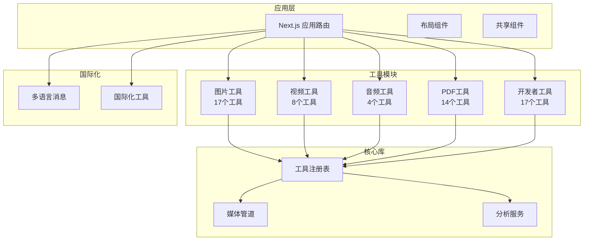

**图表来源**
- [README.md:55-78](file://README.md#L55-L78)
- [src/lib/registry/index.ts:66-133](file://src/lib/registry/index.ts#L66-L133)

**章节来源**
- [README.md:55-78](file://README.md#L55-L78)
- [src/lib/registry/index.ts:1-164](file://src/lib/registry/index.ts#L1-164)

## 核心组件

### 工具注册表系统

工具注册表是整个系统的核心，负责管理所有工具的元数据和分类信息：

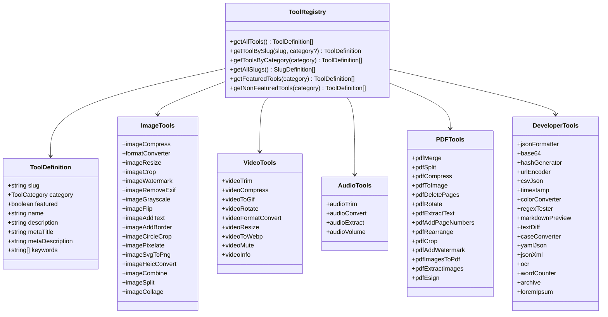

**图表来源**
- [src/lib/registry/index.ts:66-133](file://src/lib/registry/index.ts#L66-L133)

### 工具分类统计

根据项目文档，各分类的工具数量分布如下：

| 分类 | 工具数量 | 占比 | 示例功能 |
|------|----------|------|----------|
| 图片 | 17 | 28.3% | 格式转换、压缩、裁剪、去EXIF、拼图、加水印 |
| 开发者 | 17 | 28.3% | JSON格式化、Base64、正则测试、OCR、哈希生成 |
| PDF | 14 | 23.3% | 合并、拆分、压缩、转图片、提取文本、电子签名 |
| 视频 | 8 | 13.3% | 剪辑、压缩、转GIF、格式转换、静音 |
| 音频 | 4 | 6.7% | 剪辑、格式转换、提取音频、音量调整 |

**章节来源**
- [README.md:16-24](file://README.md#L16-L24)
- [src/lib/registry/index.ts:66-133](file://src/lib/registry/index.ts#L66-L133)

## 架构概览

系统采用分层架构设计，确保功能模块的独立性和可维护性：

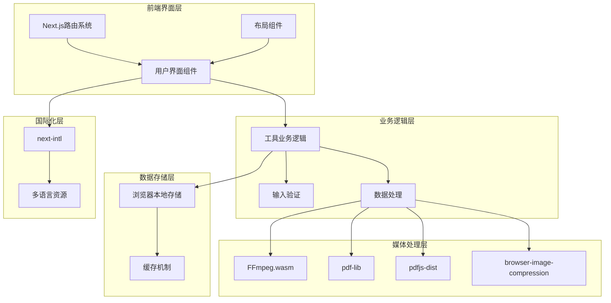

**图表来源**
- [README.md:26-33](file://README.md#L26-L33)
- [src/lib/registry/index.ts:1-164](file://src/lib/registry/index.ts#L1-L164)

## 详细组件分析

### 图片工具分类

图片工具是项目中最大的工具类别，包含17个不同的功能模块：

#### 图像压缩工具
图像压缩工具提供智能压缩算法，支持多种输出格式和质量控制：

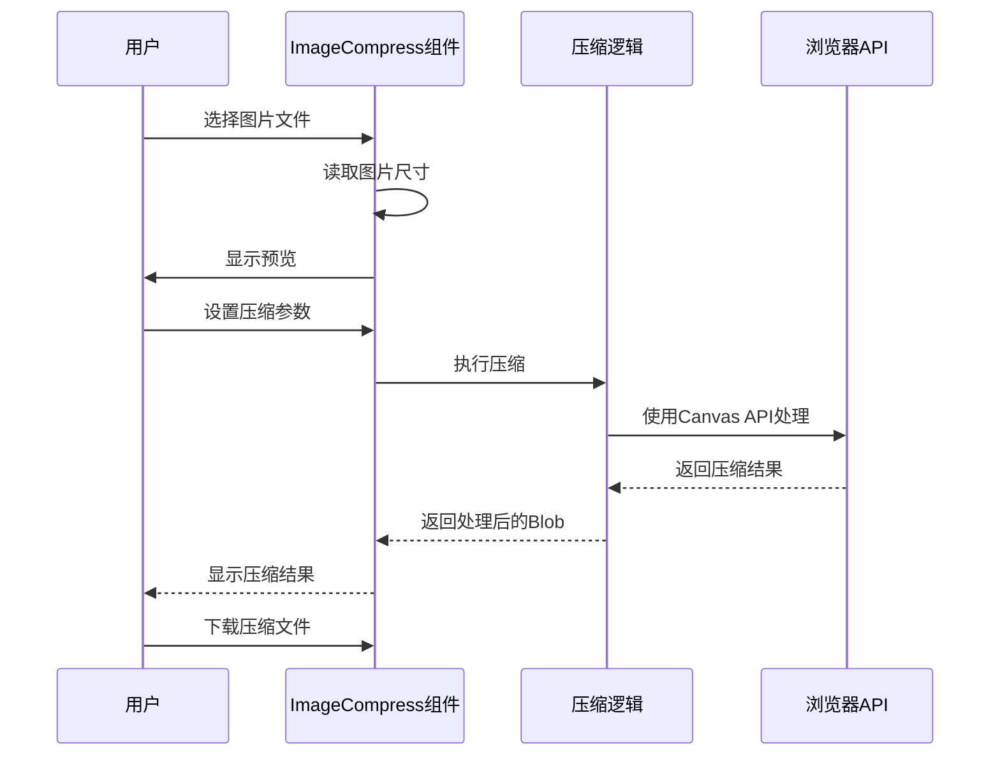

**图表来源**
- [src/tools/image/compress/ImageCompress.tsx:138-178](file://src/tools/image/compress/ImageCompress.tsx#L138-L178)

#### 图像格式转换工具
格式转换工具支持WebP、PNG、JPG、AVIF、ICO等多种格式之间的转换：

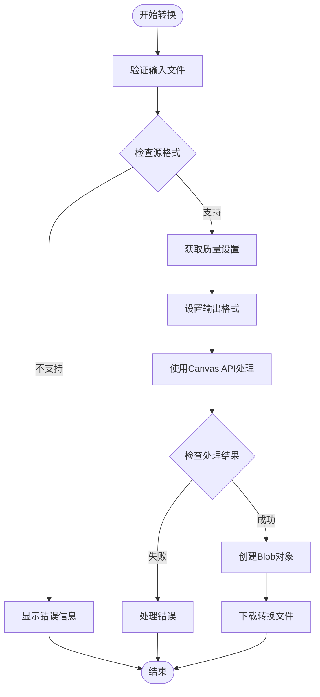

**图表来源**
- [src/tools/image/compress/ImageCompress.tsx:138-178](file://src/tools/image/compress/ImageCompress.tsx#L138-L178)

**章节来源**
- [src/tools/image/compress/ImageCompress.tsx:1-373](file://src/tools/image/compress/ImageCompress.tsx#L1-L373)

### 视频工具分类

视频工具提供完整的视频处理功能，涵盖编辑、转换、优化等多个方面：

#### 视频压缩工具
视频压缩工具支持H.264和H.265编码，提供简单和高级两种操作模式：

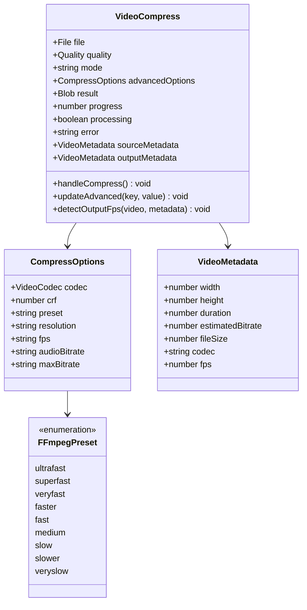

**图表来源**
- [src/tools/video/compress/VideoCompress.tsx:45-134](file://src/tools/video/compress/VideoCompress.tsx#L45-L134)

#### 视频处理流程
视频处理采用FFmpeg.wasm进行本地编码处理：

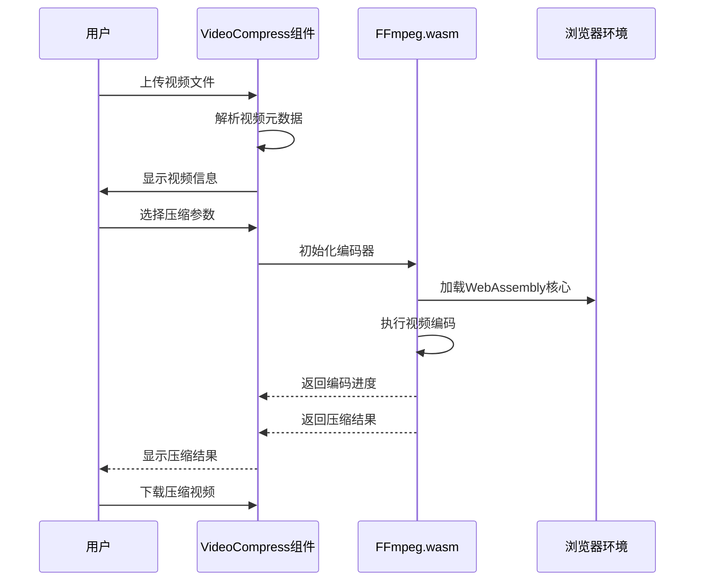

**图表来源**
- [src/tools/video/compress/VideoCompress.tsx:101-134](file://src/tools/video/compress/VideoCompress.tsx#L101-L134)

**章节来源**
- [src/tools/video/compress/VideoCompress.tsx:1-624](file://src/tools/video/compress/VideoCompress.tsx#L1-L624)

### PDF工具分类

PDF工具提供全面的PDF文档处理功能，支持编辑、转换、优化等操作：

#### PDF压缩工具
PDF压缩工具通过重新渲染页面来减小文件大小：

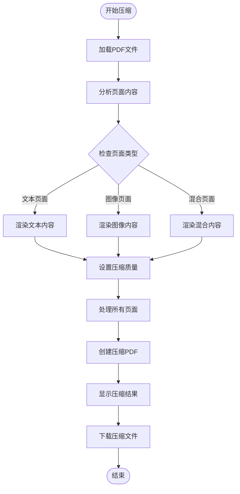

**图表来源**
- [src/tools/pdf/compress/CompressPdf.tsx:28-45](file://src/tools/pdf/compress/CompressPdf.tsx#L28-L45)

#### PDF处理技术栈
PDF工具采用专业的JavaScript库进行处理：

| 功能 | 技术实现 | 用途 |
|------|----------|------|
| PDF解析 | pdf-lib | PDF文档操作和修改 |
| 文本提取 | pdfjs-dist | 从PDF中提取文本内容 |
| 图像提取 | pdfjs-dist | 从PDF中提取嵌入图像 |
| 文档合并 | pdf-lib | 合并多个PDF文件 |
| 页面操作 | pdf-lib | 删除、旋转、重排PDF页面 |

**章节来源**
- [src/tools/pdf/compress/CompressPdf.tsx:1-131](file://src/tools/pdf/compress/CompressPdf.tsx#L1-L131)

### 音频工具分类

音频工具提供基础的音频处理功能，目前包含4个主要工具：

#### 音频格式转换工具
音频转换工具支持MP3、WAV、OGG、AAC、FLAC等多种格式转换：

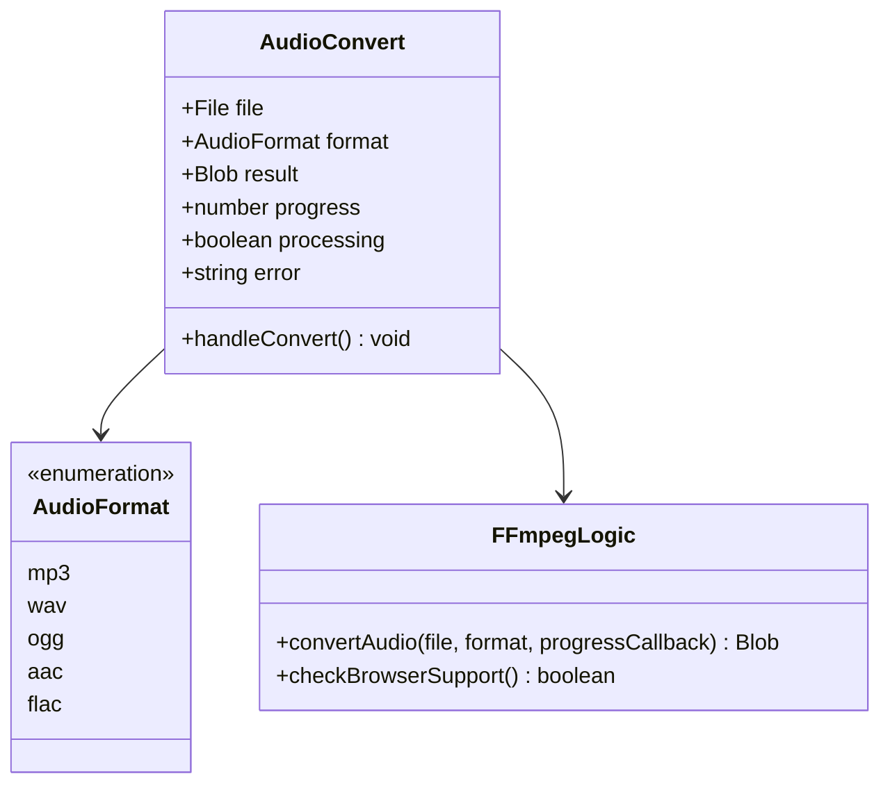

**图表来源**
- [src/tools/audio/convert/AudioConvert.tsx:15-48](file://src/tools/audio/convert/AudioConvert.tsx#L15-L48)

**章节来源**
- [src/tools/audio/convert/AudioConvert.tsx:1-86](file://src/tools/audio/convert/AudioConvert.tsx#L1-L86)

### 开发者工具分类

开发者工具提供各种编程和文档处理相关的实用功能：

#### 工具分类统计
开发者工具包含17个不同类型的工具，涵盖以下功能领域：

| 功能类别 | 工具数量 | 主要工具示例 |
|----------|----------|--------------|
| 编码转换 | 4 | Base64、URL编码、十六进制、时间戳 |
| 数据格式化 | 4 | JSON格式化、CSV转JSON、YAML转JSON、XML格式化 |
| 文本处理 | 5 | 正则表达式测试、文本差异比较、单词计数、Markdown预览、Lorem Ipsum |
| 开发辅助 | 4 | OCR文字识别、颜色格式转换、哈希生成、代码高亮 |

**章节来源**
- [src/lib/registry/index.ts:115-133](file://src/lib/registry/index.ts#L115-L133)

## 依赖分析

### 核心依赖关系

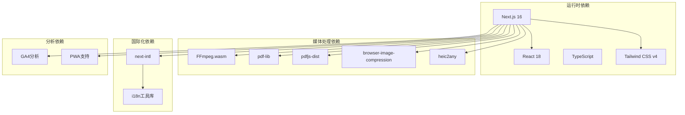

**图表来源**
- [README.md:26-33](file://README.md#L26-L33)

### 工具间依赖关系

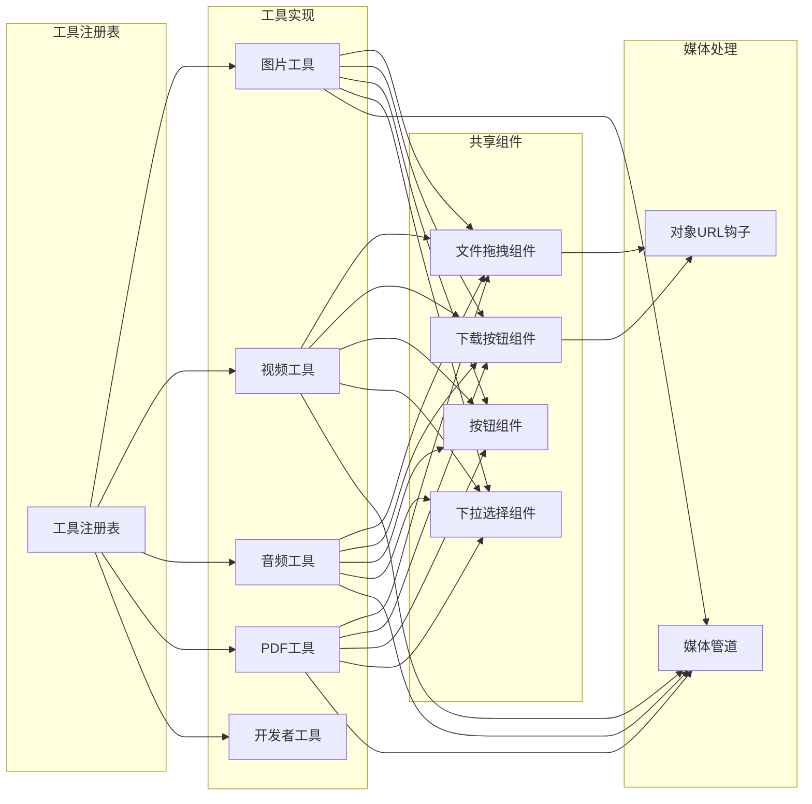

**图表来源**
- [src/lib/registry/index.ts:1-164](file://src/lib/registry/index.ts#L1-L164)

**章节来源**
- [src/lib/registry/index.ts:1-164](file://src/lib/registry/index.ts#L1-L164)

## 性能考虑

### 浏览器兼容性优化

系统针对不同浏览器的功能支持进行了优化：

| 功能特性 | 支持检测 | 降级方案 | 性能影响 |
|----------|----------|----------|----------|
| SharedArrayBuffer | isSharedArrayBufferSupported | 提示用户升级浏览器 | 无 |
| WebCodecs API | isWebCodecsSupported | 使用FFmpeg.wasm替代 | 中等 |
| Canvas API | 标准支持 | 无 | 无 |
| WebAssembly | 现代浏览器 | 不支持时禁用相关功能 | 无 |
| Service Worker | 支持 | PWA安装 | 无 |

### 内存管理策略

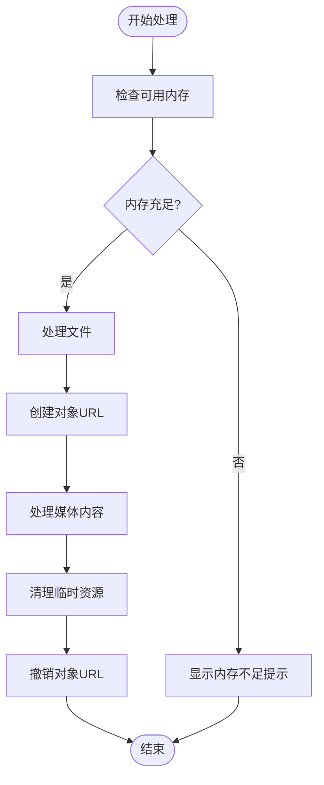

### 并行处理优化

系统采用异步处理和进度反馈机制：

- **批量处理**: 支持同时处理多个文件，提供实时进度显示
- **分块传输**: 大文件采用分块处理，避免内存溢出
- **进度回调**: 实时更新处理进度，提升用户体验
- **错误恢复**: 单个文件处理失败不影响其他文件

## 故障排除指南

### 常见问题诊断

#### 浏览器兼容性问题
- **症状**: 工具无法使用或功能受限
- **原因**: 浏览器不支持必要的API
- **解决方案**: 
  1. 检查浏览器版本和功能支持
  2. 更新到最新版本的现代浏览器
  3. 确保使用HTTPS协议
  4. 启用必要的浏览器功能

#### 性能问题
- **症状**: 处理速度慢或内存占用过高
- **原因**: 文件过大或设备性能不足
- **解决方案**:
  1. 减小文件尺寸或数量
  2. 关闭其他占用资源的程序
  3. 使用更高性能的设备
  4. 分批处理大文件

#### 存储空间问题
- **症状**: 无法保存或下载文件
- **原因**: 浏览器存储空间不足
- **解决方案**:
  1. 清理浏览器缓存和存储
  2. 检查设备存储空间
  3. 尝试使用其他浏览器
  4. 减小输出文件质量

**章节来源**
- [src/tools/audio/convert/AudioConvert.tsx:26-32](file://src/tools/audio/convert/AudioConvert.tsx#L26-L32)
- [src/tools/video/compress/VideoCompress.tsx:93-99](file://src/tools/video/compress/VideoCompress.tsx#L93-L99)

## 结论

PrivaDeck项目展现了现代浏览器端多媒体处理的最佳实践。通过精心设计的工具分类体系、完善的国际化支持和强大的技术架构，该项目成功实现了隐私保护与功能完整性的平衡。

### 主要优势

1. **隐私保护**: 所有处理都在本地完成，用户数据完全可控
2. **功能丰富**: 60个工具覆盖多媒体处理的各个方面
3. **性能优异**: 采用WebAssembly和Canvas API优化处理效率
4. **用户体验**: 直观的界面设计和实时进度反馈
5. **技术先进**: 使用最新的Web技术和标准

### 技术特色

- **模块化架构**: 清晰的工具分类和职责分离
- **异步处理**: 非阻塞的用户界面和后台处理
- **错误处理**: 完善的异常捕获和用户提示机制
- **国际化支持**: 21种语言的完整本地化
- **PWA支持**: 离线可用和应用安装能力

该项目为浏览器端多媒体处理提供了一个优秀的参考实现，展示了如何在保持隐私安全的同时提供丰富的功能和服务。