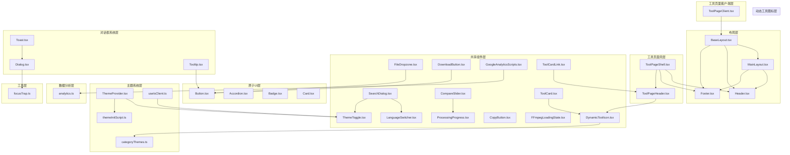
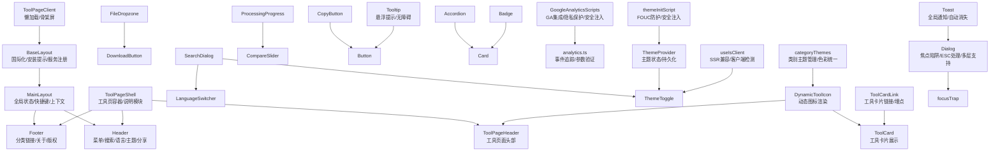
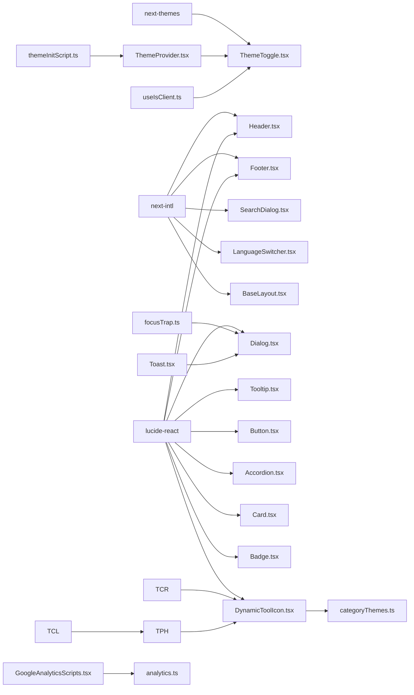

# UI组件系统

<cite>
**本文档引用的文件**
- [src/components/layout/Header.tsx](file://src/components/layout/Header.tsx)
- [src/components/layout/MainLayout.tsx](file://src/components/layout/MainLayout.tsx)
- [src/components/layout/Footer.tsx](file://src/components/layout/Footer.tsx)
- [src/components/layout/BaseLayout.tsx](file://src/components/layout/BaseLayout.tsx)
- [src/components/shared/FileDropzone.tsx](file://src/components/shared/FileDropzone.tsx)
- [src/components/shared/DownloadButton.tsx](file://src/components/shared/DownloadButton.tsx)
- [src/components/shared/ThemeToggle.tsx](file://src/components/shared/ThemeToggle.tsx)
- [src/components/shared/LanguageSwitcher.tsx](file://src/components/shared/LanguageSwitcher.tsx)
- [src/components/shared/ProcessingProgress.tsx](file://src/components/shared/ProcessingProgress.tsx)
- [src/components/shared/FFmpegLoadingState.tsx](file://src/components/shared/FFmpegLoadingState.tsx)
- [src/components/shared/SearchDialog.tsx](file://src/components/shared/SearchDialog.tsx)
- [src/components/shared/CompareSlider.tsx](file://src/components/shared/CompareSlider.tsx)
- [src/components/shared/CopyButton.tsx](file://src/components/shared/CopyButton.tsx)
- [src/components/shared/GoogleAnalyticsScripts.tsx](file://src/components/shared/GoogleAnalyticsScripts.tsx)
- [src/components/shared/DynamicToolIcon.tsx](file://src/components/shared/DynamicToolIcon.tsx)
- [src/components/shared/ToolCard.tsx](file://src/components/shared/ToolCard.tsx)
- [src/components/tool/ToolPageHeader.tsx](file://src/components/tool/ToolPageHeader.tsx)
- [src/components/tool/ToolCardLink.tsx](file://src/components/tool/ToolCardLink.tsx)
- [src/components/ui/Button.tsx](file://src/components/ui/Button.tsx)
- [src/components/ui/Accordion.tsx](file://src/components/ui/Accordion.tsx)
- [src/components/ui/Badge.tsx](file://src/components/ui/Badge.tsx)
- [src/components/ui/Card.tsx](file://src/components/ui/Card.tsx)
- [src/components/ui/Dialog.tsx](file://src/components/ui/Dialog.tsx)
- [src/components/ui/Toast.tsx](file://src/components/ui/Toast.tsx)
- [src/components/ui/Tooltip.tsx](file://src/components/ui/Tooltip.tsx)
- [src/lib/utils/focusTrap.ts](file://src/lib/utils/focusTrap.ts)
- [src/lib/theme/ThemeProvider.tsx](file://src/lib/theme/ThemeProvider.tsx)
- [src/lib/theme/theme-init-script.ts](file://src/lib/theme/theme-init-script.ts)
- [src/lib/theme/categoryThemes.ts](file://src/lib/theme/categoryThemes.ts)
- [src/lib/hooks/useIsClient.ts](file://src/lib/hooks/useIsClient.ts)
- [src/lib/analytics.ts](file://src/lib/analytics.ts)
- [src/app/(home)/layout.tsx](file://src/app/(home)/layout.tsx)
- [src/app/[locale]/layout.tsx](file://src/app/[locale]/layout.tsx)
- [src/app/layout.tsx](file://src/app/layout.tsx)
- [src/app/[locale]/tools/[category]/[slug]/ToolPageClient.tsx](file://src/app/[locale]/tools/[category]/[slug]/ToolPageClient.tsx)
- [src/app/globals.css](file://src/app/globals.css)
- [src/lib/registry/types.ts](file://src/lib/registry/types.ts)
- [package.json](file://package.json)
</cite>

## 更新摘要
**所做更改**
- 新增动态工具图标组件(DynamicToolIcon)，支持基于名称的图标动态渲染
- 新增工具卡片组件(ToolCard)，提供统一的工具展示界面
- 新增工具页面头部组件(ToolPageHeader)，优化工具页面标题展示
- 新增工具卡片链接组件(ToolCardLink)，统一工具卡片的导航和埋点
- 新增类别主题系统(categoryThemes)，提供统一的色彩主题管理
- 更新工具定义(types)，支持图标名称的标准化
- 增强组件一致性与可维护性，提升工具页面的视觉统一性

## 目录
1. [简介](#简介)
2. [项目结构](#项目结构)
3. [核心组件](#核心组件)
4. [架构总览](#架构总览)
5. [详细组件分析](#详细组件分析)
6. [新增动态工具图标组件](#新增动态工具图标组件)
7. [新增工具卡片组件](#新增工具卡片组件)
8. [新增工具页面头部组件](#新增工具页面头部组件)
9. [新增工具卡片链接组件](#新增工具卡片链接组件)
10. [新增类别主题系统](#新增类别主题系统)
11. [工具定义与类型系统](#工具定义与类型系统)
12. [组件一致性与可维护性提升](#组件一致性与可维护性提升)
13. [依赖关系分析](#依赖关系分析)
14. [性能考量](#性能考量)
15. [故障排查指南](#故障排查指南)
16. [结论](#结论)
17. [附录](#附录)

## 简介
本文件系统化梳理媒体工具箱的UI组件体系，覆盖布局组件（Header、Sidebar、Footer）、共享组件（文件上传、下载、进度、搜索、切换语言与主题等）、基础UI原子（Button、Card、Badge、Accordion）以及新增的动态工具图标、工具卡片和工具页面头部等组件。**最新更新**引入了完整的动态工具图标系统、统一的工具卡片展示组件和类别主题管理，显著提升了组件的一致性与可维护性。文档从架构设计、层次职责、数据与事件流、样式系统（Tailwind CSS与主题）、可访问性与响应式布局、使用示例与最佳实践、测试策略与维护方法等方面进行深入解析，帮助UI开发者与工具开发者高效理解与扩展组件库。

## 项目结构
组件按功能域分层组织：
- 布局层：负责全局导航与页脚信息呈现
- 工具页面壳层：封装工具页面的通用结构与文案
- 共享组件层：跨页面复用的功能型组件
- 原子UI层：最小可复用UI元素
- **新增** 动态工具图标层：提供动态图标渲染与主题管理
- **新增** 工具卡片层：统一工具展示界面与导航
- **新增** 主题系统层：提供主题提供者、客户端检测和主题初始化
- **新增** 数据分析层：集成Google Analytics和埋点追踪
- **新增** 工具页面客户端层：优化工具页面的懒加载和性能



**图表来源**
- [src/components/layout/MainLayout.tsx:16-56](file://src/components/layout/MainLayout.tsx#L16-L56)
- [src/components/layout/Header.tsx:21-116](file://src/components/layout/Header.tsx#L21-L116)
- [src/components/layout/Footer.tsx:44-114](file://src/components/layout/Footer.tsx#L44-L114)
- [src/components/layout/BaseLayout.tsx:17-26](file://src/components/layout/BaseLayout.tsx#L17-L26)
- [src/components/shared/GoogleAnalyticsScripts.tsx:1-21](file://src/components/shared/GoogleAnalyticsScripts.tsx#L1-L21)
- [src/lib/theme/ThemeProvider.tsx:45-97](file://src/lib/theme/ThemeProvider.tsx#L45-L97)
- [src/lib/theme/theme-init-script.ts:1-7](file://src/lib/theme/theme-init-script.ts#L1-L7)
- [src/lib/theme/categoryThemes.ts:1-94](file://src/lib/theme/categoryThemes.ts#L1-L94)
- [src/lib/hooks/useIsClient.ts:1-9](file://src/lib/hooks/useIsClient.ts#L1-L9)
- [src/lib/analytics.ts:106-137](file://src/lib/analytics.ts#L106-L137)
- [src/app/[locale]/tools/[category]/[slug]/ToolPageClient.tsx:39-62](file://src/app/[locale]/tools/[category]/[slug]/ToolPageClient.tsx#L39-L62)
- [src/components/ui/Dialog.tsx:1-176](file://src/components/ui/Dialog.tsx#L1-L176)
- [src/components/ui/Toast.tsx:1-111](file://src/components/ui/Toast.tsx#L1-L111)
- [src/components/ui/Tooltip.tsx:1-64](file://src/components/ui/Tooltip.tsx#L1-L64)
- [src/lib/utils/focusTrap.ts:1-78](file://src/lib/utils/focusTrap.ts#L1-L78)

**章节来源**
- [src/components/layout/MainLayout.tsx:16-56](file://src/components/layout/MainLayout.tsx#L16-L56)
- [src/components/layout/Header.tsx:21-116](file://src/components/layout/Header.tsx#L21-L116)
- [src/components/layout/Footer.tsx:44-114](file://src/components/layout/Footer.tsx#L44-L114)
- [src/components/layout/BaseLayout.tsx:17-26](file://src/components/layout/BaseLayout.tsx#L17-L26)
- [src/components/shared/GoogleAnalyticsScripts.tsx:1-21](file://src/components/shared/GoogleAnalyticsScripts.tsx#L1-L21)
- [src/lib/theme/ThemeProvider.tsx:45-97](file://src/lib/theme/ThemeProvider.tsx#L45-L97)
- [src/lib/theme/theme-init-script.ts:1-7](file://src/lib/theme/theme-init-script.ts#L1-L7)
- [src/lib/theme/categoryThemes.ts:1-94](file://src/lib/theme/categoryThemes.ts#L1-L94)
- [src/lib/hooks/useIsClient.ts:1-9](file://src/lib/hooks/useIsClient.ts#L1-L9)
- [src/lib/analytics.ts:106-137](file://src/lib/analytics.ts#L106-L137)
- [src/app/[locale]/tools/[category]/[slug]/ToolPageClient.tsx:39-62](file://src/app/[locale]/tools/[category]/[slug]/ToolPageClient.tsx#L39-L62)
- [src/components/ui/Dialog.tsx:1-176](file://src/components/ui/Dialog.tsx#L1-L176)
- [src/components/ui/Toast.tsx:1-111](file://src/components/ui/Toast.tsx#L1-L111)
- [src/components/ui/Tooltip.tsx:1-64](file://src/components/ui/Tooltip.tsx#L1-L64)
- [src/lib/utils/focusTrap.ts:1-78](file://src/lib/utils/focusTrap.ts#L1-L78)

## 核心组件
- 布局组件
  - Header：移动端菜单按钮、站点Logo、桌面分类下拉导航、全局搜索触发、语言切换、主题切换、分享按钮
  - Footer：品牌信息、分类链接网格、关于与隐私链接、版权信息
  - MainLayout：全局状态（移动端导航、搜索对话框开关）、快捷键监听、工具导航上下文提供者
  - BaseLayout：国际化提供者、安装提示、服务工作者注册
- 工具页面壳组件
  - ToolPageShell：工具标题、描述、本地处理指示、容器卡片、工具说明与特性模块
  - **新增** ToolPageHeader：工具页面头部展示，包含图标、标题和描述
  - **新增** ToolPageClient：工具页面客户端组件，支持懒加载和骨架屏
- 共享组件
  - FileDropzone：拖拽/点击上传、格式与大小提示、隐私提示、埋点上报
  - DownloadButton：Blob或DataURL下载、品牌命名、埋点上报
  - ProcessingProgress：确定/不确定进度条、百分比显示
  - SearchDialog：全局Ctrl+K打开、输入过滤、键盘导航、结果跳转、埋点
  - LanguageSwitcher：多语言切换、点击外部关闭、埋点
  - ThemeToggle：三态切换（浅色/深色/系统）、无障碍标签、埋点、客户端检测
  - CompareSlider：前后对比滑块、保存比例提示
  - CopyButton：复制到剪贴板、成功反馈、埋点
  - FFmpegLoadingState：加载中状态指示
  - **新增** DynamicToolIcon：动态工具图标渲染，支持基于名称的图标映射
  - **新增** ToolCard：统一的工具卡片展示组件
  - **新增** ToolCardLink：工具卡片链接组件，统一导航和埋点
  - **新增** GoogleAnalyticsScripts：Google Analytics集成组件，使用Next.js Script组件注入
- 原子UI
  - Button：变体与尺寸、渐变阴影、禁用态、焦点环
  - Accordion：手风琴项、展开/收起动画、图标旋转、ARIA支持
  - Badge：默认/次级/描边变体
  - Card：卡片容器、悬停阴影、过渡动画
- **新增** 主题系统
  - ThemeProvider：主题提供者，管理主题状态和持久化
  - categoryThemes：类别主题管理，提供统一的色彩主题
  - themeInitScript：主题初始化脚本模块，防止FOUC
  - useIsClient：客户端检测钩子，确保SSR兼容性
- **新增** 对话框系统
  - Dialog：模态对话框容器、焦点陷阱、ESC键处理、多层对话框支持
  - Toast：全局通知系统、多种类型、自动消失、手动控制
  - Tooltip：悬浮提示、多种位置、无障碍支持

**章节来源**
- [src/components/layout/Header.tsx:15-116](file://src/components/layout/Header.tsx#L15-L116)
- [src/components/layout/Footer.tsx:13-114](file://src/components/layout/Footer.tsx#L13-L114)
- [src/components/layout/MainLayout.tsx:11-56](file://src/components/layout/MainLayout.tsx#L11-L56)
- [src/components/layout/BaseLayout.tsx:17-26](file://src/components/layout/BaseLayout.tsx#L17-L26)
- [src/app/[locale]/tools/[category]/[slug]/ToolPageClient.tsx:39-62](file://src/app/[locale]/tools/[category]/[slug]/ToolPageClient.tsx#L39-L62)
- [src/components/shared/GoogleAnalyticsScripts.tsx:1-21](file://src/components/shared/GoogleAnalyticsScripts.tsx#L1-L21)
- [src/lib/theme/ThemeProvider.tsx:45-97](file://src/lib/theme/ThemeProvider.tsx#L45-L97)
- [src/lib/theme/theme-init-script.ts:1-7](file://src/lib/theme/theme-init-script.ts#L1-L7)
- [src/lib/theme/categoryThemes.ts:1-94](file://src/lib/theme/categoryThemes.ts#L1-L94)
- [src/lib/hooks/useIsClient.ts:1-9](file://src/lib/hooks/useIsClient.ts#L1-L9)
- [src/components/ui/Dialog.tsx:25-60](file://src/components/ui/Dialog.tsx#L25-L60)
- [src/components/ui/Toast.tsx:7-61](file://src/components/ui/Toast.tsx#L7-L61)
- [src/components/ui/Tooltip.tsx:6-26](file://src/components/ui/Tooltip.tsx#L6-L26)

## 架构总览
组件系统采用"布局-壳层-共享-原子-动态工具图标-主题系统-数据分析-工具页面客户端"的分层设计，通过上下文与路由驱动状态，统一使用Tailwind CSS与可配置主题，结合国际化与埋点增强用户体验与可观测性。**最新更新**引入的动态工具图标系统、统一的工具卡片展示和类别主题管理，显著提升了组件的一致性与可维护性。



**图表来源**
- [src/components/layout/MainLayout.tsx:35-54](file://src/components/layout/MainLayout.tsx#L35-L54)
- [src/components/layout/Header.tsx:54-114](file://src/components/layout/Header.tsx#L54-L114)
- [src/components/layout/Footer.tsx:58-112](file://src/components/layout/Footer.tsx#L58-L112)
- [src/components/layout/BaseLayout.tsx:17-26](file://src/components/layout/BaseLayout.tsx#L17-L26)
- [src/app/[locale]/tools/[category]/[slug]/ToolPageClient.tsx:39-62](file://src/app/[locale]/tools/[category]/[slug]/ToolPageClient.tsx#L39-L62)
- [src/components/shared/GoogleAnalyticsScripts.tsx:1-21](file://src/components/shared/GoogleAnalyticsScripts.tsx#L1-L21)
- [src/lib/analytics.ts:106-137](file://src/lib/analytics.ts#L106-L137)
- [src/lib/theme/ThemeProvider.tsx:86-90](file://src/lib/theme/ThemeProvider.tsx#L86-L90)
- [src/lib/theme/theme-init-script.ts:1-7](file://src/lib/theme/theme-init-script.ts#L1-L7)
- [src/lib/theme/categoryThemes.ts:87-89](file://src/lib/theme/categoryThemes.ts#L87-L89)
- [src/lib/hooks/useIsClient.ts:1-9](file://src/lib/hooks/useIsClient.ts#L1-L9)
- [src/components/ui/Dialog.tsx:88-122](file://src/components/ui/Dialog.tsx#L88-L122)
- [src/components/ui/Toast.tsx:70-110](file://src/components/ui/Toast.tsx#L70-L110)
- [src/components/ui/Tooltip.tsx:27-63](file://src/components/ui/Tooltip.tsx#L27-L63)
- [src/lib/utils/focusTrap.ts:3-77](file://src/lib/utils/focusTrap.ts#L3-L77)

## 详细组件分析

### 布局组件

#### Header 组件
- 职责：移动端菜单、Logo、桌面分类导航、全局搜索、语言切换、主题切换、分享
- 关键交互：分类下拉菜单、鼠标进入/离开延时关闭、路由变化自动关闭
- 可访问性：按钮含aria-label；键盘导航；动态图标旋转
- 样式：模糊背景、玻璃态、响应式布局
- **更新** 使用DynamicToolIcon渲染工具图标，支持类别主题

**章节来源**
- [src/components/layout/Header.tsx:15-116](file://src/components/layout/Header.tsx#L15-L116)

#### Footer 组件
- 职责：品牌信息、分类链接网格、关于与隐私、版权
- 关键逻辑：按分类聚合工具，限制展示数量
- 样式：栅格布局、响应式排列

**章节来源**
- [src/components/layout/Footer.tsx:13-114](file://src/components/layout/Footer.tsx#L13-L114)

#### MainLayout 组件
- 职责：承载Header/Footer、工具导航上下文、移动端导航与搜索对话框、全局快捷键
- 关键交互：Ctrl/Cmd+K打开搜索；点击遮罩关闭；路由变化关闭面板
- 状态：mobileNavOpen/searchOpen

**章节来源**
- [src/components/layout/MainLayout.tsx:11-56](file://src/components/layout/MainLayout.tsx#L11-L56)

#### BaseLayout 组件
- 职责：国际化提供者包装、语言建议横幅、安装提示、服务工作者注册
- 关键功能：NextIntlClientProvider提供国际化上下文
- 状态管理：本地化消息和工具导航数据的客户端提供

**章节来源**
- [src/components/layout/BaseLayout.tsx:17-26](file://src/components/layout/BaseLayout.tsx#L17-L26)

### 工具页面壳组件

#### ToolPageShell 组件
- 职责：工具页统一外壳、本地处理指示、容器卡片、工具说明与特性模块
- 关键逻辑：读取工具国际化文案；渲染说明、特性、为什么选择、描述等模块

**章节来源**
- [src/components/tool/ToolPageShell.tsx:10-53](file://src/components/tool/ToolPageShell.tsx#L10-L53)

#### ToolPageHeader 组件
- 职责：工具页面头部展示，包含图标、标题和描述
- 关键逻辑：使用类别主题系统生成统一的视觉风格
- 样式：响应式布局、类别色彩主题

**章节来源**
- [src/components/tool/ToolPageHeader.tsx:1-33](file://src/components/tool/ToolPageHeader.tsx#L1-L33)

#### ToolPageClient 组件
- 职责：工具页面客户端组件，支持懒加载和骨架屏
- 关键功能：懒加载工具组件、稳定缓存、骨架屏加载
- 性能优化：懒加载缓存、Suspense支持、工具组件稳定化

**章节来源**
- [src/app/[locale]/tools/[category]/[slug]/ToolPageClient.tsx:39-62](file://src/app/[locale]/tools/[category]/[slug]/ToolPageClient.tsx#L39-L62)

### 共享组件

#### FileDropzone 组件
- 属性接口：accept、multiple、onFiles、maxSize、className、analyticsSlug、analyticsCategory
- 事件与状态：拖拽进入/离开/释放；过滤超大文件；统计文件类型与数量上报
- 样式：高亮发光、隐私锁图标提示

**章节来源**
- [src/components/shared/FileDropzone.tsx:9-143](file://src/components/shared/FileDropzone.tsx#L9-L143)

#### DownloadButton 组件
- 属性接口：data（Blob或URL）、filename、className、analyticsSlug、analyticsCategory
- 事件与状态：点击下载、品牌命名、回收Object URL、埋点上报

**章节来源**
- [src/components/shared/DownloadButton.tsx:10-53](file://src/components/shared/DownloadButton.tsx#L10-L53)

#### ProcessingProgress 组件
- 属性接口：progress（0-100或未定义）、label、className
- 事件与状态：确定/不确定进度条、百分比显示

**章节来源**
- [src/components/shared/ProcessingProgress.tsx:6-46](file://src/components/shared/ProcessingProgress.tsx#L6-L46)

#### SearchDialog 组件
- 属性接口：open、onClose、toolNavData
- 事件与状态：输入过滤、键盘上下移动、回车选中、Esc关闭、点击遮罩关闭
- 埋点：打开、查询、结果数、选择

**章节来源**
- [src/components/shared/SearchDialog.tsx:18-188](file://src/components/shared/SearchDialog.tsx#L18-L188)

#### LanguageSwitcher 组件
- 属性接口：dropdownDirection（up/down）
- 事件与状态：点击切换、点击外部关闭、写入locale到localStorage、路由跳转

**章节来源**
- [src/components/shared/LanguageSwitcher.tsx:11-73](file://src/components/shared/LanguageSwitcher.tsx#L11-L73)

#### ThemeToggle 组件
- 属性接口：useTheme上下文、useIsClient钩子、useTranslations国际化
- 事件与状态：三态切换、无障碍标签、埋点上报、客户端检测
- **更新** 客户端检测：使用useIsClient确保SSR兼容性

**章节来源**
- [src/components/shared/ThemeToggle.tsx:9-33](file://src/components/shared/ThemeToggle.tsx#L9-L33)

#### CompareSlider 组件
- 属性接口：beforeSrc、afterSrc、beforeLabel、afterLabel、savedPercent
- 事件与状态：指针拖拽计算位置、clipPath裁剪、保存比例提示

**章节来源**
- [src/components/shared/CompareSlider.tsx:6-109](file://src/components/shared/CompareSlider.tsx#L6-L109)

#### CopyButton 组件
- 属性接口：text、className、analyticsSlug、analyticsCategory
- 事件与状态：复制到剪贴板、2秒内成功反馈、埋点

**章节来源**
- [src/components/shared/CopyButton.tsx:9-56](file://src/components/shared/CopyButton.tsx#L9-L56)

#### FFmpegLoadingState 组件
- 事件与状态：加载中状态指示

**章节来源**
- [src/components/shared/FFmpegLoadingState.tsx:6-19](file://src/components/shared/FFmpegLoadingState.tsx#L6-L19)

#### DynamicToolIcon 组件
- 职责：动态工具图标渲染，支持基于名称的图标映射
- 关键逻辑：通过ICON_MAP将图标名称映射到具体的Lucide图标组件
- 样式：支持自定义className和size，使用类别主题颜色
- **新增** 功能：当图标不存在时返回占位符

**章节来源**
- [src/components/shared/DynamicToolIcon.tsx:1-119](file://src/components/shared/DynamicToolIcon.tsx#L1-L119)

#### ToolCard 组件
- 职责：统一的工具卡片展示组件
- 关键逻辑：结合DynamicToolIcon和类别主题系统，提供统一的视觉风格
- 样式：响应式布局、悬停效果、类别色彩主题
- **新增** 功能：支持徽章显示、自定义样式类名

**章节来源**
- [src/components/shared/ToolCard.tsx:1-58](file://src/components/shared/ToolCard.tsx#L1-L58)

#### ToolCardLink 组件
- 职责：工具卡片链接组件，统一导航和埋点
- 关键逻辑：封装工具卡片的导航逻辑，统一埋点追踪
- 样式：支持自定义样式类名
- **新增** 功能：支持位置参数、来源标识、点击事件埋点

**章节来源**
- [src/components/tool/ToolCardLink.tsx:1-34](file://src/components/tool/ToolCardLink.tsx#L1-L34)

#### GoogleAnalyticsScripts 组件
- 属性接口：NEXT_PUBLIC_GA_ID环境变量验证
- 功能：Google Analytics 4集成、隐私保护、条件加载
- **更新** 安全性：使用Next.js Script组件进行安全的脚本注入，替代dangerouslySetInnerHTML

**章节来源**
- [src/components/shared/GoogleAnalyticsScripts.tsx:1-21](file://src/components/shared/GoogleAnalyticsScripts.tsx#L1-L21)

### 原子UI组件

#### Button 组件
- 属性接口：variant（primary/secondary/ghost/outline）、size（sm/md/lg/icon）、原生button属性
- 样式：变体与尺寸映射、渐变阴影、禁用态、焦点环
- **新增** 可访问性：完整的焦点可见性样式

**章节来源**
- [src/components/ui/Button.tsx:7-42](file://src/components/ui/Button.tsx#L7-L42)

#### Accordion 组件
- 属性接口：children、className；AccordionItem：title、children、defaultOpen、onValueChange
- 事件与状态：展开/收起、图标旋转、动画过渡
- **新增** 可访问性：ARIA属性支持、键盘导航

**章节来源**
- [src/components/ui/Accordion.tsx:7-71](file://src/components/ui/Accordion.tsx#L7-L71)

#### Badge 组件
- 属性接口：variant（default/secondary/outline）
- 样式：圆角徽标、不同变体

**章节来源**
- [src/components/ui/Badge.tsx:6-28](file://src/components/ui/Badge.tsx#L6-L28)

#### Card 组件
- 属性接口：HTMLDivElement属性
- 样式：卡片容器、悬停阴影、过渡动画

**章节来源**
- [src/components/ui/Card.tsx:4-33](file://src/components/ui/Card.tsx#L4-L33)

## 新增动态工具图标组件

### DynamicToolIcon 组件
DynamicToolIcon是一个动态图标渲染组件，支持基于图标名称的动态图标映射，为整个应用提供统一的图标管理系统。

#### 核心特性
- **动态映射**：通过ICON_MAP将图标名称映射到具体的Lucide图标组件
- **类型安全**：使用TypeScript确保图标名称的有效性
- **降级处理**：当图标不存在时返回占位符，确保组件稳定性
- **样式灵活**：支持自定义className和size属性
- **类别主题**：与类别主题系统集成，使用统一的色彩方案

#### 图标映射系统
组件支持超过100种不同的图标，包括：
- 媒体处理图标：视频、音频、图像相关图标
- 开发工具图标：代码、JSON、正则表达式等
- 基础图标：编辑、转换、格式化等通用功能图标

#### 使用示例
```typescript
// 基本使用
<DynamicToolIcon name="Video" size={24} />

// 与类别主题结合
<DynamicToolIcon 
  name={tool.icon} 
  className={`${theme.iconColor} ${theme.iconColorDark}`} 
  size={18} 
/>
```

**章节来源**
- [src/components/shared/DynamicToolIcon.tsx:55-118](file://src/components/shared/DynamicToolIcon.tsx#L55-L118)

## 新增工具卡片组件

### ToolCard 组件
ToolCard是一个统一的工具卡片展示组件，提供一致的工具展示界面，支持类别主题和徽章显示。

#### 核心特性
- **统一设计**：提供统一的卡片布局和视觉风格
- **类别主题**：自动应用类别主题的颜色方案
- **悬停效果**：支持悬停时的阴影和缩放效果
- **徽章支持**：可选的徽章显示功能
- **响应式布局**：适配不同屏幕尺寸

#### 设计规范
- **尺寸**：固定的高度和宽度，确保卡片网格的一致性
- **间距**：合理的内边距和外边距，提升可读性
- **字体**：标题使用semibold，描述使用muted-foreground
- **悬停**：group-hover效果，提供视觉反馈

#### 使用场景
- 首页工具展示
- 工具分类页面
- 相关工具推荐
- 工具导航菜单

**章节来源**
- [src/components/shared/ToolCard.tsx:18-57](file://src/components/shared/ToolCard.tsx#L18-L57)

## 新增工具页面头部组件

### ToolPageHeader 组件
ToolPageHeader是工具页面的头部展示组件，提供统一的工具页面标题和描述展示。

#### 核心特性
- **类别主题**：自动应用工具类别的主题色彩
- **响应式设计**：适配移动端和桌面端的布局
- **统一风格**：与工具卡片保持一致的视觉风格
- **简洁设计**：专注于内容展示，避免过度装饰

#### 设计要点
- **图标区域**：使用圆角矩形背景，突出工具图标
- **内容区域**：标题使用2xl字体，描述使用muted-foreground
- **间距**：合理的图标与内容间距，提升可读性
- **颜色**：使用类别主题的前景色和背景色

#### 与其他组件的关系
- 与DynamicToolIcon紧密集成
- 与类别主题系统协同工作
- 作为ToolPageShell的重要组成部分

**章节来源**
- [src/components/tool/ToolPageHeader.tsx:14-32](file://src/components/tool/ToolPageHeader.tsx#L14-L32)

## 新增工具卡片链接组件

### ToolCardLink 组件
ToolCardLink是一个专门的工具卡片链接组件，统一处理工具卡片的导航逻辑和埋点追踪。

#### 核心特性
- **统一导航**：所有工具卡片都使用相同的导航逻辑
- **埋点追踪**：统一的点击事件埋点，便于数据分析
- **来源标识**：支持不同的来源标识（首页、分类页、菜单）
- **位置参数**：支持工具在列表中的位置信息

#### 埋点系统
组件集成了完整的埋点追踪系统：
- **来源类型**：home、category、header_menu
- **工具信息**：slug、category
- **位置信息**：position（可选）
- **事件追踪**：trackToolCardClick函数

#### 使用场景
- 首页工具卡片
- 分类页面工具列表
- 导航菜单中的工具链接
- 相关工具推荐

**章节来源**
- [src/components/tool/ToolCardLink.tsx:16-33](file://src/components/tool/ToolCardLink.tsx#L16-L33)

## 新增类别主题系统

### categoryThemes 模块
categoryThemes模块提供了统一的类别主题管理系统，为所有工具类别提供一致的色彩方案。

#### 主题定义
每个工具类别都有完整的主题定义，包括：
- **渐变色**：用于强调和装饰
- **图标背景**：工具图标容器的背景色
- **图标颜色**：工具图标的主要颜色
- **徽章背景**：工具徽章的颜色方案
- **悬停边框**：卡片悬停时的边框颜色
- **英雄背景**：页面头部的背景渐变

#### 主题色彩方案
所有类别都使用统一的青色-薄荷色系，通过微妙的色调变化实现区分：
- **image**：青色系（cyan-500到teal-500）
- **video**：薄荷绿系（teal-500到emerald-500）
- **audio**：绿色系（emerald-500到green-500）
- **pdf**：天空蓝系（sky-500到cyan-500）
- **developer**：靛蓝色系（indigo-500到cyan-500）

#### 主题应用
主题系统通过以下方式应用：
- **动态选择**：getCategoryTheme函数根据类别返回相应主题
- **CSS类名**：主题包含完整的CSS类名，可直接应用
- **颜色变量**：支持CSS变量和暗色主题

**章节来源**
- [src/lib/theme/categoryThemes.ts:19-89](file://src/lib/theme/categoryThemes.ts#L19-L89)

## 工具定义与类型系统

### ToolDefinition 接口
工具定义接口支持图标名称的标准化，为动态图标系统提供基础。

#### 关键字段
- **slug**：工具的唯一标识符
- **category**：工具类别（developer、image、pdf、video、audio）
- **icon**：图标名称，用于DynamicToolIcon组件
- **featured**：是否显示在特色工具列中
- **component**：工具组件的异步导入
- **seo**：SEO配置信息
- **faq**：常见问题配置
- **relatedSlugs**：相关工具的slug列表

#### 类别定义
CategoryDefinition接口定义了类别的基本信息：
- **key**：类别键值
- **icon**：类别图标名称

#### 类型安全性
- **枚举类型**：ToolCategory使用字面量类型确保值的有效性
- **接口约束**：所有工具定义都必须满足ToolDefinition接口
- **异步导入**：工具组件使用Promise确保懒加载

**章节来源**
- [src/lib/registry/types.ts:3-21](file://src/lib/registry/types.ts#L3-L21)

## 组件一致性与可维护性提升

### 统一的设计系统
新增的动态工具图标、工具卡片和类别主题系统显著提升了组件的一致性：

#### 视觉统一
- **色彩方案**：所有工具类别使用统一的色彩体系
- **图标风格**：通过DynamicToolIcon确保图标风格一致
- **布局规范**：ToolCard和ToolPageHeader提供统一的布局规范

#### 开发效率
- **减少重复代码**：统一的组件减少了重复实现
- **类型安全**：完整的TypeScript类型定义确保开发安全
- **主题管理**：集中化的主题管理简化了样式维护

#### 可扩展性
- **新类别支持**：新的工具类别可以轻松添加到主题系统
- **新图标支持**：DynamicToolIcon支持新图标的快速集成
- **样式定制**：支持局部样式的定制和覆盖

### 维护策略
- **集中管理**：所有主题和图标都在中心位置管理
- **类型约束**：严格的类型定义确保修改的正确性
- **测试覆盖**：为关键组件提供单元测试和集成测试

**章节来源**
- [src/lib/theme/categoryThemes.ts:17-18](file://src/lib/theme/categoryThemes.ts#L17-L18)
- [src/components/shared/DynamicToolIcon.tsx:55-104](file://src/components/shared/DynamicToolIcon.tsx#L55-L104)

## 依赖关系分析
- 组件间耦合
  - MainLayout作为根容器，向下提供上下文与状态，被Header、Footer、ToolPageShell等消费
  - Dialog组件通过上下文提供者与focusTrap钩子协作
  - Toast系统通过全局状态管理实现跨组件通信
  - Tooltip组件与Button等原子组件松耦合
  - **新增** DynamicToolIcon与categoryThemes集成
  - **新增** ToolCard与DynamicToolIcon和categoryThemes集成
  - **新增** ToolPageHeader与DynamicToolIcon和categoryThemes集成
  - **新增** ToolCardLink与analytics系统集成
  - **新增** ThemeProvider为ThemeToggle提供主题上下文
  - **新增** useIsClient确保客户端检测的统一性
  - **新增** GoogleAnalyticsScripts与analytics.ts协同工作
- 外部依赖
  - 主题：next-themes
  - 图标：lucide-react（超过100种图标支持）
  - 国际化：next-intl
  - 埋点：自定义analytics工具
  - **新增** 焦点管理：React内置的useRef和useEffect
  - **新增** 脚本加载：next/script
- 样式系统
  - Tailwind CSS：原子类、变量与暗色主题
  - 全局样式：src/app/globals.css



**图表来源**
- [src/components/shared/ThemeToggle.tsx:3-3](file://src/components/shared/ThemeToggle.tsx#L3-L3)
- [src/components/layout/Header.tsx:3-3](file://src/components/layout/Header.tsx#L3-L3)
- [src/components/layout/Footer.tsx:3-3](file://src/components/layout/Footer.tsx#L3-L3)
- [src/components/shared/SearchDialog.tsx:3-3](file://src/components/shared/SearchDialog.tsx#L3-L3)
- [src/components/shared/LanguageSwitcher.tsx:3-3](file://src/components/shared/LanguageSwitcher.tsx#L3-L3)
- [src/components/layout/BaseLayout.tsx:3-3](file://src/components/layout/BaseLayout.tsx#L3-L3)
- [src/components/ui/Dialog.tsx:7](file://src/components/ui/Dialog.tsx#L7)
- [src/components/ui/Toast.tsx:2](file://src/components/ui/Toast.tsx#L2)
- [src/components/ui/Tooltip.tsx:3](file://src/components/ui/Tooltip.tsx#L3)
- [src/lib/utils/focusTrap.ts:1](file://src/lib/utils/focusTrap.ts#L1)
- [src/lib/theme/ThemeProvider.tsx:1](file://src/lib/theme/ThemeProvider.tsx#L1)
- [src/lib/theme/theme-init-script.ts:1](file://src/lib/theme/theme-init-script.ts#L1)
- [src/lib/hooks/useIsClient.ts:1](file://src/lib/hooks/useIsClient.ts#L1)
- [src/components/shared/GoogleAnalyticsScripts.tsx:1](file://src/components/shared/GoogleAnalyticsScripts.tsx#L1)
- [src/lib/analytics.ts:1](file://src/lib/analytics.ts#L1)
- [src/components/shared/DynamicToolIcon.tsx:3](file://src/components/shared/DynamicToolIcon.tsx#L3)
- [src/lib/theme/categoryThemes.ts:1](file://src/lib/theme/categoryThemes.ts#L1)

**章节来源**
- [package.json](file://package.json)

## 性能考量
- 拖拽与键盘事件
  - 使用useCallback稳定回调，避免不必要的重渲染
  - 搜索对话框使用防抖延迟上报查询事件
- 渲染优化
  - useMemo对工具导航数据进行分组缓存
  - Header与Footer中的分类/工具列表按需展开
  - **新增** Dialog使用Portal减少DOM层级深度
  - **新增** ToolPageClient使用懒加载缓存提升性能
  - **新增** DynamicToolIcon使用常量映射，避免运行时查找开销
  - **新增** ToolCard和ToolPageHeader使用类别主题缓存
- 动画与阴影
  - 合理使用CSS变量与过渡，避免过度阴影导致的重排
  - **新增** Toast使用transform动画提升性能
  - **新增** ToolCard的悬停效果使用CSS过渡
- 文件处理
  - FileDropzone在客户端过滤超大文件，减少无效处理
  - DownloadButton及时回收Object URL
- **新增** 焦点陷阱性能
  - 使用requestAnimationFrame优化首次聚焦
  - 智能选择器过滤不可见元素
- **新增** 主题系统性能
  - themeInitScript阻塞执行防止FOUC
  - localStorage持久化避免重复计算
  - storage事件监听跨标签页同步
  - **新增** categoryThemes使用常量映射，避免运行时查找
- **新增** 客户端检测性能
  - useIsClient零成本检测
  - 仅在客户端执行的组件避免SSR开销
- **新增** Google Analytics性能
  - Script组件优化脚本加载时机
  - afterInteractive策略减少对首屏的影响
  - **新增** ToolCardLink的埋点使用防抖优化

## 故障排查指南
- 搜索对话框无法打开
  - 检查MainLayout是否正确传递open与onClose
  - 确认全局快捷键未被其他监听覆盖
- 分类下拉菜单不关闭
  - 检查鼠标离开/进入事件与延时关闭逻辑
- 下载失败或文件名异常
  - 确认传入data类型与filename；检查品牌命名函数
- 主题切换无效果
  - 检查next-themes配置与系统偏好
  - 确认ThemeProvider正确包裹应用
  - 验证localStorage访问权限
  - **新增** 检查themeInitScript是否正确注入
- 复制按钮无反馈
  - 检查navigator.clipboard可用性与权限
- **新增** 动态图标问题
  - 检查图标名称是否在ICON_MAP中定义
  - 确认lucide-react版本兼容性
  - 验证类别主题是否正确应用
- **新增** 工具卡片显示异常
  - 检查类别主题配置是否正确
  - 确认工具图标名称格式正确
  - 验证ToolCardLink的导航参数
- **新增** 工具页面头部显示问题
  - 检查ToolPageHeader的图标和类别参数
  - 确认类别主题系统正常工作
- **新增** 对话框问题
  - 焦点无法正确循环：检查容器内是否存在可聚焦元素
  - ESC键无效：确认对话框处于打开状态
  - 多层对话框冲突：检查openCount计数
- **新增** Toast问题
  - 通知不显示：确认ToastContainer已渲染
  - 自动消失过快：调整duration参数
  - 无法手动关闭：检查dismiss函数调用
- **新增** Tooltip问题
  - 提示不显示：检查children是否为可聚焦元素
  - 位置错误：确认placement参数正确
- **新增** 主题系统问题
  - FOUC现象：检查themeInitScript是否正确注入
  - 主题不持久：验证localStorage写入权限
  - 跨标签页不同步：检查storage事件监听
  - **新增** 类别主题不生效：检查categoryThemes配置
- **新增** 客户端检测问题
  - SSR渲染异常：确认useIsClient钩子使用正确
  - 组件闪烁：检查客户端特定逻辑的条件渲染
- **新增** Google Analytics问题
  - GA脚本不加载：确认NEXT_PUBLIC_GA_ID环境变量设置
  - 事件追踪失败：检查analytics.ts中的事件参数类型
  - **新增** 埋点不工作：检查ToolCardLink的点击事件
  - **新增** 脚本注入错误：检查Next.js Script组件的配置

**章节来源**
- [src/components/shared/SearchDialog.tsx:64-96](file://src/components/shared/SearchDialog.tsx#L64-L96)
- [src/components/layout/Header.tsx:46-52](file://src/components/layout/Header.tsx#L46-L52)
- [src/components/shared/DownloadButton.tsx:27-36](file://src/components/shared/DownloadButton.tsx#L27-L36)
- [src/components/shared/ThemeToggle.tsx:21-23](file://src/components/shared/ThemeToggle.tsx#L21-L23)
- [src/components/shared/CopyButton.tsx:23-30](file://src/components/shared/CopyButton.tsx#L23-L30)
- [src/components/ui/Dialog.tsx:35-53](file://src/components/ui/Dialog.tsx#L35-L53)
- [src/components/ui/Toast.tsx:23-50](file://src/components/ui/Toast.tsx#L23-L50)
- [src/components/ui/Tooltip.tsx:27-63](file://src/components/ui/Tooltip.tsx#L27-L63)
- [src/lib/theme/ThemeProvider.tsx:86-90](file://src/lib/theme/ThemeProvider.tsx#L86-L90)
- [src/lib/theme/theme-init-script.ts:1-7](file://src/lib/theme/theme-init-script.ts#L1-L7)
- [src/lib/hooks/useIsClient.ts:1-9](file://src/lib/hooks/useIsClient.ts#L1-L9)
- [src/components/shared/GoogleAnalyticsScripts.tsx:3-4](file://src/components/shared/GoogleAnalyticsScripts.tsx#L3-L4)

## 结论
该UI组件系统以清晰的分层设计与强复用的共享组件为核心，结合国际化、主题与埋点，形成一致且可扩展的前端体验。**最新更新**引入的动态工具图标系统、统一的工具卡片展示和类别主题管理，显著提升了组件的一致性与可维护性。动态工具图标组件通过100+种图标的支持和智能映射，为应用提供了丰富的视觉元素；工具卡片组件统一了工具展示界面，提升了用户体验的一致性；类别主题系统确保了所有工具类别的色彩协调统一。

通过合理的事件与状态管理、Tailwind CSS样式体系与响应式布局，组件在可用性、可访问性与性能方面均具备良好表现。新增的组件不仅提升了开发效率，还为未来的功能扩展奠定了坚实的基础。建议在新增组件时遵循现有模式：明确职责边界、使用上下文与国际化、统一样式与可访问性规范，并配套埋点与测试。

## 附录

### 样式系统与主题
- Tailwind CSS：通过原子类与变量实现主题一致性
- 自定义主题支持：next-themes提供light/dark/system三态切换
- 全局样式：src/app/globals.css集中管理基础样式与变量
- **新增** 主题初始化：themeInitScript防止FOUC，使用Next.js Script组件安全注入
- **新增** 类别主题：categoryThemes提供统一的色彩主题管理

**章节来源**
- [src/app/globals.css](file://src/app/globals.css)
- [src/components/shared/ThemeToggle.tsx:9-35](file://src/components/shared/ThemeToggle.tsx#L9-L35)
- [src/lib/theme/theme-init-script.ts:1-7](file://src/lib/theme/theme-init-script.ts#L1-L7)
- [src/lib/theme/categoryThemes.ts:19-89](file://src/lib/theme/categoryThemes.ts#L19-L89)

### 可访问性与响应式布局
- 可访问性：按钮aria-label、键盘导航、焦点环、语义化标签、ARIA属性
- 响应式布局：移动端优先、断点适配、网格与弹性布局
- **新增** 焦点管理：完整的键盘导航支持
- **新增** SSR兼容：useIsClient确保服务器端渲染兼容性
- **新增** 动态图标可访问性：图标组件支持aria-label和语义化标签

**章节来源**
- [src/components/layout/Header.tsx:58-65](file://src/components/layout/Header.tsx#L58-L65)
- [src/components/layout/Footer.tsx:79-83](file://src/components/layout/Footer.tsx#L79-L83)
- [src/components/ui/Accordion.tsx:35-67](file://src/components/ui/Accordion.tsx#L35-L67)
- [src/lib/hooks/useIsClient.ts:1-9](file://src/lib/hooks/useIsClient.ts#L1-L9)

### 使用示例与最佳实践
- 组合使用
  - 在工具页面使用ToolPageShell包裹业务组件
  - 使用FileDropzone与DownloadButton配合处理文件
  - 使用SearchDialog提升工具发现效率
  - **新增** 使用DynamicToolIcon渲染工具图标
  - **新增** 使用ToolCard统一工具展示
  - **新增** 使用ToolPageHeader优化工具页面头部
  - **新增** 使用ToolCardLink统一导航和埋点
  - **新增** 使用categoryThemes管理类别主题
  - **新增** 使用ThemeProvider管理应用主题
  - **新增** 使用useIsClient确保客户端功能
  - **新增** 使用GoogleAnalyticsScripts集成分析
  - **新增** 使用Dialog创建模态表单或确认对话框
  - **新增** 使用Toast提供操作反馈
  - **新增** 使用Tooltip增强图标和按钮的可理解性
- 扩展建议
  - 新增共享组件时保持属性简洁、事件可控、样式可定制
  - 为关键交互添加埋点，便于后续优化
  - **新增** 优先考虑可访问性设计
  - **新增** 使用焦点陷阱确保模态对话框的可访问性
  - **新增** 考虑SSR兼容性的客户端检测需求
  - **新增** 使用安全的脚本注入方式处理第三方分析工具
  - **新增** 为新图标添加到DynamicToolIcon的ICON_MAP中
  - **新增** 为新类别添加到categoryThemes中

### 测试策略与维护方法
- 单元测试：针对纯函数与Hook（如格式化、过滤、焦点陷阱、主题切换、图标映射）编写测试
- 集成测试：模拟用户交互（拖拽、键盘、点击、焦点管理），验证状态与事件
- 可访问性测试：使用屏幕阅读器与键盘导航验证，特别是对话框和Tooltip
- 性能测试：测试大量Toast同时出现的性能影响，懒加载组件的加载性能
- **新增** 图标系统测试：验证所有图标名称的有效性和渲染正确性
- **新增** 主题系统测试：验证类别主题的正确应用和颜色一致性
- **新增** 工具卡片测试：验证ToolCard在不同类别和状态下的显示效果
- **新增** 埋点系统测试：验证ToolCardLink的埋点事件正确性
- 维护方法：版本化变更记录、组件API稳定性检查、样式变量集中管理
- **新增** 主题系统测试：验证主题切换、持久化、跨标签页同步
- **新增** 客户端检测测试：验证SSR环境下的兼容性
- **新增** Google Analytics测试：验证事件追踪、隐私保护、条件加载
- **新增** 焦点陷阱测试：验证焦点循环、键盘导航、ESC键处理
- **新增** 多层对话框测试：验证滚动锁定和计数器正确性
- **新增** 脚本注入测试：验证Next.js Script组件的安全性和性能优化