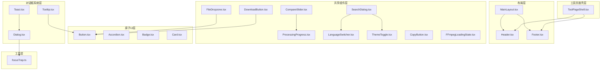
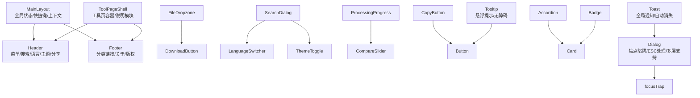
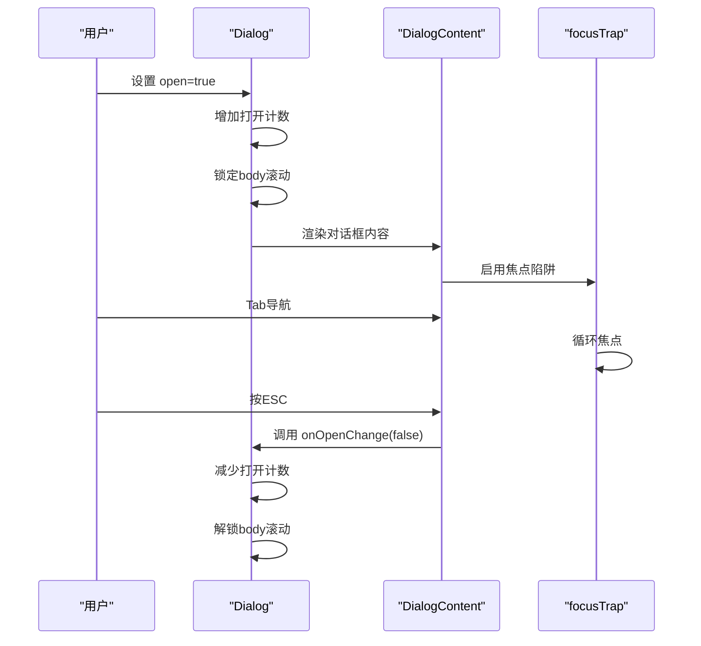
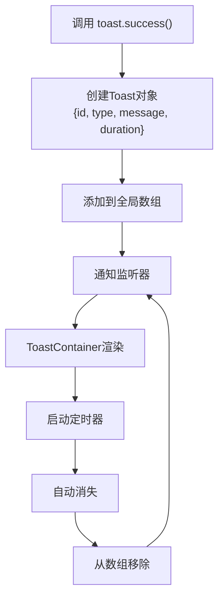
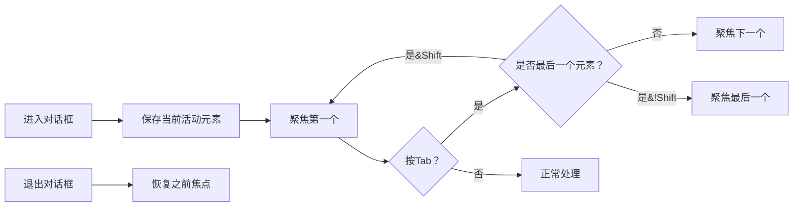
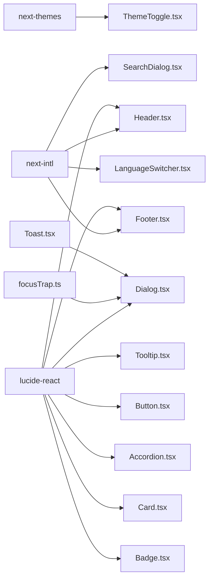

# UI组件系统

<cite>
**本文档引用的文件**
- [src/components/layout/Header.tsx](file://src/components/layout/Header.tsx)
- [src/components/layout/MainLayout.tsx](file://src/components/layout/MainLayout.tsx)
- [src/components/layout/Footer.tsx](file://src/components/layout/Footer.tsx)
- [src/components/shared/FileDropzone.tsx](file://src/components/shared/FileDropzone.tsx)
- [src/components/shared/DownloadButton.tsx](file://src/components/shared/DownloadButton.tsx)
- [src/components/shared/ThemeToggle.tsx](file://src/components/shared/ThemeToggle.tsx)
- [src/components/shared/LanguageSwitcher.tsx](file://src/components/shared/LanguageSwitcher.tsx)
- [src/components/shared/ProcessingProgress.tsx](file://src/components/shared/ProcessingProgress.tsx)
- [src/components/shared/FFmpegLoadingState.tsx](file://src/components/shared/FFmpegLoadingState.tsx)
- [src/components/shared/SearchDialog.tsx](file://src/components/shared/SearchDialog.tsx)
- [src/components/shared/CompareSlider.tsx](file://src/components/shared/CompareSlider.tsx)
- [src/components/shared/CopyButton.tsx](file://src/components/shared/CopyButton.tsx)
- [src/components/ui/Button.tsx](file://src/components/ui/Button.tsx)
- [src/components/ui/Accordion.tsx](file://src/components/ui/Accordion.tsx)
- [src/components/ui/Badge.tsx](file://src/components/ui/Badge.tsx)
- [src/components/ui/Card.tsx](file://src/components/ui/Card.tsx)
- [src/components/ui/Dialog.tsx](file://src/components/ui/Dialog.tsx)
- [src/components/ui/Toast.tsx](file://src/components/ui/Toast.tsx)
- [src/components/ui/Tooltip.tsx](file://src/components/ui/Tooltip.tsx)
- [src/lib/utils/focusTrap.ts](file://src/lib/utils/focusTrap.ts)
- [src/app/globals.css](file://src/app/globals.css)
- [package.json](file://package.json)
</cite>

## 更新摘要
**所做更改**
- 新增对话框系统组件（Dialog、Toast、Tooltip）的完整文档
- 引入焦点陷阱钩子（focusTrap）的详细说明
- 更新多个组件的可访问性增强实现
- 完善组件系统的架构图和依赖关系分析

## 目录
1. [简介](#简介)
2. [项目结构](#项目结构)
3. [核心组件](#核心组件)
4. [架构总览](#架构总览)
5. [详细组件分析](#详细组件分析)
6. [新增对话框系统](#新增对话框系统)
7. [焦点陷阱钩子](#焦点陷阱钩子)
8. [可访问性增强](#可访问性增强)
9. [依赖关系分析](#依赖关系分析)
10. [性能考量](#性能考量)
11. [故障排查指南](#故障排查指南)
12. [结论](#结论)
13. [附录](#附录)

## 简介
本文件系统化梳理媒体工具箱的UI组件体系，覆盖布局组件（Header、Sidebar、Footer）、共享组件（文件上传、下载、进度、搜索、切换语言与主题等）以及基础UI原子（Button、Card、Badge、Accordion）。**最新更新**引入了完整的对话框系统（Dialog、Toast、Tooltip），并集成了焦点陷阱钩子（focusTrap）来增强可访问性和用户体验。文档从架构设计、层次职责、数据与事件流、样式系统（Tailwind CSS与主题）、可访问性与响应式布局、使用示例与最佳实践、测试策略与维护方法等方面进行深入解析，帮助UI开发者与工具开发者高效理解与扩展组件库。

## 项目结构
组件按功能域分层组织：
- 布局层：负责全局导航与页脚信息呈现
- 工具页面壳层：封装工具页面的通用结构与文案
- 共享组件层：跨页面复用的功能型组件
- 原子UI层：最小可复用UI元素
- **新增** 对话框系统层：提供模态对话框、通知和提示组件

**图表来源**
- [src/components/layout/MainLayout.tsx:16-56](file://src/components/layout/MainLayout.tsx#L16-L56)
- [src/components/layout/Header.tsx:21-116](file://src/components/layout/Header.tsx#L21-L116)
- [src/components/layout/Footer.tsx:44-114](file://src/components/layout/Footer.tsx#L44-L114)
- [src/components/ui/Dialog.tsx:1-176](file://src/components/ui/Dialog.tsx#L1-L176)
- [src/components/ui/Toast.tsx:1-111](file://src/components/ui/Toast.tsx#L1-L111)
- [src/components/ui/Tooltip.tsx:1-64](file://src/components/ui/Tooltip.tsx#L1-L64)
- [src/lib/utils/focusTrap.ts:1-78](file://src/lib/utils/focusTrap.ts#L1-L78)

**章节来源**
- [src/components/layout/MainLayout.tsx:16-56](file://src/components/layout/MainLayout.tsx#L16-L56)
- [src/components/layout/Header.tsx:21-116](file://src/components/layout/Header.tsx#L21-L116)
- [src/components/layout/Footer.tsx:44-114](file://src/components/layout/Footer.tsx#L44-L114)
- [src/components/ui/Dialog.tsx:1-176](file://src/components/ui/Dialog.tsx#L1-L176)
- [src/components/ui/Toast.tsx:1-111](file://src/components/ui/Toast.tsx#L1-L111)
- [src/components/ui/Tooltip.tsx:1-64](file://src/components/ui/Tooltip.tsx#L1-L64)
- [src/lib/utils/focusTrap.ts:1-78](file://src/lib/utils/focusTrap.ts#L1-L78)

## 核心组件
- 布局组件
  - Header：移动端菜单按钮、站点Logo、桌面分类下拉导航、全局搜索触发、语言切换、主题切换、分享按钮
  - Footer：品牌信息、分类链接网格、关于与隐私链接、版权信息
  - MainLayout：全局状态（移动端导航、搜索对话框开关）、快捷键监听、工具导航上下文提供者
- 工具页面壳组件
  - ToolPageShell：工具标题、描述、本地处理指示、容器卡片、工具说明与特性模块
- 共享组件
  - FileDropzone：拖拽/点击上传、格式与大小提示、隐私提示、埋点上报
  - DownloadButton：Blob或DataURL下载、品牌命名、埋点上报
  - ProcessingProgress：确定/不确定进度条、百分比显示
  - SearchDialog：全局Ctrl+K打开、输入过滤、键盘导航、结果跳转、埋点
  - LanguageSwitcher：多语言切换、点击外部关闭、埋点
  - ThemeToggle：三态切换（浅色/深色/系统）、无障碍标签、埋点
  - CompareSlider：前后对比滑块、保存比例提示
  - CopyButton：复制到剪贴板、成功反馈、埋点
  - FFmpegLoadingState：加载中状态指示
- 原子UI
  - Button：变体与尺寸、渐变阴影、禁用态、焦点环
  - Accordion：手风琴项、展开/收起动画、图标旋转、ARIA支持
  - Badge：默认/次级/描边变体
  - Card：卡片容器、悬停阴影、过渡动画
- **新增** 对话框系统
  - Dialog：模态对话框容器、焦点陷阱、ESC键处理、多层对话框支持
  - Toast：全局通知系统、多种类型、自动消失、手动控制
  - Tooltip：悬浮提示、多种位置、无障碍支持

**章节来源**
- [src/components/layout/Header.tsx:15-116](file://src/components/layout/Header.tsx#L15-L116)
- [src/components/layout/Footer.tsx:13-114](file://src/components/layout/Footer.tsx#L13-L114)
- [src/components/layout/MainLayout.tsx:11-56](file://src/components/layout/MainLayout.tsx#L11-L56)
- [src/components/ui/Dialog.tsx:25-60](file://src/components/ui/Dialog.tsx#L25-L60)
- [src/components/ui/Toast.tsx:7-61](file://src/components/ui/Toast.tsx#L7-L61)
- [src/components/ui/Tooltip.tsx:6-26](file://src/components/ui/Tooltip.tsx#L6-L26)

## 架构总览
组件系统采用"布局-壳层-共享-原子-对话框"的分层设计，通过上下文与路由驱动状态，统一使用Tailwind CSS与可配置主题，结合国际化与埋点增强用户体验与可观测性。**新增的对话框系统**通过焦点陷阱钩子确保可访问性，通过上下文提供者实现组件间的通信。

**图表来源**
- [src/components/layout/MainLayout.tsx:35-54](file://src/components/layout/MainLayout.tsx#L35-L54)
- [src/components/layout/Header.tsx:54-114](file://src/components/layout/Header.tsx#L54-L114)
- [src/components/layout/Footer.tsx:58-112](file://src/components/layout/Footer.tsx#L58-L112)
- [src/components/ui/Dialog.tsx:88-122](file://src/components/ui/Dialog.tsx#L88-L122)
- [src/components/ui/Toast.tsx:70-110](file://src/components/ui/Toast.tsx#L70-L110)
- [src/components/ui/Tooltip.tsx:27-63](file://src/components/ui/Tooltip.tsx#L27-L63)
- [src/lib/utils/focusTrap.ts:3-77](file://src/lib/utils/focusTrap.ts#L3-L77)

## 详细组件分析

### 布局组件

#### Header 组件
- 职责：移动端菜单、Logo、桌面分类导航、全局搜索、语言切换、主题切换、分享
- 关键交互：分类下拉菜单、鼠标进入/离开延时关闭、路由变化自动关闭
- 可访问性：按钮含aria-label；键盘导航；动态图标旋转
- 样式：模糊背景、玻璃态、响应式布局

**章节来源**
- [src/components/layout/Header.tsx:15-116](file://src/components/layout/Header.tsx#L15-L116)

#### Footer 组件
- 职责：品牌信息、分类链接网格、关于与隐私、版权
- 关键逻辑：按分类聚合工具，限制展示数量
- 样式：栅格布局、响应式排列

**章节来源**
- [src/components/layout/Footer.tsx:13-114](file://src/components/layout/Footer.tsx#L13-L114)

#### MainLayout 组件
- 职责：承载Header/Footer、工具导航上下文、移动端导航与搜索对话框、全局快捷键
- 关键交互：Ctrl/Cmd+K打开搜索；点击遮罩关闭；路由变化关闭面板
- 状态：mobileNavOpen/searchOpen

**章节来源**
- [src/components/layout/MainLayout.tsx:11-56](file://src/components/layout/MainLayout.tsx#L11-L56)

### 工具页面壳组件

#### ToolPageShell 组件
- 职责：工具页统一外壳、本地处理指示、容器卡片、工具说明与特性模块
- 关键逻辑：读取工具国际化文案；渲染说明、特性、为什么选择、描述等模块

**章节来源**
- [src/components/tool/ToolPageShell.tsx:10-53](file://src/components/tool/ToolPageShell.tsx#L10-L53)

### 共享组件

#### FileDropzone 组件
- 属性接口：accept、multiple、onFiles、maxSize、className、analyticsSlug、analyticsCategory
- 事件与状态：拖拽进入/离开/释放；过滤超大文件；统计文件类型与数量上报
- 样式：高亮发光、隐私锁图标提示

**章节来源**
- [src/components/shared/FileDropzone.tsx:9-143](file://src/components/shared/FileDropzone.tsx#L9-L143)

#### DownloadButton 组件
- 属性接口：data（Blob或URL）、filename、className、analyticsSlug、analyticsCategory
- 事件与状态：点击下载、品牌命名、回收Object URL、埋点上报

**章节来源**
- [src/components/shared/DownloadButton.tsx:10-53](file://src/components/shared/DownloadButton.tsx#L10-L53)

#### ProcessingProgress 组件
- 属性接口：progress（0-100或未定义）、label、className
- 事件与状态：确定/不确定进度条、百分比显示

**章节来源**
- [src/components/shared/ProcessingProgress.tsx:6-46](file://src/components/shared/ProcessingProgress.tsx#L6-L46)

#### SearchDialog 组件
- 属性接口：open、onClose、toolNavData
- 事件与状态：输入过滤、键盘上下移动、回车选中、Esc关闭、点击遮罩关闭
- 埋点：打开、查询、结果数、选择

**章节来源**
- [src/components/shared/SearchDialog.tsx:18-188](file://src/components/shared/SearchDialog.tsx#L18-L188)

#### LanguageSwitcher 组件
- 属性接口：dropdownDirection（up/down）
- 事件与状态：点击切换、点击外部关闭、写入locale到localStorage、路由跳转

**章节来源**
- [src/components/shared/LanguageSwitcher.tsx:11-73](file://src/components/shared/LanguageSwitcher.tsx#L11-L73)

#### ThemeToggle 组件
- 事件与状态：三态切换、无障碍标签、埋点上报

**章节来源**
- [src/components/shared/ThemeToggle.tsx:9-35](file://src/components/shared/ThemeToggle.tsx#L9-L35)

#### CompareSlider 组件
- 属性接口：beforeSrc、afterSrc、beforeLabel、afterLabel、savedPercent
- 事件与状态：指针拖拽计算位置、clipPath裁剪、保存比例提示

**章节来源**
- [src/components/shared/CompareSlider.tsx:6-109](file://src/components/shared/CompareSlider.tsx#L6-L109)

#### CopyButton 组件
- 属性接口：text、className、analyticsSlug、analyticsCategory
- 事件与状态：复制到剪贴板、2秒内成功反馈、埋点

**章节来源**
- [src/components/shared/CopyButton.tsx:9-56](file://src/components/shared/CopyButton.tsx#L9-L56)

#### FFmpegLoadingState 组件
- 事件与状态：加载中状态指示

**章节来源**
- [src/components/shared/FFmpegLoadingState.tsx:6-19](file://src/components/shared/FFmpegLoadingState.tsx#L6-L19)

### 原子UI组件

#### Button 组件
- 属性接口：variant（primary/secondary/ghost/outline）、size（sm/md/lg/icon）、原生button属性
- 样式：变体与尺寸映射、渐变阴影、禁用态、焦点环
- **新增** 可访问性：完整的焦点可见性样式

**章节来源**
- [src/components/ui/Button.tsx:7-42](file://src/components/ui/Button.tsx#L7-L42)

#### Accordion 组件
- 属性接口：children、className；AccordionItem：title、children、defaultOpen、onValueChange
- 事件与状态：展开/收起、图标旋转、动画过渡
- **新增** 可访问性：ARIA属性支持、键盘导航

**章节来源**
- [src/components/ui/Accordion.tsx:7-71](file://src/components/ui/Accordion.tsx#L7-L71)

#### Badge 组件
- 属性接口：variant（default/secondary/outline）
- 样式：圆角徽标、不同变体

**章节来源**
- [src/components/ui/Badge.tsx:6-28](file://src/components/ui/Badge.tsx#L6-L28)

#### Card 组件
- 属性接口：HTMLDivElement属性
- 样式：卡片容器、悬停阴影、过渡动画

**章节来源**
- [src/components/ui/Card.tsx:4-33](file://src/components/ui/Card.tsx#L4-L33)

## 新增对话框系统

### Dialog 组件系统
Dialog组件系统提供了完整的模态对话框解决方案，包含焦点陷阱、ESC键处理和多层对话框支持。

#### Dialog 容器组件
- 属性接口：open（布尔值）、onOpenChange（回调函数）、children
- 关键功能：全局滚动锁定、多层对话框计数、上下文提供者
- 状态管理：使用useId生成唯一标题ID，跟踪打开计数

#### DialogOverlay 组件
- 功能：半透明背景遮罩，点击关闭对话框
- 样式：固定定位、z-index层级、淡入动画

#### DialogContent 组件
- 属性接口：children、className、onClose
- 关键功能：焦点陷阱集成、ESC键监听、Portal渲染到body
- 可访问性：role="dialog"、aria-modal、aria-labelledby

#### DialogHeader 组件
- 功能：对话框头部容器，用于放置标题和关闭按钮

#### DialogTitle 组件
- 属性接口：children、className、id
- 功能：对话框标题，自动生成唯一ID并与content关联

#### DialogClose 组件
- 属性接口：className、aria-label
- 功能：标准关闭按钮，使用X图标

**图表来源**
- [src/components/ui/Dialog.tsx:31-60](file://src/components/ui/Dialog.tsx#L31-L60)
- [src/components/ui/Dialog.tsx:88-122](file://src/components/ui/Dialog.tsx#L88-L122)
- [src/lib/utils/focusTrap.ts:47-77](file://src/lib/utils/focusTrap.ts#L47-L77)

**章节来源**
- [src/components/ui/Dialog.tsx:25-176](file://src/components/ui/Dialog.tsx#L25-L176)

### Toast 通知系统
Toast提供了全局通知功能，支持多种类型和自动消失机制。

#### Toast API
- 类型：success、error、info、warning
- 方法：toast.success()、toast.error()、toast.info()、toast.warning()、toast.dismiss()
- 配置：消息文本、持续时间（毫秒）

#### ToastContainer 组件
- 功能：全局通知容器，固定在右下角
- 特性：自动消失、手动关闭、动画效果
- 样式：基于通知类型的颜色主题

**图表来源**
- [src/components/ui/Toast.tsx:23-50](file://src/components/ui/Toast.tsx#L23-L50)
- [src/components/ui/Toast.tsx:70-110](file://src/components/ui/Toast.tsx#L70-L110)

**章节来源**
- [src/components/ui/Toast.tsx:7-111](file://src/components/ui/Toast.tsx#L7-L111)

### Tooltip 悬浮提示
Tooltip提供了轻量级的悬浮提示功能，支持多种位置和无障碍访问。

#### Tooltip 组件
- 属性接口：children、content、placement、className
- 支持位置：top、bottom、left、right
- 事件处理：鼠标悬停、键盘聚焦、自动隐藏

#### 样式系统
- 基于placement的定位类映射
- 箭头位置与主容器位置对应
- 动画效果：淡入缩放

**章节来源**
- [src/components/ui/Tooltip.tsx:6-64](file://src/components/ui/Tooltip.tsx#L6-L64)

## 焦点陷阱钩子

### useFocusTrap Hook
焦点陷阱钩子确保模态对话框中的焦点循环，提升可访问性。

#### 核心功能
- **焦点循环**：Tab键在可聚焦元素间循环
- **Shift+Tab**：反向循环
- **自动聚焦**：进入时聚焦第一个可聚焦元素
- **返回焦点**：退出时返回之前活动的元素

#### 可聚焦元素选择器
- 链接元素（a[href]）
- 按钮元素（button:not([disabled])）
- 输入元素（input:not([disabled])）
- 选择框（select:not([disabled])）
- 文本域（textarea:not([disabled])）
- 具有tabindex的元素

#### 实现细节
- 使用MutationObserver监听DOM变化
- 过滤aria-hidden和不可见元素
- 支持条件启用/禁用

**图表来源**
- [src/lib/utils/focusTrap.ts:3-77](file://src/lib/utils/focusTrap.ts#L3-L77)

**章节来源**
- [src/lib/utils/focusTrap.ts:1-78](file://src/lib/utils/focusTrap.ts#L1-L78)

## 可访问性增强

### 现有组件的可访问性改进
- **Button组件**：完整的焦点可见性样式，支持禁用状态
- **Accordion组件**：ARIA属性支持（aria-expanded、aria-controls、role="region"）
- **Tooltip组件**：role="tooltip"、aria-describedby关联
- **Dialog组件**：完整的ARIA支持（role="dialog"、aria-modal、aria-labelledby）

### 新增可访问性特性
- **焦点管理**：通过focusTrap确保焦点循环
- **键盘导航**：支持Tab、Shift+Tab、ESC键
- **屏幕阅读器**：语义化标签和描述
- **颜色对比**：符合WCAG对比度要求

**章节来源**
- [src/components/ui/Button.tsx:29-38](file://src/components/ui/Button.tsx#L29-L38)
- [src/components/ui/Accordion.tsx:35-67](file://src/components/ui/Accordion.tsx#L35-L67)
- [src/components/ui/Tooltip.tsx:39-61](file://src/components/ui/Tooltip.tsx#L39-L61)
- [src/components/ui/Dialog.tsx:110-112](file://src/components/ui/Dialog.tsx#L110-L112)

## 依赖关系分析
- 组件间耦合
  - MainLayout作为根容器，向下提供上下文与状态，被Header、Footer、ToolPageShell等消费
  - Dialog组件通过上下文提供者与focusTrap钩子协作
  - Toast系统通过全局状态管理实现跨组件通信
  - Tooltip组件与Button等原子组件松耦合
- 外部依赖
  - 主题：next-themes
  - 图标：lucide-react
  - 国际化：next-intl
  - 埋点：自定义analytics工具
  - **新增** 焦点管理：React内置的useRef和useEffect
- 样式系统
  - Tailwind CSS：原子类、变量与暗色主题
  - 全局样式：src/app/globals.css

**图表来源**
- [src/components/shared/ThemeToggle.tsx:3-3](file://src/components/shared/ThemeToggle.tsx#L3-L3)
- [src/components/layout/Header.tsx:3-3](file://src/components/layout/Header.tsx#L3-L3)
- [src/components/layout/Footer.tsx:3-3](file://src/components/layout/Footer.tsx#L3-L3)
- [src/components/shared/SearchDialog.tsx:3-3](file://src/components/shared/SearchDialog.tsx#L3-L3)
- [src/components/shared/LanguageSwitcher.tsx:3-3](file://src/components/shared/LanguageSwitcher.tsx#L3-L3)
- [src/components/ui/Dialog.tsx:7](file://src/components/ui/Dialog.tsx#L7)
- [src/components/ui/Toast.tsx:2](file://src/components/ui/Toast.tsx#L2)
- [src/components/ui/Tooltip.tsx:3](file://src/components/ui/Tooltip.tsx#L3)
- [src/lib/utils/focusTrap.ts:1](file://src/lib/utils/focusTrap.ts#L1)

**章节来源**
- [package.json](file://package.json)

## 性能考量
- 拖拽与键盘事件
  - 使用useCallback稳定回调，避免不必要的重渲染
  - 搜索对话框使用防抖延迟上报查询事件
- 渲染优化
  - useMemo对工具导航数据进行分组缓存
  - Header与Footer中的分类/工具列表按需展开
  - **新增** Dialog使用Portal减少DOM层级深度
- 动画与阴影
  - 合理使用CSS变量与过渡，避免过度阴影导致的重排
  - **新增** Toast使用transform动画提升性能
- 文件处理
  - FileDropzone在客户端过滤超大文件，减少无效处理
  - DownloadButton及时回收Object URL
- **新增** 焦点陷阱性能
  - 使用requestAnimationFrame优化首次聚焦
  - 智能选择器过滤不可见元素

## 故障排查指南
- 搜索对话框无法打开
  - 检查MainLayout是否正确传递open与onClose
  - 确认全局快捷键未被其他监听覆盖
- 分类下拉菜单不关闭
  - 检查鼠标离开/进入事件与延时关闭逻辑
- 下载失败或文件名异常
  - 确认传入data类型与filename；检查品牌命名函数
- 主题切换无效果
  - 检查next-themes配置与系统偏好
- 复制按钮无反馈
  - 检查navigator.clipboard可用性与权限
- **新增** 对话框问题
  - 焦点无法正确循环：检查容器内是否存在可聚焦元素
  - ESC键无效：确认对话框处于打开状态
  - 多层对话框冲突：检查openCount计数
- **新增** Toast问题
  - 通知不显示：确认ToastContainer已渲染
  - 自动消失过快：调整duration参数
  - 无法手动关闭：检查dismiss函数调用
- **新增** Tooltip问题
  - 提示不显示：检查children是否为可聚焦元素
  - 位置错误：确认placement参数正确

**章节来源**
- [src/components/shared/SearchDialog.tsx:64-96](file://src/components/shared/SearchDialog.tsx#L64-L96)
- [src/components/layout/Header.tsx:46-52](file://src/components/layout/Header.tsx#L46-L52)
- [src/components/shared/DownloadButton.tsx:27-36](file://src/components/shared/DownloadButton.tsx#L27-L36)
- [src/components/shared/ThemeToggle.tsx:21-23](file://src/components/shared/ThemeToggle.tsx#L21-L23)
- [src/components/shared/CopyButton.tsx:23-30](file://src/components/shared/CopyButton.tsx#L23-L30)
- [src/components/ui/Dialog.tsx:35-53](file://src/components/ui/Dialog.tsx#L35-L53)
- [src/components/ui/Toast.tsx:23-50](file://src/components/ui/Toast.tsx#L23-L50)
- [src/components/ui/Tooltip.tsx:27-63](file://src/components/ui/Tooltip.tsx#L27-L63)

## 结论
该UI组件系统以清晰的分层设计与强复用的共享组件为核心，结合国际化、主题与埋点，形成一致且可扩展的前端体验。**最新更新**引入的对话框系统通过焦点陷阱钩子显著提升了可访问性和用户体验，Toast通知系统提供了优雅的用户反馈机制，Tooltip组件增强了界面的交互性。通过合理的事件与状态管理、Tailwind CSS样式体系与响应式布局，组件在可用性、可访问性与性能方面均具备良好表现。建议在新增组件时遵循现有模式：明确职责边界、使用上下文与国际化、统一样式与可访问性规范，并配套埋点与测试。

## 附录

### 样式系统与主题
- Tailwind CSS：通过原子类与变量实现主题一致性
- 自定义主题支持：next-themes提供light/dark/system三态切换
- 全局样式：src/app/globals.css集中管理基础样式与变量

**章节来源**
- [src/app/globals.css](file://src/app/globals.css)
- [src/components/shared/ThemeToggle.tsx:9-35](file://src/components/shared/ThemeToggle.tsx#L9-L35)

### 可访问性与响应式布局
- 可访问性：按钮aria-label、键盘导航、焦点环、语义化标签、ARIA属性
- 响应式布局：移动端优先、断点适配、网格与弹性布局
- **新增** 焦点管理：完整的键盘导航支持

**章节来源**
- [src/components/layout/Header.tsx:58-65](file://src/components/layout/Header.tsx#L58-L65)
- [src/components/layout/Footer.tsx:79-83](file://src/components/layout/Footer.tsx#L79-L83)
- [src/components/ui/Accordion.tsx:35-67](file://src/components/ui/Accordion.tsx#L35-L67)

### 使用示例与最佳实践
- 组合使用
  - 在工具页面使用ToolPageShell包裹业务组件
  - 使用FileDropzone与DownloadButton配合处理文件
  - 使用SearchDialog提升工具发现效率
  - **新增** 使用Dialog创建模态表单或确认对话框
  - **新增** 使用Toast提供操作反馈
  - **新增** 使用Tooltip增强图标和按钮的可理解性
- 扩展建议
  - 新增共享组件时保持属性简洁、事件可控、样式可定制
  - 为关键交互添加埋点，便于后续优化
  - **新增** 优先考虑可访问性设计
  - **新增** 使用焦点陷阱确保模态对话框的可访问性

### 测试策略与维护方法
- 单元测试：针对纯函数与Hook（如格式化、过滤、焦点陷阱）编写测试
- 集成测试：模拟用户交互（拖拽、键盘、点击、焦点管理），验证状态与事件
- 可访问性测试：使用屏幕阅读器与键盘导航验证，特别是对话框和Tooltip
- 性能测试：测试大量Toast同时出现的性能影响
- 维护方法：版本化变更记录、组件API稳定性检查、样式变量集中管理
- **新增** 焦点陷阱测试：验证焦点循环、键盘导航、ESC键处理
- **新增** 多层对话框测试：验证滚动锁定和计数器正确性