# UI组件系统

<cite>
**本文档引用的文件**
- [src/components/layout/Header.tsx](file://src/components/layout/Header.tsx)
- [src/components/layout/MainLayout.tsx](file://src/components/layout/MainLayout.tsx)
- [src/components/layout/Footer.tsx](file://src/components/layout/Footer.tsx)
- [src/components/layout/BaseLayout.tsx](file://src/components/layout/BaseLayout.tsx)
- [src/components/shared/FileDropzone.tsx](file://src/components/shared/FileDropzone.tsx)
- [src/components/shared/DownloadButton.tsx](file://src/components/shared/DownloadButton.tsx)
- [src/components/shared/ThemeToggle.tsx](file://src/components/shared/ThemeToggle.tsx)
- [src/components/shared/LanguageSwitcher.tsx](file://src/components/shared/LanguageSwitcher.tsx)
- [src/components/shared/ProcessingProgress.tsx](file://src/components/shared/ProcessingProgress.tsx)
- [src/components/shared/FFmpegLoadingState.tsx](file://src/components/shared/FFmpegLoadingState.tsx)
- [src/components/shared/SearchDialog.tsx](file://src/components/shared/SearchDialog.tsx)
- [src/components/shared/CompareSlider.tsx](file://src/components/shared/CompareSlider.tsx)
- [src/components/shared/CopyButton.tsx](file://src/components/shared/CopyButton.tsx)
- [src/components/shared/GoogleAnalyticsScripts.tsx](file://src/components/shared/GoogleAnalyticsScripts.tsx)
- [src/components/ui/Button.tsx](file://src/components/ui/Button.tsx)
- [src/components/ui/Accordion.tsx](file://src/components/ui/Accordion.tsx)
- [src/components/ui/Badge.tsx](file://src/components/ui/Badge.tsx)
- [src/components/ui/Card.tsx](file://src/components/ui/Card.tsx)
- [src/components/ui/Dialog.tsx](file://src/components/ui/Dialog.tsx)
- [src/components/ui/Toast.tsx](file://src/components/ui/Toast.tsx)
- [src/components/ui/Tooltip.tsx](file://src/components/ui/Tooltip.tsx)
- [src/components/ui/Tabs.tsx](file://src/components/ui/Tabs.tsx)
- [src/lib/utils/focusTrap.ts](file://src/lib/utils/focusTrap.ts)
- [src/lib/theme/ThemeProvider.tsx](file://src/lib/theme/ThemeProvider.tsx)
- [src/lib/theme/theme-init-script.ts](file://src/lib/theme/theme-init-script.ts)
- [src/lib/hooks/useIsClient.ts](file://src/lib/hooks/useIsClient.ts)
- [src/lib/analytics.ts](file://src/lib/analytics.ts)
- [src/app/(home)/layout.tsx](file://src/app/(home)/layout.tsx)
- [src/app/[locale]/layout.tsx](file://src/app/[locale]/layout.tsx)
- [src/app/layout.tsx](file://src/app/layout.tsx)
- [src/app/[locale]/tools/[category]/[slug]/ToolPageClient.tsx](file://src/app/[locale]/tools/[category]/[slug]/ToolPageClient.tsx)
- [src/app/globals.css](file://src/app/globals.css)
- [package.json](file://package.json)
</cite>

## 更新摘要
**所做更改**
- 新增主题提供者系统（ThemeProvider）的完整文档
- 引入客户端检测钩子（useIsClient）的详细说明
- 更新Google Analytics脚本组件的实现分析
- 完善主题初始化脚本（themeInitScript）的技术细节
- 增强工具页面客户端组件的懒加载机制说明
- 更新多个组件的可访问性增强实现
- 完善组件系统的架构图和依赖关系分析
- **更新** Tabs组件集成useEffect钩子改善标签注册系统生命周期管理

## 目录
1. [简介](#简介)
2. [项目结构](#项目结构)
3. [核心组件](#核心组件)
4. [架构总览](#架构总览)
5. [详细组件分析](#详细组件分析)
6. [新增主题提供者系统](#新增主题提供者系统)
7. [客户端检测钩子](#客户端检测钩子)
8. [Google Analytics集成](#google-analytics集成)
9. [工具页面客户端组件](#工具页面客户端组件)
10. [新增对话框系统](#新增对话框系统)
11. [焦点陷阱钩子](#焦点陷阱钩子)
12. [可访问性增强](#可访问性增强)
13. [依赖关系分析](#依赖关系分析)
14. [性能考量](#性能考量)
15. [故障排查指南](#故障排查指南)
16. [结论](#结论)
17. [附录](#附录)

## 简介
本文件系统化梳理媒体工具箱的UI组件体系，覆盖布局组件（Header、Sidebar、Footer）、共享组件（文件上传、下载、进度、搜索、切换语言与主题等）以及基础UI原子（Button、Card、Badge、Accordion）。**最新更新**引入了完整的主题提供者系统、客户端检测钩子、Google Analytics脚本组件等增强功能，显著提升了主题管理、客户端兼容性和数据分析能力。**特别更新** Tabs组件集成了useEffect钩子到标签注册系统中，改善了组件生命周期管理，使标签注册更加可靠和高效。文档从架构设计、层次职责、数据与事件流、样式系统（Tailwind CSS与主题）、可访问性与响应式布局、使用示例与最佳实践、测试策略与维护方法等方面进行深入解析，帮助UI开发者与工具开发者高效理解与扩展组件库。

## 项目结构
组件按功能域分层组织：
- 布局层：负责全局导航与页脚信息呈现
- 工具页面壳层：封装工具页面的通用结构与文案
- 共享组件层：跨页面复用的功能型组件
- 原子UI层：最小可复用UI元素
- **新增** 主题系统层：提供主题提供者、客户端检测和主题初始化
- **新增** 数据分析层：集成Google Analytics和埋点追踪
- **新增** 工具页面客户端层：优化工具页面的懒加载和性能
- **更新** Tabs组件层：集成useEffect钩子改善标签注册生命周期

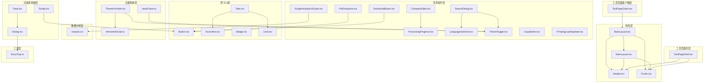

**图表来源**
- [src/components/layout/MainLayout.tsx:16-56](file://src/components/layout/MainLayout.tsx#L16-L56)
- [src/components/layout/Header.tsx:21-116](file://src/components/layout/Header.tsx#L21-L116)
- [src/components/layout/Footer.tsx:44-114](file://src/components/layout/Footer.tsx#L44-L114)
- [src/components/layout/BaseLayout.tsx:17-26](file://src/components/layout/BaseLayout.tsx#L17-L26)
- [src/components/shared/GoogleAnalyticsScripts.tsx:1-21](file://src/components/shared/GoogleAnalyticsScripts.tsx#L1-L21)
- [src/lib/theme/ThemeProvider.tsx:45-97](file://src/lib/theme/ThemeProvider.tsx#L45-L97)
- [src/lib/theme/theme-init-script.ts:1-7](file://src/lib/theme/theme-init-script.ts#L1-L7)
- [src/lib/hooks/useIsClient.ts:1-9](file://src/lib/hooks/useIsClient.ts#L1-L9)
- [src/lib/analytics.ts:106-137](file://src/lib/analytics.ts#L106-L137)
- [src/app/[locale]/tools/[category]/[slug]/ToolPageClient.tsx:39-62](file://src/app/[locale]/tools/[category]/[slug]/ToolPageClient.tsx#L39-L62)
- [src/components/ui/Dialog.tsx:1-176](file://src/components/ui/Dialog.tsx#L1-L176)
- [src/components/ui/Toast.tsx:1-111](file://src/components/ui/Toast.tsx#L1-L111)
- [src/components/ui/Tooltip.tsx:1-64](file://src/components/ui/Tooltip.tsx#L1-L64)
- [src/lib/utils/focusTrap.ts:1-78](file://src/lib/utils/focusTrap.ts#L1-L78)
- [src/components/ui/Tabs.tsx:1-172](file://src/components/ui/Tabs.tsx#L1-L172)

**章节来源**
- [src/components/layout/MainLayout.tsx:16-56](file://src/components/layout/MainLayout.tsx#L16-L56)
- [src/components/layout/Header.tsx:21-116](file://src/components/layout/Header.tsx#L21-L116)
- [src/components/layout/Footer.tsx:44-114](file://src/components/layout/Footer.tsx#L44-L114)
- [src/components/layout/BaseLayout.tsx:17-26](file://src/components/layout/BaseLayout.tsx#L17-L26)
- [src/components/shared/GoogleAnalyticsScripts.tsx:1-21](file://src/components/shared/GoogleAnalyticsScripts.tsx#L1-L21)
- [src/lib/theme/ThemeProvider.tsx:45-97](file://src/lib/theme/ThemeProvider.tsx#L45-L97)
- [src/lib/theme/theme-init-script.ts:1-7](file://src/lib/theme/theme-init-script.ts#L1-L7)
- [src/lib/hooks/useIsClient.ts:1-9](file://src/lib/hooks/useIsClient.ts#L1-L9)
- [src/lib/analytics.ts:106-137](file://src/lib/analytics.ts#L106-L137)
- [src/app/[locale]/tools/[category]/[slug]/ToolPageClient.tsx:39-62](file://src/app/[locale]/tools/[category]/[slug]/ToolPageClient.tsx#L39-L62)
- [src/components/ui/Dialog.tsx:1-176](file://src/components/ui/Dialog.tsx#L1-L176)
- [src/components/ui/Toast.tsx:1-111](file://src/components/ui/Toast.tsx#L1-L111)
- [src/components/ui/Tooltip.tsx:1-64](file://src/components/ui/Tooltip.tsx#L1-L64)
- [src/lib/utils/focusTrap.ts:1-78](file://src/lib/utils/focusTrap.ts#L1-L78)
- [src/components/ui/Tabs.tsx:1-172](file://src/components/ui/Tabs.tsx#L1-L172)

## 核心组件
- 布局组件
  - Header：移动端菜单按钮、站点Logo、桌面分类下拉导航、全局搜索触发、语言切换、主题切换、分享按钮
  - Footer：品牌信息、分类链接网格、关于与隐私链接、版权信息
  - MainLayout：全局状态（移动端导航、搜索对话框开关）、快捷键监听、工具导航上下文提供者
  - BaseLayout：国际化提供者、安装提示、服务工作者注册
- 工具页面壳组件
  - ToolPageShell：工具标题、描述、本地处理指示、容器卡片、工具说明与特性模块
  - **新增** ToolPageClient：工具页面客户端组件，支持懒加载和骨架屏
- 共享组件
  - FileDropzone：拖拽/点击上传、格式与大小提示、隐私提示、埋点上报
  - DownloadButton：Blob或DataURL下载、品牌命名、埋点上报
  - ProcessingProgress：确定/不确定进度条、百分比显示
  - SearchDialog：全局Ctrl+K打开、输入过滤、键盘导航、结果跳转、埋点
  - LanguageSwitcher：多语言切换、点击外部关闭、埋点
  - ThemeToggle：三态切换（浅色/深色/系统）、无障碍标签、埋点、客户端检测
  - CompareSlider：前后对比滑块、保存比例提示
  - CopyButton：复制到剪贴板、成功反馈、埋点
  - FFmpegLoadingState：加载中状态指示
  - **新增** GoogleAnalyticsScripts：Google Analytics集成组件
- 原子UI
  - Button：变体与尺寸、渐变阴影、禁用态、焦点环
  - Accordion：手风琴项、展开/收起动画、图标旋转、ARIA支持
  - Badge：默认/次级/描边变体
  - Card：卡片容器、悬停阴影、过渡动画
  - **更新** Tabs：标签页组件，集成useEffect钩子改善标签注册生命周期管理
- **新增** 主题系统
  - ThemeProvider：主题提供者，管理主题状态和持久化
  - themeInitScript：主题初始化脚本，防止FOUC
  - useIsClient：客户端检测钩子，确保SSR兼容性
- **新增** 对话框系统
  - Dialog：模态对话框容器、焦点陷阱、ESC键处理、多层对话框支持
  - Toast：全局通知系统、多种类型、自动消失、手动控制
  - Tooltip：悬浮提示、多种位置、无障碍支持

**章节来源**
- [src/components/layout/Header.tsx:15-116](file://src/components/layout/Header.tsx#L15-L116)
- [src/components/layout/Footer.tsx:13-114](file://src/components/layout/Footer.tsx#L13-L114)
- [src/components/layout/MainLayout.tsx:11-56](file://src/components/layout/MainLayout.tsx#L11-L56)
- [src/components/layout/BaseLayout.tsx:17-26](file://src/components/layout/BaseLayout.tsx#L17-L26)
- [src/app/[locale]/tools/[category]/[slug]/ToolPageClient.tsx:39-62](file://src/app/[locale]/tools/[category]/[slug]/ToolPageClient.tsx#L39-L62)
- [src/components/shared/GoogleAnalyticsScripts.tsx:1-21](file://src/components/shared/GoogleAnalyticsScripts.tsx#L1-L21)
- [src/lib/theme/ThemeProvider.tsx:45-97](file://src/lib/theme/ThemeProvider.tsx#L45-L97)
- [src/lib/theme/theme-init-script.ts:1-7](file://src/lib/theme/theme-init-script.ts#L1-L7)
- [src/lib/hooks/useIsClient.ts:1-9](file://src/lib/hooks/useIsClient.ts#L1-L9)
- [src/components/ui/Dialog.tsx:25-60](file://src/components/ui/Dialog.tsx#L25-L60)
- [src/components/ui/Toast.tsx:7-61](file://src/components/ui/Toast.tsx#L7-L61)
- [src/components/ui/Tooltip.tsx:6-26](file://src/components/ui/Tooltip.tsx#L6-L26)
- [src/components/ui/Tabs.tsx:22-50](file://src/components/ui/Tabs.tsx#L22-L50)

## 架构总览
组件系统采用"布局-壳层-共享-原子-主题系统-数据分析-工具页面客户端"的分层设计，通过上下文与路由驱动状态，统一使用Tailwind CSS与可配置主题，结合国际化与埋点增强用户体验与可观测性。**新增的主题提供者系统**确保主题状态的一致性和持久化，**客户端检测钩子**保证SSR环境下的兼容性，**Google Analytics集成**提供完整的用户行为追踪。**特别更新** Tabs组件通过useEffect钩子集成到标签注册系统中，改善了组件生命周期管理，使标签注册更加可靠和高效。

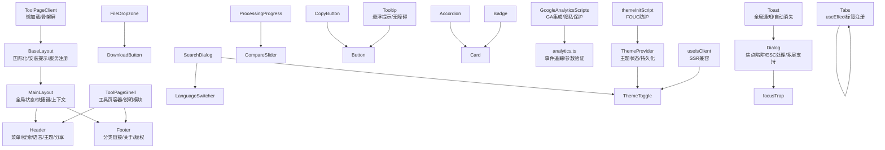

**图表来源**
- [src/components/layout/MainLayout.tsx:35-54](file://src/components/layout/MainLayout.tsx#L35-L54)
- [src/components/layout/Header.tsx:54-114](file://src/components/layout/Header.tsx#L54-L114)
- [src/components/layout/Footer.tsx:58-112](file://src/components/layout/Footer.tsx#L58-L112)
- [src/components/layout/BaseLayout.tsx:17-26](file://src/components/layout/BaseLayout.tsx#L17-L26)
- [src/app/[locale]/tools/[category]/[slug]/ToolPageClient.tsx:39-62](file://src/app/[locale]/tools/[category]/[slug]/ToolPageClient.tsx#L39-L62)
- [src/components/shared/GoogleAnalyticsScripts.tsx:1-21](file://src/components/shared/GoogleAnalyticsScripts.tsx#L1-L21)
- [src/lib/analytics.ts:106-137](file://src/lib/analytics.ts#L106-L137)
- [src/lib/theme/ThemeProvider.tsx:86-90](file://src/lib/theme/ThemeProvider.tsx#L86-L90)
- [src/lib/theme/theme-init-script.ts:1-7](file://src/lib/theme/theme-init-script.ts#L1-L7)
- [src/lib/hooks/useIsClient.ts:1-9](file://src/lib/hooks/useIsClient.ts#L1-L9)
- [src/components/ui/Dialog.tsx:88-122](file://src/components/ui/Dialog.tsx#L88-L122)
- [src/components/ui/Toast.tsx:70-110](file://src/components/ui/Toast.tsx#L70-L110)
- [src/components/ui/Tooltip.tsx:27-63](file://src/components/ui/Tooltip.tsx#L27-L63)
- [src/lib/utils/focusTrap.ts:3-77](file://src/lib/utils/focusTrap.ts#L3-L77)
- [src/components/ui/Tabs.tsx:89-91](file://src/components/ui/Tabs.tsx#L89-L91)

## 详细组件分析

### 布局组件

#### Header 组件
- 职责：移动端菜单、Logo、桌面分类导航、全局搜索、语言切换、主题切换、分享
- 关键交互：分类下拉菜单、鼠标进入/离开延时关闭、路由变化自动关闭
- 可访问性：按钮含aria-label；键盘导航；动态图标旋转
- 样式：模糊背景、玻璃态、响应式布局

**章节来源**
- [src/components/layout/Header.tsx:15-116](file://src/components/layout/Header.tsx#L15-L116)

#### Footer 组件
- 职责：品牌信息、分类链接网格、关于与隐私、版权
- 关键逻辑：按分类聚合工具，限制展示数量
- 样式：栅格布局、响应式排列

**章节来源**
- [src/components/layout/Footer.tsx:13-114](file://src/components/layout/Footer.tsx#L13-L114)

#### MainLayout 组件
- 职责：承载Header/Footer、工具导航上下文、移动端导航与搜索对话框、全局快捷键
- 关键交互：Ctrl/Cmd+K打开搜索；点击遮罩关闭；路由变化关闭面板
- 状态：mobileNavOpen/searchOpen

**章节来源**
- [src/components/layout/MainLayout.tsx:11-56](file://src/components/layout/MainLayout.tsx#L11-L56)

#### BaseLayout 组件
- 职责：国际化提供者包装、语言建议横幅、安装提示、服务工作者注册
- 关键功能：NextIntlClientProvider提供国际化上下文
- 状态管理：本地化消息和工具导航数据的客户端提供

**章节来源**
- [src/components/layout/BaseLayout.tsx:17-26](file://src/components/layout/BaseLayout.tsx#L17-L26)

### 工具页面壳组件

#### ToolPageShell 组件
- 职责：工具页统一外壳、本地处理指示、容器卡片、工具说明与特性模块
- 关键逻辑：读取工具国际化文案；渲染说明、特性、为什么选择、描述等模块

**章节来源**
- [src/components/tool/ToolPageShell.tsx:10-53](file://src/components/tool/ToolPageShell.tsx#L10-L53)

#### ToolPageClient 组件
- 职责：工具页面客户端组件，支持懒加载和骨架屏
- 关键功能：懒加载工具组件、稳定缓存、骨架屏加载
- 性能优化：懒加载缓存、Suspense支持、工具组件稳定化

**章节来源**
- [src/app/[locale]/tools/[category]/[slug]/ToolPageClient.tsx:39-62](file://src/app/[locale]/tools/[category]/[slug]/ToolPageClient.tsx#L39-L62)

### 共享组件

#### FileDropzone 组件
- 属性接口：accept、multiple、onFiles、maxSize、className、analyticsSlug、analyticsCategory
- 事件与状态：拖拽进入/离开/释放；过滤超大文件；统计文件类型与数量上报
- 样式：高亮发光、隐私锁图标提示

**章节来源**
- [src/components/shared/FileDropzone.tsx:9-143](file://src/components/shared/FileDropzone.tsx#L9-L143)

#### DownloadButton 组件
- 属性接口：data（Blob或URL）、filename、className、analyticsSlug、analyticsCategory
- 事件与状态：点击下载、品牌命名、回收Object URL、埋点上报

**章节来源**
- [src/components/shared/DownloadButton.tsx:10-53](file://src/components/shared/DownloadButton.tsx#L10-L53)

#### ProcessingProgress 组件
- 属性接口：progress（0-100或未定义）、label、className
- 事件与状态：确定/不确定进度条、百分比显示

**章节来源**
- [src/components/shared/ProcessingProgress.tsx:6-46](file://src/components/shared/ProcessingProgress.tsx#L6-L46)

#### SearchDialog 组件
- 属性接口：open、onClose、toolNavData
- 事件与状态：输入过滤、键盘上下移动、回车选中、Esc关闭、点击遮罩关闭
- 埋点：打开、查询、结果数、选择

**章节来源**
- [src/components/shared/SearchDialog.tsx:18-188](file://src/components/shared/SearchDialog.tsx#L18-L188)

#### LanguageSwitcher 组件
- 属性接口：dropdownDirection（up/down）
- 事件与状态：点击切换、点击外部关闭、写入locale到localStorage、路由跳转

**章节来源**
- [src/components/shared/LanguageSwitcher.tsx:11-73](file://src/components/shared/LanguageSwitcher.tsx#L11-L73)

#### ThemeToggle 组件
- 属性接口：useTheme上下文、useIsClient钩子、useTranslations国际化
- 事件与状态：三态切换、无障碍标签、埋点上报、客户端检测
- **更新** 客户端检测：使用useIsClient确保SSR兼容性

**章节来源**
- [src/components/shared/ThemeToggle.tsx:9-33](file://src/components/shared/ThemeToggle.tsx#L9-L33)

#### CompareSlider 组件
- 属性接口：beforeSrc、afterSrc、beforeLabel、afterLabel、savedPercent
- 事件与状态：指针拖拽计算位置、clipPath裁剪、保存比例提示

**章节来源**
- [src/components/shared/CompareSlider.tsx:6-109](file://src/components/shared/CompareSlider.tsx#L6-L109)

#### CopyButton 组件
- 属性接口：text、className、analyticsSlug、analyticsCategory
- 事件与状态：复制到剪贴板、2秒内成功反馈、埋点

**章节来源**
- [src/components/shared/CopyButton.tsx:9-56](file://src/components/shared/CopyButton.tsx#L9-L56)

#### FFmpegLoadingState 组件
- 事件与状态：加载中状态指示

**章节来源**
- [src/components/shared/FFmpegLoadingState.tsx:6-19](file://src/components/shared/FFmpegLoadingState.tsx#L6-L19)

#### GoogleAnalyticsScripts 组件
- 属性接口：NEXT_PUBLIC_GA_ID环境变量验证
- 功能：Google Analytics 4集成、隐私保护、条件加载
- 安全性：GA ID格式验证、空值处理、条件渲染

**章节来源**
- [src/components/shared/GoogleAnalyticsScripts.tsx:1-21](file://src/components/shared/GoogleAnalyticsScripts.tsx#L1-L21)

### 原子UI组件

#### Button 组件
- 属性接口：variant（primary/secondary/ghost/outline）、size（sm/md/lg/icon）、原生button属性
- 样式：变体与尺寸映射、渐变阴影、禁用态、焦点环
- **新增** 可访问性：完整的焦点可见性样式

**章节来源**
- [src/components/ui/Button.tsx:7-42](file://src/components/ui/Button.tsx#L7-L42)

#### Accordion 组件
- 属性接口：children、className；AccordionItem：title、children、defaultOpen、onValueChange
- 事件与状态：展开/收起、图标旋转、动画过渡
- **新增** 可访问性：ARIA属性支持、键盘导航

**章节来源**
- [src/components/ui/Accordion.tsx:7-71](file://src/components/ui/Accordion.tsx#L7-L71)

#### Badge 组件
- 属性接口：variant（default/secondary/outline）
- 样式：圆角徽标、不同变体

**章节来源**
- [src/components/ui/Badge.tsx:6-28](file://src/components/ui/Badge.tsx#L6-L28)

#### Card 组件
- 属性接口：HTMLDivElement属性
- 样式：卡片容器、悬停阴影、过渡动画

**章节来源**
- [src/components/ui/Card.tsx:4-33](file://src/components/ui/Card.tsx#L4-L33)

#### Tabs 组件系统
**更新** Tabs组件集成了useEffect钩子到标签注册系统中，显著改善了组件生命周期管理。

- **组件结构**：Tabs（容器）、TabsList（标签列表）、TabsTrigger（标签触发器）、TabsContent（标签内容）
- **核心功能**：标签页切换、键盘导航、无障碍支持、生命周期管理
- **标签注册系统**：通过useEffect钩子确保标签在组件挂载时正确注册到上下文中

**标签注册生命周期改进**：
- **旧实现**：使用registerValue回调函数在组件渲染时注册标签
- **新实现**：在TabsTrigger组件中使用useEffect钩子，在组件挂载时自动注册标签
- **优势**：更可靠的生命周期管理，避免标签注册时机问题

**键盘导航支持**：
- ArrowLeft/ArrowUp：向前导航
- ArrowRight/ArrowDown：向后导航  
- Home：跳转到第一个标签
- End：跳转到最后一个标签

**无障碍支持**：
- role="tablist"、role="tab"、role="tabpanel"
- aria-selected、aria-controls、aria-labelledby
- 自动焦点管理和键盘导航

**章节来源**
- [src/components/ui/Tabs.tsx:22-50](file://src/components/ui/Tabs.tsx#L22-L50)
- [src/components/ui/Tabs.tsx:75-144](file://src/components/ui/Tabs.tsx#L75-L144)
- [src/components/ui/Tabs.tsx:89-91](file://src/components/ui/Tabs.tsx#L89-L91)

## 新增主题提供者系统

### ThemeProvider 组件系统
ThemeProvider提供了完整的主题管理系统，包括主题状态管理、持久化存储、系统主题同步和跨标签页同步。

#### 核心功能
- **主题状态管理**：管理light、dark、system三种主题状态
- **持久化存储**：使用localStorage保存用户偏好
- **系统主题同步**：监听系统主题变化，自动更新
- **跨标签页同步**：通过storage事件在多个标签页间同步主题设置
- **即时应用**：主题切换时立即应用到DOM

#### 主题状态流转
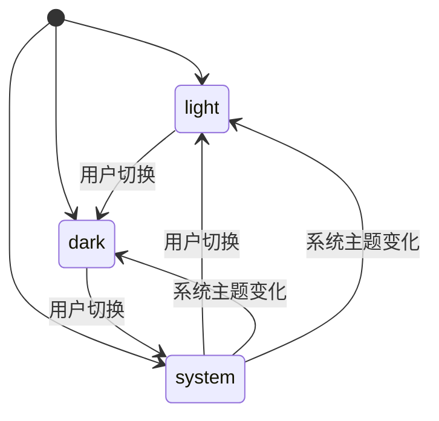

**图表来源**
- [src/lib/theme/ThemeProvider.tsx:8-9](file://src/lib/theme/ThemeProvider.tsx#L8-L9)
- [src/lib/theme/ThemeProvider.tsx:52-53](file://src/lib/theme/ThemeProvider.tsx#L52-L53)
- [src/lib/theme/ThemeProvider.tsx:64-72](file://src/lib/theme/ThemeProvider.tsx#L64-L72)

#### 主题初始化流程
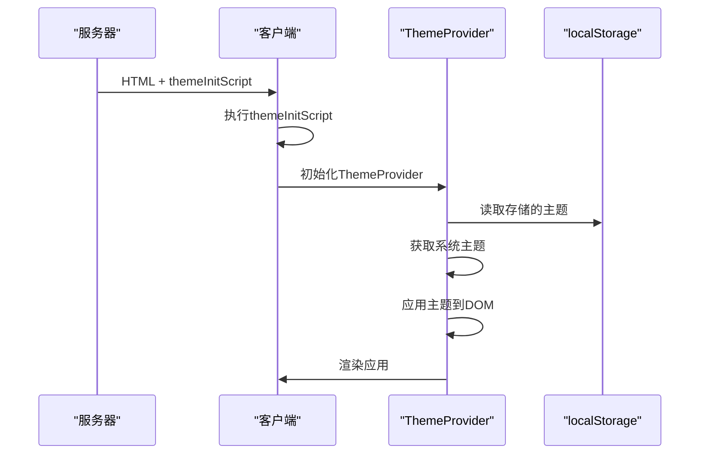

**图表来源**
- [src/lib/theme/theme-init-script.ts:1-7](file://src/lib/theme/theme-init-script.ts#L1-L7)
- [src/lib/theme/ThemeProvider.tsx:54-61](file://src/lib/theme/ThemeProvider.tsx#L54-L61)

**章节来源**
- [src/lib/theme/ThemeProvider.tsx:45-106](file://src/lib/theme/ThemeProvider.tsx#L45-L106)

### themeInitScript 初始化脚本
themeInitScript是一个阻塞内联脚本，用于防止主题闪烁（FOUC），在布局组件中通过next/script以beforeInteractive策略注入。

#### 核心特性
- **阻塞执行**：防止主题闪烁
- **服务器组件友好**：必须是原始字符串，不能在"use client"模块中
- **错误处理**：使用try-catch确保脚本安全
- **快速应用**：在DOM构建时立即应用主题

#### 执行流程
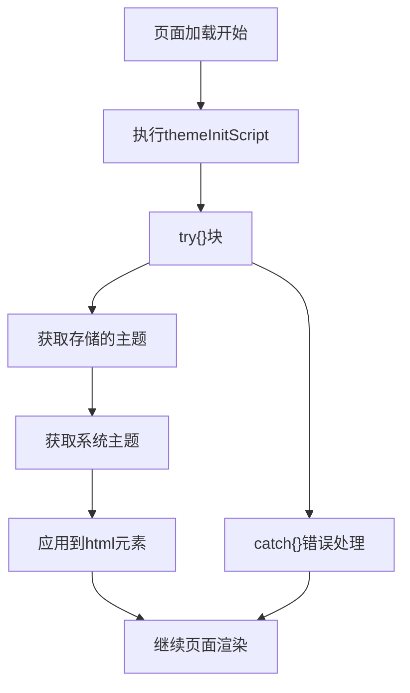

**图表来源**
- [src/lib/theme/theme-init-script.ts:1-7](file://src/lib/theme/theme-init-script.ts#L1-L7)

**章节来源**
- [src/lib/theme/theme-init-script.ts:1-7](file://src/lib/theme/theme-init-script.ts#L1-L7)

### useIsClient 客户端检测钩子
useIsClient钩子用于检测组件是否在客户端环境中运行，确保SSR兼容性。

#### 核心功能
- **SSR兼容**：在服务器端渲染时不执行客户端特定逻辑
- **状态管理**：使用useState跟踪客户端状态
- **副作用处理**：在useEffect中设置客户端标志
- **简单易用**：提供单一boolean值判断

#### 使用场景
- 主题切换按钮（ThemeToggle）
- 依赖浏览器API的组件
- 仅在客户端显示的内容
- 需要访问window对象的组件

**章节来源**
- [src/lib/hooks/useIsClient.ts:1-9](file://src/lib/hooks/useIsClient.ts#L1-L9)

## 客户端检测钩子

### useIsClient Hook详解
useIsClient是一个简单的客户端检测钩子，通过React的状态管理来判断组件是否在客户端环境中运行。

#### 实现原理
- 使用useState初始化isClient为false
- 在useEffect中将isClient设置为true
- 返回当前的客户端状态

#### 性能考虑
- **零成本**：仅在组件挂载时执行一次
- **内存友好**：只存储一个boolean值
- **无副作用**：不会影响组件的其他功能

#### 最佳实践
- 在需要客户端特定功能的组件中使用
- 避免在服务器端渲染时访问浏览器API
- 与Suspense配合使用，提供更好的用户体验

**章节来源**
- [src/lib/hooks/useIsClient.ts:1-9](file://src/lib/hooks/useIsClient.ts#L1-L9)

## Google Analytics集成

### GoogleAnalyticsScripts 组件
GoogleAnalyticsScripts组件提供了Google Analytics 4的集成方案，支持隐私保护和条件加载。

#### 核心功能
- **条件加载**：只有当NEXT_PUBLIC_GA_ID有效时才加载
- **隐私保护**：自动截断长字符串，不记录文件名
- **GA4支持**：使用最新的Google Analytics 4实现
- **策略配置**：使用afterInteractive策略优化性能

#### GA ID验证流程
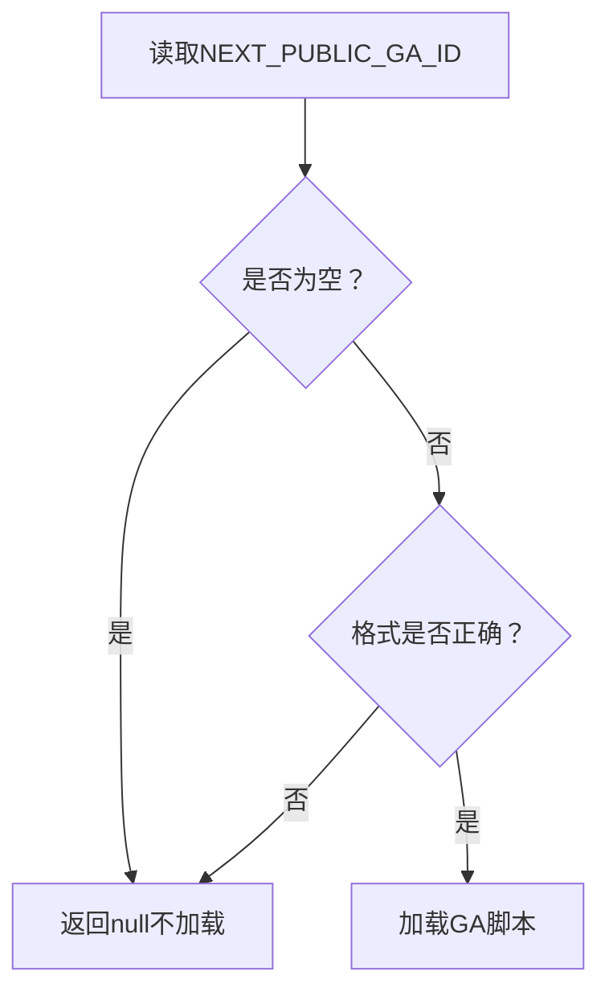

**图表来源**
- [src/components/shared/GoogleAnalyticsScripts.tsx:3-4](file://src/components/shared/GoogleAnalyticsScripts.tsx#L3-L4)
- [src/components/shared/GoogleAnalyticsScripts.tsx:6-8](file://src/components/shared/GoogleAnalyticsScripts.tsx#L6-L8)

#### 事件追踪系统
analytics.ts提供了完整的事件追踪系统，支持多种事件类型和参数验证。

##### 支持的事件类型
- **文件处理**：file_upload、file_download、process_complete、process_error
- **用户交互**：copy_click、search_open、search_query、search_select
- **导航行为**：related_tool_click、faq_expand、share_click
- **系统设置**：theme_change、language_change

##### 参数验证机制
- **隐私保护**：自动截断敏感字段（错误信息、查询词）
- **类型安全**：使用TypeScript接口确保参数正确性
- **可选参数**：根据事件类型提供相应的参数接口

**章节来源**
- [src/components/shared/GoogleAnalyticsScripts.tsx:1-21](file://src/components/shared/GoogleAnalyticsScripts.tsx#L1-L21)
- [src/lib/analytics.ts:106-137](file://src/lib/analytics.ts#L106-L137)

## 工具页面客户端组件

### ToolPageClient 组件
ToolPageClient是工具页面的客户端组件，专门处理工具页面的懒加载和性能优化。

#### 核心功能
- **懒加载**：使用React.lazy动态导入工具组件
- **稳定缓存**：通过lazyCache确保组件实例稳定
- **骨架屏**：提供加载时的骨架屏显示
- **Suspense支持**：与React Suspense无缝集成

#### 懒加载缓存机制
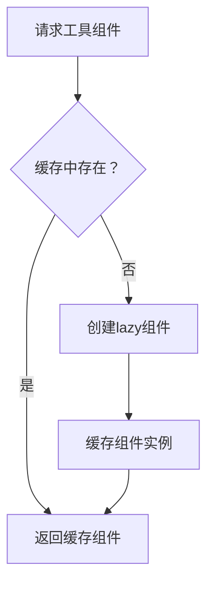

**图表来源**
- [src/app/[locale]/tools/[category]/[slug]/ToolPageClient.tsx:28-37](file://src/app/[locale]/tools/[category]/[slug]/ToolPageClient.tsx#L28-L37)

#### 性能优化策略
- **组件稳定化**：使用Map缓存确保组件实例不重复创建
- **异步加载**：工具组件异步加载，减少初始包大小
- **骨架屏**：提供良好的加载体验
- **错误边界**：处理组件加载失败的情况

**章节来源**
- [src/app/[locale]/tools/[category]/[slug]/ToolPageClient.tsx:39-62](file://src/app/[locale]/tools/[category]/[slug]/ToolPageClient.tsx#L39-L62)

## 新增对话框系统

### Dialog 组件系统
Dialog组件系统提供了完整的模态对话框解决方案，包含焦点陷阱、ESC键处理和多层对话框支持。

#### Dialog 容器组件
- 属性接口：open（布尔值）、onOpenChange（回调函数）、children
- 关键功能：全局滚动锁定、多层对话框计数、上下文提供者
- 状态管理：使用useId生成唯一标题ID，跟踪打开计数

#### DialogOverlay 组件
- 功能：半透明背景遮罩，点击关闭对话框
- 样式：固定定位、z-index层级、淡入动画

#### DialogContent 组件
- 属性接口：children、className、onClose
- 关键功能：焦点陷阱集成、ESC键监听、Portal渲染到body
- 可访问性：role="dialog"、aria-modal、aria-labelledby

#### DialogHeader 组件
- 功能：对话框头部容器，用于放置标题和关闭按钮

#### DialogTitle 组件
- 属性接口：children、className、id
- 功能：对话框标题，自动生成唯一ID并与content关联

#### DialogClose 组件
- 属性接口：className、aria-label
- 功能：标准关闭按钮，使用X图标

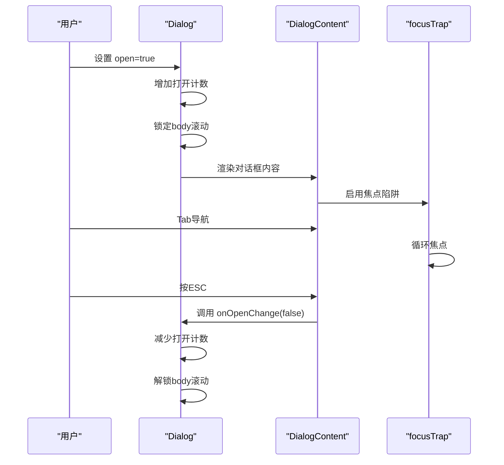

**图表来源**
- [src/components/ui/Dialog.tsx:31-60](file://src/components/ui/Dialog.tsx#L31-L60)
- [src/components/ui/Dialog.tsx:88-122](file://src/components/ui/Dialog.tsx#L88-L122)
- [src/lib/utils/focusTrap.ts:47-77](file://src/lib/utils/focusTrap.ts#L47-L77)

**章节来源**
- [src/components/ui/Dialog.tsx:25-176](file://src/components/ui/Dialog.tsx#L25-L176)

### Toast 通知系统
Toast提供了全局通知功能，支持多种类型和自动消失机制。

#### Toast API
- 类型：success、error、info、warning
- 方法：toast.success()、toast.error()、toast.info()、toast.warning()、toast.dismiss()
- 配置：消息文本、持续时间（毫秒）

#### ToastContainer 组件
- 功能：全局通知容器，固定在右下角
- 特性：自动消失、手动关闭、动画效果
- 样式：基于通知类型的颜色主题

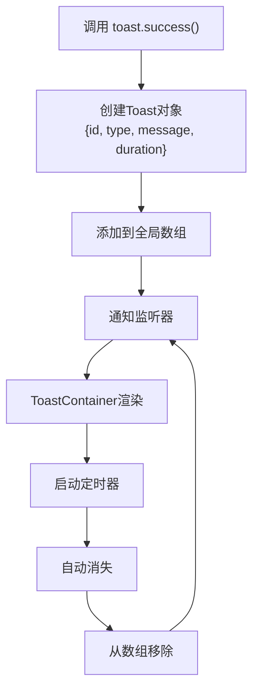

**图表来源**
- [src/components/ui/Toast.tsx:23-50](file://src/components/ui/Toast.tsx#L23-L50)
- [src/components/ui/Toast.tsx:70-110](file://src/components/ui/Toast.tsx#L70-L110)

**章节来源**
- [src/components/ui/Toast.tsx:7-111](file://src/components/ui/Toast.tsx#L7-L111)

### Tooltip 悬浮提示
Tooltip提供了轻量级的悬浮提示功能，支持多种位置和无障碍访问。

#### Tooltip 组件
- 属性接口：children、content、placement、className
- 支持位置：top、bottom、left、right
- 事件处理：鼠标悬停、键盘聚焦、自动隐藏

#### 样式系统
- 基于placement的定位类映射
- 箭头位置与主容器位置对应
- 动画效果：淡入缩放

**章节来源**
- [src/components/ui/Tooltip.tsx:6-64](file://src/components/ui/Tooltip.tsx#L6-L64)

## 焦点陷阱钩子

### useFocusTrap Hook
焦点陷阱钩子确保模态对话框中的焦点循环，提升可访问性。

#### 核心功能
- **焦点循环**：Tab键在可聚焦元素间循环
- **Shift+Tab**：反向循环
- **自动聚焦**：进入时聚焦第一个可聚焦元素
- **返回焦点**：退出时返回之前活动的元素

#### 可聚焦元素选择器
- 链接元素（a[href]）
- 按钮元素（button:not([disabled])）
- 输入元素（input:not([disabled])）
- 选择框（select:not([disabled])）
- 文本域（textarea:not([disabled])）
- 具有tabindex的元素

#### 实现细节
- 使用MutationObserver监听DOM变化
- 过滤aria-hidden和不可见元素
- 支持条件启用/禁用

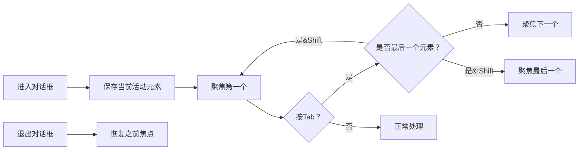

**图表来源**
- [src/lib/utils/focusTrap.ts:3-77](file://src/lib/utils/focusTrap.ts#L3-L77)

**章节来源**
- [src/lib/utils/focusTrap.ts:1-78](file://src/lib/utils/focusTrap.ts#L1-L78)

## 可访问性增强

### 现有组件的可访问性改进
- **Button组件**：完整的焦点可见性样式，支持禁用状态
- **Accordion组件**：ARIA属性支持（aria-expanded、aria-controls、role="region"）
- **Tooltip组件**：role="tooltip"、aria-describedby关联
- **Dialog组件**：完整的ARIA支持（role="dialog"、aria-modal、aria-labelledby）
- **ThemeToggle组件**：使用useIsClient确保SSR兼容性，避免hydration不匹配
- **Tabs组件**：**更新** 集成useEffect钩子改善标签注册生命周期管理，提供更好的可访问性

### 新增可访问性特性
- **焦点管理**：通过focusTrap确保焦点循环
- **键盘导航**：支持Tab、Shift+Tab、ESC键
- **屏幕阅读器**：语义化标签和描述
- **颜色对比**：符合WCAG对比度要求
- **客户端检测**：useIsClient确保SSR环境下的可访问性
- **标签注册可靠性**：**更新** useEffect钩子确保标签在正确时机注册

**章节来源**
- [src/components/ui/Button.tsx:29-38](file://src/components/ui/Button.tsx#L29-L38)
- [src/components/ui/Accordion.tsx:35-67](file://src/components/ui/Accordion.tsx#L35-L67)
- [src/components/ui/Tooltip.tsx:39-61](file://src/components/ui/Tooltip.tsx#L39-L61)
- [src/components/ui/Dialog.tsx:110-112](file://src/components/ui/Dialog.tsx#L110-L112)
- [src/components/shared/ThemeToggle.tsx:14-16](file://src/components/shared/ThemeToggle.tsx#L14-L16)
- [src/components/ui/Tabs.tsx:89-91](file://src/components/ui/Tabs.tsx#L89-L91)

## 依赖关系分析
- 组件间耦合
  - MainLayout作为根容器，向下提供上下文与状态，被Header、Footer、ToolPageShell等消费
  - Dialog组件通过上下文提供者与focusTrap钩子协作
  - Toast系统通过全局状态管理实现跨组件通信
  - Tooltip组件与Button等原子组件松耦合
  - **新增** ThemeProvider为ThemeToggle提供主题上下文
  - **新增** useIsClient确保客户端检测的统一性
  - **新增** GoogleAnalyticsScripts与analytics.ts协同工作
  - **更新** Tabs组件通过useEffect钩子改善标签注册生命周期管理
- 外部依赖
  - 主题：next-themes
  - 图标：lucide-react
  - 国际化：next-intl
  - 埋点：自定义analytics工具
  - **新增** 焦点管理：React内置的useRef和useEffect
  - **新增** 脚本加载：next/script
  - **更新** 生命周期管理：React的useEffect钩子
- 样式系统
  - Tailwind CSS：原子类、变量与暗色主题
  - 全局样式：src/app/globals.css

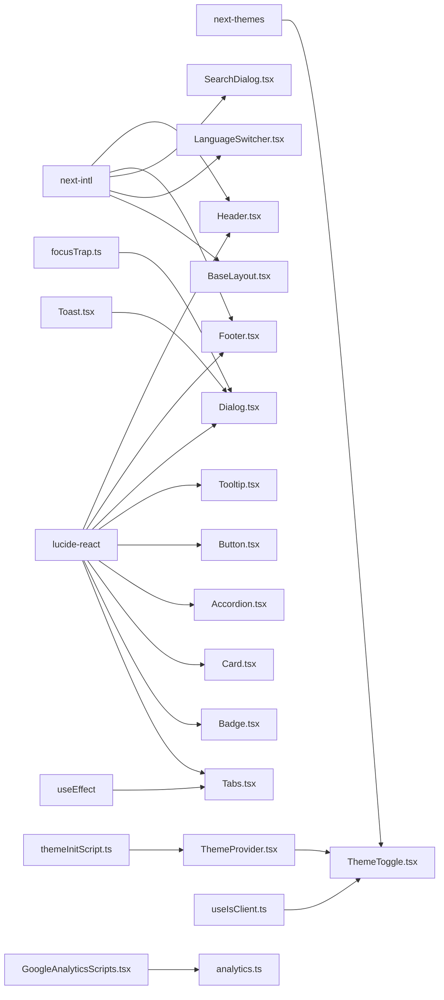

**图表来源**
- [src/components/shared/ThemeToggle.tsx:3-3](file://src/components/shared/ThemeToggle.tsx#L3-L3)
- [src/components/layout/Header.tsx:3-3](file://src/components/layout/Header.tsx#L3-L3)
- [src/components/layout/Footer.tsx:3-3](file://src/components/layout/Footer.tsx#L3-L3)
- [src/components/shared/SearchDialog.tsx:3-3](file://src/components/shared/SearchDialog.tsx#L3-L3)
- [src/components/shared/LanguageSwitcher.tsx:3-3](file://src/components/shared/LanguageSwitcher.tsx#L3-L3)
- [src/components/layout/BaseLayout.tsx:3-3](file://src/components/layout/BaseLayout.tsx#L3-L3)
- [src/components/ui/Dialog.tsx:7](file://src/components/ui/Dialog.tsx#L7)
- [src/components/ui/Toast.tsx:2](file://src/components/ui/Toast.tsx#L2)
- [src/components/ui/Tooltip.tsx:3](file://src/components/ui/Tooltip.tsx#L3)
- [src/lib/utils/focusTrap.ts:1](file://src/lib/utils/focusTrap.ts#L1)
- [src/lib/theme/ThemeProvider.tsx:1](file://src/lib/theme/ThemeProvider.tsx#L1)
- [src/lib/theme/theme-init-script.ts:1](file://src/lib/theme/theme-init-script.ts#L1)
- [src/lib/hooks/useIsClient.ts:1](file://src/lib/hooks/useIsClient.ts#L1)
- [src/components/shared/GoogleAnalyticsScripts.tsx:1](file://src/components/shared/GoogleAnalyticsScripts.tsx#L1)
- [src/lib/analytics.ts:1](file://src/lib/analytics.ts#L1)
- [src/components/ui/Tabs.tsx:4](file://src/components/ui/Tabs.tsx#L4)
- [src/components/ui/Tabs.tsx:89-91](file://src/components/ui/Tabs.tsx#L89-L91)

**章节来源**
- [package.json](file://package.json)

## 性能考量
- 拖拽与键盘事件
  - 使用useCallback稳定回调，避免不必要的重渲染
  - 搜索对话框使用防抖延迟上报查询事件
- 渲染优化
  - useMemo对工具导航数据进行分组缓存
  - Header与Footer中的分类/工具列表按需展开
  - **新增** Dialog使用Portal减少DOM层级深度
  - **新增** ToolPageClient使用懒加载缓存提升性能
  - **更新** Tabs组件通过useEffect钩子改善标签注册生命周期管理，减少不必要的重新渲染
- 动画与阴影
  - 合理使用CSS变量与过渡，避免过度阴影导致的重排
  - **新增** Toast使用transform动画提升性能
- 文件处理
  - FileDropzone在客户端过滤超大文件，减少无效处理
  - DownloadButton及时回收Object URL
- **新增** 焦点陷阱性能
  - 使用requestAnimationFrame优化首次聚焦
  - 智能选择器过滤不可见元素
- **新增** 主题系统性能
  - themeInitScript阻塞执行防止FOUC
  - localStorage持久化避免重复计算
  - storage事件监听跨标签页同步
- **新增** 客户端检测性能
  - useIsClient零成本检测
  - 仅在客户端执行的组件避免SSR开销
- **更新** Tabs组件性能优化
  - useEffect钩子确保标签在正确时机注册，避免重复注册
  - 减少组件挂载时的副作用调用
  - 更好的生命周期管理提升整体性能

## 故障排查指南
- 搜索对话框无法打开
  - 检查MainLayout是否正确传递open与onClose
  - 确认全局快捷键未被其他监听覆盖
- 分类下拉菜单不关闭
  - 检查鼠标离开/进入事件与延时关闭逻辑
- 下载失败或文件名异常
  - 确认传入data类型与filename；检查品牌命名函数
- 主题切换无效果
  - 检查next-themes配置与系统偏好
  - 确认ThemeProvider正确包裹应用
  - 验证localStorage访问权限
- 复制按钮无反馈
  - 检查navigator.clipboard可用性与权限
- **新增** 对话框问题
  - 焦点无法正确循环：检查容器内是否存在可聚焦元素
  - ESC键无效：确认对话框处于打开状态
  - 多层对话框冲突：检查openCount计数
- **新增** Toast问题
  - 通知不显示：确认ToastContainer已渲染
  - 自动消失过快：调整duration参数
  - 无法手动关闭：检查dismiss函数调用
- **新增** Tooltip问题
  - 提示不显示：检查children是否为可聚焦元素
  - 位置错误：确认placement参数正确
- **新增** 主题系统问题
  - FOUC现象：检查themeInitScript是否正确注入
  - 主题不持久：验证localStorage写入权限
  - 跨标签页不同步：检查storage事件监听
- **新增** 客户端检测问题
  - SSR渲染异常：确认useIsClient钩子使用正确
  - 组件闪烁：检查客户端特定逻辑的条件渲染
- **新增** Google Analytics问题
  - GA脚本不加载：确认NEXT_PUBLIC_GA_ID环境变量设置
  - 事件追踪失败：检查analytics.ts中的事件参数类型
- **更新** Tabs组件问题
  - 标签不显示：检查useEffect钩子是否正确执行
  - 键盘导航失效：确认values数组正确更新
  - 切换不生效：检查registerValue函数调用时机
  - 性能问题：验证useEffect依赖数组配置

**章节来源**
- [src/components/shared/SearchDialog.tsx:64-96](file://src/components/shared/SearchDialog.tsx#L64-L96)
- [src/components/layout/Header.tsx:46-52](file://src/components/layout/Header.tsx#L46-L52)
- [src/components/shared/DownloadButton.tsx:27-36](file://src/components/shared/DownloadButton.tsx#L27-L36)
- [src/components/shared/ThemeToggle.tsx:21-23](file://src/components/shared/ThemeToggle.tsx#L21-L23)
- [src/components/shared/CopyButton.tsx:23-30](file://src/components/shared/CopyButton.tsx#L23-L30)
- [src/components/ui/Dialog.tsx:35-53](file://src/components/ui/Dialog.tsx#L35-L53)
- [src/components/ui/Toast.tsx:23-50](file://src/components/ui/Toast.tsx#L23-L50)
- [src/components/ui/Tooltip.tsx:27-63](file://src/components/ui/Tooltip.tsx#L27-L63)
- [src/lib/theme/ThemeProvider.tsx:86-90](file://src/lib/theme/ThemeProvider.tsx#L86-L90)
- [src/lib/theme/theme-init-script.ts:1-7](file://src/lib/theme/theme-init-script.ts#L1-L7)
- [src/lib/hooks/useIsClient.ts:1-9](file://src/lib/hooks/useIsClient.ts#L1-L9)
- [src/components/shared/GoogleAnalyticsScripts.tsx:3-4](file://src/components/shared/GoogleAnalyticsScripts.tsx#L3-L4)
- [src/components/ui/Tabs.tsx:89-91](file://src/components/ui/Tabs.tsx#L89-L91)

## 结论
该UI组件系统以清晰的分层设计与强复用的共享组件为核心，结合国际化、主题与埋点，形成一致且可扩展的前端体验。**最新更新**引入的主题提供者系统、客户端检测钩子、Google Analytics脚本组件等增强功能，显著提升了主题管理、客户端兼容性和数据分析能力。**特别更新** Tabs组件通过useEffect钩子集成到标签注册系统中，改善了组件生命周期管理，使标签注册更加可靠和高效，显著提升了组件的稳定性和性能表现。主题提供者系统通过ThemeProvider实现了完整的主题状态管理，包括持久化存储、系统主题同步和跨标签页同步；客户端检测钩子useIsClient确保了SSR环境下的兼容性；Google Analytics集成提供了完整的用户行为追踪和隐私保护。通过合理的事件与状态管理、Tailwind CSS样式体系与响应式布局，组件在可用性、可访问性与性能方面均具备良好表现。建议在新增组件时遵循现有模式：明确职责边界、使用上下文与国际化、统一样式与可访问性规范，并配套埋点与测试。

## 附录

### 样式系统与主题
- Tailwind CSS：通过原子类与变量实现主题一致性
- 自定义主题支持：next-themes提供light/dark/system三态切换
- 全局样式：src/app/globals.css集中管理基础样式与变量
- **新增** 主题初始化：themeInitScript防止FOUC

**章节来源**
- [src/app/globals.css](file://src/app/globals.css)
- [src/components/shared/ThemeToggle.tsx:9-35](file://src/components/shared/ThemeToggle.tsx#L9-L35)
- [src/lib/theme/theme-init-script.ts:1-7](file://src/lib/theme/theme-init-script.ts#L1-L7)

### 可访问性与响应式布局
- 可访问性：按钮aria-label、键盘导航、焦点环、语义化标签、ARIA属性
- 响应式布局：移动端优先、断点适配、网格与弹性布局
- **新增** 焦点管理：完整的键盘导航支持
- **新增** SSR兼容：useIsClient确保服务器端渲染兼容性
- **更新** Tabs组件：**更新** useEffect钩子确保标签注册的可访问性

**章节来源**
- [src/components/layout/Header.tsx:58-65](file://src/components/layout/Header.tsx#L58-L65)
- [src/components/layout/Footer.tsx:79-83](file://src/components/layout/Footer.tsx#L79-L83)
- [src/components/ui/Accordion.tsx:35-67](file://src/components/ui/Accordion.tsx#L35-L67)
- [src/lib/hooks/useIsClient.ts:1-9](file://src/lib/hooks/useIsClient.ts#L1-L9)
- [src/components/ui/Tabs.tsx:89-91](file://src/components/ui/Tabs.tsx#L89-L91)

### 使用示例与最佳实践
- 组合使用
  - 在工具页面使用ToolPageShell包裹业务组件
  - 使用FileDropzone与DownloadButton配合处理文件
  - 使用SearchDialog提升工具发现效率
  - **新增** 使用ThemeProvider管理应用主题
  - **新增** 使用useIsClient确保客户端功能
  - **新增** 使用GoogleAnalyticsScripts集成分析
  - **新增** 使用Dialog创建模态表单或确认对话框
  - **新增** 使用Toast提供操作反馈
  - **新增** 使用Tooltip增强图标和按钮的可理解性
  - **更新** 使用Tabs组件时，利用useEffect钩子改善标签注册生命周期管理
- 扩展建议
  - 新增共享组件时保持属性简洁、事件可控、样式可定制
  - 为关键交互添加埋点，便于后续优化
  - **新增** 优先考虑可访问性设计
  - **新增** 使用焦点陷阱确保模态对话框的可访问性
  - **新增** 考虑SSR兼容性的客户端检测需求
  - **更新** 在实现类似Tabs组件时，考虑使用useEffect钩子改善生命周期管理

### 测试策略与维护方法
- 单元测试：针对纯函数与Hook（如格式化、过滤、焦点陷阱、主题切换）编写测试
- 集成测试：模拟用户交互（拖拽、键盘、点击、焦点管理），验证状态与事件
- 可访问性测试：使用屏幕阅读器与键盘导航验证，特别是对话框和Tooltip
- 性能测试：测试大量Toast同时出现的性能影响，懒加载组件的加载性能
- 维护方法：版本化变更记录、组件API稳定性检查、样式变量集中管理
- **新增** 主题系统测试：验证主题切换、持久化、跨标签页同步
- **新增** 客户端检测测试：验证SSR环境下的兼容性
- **新增** Google Analytics测试：验证事件追踪、隐私保护、条件加载
- **新增** 焦点陷阱测试：验证焦点循环、键盘导航、ESC键处理
- **新增** 多层对话框测试：验证滚动锁定和计数器正确性
- **更新** Tabs组件测试：验证useEffect钩子的标签注册生命周期管理，确保标签在正确时机注册
- **更新** 生命周期管理测试：验证组件挂载、更新、卸载过程中的状态一致性