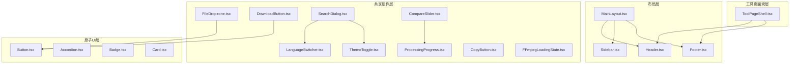
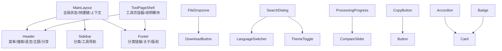
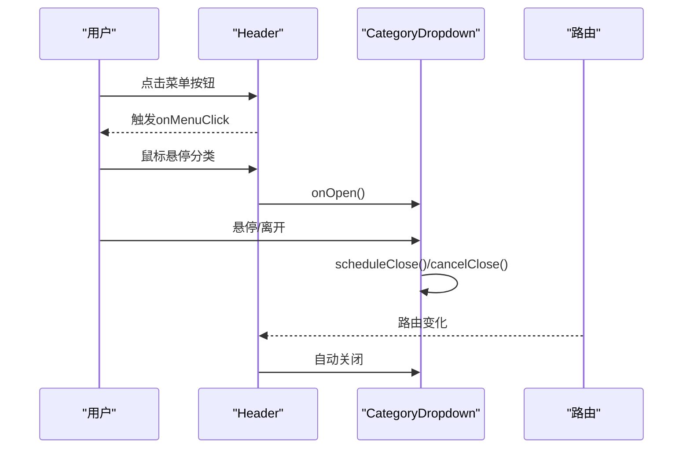
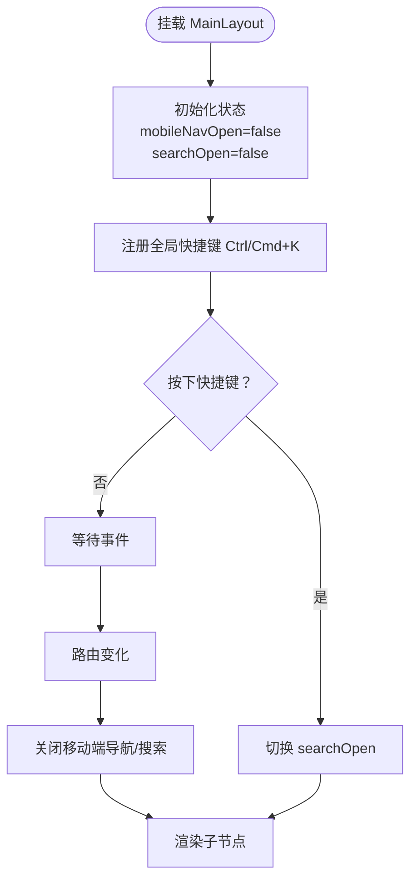
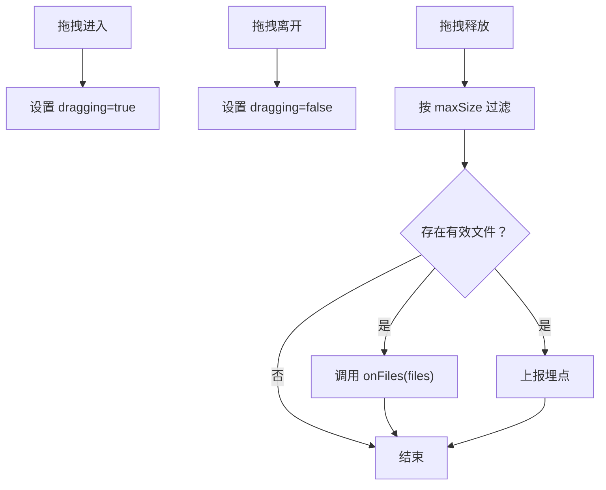
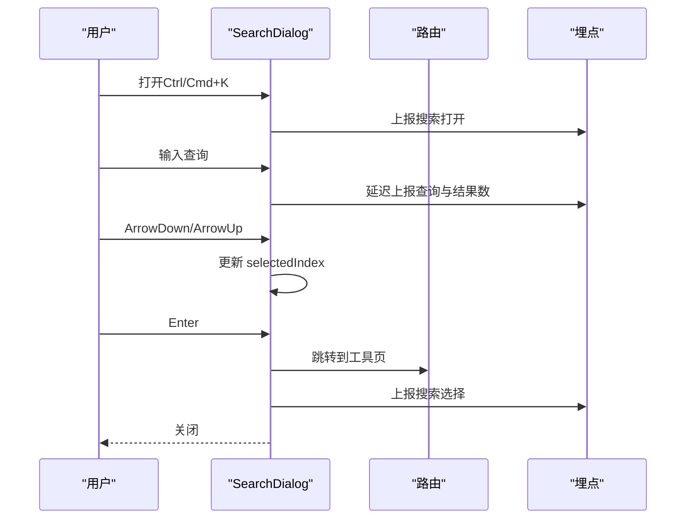
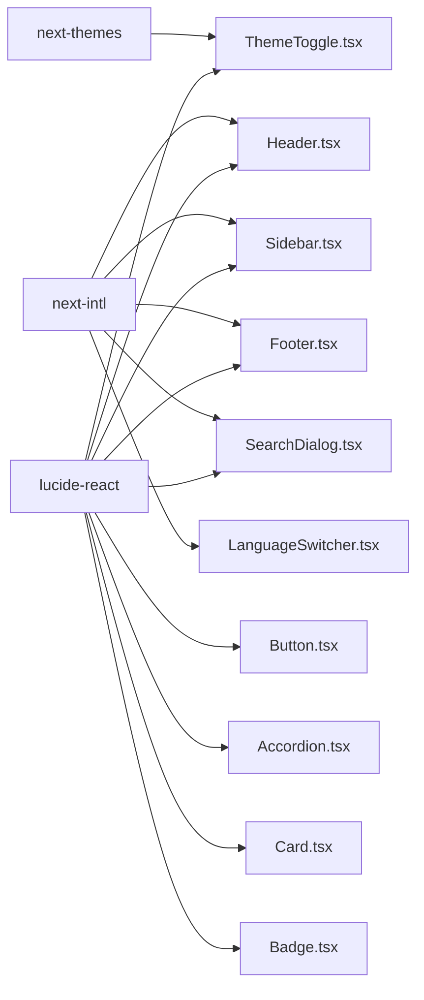

# UI组件系统

<cite>
**本文引用的文件**
- [src/components/layout/Header.tsx](file://src/components/layout/Header.tsx)
- [src/components/layout/Sidebar.tsx](file://src/components/layout/Sidebar.tsx)
- [src/components/layout/Footer.tsx](file://src/components/layout/Footer.tsx)
- [src/components/layout/MainLayout.tsx](file://src/components/layout/MainLayout.tsx)
- [src/components/shared/FileDropzone.tsx](file://src/components/shared/FileDropzone.tsx)
- [src/components/shared/DownloadButton.tsx](file://src/components/shared/DownloadButton.tsx)
- [src/components/shared/ThemeToggle.tsx](file://src/components/shared/ThemeToggle.tsx)
- [src/components/shared/LanguageSwitcher.tsx](file://src/components/shared/LanguageSwitcher.tsx)
- [src/components/shared/ProcessingProgress.tsx](file://src/components/shared/ProcessingProgress.tsx)
- [src/components/shared/FFmpegLoadingState.tsx](file://src/components/shared/FFmpegLoadingState.tsx)
- [src/components/shared/SearchDialog.tsx](file://src/components/shared/SearchDialog.tsx)
- [src/components/shared/CompareSlider.tsx](file://src/components/shared/CompareSlider.tsx)
- [src/components/shared/CopyButton.tsx](file://src/components/shared/CopyButton.tsx)
- [src/components/ui/Button.tsx](file://src/components/ui/Button.tsx)
- [src/components/ui/Accordion.tsx](file://src/components/ui/Accordion.tsx)
- [src/components/ui/Badge.tsx](file://src/components/ui/Badge.tsx)
- [src/components/ui/Card.tsx](file://src/components/ui/Card.tsx)
- [src/components/tool/ToolPageShell.tsx](file://src/components/tool/ToolPageShell.tsx)
- [src/app/globals.css](file://src/app/globals.css)
- [package.json](file://package.json)
</cite>

## 目录
1. [简介](#简介)
2. [项目结构](#项目结构)
3. [核心组件](#核心组件)
4. [架构总览](#架构总览)
5. [详细组件分析](#详细组件分析)
6. [依赖关系分析](#依赖关系分析)
7. [性能考量](#性能考量)
8. [故障排查指南](#故障排查指南)
9. [结论](#结论)
10. [附录](#附录)

## 简介
本文件系统化梳理媒体工具箱的UI组件体系，覆盖布局组件（Header、Sidebar、Footer）、共享组件（文件上传、下载、进度、搜索、切换语言与主题等）以及基础UI原子（Button、Card、Badge、Accordion）。文档从架构设计、层次职责、数据与事件流、样式系统（Tailwind CSS与主题）、可访问性与响应式布局、使用示例与最佳实践、测试策略与维护方法等方面进行深入解析，帮助UI开发者与工具开发者高效理解与扩展组件库。

## 项目结构
组件按功能域分层组织：
- 布局层：负责全局导航与页脚信息呈现
- 工具页面壳层：封装工具页面的通用结构与文案
- 共享组件层：跨页面复用的功能型组件
- 原子UI层：最小可复用UI元素

图表来源
- [src/components/layout/MainLayout.tsx:16-56](file://src/components/layout/MainLayout.tsx#L16-L56)
- [src/components/layout/Header.tsx:21-116](file://src/components/layout/Header.tsx#L21-L116)
- [src/components/layout/Sidebar.tsx:27-112](file://src/components/layout/Sidebar.tsx#L27-L112)
- [src/components/layout/Footer.tsx:44-114](file://src/components/layout/Footer.tsx#L44-L114)
- [src/components/tool/ToolPageShell.tsx:15-53](file://src/components/tool/ToolPageShell.tsx#L15-L53)
- [src/components/shared/FileDropzone.tsx:42-143](file://src/components/shared/FileDropzone.tsx#L42-L143)
- [src/components/shared/DownloadButton.tsx:18-53](file://src/components/shared/DownloadButton.tsx#L18-L53)
- [src/components/shared/ProcessingProgress.tsx:14-46](file://src/components/shared/ProcessingProgress.tsx#L14-L46)
- [src/components/shared/SearchDialog.tsx:24-188](file://src/components/shared/SearchDialog.tsx#L24-L188)
- [src/components/shared/LanguageSwitcher.tsx:15-73](file://src/components/shared/LanguageSwitcher.tsx#L15-L73)
- [src/components/shared/ThemeToggle.tsx:9-35](file://src/components/shared/ThemeToggle.tsx#L9-L35)
- [src/components/shared/CompareSlider.tsx:14-109](file://src/components/shared/CompareSlider.tsx#L14-L109)
- [src/components/shared/CopyButton.tsx:9-56](file://src/components/shared/CopyButton.tsx#L9-L56)
- [src/components/shared/FFmpegLoadingState.tsx:6-19](file://src/components/shared/FFmpegLoadingState.tsx#L6-L19)
- [src/components/ui/Button.tsx:27-41](file://src/components/ui/Button.tsx#L27-L41)
- [src/components/ui/Accordion.tsx:7-62](file://src/components/ui/Accordion.tsx#L7-L62)
- [src/components/ui/Badge.tsx:16-27](file://src/components/ui/Badge.tsx#L16-L27)
- [src/components/ui/Card.tsx:4-32](file://src/components/ui/Card.tsx#L4-L32)

章节来源
- [src/components/layout/MainLayout.tsx:16-56](file://src/components/layout/MainLayout.tsx#L16-L56)
- [src/components/layout/Header.tsx:21-116](file://src/components/layout/Header.tsx#L21-L116)
- [src/components/layout/Sidebar.tsx:27-112](file://src/components/layout/Sidebar.tsx#L27-L112)
- [src/components/layout/Footer.tsx:44-114](file://src/components/layout/Footer.tsx#L44-L114)
- [src/components/tool/ToolPageShell.tsx:15-53](file://src/components/tool/ToolPageShell.tsx#L15-L53)

## 核心组件
- 布局组件
  - Header：移动端菜单按钮、站点Logo、桌面分类下拉导航、全局搜索触发、语言切换、主题切换、分享按钮
  - Sidebar：首页与工具入口、分类与工具列表、当前路径高亮
  - Footer：品牌信息、分类链接网格、关于与隐私链接、版权信息
  - MainLayout：全局状态（移动端导航、搜索对话框开关）、快捷键监听、工具导航上下文提供者
- 工具页面壳组件
  - ToolPageShell：工具标题、描述、本地处理指示、容器卡片、工具说明与特性模块
- 共享组件
  - FileDropzone：拖拽/点击上传、格式与大小提示、隐私提示、埋点上报
  - DownloadButton：Blob或DataURL下载、品牌命名、埋点上报
  - ProcessingProgress：确定/不确定进度条、百分比显示
  - SearchDialog：全局Ctrl+K打开、输入过滤、键盘导航、结果跳转、埋点
  - LanguageSwitcher：多语言切换、点击外部关闭、埋点
  - ThemeToggle：三态切换（浅色/深色/系统）、无障碍标签、埋点
  - CompareSlider：前后对比滑块、保存比例提示
  - CopyButton：复制到剪贴板、成功反馈、埋点
  - FFmpegLoadingState：加载中状态指示
- 原子UI
  - Button：变体与尺寸、渐变阴影、禁用态、焦点环
  - Accordion：手风琴项、展开/收起动画、图标旋转
  - Badge：默认/次级/描边变体
  - Card：卡片容器、悬停阴影、过渡动画

章节来源
- [src/components/layout/Header.tsx:15-116](file://src/components/layout/Header.tsx#L15-L116)
- [src/components/layout/Sidebar.tsx:22-112](file://src/components/layout/Sidebar.tsx#L22-L112)
- [src/components/layout/Footer.tsx:13-114](file://src/components/layout/Footer.tsx#L13-L114)
- [src/components/layout/MainLayout.tsx:11-56](file://src/components/layout/MainLayout.tsx#L11-L56)
- [src/components/tool/ToolPageShell.tsx:10-53](file://src/components/tool/ToolPageShell.tsx#L10-L53)
- [src/components/shared/FileDropzone.tsx:9-143](file://src/components/shared/FileDropzone.tsx#L9-L143)
- [src/components/shared/DownloadButton.tsx:10-53](file://src/components/shared/DownloadButton.tsx#L10-L53)
- [src/components/shared/ProcessingProgress.tsx:6-46](file://src/components/shared/ProcessingProgress.tsx#L6-L46)
- [src/components/shared/SearchDialog.tsx:18-188](file://src/components/shared/SearchDialog.tsx#L18-L188)
- [src/components/shared/LanguageSwitcher.tsx:11-73](file://src/components/shared/LanguageSwitcher.tsx#L11-L73)
- [src/components/shared/ThemeToggle.tsx:9-35](file://src/components/shared/ThemeToggle.tsx#L9-L35)
- [src/components/shared/CompareSlider.tsx:6-109](file://src/components/shared/CompareSlider.tsx#L6-L109)
- [src/components/shared/CopyButton.tsx:9-56](file://src/components/shared/CopyButton.tsx#L9-L56)
- [src/components/shared/FFmpegLoadingState.tsx:6-19](file://src/components/shared/FFmpegLoadingState.tsx#L6-L19)
- [src/components/ui/Button.tsx:7-41](file://src/components/ui/Button.tsx#L7-L41)
- [src/components/ui/Accordion.tsx:7-62](file://src/components/ui/Accordion.tsx#L7-L62)
- [src/components/ui/Badge.tsx:6-27](file://src/components/ui/Badge.tsx#L6-L27)
- [src/components/ui/Card.tsx:4-32](file://src/components/ui/Card.tsx#L4-L32)

## 架构总览
组件系统采用“布局-壳层-共享-原子”的分层设计，通过上下文与路由驱动状态，统一使用Tailwind CSS与可配置主题，结合国际化与埋点增强用户体验与可观测性。

图表来源
- [src/components/layout/MainLayout.tsx:35-54](file://src/components/layout/MainLayout.tsx#L35-L54)
- [src/components/layout/Header.tsx:54-114](file://src/components/layout/Header.tsx#L54-L114)
- [src/components/layout/Sidebar.tsx:42-111](file://src/components/layout/Sidebar.tsx#L42-L111)
- [src/components/layout/Footer.tsx:58-112](file://src/components/layout/Footer.tsx#L58-L112)
- [src/components/tool/ToolPageShell.tsx:19-51](file://src/components/tool/ToolPageShell.tsx#L19-L51)
- [src/components/shared/FileDropzone.tsx:78-142](file://src/components/shared/FileDropzone.tsx#L78-L142)
- [src/components/shared/DownloadButton.tsx:47-52](file://src/components/shared/DownloadButton.tsx#L47-L52)
- [src/components/shared/SearchDialog.tsx:120-187](file://src/components/shared/SearchDialog.tsx#L120-L187)
- [src/components/shared/LanguageSwitcher.tsx:40-72](file://src/components/shared/LanguageSwitcher.tsx#L40-L72)
- [src/components/shared/ThemeToggle.tsx:25-34](file://src/components/shared/ThemeToggle.tsx#L25-L34)
- [src/components/shared/ProcessingProgress.tsx:22-45](file://src/components/shared/ProcessingProgress.tsx#L22-L45)
- [src/components/shared/CompareSlider.tsx:50-100](file://src/components/shared/CompareSlider.tsx#L50-L100)
- [src/components/shared/CopyButton.tsx:36-55](file://src/components/shared/CopyButton.tsx#L36-L55)
- [src/components/ui/Button.tsx:27-40](file://src/components/ui/Button.tsx#L27-L40)
- [src/components/ui/Accordion.tsx:30-61](file://src/components/ui/Accordion.tsx#L30-L61)
- [src/components/ui/Card.tsx:4-32](file://src/components/ui/Card.tsx#L4-L32)
- [src/components/ui/Badge.tsx:16-27](file://src/components/ui/Badge.tsx#L16-L27)

## 详细组件分析

### 布局组件

#### Header 组件
- 职责：移动端菜单、Logo、桌面分类导航、全局搜索、语言切换、主题切换、分享
- 关键交互：分类下拉菜单、鼠标进入/离开延时关闭、路由变化自动关闭
- 可访问性：按钮含aria-label；键盘导航；动态图标旋转
- 样式：模糊背景、玻璃态、响应式布局

图表来源
- [src/components/layout/Header.tsx:41-52](file://src/components/layout/Header.tsx#L41-L52)
- [src/components/layout/Header.tsx:118-241](file://src/components/layout/Header.tsx#L118-L241)

章节来源
- [src/components/layout/Header.tsx:15-116](file://src/components/layout/Header.ts#L15-L116)

#### Sidebar 组件
- 职责：侧边导航、分类与工具列表、当前路径高亮
- 关键逻辑：根据当前路径判断激活状态；嵌套显示工具列表
- 样式：固定宽度、滚动区域、悬停高亮

章节来源
- [src/components/layout/Sidebar.tsx:22-112](file://src/components/layout/Sidebar.tsx#L22-L112)

#### Footer 组件
- 职责：品牌信息、分类链接网格、关于与隐私、版权
- 关键逻辑：按分类聚合工具，限制展示数量
- 样式：栅格布局、响应式排列

章节来源
- [src/components/layout/Footer.tsx:13-114](file://src/components/layout/Footer.tsx#L13-L114)

#### MainLayout 组件
- 职责：承载Header/Footer、工具导航上下文、移动端导航与搜索对话框、全局快捷键
- 关键交互：Ctrl/Cmd+K打开搜索；点击遮罩关闭；路由变化关闭面板
- 状态：mobileNavOpen/searchOpen

图表来源
- [src/components/layout/MainLayout.tsx:16-56](file://src/components/layout/MainLayout.tsx#L16-L56)

章节来源
- [src/components/layout/MainLayout.tsx:11-56](file://src/components/layout/MainLayout.tsx#L11-L56)

### 工具页面壳组件

#### ToolPageShell 组件
- 职责：工具页统一外壳、本地处理指示、容器卡片、工具说明与特性模块
- 关键逻辑：读取工具国际化文案；渲染说明、特性、为什么选择、描述等模块

章节来源
- [src/components/tool/ToolPageShell.tsx:10-53](file://src/components/tool/ToolPageShell.tsx#L10-L53)

### 共享组件

#### FileDropzone 组件
- 属性接口：accept、multiple、onFiles、maxSize、className、analyticsSlug、analyticsCategory
- 事件与状态：拖拽进入/离开/释放；过滤超大文件；统计文件类型与数量上报
- 样式：高亮发光、隐私锁图标提示

图表来源
- [src/components/shared/FileDropzone.tsx:55-76](file://src/components/shared/FileDropzone.tsx#L55-L76)

章节来源
- [src/components/shared/FileDropzone.tsx:9-143](file://src/components/shared/FileDropzone.tsx#L9-L143)

#### DownloadButton 组件
- 属性接口：data（Blob或URL）、filename、className、analyticsSlug、analyticsCategory
- 事件与状态：点击下载、品牌命名、回收Object URL、埋点上报

章节来源
- [src/components/shared/DownloadButton.tsx:10-53](file://src/components/shared/DownloadButton.tsx#L10-L53)

#### ProcessingProgress 组件
- 属性接口：progress（0-100或未定义）、label、className
- 事件与状态：确定/不确定进度条、百分比显示

章节来源
- [src/components/shared/ProcessingProgress.tsx:6-46](file://src/components/shared/ProcessingProgress.tsx#L6-L46)

#### SearchDialog 组件
- 属性接口：open、onClose、toolNavData
- 事件与状态：输入过滤、键盘上下移动、回车选中、Esc关闭、点击遮罩关闭
- 埋点：打开、查询、结果数、选择

图表来源
- [src/components/shared/SearchDialog.tsx:64-96](file://src/components/shared/SearchDialog.tsx#L64-L96)
- [src/components/shared/SearchDialog.tsx:100-118](file://src/components/shared/SearchDialog.tsx#L100-L118)
- [src/components/shared/SearchDialog.tsx:45-61](file://src/components/shared/SearchDialog.tsx#L45-L61)

章节来源
- [src/components/shared/SearchDialog.tsx:18-188](file://src/components/shared/SearchDialog.tsx#L18-L188)

#### LanguageSwitcher 组件
- 属性接口：dropdownDirection（up/down）
- 事件与状态：点击切换、点击外部关闭、写入locale到localStorage、路由跳转

章节来源
- [src/components/shared/LanguageSwitcher.tsx:11-73](file://src/components/shared/LanguageSwitcher.tsx#L11-L73)

#### ThemeToggle 组件
- 事件与状态：三态切换、无障碍标签、埋点上报

章节来源
- [src/components/shared/ThemeToggle.tsx:9-35](file://src/components/shared/ThemeToggle.tsx#L9-L35)

#### CompareSlider 组件
- 属性接口：beforeSrc、afterSrc、beforeLabel、afterLabel、savedPercent
- 事件与状态：指针拖拽计算位置、clipPath裁剪、保存比例提示

章节来源
- [src/components/shared/CompareSlider.tsx:6-109](file://src/components/shared/CompareSlider.tsx#L6-L109)

#### CopyButton 组件
- 属性接口：text、className、analyticsSlug、analyticsCategory
- 事件与状态：复制到剪贴板、2秒内成功反馈、埋点

章节来源
- [src/components/shared/CopyButton.tsx:9-56](file://src/components/shared/CopyButton.tsx#L9-L56)

#### FFmpegLoadingState 组件
- 事件与状态：加载中状态指示

章节来源
- [src/components/shared/FFmpegLoadingState.tsx:6-19](file://src/components/shared/FFmpegLoadingState.tsx#L6-L19)

### 原子UI组件

#### Button 组件
- 属性接口：variant（primary/secondary/ghost/outline）、size（sm/md/lg/icon）、原生button属性
- 样式：变体与尺寸映射、渐变阴影、禁用态、焦点环

章节来源
- [src/components/ui/Button.tsx:7-41](file://src/components/ui/Button.tsx#L7-L41)

#### Accordion 组件
- 属性接口：children、className；AccordionItem：title、children、defaultOpen、onValueChange
- 事件与状态：展开/收起、图标旋转、动画过渡

章节来源
- [src/components/ui/Accordion.tsx:7-62](file://src/components/ui/Accordion.tsx#L7-L62)

#### Badge 组件
- 属性接口：variant（default/secondary/outline）
- 样式：圆角徽标、不同变体

章节来源
- [src/components/ui/Badge.tsx:6-27](file://src/components/ui/Badge.tsx#L6-L27)

#### Card 组件
- 属性接口：HTMLDivElement属性
- 样式：卡片容器、悬停阴影、过渡动画

章节来源
- [src/components/ui/Card.tsx:4-32](file://src/components/ui/Card.tsx#L4-L32)

## 依赖关系分析
- 组件间耦合
  - MainLayout作为根容器，向下提供上下文与状态，被Header、Sidebar、Footer、ToolPageShell等消费
  - Header依赖工具导航数据；Sidebar依赖工具导航数据；Footer依赖工具导航数据
  - 共享组件之间低耦合，通过UI原子与样式系统复用
- 外部依赖
  - 主题：next-themes
  - 图标：lucide-react
  - 国际化：next-intl
  - 埋点：自定义analytics工具
- 样式系统
  - Tailwind CSS：原子类、变量与暗色主题
  - 全局样式：src/app/globals.css

图表来源
- [src/components/shared/ThemeToggle.tsx:3-3](file://src/components/shared/ThemeToggle.tsx#L3-L3)
- [src/components/layout/Header.tsx:3-3](file://src/components/layout/Header.tsx#L3-L3)
- [src/components/layout/Sidebar.tsx:3-3](file://src/components/layout/Sidebar.tsx#L3-L3)
- [src/components/layout/Footer.tsx:3-3](file://src/components/layout/Footer.tsx#L3-L3)
- [src/components/shared/SearchDialog.tsx:3-3](file://src/components/shared/SearchDialog.tsx#L3-L3)
- [src/components/shared/LanguageSwitcher.tsx:3-3](file://src/components/shared/LanguageSwitcher.tsx#L3-L3)
- [src/components/ui/Button.tsx:1-1](file://src/components/ui/Button.tsx#L1-L1)
- [src/components/ui/Accordion.tsx:3-3](file://src/components/ui/Accordion.tsx#L3-L3)
- [src/components/ui/Card.tsx:1-1](file://src/components/ui/Card.tsx#L1-L1)
- [src/components/ui/Badge.tsx:1-1](file://src/components/ui/Badge.tsx#L1-L1)

章节来源
- [package.json](file://package.json)

## 性能考量
- 拖拽与键盘事件
  - 使用useCallback稳定回调，避免不必要的重渲染
  - 搜索对话框使用防抖延迟上报查询事件
- 渲染优化
  - useMemo对工具导航数据进行分组缓存
  - Header与Sidebar中的分类/工具列表按需展开
- 动画与阴影
  - 合理使用CSS变量与过渡，避免过度阴影导致的重排
- 文件处理
  - FileDropzone在客户端过滤超大文件，减少无效处理
  - DownloadButton及时回收Object URL

## 故障排查指南
- 搜索对话框无法打开
  - 检查MainLayout是否正确传递open与onClose
  - 确认全局快捷键未被其他监听覆盖
- 分类下拉菜单不关闭
  - 检查鼠标离开/进入事件与延时关闭逻辑
- 下载失败或文件名异常
  - 确认传入data类型与filename；检查品牌命名函数
- 主题切换无效果
  - 检查next-themes配置与系统偏好
- 复制按钮无反馈
  - 检查navigator.clipboard可用性与权限

章节来源
- [src/components/shared/SearchDialog.tsx:64-96](file://src/components/shared/SearchDialog.tsx#L64-L96)
- [src/components/layout/Header.tsx:46-52](file://src/components/layout/Header.tsx#L46-L52)
- [src/components/shared/DownloadButton.tsx:27-36](file://src/components/shared/DownloadButton.tsx#L27-L36)
- [src/components/shared/ThemeToggle.tsx:21-23](file://src/components/shared/ThemeToggle.tsx#L21-L23)
- [src/components/shared/CopyButton.tsx:23-30](file://src/components/shared/CopyButton.tsx#L23-L30)

## 结论
该UI组件系统以清晰的分层设计与强复用的共享组件为核心，结合国际化、主题与埋点，形成一致且可扩展的前端体验。通过合理的事件与状态管理、Tailwind CSS样式体系与响应式布局，组件在可用性、可访问性与性能方面均具备良好表现。建议在新增组件时遵循现有模式：明确职责边界、使用上下文与国际化、统一样式与可访问性规范，并配套埋点与测试。

## 附录

### 样式系统与主题
- Tailwind CSS：通过原子类与变量实现主题一致性
- 自定义主题支持：next-themes提供light/dark/system三态切换
- 全局样式：src/app/globals.css集中管理基础样式与变量

章节来源
- [src/app/globals.css](file://src/app/globals.css)
- [src/components/shared/ThemeToggle.tsx:9-35](file://src/components/shared/ThemeToggle.tsx#L9-L35)

### 可访问性与响应式布局
- 可访问性：按钮aria-label、键盘导航、焦点环、语义化标签
- 响应式布局：移动端优先、断点适配、网格与弹性布局

章节来源
- [src/components/layout/Header.tsx:58-65](file://src/components/layout/Header.tsx#L58-L65)
- [src/components/layout/Footer.tsx:79-83](file://src/components/layout/Footer.tsx#L79-L83)

### 使用示例与最佳实践
- 组合使用
  - 在工具页面使用ToolPageShell包裹业务组件
  - 使用FileDropzone与DownloadButton配合处理文件
  - 使用SearchDialog提升工具发现效率
- 扩展建议
  - 新增共享组件时保持属性简洁、事件可控、样式可定制
  - 为关键交互添加埋点，便于后续优化

### 测试策略与维护方法
- 单元测试：针对纯函数与Hook（如格式化、过滤）编写测试
- 集成测试：模拟用户交互（拖拽、键盘、点击），验证状态与事件
- 可访问性测试：使用屏幕阅读器与键盘导航验证
- 维护方法：版本化变更记录、组件API稳定性检查、样式变量集中管理