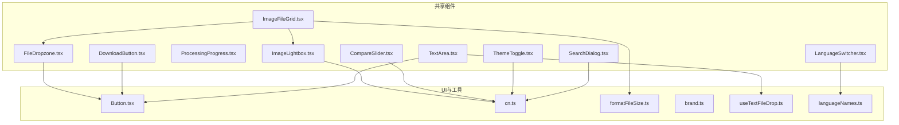
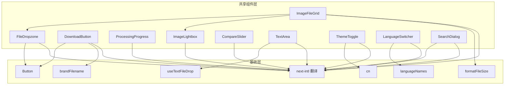
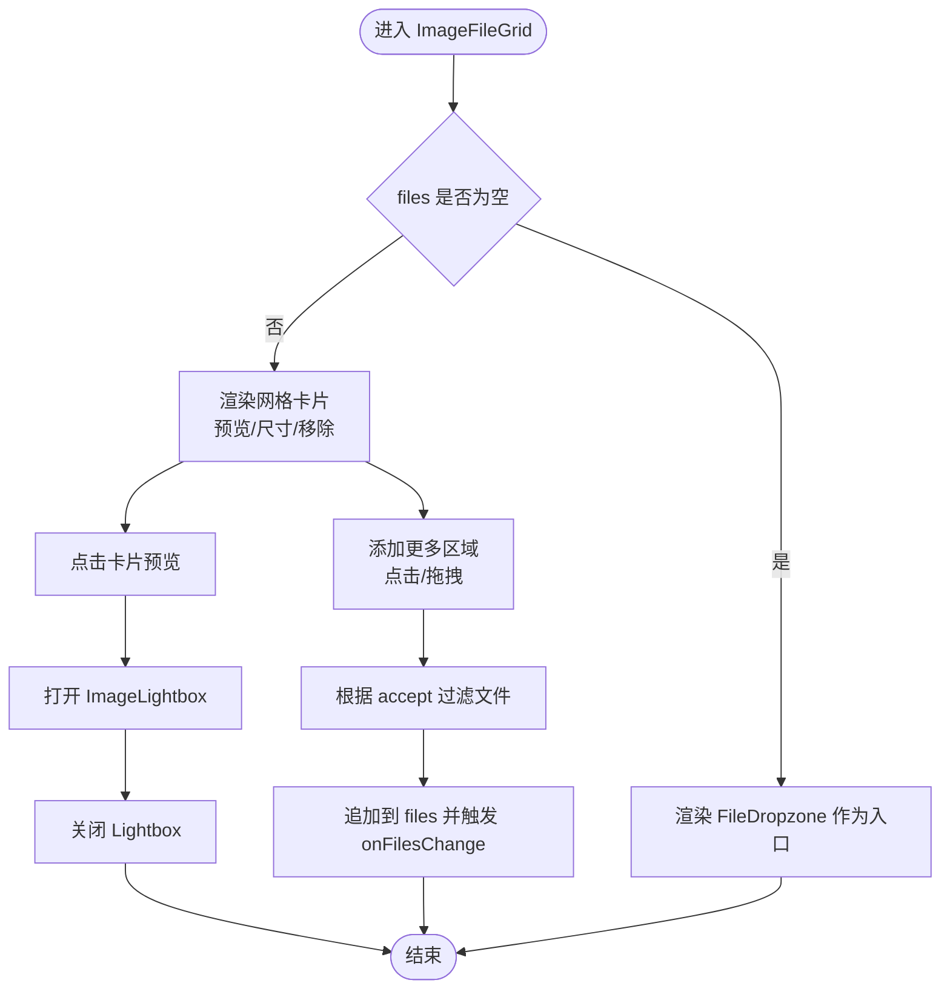
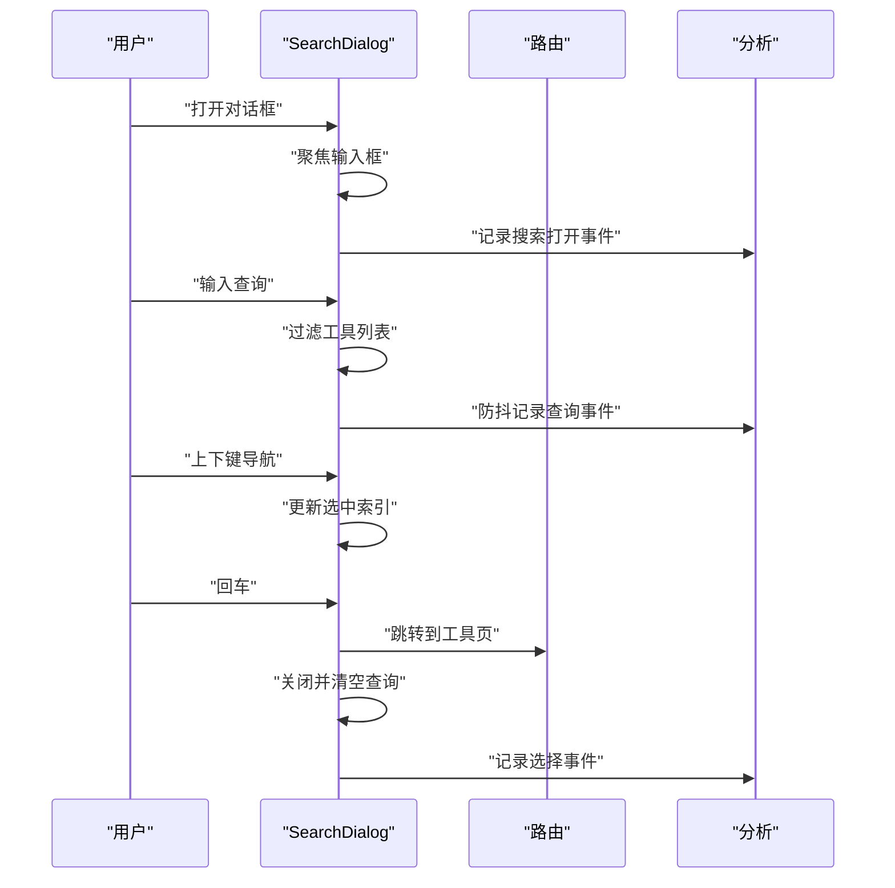
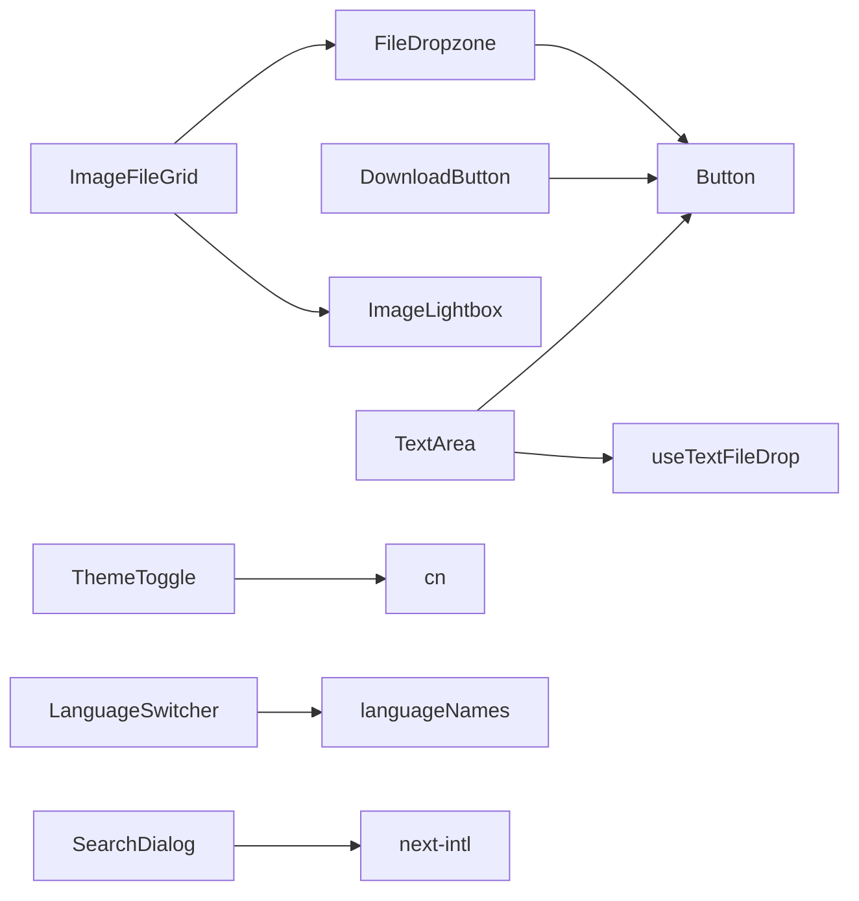

# 共享组件

<cite>
**本文引用的文件**
- [FileDropzone.tsx](file://src/components/shared/FileDropzone.tsx)
- [DownloadButton.tsx](file://src/components/shared/DownloadButton.tsx)
- [ProcessingProgress.tsx](file://src/components/shared/ProcessingProgress.tsx)
- [ImageFileGrid.tsx](file://src/components/shared/ImageFileGrid.tsx)
- [ImageLightbox.tsx](file://src/components/shared/ImageLightbox.tsx)
- [CompareSlider.tsx](file://src/components/shared/CompareSlider.tsx)
- [TextArea.tsx](file://src/components/shared/TextArea.tsx)
- [ThemeToggle.tsx](file://src/components/shared/ThemeToggle.tsx)
- [LanguageSwitcher.tsx](file://src/components/shared/LanguageSwitcher.tsx)
- [SearchDialog.tsx](file://src/components/shared/SearchDialog.tsx)
- [Button.tsx](file://src/components/ui/Button.tsx)
- [cn.ts](file://src/lib/utils/cn.ts)
- [formatFileSize.ts](file://src/lib/utils/formatFileSize.ts)
- [brand.ts](file://src/lib/brand.ts)
- [useTextFileDrop.ts](file://src/hooks/useTextFileDrop.ts)
- [languageNames.ts](file://src/lib/i18n/languageNames.ts)
- [common.json(zh-Hans)](file://messages/zh-Hans/common.json)
</cite>

## 目录
1. [简介](#简介)
2. [项目结构](#项目结构)
3. [核心组件](#核心组件)
4. [架构总览](#架构总览)
5. [组件详解](#组件详解)
6. [依赖关系分析](#依赖关系分析)
7. [性能考量](#性能考量)
8. [故障排查指南](#故障排查指南)
9. [结论](#结论)
10. [附录](#附录)

## 简介
本文件系统性梳理媒体工具箱中的共享组件，覆盖设计理念、复用策略、接口规范、状态管理、可配置性与扩展性、交互与可访问性、国际化支持以及性能优化与内存管理。目标读者既包括UI开发者，也面向需要在业务场景中正确使用这些组件的其他开发者。

## 项目结构
共享组件集中位于 src/components/shared 目录，围绕“文件上传/下载”、“图片展示/预览/对比”、“文本输入/拖拽”、“主题/语言切换”、“全局搜索”等通用能力构建，配合 src/components/ui/Button.tsx、src/lib/utils/* 工具函数与国际化消息 common.json 实现一致的外观与行为。

图表来源
- [FileDropzone.tsx:1-144](file://src/components/shared/FileDropzone.tsx#L1-L144)
- [DownloadButton.tsx:1-54](file://src/components/shared/DownloadButton.tsx#L1-L54)
- [ProcessingProgress.tsx:1-47](file://src/components/shared/ProcessingProgress.tsx#L1-L47)
- [ImageFileGrid.tsx:1-226](file://src/components/shared/ImageFileGrid.tsx#L1-L226)
- [ImageLightbox.tsx:1-60](file://src/components/shared/ImageLightbox.tsx#L1-L60)
- [CompareSlider.tsx:1-110](file://src/components/shared/CompareSlider.tsx#L1-L110)
- [TextArea.tsx:1-74](file://src/components/shared/TextArea.tsx#L1-L74)
- [ThemeToggle.tsx:1-36](file://src/components/shared/ThemeToggle.tsx#L1-L36)
- [LanguageSwitcher.tsx:1-74](file://src/components/shared/LanguageSwitcher.tsx#L1-L74)
- [SearchDialog.tsx:1-189](file://src/components/shared/SearchDialog.tsx#L1-L189)
- [Button.tsx:1-42](file://src/components/ui/Button.tsx#L1-L42)
- [cn.ts:1-7](file://src/lib/utils/cn.ts#L1-L7)
- [formatFileSize.ts:1-6](file://src/lib/utils/formatFileSize.ts#L1-L6)
- [brand.ts:1-7](file://src/lib/brand.ts#L1-L7)
- [useTextFileDrop.ts:1-75](file://src/hooks/useTextFileDrop.ts#L1-L75)
- [languageNames.ts:1-26](file://src/lib/i18n/languageNames.ts#L1-L26)

章节来源
- [FileDropzone.tsx:1-144](file://src/components/shared/FileDropzone.tsx#L1-L144)
- [ImageFileGrid.tsx:1-226](file://src/components/shared/ImageFileGrid.tsx#L1-L226)
- [Button.tsx:1-42](file://src/components/ui/Button.tsx#L1-L42)
- [cn.ts:1-7](file://src/lib/utils/cn.ts#L1-L7)

## 核心组件
- FileDropzone：文件拖拽上传容器，支持类型与大小过滤、隐私提示、分析埋点。
- DownloadButton：下载按钮，统一品牌文件名、内存URL释放、分析埋点。
- ProcessingProgress：处理进度条，支持确定/不确定进度、自定义标签。
- ImageFileGrid：图片文件网格，预览、尺寸、移除、清空、拖拽追加、轻量预览URL管理。
- ImageLightbox：图片灯箱，焦点管理、ESC关闭、滚动锁定。
- CompareSlider：前后对比滑块，指针事件、clip-path裁剪、标签与已保存百分比提示。
- TextArea：文本域，计数、拖拽文本文件、稳定回调、拖拽态视觉反馈。
- ThemeToggle：主题切换器，三态循环（浅色/深色/系统），无障碍标签。
- LanguageSwitcher：语言切换器，下拉列表、点击外部关闭、本地存储、分析埋点。
- SearchDialog：全局搜索对话框，查询过滤、键盘导航、快捷键、分析埋点。

章节来源
- [FileDropzone.tsx:9-17](file://src/components/shared/FileDropzone.tsx#L9-L17)
- [DownloadButton.tsx:10-16](file://src/components/shared/DownloadButton.tsx#L10-L16)
- [ProcessingProgress.tsx:6-12](file://src/components/shared/ProcessingProgress.tsx#L6-L12)
- [ImageFileGrid.tsx:10-15](file://src/components/shared/ImageFileGrid.tsx#L10-L15)
- [ImageLightbox.tsx:7-11](file://src/components/shared/ImageLightbox.tsx#L7-L11)
- [CompareSlider.tsx:6-12](file://src/components/shared/CompareSlider.tsx#L6-L12)
- [TextArea.tsx:11-15](file://src/components/shared/TextArea.tsx#L11-L15)
- [ThemeToggle.tsx:9-11](file://src/components/shared/ThemeToggle.tsx#L9-L11)
- [LanguageSwitcher.tsx:11-13](file://src/components/shared/LanguageSwitcher.tsx#L11-L13)
- [SearchDialog.tsx:18-22](file://src/components/shared/SearchDialog.tsx#L18-L22)

## 架构总览
共享组件遵循“低耦合、高内聚”的原则，通过以下机制实现：
- 统一的UI基元：Button.tsx 提供变体与尺寸；cn.ts 合并Tailwind类。
- 国际化：next-intl 提供翻译；common.json 提供文案；languageNames.ts 映射语言名。
- 工具函数：formatFileSize.ts、brand.ts、useTextFileDrop.ts 提供通用能力。
- 分析埋点：trackEvent 在关键动作处记录（上传、下载、主题切换、语言切换、搜索）。

图表来源
- [Button.tsx:1-42](file://src/components/ui/Button.tsx#L1-L42)
- [cn.ts:1-7](file://src/lib/utils/cn.ts#L1-L7)
- [formatFileSize.ts:1-6](file://src/lib/utils/formatFileSize.ts#L1-L6)
- [brand.ts:1-7](file://src/lib/brand.ts#L1-L7)
- [useTextFileDrop.ts:1-75](file://src/hooks/useTextFileDrop.ts#L1-L75)
- [languageNames.ts:1-26](file://src/lib/i18n/languageNames.ts#L1-L26)
- [common.json(zh-Hans):1-508](file://messages/zh-Hans/common.json#L1-L508)

## 组件详解

### FileDropzone 文件拖拽上传
- 功能特性
  - 支持 accept 类型过滤与 maxSize 大小限制。
  - 拖拽进入/离开高亮、点击触发文件选择。
  - 格式与大小提示、隐私提示。
  - 可选分析埋点（文件类型、数量）。
- 属性接口
  - accept?: string
  - multiple?: boolean
  - onFiles(files: File[]): void
  - maxSize?: number (bytes)
  - className?: string
  - analyticsSlug?: string
  - analyticsCategory?: string
- 事件与状态
  - 内部维护 dragging 状态；通过 ref 触发隐藏 input。
  - 过滤超出大小的文件后回调 onFiles。
- 可配置性与扩展性
  - 通过 accept/multiple/maxSize 控制行为；className 自定义样式。
  - 可接入更多分析维度（如文件夹、类型分布）。
- 交互与可访问性
  - 按钮与容器具备焦点与键盘可达性；图标语义化。
- 性能与内存
  - 仅在必要时创建预览URL；避免重复计算。
- 使用示例
  - 作为 ImageFileGrid 的“添加更多”入口；或独立用于单图上传。

章节来源
- [FileDropzone.tsx:9-17](file://src/components/shared/FileDropzone.tsx#L9-L17)
- [FileDropzone.tsx:42-50](file://src/components/shared/FileDropzone.tsx#L42-L50)
- [FileDropzone.tsx:55-76](file://src/components/shared/FileDropzone.tsx#L55-L76)
- [FileDropzone.tsx:78-143](file://src/components/shared/FileDropzone.tsx#L78-L143)

### DownloadButton 下载按钮
- 功能特性
  - 接收 Blob 或 data URL，自动创建临时 URL 并触发下载。
  - 使用品牌前缀重命名文件名；释放临时URL。
  - 可选分析埋点（文件类型）。
- 属性接口
  - data: Blob | string
  - filename: string
  - className?: string
  - analyticsSlug?: string
  - analyticsCategory?: string
- 事件与状态
  - 点击时创建/下载/撤销临时URL；避免内存泄漏。
- 可配置性与扩展性
  - 支持任意数据源；可扩展为批量下载。
- 交互与可访问性
  - 基于 Button 组件，具备统一的焦点与无障碍标签。
- 性能与内存
  - 仅在需要时创建对象URL并在使用后释放。
- 使用示例
  - 图片压缩/转换后的一键下载；文本导出。

章节来源
- [DownloadButton.tsx:10-16](file://src/components/shared/DownloadButton.tsx#L10-L16)
- [DownloadButton.tsx:18-45](file://src/components/shared/DownloadButton.tsx#L18-L45)
- [DownloadButton.tsx:47-53](file://src/components/shared/DownloadButton.tsx#L47-L53)
- [brand.ts:1-7](file://src/lib/brand.ts#L1-L7)

### ProcessingProgress 处理进度条
- 功能特性
  - 支持确定进度（0–100）与不确定动画。
  - 自定义标签覆盖默认文案。
- 属性接口
  - progress?: number
  - label?: string
  - className?: string
- 事件与状态
  - 通过 isDeterminate 切换确定/不确定样式。
- 可配置性与扩展性
  - 标签可本地化；样式通过 className 定制。
- 交互与可访问性
  - 文案与数值对读屏友好。
- 性能与内存
  - 纯展示组件，无状态副作用。
- 使用示例
  - FFmpeg 处理、PDF 合并、图片压缩等长任务进度反馈。

章节来源
- [ProcessingProgress.tsx:6-12](file://src/components/shared/ProcessingProgress.tsx#L6-L12)
- [ProcessingProgress.tsx:14-46](file://src/components/shared/ProcessingProgress.tsx#L14-L46)

### ImageFileGrid 图片网格
- 功能特性
  - 文件列表预览、尺寸与大小展示、移除单个/清空。
  - “添加更多”支持点击与拖拽；拖拽过滤 accept。
  - 点击预览进入 ImageLightbox。
  - 预览URL增量同步与清理。
- 属性接口
  - files: File[]
  - onFilesChange(files: File[]): void
  - disabled?: boolean
  - accept?: string
- 事件与状态
  - previews/dimensions 状态映射文件；引用缓存避免重复创建URL。
  - 拖拽进入/离开 add 区域；过滤不匹配类型。
- 可配置性与扩展性
  - accept 默认 image/*；disabled 控制交互。
- 交互与可访问性
  - 键盘激活“添加更多”；移除按钮具备无障碍标签。
- 性能与内存
  - 单文件预览URL创建与撤销；尺寸异步加载后更新。
- 使用示例
  - 多图上传、批量预览与筛选。

图表来源
- [ImageFileGrid.tsx:17-22](file://src/components/shared/ImageFileGrid.tsx#L17-L22)
- [ImageFileGrid.tsx:42-74](file://src/components/shared/ImageFileGrid.tsx#L42-L74)
- [ImageFileGrid.tsx:154-173](file://src/components/shared/ImageFileGrid.tsx#L154-L173)
- [ImageFileGrid.tsx:216-222](file://src/components/shared/ImageFileGrid.tsx#L216-L222)

章节来源
- [ImageFileGrid.tsx:10-15](file://src/components/shared/ImageFileGrid.tsx#L10-L15)
- [ImageFileGrid.tsx:17-22](file://src/components/shared/ImageFileGrid.tsx#L17-L22)
- [ImageFileGrid.tsx:42-74](file://src/components/shared/ImageFileGrid.tsx#L42-L74)
- [ImageFileGrid.tsx:154-173](file://src/components/shared/ImageFileGrid.tsx#L154-L173)
- [ImageFileGrid.tsx:216-222](file://src/components/shared/ImageFileGrid.tsx#L216-L222)
- [formatFileSize.ts:1-6](file://src/lib/utils/formatFileSize.ts#L1-L6)

### ImageLightbox 图片灯箱
- 功能特性
  - 全屏展示图片，ESC 关闭；滚动锁定；焦点管理。
- 属性接口
  - src: string
  - alt?: string
  - onClose(): void
- 事件与状态
  - 打开时隐藏 body 滚动；键盘监听；关闭时恢复。
- 可配置性与扩展性
  - 可扩展为轮播、多图切换。
- 交互与可访问性
  - 对话框角色与 aria-label；关闭按钮具备无障碍标签。
- 性能与内存
  - Portal 渲染至 body；组件卸载时恢复滚动。
- 使用示例
  - 从网格卡片进入大图查看。

章节来源
- [ImageLightbox.tsx:7-11](file://src/components/shared/ImageLightbox.tsx#L7-L11)
- [ImageLightbox.tsx:13-31](file://src/components/shared/ImageLightbox.tsx#L13-L31)
- [ImageLightbox.tsx:33-58](file://src/components/shared/ImageLightbox.tsx#L33-L58)

### CompareSlider 对比滑块
- 功能特性
  - 拖动分割线对比两张图片；支持标签与已保存百分比提示。
- 属性接口
  - beforeSrc: string
  - afterSrc: string
  - beforeLabel?: string
  - afterLabel?: string
  - savedPercent?: number
- 事件与状态
  - pointer 事件捕获与移动；计算百分比位置。
- 可配置性与扩展性
  - 支持自定义标签；可扩展为多阶段对比。
- 交互与可访问性
  - 指针样式与键盘可达性；标签语义化。
- 性能与内存
  - 仅渲染两张图片与分割线；clip-path 计算开销低。
- 使用示例
  - 压缩前后对比、滤镜前后对比。

章节来源
- [CompareSlider.tsx:6-12](file://src/components/shared/CompareSlider.tsx#L6-L12)
- [CompareSlider.tsx:14-48](file://src/components/shared/CompareSlider.tsx#L14-L48)
- [CompareSlider.tsx:50-109](file://src/components/shared/CompareSlider.tsx#L50-L109)

### TextArea 文本区域
- 功能特性
  - 计数显示、拖拽文本文件（.txt/.json 等）、稳定回调。
  - 拖拽态视觉反馈与提示文案。
- 属性接口
  - showCount?: boolean
  - onFileDrop?(text: string, filename: string): void
  - acceptFileTypes?: string[]
- 事件与状态
  - useTextFileDrop 返回 isDragging 与 dragHandlers；稳定回调避免重渲染。
- 可配置性与扩展性
  - acceptFileTypes 可自定义；可扩展为多类型文件。
- 交互与可访问性
  - 拖拽态高亮；占位提示与图标辅助。
- 性能与内存
  - Hook 稳定回调引用；仅在拖拽时高亮。
- 使用示例
  - 文本输入、拖拽导入配置/日志/代码片段。

章节来源
- [TextArea.tsx:11-15](file://src/components/shared/TextArea.tsx#L11-L15)
- [TextArea.tsx:17-33](file://src/components/shared/TextArea.tsx#L17-L33)
- [TextArea.tsx:37-70](file://src/components/shared/TextArea.tsx#L37-L70)
- [useTextFileDrop.ts:12-14](file://src/hooks/useTextFileDrop.ts#L12-L14)
- [useTextFileDrop.ts:47-67](file://src/hooks/useTextFileDrop.ts#L47-L67)

### ThemeToggle 主题切换器
- 功能特性
  - 三态循环（浅色/深色/系统）；无障碍标签；分析埋点。
- 属性接口
  - 无
- 事件与状态
  - mounted 防抖动；切换后记录事件。
- 可配置性与扩展性
  - 可扩展为更多主题或自定义主题。
- 交互与可访问性
  - aria-label 动态包含下一主题名称。
- 性能与内存
  - 纯展示与状态切换，无额外资源。
- 使用示例
  - 顶部导航或设置面板。

章节来源
- [ThemeToggle.tsx:9-11](file://src/components/shared/ThemeToggle.tsx#L9-L11)
- [ThemeToggle.tsx:21-28](file://src/components/shared/ThemeToggle.tsx#L21-L28)
- [ThemeToggle.tsx:25-34](file://src/components/shared/ThemeToggle.tsx#L25-L34)

### LanguageSwitcher 语言切换器
- 功能特性
  - 下拉语言列表、点击外部关闭、本地存储、分析埋点。
- 属性接口
  - dropdownDirection?: "up" | "down"
- 事件与状态
  - 点击切换路由；键盘 ESC 关闭；滚动时关闭。
- 可配置性与扩展性
  - 通过 languageNames.ts 扩展语言名；可配置方向。
- 交互与可访问性
  - 下拉定位与滚动条；当前语言高亮。
- 性能与内存
  - 无状态副作用；仅在打开时渲染。
- 使用示例
  - 顶部导航或设置面板。

章节来源
- [LanguageSwitcher.tsx:11-13](file://src/components/shared/LanguageSwitcher.tsx#L11-L13)
- [LanguageSwitcher.tsx:15-38](file://src/components/shared/LanguageSwitcher.tsx#L15-L38)
- [LanguageSwitcher.tsx:40-71](file://src/components/shared/LanguageSwitcher.tsx#L40-L71)
- [languageNames.ts:1-26](file://src/lib/i18n/languageNames.ts#L1-L26)

### SearchDialog 全局搜索
- 功能特性
  - 全局搜索对话框、键盘导航、快捷键、分析埋点。
- 属性接口
  - open: boolean
  - onClose(): void
  - toolNavData: ToolNavItem[]
- 事件与状态
  - 输入过滤、键盘上下移动、Enter 打开、Esc 关闭。
  - 打开时聚焦输入；debounce 查询埋点。
- 可配置性与扩展性
  - 可扩展为更多字段（关键词、作者、标签）。
- 交互与可访问性
  - 对话框角色与快捷键提示；高亮当前项。
- 性能与内存
  - 过滤在内存中进行；防抖减少埋点频率。
- 使用示例
  - Ctrl+K 打开搜索；选择工具跳转。

图表来源
- [SearchDialog.tsx:24-31](file://src/components/shared/SearchDialog.tsx#L24-L31)
- [SearchDialog.tsx:63-71](file://src/components/shared/SearchDialog.tsx#L63-L71)
- [SearchDialog.tsx:76-83](file://src/components/shared/SearchDialog.tsx#L76-L83)
- [SearchDialog.tsx:100-118](file://src/components/shared/SearchDialog.tsx#L100-L118)
- [SearchDialog.tsx:154-176](file://src/components/shared/SearchDialog.tsx#L154-L176)

章节来源
- [SearchDialog.tsx:18-22](file://src/components/shared/SearchDialog.tsx#L18-L22)
- [SearchDialog.tsx:24-31](file://src/components/shared/SearchDialog.tsx#L24-L31)
- [SearchDialog.tsx:63-71](file://src/components/shared/SearchDialog.tsx#L63-L71)
- [SearchDialog.tsx:76-83](file://src/components/shared/SearchDialog.tsx#L76-L83)
- [SearchDialog.tsx:100-118](file://src/components/shared/SearchDialog.tsx#L100-L118)
- [SearchDialog.tsx:154-176](file://src/components/shared/SearchDialog.tsx#L154-L176)

## 依赖关系分析
- 组件内聚
  - FileDropzone/DownloadButton/ProcessingProgress 独立性强，作为原子能力复用。
  - ImageFileGrid 组合 FileDropzone 与 ImageLightbox，形成复合能力。
  - TextArea 组合 Button 与 useTextFileDrop，提供富交互文本输入。
- 组件耦合
  - 通过 Button、cn、formatFileSize、brandFilename、useTextFileDrop、languageNames 等工具解耦样式与逻辑。
  - 国际化通过 next-intl 与 common.json 统一文案。
- 外部依赖
  - lucide-react 图标；next-themes 主题；next-intl 国际化；Portal 渲染；Web API（URL.createObjectURL、Image）。

图表来源
- [Button.tsx:1-42](file://src/components/ui/Button.tsx#L1-L42)
- [cn.ts:1-7](file://src/lib/utils/cn.ts#L1-L7)
- [useTextFileDrop.ts:1-75](file://src/hooks/useTextFileDrop.ts#L1-L75)
- [languageNames.ts:1-26](file://src/lib/i18n/languageNames.ts#L1-L26)
- [common.json(zh-Hans):1-508](file://messages/zh-Hans/common.json#L1-L508)

章节来源
- [Button.tsx:1-42](file://src/components/ui/Button.tsx#L1-L42)
- [cn.ts:1-7](file://src/lib/utils/cn.ts#L1-L7)
- [useTextFileDrop.ts:1-75](file://src/hooks/useTextFileDrop.ts#L1-L75)
- [languageNames.ts:1-26](file://src/lib/i18n/languageNames.ts#L1-L26)
- [common.json(zh-Hans):1-508](file://messages/zh-Hans/common.json#L1-L508)

## 性能考量
- 预览URL管理
  - ImageFileGrid 在卸载时撤销所有预览URL，避免内存泄漏。
  - 仅对新增文件创建URL，避免重复创建。
- 异步与节流
  - SearchDialog 对查询进行防抖埋点，降低事件风暴。
- DOM 与渲染
  - ImageLightbox 使用 Portal 渲染至 body，减少层级影响。
  - ProcessingProgress 与 CompareSlider 仅渲染必要元素，避免复杂布局。
- 资源与体积
  - 统一使用 cn 合并类名，减少无效样式；Button 提供尺寸/变体复用。

章节来源
- [ImageFileGrid.tsx:34-40](file://src/components/shared/ImageFileGrid.tsx#L34-L40)
- [ImageFileGrid.tsx:57-70](file://src/components/shared/ImageFileGrid.tsx#L57-L70)
- [SearchDialog.tsx:76-83](file://src/components/shared/SearchDialog.tsx#L76-L83)
- [ImageLightbox.tsx:33-58](file://src/components/shared/ImageLightbox.tsx#L33-L58)
- [cn.ts:1-7](file://src/lib/utils/cn.ts#L1-L7)

## 故障排查指南
- 文件上传失败
  - 检查 accept 与 maxSize 是否导致过滤；确认 onFiles 回调是否接收有效文件。
  - 参考路径：[FileDropzone.tsx:55-76](file://src/components/shared/FileDropzone.tsx#L55-L76)
- 下载空白或文件名异常
  - 确认 data 类型（Blob 或 data URL）；检查 brandFilename 前缀逻辑。
  - 参考路径：[DownloadButton.tsx:27-45](file://src/components/shared/DownloadButton.tsx#L27-L45)，[brand.ts:1-7](file://src/lib/brand.ts#L1-L7)
- 图片预览不显示
  - 确认预览URL创建与撤销流程；检查 dimensions 更新时机。
  - 参考路径：[ImageFileGrid.tsx:57-70](file://src/components/shared/ImageFileGrid.tsx#L57-L70)，[ImageFileGrid.tsx:34-40](file://src/components/shared/ImageFileGrid.tsx#L34-L40)
- 灯箱无法关闭
  - 检查 ESC 事件绑定与 body 滚动恢复。
  - 参考路径：[ImageLightbox.tsx:20-31](file://src/components/shared/ImageLightbox.tsx#L20-L31)
- 搜索无响应
  - 检查 open 状态与输入聚焦；确认过滤逻辑与路由跳转。
  - 参考路径：[SearchDialog.tsx:63-71](file://src/components/shared/SearchDialog.tsx#L63-L71)，[SearchDialog.tsx:33-43](file://src/components/shared/SearchDialog.tsx#L33-L43)，[SearchDialog.tsx:154-176](file://src/components/shared/SearchDialog.tsx#L154-L176)
- 语言切换无效
  - 检查本地存储与路由 replace；确认 dropdownDirection 与点击外部关闭。
  - 参考路径：[LanguageSwitcher.tsx:33-38](file://src/components/shared/LanguageSwitcher.tsx#L33-L38)，[LanguageSwitcher.tsx:23-31](file://src/components/shared/LanguageSwitcher.tsx#L23-L31)

章节来源
- [FileDropzone.tsx:55-76](file://src/components/shared/FileDropzone.tsx#L55-L76)
- [DownloadButton.tsx:27-45](file://src/components/shared/DownloadButton.tsx#L27-L45)
- [brand.ts:1-7](file://src/lib/brand.ts#L1-L7)
- [ImageFileGrid.tsx:34-40](file://src/components/shared/ImageFileGrid.tsx#L34-L40)
- [ImageFileGrid.tsx:57-70](file://src/components/shared/ImageFileGrid.tsx#L57-L70)
- [ImageLightbox.tsx:20-31](file://src/components/shared/ImageLightbox.tsx#L20-L31)
- [SearchDialog.tsx:33-43](file://src/components/shared/SearchDialog.tsx#L33-L43)
- [SearchDialog.tsx:63-71](file://src/components/shared/SearchDialog.tsx#L63-L71)
- [SearchDialog.tsx:154-176](file://src/components/shared/SearchDialog.tsx#L154-L176)
- [LanguageSwitcher.tsx:23-38](file://src/components/shared/LanguageSwitcher.tsx#L23-L38)

## 结论
共享组件通过统一的UI基元、工具函数与国际化体系，实现了高复用、低耦合与一致体验。它们在文件处理、图片展示、文本输入、主题与语言切换、全局搜索等方面提供了可配置、可扩展且性能友好的解决方案。建议在业务组件中优先组合使用这些共享组件，并遵循本文的接口规范、交互设计与性能优化建议。

## 附录
- 最佳实践
  - 使用 className 与变体定制外观；通过 props 控制行为；在关键动作埋点。
  - 图片预览与下载注意内存管理；文本拖拽使用稳定回调。
  - 语言切换与主题切换需考虑无障碍标签与键盘可达性。
- 可访问性清单
  - 所有交互元素具备 aria-label 或等效语义；焦点顺序合理。
  - 对话框使用 role="dialog"；ESC 关闭。
- 国际化清单
  - 文案来自 common.json；语言名来自 languageNames.ts；确保翻译完整。