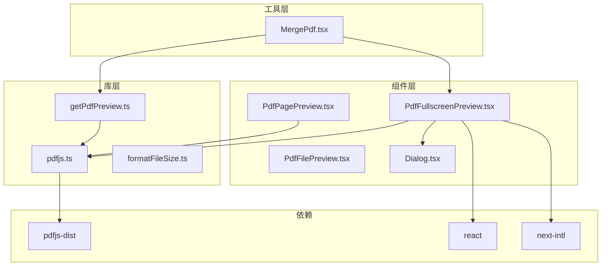
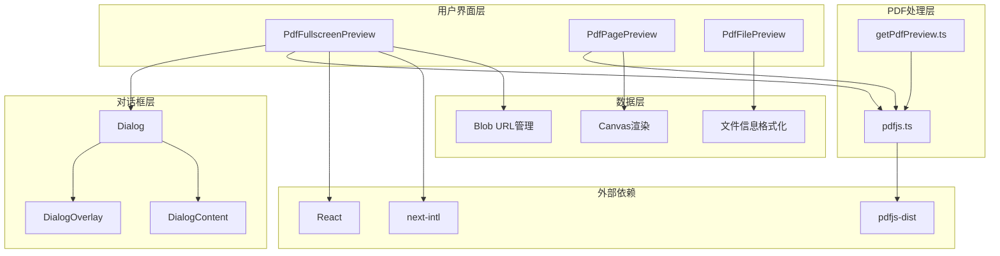
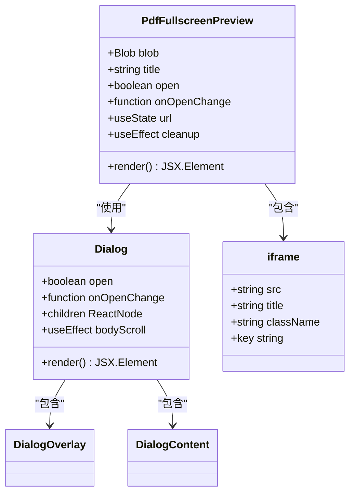
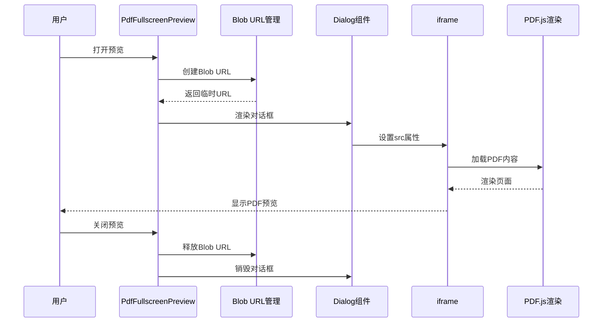
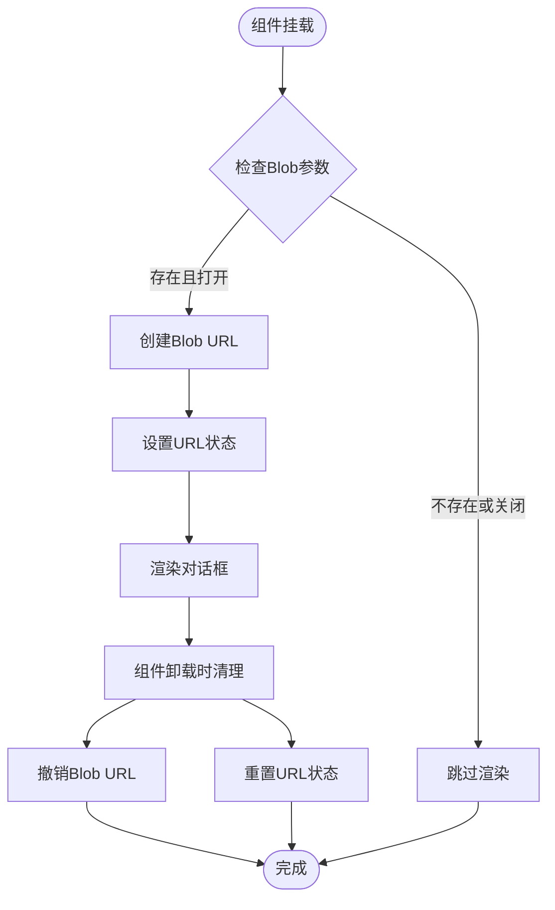
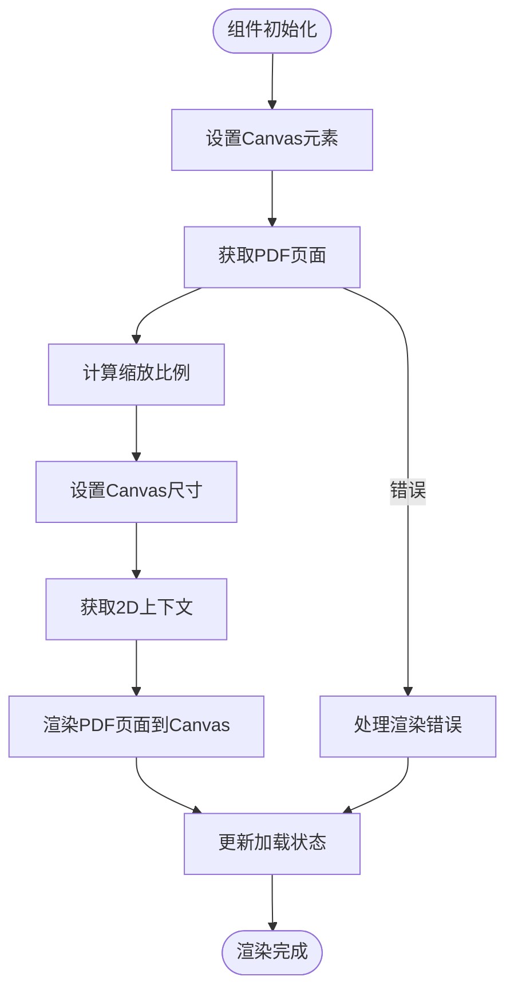
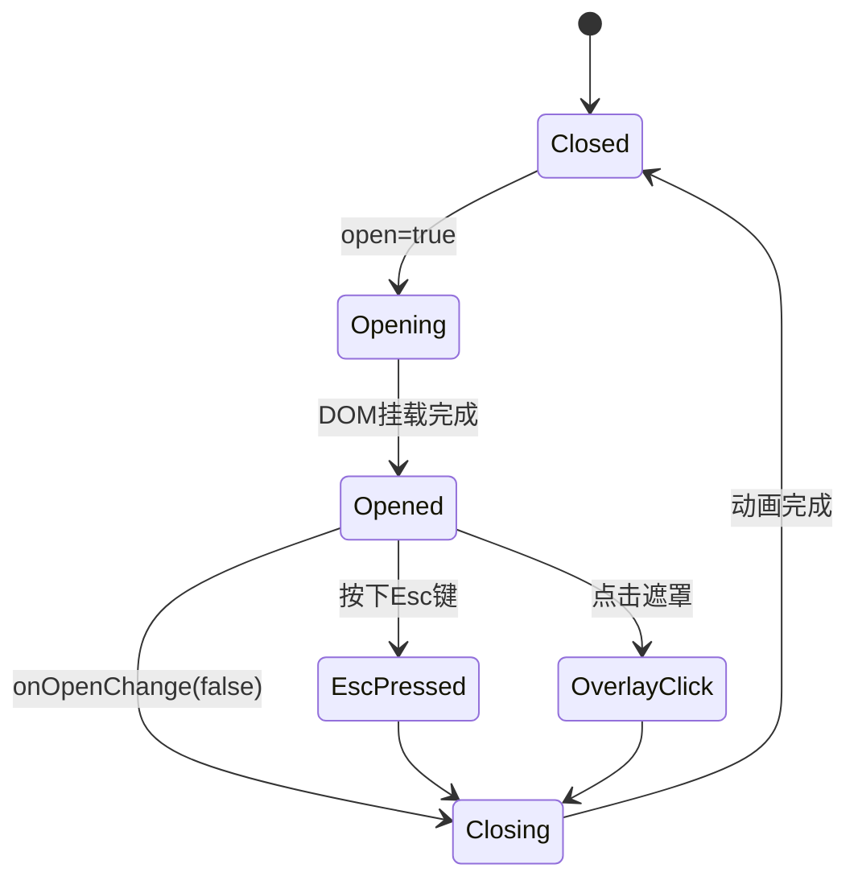
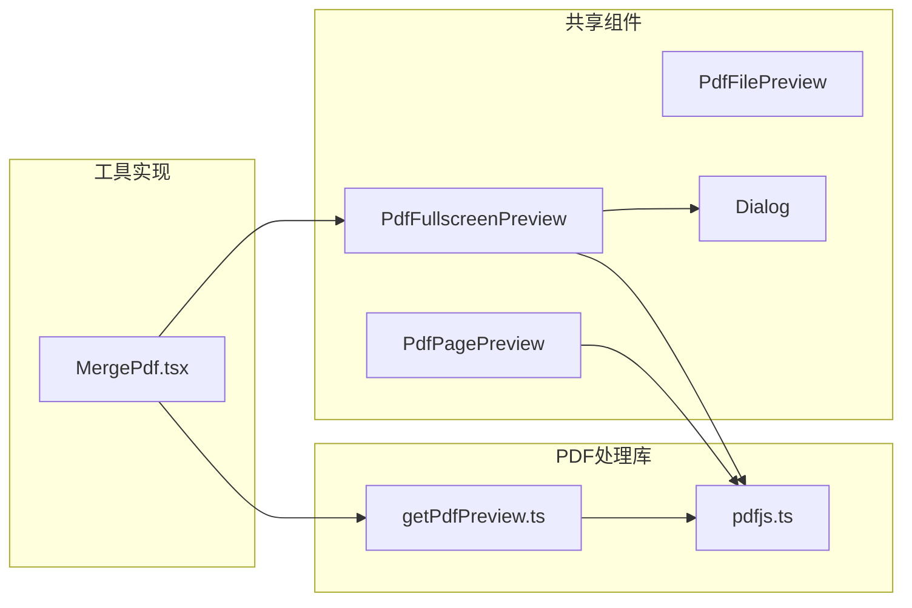
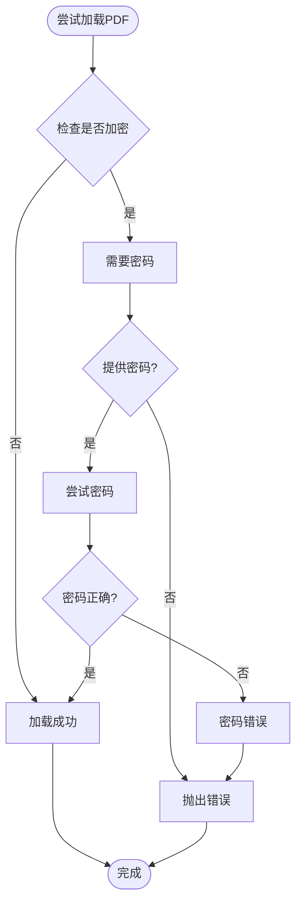

# PDF全屏预览组件

<cite>
**本文档引用的文件**
- [PdfFullscreenPreview.tsx](file://src/components/shared/PdfFullscreenPreview.tsx)
- [PdfPagePreview.tsx](file://src/components/shared/PdfPagePreview.tsx)
- [PdfFilePreview.tsx](file://src/components/shared/PdfFilePreview.tsx)
- [Dialog.tsx](file://src/components/ui/Dialog.tsx)
- [pdfjs.ts](file://src/lib/pdfjs.ts)
- [getPdfPreview.ts](file://src/lib/pdf/getPdfPreview.ts)
- [formatFileSize.ts](file://src/lib/utils/formatFileSize.ts)
- [MergePdf.tsx](file://src/tools/pdf/merge/MergePdf.tsx)
- [package.json](file://package.json)
</cite>

## 目录
1. [简介](#简介)
2. [项目结构](#项目结构)
3. [核心组件](#核心组件)
4. [架构概览](#架构概览)
5. [详细组件分析](#详细组件分析)
6. [依赖关系分析](#依赖关系分析)
7. [性能考虑](#性能考虑)
8. [故障排除指南](#故障排除指南)
9. [结论](#结论)

## 简介

PDF全屏预览组件是媒体工具箱中的一个关键功能模块，为用户提供了一个现代化、响应式的PDF文件预览解决方案。该组件基于React构建，集成了PDF.js库来处理PDF文档渲染，并提供了完整的全屏预览体验。

该组件的主要特点包括：
- 基于Blob URL的安全预览机制
- 全屏对话框界面设计
- 响应式布局适配不同屏幕尺寸
- 国际化支持
- 无障碍访问功能
- 内存管理优化

## 项目结构

该项目采用基于功能的模块化组织方式，PDF相关组件分布在以下目录结构中：



**图表来源**
- [PdfFullscreenPreview.tsx:1-76](file://src/components/shared/PdfFullscreenPreview.tsx#L1-L76)
- [Dialog.tsx:1-176](file://src/components/ui/Dialog.tsx#L1-L176)
- [pdfjs.ts:1-16](file://src/lib/pdfjs.ts#L1-L16)

**章节来源**
- [PdfFullscreenPreview.tsx:1-76](file://src/components/shared/PdfFullscreenPreview.tsx#L1-L76)
- [package.json:1-55](file://package.json#L1-L55)

## 核心组件

### PdfFullscreenPreview 组件

PdfFullscreenPreview是整个PDF预览系统的核心组件，负责提供全屏PDF预览功能。该组件接收Blob对象作为输入，动态创建URL对象，并在全屏对话框中显示PDF内容。

主要功能特性：
- **Blob URL管理**：安全地创建和销毁临时URL对象
- **全屏对话框**：使用自定义Dialog组件提供沉浸式预览体验
- **响应式设计**：适配不同屏幕尺寸的预览容器
- **国际化支持**：集成next-intl进行多语言本地化
- **内存优化**：自动清理URL对象防止内存泄漏

**章节来源**
- [PdfFullscreenPreview.tsx:13-76](file://src/components/shared/PdfFullscreenPreview.tsx#L13-L76)

### PdfPagePreview 组件

PdfPagePreview组件专注于单页PDF内容的预览，使用Canvas技术将PDF页面渲染为图像。该组件特别适用于PDF合并工具中的页面缩略图显示。

核心功能：
- **Canvas渲染**：利用PDF.js的Canvas渲染API
- **可调整尺寸**：支持动态宽度设置和比例缩放
- **加载状态管理**：提供视觉反馈的加载指示器
- **交互支持**：支持点击选择和选中状态显示

**章节来源**
- [PdfPagePreview.tsx:7-92](file://src/components/shared/PdfPagePreview.tsx#L7-L92)

### PdfFilePreview 组件

PdfFilePreview组件用于显示PDF文件的基本信息和操作选项，常用于文件上传和管理界面。

主要功能：
- **文件信息展示**：显示文件名、页数、大小等元数据
- **缩略图支持**：可选的文件缩略图显示
- **操作按钮**：替换文件和删除文件的功能按钮
- **文件格式验证**：确保只接受PDF文件类型

**章节来源**
- [PdfFilePreview.tsx:8-91](file://src/components/shared/PdfFilePreview.tsx#L8-L91)

## 架构概览

PDF全屏预览系统的整体架构采用分层设计，确保了组件间的松耦合和高内聚性。



**图表来源**
- [PdfFullscreenPreview.tsx:1-76](file://src/components/shared/PdfFullscreenPreview.tsx#L1-L76)
- [Dialog.tsx:1-176](file://src/components/ui/Dialog.tsx#L1-L176)
- [pdfjs.ts:1-16](file://src/lib/pdfjs.ts#L1-L16)
- [getPdfPreview.ts:1-72](file://src/lib/pdf/getPdfPreview.ts#L1-L72)

## 详细组件分析

### PdfFullscreenPreview 组件深度分析

PdfFullscreenPreview组件采用了现代React Hooks模式，实现了高效的生命周期管理和资源清理。

#### 组件类图



**图表来源**
- [PdfFullscreenPreview.tsx:13-76](file://src/components/shared/PdfFullscreenPreview.tsx#L13-L76)
- [Dialog.tsx:25-122](file://src/components/ui/Dialog.tsx#L25-L122)

#### 组件调用序列图



**图表来源**
- [PdfFullscreenPreview.tsx:29-40](file://src/components/shared/PdfFullscreenPreview.tsx#L29-L40)
- [Dialog.tsx:35-53](file://src/components/ui/Dialog.tsx#L35-L53)

#### 内存管理流程图



**图表来源**
- [PdfFullscreenPreview.tsx:29-40](file://src/components/shared/PdfFullscreenPreview.tsx#L29-L40)

**章节来源**
- [PdfFullscreenPreview.tsx:20-76](file://src/components/shared/PdfFullscreenPreview.tsx#L20-L76)

### PdfPagePreview 组件分析

PdfPagePreview组件展示了PDF页面渲染的最佳实践，特别是在Canvas环境下的性能优化。

#### 组件实现流程



**图表来源**
- [PdfPagePreview.tsx:31-56](file://src/components/shared/PdfPagePreview.tsx#L31-L56)

**章节来源**
- [PdfPagePreview.tsx:18-92](file://src/components/shared/PdfPagePreview.tsx#L18-L92)

### Dialog 组件系统

Dialog组件系统提供了完整的模态对话框解决方案，支持键盘导航和无障碍访问。

#### 对话框生命周期管理



**图表来源**
- [Dialog.tsx:23-53](file://src/components/ui/Dialog.tsx#L23-L53)
- [Dialog.tsx:93-103](file://src/components/ui/Dialog.tsx#L93-L103)

**章节来源**
- [Dialog.tsx:1-176](file://src/components/ui/Dialog.tsx#L1-L176)

## 依赖关系分析

### 外部依赖分析

项目对PDF处理和UI组件的依赖关系如下：

```mermaid
graph TB
subgraph "PDF处理依赖"
A[pdfjs-dist ^5.7.284]
B[pdf-lib ^1.17.1]
C[@ffmpeg/ffmpeg ^0.12.15]
end
subgraph "UI框架依赖"
D[react ^19.2.6]
E[react-dom ^19.2.6]
F[next ^16.2.6]
G[lucide-react ^1.14.0]
end
subgraph "国际化依赖"
H[next-intl ^4.11.1]
end
subgraph "拖拽依赖"
I[@dnd-kit/core ^6.3.1]
J[@dnd-kit/sortable ^10.0.0]
end
subgraph "工具函数依赖"
K[tailwind-merge ^3.5.0]
L[clsx ^2.1.1]
end
A --> D
B --> D
C --> D
H --> F
I --> D
J --> D
```

**图表来源**
- [package.json:11-41](file://package.json#L11-L41)

### 内部依赖关系



**图表来源**
- [PdfFullscreenPreview.tsx:24](file://src/components/shared/PdfFullscreenPreview.tsx#L24)
- [MergePdf.tsx:24](file://src/tools/pdf/merge/MergePdf.tsx#L24)

**章节来源**
- [package.json:1-55](file://package.json#L1-L55)

## 性能考虑

### 内存管理策略

PDF全屏预览组件在内存管理方面采用了多项优化措施：

1. **Blob URL生命周期管理**：确保每个创建的URL对象都能被正确释放
2. **Canvas资源清理**：渲染完成后及时清理Canvas元素
3. **组件卸载清理**：在组件卸载时执行所有清理操作
4. **异步操作取消**：支持渲染操作的取消以避免不必要的计算

### 渲染性能优化

- **按需加载**：PDF内容仅在需要时加载和渲染
- **缩放优化**：根据目标显示尺寸计算最优缩放比例
- **Canvas复用**：避免频繁创建和销毁Canvas元素
- **错误边界**：提供渲染失败时的降级处理

### 网络和存储优化

- **URL缓存**：利用浏览器的URL对象缓存机制
- **文件大小格式化**：提供友好的文件大小显示
- **异步加载**：避免阻塞主线程的同步操作

## 故障排除指南

### 常见问题及解决方案

#### PDF加密处理

当遇到加密PDF文件时，系统会抛出特定的错误类型：



**图表来源**
- [getPdfPreview.ts:32-48](file://src/lib/pdf/getPdfPreview.ts#L32-L48)

#### 内存泄漏防护

为防止内存泄漏，组件实现了多重保护机制：

1. **URL对象清理**：在组件卸载时自动撤销所有创建的URL对象
2. **Canvas资源管理**：确保Canvas元素的正确销毁
3. **事件监听器清理**：移除所有注册的事件监听器
4. **异步操作取消**：支持渲染操作的中断

**章节来源**
- [getPdfPreview.ts:10-22](file://src/lib/pdf/getPdfPreview.ts#L10-L22)
- [PdfFullscreenPreview.tsx:34-39](file://src/components/shared/PdfFullscreenPreview.tsx#L34-L39)

## 结论

PDF全屏预览组件是一个设计精良、功能完整的PDF处理解决方案。该组件通过以下关键特性实现了优秀的用户体验：

1. **安全性**：采用Blob URL机制确保PDF内容的安全预览
2. **性能**：优化的内存管理和渲染策略保证了流畅的用户体验
3. **可访问性**：完整的键盘导航和无障碍支持
4. **可扩展性**：模块化的架构设计便于功能扩展和维护
5. **国际化**：全面的多语言支持满足全球化需求

该组件不仅满足了当前的功能需求，还为未来的功能扩展奠定了坚实的基础。通过合理的架构设计和最佳实践的应用，该组件能够稳定地处理各种PDF预览场景，为用户提供高质量的PDF阅读体验。