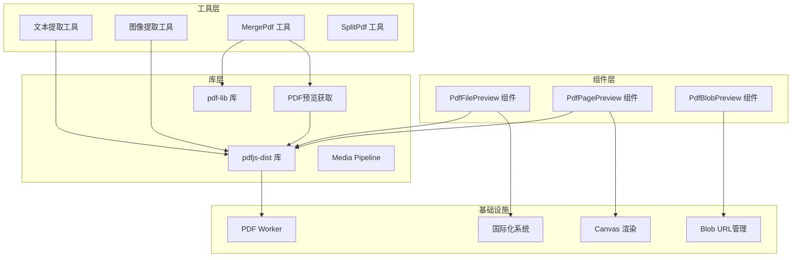
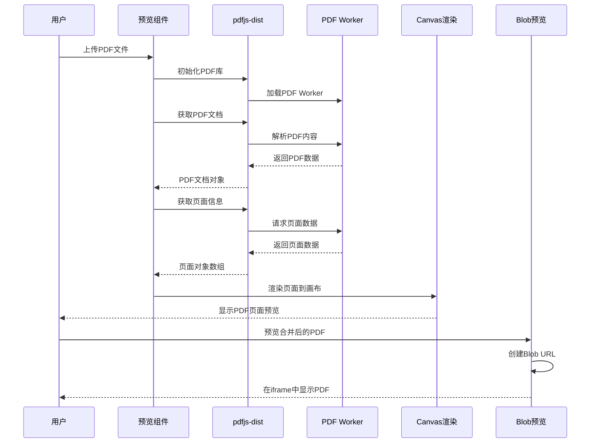
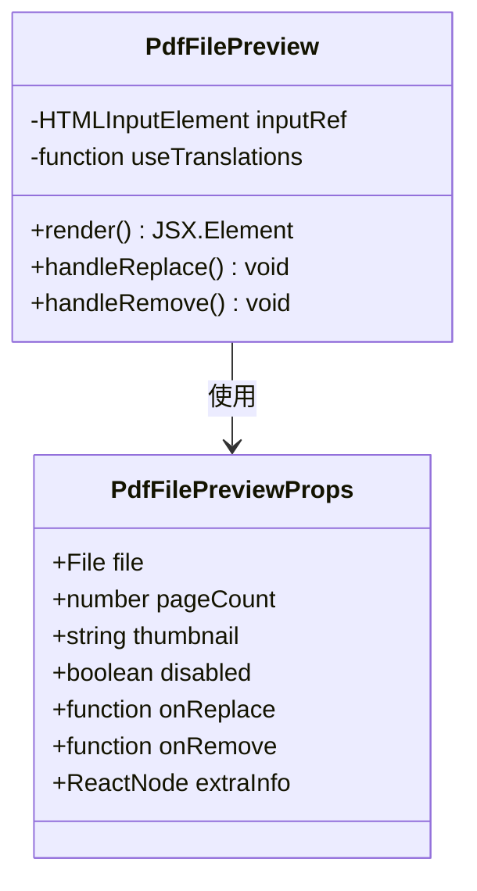
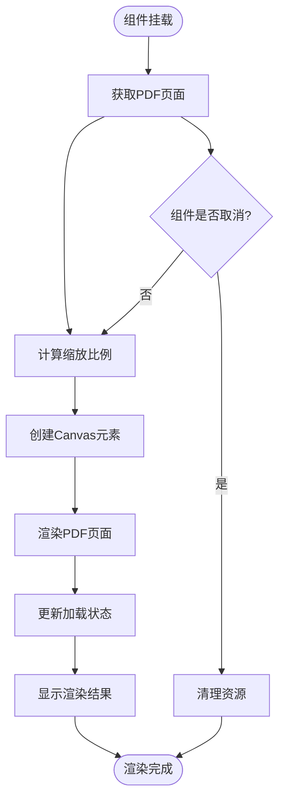
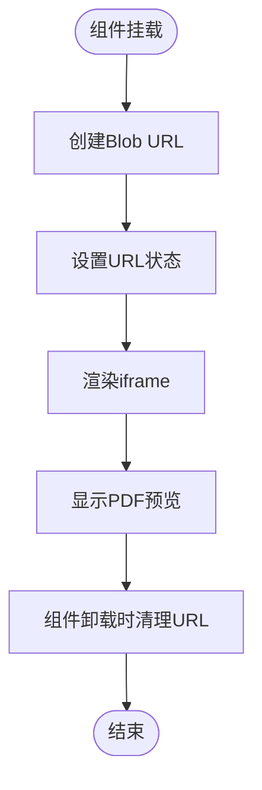

# PDF文件预览组件

<cite>
**本文档中引用的文件**
- [PdfBlobPreview.tsx](file://src/components/shared/PdfBlobPreview.tsx)
- [PdfFilePreview.tsx](file://src/components/shared/PdfFilePreview.tsx)
- [PdfPagePreview.tsx](file://src/components/shared/PdfPagePreview.tsx)
- [pdfjs.ts](file://src/lib/pdfjs.ts)
- [getPdfPreview.ts](file://src/lib/pdf/getPdfPreview.ts)
- [formatFileSize.ts](file://src/lib/utils/formatFileSize.ts)
- [MergePdf.tsx](file://src/tools/pdf/merge/MergePdf.tsx)
- [package.json](file://package.json)
- [README.md](file://README.md)
</cite>

## 更新摘要
**变更内容**
- 新增PdfBlobPreview组件，提供基于iframe的浏览器内PDF预览功能
- 更新PDF预览架构，支持多种预览方式（页面渲染vs浏览器预览）
- 增强合并PDF工具的预览功能，支持实时预览合并结果
- 优化PDF预览性能，提供更流畅的用户体验

## 目录
1. [简介](#简介)
2. [项目结构](#项目结构)
3. [核心组件](#核心组件)
4. [架构概览](#架构概览)
5. [详细组件分析](#详细组件分析)
6. [依赖关系分析](#依赖关系分析)
7. [性能考虑](#性能考虑)
8. [故障排除指南](#故障排除指南)
9. [结论](#结论)

## 简介

PDF文件预览组件是Media Toolbox项目中的一个核心功能模块，专门用于在浏览器环境中提供PDF文件的可视化预览体验。该组件基于Mozilla的pdfjs-dist库构建，实现了完全在客户端运行的PDF渲染功能，确保用户隐私和数据安全。

该项目采用现代React技术栈，使用Next.js框架和TypeScript进行开发，支持多语言国际化。PDF预览功能通过三个主要组件协同工作：文件信息预览组件、页面渲染预览组件和Blob预览组件，为用户提供完整的PDF浏览体验。

**更新** 新增的PdfBlobPreview组件提供了基于浏览器内置PDF查看器的预览功能，通过iframe实现，支持实时预览合并后的PDF文件。

## 项目结构

Media Toolbox是一个功能丰富的媒体处理工具集合，专注于在浏览器中提供各种媒体格式的转换和编辑功能。项目采用模块化架构设计，每个工具都独立封装并在注册表中统一管理。



**图表来源**
- [PdfFilePreview.tsx:1-91](file://src/components/shared/PdfFilePreview.tsx#L1-L91)
- [PdfPagePreview.tsx:1-80](file://src/components/shared/PdfPagePreview.tsx#L1-L80)
- [PdfBlobPreview.tsx:1-37](file://src/components/shared/PdfBlobPreview.tsx#L1-L37)
- [pdfjs.ts:1-16](file://src/lib/pdfjs.ts#L1-L16)
- [getPdfPreview.ts:1-31](file://src/lib/pdf/getPdfPreview.ts#L1-L31)

**章节来源**
- [README.md:31](file://README.md#L31)
- [package.json:11-38](file://package.json#L11-L38)

## 核心组件

PDF文件预览组件由三个主要部分组成，每个部分都有特定的功能和职责：

### 文件级预览组件
PdfFilePreview组件负责显示单个PDF文件的基本信息，包括文件名、页数统计、文件大小和缩略图。它提供了文件替换和删除功能，使用户能够轻松管理上传的PDF文件。

### 页面级预览组件
PdfPagePreview组件专注于单个PDF页面的渲染和显示。它使用Canvas API将PDF页面转换为可交互的图像，支持页面选择和视觉反馈。

### Blob级预览组件
PdfBlobPreview组件提供基于浏览器内置PDF查看器的预览功能。它接收Blob对象作为输入，通过URL.createObjectURL创建临时URL，在iframe中显示PDF内容，支持实时预览合并后的PDF文件。

**更新** PdfBlobPreview组件是新增的核心组件，专门用于预览生成的PDF文件，提供最接近原生PDF查看器的用户体验。

**章节来源**
- [PdfFilePreview.tsx:8-26](file://src/components/shared/PdfFilePreview.tsx#L8-L26)
- [PdfPagePreview.tsx:7-23](file://src/components/shared/PdfPagePreview.tsx#L7-L23)
- [PdfBlobPreview.tsx:5-15](file://src/components/shared/PdfBlobPreview.tsx#L5-L15)

## 架构概览

PDF预览系统的整体架构基于客户端渲染模式，所有PDF处理都在用户的浏览器中完成，无需服务器参与。这种设计确保了用户数据的隐私性和安全性。



**图表来源**
- [pdfjs.ts:3-13](file://src/lib/pdfjs.ts#L3-L13)
- [PdfPagePreview.tsx:27-52](file://src/components/shared/PdfPagePreview.tsx#L27-L52)
- [PdfBlobPreview.tsx:18-24](file://src/components/shared/PdfBlobPreview.tsx#L18-L24)

## 详细组件分析

### PdfFilePreview 组件分析

PdfFilePreview组件是一个功能完整的PDF文件信息展示组件，具有以下特性：

#### 组件接口设计
组件接受多个属性来控制其行为和外观：
- `file`: 要预览的PDF文件对象
- `pageCount`: PDF文档的总页数（可选）
- `thumbnail`: PDF文件的缩略图URL（可选）
- `disabled`: 是否禁用组件交互
- `onReplace`: 文件替换回调函数
- `onRemove`: 文件移除回调函数
- `extraInfo`: 额外的显示信息

#### 视觉设计与交互
组件采用简洁的卡片式布局，左侧显示文件缩略图或占位图标，右侧显示文件信息，右侧包含操作按钮。支持文件替换和删除功能，提供直观的用户交互体验。



**图表来源**
- [PdfFilePreview.tsx:8-26](file://src/components/shared/PdfFilePreview.tsx#L8-L26)

**章节来源**
- [PdfFilePreview.tsx:18-90](file://src/components/shared/PdfFilePreview.tsx#L18-L90)

### PdfPagePreview 组件分析

PdfPagePreview组件专注于单个PDF页面的渲染和显示，是PDF预览系统的核心渲染组件。

#### 渲染机制
组件使用pdfjs-dist库提供的Canvas渲染功能，将PDF页面转换为高质量的图像输出。渲染过程包括：
1. 获取PDF页面对象
2. 计算合适的缩放比例
3. 创建Canvas元素
4. 使用PDF上下文渲染页面
5. 将渲染结果显示在页面上

#### 性能优化
组件实现了多种性能优化策略：
- 异步渲染避免阻塞主线程
- 取消机制防止组件卸载时的内存泄漏
- 按需加载和渲染
- 缓存机制减少重复计算



**图表来源**
- [PdfPagePreview.tsx:27-52](file://src/components/shared/PdfPagePreview.tsx#L27-L52)

**章节来源**
- [PdfPagePreview.tsx:16-79](file://src/components/shared/PdfPagePreview.tsx#L16-L79)

### PdfBlobPreview 组件分析

PdfBlobPreview组件是新增的核心组件，专门用于预览生成的PDF文件。它提供了基于浏览器内置PDF查看器的预览功能。

#### Blob URL管理
组件使用URL.createObjectURL()创建临时URL，将Blob对象转换为可访问的URL，然后在iframe中显示。组件会在卸载时自动清理URL，防止内存泄漏。

#### 组件接口设计
组件接受以下属性：
- `blob`: 要预览的PDF Blob对象
- `height`: iframe的高度，默认600像素
- `className`: 自定义CSS类名

#### 渲染机制
组件通过iframe的src属性加载PDF内容，提供最接近原生PDF查看器的用户体验。iframe支持标准的PDF查看器功能，如页面导航、缩放、打印等。



**图表来源**
- [PdfBlobPreview.tsx:18-24](file://src/components/shared/PdfBlobPreview.tsx#L18-L24)

**章节来源**
- [PdfBlobPreview.tsx:11-36](file://src/components/shared/PdfBlobPreview.tsx#L11-L36)

### pdfjs库配置分析

pdfjs库的配置是整个PDF预览系统的基础，确保pdfjs-dist库正确初始化并设置Worker路径。

#### Worker配置
组件确保pdfjs-dist库只初始化一次，避免重复配置导致的性能问题。Worker路径通过动态URL构建，确保在不同部署环境下都能正确加载。

#### 类型导出
库还导出了PDFDocumentProxy类型，为其他组件提供类型安全的PDF文档操作能力。

**章节来源**
- [pdfjs.ts:1-16](file://src/lib/pdfjs.ts#L1-L16)

### PDF预览获取工具

getPdfPreview工具函数提供PDF文件的快速预览功能，用于生成缩略图和获取页面信息。

#### 功能特性
- 支持自定义缩略图宽度
- 返回PDF文档对象、页数和缩略图数据URL
- 使用Canvas渲染PDF第一页作为缩略图

#### 性能优化
- 异步处理避免阻塞主线程
- Canvas渲染优化缩略图质量
- 错误处理确保组件稳定性

**章节来源**
- [getPdfPreview.ts:10-30](file://src/lib/pdf/getPdfPreview.ts#L10-L30)

### 文件大小格式化工具

formatFileSize工具函数提供友好的文件大小显示格式，支持字节、KB、MB的自动转换。

**章节来源**
- [formatFileSize.ts:1-6](file://src/lib/utils/formatFileSize.ts#L1-L6)

## 依赖关系分析

PDF预览组件的依赖关系相对简单但功能完整，主要依赖于pdfjs-dist库、pdf-lib库和相关的工具函数。

```mermaid
graph LR
subgraph "外部依赖"
PdfjsDist[pdfjs-dist v5.5.207]
PdfLib[pdf-lib 1.17.1]
Fflate[fflate 0.8.2]
NextIntl[next-intl 4.8.3]
End
subgraph "内部组件"
PdfFilePreview[PdfFilePreview]
PdfPagePreview[PdfPagePreview]
PdfBlobPreview[PdfBlobPreview]
PdfjsConfig[pdfjs配置]
FormatUtils[格式化工具]
GetPdfPreview[PDF预览获取]
End
subgraph "工具实现"
ExtractImages[图像提取逻辑]
ExtractText[文本提取逻辑]
MergePdf[MergePdf逻辑]
End
PdfFilePreview --> PdfjsDist
PdfPagePreview --> PdfjsDist
PdfBlobPreview --> BlobURL
PdfFilePreview --> NextIntl
PdfPagePreview --> FormatUtils
PdfBlobPreview --> GetPdfPreview
PdfjsConfig --> PdfjsDist
ExtractImages --> PdfjsDist
ExtractImages --> Fflate
MergePdf --> PdfLib
MergePdf --> GetPdfPreview
```

**图表来源**
- [package.json:31](file://package.json#L31)
- [package.json:19](file://package.json#L19)
- [package.json:28](file://package.json#L28)

**章节来源**
- [package.json:11-38](file://package.json#L11-L38)

## 性能考虑

PDF预览组件在设计时充分考虑了性能优化，特别是在处理大型PDF文件时的用户体验。

### 渲染性能优化
- 异步渲染：使用Promise和async/await避免阻塞UI线程
- 取消机制：组件卸载时自动清理渲染任务
- 按需加载：只在需要时才进行PDF页面渲染
- 内存管理：及时释放Canvas和PDF对象的内存
- Blob URL清理：PdfBlobPreview组件自动清理临时URL

### 用户体验优化
- 加载指示器：渲染过程中显示加载状态
- 错误处理：优雅处理渲染失败的情况
- 响应式设计：支持不同屏幕尺寸的适配
- 无障碍访问：提供适当的ARIA标签和键盘导航
- 实时预览：合并PDF后立即显示预览结果

### 合并工具优化
- 并发加载：使用Promise.all并发加载多个PDF
- 进度跟踪：显示合并进度和状态
- 内存管理：及时释放PDF文档对象
- 错误恢复：单个文件加载失败不影响整体流程

**章节来源**
- [PdfPagePreview.tsx:27-52](file://src/components/shared/PdfPagePreview.tsx#L27-L52)
- [PdfBlobPreview.tsx:18-24](file://src/components/shared/PdfBlobPreview.tsx#L18-L24)
- [MergePdf.tsx:190-199](file://src/tools/pdf/merge/MergePdf.tsx#L190-L199)

## 故障排除指南

### 常见问题及解决方案

#### PDF渲染失败
**症状**：PDF页面无法正常显示，只显示加载状态
**可能原因**：
- PDF文件损坏或格式不支持
- 浏览器兼容性问题
- 内存不足导致渲染失败

**解决方法**：
1. 验证PDF文件的完整性和格式
2. 更新浏览器到最新版本
3. 关闭其他占用内存的应用程序
4. 尝试重新加载页面

#### Worker加载错误
**症状**：控制台出现Worker相关的错误信息
**可能原因**：
- Worker文件路径配置错误
- 网络问题导致Worker文件无法加载
- CSP策略阻止Worker执行

**解决方法**：
1. 检查Worker文件的URL配置
2. 验证网络连接和文件可用性
3. 检查CSP策略设置

#### Blob预览问题
**症状**：PdfBlobPreview组件无法显示PDF内容
**可能原因**：
- Blob对象为空或已失效
- URL.createObjectURL失败
- iframe加载超时

**解决方法**：
1. 验证Blob对象的有效性
2. 检查Blob的类型和大小
3. 确认iframe的src属性正确设置
4. 查看浏览器控制台的错误信息

#### 性能问题
**症状**：大PDF文件渲染缓慢或页面卡顿
**可能原因**：
- PDF文件过大
- 设备性能不足
- 同时渲染的页面过多

**解决方法**：
1. 优化PDF文件大小
2. 减少同时渲染的页面数量
3. 提升设备硬件性能
4. 使用PdfBlobPreview组件进行实时预览

**章节来源**
- [PdfPagePreview.tsx:47-51](file://src/components/shared/PdfPagePreview.tsx#L47-L51)
- [PdfBlobPreview.tsx:18-24](file://src/components/shared/PdfBlobPreview.tsx#L18-L24)

## 结论

PDF文件预览组件是Media Toolbox项目中的重要组成部分，它成功地实现了完全在客户端运行的PDF处理功能。通过精心设计的组件架构和性能优化策略，该组件为用户提供了流畅、安全、可靠的PDF预览体验。

组件的主要优势包括：
- **隐私保护**：所有PDF处理都在本地浏览器中完成，无需上传到服务器
- **性能优化**：异步渲染和内存管理确保良好的用户体验
- **功能完整**：支持基本的PDF文件信息显示、页面渲染和Blob预览
- **易于集成**：清晰的接口设计便于在其他组件中复用
- **实时预览**：新增的PdfBlobPreview组件提供最接近原生PDF查看器的体验

**更新** 新增的PdfBlobPreview组件显著增强了PDF预览功能，特别是在合并PDF工具中提供了实时预览能力，用户可以立即看到合并结果的完整PDF视图，而不仅仅是页面缩略图。

未来可以考虑的改进方向包括：
- 添加PDF页面的缩放和滚动功能
- 实现PDF页面的选择和标记功能
- 增加PDF注释和高亮显示功能
- 优化大文件的处理性能
- 扩展PdfBlobPreview组件的功能，支持更多PDF查看器特性