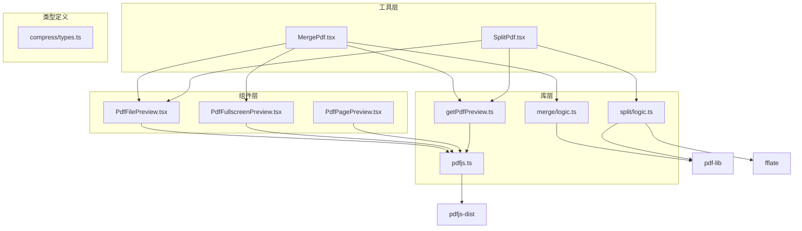
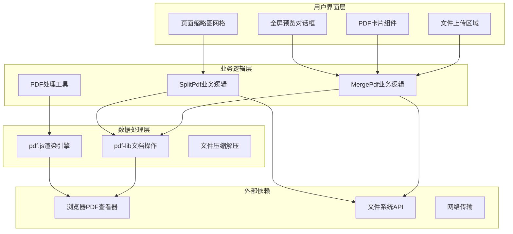
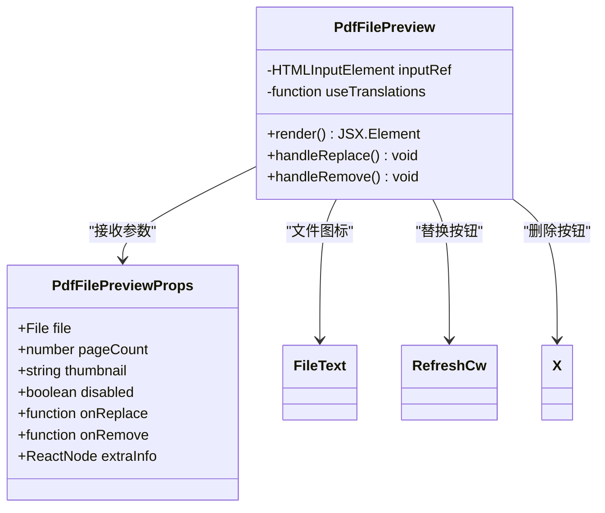
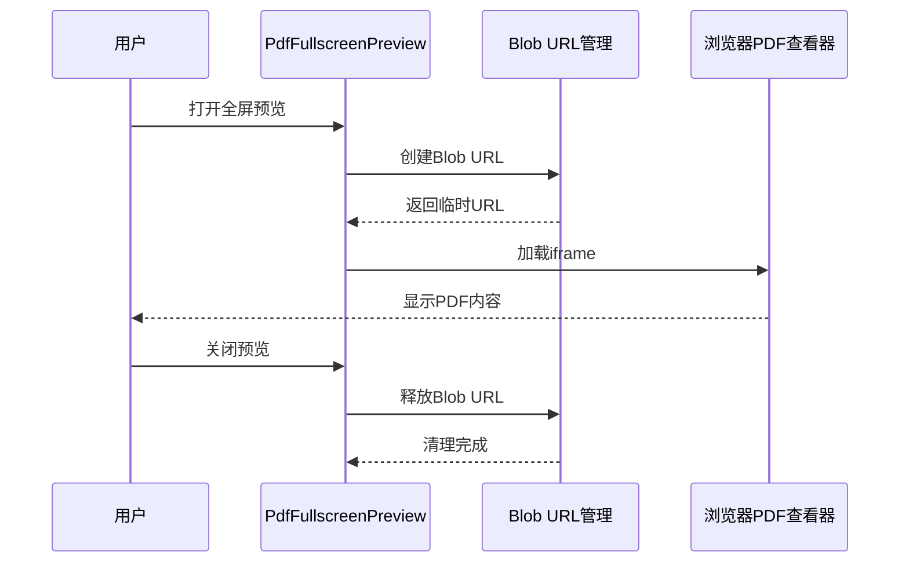
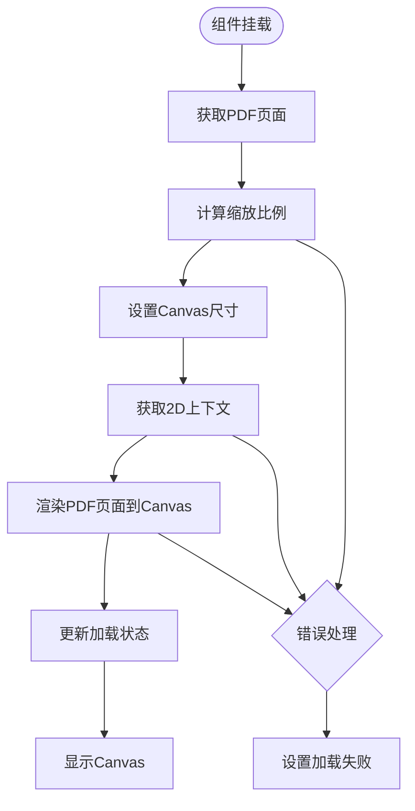
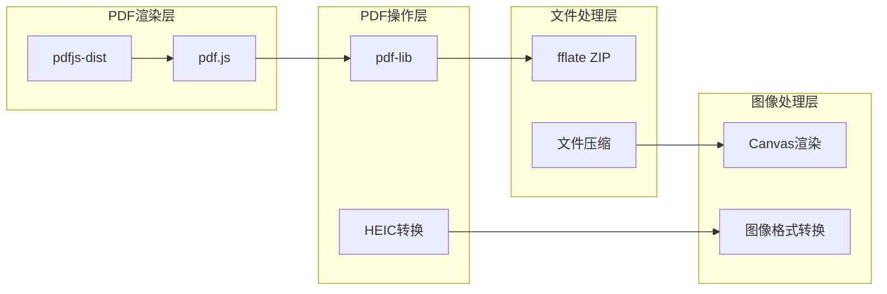

# PDF文件预览组件

<cite>
**本文档引用的文件**
- [PdfFilePreview.tsx](file://src/components/shared/PdfFilePreview.tsx)
- [PdfFullscreenPreview.tsx](file://src/components/shared/PdfFullscreenPreview.tsx)
- [PdfPagePreview.tsx](file://src/components/shared/PdfPagePreview.tsx)
- [pdfjs.ts](file://src/lib/pdfjs.ts)
- [getPdfPreview.ts](file://src/lib/pdf/getPdfPreview.ts)
- [MergePdf.tsx](file://src/tools/pdf/merge/MergePdf.tsx)
- [SplitPdf.tsx](file://src/tools/pdf/split/SplitPdf.tsx)
- [logic.ts（合并）](file://src/tools/pdf/merge/logic.ts)
- [logic.ts（拆分）](file://src/tools/pdf/split/logic.ts)
- [types.ts（压缩）](file://src/tools/pdf/compress/types.ts)
- [package.json](file://package.json)
</cite>

## 目录
1. [简介](#简介)
2. [项目结构](#项目结构)
3. [核心组件](#核心组件)
4. [架构概览](#架构概览)
5. [详细组件分析](#详细组件分析)
6. [依赖关系分析](#依赖关系分析)
7. [性能考虑](#性能考虑)
8. [故障排除指南](#故障排除指南)
9. [结论](#结论)

## 简介

PDF文件预览组件是媒体工具箱中的一个核心功能模块，提供了完整的PDF文件处理能力。该组件集成了文件上传、预览、全屏查看、页面渲染等功能，支持多种PDF操作如合并、拆分、压缩等。

该系统基于React构建，使用pdf.js进行PDF渲染，pdf-lib进行PDF文档操作，实现了从文件选择到最终输出的完整工作流程。

## 项目结构

项目采用按功能模块组织的结构，PDF相关功能分布在以下位置：



**图表来源**
- [PdfFilePreview.tsx:1-91](file://src/components/shared/PdfFilePreview.tsx#L1-L91)
- [PdfFullscreenPreview.tsx:1-76](file://src/components/shared/PdfFullscreenPreview.tsx#L1-L76)
- [PdfPagePreview.tsx:1-92](file://src/components/shared/PdfPagePreview.tsx#L1-L92)
- [MergePdf.tsx:1-670](file://src/tools/pdf/merge/MergePdf.tsx#L1-L670)
- [SplitPdf.tsx:1-369](file://src/tools/pdf/split/SplitPdf.tsx#L1-L369)

**章节来源**
- [package.json:11-34](file://package.json#L11-L34)

## 核心组件

### PdfFilePreview 组件

PdfFilePreview是PDF文件预览的核心组件，提供文件信息显示和交互功能：

- **文件信息展示**：显示文件名、页数、文件大小
- **缩略图支持**：可选的PDF缩略图显示
- **交互功能**：替换文件、删除文件按钮
- **禁用状态**：支持禁用状态控制

### PdfFullscreenPreview 组件

提供PDF文件的全屏预览功能：

- **对话框界面**：模态对话框形式的全屏预览
- **iframe集成**：使用浏览器内置PDF查看器
- **动态URL管理**：安全的Blob URL创建和清理
- **响应式设计**：适配不同屏幕尺寸

### PdfPagePreview 组件

用于渲染单个PDF页面的缩略图：

- **Canvas渲染**：使用HTML5 Canvas渲染PDF页面
- **缩放适配**：根据指定宽度自动计算缩放比例
- **加载状态**：显示加载动画和页面号
- **选中状态**：支持页面选中高亮显示

**章节来源**
- [PdfFilePreview.tsx:8-91](file://src/components/shared/PdfFilePreview.tsx#L8-L91)
- [PdfFullscreenPreview.tsx:13-76](file://src/components/shared/PdfFullscreenPreview.tsx#L13-L76)
- [PdfPagePreview.tsx:7-92](file://src/components/shared/PdfPagePreview.tsx#L7-L92)

## 架构概览

系统采用分层架构设计，各层职责明确：



**图表来源**
- [MergePdf.tsx:82-640](file://src/tools/pdf/merge/MergePdf.tsx#L82-L640)
- [SplitPdf.tsx:36-369](file://src/tools/pdf/split/SplitPdf.tsx#L36-L369)

## 详细组件分析

### PdfFilePreview 组件详细分析

PdfFilePreview组件实现了完整的PDF文件信息展示功能：



**图表来源**
- [PdfFilePreview.tsx:8-26](file://src/components/shared/PdfFilePreview.tsx#L8-L26)

组件特性：
- **国际化支持**：使用next-intl实现多语言支持
- **文件信息格式化**：自动格式化文件大小显示
- **事件处理**：封装文件替换和删除操作
- **可访问性**：支持禁用状态和键盘导航

### PdfFullscreenPreview 组件序列图



**图表来源**
- [PdfFullscreenPreview.tsx:20-40](file://src/components/shared/PdfFullscreenPreview.tsx#L20-L40)

### PdfPagePreview 组件算法流程



**图表来源**
- [PdfPagePreview.tsx:31-56](file://src/components/shared/PdfPagePreview.tsx#L31-L56)

**章节来源**
- [PdfFilePreview.tsx:18-91](file://src/components/shared/PdfFilePreview.tsx#L18-L91)
- [PdfFullscreenPreview.tsx:20-76](file://src/components/shared/PdfFullscreenPreview.tsx#L20-L76)
- [PdfPagePreview.tsx:18-92](file://src/components/shared/PdfPagePreview.tsx#L18-L92)

### PDF处理工具链分析

系统使用了完整的PDF处理工具链：



**图表来源**
- [getPdfPreview.ts:24-72](file://src/lib/pdf/getPdfPreview.ts#L24-L72)
- [logic.ts（合并）:1-141](file://src/tools/pdf/merge/logic.ts#L1-L141)
- [logic.ts（拆分）:1-462](file://src/tools/pdf/split/logic.ts#L1-L462)

**章节来源**
- [pdfjs.ts:1-16](file://src/lib/pdfjs.ts#L1-L16)
- [getPdfPreview.ts:4-72](file://src/lib/pdf/getPdfPreview.ts#L4-L72)

## 依赖关系分析

系统依赖关系清晰，主要依赖包括：

```mermaid
graph TB
subgraph "核心依赖"
A[next]
B[react]
C[react-dom]
D[next-intl]
end
subgraph "PDF处理依赖"
E[pdfjs-dist]
F[pdf-lib]
G[heic2any]
end
subgraph "工具库依赖"
H[fflate]
I[@dnd-kit]
J[tailwind-merge]
end
subgraph "UI组件依赖"
K[lucide-react]
L[clsx]
M[tailwindcss]
end
A --> B
B --> C
D --> A
E --> A
F --> E
G --> A
H --> A
I --> A
J --> M
K --> B
L --> J
```

**图表来源**
- [package.json:11-34](file://package.json#L11-L34)

**章节来源**
- [package.json:11-55](file://package.json#L11-L55)

## 性能考虑

系统在性能方面采用了多项优化策略：

### 并发处理
- **PDF加载并发**：合并工具支持最多3个PDF同时加载
- **异步渲染**：页面渲染使用异步方式避免阻塞主线程
- **内存管理**：及时释放Blob URL和PDF文档对象

### 渲染优化
- **Canvas复用**：避免重复创建Canvas元素
- **缩放计算**：智能计算缩放比例减少渲染开销
- **懒加载**：仅在需要时渲染页面内容

### 内存管理
- **资源清理**：组件卸载时自动清理所有资源
- **URL回收**：使用后立即释放Blob URL
- **对象销毁**：PDF文档对象使用后及时销毁

## 故障排除指南

### 常见问题及解决方案

**PDF加密问题**
- **症状**：打开加密PDF时报错
- **原因**：缺少密码或密码错误
- **解决**：捕获PdfEncryptedError和PdfWrongPasswordError异常

**Canvas渲染失败**
- **症状**：页面缩略图无法显示
- **原因**：Canvas 2D上下文不可用
- **解决**：检查浏览器兼容性和Canvas支持

**内存泄漏**
- **症状**：长时间使用后内存占用持续增长
- **原因**：Blob URL未正确释放
- **解决**：确保在组件卸载时调用URL.revokeObjectURL

**章节来源**
- [getPdfPreview.ts:10-22](file://src/lib/pdf/getPdfPreview.ts#L10-L22)
- [PdfFullscreenPreview.tsx:32-39](file://src/components/shared/PdfFullscreenPreview.tsx#L32-L39)

## 结论

PDF文件预览组件是一个功能完整、架构清晰的PDF处理系统。它成功地整合了文件上传、预览、全屏查看、页面渲染等多种功能，为用户提供了一站式的PDF处理解决方案。

系统的主要优势包括：
- **模块化设计**：组件职责明确，易于维护和扩展
- **性能优化**：采用并发处理和智能缓存策略
- **用户体验**：提供流畅的交互体验和友好的界面设计
- **技术栈先进**：使用最新的React和PDF处理技术

未来可以考虑的功能增强包括：
- 更丰富的PDF编辑功能
- 支持更多PDF标准特性
- 增强的错误处理和恢复机制
- 更好的移动端适配