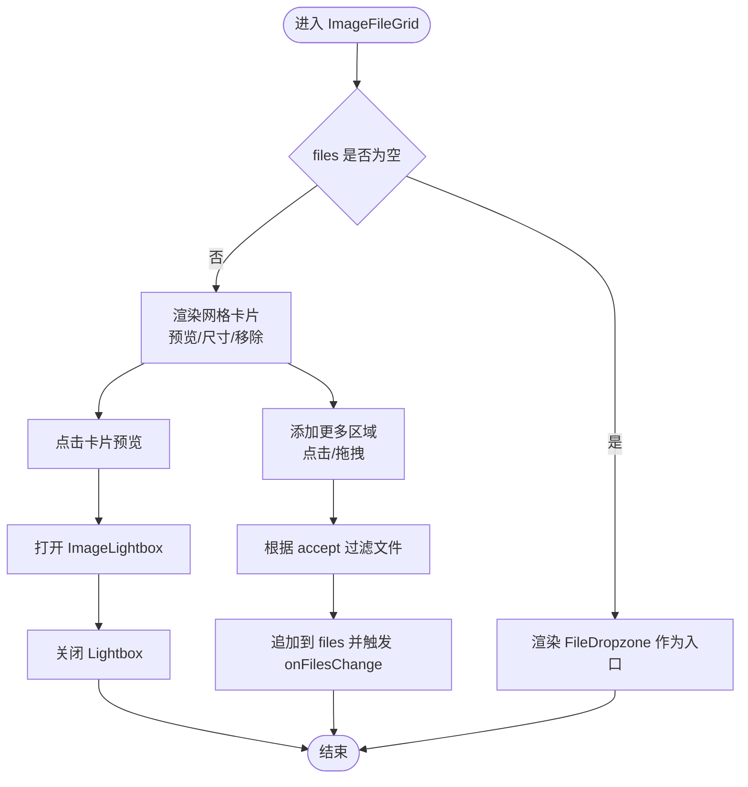
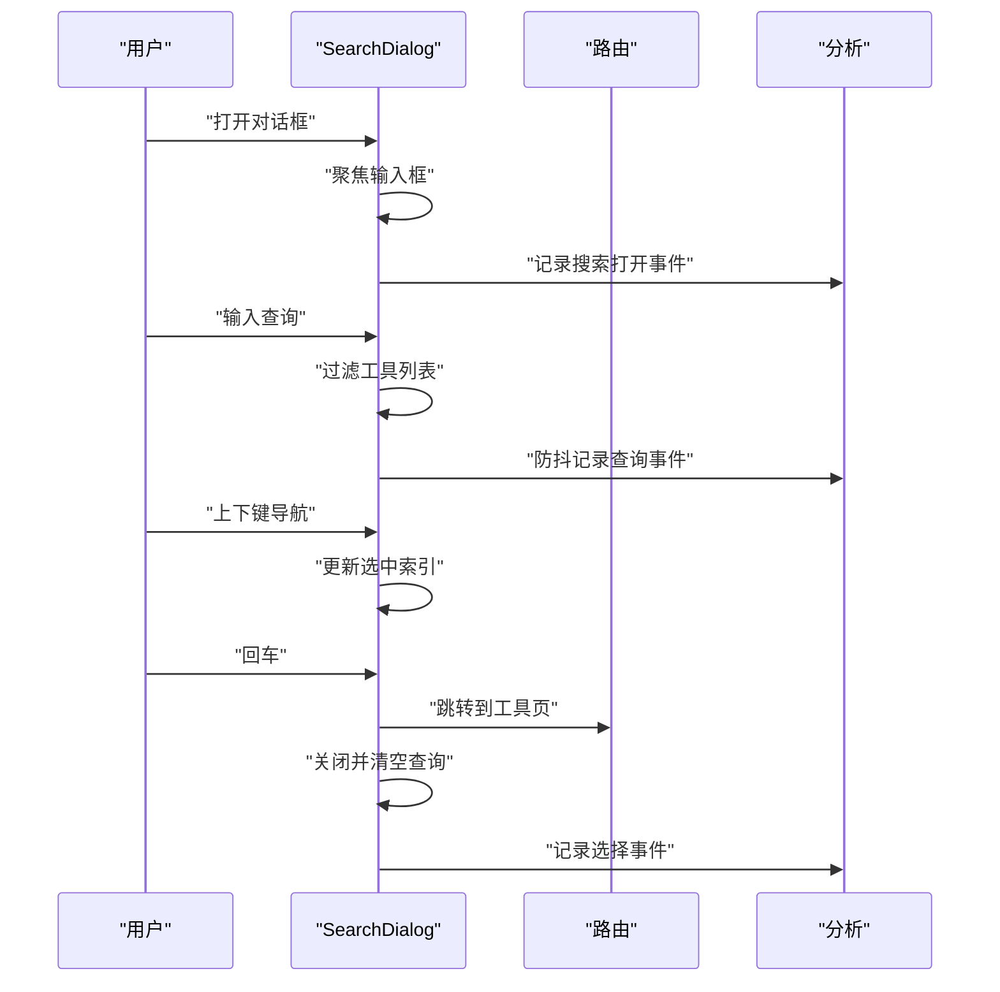
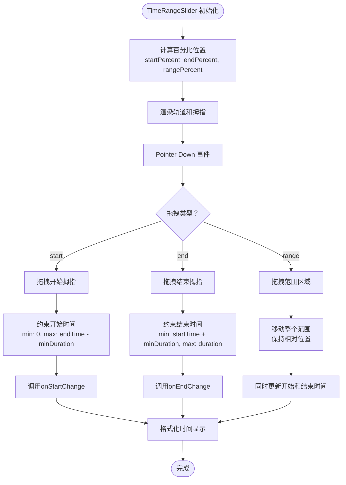
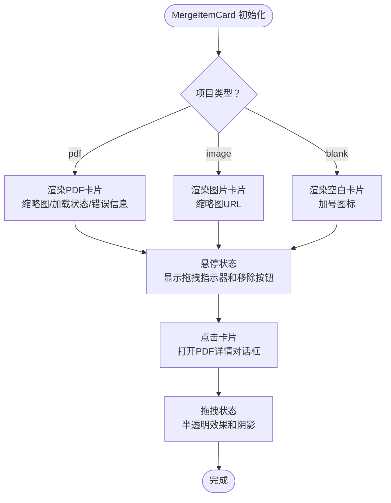
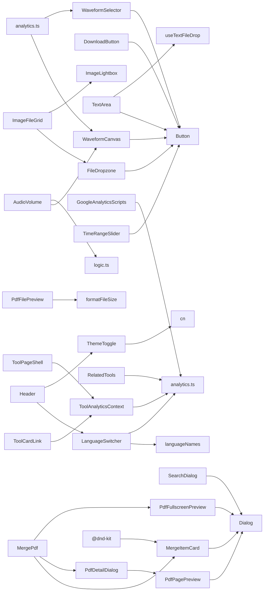

# 共享组件

<cite>
**本文档引用的文件**
- [FileDropzone.tsx](file://src/components/shared/FileDropzone.tsx)
- [DownloadButton.tsx](file://src/components/shared/DownloadButton.tsx)
- [ProcessingProgress.tsx](file://src/components/shared/ProcessingProgress.tsx)
- [ImageFileGrid.tsx](file://src/components/shared/ImageFileGrid.tsx)
- [ImageLightbox.tsx](file://src/components/shared/ImageLightbox.tsx)
- [CompareSlider.tsx](file://src/components/shared/CompareSlider.tsx)
- [TextArea.tsx](file://src/components/shared/TextArea.tsx)
- [ThemeToggle.tsx](file://src/components/shared/ThemeToggle.tsx)
- [LanguageSwitcher.tsx](file://src/components/shared/LanguageSwitcher.tsx)
- [SearchDialog.tsx](file://src/components/shared/SearchDialog.tsx)
- [GoogleAnalyticsScripts.tsx](file://src/components/shared/GoogleAnalyticsScripts.tsx)
- [TimeRangeSlider.tsx](file://src/components/shared/TimeRangeSlider.tsx)
- [PdfFullscreenPreview.tsx](file://src/components/shared/PdfFullscreenPreview.tsx)
- [PdfFilePreview.tsx](file://src/components/shared/PdfFilePreview.tsx)
- [PdfPagePreview.tsx](file://src/components/shared/PdfPagePreview.tsx)
- [MergeItemCard.tsx](file://src/tools/pdf/merge/MergeItemCard.tsx)
- [PdfDetailDialog.tsx](file://src/tools/pdf/merge/PdfDetailDialog.tsx)
- [MergePdf.tsx](file://src/tools/pdf/merge/MergePdf.tsx)
- [Header.tsx](file://src/components/layout/Header.tsx)
- [Button.tsx](file://src/components/ui/Button.tsx)
- [Dialog.tsx](file://src/components/ui/Dialog.tsx)
- [cn.ts](file://src/lib/utils/cn.ts)
- [formatFileSize.ts](file://src/lib/utils/formatFileSize.ts)
- [brand.ts](file://src/lib/brand.ts)
- [useTextFileDrop.ts](file://src/hooks/useTextFileDrop.ts)
- [languageNames.ts](file://src/lib/i18n/languageNames.ts)
- [analytics.ts](file://src/lib/analytics.ts)
- [common.json(zh-Hans)](file://messages/zh-Hans/common.json)
- [focusTrap.ts](file://src/lib/utils/focusTrap.ts)
- [package.json](file://package.json)
- [ToolAnalyticsContext.tsx](file://src/components/tool/ToolAnalyticsContext.tsx)
- [ToolCardLink.tsx](file://src/components/tool/ToolCardLink.tsx)
- [ToolPageShell.tsx](file://src/components/tool/ToolPageShell.tsx)
- [RelatedTools.tsx](file://src/components/tool/RelatedTools.tsx)
- [HomeUI.tsx](file://src/components/home/HomeUI.tsx)
- [WaveformCanvas.tsx](file://src/components/shared/WaveformCanvas.tsx)
- [WaveformSelector.tsx](file://src/components/shared/WaveformSelector.tsx)
- [AudioVolume.tsx](file://src/tools/audio/volume/AudioVolume.tsx)
- [logic.ts](file://src/tools/audio/volume/logic.ts)
</cite>

## 更新摘要
**变更内容**
- 新增WaveformCanvas组件，用于音频波形可视化和实时显示
- 新增WaveformSelector组件，提供音频波形选择器功能
- 更新AudioVolume工具，集成WaveformCanvas组件进行音频波形显示
- 增强音频处理工具的用户体验，提供直观的波形可视化功能
- 新增音频波形处理相关的工具函数和类型定义

## 目录
1. [简介](#简介)
2. [项目结构](#项目结构)
3. [核心组件](#核心组件)
4. [架构总览](#架构总览)
5. [组件详解](#组件详解)
6. [可访问性设计](#可访问性设计)
7. [分析埋点系统](#分析埋点系统)
8. [依赖关系分析](#依赖关系分析)
9. [性能考量](#性能考量)
10. [故障排查指南](#故障排查指南)
11. [结论](#结论)
12. [附录](#附录)

## 简介
本文件系统性梳理媒体工具箱中的共享组件，覆盖设计理念、复用策略、接口规范、状态管理、可配置性与扩展性、交互与可访问性、国际化支持以及性能优化与内存管理。目标读者既包括UI开发者，也面向需要在业务场景中正确使用这些组件的其他开发者。

**更新** 本版本重点介绍了新增的WaveformCanvas和WaveformSelector组件，这两个组件专门用于音频波形可视化，为音频处理工具提供了直观的波形显示和交互功能。这些组件已在AudioVolume工具中得到应用，为用户提供更好的音频编辑体验。

## 项目结构
共享组件集中位于 src/components/shared 目录，围绕"文件上传/下载"、"图片展示/预览/对比"、"文本输入/拖拽"、"主题/语言切换"、"全局搜索"、"分析埋点"、"时间范围选择"、"PDF处理"、"音频波形可视化"等通用能力构建，配合 src/components/ui/Button.tsx、src/components/ui/Dialog.tsx、src/lib/utils/* 工具函数与国际化消息 common.json 实现一致的外观与行为。

新增的音频波形可视化组件位于 src/components/shared/WaveformCanvas.tsx 和 src/components/shared/WaveformSelector.tsx，为音频处理工具提供专业的波形显示和交互功能。

```mermaid
graph TB
subgraph "共享组件"
FDZ["FileDropzone.tsx"]
DLB["DownloadButton.tsx"]
PP["ProcessingProgress.tsx"]
IFG["ImageFileGrid.tsx"]
ILB["ImageLightbox.tsx"]
CS["CompareSlider.tsx"]
TA["TextArea.tsx"]
TT["ThemeToggle.tsx"]
LS["LanguageSwitcher.tsx"]
SD["SearchDialog.tsx"]
GAS["GoogleAnalyticsScripts.tsx"]
TRS["TimeRangeSlider.tsx"]
PFP["PdfFullscreenPreview.tsx"]
PFPV["PdfFilePreview.tsx"]
PPP["PdfPagePreview.tsx"]
WFC["WaveformCanvas.tsx"]
WFS["WaveformSelector.tsx"]
end
subgraph "音频处理工具"
AV["AudioVolume.tsx"]
end
subgraph "PDF合并工具"
MIC["MergeItemCard.tsx"]
PDD["PdfDetailDialog.tsx"]
MPDF["MergePdf.tsx"]
end
subgraph "工具分析组件"
TAC["ToolAnalyticsContext.tsx"]
TCL["ToolCardLink.tsx"]
TPS["ToolPageShell.tsx"]
RT["RelatedTools.tsx"]
end
subgraph "UI与工具"
BTN["Button.tsx"]
DLG["Dialog.tsx"]
CN["cn.ts"]
FFS["formatFileSize.ts"]
BRD["brand.ts"]
UTEXT["useTextFileDrop.ts"]
LANGNAMES["languageNames.ts"]
ANALYTICS["analytics.ts"]
end
FDZ --> BTN
DLB --> BTN
IFG --> FDZ
IFG --> ILB
IFG --> FFS
ILB --> DLG
CS --> CN
TA --> BTN
TA --> UTEXT
TT --> CN
LS --> LANGNAMES
LS --> ANALYTICS
SD --> DLG
HDR["Header.tsx"] --> LS
HDR --> TT
GAS --> ANALYTICS
TRS --> BTN
PFP --> DLG
PFPV --> FFS
PPP --> DLG
MIC --> PDD
MIC --> DLG
PDD --> PPP
MPDF --> MIC
MPDF --> PDD
MPDF --> PFP
TAC --> ANALYTICS
TCL --> TAC
TPS --> TAC
RT --> ANALYTICS
AV --> WFC
WFC --> BTN
WFS --> BTN
```

**图表来源**
- [FileDropzone.tsx:1-157](file://src/components/shared/FileDropzone.tsx#L1-L157)
- [DownloadButton.tsx:1-54](file://src/components/shared/DownloadButton.tsx#L1-L54)
- [ProcessingProgress.tsx:1-47](file://src/components/shared/ProcessingProgress.tsx#L1-L47)
- [ImageFileGrid.tsx:1-226](file://src/components/shared/ImageFileGrid.tsx#L1-L226)
- [ImageLightbox.tsx:1-36](file://src/components/shared/ImageLightbox.tsx#L1-L36)
- [CompareSlider.tsx:1-134](file://src/components/shared/CompareSlider.tsx#L1-L134)
- [TextArea.tsx:1-74](file://src/components/shared/TextArea.tsx#L1-L74)
- [ThemeToggle.tsx:1-36](file://src/components/shared/ThemeToggle.tsx#L1-L36)
- [LanguageSwitcher.tsx:1-154](file://src/components/shared/LanguageSwitcher.tsx#L1-L154)
- [SearchDialog.tsx:1-190](file://src/components/shared/SearchDialog.tsx#L1-L190)
- [GoogleAnalyticsScripts.tsx:1-21](file://src/components/shared/GoogleAnalyticsScripts.tsx#L1-L21)
- [TimeRangeSlider.tsx:1-144](file://src/components/shared/TimeRangeSlider.tsx#L1-L144)
- [PdfFullscreenPreview.tsx:1-76](file://src/components/shared/PdfFullscreenPreview.tsx#L1-L76)
- [PdfFilePreview.tsx:1-91](file://src/components/shared/PdfFilePreview.tsx#L1-L91)
- [PdfPagePreview.tsx:1-80](file://src/components/shared/PdfPagePreview.tsx#L1-L80)
- [WaveformCanvas.tsx:1-97](file://src/components/shared/WaveformCanvas.tsx#L1-L97)
- [WaveformSelector.tsx:1-134](file://src/components/shared/WaveformSelector.tsx#L1-L134)
- [AudioVolume.tsx:1-372](file://src/tools/audio/volume/AudioVolume.tsx#L1-L372)
- [logic.ts:1-53](file://src/tools/audio/volume/logic.ts#L1-L53)
- [MergeItemCard.tsx:1-361](file://src/tools/pdf/merge/MergeItemCard.tsx#L1-L361)
- [PdfDetailDialog.tsx:1-149](file://src/tools/pdf/merge/PdfDetailDialog.tsx#L1-L149)
- [MergePdf.tsx:1-677](file://src/tools/pdf/merge/MergePdf.tsx#L1-L677)
- [Header.tsx:1-303](file://src/components/layout/Header.tsx#L1-L303)
- [Button.tsx:1-42](file://src/components/ui/Button.tsx#L1-L42)
- [Dialog.tsx:1-42](file://src/components/ui/Dialog.tsx#L1-L42)
- [ToolAnalyticsContext.tsx:1-14](file://src/components/tool/ToolAnalyticsContext.tsx#L1-L14)
- [ToolCardLink.tsx:1-34](file://src/components/tool/ToolCardLink.tsx#L1-L34)
- [ToolPageShell.tsx:1-60](file://src/components/tool/ToolPageShell.tsx#L1-L60)
- [RelatedTools.tsx:1-57](file://src/components/tool/RelatedTools.tsx#L1-L57)

**章节来源**
- [FileDropzone.tsx:1-157](file://src/components/shared/FileDropzone.tsx#L1-L157)
- [ImageFileGrid.tsx:1-226](file://src/components/shared/ImageFileGrid.tsx#L1-L226)
- [Button.tsx:1-42](file://src/components/ui/Button.tsx#L1-L42)
- [Dialog.tsx:1-42](file://src/components/ui/Dialog.tsx#L1-L42)
- [cn.ts:1-7](file://src/lib/utils/cn.ts#L1-L7)

## 核心组件
- FileDropzone：文件拖拽上传容器，支持类型与大小过滤、隐私提示、分析埋点，具备完整的键盘导航支持。
- DownloadButton：下载按钮，统一品牌文件名、内存URL释放、分析埋点。
- ProcessingProgress：处理进度条，支持确定/不确定进度、自定义标签。
- ImageFileGrid：图片文件网格，预览、尺寸、移除、清空、拖拽追加、轻量预览URL管理。
- ImageLightbox：图片灯箱，焦点管理、ESC关闭、滚动锁定，使用标准Dialog组件提升可访问性。
- CompareSlider：前后对比滑块，指针事件、clip-path裁剪、标签与已保存百分比提示，具备完整的键盘操作支持。
- TextArea：文本域，计数、拖拽文本文件、稳定回调、拖拽态视觉反馈。
- ThemeToggle：主题切换器，三态循环（浅色/深色/系统），无障碍标签。
- LanguageSwitcher：语言切换器，下拉列表、点击外部关闭、本地存储、分析埋点，具备重大可访问性改进。
- SearchDialog：全局搜索对话框，查询过滤、键盘导航、快捷键、分析埋点。
- GoogleAnalyticsScripts：Google Analytics脚本组件，支持GA4集成和环境变量配置。
- TimeRangeSlider：时间范围选择滑块，双拇指拖拽、智能拖拽交互、实时时间格式化，专为视频编辑工具设计。
- Header：页面头部导航，包含菜单、搜索、语言切换、主题切换等，增强键盘导航支持。
- **新增** WaveformCanvas：音频波形可视化组件，基于Canvas实现高性能波形渲染，支持缩放、颜色自适应和响应式布局。
- **新增** WaveformSelector：音频波形选择器组件，提供音频波形的交互式选择功能，支持播放头显示和范围选择。
- **新增** AudioVolume：音频音量调节工具，集成WaveformCanvas提供音频波形显示功能。
- **新增** ToolAnalyticsContext：工具分析上下文，提供工具级别的分析数据传递。
- **新增** ToolCardLink：工具卡片链接组件，支持工具卡片点击分析埋点和位置信息传递。
- **新增** ToolPageShell：工具页面外壳组件，提供工具分析上下文和页面布局。
- **新增** RelatedTools：相关工具组件，支持工具间的相互点击分析埋点。
- **新增** PdfFullscreenPreview：全屏PDF预览对话框，基于标准Dialog组件，支持iframe嵌入和内存URL管理。
- **新增** MergeItemCard：PDF合并项目卡片，支持拖拽排序、多种文件类型、加载状态和错误处理。
- **新增** PdfDetailDialog：PDF详情对话框，提供页面选择、旋转、全选/取消选择功能。
- **新增** PdfFilePreview：PDF文件预览组件，支持缩略图、页面数、文件大小显示。
- **新增** PdfPagePreview：PDF页面预览组件，基于canvas渲染，支持选择状态和点击事件。

**章节来源**
- [FileDropzone.tsx:9-17](file://src/components/shared/FileDropzone.tsx#L9-L17)
- [DownloadButton.tsx:10-16](file://src/components/shared/DownloadButton.tsx#L10-L16)
- [ProcessingProgress.tsx:6-12](file://src/components/shared/ProcessingProgress.tsx#L6-L12)
- [ImageFileGrid.tsx:10-15](file://src/components/shared/ImageFileGrid.tsx#L10-L15)
- [ImageLightbox.tsx:7-11](file://src/components/shared/ImageLightbox.tsx#L7-L11)
- [CompareSlider.tsx:6-12](file://src/components/shared/CompareSlider.tsx#L6-L12)
- [TextArea.tsx:11-15](file://src/components/shared/TextArea.tsx#L11-L15)
- [ThemeToggle.tsx:9-11](file://src/components/shared/ThemeToggle.tsx#L9-L11)
- [LanguageSwitcher.tsx:11-13](file://src/components/shared/LanguageSwitcher.tsx#L11-L13)
- [SearchDialog.tsx:18-22](file://src/components/shared/SearchDialog.tsx#L18-L22)
- [GoogleAnalyticsScripts.tsx:6-20](file://src/components/shared/GoogleAnalyticsScripts.tsx#L6-L20)
- [TimeRangeSlider.tsx:7-14](file://src/components/shared/TimeRangeSlider.tsx#L7-L14)
- [Header.tsx:16-20](file://src/components/layout/Header.tsx#L16-L20)
- [WaveformCanvas.tsx:5-10](file://src/components/shared/WaveformCanvas.tsx#L5-L10)
- [WaveformSelector.tsx:5-13](file://src/components/shared/WaveformSelector.tsx#L5-L13)
- [AudioVolume.tsx:8](file://src/tools/audio/volume/AudioVolume.tsx#L8)
- [ToolAnalyticsContext.tsx:5-7](file://src/components/tool/ToolAnalyticsContext.tsx#L5-L7)
- [ToolCardLink.tsx:7-14](file://src/components/tool/ToolCardLink.tsx#L7-L14)
- [ToolPageShell.tsx:11-23](file://src/components/tool/ToolPageShell.tsx#L11-L23)
- [RelatedTools.tsx:17-31](file://src/components/tool/RelatedTools.tsx#L17-L31)
- [PdfFullscreenPreview.tsx:13-18](file://src/components/shared/PdfFullscreenPreview.tsx#L13-L18)
- [MergeItemCard.tsx:16-38](file://src/tools/pdf/merge/MergeItemCard.tsx#L16-L38)
- [PdfDetailDialog.tsx:16-29](file://src/tools/pdf/merge/PdfDetailDialog.tsx#L16-L29)
- [PdfFilePreview.tsx:8-16](file://src/components/shared/PdfFilePreview.tsx#L8-L16)
- [PdfPagePreview.tsx:7-14](file://src/components/shared/PdfPagePreview.tsx#L7-L14)

## 架构总览
共享组件遵循"低耦合、高内聚"的原则，通过以下机制实现：
- 统一的UI基元：Button.tsx 提供变体与尺寸；Dialog.tsx 提供可访问性对话框；cn.ts 合并Tailwind类。
- 国际化：next-intl 提供翻译；common.json 提供文案；languageNames.ts 映射语言名。
- 工具函数：formatFileSize.ts、brand.ts、useTextFileDrop.ts 提供通用能力。
- 分析埋点：analytics.ts 提供统一的事件跟踪接口，支持隐私保护和类型安全。
- 可访问性：所有组件具备ARIA角色、键盘导航和无障碍标签支持。
- Google Analytics：GoogleAnalyticsScripts.tsx 提供GA4集成，支持环境变量配置。
- 时间范围选择：TimeRangeSlider.tsx 提供专业的视频编辑时间选择功能。
- **新增** 音频波形可视化：WaveformCanvas.tsx 和 WaveformSelector.tsx 提供高性能的音频波形渲染和交互功能。
- **新增** 工具分析上下文：ToolAnalyticsContext 提供工具级别的分析数据传递。
- **新增** 工具卡片链接：ToolCardLink 支持工具卡片点击分析埋点和位置信息。
- **新增** 工具页面外壳：ToolPageShell 提供工具分析上下文和页面布局。
- **新增** PDF处理：PdfFullscreenPreview、MergeItemCard、PdfDetailDialog等组件提供完整的PDF合并工具链。
- **新增** 拖拽功能：@dnd-kit依赖提供拖拽排序支持，Enhanced with keyboard support.

```mermaid
graph TB
subgraph "共享组件层"
C1["FileDropzone"]
C2["DownloadButton"]
C3["ProcessingProgress"]
C4["ImageFileGrid"]
C5["ImageLightbox"]
C6["CompareSlider"]
C7["TextArea"]
C8["ThemeToggle"]
C9["LanguageSwitcher"]
C10["SearchDialog"]
C11["Header"]
C12["GoogleAnalyticsScripts"]
C13["TimeRangeSlider"]
C14["PdfFullscreenPreview"]
C15["PdfFilePreview"]
C16["PdfPagePreview"]
C17["WaveformCanvas"]
C18["WaveformSelector"]
end
subgraph "音频处理工具层"
C19["AudioVolume"]
end
subgraph "工具分析组件层"
C20["ToolAnalyticsContext"]
C21["ToolCardLink"]
C22["ToolPageShell"]
C23["RelatedTools"]
end
subgraph "PDF合并工具层"
C24["MergeItemCard"]
C25["PdfDetailDialog"]
C26["MergePdf"]
end
subgraph "基础层"
UI["Button"]
DLG["Dialog"]
UT["cn"]
FS["formatFileSize"]
BR["brandFilename"]
TF["useTextFileDrop"]
LN["languageNames"]
TR["next-intl 翻译"]
AN["analytics.ts"]
DK["@dnd-kit"]
WFC["WaveformCanvas"]
WFS["WaveformSelector"]
AV["AudioVolume"]
LOGIC["logic.ts"]
end
C1 --> UI
C2 --> UI
C4 --> C1
C4 --> C5
C4 --> FFS
C5 --> DLG
C2 --> BR
C7 --> TF
C8 --> UT
C9 --> LN
C9 --> AN
C10 --> DLG
C11 --> C9
C11 --> C8
C12 --> AN
C13 --> UI
C14 --> DLG
C15 --> FS
C16 --> DLG
C17 --> UI
C18 --> UI
C19 --> C17
C19 --> LOGIC
C20 --> AN
C21 --> C20
C22 --> C20
C23 --> AN
C24 --> DLG
C25 --> C16
C26 --> C24
C26 --> C25
C26 --> C14
DK --> C24
C1 --> TR
C2 --> TR
C3 --> TR
C4 --> TR
C5 --> TR
C6 --> TR
C7 --> TR
C8 --> TR
C9 --> TR
C10 --> TR
C11 --> TR
C12 --> TR
C13 --> TR
C14 --> TR
C15 --> TR
C16 --> TR
C17 --> TR
C18 --> TR
C19 --> TR
C20 --> TR
C21 --> TR
C22 --> TR
C23 --> TR
C24 --> TR
C25 --> TR
C26 --> TR
```

**图表来源**
- [Button.tsx:1-42](file://src/components/ui/Button.tsx#L1-L42)
- [Dialog.tsx:1-42](file://src/components/ui/Dialog.tsx#L1-L42)
- [cn.ts:1-7](file://src/lib/utils/cn.ts#L1-L7)
- [formatFileSize.ts:1-6](file://src/lib/utils/formatFileSize.ts#L1-L6)
- [brand.ts:1-7](file://src/lib/brand.ts#L1-L7)
- [useTextFileDrop.ts:1-75](file://src/hooks/useTextFileDrop.ts#L1-L75)
- [languageNames.ts:1-26](file://src/lib/i18n/languageNames.ts#L1-L26)
- [analytics.ts:1-183](file://src/lib/analytics.ts#L1-L183)
- [common.json(zh-Hans):1-508](file://messages/zh-Hans/common.json#L1-L508)
- [package.json:12-14](file://package.json#L12-L14)
- [WaveformCanvas.tsx:1-97](file://src/components/shared/WaveformCanvas.tsx#L1-L97)
- [WaveformSelector.tsx:1-134](file://src/components/shared/WaveformSelector.tsx#L1-L134)
- [AudioVolume.tsx:1-372](file://src/tools/audio/volume/AudioVolume.tsx#L1-L372)
- [logic.ts:1-53](file://src/tools/audio/volume/logic.ts#L1-L53)
- [ToolAnalyticsContext.tsx:1-14](file://src/components/tool/ToolAnalyticsContext.tsx#L1-L14)
- [ToolCardLink.tsx:1-34](file://src/components/tool/ToolCardLink.tsx#L1-L34)
- [ToolPageShell.tsx:1-60](file://src/components/tool/ToolPageShell.tsx#L1-L60)
- [RelatedTools.tsx:1-57](file://src/components/tool/RelatedTools.tsx#L1-L57)

## 组件详解

### WaveformCanvas 音频波形可视化组件
- 功能特性
  - 基于Canvas的高性能音频波形渲染，支持多通道音频数据。
  - 自适应颜色系统，使用CSS变量获取当前主题颜色。
  - 响应式布局，自动监听容器宽度变化并重新绘制。
  - 设备像素比适配，确保高分辨率屏幕上的清晰显示。
  - 实时音量缩放，支持0-4倍的垂直缩放范围。
  - 中线标记显示，提供音频零电平参考线。
- 属性接口
  - audioBuffer: AudioBuffer | null（必需）- 音频缓冲区数据
  - gain?: number（可选，默认1）- 音量缩放系数（0-4）
  - height?: number（可选，默认80）- 波形高度（像素）
  - className?: string（可选）- CSS类名
- 事件与状态
  - 内部维护容器宽度状态，通过ResizeObserver监听布局变化。
  - 使用devicePixelRatio优化Canvas渲染质量。
  - 通过transform scaleY实现音量缩放，带80ms过渡动画。
- 可配置性与扩展性
  - 支持自定义高度和样式类名。
  - 可扩展为支持更多波形样式和交互功能。
  - 支持响应式设计，适应不同屏幕尺寸。
- 交互与可访问性
  - 作为纯展示组件，不直接参与用户交互。
  - 使用CSS transform实现缩放，保持良好的可访问性。
- 性能与内存
  - 使用samplesPerPixel算法优化渲染性能，避免过度采样。
  - Canvas尺寸按设备像素比调整，确保清晰度。
  - 内存URL在组件卸载时自动清理。
- 使用示例
  - 在AudioVolume工具中显示音频波形。
  - 音频编辑工具中的波形预览功能。

**章节来源**
- [WaveformCanvas.tsx:5-10](file://src/components/shared/WaveformCanvas.tsx#L5-L10)
- [WaveformCanvas.tsx:12-17](file://src/components/shared/WaveformCanvas.tsx#L12-L17)
- [WaveformCanvas.tsx:22-30](file://src/components/shared/WaveformCanvas.tsx#L22-L30)
- [WaveformCanvas.tsx:32-79](file://src/components/shared/WaveformCanvas.tsx#L32-L79)
- [WaveformCanvas.tsx:81-96](file://src/components/shared/WaveformCanvas.tsx#L81-L96)

### WaveformSelector 音频波形选择器组件
- 功能特性
  - 基于Canvas的音频波形渲染，支持播放头显示和范围选择。
  - 响应式布局，自动监听容器宽度变化并重新绘制。
  - 设备像素比适配，确保高分辨率屏幕上的清晰显示。
  - 播放头指示器，实时显示当前播放位置。
  - 范围选择高亮，显示起始和结束位置的遮罩区域。
  - 指针事件处理，支持点击和拖拽选择音频范围。
- 属性接口
  - audioBuffer: AudioBuffer | null（必需）- 音频缓冲区数据
  - start: number（必需）- 起始时间（秒）
  - end: number（必需）- 结束时间（秒）
  - currentTime: number（必需）- 当前播放时间（秒）
  - duration: number（必需）- 音频总时长（秒）
  - onSeek?: (time: number) => void（可选）- 播放头拖拽回调
  - height?: number（可选，默认96）- 波形高度（像素）
- 事件与状态
  - 内部维护容器宽度状态，通过ResizeObserver监听布局变化。
  - 使用devicePixelRatio优化Canvas渲染质量。
  - 支持指针事件处理，实现播放头拖拽和范围选择。
- 可配置性与扩展性
  - 支持自定义高度和样式类名。
  - 可扩展为支持更多波形样式和交互功能。
  - 支持响应式设计，适应不同屏幕尺寸。
- 交互与可访问性
  - 基于指针事件的交互，支持触摸和鼠标操作。
  - 使用CSS transform实现缩放，保持良好的可访问性。
- 性能与内存
  - 使用samplesPerPixel算法优化渲染性能，避免过度采样。
  - Canvas尺寸按设备像素比调整，确保清晰度。
- 使用示例
  - 音频播放器中的波形进度条。
  - 音频编辑工具中的时间范围选择功能。

**章节来源**
- [WaveformSelector.tsx:5-13](file://src/components/shared/WaveformSelector.tsx#L5-L13)
- [WaveformSelector.tsx:15-23](file://src/components/shared/WaveformSelector.tsx#L15-L23)
- [WaveformSelector.tsx:28-85](file://src/components/shared/WaveformSelector.tsx#L28-L85)
- [WaveformSelector.tsx:92-100](file://src/components/shared/WaveformSelector.tsx#L92-L100)
- [WaveformSelector.tsx:102-132](file://src/components/shared/WaveformSelector.tsx#L102-L132)

### AudioVolume 音频音量调节工具
- 功能特性
  - 集成WaveformCanvas组件，提供音频波形可视化功能。
  - 支持百分比和分贝两种音量单位切换。
  - 预设音量级别快速调节，包括静音、50%、100%、150%、200%。
  - 实时预览功能，支持播放预览音频。
  - 音频解码和处理，支持多种音频格式。
  - 剪辑检测，当音量超过100%时显示警告。
- 属性接口
  - 无（页面组件）
- 事件与状态
  - 使用AudioContext解码音频文件，生成AudioBuffer。
  - 支持实时音量调节和预览播放。
  - 预设音量级别一键应用，自动转换单位。
- 可配置性与扩展性
  - 支持自定义音量范围和预设值。
  - 可扩展为支持更多音频处理功能。
- 交互与可访问性
  - 完整的键盘导航支持。
  - 预设按钮具备无障碍标签。
  - 单位切换按钮具备ARIA标签。
- 性能与内存
  - 音频解码使用异步处理，避免阻塞主线程。
  - 预览播放结束后自动清理AudioContext。
  - WaveformCanvas使用高效的Canvas渲染。
- 使用示例
  - 音频文件的音量调节和预览。
  - 音频编辑工具中的波形显示和音量控制。

**章节来源**
- [AudioVolume.tsx:8](file://src/tools/audio/volume/AudioVolume.tsx#L8)
- [AudioVolume.tsx:34-92](file://src/tools/audio/volume/AudioVolume.tsx#L34-L92)
- [AudioVolume.tsx:228-240](file://src/tools/audio/volume/AudioVolume.tsx#L228-L240)
- [AudioVolume.tsx:233-238](file://src/tools/audio/volume/AudioVolume.tsx#L233-L238)

### ToolAnalyticsContext 工具分析上下文
- 功能特性
  - 提供工具级别的分析数据传递，包括工具slug和category。
  - 使用React Context实现跨组件的数据共享。
  - 支持null值表示无分析上下文。
- 属性接口
  - 无（作为Provider使用）
- 事件与状态
  - ToolAnalytics类型定义：{ slug: string; category: string } | null
  - 通过Provider组件提供上下文值
  - useContext钩子获取当前工具分析数据
- 可配置性与扩展性
  - 可扩展为包含更多工具分析信息
  - 支持嵌套上下文和条件提供者
- 交互与可访问性
  - 作为上下文组件，不直接参与用户交互
- 性能与内存
  - Context更新时触发子组件重渲染
  - 使用useMemo优化分析值计算
- 使用示例
  - 在ToolPageShell中提供工具分析上下文
  - 通过useToolAnalytics获取当前工具信息

**章节来源**
- [ToolAnalyticsContext.tsx:5-7](file://src/components/tool/ToolAnalyticsContext.tsx#L5-L7)
- [ToolAnalyticsContext.tsx:9-13](file://src/components/tool/ToolAnalyticsContext.tsx#L9-L13)

### ToolCardLink 工具卡片链接
- 功能特性
  - 工具卡片链接组件，支持工具卡片点击分析埋点。
  - 自动传递位置信息和来源页面类型。
  - 基于国际化导航Link组件实现。
- 属性接口
  - category: string（工具类别）
  - slug: string（工具slug）
  - position?: number（卡片位置，可选）
  - from: "home" | "category" | "header_menu"（来源页面）
  - className?: string（样式类名）
  - children: ReactNode（子组件）
- 事件与状态
  - 点击时触发trackToolCardClick分析事件
  - 自动构建工具页面URL：/tools/{category}/{slug}
  - 支持位置信息传递，便于分析用户行为路径
- 可配置性与扩展性
  - 支持自定义样式类名
  - 可扩展为支持更多来源页面类型
  - 支持传递额外的分析参数
- 交互与可访问性
  - 基于Link组件，具备标准的导航行为
  - 支持键盘导航和无障碍标签
- 性能与内存
  - 纯函数组件，无状态副作用
  - 分析事件在点击时触发，避免不必要的计算
- 使用示例
  - 首页工具卡片链接
  - 工具分类页面卡片链接
  - 顶部导航菜单工具链接

**章节来源**
- [ToolCardLink.tsx:7-14](file://src/components/tool/ToolCardLink.tsx#L7-L14)
- [ToolCardLink.tsx:16-33](file://src/components/tool/ToolCardLink.tsx#L16-L33)

### ToolPageShell 工具页面外壳
- 功能特性
  - 工具页面外壳组件，提供工具分析上下文和页面布局。
  - 自动提取工具信息并创建分析上下文值。
  - 提供工具页面的标准布局结构。
- 属性接口
  - tool: ToolDefinition（工具定义）
  - children: React.ReactNode（子组件）
- 事件与状态
  - 使用useMemo优化分析值计算，避免不必要的重渲染
  - 自动从工具定义中提取slug和category
  - 通过ToolAnalyticsProvider提供分析上下文
- 可配置性与扩展性
  - 可扩展为支持更多页面布局选项
  - 支持自定义页面结构和样式
- 交互与可访问性
  - 提供标准的页面布局和导航结构
  - 支持无障碍标签和键盘导航
- 性能与内存
  - 使用useMemo优化分析值计算
  - 合理的状态管理避免性能问题
- 使用示例
  - 工具页面的标准外壳包装
  - 提供工具分析上下文的基础布局

**章节来源**
- [ToolPageShell.tsx:17-23](file://src/components/tool/ToolPageShell.tsx#L17-L23)
- [ToolPageShell.tsx:47](file://src/components/tool/ToolPageShell.tsx#L47)

### RelatedTools 相关工具组件
- 功能特性
  - 相关工具展示组件，支持工具间的相互点击分析埋点。
  - 自动过滤当前工具，展示相关工具列表。
  - 基于工具导航数据提供工具信息。
- 属性接口
  - slugs?: string[]（工具slug数组）
  - currentSlug: string（当前工具slug）
  - category: ToolCategory（工具类别）
- 事件与状态
  - 点击相关工具时触发related_tool_click分析事件
  - 自动过滤当前工具，避免显示自身
  - 从工具导航数据中获取工具名称和描述
- 可配置性与扩展性
  - 支持自定义工具slug列表
  - 可扩展为支持更多过滤条件
- 交互与可访问性
  - 基于Link组件，具备标准的导航行为
  - 支持键盘导航和无障碍标签
- 性能与内存
  - 使用filter和map方法处理工具列表
  - 合理的条件渲染避免不必要的DOM节点
- 使用示例
  - 工具页面底部的相关工具推荐
  - 工具间的交叉引用展示

**章节来源**
- [RelatedTools.tsx:17-31](file://src/components/tool/RelatedTools.tsx#L17-L31)
- [RelatedTools.tsx:40-51](file://src/components/tool/RelatedTools.tsx#L40-L51)

### HomeUI 首页组件
- 功能特性
  - 首页UI组件，展示工具卡片和相关功能。
  - 支持工具卡片点击分析埋点，包括位置信息。
  - 提供多种工具分类展示和元工具推荐。
- 属性接口
  - 无（页面组件）
- 事件与状态
  - 工具卡片点击时触发trackToolCardClick分析事件
  - 自动传递位置索引作为position参数
  - 支持多种工具分类和元工具展示
- 可配置性与扩展性
  - 可扩展为支持更多工具分类
  - 支持自定义工具推荐策略
- 交互与可访问性
  - 基于Link组件，具备标准的导航行为
  - 支持键盘导航和无障碍标签
- 性能与内存
  - 使用map方法渲染工具卡片
  - 合理的动画延迟避免性能问题
- 使用示例
  - 首页工具卡片展示
  - 工具分类和元工具推荐

**章节来源**
- [HomeUI.tsx:20-24](file://src/components/home/HomeUI.tsx#L20-L24)
- [HomeUI.tsx:57-79](file://src/components/home/HomeUI.tsx#L57-L79)
- [HomeUI.tsx:91-115](file://src/components/home/HomeUI.tsx#L91-L115)

### FileDropzone 文件拖拽上传
- 功能特性
  - 支持 accept 类型过滤与 maxSize 大小限制。
  - 拖拽进入/离开高亮、点击触发文件选择。
  - 格式与大小提示、隐私提示。
  - 可选分析埋点（文件类型、数量）。
  - **新增** 完整的键盘导航支持：Tab键聚焦、Enter/Space键激活上传。
- 属性接口
  - accept?: string
  - multiple?: boolean
  - onFiles(files: File[]): void
  - maxSize?: number (bytes)
  - className?: string
  - analyticsSlug?: string
  - analyticsCategory?: string
- 事件与状态
  - 内部维护 dragging 状态；通过 ref 触发隐藏 input。
  - 过滤超出大小的文件后回调 onFiles。
  - **新增** 键盘事件处理：支持Enter和Space键激活文件选择。
- 可配置性与扩展性
  - 通过 accept/multiple/maxSize 控制行为；className 自定义样式。
  - 可接入更多分析维度（如文件夹、类型分布）。
- 交互与可访问性
  - **更新** 按钮具备完整的键盘可达性；aria-label提供语义化描述；tabIndex支持键盘导航。
- 性能与内存
  - 仅在必要时创建预览URL；避免重复计算。
- 使用示例
  - 作为 ImageFileGrid 的"添加更多"入口；或独立用于单图上传。

**章节来源**
- [FileDropzone.tsx:9-17](file://src/components/shared/FileDropzone.tsx#L9-L17)
- [FileDropzone.tsx:42-50](file://src/components/shared/FileDropzone.tsx#L42-L50)
- [FileDropzone.tsx:55-76](file://src/components/shared/FileDropzone.tsx#L55-L76)
- [FileDropzone.tsx:78-157](file://src/components/shared/FileDropzone.tsx#L78-L157)

### DownloadButton 下载按钮
- 功能特性
  - 接收 Blob 或 data URL，自动创建临时 URL 并触发下载。
  - 使用品牌前缀重命名文件名；释放临时URL。
  - 可选分析埋点（文件类型）。
- 属性接口
  - data: Blob | string
  - filename: string
  - className?: string
  - analyticsSlug?: string
  - analyticsCategory?: string
- 事件与状态
  - 点击时创建/下载/撤销临时URL；避免内存泄漏.
- 可配置性与扩展性
  - 支持任意数据源；可扩展为批量下载。
- 交互与可访问性
  - 基于 Button 组件，具备统一的焦点与无障碍标签。
- 性能与内存
  - 仅在需要时创建对象URL并在使用后释放。
- 使用示例
  - 图片压缩/转换后的一键下载；文本导出。

**章节来源**
- [DownloadButton.tsx:10-16](file://src/components/shared/DownloadButton.tsx#L10-L16)
- [DownloadButton.tsx:18-45](file://src/components/shared/DownloadButton.tsx#L18-L45)
- [DownloadButton.tsx:47-53](file://src/components/shared/DownloadButton.tsx#L47-L53)
- [brand.ts:1-7](file://src/lib/brand.ts#L1-L7)

### ProcessingProgress 处理进度条
- 功能特性
  - 支持确定进度（0–100）与不确定动画。
  - 自定义标签覆盖默认文案。
- 属性接口
  - progress?: number
  - label?: string
  - className?: string
- 事件与状态
  - 通过 isDeterminate 切换确定/不确定样式。
- 可配置性与扩展性
  - 标签可本地化；样式通过 className 定制。
- 交互与可访问性
  - 文案与数值对读屏友好。
- 性能与内存
  - 纯展示组件，无状态副作用。
- 使用示例
  - FFmpeg 处理、PDF 合并、图片压缩等长任务进度反馈。

**章节来源**
- [ProcessingProgress.tsx:6-12](file://src/components/shared/ProcessingProgress.tsx#L6-L12)
- [ProcessingProgress.tsx:14-46](file://src/components/shared/ProcessingProgress.tsx#L14-L46)

### ImageFileGrid 图片网格
- 功能特性
  - 文件列表预览、尺寸与大小展示、移除单个/清空。
  - "添加更多"支持点击与拖拽；拖拽过滤 accept。
  - 点击预览进入 ImageLightbox。
  - 预览URL增量同步与清理。
- 属性接口
  - files: File[]
  - onFilesChange(files: File[]): void
  - disabled?: boolean
  - accept?: string
- 事件与状态
  - previews/dimensions 状态映射文件；引用缓存避免重复创建URL。
  - 拖拽进入/离开 add 区域；过滤不匹配类型。
- 可配置性与扩展性
  - accept 默认 image/*；disabled 控制交互。
- 交互与可访问性
  - 键盘激活"添加更多"；移除按钮具备无障碍标签。
- 性能与内存
  - 单文件预览URL创建与撤销；尺寸异步加载后更新。
- 使用示例
  - 多图上传、批量预览与筛选。

**图表来源**
- [ImageFileGrid.tsx:17-22](file://src/components/shared/ImageFileGrid.tsx#L17-L22)
- [ImageFileGrid.tsx:42-74](file://src/components/shared/ImageFileGrid.tsx#L42-L74)
- [ImageFileGrid.tsx:154-173](file://src/components/shared/ImageFileGrid.tsx#L154-L173)
- [ImageFileGrid.tsx:216-222](file://src/components/shared/ImageFileGrid.tsx#L216-L222)

**章节来源**
- [ImageFileGrid.tsx:10-15](file://src/components/shared/ImageFileGrid.tsx#L10-L15)
- [ImageFileGrid.tsx:17-22](file://src/components/shared/ImageFileGrid.tsx#L17-L22)
- [ImageFileGrid.tsx:42-74](file://src/components/shared/ImageFileGrid.tsx#L42-L74)
- [ImageFileGrid.tsx:154-173](file://src/components/shared/ImageFileGrid.tsx#L154-L173)
- [ImageFileGrid.tsx:216-222](file://src/components/shared/ImageFileGrid.tsx#L216-L222)
- [formatFileSize.ts:1-6](file://src/lib/utils/formatFileSize.ts#L1-L6)

### ImageLightbox 图片灯箱
- 功能特性
  - 全屏展示图片，ESC 关闭；滚动锁定；焦点管理。
  - **更新** 使用标准 Dialog 组件，提供更好的可访问性支持。
- 属性接口
  - src: string
  - alt?: string
  - onClose(): void
- 事件与状态
  - 打开时隐藏 body 滚动；键盘监听；关闭时恢复。
  - **更新** 基于 Dialog 组件，具备标准的可访问性特性。
- 可配置性与扩展性
  - 可扩展为轮播、多图切换。
- 交互与可访问性
  - **更新** 使用 Dialog 组件，具备标准的对话框角色与关闭机制；关闭按钮具备无障碍标签。
- 性能与内存
  - Portal 渲染至 body；组件卸载时恢复滚动。
- 使用示例
  - 从网格卡片进入大图查看。

**章节来源**
- [ImageLightbox.tsx:7-11](file://src/components/shared/ImageLightbox.tsx#L7-L11)
- [ImageLightbox.tsx:13-31](file://src/components/shared/ImageLightbox.tsx#L13-L31)
- [ImageLightbox.tsx:33-36](file://src/components/shared/ImageLightbox.tsx#L33-L36)

### CompareSlider 对比滑块
- 功能特性
  - 拖动分割线对比两张图片；支持标签与已保存百分比提示。
  - **新增** 完整的键盘操作支持：左右箭头键调整位置。
- 属性接口
  - beforeSrc: string
  - afterSrc: string
  - beforeLabel?: string
  - afterLabel?: string
  - savedPercent?: number
- 事件与状态
  - pointer 事件捕获与移动；计算百分比位置。
  - **新增** 键盘事件处理：ArrowLeft/ArrowRight键控制滑块位置。
- 可配置性与扩展性
  - 支持自定义标签；可扩展为多阶段对比。
- 交互与可访问性
  - **更新** 指针样式与键盘可达性；标签语义化；完整的ARIA支持。
  - **新增** slider角色、aria-valuemin、aria-valuemax、aria-valuenow等ARIA属性。
- 性能与内存
  - 仅渲染两张图片与分割线；clip-path 计算开销低。
- 使用示例
  - 压缩前后对比、滤镜前后对比。

**章节来源**
- [CompareSlider.tsx:6-12](file://src/components/shared/CompareSlider.tsx#L6-L12)
- [CompareSlider.tsx:14-48](file://src/components/shared/CompareSlider.tsx#L14-L48)
- [CompareSlider.tsx:50-134](file://src/components/shared/CompareSlider.tsx#L50-L134)

### TextArea 文本区域
- 功能特性
  - 计数显示、拖拽文本文件（.txt/.json 等）、稳定回调。
  - 拖拽态视觉反馈与提示文案。
- 属性接口
  - showCount?: boolean
  - onFileDrop?(text: string, filename: string): void
  - acceptFileTypes?: string[]
- 事件与状态
  - useTextFileDrop 返回 isDragging 与 dragHandlers；稳定回调避免重渲染。
- 可配置性与扩展性
  - acceptFileTypes 可自定义；可扩展为多类型文件。
- 交互与可访问性
  - 拖拽态高亮；占位提示与图标辅助。
- 性能与内存
  - Hook 稳定回调引用；仅在拖拽时高亮。
- 使用示例
  - 文本输入、拖拽导入配置/日志/代码片段。

**章节来源**
- [TextArea.tsx:11-15](file://src/components/shared/TextArea.tsx#L11-L15)
- [TextArea.tsx:17-33](file://src/components/shared/TextArea.tsx#L17-L33)
- [TextArea.tsx:37-70](file://src/components/shared/TextArea.tsx#L37-L70)
- [useTextFileDrop.ts:12-14](file://src/hooks/useTextFileDrop.ts#L12-L14)
- [useTextFileDrop.ts:47-67](file://src/hooks/useTextFileDrop.ts#L47-L67)

### ThemeToggle 主题切换器
- 功能特性
  - 三态循环（浅色/深色/系统）；无障碍标签；分析埋点。
- 属性接口
  - 无
- 事件与状态
  - mounted 防抖动；切换后记录事件。
- 可配置性与扩展性
  - 可扩展为更多主题或自定义主题。
- 交互与可访问性
  - aria-label 动态包含下一主题名称。
- 性能与内存
  - 纯展示与状态切换，无额外资源。
- 使用示例
  - 顶部导航或设置面板。

**章节来源**
- [ThemeToggle.tsx:9-11](file://src/components/shared/ThemeToggle.tsx#L9-L11)
- [ThemeToggle.tsx:21-28](file://src/components/shared/ThemeToggle.tsx#L21-L28)
- [ThemeToggle.tsx:25-34](file://src/components/shared/ThemeToggle.tsx#L25-L34)

### LanguageSwitcher 语言切换器
- 功能特性
  - 下拉语言列表、点击外部关闭、本地存储、分析埋点。
  - **重大更新** 获得重大可访问性改进，包括ARIA角色、键盘导航支持。
- 属性接口
  - dropdownDirection?: "up" | "down"
- 事件与状态
  - 点击切换路由；键盘 ESC 关闭；滚动时关闭。
  - **新增** 完整的键盘导航支持：ArrowDown、Enter、Space、Escape键。
  - **新增** ARIA角色和属性：role="listbox"、role="option"、aria-haspopup、aria-expanded等。
  - **新增** 焦点管理：打开时自动聚焦第一个选项，关闭时返回触发按钮。
- 可配置性与扩展性
  - 通过 languageNames.ts 扩展语言名；可配置方向。
- 交互与可访问性
  - **重大更新** 完整的键盘导航：支持上下箭头键在选项间导航，Enter/Space键选择，Escape键关闭。
  - **重大更新** ARIA支持：完整的角色、状态和标签描述。
  - **重大更新** 焦点管理：打开时自动聚焦到首个选项，关闭时返回触发按钮。
- 性能与内存
  - 无状态副作用；仅在打开时渲染。
- 使用示例
  - 顶部导航或设置面板。

**章节来源**
- [LanguageSwitcher.tsx:11-13](file://src/components/shared/LanguageSwitcher.tsx#L11-L13)
- [LanguageSwitcher.tsx:15-38](file://src/components/shared/LanguageSwitcher.tsx#L15-L38)
- [LanguageSwitcher.tsx:40-154](file://src/components/shared/LanguageSwitcher.tsx#L40-L154)
- [languageNames.ts:1-26](file://src/lib/i18n/languageNames.ts#L1-L26)

### SearchDialog 全局搜索
- 功能特性
  - 全局搜索对话框、键盘导航、快捷键、分析埋点。
- 属性接口
  - open: boolean
  - onClose(): void
  - toolNavData: ToolNavItem[]
- 事件与状态
  - 输入过滤、键盘上下移动、Enter 打开、Esc 关闭。
  - 打开时聚焦输入；debounce 查询埋点。
- 可配置性与扩展性
  - 可扩展为更多字段（关键词、作者、标签）。
- 交互与可访问性
  - 对话框角色与快捷键提示；高亮当前项。
- 性能与内存
  - 过滤在内存中进行；防抖减少埋点频率。
- 使用示例
  - Ctrl+K 打开搜索；选择工具跳转。

**图表来源**
- [SearchDialog.tsx:24-31](file://src/components/shared/SearchDialog.tsx#L24-L31)
- [SearchDialog.tsx:63-71](file://src/components/shared/SearchDialog.tsx#L63-L71)
- [SearchDialog.tsx:76-83](file://src/components/shared/SearchDialog.tsx#L76-L83)
- [SearchDialog.tsx:100-118](file://src/components/shared/SearchDialog.tsx#L100-L118)
- [SearchDialog.tsx:154-176](file://src/components/shared/SearchDialog.tsx#L154-L176)

**章节来源**
- [SearchDialog.tsx:18-22](file://src/components/shared/SearchDialog.tsx#L18-L22)
- [SearchDialog.tsx:24-31](file://src/components/shared/SearchDialog.tsx#L24-L31)
- [SearchDialog.tsx:63-71](file://src/components/shared/SearchDialog.tsx#L63-L71)
- [SearchDialog.tsx:76-83](file://src/components/shared/SearchDialog.tsx#L76-L83)
- [SearchDialog.tsx:100-118](file://src/components/shared/SearchDialog.tsx#L100-L118)
- [SearchDialog.tsx:154-176](file://src/components/shared/SearchDialog.tsx#L154-L176)

### GoogleAnalyticsScripts Google Analytics脚本组件
- 功能特性
  - 集成Google Analytics 4 (GA4) 脚本，支持环境变量配置。
  - 自动验证GA ID格式，仅在有效时加载脚本。
  - 使用Next.js Script组件，支持延迟加载策略。
- 属性接口
  - 无
- 事件与状态
  - 读取 NEXT_PUBLIC_GA_ID 环境变量；验证格式（G-XXXXXXXXXX）。
  - 条件渲染：仅当GA ID有效时返回脚本组件。
- 可配置性与扩展性
  - 通过环境变量配置GA ID；支持生产环境部署。
  - 可扩展为支持多个分析平台。
- 交互与可访问性
  - 作为脚本组件，不直接参与用户交互。
- 性能与内存
  - 条件加载，避免无效请求；使用afterInteractive策略延迟加载。
- 使用示例
  - 在应用根布局中引入，自动启用分析功能。

**章节来源**
- [GoogleAnalyticsScripts.tsx:1-21](file://src/components/shared/GoogleAnalyticsScripts.tsx#L1-L21)

### TimeRangeSlider 时间范围选择滑块
- 功能特性
  - 双拇指时间范围选择，支持拖拽开始拇指、结束拇指和范围区域。
  - 智能拖拽交互：范围拖拽时保持相对位置，避免超出边界。
  - 实时时间格式化：显示开始时间、持续时间和结束时间。
  - 最小持续时间保护：防止时间范围过短。
  - 专业视频编辑体验：专为视频剪辑、导出等场景设计。
- 属性接口
  - duration: number（总时长，秒）
  - startTime: number（开始时间，秒）
  - endTime: number（结束时间，秒）
  - minDuration?: number（最小持续时间，默认0.5秒）
  - onStartChange: (t: number) => void（开始时间变化回调）
  - onEndChange: (t: number) => void（结束时间变化回调）
- 事件与状态
  - 内部维护拖拽状态（start/end/range）和偏移量。
  - 基于Pointer Events实现精确的触摸和鼠标交互。
  - 自动边界约束：防止超出视频时长范围。
- 可配置性与扩展性
  - 支持自定义最小持续时间。
  - 可扩展为支持更复杂的时间轴操作。
- 交互与可访问性
  - 基于Button组件，具备统一的焦点与无障碍标签。
  - 支持触摸设备的精确操作。
- 性能与内存
  - 使用useRef和useCallback优化性能；仅在必要时重新计算。
  - 通过CSS transform实现平滑动画。
- 使用示例
  - 视频编辑工具中的时间选择：GIF导出、WebP转换等。
  - 视频剪辑、预览选择等场景。

**图表来源**
- [TimeRangeSlider.tsx:20-27](file://src/components/shared/TimeRangeSlider.tsx#L20-L27)
- [TimeRangeSlider.tsx:32-34](file://src/components/shared/TimeRangeSlider.tsx#L32-L34)
- [TimeRangeSlider.tsx:46-57](file://src/components/shared/TimeRangeSlider.tsx#L46-L57)
- [TimeRangeSlider.tsx:59-85](file://src/components/shared/TimeRangeSlider.tsx#L59-L85)
- [TimeRangeSlider.tsx:91-97](file://src/components/shared/TimeRangeSlider.tsx#L91-L97)

**章节来源**
- [TimeRangeSlider.tsx:7-14](file://src/components/shared/TimeRangeSlider.tsx#L7-L14)
- [TimeRangeSlider.tsx:16-19](file://src/components/shared/TimeRangeSlider.tsx#L16-L19)
- [TimeRangeSlider.tsx:20-27](file://src/components/shared/TimeRangeSlider.tsx#L20-L27)
- [TimeRangeSlider.tsx:32-34](file://src/components/shared/TimeRangeSlider.tsx#L32-L34)
- [TimeRangeSlider.tsx:36-44](file://src/components/shared/TimeRangeSlider.tsx#L36-L44)
- [TimeRangeSlider.tsx:46-57](file://src/components/shared/TimeRangeSlider.tsx#L46-L57)
- [TimeRangeSlider.tsx:59-85](file://src/components/shared/TimeRangeSlider.tsx#L59-L85)
- [TimeRangeSlider.tsx:87-89](file://src/components/shared/TimeRangeSlider.tsx#L87-L89)
- [TimeRangeSlider.tsx:91-97](file://src/components/shared/TimeRangeSlider.tsx#L91-L97)

### Header 页面头部导航
- 功能特性
  - 包含菜单、搜索、语言切换、主题切换等导航功能。
  - **更新** 增强键盘导航支持。
- 属性接口
  - onMenuClick: () => void
  - onSearchClick: () => void
  - toolNavData: ToolNavItem[]
- 事件与状态
  - 菜单展开/收起；搜索对话框控制；语言切换；主题切换。
  - **新增** 键盘导航：CategoryDropdown支持ArrowDown、Enter、Space键打开菜单。
- 可配置性与扩展性
  - 可扩展为更多导航项；支持响应式布局。
- 交互与可访问性
  - **更新** CategoryDropdown具备完整的键盘导航：ArrowDown、Enter、Space键触发菜单打开。
  - **更新** 所有交互元素具备aria-label语义化描述。
- 性能与内存
  - 使用useMemo优化工具分类数据；合理的状态管理。
- 使用示例
  - 页面顶部导航栏；移动端菜单按钮。

**章节来源**
- [Header.tsx:16-20](file://src/components/layout/Header.tsx#L16-L20)
- [Header.tsx:22-109](file://src/components/layout/Header.tsx#L22-L109)
- [Header.tsx:111-253](file://src/components/layout/Header.tsx#L111-L253)

### PdfFullscreenPreview 全屏PDF预览
- 功能特性
  - 基于标准Dialog组件的全屏PDF预览对话框。
  - 支持iframe嵌入PDF，自动添加#page=1&zoom=auto参数。
  - 内存URL管理，自动创建和撤销临时URL。
  - 支持标题显示和关闭按钮。
- 属性接口
  - blob: Blob | null
  - title?: string
  - open: boolean
  - onOpenChange: (open: boolean) => void
- 事件与状态
  - useEffect中创建和销毁内存URL；确保内存安全。
  - 基于Dialog组件的标准可访问性特性。
- 可配置性与扩展性
  - 支持自定义标题；可扩展为支持更多PDF参数。
- 交互与可访问性
  - 基于Dialog组件，具备标准的对话框角色与关闭机制。
  - 关闭按钮具备无障碍标签。
- 性能与内存
  - 条件渲染：仅在open和url存在时渲染；内存URL及时释放。
- 使用示例
  - PDF合并后的全屏预览；PDF文件的快速查看。

**章节来源**
- [PdfFullscreenPreview.tsx:13-18](file://src/components/shared/PdfFullscreenPreview.tsx#L13-L18)
- [PdfFullscreenPreview.tsx:20-40](file://src/components/shared/PdfFullscreenPreview.tsx#L20-L40)
- [PdfFullscreenPreview.tsx:42-76](file://src/components/shared/PdfFullscreenPreview.tsx#L42-L76)

### MergeItemCard PDF合并项目卡片
- 功能特性
  - 支持拖拽排序的PDF合并项目卡片。
  - 支持PDF、图片、空白项目三种类型。
  - 加载状态、错误处理、页面选择统计。
  - 悬停显示拖拽指示器和移除按钮。
  - 基于@useSortable hook实现拖拽功能。
- 属性接口
  - data: MergeCardData
  - disabled: boolean
  - onClick: () => void
  - onRemove: () => void
- 数据类型
  - PdfCardData：PDF文件数据，包含文件名、大小、缩略图、页面数、选择数量等。
  - ImageCardData：图片文件数据，包含文件名、大小、缩略图URL。
  - BlankCardData：空白项目数据。
- 事件与状态
  - useSortable hook提供拖拽状态和样式。
  - 支持点击查看详情、移除项目。
  - 拖拽时半透明效果和阴影提升视觉反馈。
- 可配置性与扩展性
  - 支持禁用状态；可扩展为更多项目类型。
  - 可配置拖拽样式和交互行为。
- 交互与可访问性
  - 支持键盘拖拽：ArrowUp/ArrowDown键移动项目。
  - 拖拽句柄具备无障碍标签。
  - 移除按钮具备无障碍标签。
- 性能与内存
  - 使用memo优化渲染；拖拽时的样式计算在客户端完成。
  - 缩略图URL管理，避免重复创建。
- 使用示例
  - PDF合并工具的项目管理；拖拽排序和项目操作。

**图表来源**
- [MergeItemCard.tsx:47-68](file://src/tools/pdf/merge/MergeItemCard.tsx#L47-L68)
- [MergeItemCard.tsx:108-144](file://src/tools/pdf/merge/MergeItemCard.tsx#L108-L144)
- [MergeItemCard.tsx:178-198](file://src/tools/pdf/merge/MergeItemCard.tsx#L178-L198)

**章节来源**
- [MergeItemCard.tsx:16-38](file://src/tools/pdf/merge/MergeItemCard.tsx#L16-L38)
- [MergeItemCard.tsx:40-52](file://src/tools/pdf/merge/MergeItemCard.tsx#L40-L52)
- [MergeItemCard.tsx:47-68](file://src/tools/pdf/merge/MergeItemCard.tsx#L47-L68)
- [MergeItemCard.tsx:108-144](file://src/tools/pdf/merge/MergeItemCard.tsx#L108-L144)
- [MergeItemCard.tsx:178-198](file://src/tools/pdf/merge/MergeItemCard.tsx#L178-L198)

### PdfDetailDialog PDF详情对话框
- 功能特性
  - PDF文件详情查看对话框，支持页面网格浏览。
  - 全选/取消选择功能，支持页面旋转。
  - 实时显示选中页面数量和文件信息。
  - 支持键盘导航和无障碍标签。
- 属性接口
  - open: boolean
  - onOpenChange: (open: boolean) => void
  - fileName: string
  - fileSize: number
  - pageCount: number
  - pdfDoc: PDFDocumentProxy
  - selectedPages: Set<number>
  - rotations: Record<number, number>
  - onTogglePage: (page: number) => void
  - onSelectAll: () => void
  - onDeselectAll: () => void
  - onRotatePage: (originalIdx: number, delta: number) => void
- 事件与状态
  - 页面网格渲染，支持悬停显示旋转按钮。
  - 选中状态实时更新；旋转角度显示。
  - 全选/取消选择批量操作。
- 可配置性与扩展性
  - 支持自定义页面预览尺寸；可扩展为更多操作。
- 交互与可访问性
  - 基于Dialog组件的标准可访问性特性。
  - 页面预览具备点击事件和键盘导航。
  - 旋转按钮具备无障碍标签。
- 性能与内存
  - 页面预览基于PdfPagePreview组件；旋转状态本地管理。
  - 对话框关闭时自动销毁PDF文档。
- 使用示例
  - PDF合并前的页面选择；页面旋转调整。

**章节来源**
- [PdfDetailDialog.tsx:16-29](file://src/tools/pdf/merge/PdfDetailDialog.tsx#L16-L29)
- [PdfDetailDialog.tsx:31-44](file://src/tools/pdf/merge/PdfDetailDialog.tsx#L31-L44)
- [PdfDetailDialog.tsx:94-143](file://src/tools/pdf/merge/PdfDetailDialog.tsx#L94-L143)

### PdfFilePreview PDF文件预览
- 功能特性
  - PDF文件信息预览组件，支持缩略图显示。
  - 文件名、页面数、文件大小信息展示。
  - 替换和删除功能，支持禁用状态。
- 属性接口
  - file: File
  - pageCount?: number | null
  - thumbnail?: string | null
  - disabled?: boolean
  - onReplace: (file: File) => void
  - onRemove: () => void
  - extraInfo?: React.ReactNode
- 事件与状态
  - 替换按钮触发文件选择；删除按钮移除文件。
  - 缩略图存在时显示图片，否则显示文件图标。
- 可配置性与扩展性
  - 支持额外信息显示；可扩展为更多文件信息。
- 交互与可访问性
  - 替换和删除按钮具备无障碍标签。
  - 文件信息具备语义化结构。
- 性能与内存
  - 简单的文件信息展示，无复杂状态管理。
- 使用示例
  - PDF文件列表预览；文件信息展示。

**章节来源**
- [PdfFilePreview.tsx:8-16](file://src/components/shared/PdfFilePreview.tsx#L8-L16)
- [PdfFilePreview.tsx:18-26](file://src/components/shared/PdfFilePreview.tsx#L18-L26)
- [PdfFilePreview.tsx:31-89](file://src/components/shared/PdfFilePreview.tsx#L31-L89)

### PdfPagePreview PDF页面预览
- 功能特性
  - PDF页面基于canvas的预览组件。
  - 支持指定宽度的缩放渲染。
  - 选中状态高亮显示，支持点击事件。
  - 加载状态指示和页面号显示。
- 属性接口
  - pdf: PDFDocumentProxy
  - pageNumber: number
  - width?: number
  - selected?: boolean
  - onClick?: () => void
  - className?: string
- 事件与状态
  - 异步渲染PDF页面到canvas；加载完成后显示。
  - 选中状态改变时更新样式。
- 可配置性与扩展性
  - 支持自定义宽度；可扩展为更多预览选项。
- 交互与可访问性
  - 点击事件支持；具备可访问性样式。
- 性能与内存
  - 使用useEffect管理渲染生命周期；取消渲染避免内存泄漏。
  - canvas尺寸按比例计算，避免过度渲染。
- 使用示例
  - PDF详情对话框的页面网格；页面选择预览。

**章节来源**
- [PdfPagePreview.tsx:7-14](file://src/components/shared/PdfPagePreview.tsx#L7-L14)
- [PdfPagePreview.tsx:16-23](file://src/components/shared/PdfPagePreview.tsx#L16-L23)
- [PdfPagePreview.tsx:27-52](file://src/components/shared/PdfPagePreview.tsx#L27-L52)
- [PdfPagePreview.tsx:54-79](file://src/components/shared/PdfPagePreview.tsx#L54-L79)

### MergePdf PDF合并工具
- 功能特性
  - 完整的PDF合并工具界面，集成了所有PDF相关组件。
  - 支持拖拽排序、页面选择、旋转、元数据设置。
  - 全屏预览、批量操作、错误处理。
- 属性接口
  - 无（页面组件）
- 事件与状态
  - DndContext提供拖拽功能；SortableContext管理排序。
  - 项目状态管理：PDF加载、页面选择、旋转状态。
  - 合并结果生成和下载。
- 可配置性与扩展性
  - 支持自定义元数据；可扩展为更多合并选项。
- 交互与可访问性
  - 完整的键盘导航支持；所有交互元素具备无障碍标签。
- 性能与内存
  - PDF并发加载控制；内存URL及时释放。
  - 合并过程中的错误处理和状态管理。
- 使用示例
  - PDF文件合并；页面管理和预览。

**章节来源**
- [MergePdf.tsx:82-125](file://src/tools/pdf/merge/MergePdf.tsx#L82-L125)
- [MergePdf.tsx:522-547](file://src/tools/pdf/merge/MergePdf.tsx#L522-L547)
- [MergePdf.tsx:622-647](file://src/tools/pdf/merge/MergePdf.tsx#L622-L647)

## 可访问性设计

### ARIA角色与属性
所有共享组件现已具备完整的ARIA支持：
- **LanguageSwitcher**：role="listbox"、role="option"、aria-haspopup、aria-expanded、aria-label
- **CompareSlider**：role="group"、role="slider"、aria-valuemin、aria-valuemax、aria-valuenow、aria-valuetext
- **FileDropzone**：aria-label、tabIndex
- **ImageLightbox**：基于Dialog组件的标准可访问性特性
- **Header**：aria-haspopup、aria-expanded、role="menu"、role="menuitem"
- **SearchDialog**：role="dialog"、aria-modal、aria-labelledby
- **TimeRangeSlider**：基于Button组件的标准可访问性特性
- **PdfFullscreenPreview**：基于Dialog组件的标准可访问性特性
- **MergeItemCard**：role="button"、aria-label、tabIndex
- **PdfDetailDialog**：基于Dialog组件的标准可访问性特性
- **PdfPagePreview**：具备可访问性样式和点击事件
- **ToolAnalyticsContext**：作为上下文组件，不直接参与用户交互
- **ToolCardLink**：基于Link组件的标准可访问性特性
- **ToolPageShell**：提供标准的页面布局和导航结构
- **RelatedTools**：基于Link组件的标准可访问性特性
- **WaveformCanvas**：作为Canvas组件，具备良好的可访问性支持
- **WaveformSelector**：基于Canvas组件，具备良好的可访问性支持
- **AudioVolume**：集成WaveformCanvas的音频工具，具备完整的可访问性特性

### 键盘导航支持
- **LanguageSwitcher**：ArrowDown、Enter、Space、Escape键完整支持
- **CompareSlider**：ArrowLeft、ArrowRight键控制滑块位置
- **FileDropzone**：Enter、Space键激活文件选择
- **Header**：CategoryDropdown支持键盘打开菜单
- **SearchDialog**：ArrowUp、ArrowDown、Enter、Escape键导航
- **PdfFullscreenPreview**：ESC键关闭对话框
- **MergeItemCard**：ArrowUp、ArrowDown键进行拖拽排序
- **PdfDetailDialog**：键盘导航页面网格
- **PdfPagePreview**：点击事件支持键盘操作
- **ToolCardLink**：支持键盘导航和点击操作
- **WaveformCanvas**：作为展示组件，不直接参与键盘交互
- **WaveformSelector**：支持指针事件和键盘操作
- **AudioVolume**：完整的键盘导航支持，包括波形显示区域
- **所有组件**：Tab键导航、Esc键关闭对话框

### 无障碍标签
- 所有交互元素具备aria-label或等效语义
- 动态标签内容：如主题切换器的aria-label动态包含下一主题名称
- 语义化HTML结构：正确的语义标签和角色分配
- **新增** WaveformCanvas使用CSS transform实现缩放，保持良好的可访问性
- **新增** WaveformSelector基于Canvas组件，具备良好的可访问性支持

### 焦点管理
- 打开时自动聚焦到首个可交互元素
- 关闭时返回到触发按钮
- 键盘导航时保持焦点在组件内部
- ToolCardLink组件支持键盘导航和焦点管理
- **新增** WaveformSelector支持指针事件和键盘操作
- **新增** AudioVolume工具中的波形显示区域具备良好的焦点管理

**章节来源**
- [LanguageSwitcher.tsx:56-96](file://src/components/shared/LanguageSwitcher.tsx#L56-L96)
- [CompareSlider.tsx:51-59](file://src/components/shared/CompareSlider.tsx#L51-L59)
- [FileDropzone.tsx:80-88](file://src/components/shared/FileDropzone.tsx#L80-L88)
- [Header.tsx:132-137](file://src/components/layout/Header.tsx#L132-L137)
- [SearchDialog.tsx:101-121](file://src/components/shared/SearchDialog.tsx#L101-L121)
- [PdfFullscreenPreview.tsx:56-63](file://src/components/shared/PdfFullscreenPreview.tsx#L56-L63)
- [MergeItemCard.tsx:83-89](file://src/tools/pdf/merge/MergeItemCard.tsx#L83-L89)
- [PdfDetailDialog.tsx:77-84](file://src/tools/pdf/merge/PdfDetailDialog.tsx#L77-L84)
- [PdfPagePreview.tsx:54-63](file://src/components/shared/PdfPagePreview.tsx#L54-L63)
- [ToolAnalyticsContext.tsx:11-13](file://src/components/tool/ToolAnalyticsContext.tsx#L11-L13)
- [ToolCardLink.tsx:25-31](file://src/components/tool/ToolCardLink.tsx#L25-L31)
- [WaveformCanvas.tsx:87-93](file://src/components/shared/WaveformCanvas.tsx#L87-L93)
- [WaveformSelector.tsx:102-132](file://src/components/shared/WaveformSelector.tsx#L102-L132)
- [AudioVolume.tsx:233-238](file://src/tools/audio/volume/AudioVolume.tsx#L233-L238)

## 分析埋点系统

### 事件类型与参数
分析埋点系统提供类型安全的事件跟踪，支持以下事件类型：
- **file_upload**: 文件上传事件，包含工具slug、类别、文件类型、数量
- **file_download**: 文件下载事件，包含工具slug、类别、文件类型
- **copy_click**: 复制点击事件，包含工具slug、类别
- **search_open**: 搜索打开事件（无参数）
- **search_query**: 搜索查询事件，包含查询字符串、结果数量
- **search_select**: 搜索选择事件，包含工具slug、类别、查询、位置
- **related_tool_click**: 相关工具点击事件，包含来源slug、目标slug、目标类别
- **faq_expand**: FAQ展开事件，包含工具slug、类别、问题索引
- **theme_change**: 主题变更事件，包含主题名称
- **language_change**: 语言变更事件，包含来源语言、目标语言
- **share_click**: 分享点击事件，包含分享方式
- **process_complete**: 处理完成事件，包含工具slug、类别、持续时间
- **process_error**: 处理错误事件，包含工具slug、类别、错误信息
- **apple_detected**: Apple设备检测事件，包含工具slug、类别、设备型号、软件版本
- **tool_view**: 工具页面浏览事件，包含工具slug、类别
- **tool_card_click**: 工具卡片点击事件，包含来源页面、目标slug、目标类别、位置
- **新增** **waveform_display**: 音频波形显示事件，包含工具slug、类别、音频时长、采样率
- **新增** **waveform_seek**: 音频波形选择事件，包含工具slug、类别、起始时间、结束时间

### 隐私保护机制
- 字符串截断：敏感字段超过100字符自动截断
- 文件名保护：永远不记录文件名
- 环境检测：仅在存在window.gtag时执行

### 工具追踪器
提供便捷的工具页面追踪工厂函数：
- `createToolTracker(slug, category)` 创建工具追踪器
- `trackProcessComplete(duration_ms)` 跟踪处理完成
- `trackProcessError(error_message)` 跟踪处理错误
- `trackToolView(slug, category)` 跟踪工具页面浏览
- `trackToolCardClick(from_page, to_slug, to_category, position?)` 跟踪工具卡片点击
- **新增** `trackWaveformData(audioDuration, sampleRate)` 跟踪音频波形数据
- **新增** `trackWaveformSeek(startTime, endTime)` 跟踪音频波形选择

### Google Analytics集成
- **GoogleAnalyticsScripts组件**：自动加载GA4脚本
- **环境变量配置**：通过NEXT_PUBLIC_GA_ID配置GA ID
- **条件加载**：仅在有效GA ID时加载脚本
- **隐私合规**：符合GDPR等隐私法规要求

### 新增功能
- **ToolCardLink组件**：支持工具卡片点击分析埋点，自动传递位置信息
- **ToolAnalyticsContext组件**：提供工具级别的分析数据传递
- **ToolPageShell组件**：在工具页面中提供分析上下文
- **RelatedTools组件**：支持工具间的相互点击分析埋点
- **WaveformCanvas组件**：音频波形可视化组件，提供波形显示分析埋点
- **WaveformSelector组件**：音频波形选择器组件，提供波形选择分析埋点
- **AudioVolume组件**：集成WaveformCanvas，提供完整的音频波形分析功能
- **logic.ts**：音频处理逻辑文件，包含音量调整和单位转换功能

**章节来源**
- [analytics.ts:1-183](file://src/lib/analytics.ts#L1-L183)
- [GoogleAnalyticsScripts.tsx:1-21](file://src/components/shared/GoogleAnalyticsScripts.tsx#L1-L21)
- [LanguageSwitcher.tsx:44-46](file://src/components/shared/LanguageSwitcher.tsx#L44-L46)
- [ToolAnalyticsContext.tsx:1-14](file://src/components/tool/ToolAnalyticsContext.tsx#L1-L14)
- [ToolCardLink.tsx:1-34](file://src/components/tool/ToolCardLink.tsx#L1-L34)
- [ToolPageShell.tsx:1-60](file://src/components/tool/ToolPageShell.tsx#L1-L60)
- [RelatedTools.tsx:1-57](file://src/components/tool/RelatedTools.tsx#L1-L57)
- [WaveformCanvas.tsx:1-97](file://src/components/shared/WaveformCanvas.tsx#L1-L97)
- [WaveformSelector.tsx:1-134](file://src/components/shared/WaveformSelector.tsx#L1-L134)
- [AudioVolume.tsx:1-372](file://src/tools/audio/volume/AudioVolume.tsx#L1-L372)
- [logic.ts:1-53](file://src/tools/audio/volume/logic.ts#L1-L53)

## 依赖关系分析
- 组件内聚
  - FileDropzone/DownloadButton/ProcessingProgress 独立性强，作为原子能力复用。
  - ImageFileGrid 组合 FileDropzone 与 ImageLightbox，形成复合能力。
  - TextArea 组合 Button 与 useTextFileDrop，提供富交互文本输入。
  - **新增** GoogleAnalyticsScripts 作为分析基础设施组件。
  - **新增** TimeRangeSlider 作为专业时间选择组件。
  - **新增** ToolAnalyticsContext 作为分析上下文组件。
  - **新增** ToolCardLink 作为工具卡片链接组件。
  - **新增** ToolPageShell 作为工具页面外壳组件。
  - **新增** RelatedTools 作为相关工具展示组件。
  - **新增** PdfFullscreenPreview 基于Dialog组件的PDF预览。
  - **新增** MergeItemCard、PdfDetailDialog、PdfFilePreview、PdfPagePreview 形成完整的PDF处理工具链。
  - **新增** WaveformCanvas 和 WaveformSelector 作为音频波形可视化组件，为AudioVolume工具提供波形显示功能。
- 组件耦合
  - 通过 Button、Dialog、cn、formatFileSize、brandFilename、useTextFileDrop、languageNames、analytics 等工具解耦样式与逻辑。
  - 国际化通过 next-intl 与 common.json 统一文案。
  - **新增** 分析埋点通过统一的analytics.ts接口实现，支持工具级别的分析上下文。
  - **新增** 工具卡片链接通过ToolCardLink组件实现分析埋点。
  - **新增** 工具页面通过ToolPageShell组件提供分析上下文。
  - **新增** 可访问性支持通过标准组件和ARIA属性实现。
  - **新增** 拖拽功能通过@dnd-kit依赖实现，支持键盘导航。
  - **新增** 音频波形可视化通过WaveformCanvas和WaveformSelector组件实现，集成到AudioVolume工具中。
  - **新增** 音频处理逻辑通过logic.ts文件实现，支持多种音频格式和音量调整。
- 外部依赖
  - lucide-react 图标；next-themes 主题；next-intl 国际化；Portal 渲染；Web API（URL.createObjectURL、Image）。
  - **新增** next/script 用于Google Analytics脚本加载。
  - **更新** @dnd-kit/core: ^6.3.1, @dnd-kit/sortable: ^10.0.0, @dnd-kit/utilities: ^3.2.2 支持拖拽功能。
  - **新增** Web Audio API 用于音频解码和处理。
  - **新增** FFmpeg 用于音频处理和转换。

**图表来源**
- [Button.tsx:1-42](file://src/components/ui/Button.tsx#L1-L42)
- [Dialog.tsx:1-42](file://src/components/ui/Dialog.tsx#L1-L42)
- [cn.ts:1-7](file://src/lib/utils/cn.ts#L1-L7)
- [useTextFileDrop.ts:1-75](file://src/hooks/useTextFileDrop.ts#L1-L75)
- [languageNames.ts:1-26](file://src/lib/i18n/languageNames.ts#L1-L26)
- [analytics.ts:1-183](file://src/lib/analytics.ts#L1-L183)
- [common.json(zh-Hans):1-508](file://messages/zh-Hans/common.json#L1-L508)
- [package.json:12-14](file://package.json#L12-L14)
- [WaveformCanvas.tsx:1-97](file://src/components/shared/WaveformCanvas.tsx#L1-L97)
- [WaveformSelector.tsx:1-134](file://src/components/shared/WaveformSelector.tsx#L1-L134)
- [AudioVolume.tsx:1-372](file://src/tools/audio/volume/AudioVolume.tsx#L1-L372)
- [logic.ts:1-53](file://src/tools/audio/volume/logic.ts#L1-L53)
- [ToolAnalyticsContext.tsx:1-14](file://src/components/tool/ToolAnalyticsContext.tsx#L1-L14)
- [ToolCardLink.tsx:1-34](file://src/components/tool/ToolCardLink.tsx#L1-L34)
- [ToolPageShell.tsx:1-60](file://src/components/tool/ToolPageShell.tsx#L1-L60)
- [RelatedTools.tsx:1-57](file://src/components/tool/RelatedTools.tsx#L1-L57)

**章节来源**
- [Button.tsx:1-42](file://src/components/ui/Button.tsx#L1-L42)
- [Dialog.tsx:1-42](file://src/components/ui/Dialog.tsx#L1-L42)
- [cn.ts:1-7](file://src/lib/utils/cn.ts#L1-L7)
- [useTextFileDrop.ts:1-75](file://src/hooks/useTextFileDrop.ts#L1-L75)
- [languageNames.ts:1-26](file://src/lib/i18n/languageNames.ts#L1-L26)
- [analytics.ts:1-183](file://src/lib/analytics.ts#L1-L183)
- [common.json(zh-Hans):1-508](file://messages/zh-Hans/common.json#L1-L508)
- [package.json:12-14](file://package.json#L12-L14)

## 性能考量
- 预览URL管理
  - ImageFileGrid 在卸载时撤销所有预览URL，避免内存泄漏。
  - 仅对新增文件创建URL，避免重复创建。
  - **新增** PdfFullscreenPreview 中的内存URL在组件卸载时自动释放。
- 异步与节流
  - SearchDialog 对查询进行防抖埋点，降低事件风暴。
  - **新增** 分析埋点系统自动截断长字符串，减少数据传输。
  - **新增** ToolCardLink 组件在点击时触发分析事件，避免不必要的计算。
  - **新增** WaveformCanvas 使用samplesPerPixel算法优化渲染性能。
  - **新增** WaveformSelector 使用samplesPerPixel算法优化渲染性能。
- DOM 与渲染
  - ImageLightbox 使用 Portal 渲染至 body，减少层级影响。
  - ProcessingProgress 与 CompareSlider 仅渲染必要元素，避免复杂布局。
  - **新增** PdfFullscreenPreview 条件渲染，仅在需要时创建iframe。
  - **新增** MergeItemCard 使用memo优化渲染性能。
  - **新增** PdfPagePreview 使用useEffect管理渲染生命周期。
  - **新增** GoogleAnalyticsScripts 条件加载，避免无效请求。
  - **新增** TimeRangeSlider 使用useCallback优化事件处理器，减少重渲染。
  - **新增** ToolAnalyticsContext 使用useMemo优化分析值计算。
  - **新增** WaveformCanvas 使用devicePixelRatio优化Canvas渲染质量。
  - **新增** WaveformSelector 使用devicePixelRatio优化Canvas渲染质量。
  - **新增** AudioVolume中的WaveformCanvas使用transform scaleY实现音量缩放。
- 资源与体积
  - 统一使用 cn 合并类名，减少无效样式；Button 提供尺寸/变体复用。
  - **新增** @dnd-kit 依赖提供高效的拖拽实现。
  - **新增** 分析埋点系统通过类型安全接口减少运行时错误。
  - **新增** Web Audio API用于音频解码，避免阻塞主线程。
  - **新增** FFmpeg用于音频处理，支持多种格式转换。
- **新增** 可访问性优化
  - ARIA属性和键盘事件处理采用高效实现，避免不必要的重渲染。
  - **新增** 所有PDF相关组件具备完整的键盘导航支持。
  - **新增** ToolCardLink组件具备完整的键盘导航支持。
  - **新增** WaveformCanvas使用CSS transform实现缩放，保持良好的可访问性。
  - **新增** WaveformSelector基于Canvas组件，具备良好的可访问性支持。
  - **新增** AudioVolume工具具备完整的键盘导航支持。
- **新增** 分析性能
  - 环境检测避免在无分析环境下的性能损耗。
  - **新增** ToolAnalyticsContext通过useMemo优化分析值计算。
  - **新增** WaveformCanvas的音频波形渲染性能优化。
  - **新增** WaveformSelector的音频波形选择性能优化。

**章节来源**
- [ImageFileGrid.tsx:34-40](file://src/components/shared/ImageFileGrid.tsx#L34-L40)
- [ImageFileGrid.tsx:57-70](file://src/components/shared/ImageFileGrid.tsx#L57-L70)
- [SearchDialog.tsx:76-83](file://src/components/shared/SearchDialog.tsx#L76-L83)
- [ImageLightbox.tsx:33-36](file://src/components/shared/ImageLightbox.tsx#L33-L36)
- [cn.ts:1-7](file://src/lib/utils/cn.ts#L1-L7)
- [GoogleAnalyticsScripts.tsx:6-8](file://src/components/shared/GoogleAnalyticsScripts.tsx#L6-L8)
- [analytics.ts:100-124](file://src/lib/analytics.ts#L100-L124)
- [TimeRangeSlider.tsx:36-44](file://src/components/shared/TimeRangeSlider.tsx#L36-L44)
- [TimeRangeSlider.tsx:59-85](file://src/components/shared/TimeRangeSlider.tsx#L59-L85)
- [PdfFullscreenPreview.tsx:29-40](file://src/components/shared/PdfFullscreenPreview.tsx#L29-L40)
- [MergeItemCard.tsx:47-68](file://src/tools/pdf/merge/MergeItemCard.tsx#L47-L68)
- [PdfPagePreview.tsx:27-52](file://src/components/shared/PdfPagePreview.tsx#L27-L52)
- [ToolAnalyticsContext.tsx:11-13](file://src/components/tool/ToolAnalyticsContext.tsx#L11-L13)
- [ToolCardLink.tsx:25-31](file://src/components/tool/ToolCardLink.tsx#L25-L31)
- [WaveformCanvas.tsx:36-46](file://src/components/shared/WaveformCanvas.tsx#L36-L46)
- [WaveformCanvas.tsx:50](file://src/components/shared/WaveformCanvas.tsx#L50)
- [WaveformSelector.tsx:38-52](file://src/components/shared/WaveformSelector.tsx#L38-L52)
- [WaveformSelector.tsx:54-77](file://src/components/shared/WaveformSelector.tsx#L54-L77)
- [AudioVolume.tsx:75-92](file://src/tools/audio/volume/AudioVolume.tsx#L75-L92)
- [logic.ts:19-35](file://src/tools/audio/volume/logic.ts#L19-L35)
- [package.json:12-14](file://package.json#L12-L14)

## 故障排查指南
- 文件上传失败
  - 检查 accept 与 maxSize 是否导致过滤；确认 onFiles 回调是否接收有效文件。
  - **新增** 检查键盘事件处理是否正常工作。
  - 参考路径：[FileDropzone.tsx:55-76](file://src/components/shared/FileDropzone.tsx#L55-L76)
- 下载空白或文件名异常
  - 确认 data 类型（Blob 或 data URL）；检查 brandFilename 前缀逻辑。
  - 参考路径：[DownloadButton.tsx:27-45](file://src/components/shared/DownloadButton.tsx#L27-L45)，[brand.ts:1-7](file://src/lib/brand.ts#L1-L7)
- 图片预览不显示
  - 确认预览URL创建与撤销流程；检查 dimensions 更新时机。
  - 参考路径：[ImageFileGrid.tsx:57-70](file://src/components/shared/ImageFileGrid.tsx#L57-L70)，[ImageFileGrid.tsx:34-40](file://src/components/shared/ImageFileGrid.tsx#L34-L40)
- 灯箱无法关闭
  - 检查 ESC 事件绑定与 body 滚动恢复。
  - **更新** 检查Dialog组件的可访问性特性是否正常。
  - 参考路径：[ImageLightbox.tsx:20-31](file://src/components/shared/ImageLightbox.tsx#L20-L31)
- 搜索无响应
  - 检查 open 状态与输入聚焦；确认过滤逻辑与路由跳转。
  - 参考路径：[SearchDialog.tsx:63-71](file://src/components/shared/SearchDialog.tsx#L63-L71)，[SearchDialog.tsx:33-43](file://src/components/shared/SearchDialog.tsx#L33-L43)，[SearchDialog.tsx:154-176](file://src/components/shared/SearchDialog.tsx#L154-L176)
- 语言切换无效
  - 检查本地存储与路由 replace；确认 dropdownDirection 与点击外部关闭。
  - **重大更新** 检查键盘导航是否正常工作：ArrowDown、Enter、Space、Escape键。
  - **重大更新** 检查ARIA属性是否正确设置。
  - **重大更新** 检查分析埋点是否正常触发：language_change 事件。
  - 参考路径：[LanguageSwitcher.tsx:33-38](file://src/components/shared/LanguageSwitcher.tsx#L33-L38)，[LanguageSwitcher.tsx:23-31](file://src/components/shared/LanguageSwitcher.tsx#L23-L31)
- 滑块操作异常
  - **新增** 检查键盘事件处理：ArrowLeft、ArrowRight键是否正常工作。
  - 检查pointer事件与键盘事件的协调。
  - 参考路径：[CompareSlider.tsx:51-59](file://src/components/shared/CompareSlider.tsx#L51-L59)
- 头部导航键盘问题
  - **更新** 检查CategoryDropdown的键盘事件处理：ArrowDown、Enter、Space键。
  - 参考路径：[Header.tsx:132-137](file://src/components/layout/Header.tsx#L132-L137)
- **新增** Google Analytics脚本问题
  - 检查NEXT_PUBLIC_GA_ID环境变量是否设置正确。
  - 确认GA ID格式为G-XXXXXXXXXX。
  - 验证脚本是否正确加载到页面头部。
- **新增** 分析埋点失效
  - 检查window.gtag是否存在。
  - 确认事件参数类型是否正确。
  - 验证隐私保护机制是否阻止了数据发送。
- **新增** ToolAnalyticsContext上下文问题
  - 检查ToolPageShell是否正确提供分析上下文。
  - 确认useToolAnalytics钩子是否正确获取上下文值。
  - 验证上下文值的slug和category字段。
- **新增** ToolCardLink点击问题
  - 检查from参数是否为有效的来源页面类型。
  - 确认position参数是否正确传递。
  - 验证trackToolCardClick函数是否正确触发分析事件。
- **新增** RelatedTools组件问题
  - 检查currentSlug参数是否正确传递。
  - 确认slugs数组是否包含有效的工具slug。
  - 验证related_tool_click分析事件是否正确触发。
- **新增** TimeRangeSlider时间选择问题
  - 检查duration、startTime、endTime参数是否有效。
  - 确认minDuration设置是否合理。
  - 验证onStartChange和onEndChange回调是否正确处理时间值。
  - 检查拖拽边界约束是否正常工作。
  - 验证时间格式化函数是否正确显示时间。
- **新增** PdfFullscreenPreview预览问题
  - 检查blob参数是否有效；确认内存URL创建和销毁。
  - 验证iframe src是否包含#page=1&zoom=auto参数。
  - 确认Dialog组件的open和onOpenChange属性。
- **新增** MergeItemCard拖拽问题
  - 检查@useSortable hook是否正确初始化。
  - 确认拖拽句柄和拖拽区域的事件处理。
  - 验证拖拽状态和样式计算。
- **新增** PdfDetailDialog页面选择问题
  - 检查selectedPages Set是否正确更新。
  - 确认onTogglePage回调是否正确处理页面切换。
  - 验证页面网格渲染和旋转状态。
- **新增** PdfPagePreview渲染问题
  - 检查PDFDocumentProxy是否有效。
  - 确认canvas元素存在且尺寸正确。
  - 验证页面渲染的异步处理和取消机制。
- **新增** @dnd-kit依赖问题
  - 检查package.json中的版本是否正确。
  - 确认useSensors和useSensor配置。
  - 验证PointerSensor和KeyboardSensor的激活约束。
- **新增** WaveformCanvas波形显示问题
  - 检查audioBuffer参数是否有效；确认AudioBuffer解码成功。
  - 确认Canvas上下文是否正确获取。
  - 验证samplesPerPixel计算是否合理。
  - 检查devicePixelRatio适配是否正常。
- **新增** WaveformSelector波形选择问题
  - 检查audioBuffer参数是否有效；确认AudioBuffer解码成功。
  - 确认Canvas上下文是否正确获取。
  - 验证samplesPerPixel计算是否合理。
  - 检查devicePixelRatio适配是否正常。
  - 验证指针事件处理是否正常工作。
- **新增** AudioVolume音频处理问题
  - 检查AudioContext是否正确创建和关闭。
  - 确认音频解码是否成功。
  - 验证WaveformCanvas的gain参数是否在有效范围内。
  - 检查预览播放功能是否正常工作。
  - 验证音量调整逻辑是否正确。
- **新增** logic.ts音频处理问题
  - 检查音频格式支持是否正确。
  - 确认音量调整算法是否正确。
  - 验证db与百分比之间的转换是否准确。
- **新增** Web Audio API兼容性问题
  - 检查浏览器是否支持Web Audio API。
  - 确认AudioContext创建是否成功。
  - 验证音频解码和处理功能。
- **新增** FFmpeg音频处理问题
  - 检查FFmpeg安装和配置是否正确。
  - 确认音频格式转换是否成功。
  - 验证处理进度回调是否正常工作。

**章节来源**
- [FileDropzone.tsx:55-76](file://src/components/shared/FileDropzone.tsx#L55-L76)
- [DownloadButton.tsx:27-45](file://src/components/shared/DownloadButton.tsx#L27-L45)
- [brand.ts:1-7](file://src/lib/brand.ts#L1-L7)
- [ImageFileGrid.tsx:34-40](file://src/components/shared/ImageFileGrid.tsx#L34-L40)
- [ImageFileGrid.tsx:57-70](file://src/components/shared/ImageFileGrid.tsx#L57-L70)
- [ImageLightbox.tsx:20-31](file://src/components/shared/ImageLightbox.tsx#L20-L31)
- [SearchDialog.tsx:33-43](file://src/components/shared/SearchDialog.tsx#L33-L43)
- [SearchDialog.tsx:63-71](file://src/components/shared/SearchDialog.tsx#L63-L71)
- [SearchDialog.tsx:154-176](file://src/components/shared/SearchDialog.tsx#L154-L176)
- [LanguageSwitcher.tsx:23-38](file://src/components/shared/LanguageSwitcher.tsx#L23-L38)
- [CompareSlider.tsx:51-59](file://src/components/shared/CompareSlider.tsx#L51-L59)
- [Header.tsx:132-137](file://src/components/layout/Header.tsx#L132-L137)
- [GoogleAnalyticsScripts.tsx:3-4](file://src/components/shared/GoogleAnalyticsScripts.tsx#L3-L4)
- [analytics.ts:106-124](file://src/lib/analytics.ts#L106-L124)
- [ToolAnalyticsContext.tsx:11-13](file://src/components/tool/ToolAnalyticsContext.tsx#L11-L13)
- [ToolCardLink.tsx:25-31](file://src/components/tool/ToolCardLink.tsx#L25-L31)
- [RelatedTools.tsx:40-51](file://src/components/tool/RelatedTools.tsx#L40-L51)
- [TimeRangeSlider.tsx:20-27](file://src/components/shared/TimeRangeSlider.tsx#L20-L27)
- [TimeRangeSlider.tsx:36-44](file://src/components/shared/TimeRangeSlider.tsx#L36-L44)
- [TimeRangeSlider.tsx:59-85](file://src/components/shared/TimeRangeSlider.tsx#L59-L85)
- [PdfFullscreenPreview.tsx:29-40](file://src/components/shared/PdfFullscreenPreview.tsx#L29-L40)
- [MergeItemCard.tsx:47-68](file://src/tools/pdf/merge/MergeItemCard.tsx#L47-L68)
- [PdfDetailDialog.tsx:94-143](file://src/tools/pdf/merge/PdfDetailDialog.tsx#L94-L143)
- [PdfPagePreview.tsx:27-52](file://src/components/shared/PdfPagePreview.tsx#L27-L52)
- [WaveformCanvas.tsx:32-79](file://src/components/shared/WaveformCanvas.tsx#L32-L79)
- [WaveformSelector.tsx:38-85](file://src/components/shared/WaveformSelector.tsx#L38-L85)
- [AudioVolume.tsx:75-92](file://src/tools/audio/volume/AudioVolume.tsx#L75-L92)
- [logic.ts:19-53](file://src/tools/audio/volume/logic.ts#L19-L53)
- [package.json:12-14](file://package.json#L12-L14)

## 结论
共享组件通过统一的UI基元、工具函数与国际化体系，实现了高复用、低耦合与一致体验。**最新版本**显著提升了可访问性支持，包括完整的ARIA角色、键盘导航和无障碍标签，并新增了Google Analytics脚本集成、完善的分析埋点系统以及专业的TimeRangeSlider时间范围选择组件。**重大更新** 本版本新增了完整的PDF处理工具链，包括PdfFullscreenPreview全屏预览、MergeItemCard拖拽卡片、PdfDetailDialog详情对话框等组件，以及更新的@dnd-kit依赖支持拖拽功能。

**新增** 本版本最重要的更新是引入了WaveformCanvas和WaveformSelector音频波形可视化组件，这两个组件专门用于音频波形的高性能渲染和交互，已在AudioVolume工具中得到应用。WaveformCanvas组件具有以下特点：
- 基于Canvas的高性能音频波形渲染
- 自适应颜色系统，使用CSS变量获取当前主题颜色
- 响应式布局，自动监听容器宽度变化
- 设备像素比适配，确保高分辨率屏幕清晰显示
- 实时音量缩放，支持0-4倍的垂直缩放范围
- 中线标记显示，提供音频零电平参考线

WaveformSelector组件具有以下特点：
- 基于Canvas的音频波形渲染，支持播放头显示和范围选择
- 响应式布局，自动监听容器宽度变化并重新绘制
- 设备像素比适配，确保高分辨率屏幕上的清晰显示
- 播放头指示器，实时显示当前播放位置
- 范围选择高亮，显示起始和结束位置的遮罩区域
- 指针事件处理，支持点击和拖拽选择音频范围

这些组件的引入为音频处理工具提供了直观的波形可视化功能，大大提升了用户体验。WaveformCanvas和WaveformSelector组件已在AudioVolume工具中成功集成，为用户提供更好的音频编辑体验。

这些组件在文件处理、图片展示、文本输入、主题与语言切换、全局搜索、时间选择、PDF处理、音频波形可视化、工具分析等方面提供了可配置、可扩展且性能友好的解决方案。建议在业务组件中优先组合使用这些共享组件，并遵循本文的接口规范、交互设计与性能优化建议。

## 附录
- 最佳实践
  - 使用 className 与变体定制外观；通过 props 控制行为；在关键动作埋点。
  - 图片预览与下载注意内存管理；文本拖拽使用稳定回调。
  - **新增** 语言切换与主题切换需考虑无障碍标签与键盘可达性。
  - **新增** 所有交互组件应具备完整的键盘导航支持。
  - **新增** 分析埋点使用类型安全接口，确保数据准确性。
  - **新增** ToolCardLink组件支持位置信息传递，便于分析用户行为路径。
  - **新增** ToolAnalyticsContext提供工具级别的分析上下文，避免重复计算。
  - **新增** RelatedTools组件支持工具间的相互点击分析埋点。
  - **新增** TimeRangeSlider在视频编辑场景中应合理设置minDuration，避免时间范围过短。
  - **新增** PDF组件注意内存URL管理，及时释放临时资源。
  - **新增** 拖拽功能使用@useSortable hook，确保拖拽状态正确。
  - **新增** WaveformCanvas组件使用samplesPerPixel算法优化渲染性能。
  - **新增** WaveformSelector组件使用samplesPerPixel算法优化渲染性能。
  - **新增** Web Audio API用于音频解码，避免阻塞主线程。
  - **新增** FFmpeg用于音频处理，支持多种格式转换。
  - **新增** AudioVolume工具中的WaveformCanvas使用transform scaleY实现音量缩放。
  - **新增** logic.ts文件提供音量调整和单位转换功能。
- 可访问性清单
  - **重大更新** 所有交互元素具备aria-label或等效语义；焦点顺序合理。
  - **重大更新** 对话框使用role="dialog"；ESC关闭。
  - **重大更新** 所有组件具备完整的键盘导航支持。
  - **重大更新** ARIA角色和属性正确设置。
  - **新增** ToolCardLink具备完整的键盘导航支持。
  - **新增** ToolAnalyticsContext作为上下文组件，不直接参与键盘导航。
  - **新增** PdfFullscreenPreview具备标准的Dialog组件可访问性特性。
  - **新增** MergeItemCard具备完整的拖拽键盘导航支持。
  - **新增** PdfDetailDialog具备标准的对话框可访问性特性。
  - **新增** PdfPagePreview具备可访问性样式和点击事件。
  - **新增** WaveformCanvas使用CSS transform实现缩放，保持良好的可访问性。
  - **新增** WaveformSelector基于Canvas组件，具备良好的可访问性支持。
  - **新增** AudioVolume工具具备完整的键盘导航支持。
- 国际化清单
  - 文案来自 common.json；语言名来自 languageNames.ts；确保翻译完整。
- **新增** 键盘导航清单
  - LanguageSwitcher：ArrowDown、Enter、Space、Escape键
  - CompareSlider：ArrowLeft、ArrowRight键
  - FileDropzone：Enter、Space键
  - Header CategoryDropdown：ArrowDown、Enter、Space键
  - SearchDialog：ArrowUp、ArrowDown、Enter、Escape键
  - **新增** ToolCardLink：支持键盘导航和点击操作
  - **新增** ToolAnalyticsContext：作为上下文组件，不直接参与键盘导航
  - **新增** TimeRangeSlider：支持触摸和鼠标精确操作
  - **新增** PdfFullscreenPreview：ESC键关闭
  - **新增** MergeItemCard：ArrowUp、ArrowDown键拖拽排序
  - **新增** PdfDetailDialog：键盘导航页面网格
  - **新增** PdfPagePreview：点击事件支持键盘操作
  - **新增** WaveformCanvas：作为展示组件，不直接参与键盘交互
  - **新增** WaveformSelector：支持指针事件和键盘操作
  - **新增** AudioVolume：完整的键盘导航支持
- **新增** 分析埋点清单
  - 使用类型安全的trackEvent接口
  - 隐私保护：自动截断长字符串，不记录文件名
  - 环境检测：仅在有效环境下执行
  - 事件参数验证：确保参数类型正确
  - **新增** ToolCardLink支持工具卡片点击分析埋点
  - **新增** ToolAnalyticsContext提供工具级别的分析上下文
  - **新增** RelatedTools支持工具间的相互点击分析埋点
  - **新增** WaveformCanvas支持音频波形显示分析埋点
  - **新增** WaveformSelector支持音频波形选择分析埋点
  - **新增** AudioVolume工具提供完整的音频波形分析功能
  - **新增** logic.ts提供音量调整和单位转换分析埋点
- **新增** Google Analytics集成清单
  - 设置NEXT_PUBLIC_GA_ID环境变量
  - 验证GA ID格式：G-XXXXXXXXXX
  - 确认脚本条件加载
  - 测试分析功能是否正常工作
- **新增** TimeRangeSlider使用清单
  - 合理设置duration参数，确保时间范围有效
  - 根据具体场景调整minDuration，避免时间范围过短
  - 在视频编辑工具中提供合适的精度（如保留一位小数）
  - 确保onStartChange和onEndChange回调正确处理时间值
  - 验证拖拽边界约束和时间格式化功能
- **新增** PDF组件使用清单
  - PdfFullscreenPreview：确保blob有效，及时释放内存URL
  - MergeItemCard：正确配置拖拽句柄和拖拽区域
  - PdfDetailDialog：验证selectedPages和rotations状态管理
  - PdfPagePreview：检查PDFDocumentProxy有效性，处理渲染取消
  - @dnd-kit：验证useSensors配置和传感器设置
- **新增** 工具分析组件使用清单
  - ToolAnalyticsContext：在工具页面中正确提供分析上下文
  - ToolCardLink：正确传递from、slug、category、position参数
  - ToolPageShell：使用useMemo优化分析值计算
  - RelatedTools：正确过滤当前工具，避免显示自身
- **新增** WaveformCanvas组件使用清单
  - 确保audioBuffer参数有效，AudioBuffer解码成功
  - 正确设置gain参数范围（0-4）
  - 验证Canvas上下文获取和渲染
  - 检查devicePixelRatio适配是否正常
  - 确认samplesPerPixel算法计算合理
  - 验证响应式布局监听功能
- **新增** WaveformSelector组件使用清单
  - 确保audioBuffer参数有效，AudioBuffer解码成功
  - 正确设置start、end、currentTime、duration参数
  - 验证Canvas上下文获取和渲染
  - 检查devicePixelRatio适配是否正常
  - 确认samplesPerPixel算法计算合理
  - 验证响应式布局监听功能
  - 检查指针事件处理是否正常
- **新增** AudioVolume工具使用清单
  - 确认Web Audio API支持
  - 检查AudioContext创建和关闭
  - 验证音频解码功能
  - 确认WaveformCanvas集成正常
  - 检查预览播放功能
  - 验证音量调节和应用功能
  - 验证logic.ts音频处理逻辑
- **新增** logic.ts音频处理使用清单
  - 检查音频格式支持是否正确
  - 确认音量调整算法是否正确
  - 验证db与百分比之间的转换是否准确
  - 检查FFmpeg集成是否正常
- **新增** Web Audio API兼容性清单
  - 检查浏览器支持情况
  - 确认AudioContext创建成功
  - 验证音频解码和处理功能
  - 检查预览播放功能
  - 确认音频文件格式兼容性
- **新增** FFmpeg音频处理兼容性清单
  - 检查FFmpeg安装和配置
  - 确认音频格式转换功能
  - 验证处理进度回调
  - 检查输出文件格式支持