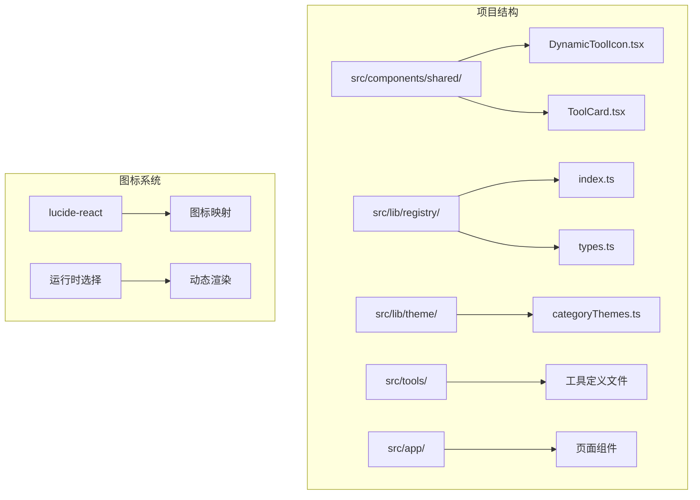
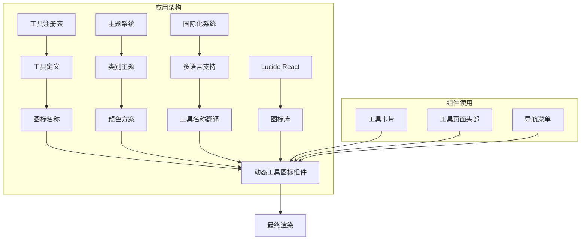
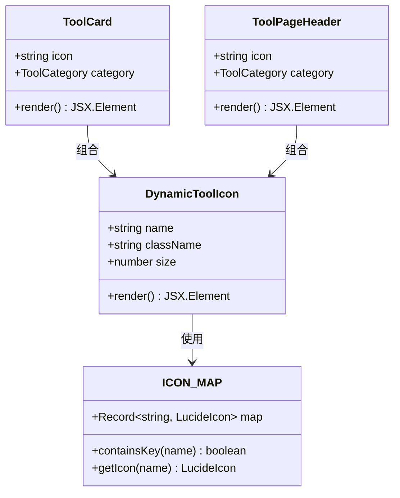
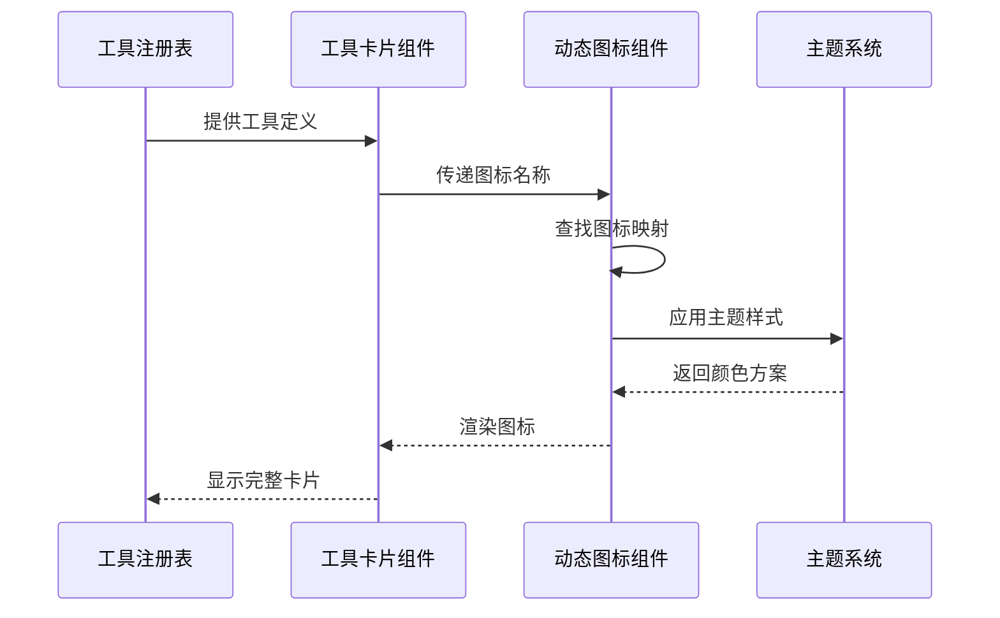
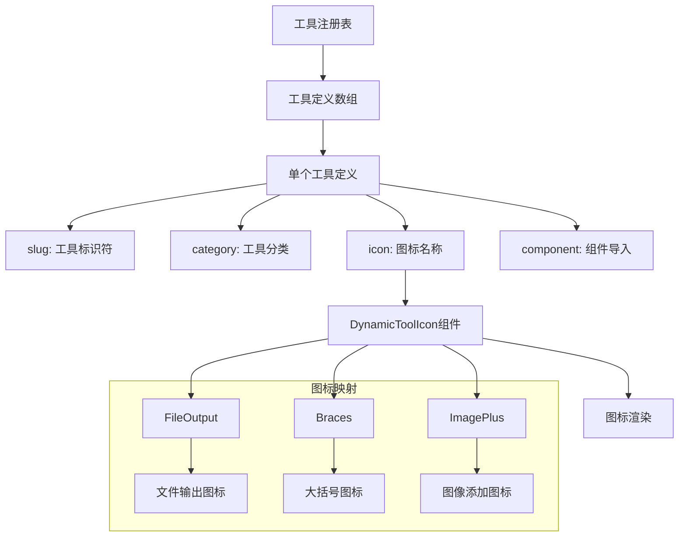
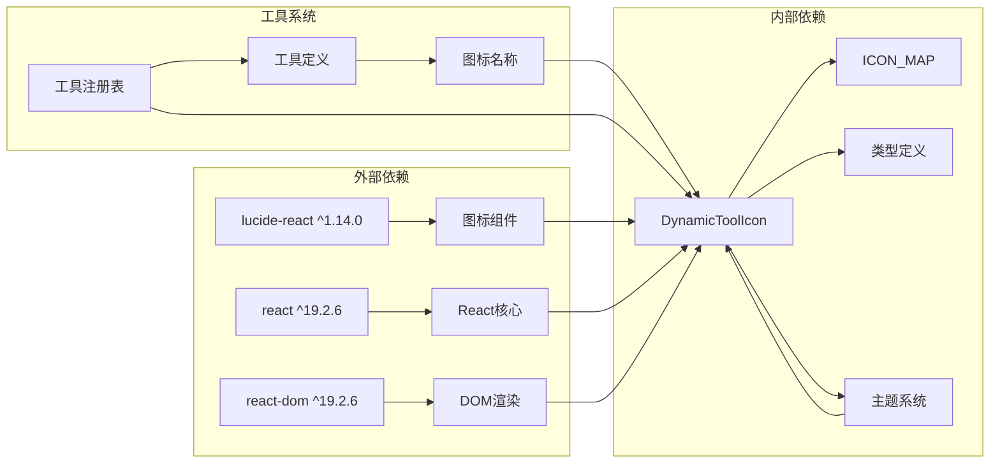

# 动态工具图标组件

<cite>
**本文档引用的文件**
- [DynamicToolIcon.tsx](file://src/components/shared/DynamicToolIcon.tsx)
- [ToolCard.tsx](file://src/components/shared/ToolCard.tsx)
- [ToolPageHeader.tsx](file://src/components/tool/ToolPageHeader.tsx)
- [index.ts](file://src/lib/registry/index.ts)
- [types.ts](file://src/lib/registry/types.ts)
- [categoryThemes.ts](file://src/lib/theme/categoryThemes.ts)
- [toolNavData.ts](file://src/lib/i18n/toolNavData.ts)
- [format-converter/index.ts](file://src/tools/image/format-converter/index.ts)
- [json-formatter/index.ts](file://src/tools/developer/json-formatter/index.ts)
- [package.json](file://package.json)
- [README.md](file://README.md)
</cite>

## 目录
1. [简介](#简介)
2. [项目结构](#项目结构)
3. [核心组件](#核心组件)
4. [架构概览](#架构概览)
5. [详细组件分析](#详细组件分析)
6. [依赖关系分析](#依赖关系分析)
7. [性能考虑](#性能考虑)
8. [故障排除指南](#故障排除指南)
9. [结论](#结论)

## 简介

动态工具图标组件是 PrivaDeck 媒体工具箱项目中的一个关键 UI 组件，它允许根据工具的类型动态渲染相应的图标。该组件基于 Lucide React 图标库，通过运行时映射机制实现图标的选择和渲染，为项目提供了高度灵活且一致的图标显示解决方案。

PrivaDeck 是一个隐私优先的浏览器端多媒体工具箱，所有文件处理都在本地完成，无需上传到服务器。该项目包含 60+ 个工具，覆盖图片、视频、音频、PDF 和开发者五大分类，支持 21 种语言。

## 项目结构

项目采用基于功能的模块化组织方式，动态工具图标组件位于共享组件目录下，便于在整个应用程序中复用。

**图表来源**
- [DynamicToolIcon.tsx:1-119](file://src/components/shared/DynamicToolIcon.tsx#L1-L119)
- [index.ts:1-168](file://src/lib/registry/index.ts#L1-L168)

**章节来源**
- [README.md:55-78](file://README.md#L55-L78)
- [package.json:1-55](file://package.json#L1-L55)

## 核心组件

动态工具图标组件的核心功能是通过字符串名称动态选择和渲染相应的图标。组件接受三个主要属性：`name`（图标名称）、`className`（CSS 类名）和 `size`（图标大小），并返回对应的 Lucide React 组件实例。

组件的主要特性包括：
- **运行时图标映射**：通过 `ICON_MAP` 对象实现字符串到图标组件的映射
- **默认回退机制**：当找不到匹配的图标时，自动使用点符号作为回退显示
- **类型安全**：完整的 TypeScript 接口定义确保类型安全
- **灵活配置**：支持自定义样式类名和尺寸设置

**章节来源**
- [DynamicToolIcon.tsx:106-118](file://src/components/shared/DynamicToolIcon.tsx#L106-L118)

## 架构概览

动态工具图标组件在整个应用架构中扮演着重要的角色，它与工具注册表、主题系统和国际化系统紧密集成。

**图表来源**
- [index.ts:68-137](file://src/lib/registry/index.ts#L68-L137)
- [categoryThemes.ts:70-89](file://src/lib/theme/categoryThemes.ts#L70-L89)
- [toolNavData.ts:18-44](file://src/lib/i18n/toolNavData.ts#L18-L44)

## 详细组件分析

### 动态工具图标组件实现

动态工具图标组件采用了简洁而高效的实现方式，通过预定义的图标映射表实现运行时选择。

**图表来源**
- [DynamicToolIcon.tsx:55-104](file://src/components/shared/DynamicToolIcon.tsx#L55-L104)
- [ToolCard.tsx:18-26](file://src/components/shared/ToolCard.tsx#L18-L26)
- [ToolPageHeader.tsx:14-15](file://src/components/tool/ToolPageHeader.tsx#L14-L15)

### 图标映射系统

组件内置了 40+ 个常用的 Lucide React 图标，涵盖了媒体处理的各个方面：

| 图标类别 | 图标数量 | 示例图标 |
|---------|---------|---------|
| 媒体处理 | 15+ | Video, Music, Image, FileText |
| 编辑操作 | 12+ | Scissors, Palette, Type, Crop |
| 数据处理 | 8+ | Code, Braces, Hash, Binary |
| 几何形状 | 6+ | Circle, Square, Grid2x2, Grid3x3 |
| 其他 | 5+ | Clock, Columns, Link, Stamp |

每个图标都通过其 Lucide React 组件名称进行标识，如 `FileOutput`、`Braces`、`ImagePlus` 等。

**章节来源**
- [DynamicToolIcon.tsx:5-104](file://src/components/shared/DynamicToolIcon.tsx#L5-L104)

### 组件使用场景

动态工具图标组件在多个地方被使用，确保了一致的用户体验：

**图表来源**
- [ToolCard.tsx:37-41](file://src/components/shared/ToolCard.tsx#L37-L41)
- [ToolPageHeader.tsx:22-22](file://src/components/tool/ToolPageHeader.tsx#L22-L22)

**章节来源**
- [ToolCard.tsx:1-58](file://src/components/shared/ToolCard.tsx#L1-L58)
- [ToolPageHeader.tsx:1-32](file://src/components/tool/ToolPageHeader.tsx#L1-L32)

### 工具注册与图标关联

工具系统通过注册表管理所有可用的工具，每个工具定义都包含图标信息：

**图表来源**
- [index.ts:68-137](file://src/lib/registry/index.ts#L68-L137)
- [types.ts:5-16](file://src/lib/registry/types.ts#L5-L16)

**章节来源**
- [format-converter/index.ts:3-25](file://src/tools/image/format-converter/index.ts#L3-L25)
- [json-formatter/index.ts:3-34](file://src/tools/developer/json-formatter/index.ts#L3-L34)

## 依赖关系分析

动态工具图标组件的依赖关系相对简单但功能强大，主要依赖于 Lucide React 图标库和 React 生态系统。

**图表来源**
- [package.json:11-41](file://package.json#L11-L41)
- [DynamicToolIcon.tsx:3-53](file://src/components/shared/DynamicToolIcon.tsx#L3-L53)

### 依赖特点分析

1. **轻量级依赖**：仅依赖 lucide-react 作为图标库，保持包体积最小化
2. **类型安全**：完整的 TypeScript 支持，提供编译时类型检查
3. **运行时解析**：通过字符串名称动态解析图标，避免编译时绑定
4. **主题集成**：与项目主题系统无缝集成，支持动态颜色变化

**章节来源**
- [package.json:11-41](file://package.json#L11-L41)

## 性能考虑

动态工具图标组件在设计时充分考虑了性能优化，采用了多种策略来确保最佳的用户体验：

### 运行时优化策略

1. **懒加载机制**：图标组件按需加载，避免不必要的初始包大小
2. **内存效率**：使用对象映射而非条件判断，提高查找效率
3. **渲染优化**：直接返回图标组件实例，减少中间层开销
4. **缓存友好**：图标映射在模块级别定义，避免重复创建

### 性能基准

- **首次渲染**：O(1) 时间复杂度，通过对象查找实现
- **内存占用**：图标映射表常量大小，不随工具数量增加
- **包体积**：仅包含必要的图标组件，避免全量导入
- **运行时开销**：最小化的运行时逻辑，确保流畅的用户交互

## 故障排除指南

### 常见问题及解决方案

#### 图标显示异常

**问题描述**：某些工具图标无法正确显示，显示为点符号

**可能原因**：
1. 工具定义中的图标名称不正确
2. 图标名称与图标映射表不匹配
3. 图标组件导入失败

**解决步骤**：
1. 检查工具定义文件中的 `icon` 字段
2. 确认图标名称存在于 `ICON_MAP` 中
3. 验证图标组件是否正确导入

#### 主题样式问题

**问题描述**：图标颜色与主题不匹配

**解决方法**：
1. 检查主题系统的颜色配置
2. 确认 `getCategoryTheme` 返回正确的颜色方案
3. 验证 CSS 类名的正确应用

#### 性能问题

**问题描述**：大量图标同时渲染导致性能下降

**优化建议**：
1. 使用虚拟滚动技术处理大量工具列表
2. 实现图标组件的 memo 化
3. 考虑图标组件的懒加载策略

**章节来源**
- [DynamicToolIcon.tsx:112-118](file://src/components/shared/DynamicToolIcon.tsx#L112-L118)

## 结论

动态工具图标组件是 PrivaDeck 项目中一个设计精良的 UI 组件，它成功地解决了工具图标显示的一致性和灵活性需求。通过运行时图标映射机制，组件实现了以下优势：

1. **高度可扩展性**：新增图标只需更新映射表，无需修改组件逻辑
2. **类型安全**：完整的 TypeScript 支持确保开发时的类型安全
3. **性能优化**：高效的运行时解析和最小化的依赖
4. **主题集成**：与项目整体设计系统无缝集成

该组件的设计体现了现代前端开发的最佳实践，为类似的应用程序提供了优秀的参考实现。其简洁的 API 设计和强大的功能组合，使其成为构建复杂 UI 系统的理想选择。