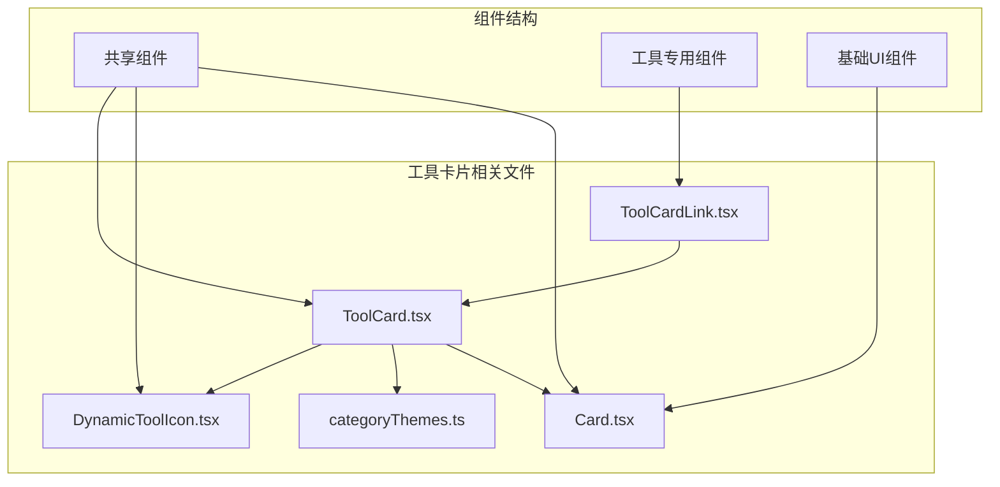
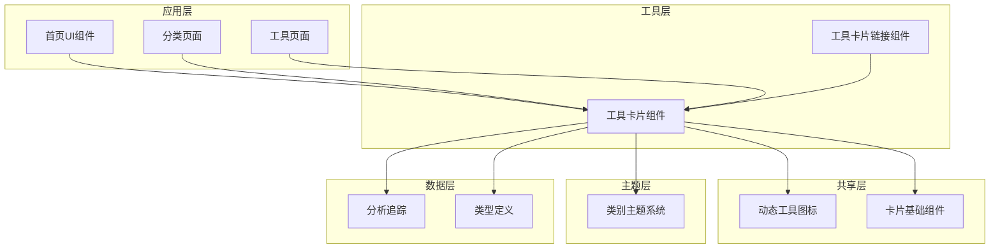
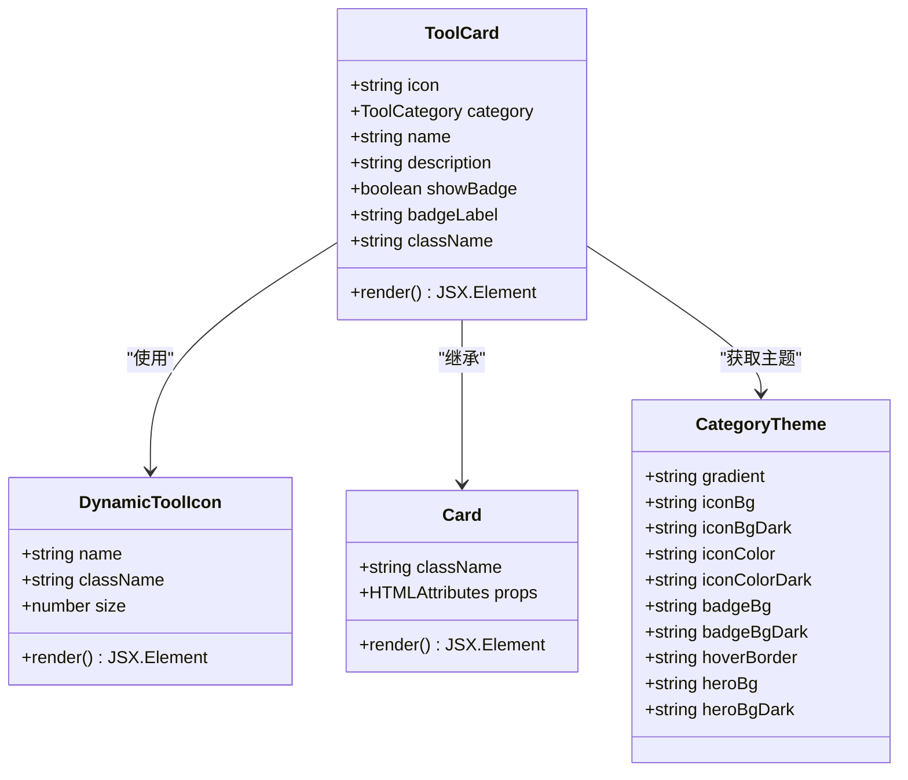
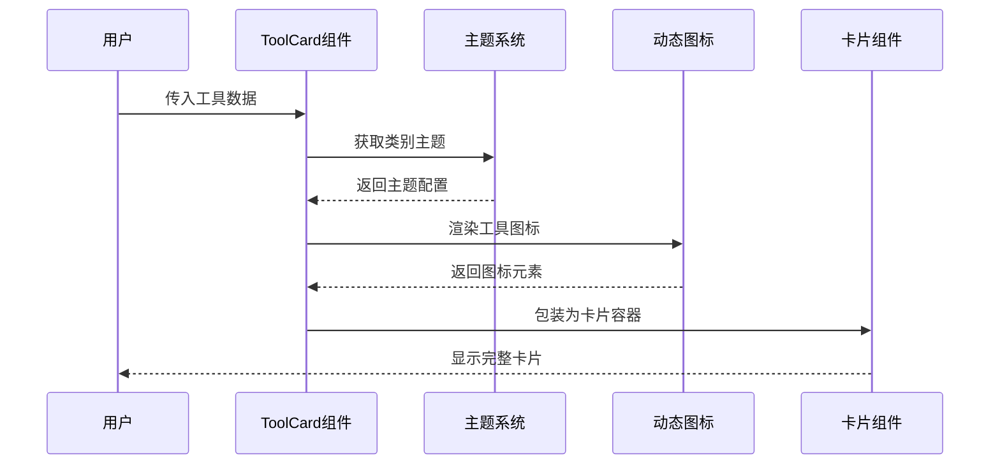
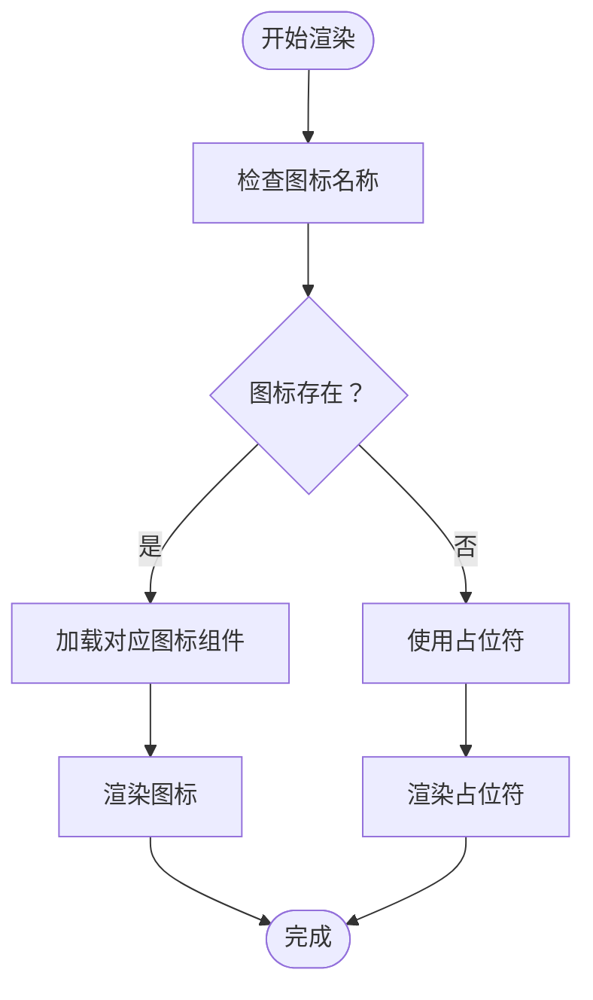
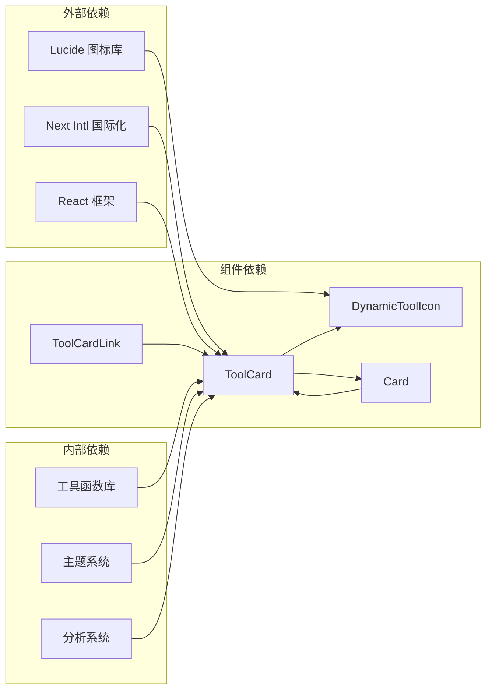

# 工具卡片组件

<cite>
**本文档引用的文件**
- [ToolCard.tsx](file://src/components/shared/ToolCard.tsx)
- [DynamicToolIcon.tsx](file://src/components/shared/DynamicToolIcon.tsx)
- [ToolCardLink.tsx](file://src/components/tool/ToolCardLink.tsx)
- [categoryThemes.ts](file://src/lib/theme/categoryThemes.ts)
- [Card.tsx](file://src/components/ui/Card.tsx)
- [types.ts](file://src/lib/registry/types.ts)
- [HomeUI.tsx](file://src/components/home/HomeUI.tsx)
- [page.tsx](file://src/app/[locale]/tools/[category]/page.tsx)
- [analytics.ts](file://src/lib/analytics.ts)
</cite>

## 目录
1. [简介](#简介)
2. [项目结构](#项目结构)
3. [核心组件](#核心组件)
4. [架构概览](#架构概览)
5. [详细组件分析](#详细组件分析)
6. [依赖关系分析](#依赖关系分析)
7. [性能考虑](#性能考虑)
8. [故障排除指南](#故障排除指南)
9. [结论](#结论)

## 简介

工具卡片组件是 PrivaDeck 媒体工具箱项目中的核心 UI 组件，用于展示各种媒体处理工具的缩略卡片。该组件提供了统一的视觉设计、交互效果和数据分析功能，支持多种工具类别（图像、视频、音频、PDF、开发者工具）的统一展示。

## 项目结构

工具卡片组件位于项目的共享组件目录中，采用模块化设计，便于在不同页面和场景中复用。



**图表来源**
- [ToolCard.tsx:1-58](file://src/components/shared/ToolCard.tsx#L1-L58)
- [DynamicToolIcon.tsx:1-119](file://src/components/shared/DynamicToolIcon.tsx#L1-L119)
- [ToolCardLink.tsx:1-34](file://src/components/tool/ToolCardLink.tsx#L1-L34)

**章节来源**
- [ToolCard.tsx:1-58](file://src/components/shared/ToolCard.tsx#L1-L58)
- [DynamicToolIcon.tsx:1-119](file://src/components/shared/DynamicToolIcon.tsx#L1-L119)
- [ToolCardLink.tsx:1-34](file://src/components/tool/ToolCardLink.tsx#L1-L34)

## 核心组件

工具卡片组件系统由多个相互协作的组件组成，每个组件都有特定的职责和功能。

### 主要组件特性

- **响应式设计**：适配不同屏幕尺寸的显示需求
- **主题系统**：基于工具类别的颜色主题自动切换
- **交互动画**：提供流畅的悬停和过渡效果
- **图标系统**：动态加载 Lucide 图标库中的图标
- **数据分析**：集成用户行为跟踪功能

**章节来源**
- [ToolCard.tsx:8-16](file://src/components/shared/ToolCard.tsx#L8-L16)
- [categoryThemes.ts:3-15](file://src/lib/theme/categoryThemes.ts#L3-L15)

## 架构概览

工具卡片组件采用分层架构设计，从底层的基础 UI 组件到上层的应用逻辑组件，形成了清晰的层次结构。



**图表来源**
- [HomeUI.tsx:58-141](file://src/components/home/HomeUI.tsx#L58-L141)
- [page.tsx:103-119](file://src/app/[locale]/tools/[category]/page.tsx#L103-L119)
- [ToolCard.tsx:18-56](file://src/components/shared/ToolCard.tsx#L18-L56)

## 详细组件分析

### ToolCard 组件

ToolCard 是工具卡片的核心组件，负责渲染单个工具的卡片视图。

#### 组件结构



**图表来源**
- [ToolCard.tsx:8-26](file://src/components/shared/ToolCard.tsx#L8-L26)
- [DynamicToolIcon.tsx:106-118](file://src/components/shared/DynamicToolIcon.tsx#L106-L118)
- [Card.tsx:4-16](file://src/components/ui/Card.tsx#L4-L16)

#### 关键属性说明

| 属性名 | 类型 | 必需 | 默认值 | 描述 |
|--------|------|------|--------|------|
| icon | string | 是 | - | 工具图标名称，对应 Lucide 图标库 |
| category | ToolCategory | 是 | - | 工具类别，决定主题颜色 |
| name | string | 是 | - | 工具显示名称 |
| description | string | 是 | - | 工具功能描述 |
| showBadge | boolean | 否 | false | 是否显示类别徽章 |
| badgeLabel | string | 否 | - | 徽章显示文本 |
| className | string | 否 | "" | 自定义 CSS 类名 |

#### 渲染流程



**图表来源**
- [ToolCard.tsx:18-56](file://src/components/shared/ToolCard.tsx#L18-L56)
- [categoryThemes.ts:87-89](file://src/lib/theme/categoryThemes.ts#L87-L89)

**章节来源**
- [ToolCard.tsx:18-56](file://src/components/shared/ToolCard.tsx#L18-L56)
- [categoryThemes.ts:19-85](file://src/lib/theme/categoryThemes.ts#L19-L85)

### DynamicToolIcon 组件

DynamicToolIcon 提供了动态图标渲染功能，支持从 Lucide 图标库中按名称动态加载图标。

#### 图标映射系统

组件维护了一个包含 49 个常用图标的映射表，涵盖了媒体处理工具的各种功能图标。



**图表来源**
- [DynamicToolIcon.tsx:112-118](file://src/components/shared/DynamicToolIcon.tsx#L112-L118)

#### 支持的图标类别

组件支持以下类型的图标：
- 媒体处理：视频、音频、图像、PDF 文件操作
- 编辑功能：裁剪、旋转、调整、格式转换
- 开发工具：代码编辑、正则表达式、JSON 处理
- 文本处理：文本编辑、格式化、搜索

**章节来源**
- [DynamicToolIcon.tsx:55-104](file://src/components/shared/DynamicToolIcon.tsx#L55-L104)

### ToolCardLink 组件

ToolCardLink 为工具卡片提供可点击的导航功能，集成了用户行为分析追踪。

#### 导航功能

```mermaid
sequenceDiagram
participant User as 用户
participant Link as ToolCardLink
participant Analytics as 分析系统
participant Router as 路由器
User->>Link : 点击工具卡片
Link->>Analytics : 记录点击事件
Analytics-->>Link : 确认记录成功
Link->>Router : 导航到工具页面
Router-->>User : 显示目标页面
```

**图表来源**
- [ToolCardLink.tsx:16-33](file://src/components/tool/ToolCardLink.tsx#L16-L33)

#### 分析参数

| 参数名 | 类型 | 描述 |
|--------|------|------|
| from | "home" \| "category" \| "header_menu" | 来源页面位置 |
| slug | string | 目标工具标识符 |
| category | string | 工具类别 |
| position | number | 在列表中的位置索引 |

**章节来源**
- [ToolCardLink.tsx:7-14](file://src/components/tool/ToolCardLink.tsx#L7-L14)
- [analytics.ts:170-182](file://src/lib/analytics.ts#L170-L182)

### 主题系统

工具卡片组件使用统一的主题系统，为不同类别的工具提供一致的视觉体验。

#### 主题配置

每个工具类别都有专门的颜色配置：

| 类别 | 主色调 | 背景色 | 图标色 |
|------|--------|--------|--------|
| image | 青色到薄荷色渐变 | cyan-500/10 | text-cyan-600 |
| video | 薄荷色到翡翠色渐变 | teal-500/10 | text-teal-600 |
| audio | 翡翠色到绿色渐变 | emerald-500/10 | text-emerald-600 |
| pdf | 天蓝色到青色渐变 | sky-500/10 | text-sky-600 |
| developer | 靛蓝色到青色渐变 | indigo-500/10 | text-indigo-600 |

**章节来源**
- [categoryThemes.ts:19-85](file://src/lib/theme/categoryThemes.ts#L19-L85)

## 依赖关系分析

工具卡片组件系统具有清晰的依赖关系，形成了稳定的模块化架构。



**图表来源**
- [ToolCard.tsx:3-6](file://src/components/shared/ToolCard.tsx#L3-L6)
- [DynamicToolIcon.tsx:3](file://src/components/shared/DynamicToolIcon.tsx#L3)
- [ToolCardLink.tsx:3-4](file://src/components/tool/ToolCardLink.tsx#L3-L4)

### 组件耦合度分析

- **低耦合高内聚**：各组件职责明确，相互依赖关系简单
- **单一职责原则**：每个组件只负责特定的功能领域
- **可测试性**：组件接口清晰，便于单元测试和集成测试

**章节来源**
- [ToolCard.tsx:1-7](file://src/components/shared/ToolCard.tsx#L1-L7)
- [Card.tsx:1-2](file://src/components/ui/Card.tsx#L1-L2)

## 性能考虑

工具卡片组件在设计时充分考虑了性能优化，采用了多种策略来提升用户体验。

### 渲染优化

1. **懒加载机制**：工具页面使用动态导入和缓存机制
2. **虚拟滚动**：大量工具列表时可考虑实现虚拟滚动
3. **CSS 过渡优化**：使用硬件加速的 CSS 属性

### 内存管理

- **组件卸载清理**：确保组件卸载时清理定时器和事件监听器
- **状态管理**：避免不必要的状态更新和重渲染

### 加载性能

- **图标预加载**：热门工具图标可以预加载以提升首次渲染速度
- **资源压缩**：所有静态资源都经过压缩优化

## 故障排除指南

### 常见问题及解决方案

#### 图标不显示问题

**症状**：工具卡片中的图标显示为占位符

**可能原因**：
1. 图标名称不在映射表中
2. 图标组件加载失败
3. CSS 类名冲突

**解决方法**：
1. 检查工具定义中的图标名称是否正确
2. 验证图标名称是否存在于 DynamicToolIcon 的映射表中
3. 查看浏览器控制台是否有相关错误信息

#### 主题颜色异常

**症状**：工具卡片颜色不符合预期

**可能原因**：
1. 工具类别配置错误
2. 主题系统加载失败
3. CSS 变量未正确设置

**解决方法**：
1. 验证工具定义中的 category 字段
2. 检查 getCategoryTheme 函数的返回值
3. 确认 CSS 变量已正确加载

#### 点击事件无响应

**症状**：点击工具卡片无法跳转

**可能原因**：
1. ToolCardLink 组件未正确包装
2. 路由配置问题
3. JavaScript 错误阻止了事件传播

**解决方法**：
1. 确保 ToolCard 始终包裹在 ToolCardLink 中
2. 检查路由配置是否正确
3. 查看浏览器控制台的 JavaScript 错误

**章节来源**
- [DynamicToolIcon.tsx:112-118](file://src/components/shared/DynamicToolIcon.tsx#L112-L118)
- [ToolCardLink.tsx:16-33](file://src/components/tool/ToolCardLink.tsx#L16-L33)

## 结论

工具卡片组件是 PrivaDeck 项目中设计精良的 UI 组件系统，具有以下特点：

### 设计优势

1. **模块化设计**：清晰的组件层次结构，便于维护和扩展
2. **主题一致性**：统一的视觉设计语言，提升用户体验
3. **交互友好**：流畅的动画效果和直观的操作反馈
4. **可访问性**：良好的语义化标记和键盘导航支持

### 技术亮点

1. **类型安全**：完整的 TypeScript 类型定义
2. **国际化支持**：内置多语言支持机制
3. **数据分析集成**：完整的用户行为追踪
4. **性能优化**：合理的渲染策略和资源管理

### 扩展建议

1. **响应式设计增强**：针对移动设备优化触摸交互
2. **无障碍功能完善**：添加更多的无障碍支持
3. **性能监控**：集成性能指标监控
4. **测试覆盖**：增加单元测试和集成测试

该组件系统为 PrivaDeck 项目提供了坚实的基础，能够有效支撑各种媒体处理工具的展示和交互需求。