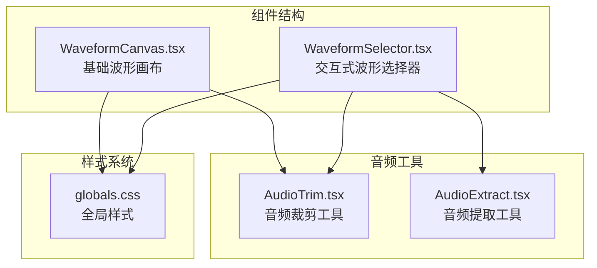
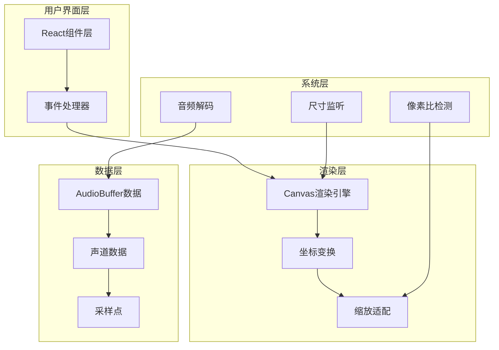
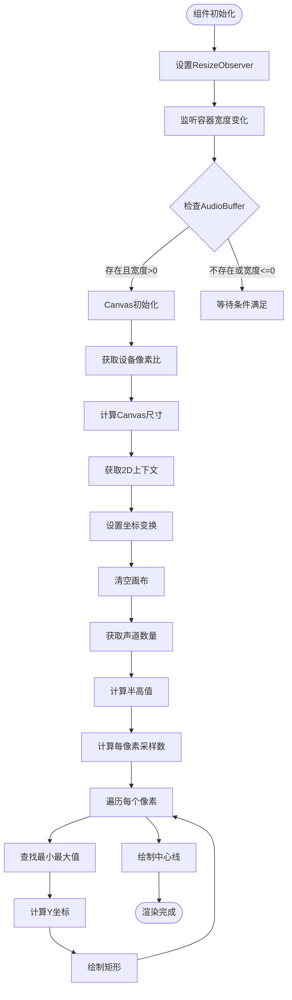
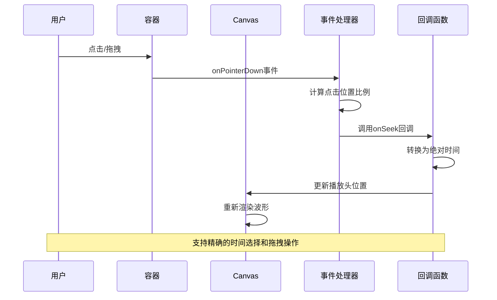
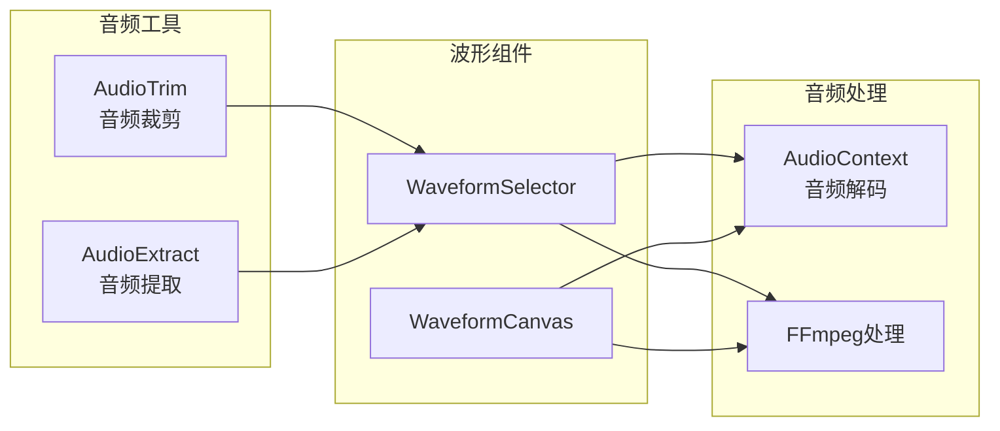
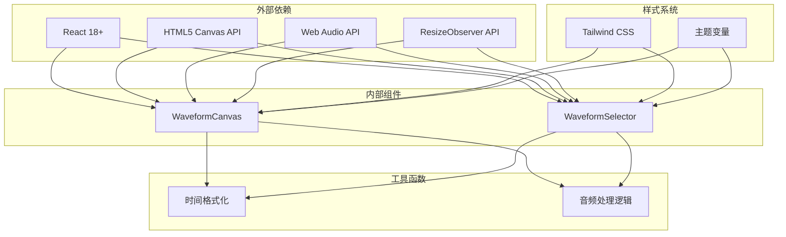

# 波形画布组件

<cite>
**本文档引用的文件**
- [WaveformCanvas.tsx](file://src/components/shared/WaveformCanvas.tsx)
- [WaveformSelector.tsx](file://src/components/shared/WaveformSelector.tsx)
- [AudioTrim.tsx](file://src/tools/audio/trim/AudioTrim.tsx)
- [AudioExtract.tsx](file://src/tools/audio/extract/AudioExtract.tsx)
- [logic.ts](file://src/tools/audio/trim/logic.ts)
- [globals.css](file://src/app/globals.css)
</cite>

## 目录
1. [简介](#简介)
2. [项目结构](#项目结构)
3. [核心组件](#核心组件)
4. [架构概览](#架构概览)
5. [详细组件分析](#详细组件分析)
6. [依赖关系分析](#依赖关系分析)
7. [性能考虑](#性能考虑)
8. [故障排除指南](#故障排除指南)
9. [结论](#结论)

## 简介

波形画布组件是媒体工具箱中的核心音频可视化组件，提供了高质量的音频波形渲染和交互功能。该组件包含两个主要部分：WaveformCanvas（基础波形画布）和WaveformSelector（带交互功能的波形选择器）。这些组件为音频编辑工具提供了直观的音频内容预览和精确的时间范围选择能力。

组件基于HTML5 Canvas API实现，支持高分辨率屏幕适配、多声道音频处理和实时缩放功能。通过Web Audio API解码音频数据，实现了高效的波形渲染和流畅的用户交互体验。

## 项目结构

波形画布组件位于项目的共享组件目录中，与音频处理工具紧密集成：

**图表来源**
- [WaveformCanvas.tsx:1-97](file://src/components/shared/WaveformCanvas.tsx#L1-L97)
- [WaveformSelector.tsx:1-146](file://src/components/shared/WaveformSelector.tsx#L1-L146)

**章节来源**
- [WaveformCanvas.tsx:1-97](file://src/components/shared/WaveformCanvas.tsx#L1-L97)
- [WaveformSelector.tsx:1-146](file://src/components/shared/WaveformSelector.tsx#L1-L146)

## 核心组件

### WaveformCanvas 组件

WaveformCanvas 是基础的波形显示组件，提供静态的音频波形渲染功能：

**主要特性：**
- 基于Canvas的高性能波形渲染
- 自适应设备像素比的高清显示
- 支持音频增益调节
- 响应式容器尺寸监听
- 多声道音频数据处理

**关键参数：**
- `audioBuffer`: 音频缓冲区对象（必需）
- `gain`: 音频增益控制（默认1，范围0-4）
- `height`: 波形高度（默认80像素）
- `className`: CSS类名

### WaveformSelector 组件

WaveformSelector 是增强版的波形组件，集成了完整的音频时间轴交互功能：

**主要特性：**
- 完整的音频波形渲染
- 时间范围选择区域高亮
- 播放头位置指示
- 点击拖拽进行时间选择
- 响应式设计和高DPR适配
- 进度条和播放状态显示

**关键参数：**
- `audioBuffer`: 音频缓冲区对象（必需）
- `start`: 开始时间（秒）
- `end`: 结束时间（秒）
- `currentTime`: 当前播放时间（秒）
- `duration`: 音频总时长（秒）
- `onSeek`: 回调函数用于时间跳转
- `height`: 波形高度（默认96像素）

**章节来源**
- [WaveformCanvas.tsx:5-17](file://src/components/shared/WaveformCanvas.tsx#L5-L17)
- [WaveformSelector.tsx:5-23](file://src/components/shared/WaveformSelector.tsx#L5-L23)

## 架构概览

波形画布组件采用分层架构设计，确保了良好的可维护性和扩展性：

**图表来源**
- [WaveformCanvas.tsx:22-79](file://src/components/shared/WaveformCanvas.tsx#L22-L79)
- [WaveformSelector.tsx:28-95](file://src/components/shared/WaveformSelector.tsx#L28-L95)

## 详细组件分析

### WaveformCanvas 实现分析

WaveformCanvas 组件的核心实现基于以下算法：

**图表来源**
- [WaveformCanvas.tsx:32-79](file://src/components/shared/WaveformCanvas.tsx#L32-L79)

#### 关键算法实现

组件使用了"采样聚合"算法来优化大量音频数据的渲染：

1. **采样聚合策略**：将多个音频样本聚合到单个像素，减少绘制调用次数
2. **多声道合并**：对所有声道数据进行合并处理，统一显示
3. **动态缩放**：根据容器宽度动态调整采样密度

**章节来源**
- [WaveformCanvas.tsx:32-79](file://src/components/shared/WaveformCanvas.tsx#L32-L79)

### WaveformSelector 交互实现

WaveformSelector 组件在基础渲染功能上增加了丰富的交互能力：

**图表来源**
- [WaveformSelector.tsx:104-112](file://src/components/shared/WaveformSelector.tsx#L104-L112)

#### 交互功能特性

1. **精确时间选择**：支持点击任意位置进行时间定位
2. **范围选择**：通过拖拽选择音频片段范围
3. **播放状态指示**：实时显示当前播放位置
4. **响应式布局**：自动适配不同屏幕尺寸

**章节来源**
- [WaveformSelector.tsx:104-144](file://src/components/shared/WaveformSelector.tsx#L104-L144)

### 在音频工具中的应用

波形画布组件在音频工具中发挥着重要作用：

**图表来源**
- [AudioTrim.tsx:343-351](file://src/tools/audio/trim/AudioTrim.tsx#L343-L351)
- [AudioExtract.tsx:1-200](file://src/tools/audio/extract/AudioExtract.tsx#L1-L200)

**章节来源**
- [AudioTrim.tsx:343-351](file://src/tools/audio/trim/AudioTrim.tsx#L343-L351)
- [AudioExtract.tsx:1-200](file://src/tools/audio/extract/AudioExtract.tsx#L1-L200)

## 依赖关系分析

波形画布组件的依赖关系体现了清晰的模块化设计：

**图表来源**
- [WaveformCanvas.tsx:1-3](file://src/components/shared/WaveformCanvas.tsx#L1-L3)
- [WaveformSelector.tsx:1-3](file://src/components/shared/WaveformSelector.tsx#L1-L3)

### 性能优化策略

组件采用了多种性能优化技术：

1. **Canvas尺寸限制**：防止超高分辨率设备上的内存溢出
2. **采样聚合算法**：减少绘制调用次数
3. **设备像素比适配**：确保高清显示质量
4. **条件渲染**：仅在必要时重新绘制

**章节来源**
- [WaveformSelector.tsx:42-52](file://src/components/shared/WaveformSelector.tsx#L42-L52)
- [WaveformCanvas.tsx:36-41](file://src/components/shared/WaveformCanvas.tsx#L36-L41)

## 性能考虑

### 内存管理

波形画布组件在内存管理方面采取了多项措施：

- **Canvas尺寸上限**：限制最大画布尺寸（4096×1024像素）
- **音频解码缓存**：避免重复解码相同文件
- **清理机制**：组件卸载时自动清理资源

### 渲染性能

为了确保流畅的用户体验，组件实现了以下优化：

- **双缓冲渲染**：避免闪烁现象
- **增量更新**：只重绘变化的部分
- **坐标变换优化**：使用setTransform提升渲染效率

### 兼容性处理

组件兼容多种浏览器环境：

- **渐进增强**：基础功能在旧浏览器中正常工作
- **降级处理**：在不支持的API下提供替代方案
- **错误边界**：优雅处理渲染异常

## 故障排除指南

### 常见问题及解决方案

**问题1：波形显示不完整或被截断**
- 检查Canvas尺寸是否超过限制
- 确认设备像素比设置正确
- 验证AudioBuffer数据完整性

**问题2：交互功能失效**
- 确认onSeek回调函数已正确传入
- 检查容器元素的指针事件配置
- 验证时间参数的有效性

**问题3：内存使用过高**
- 检查是否有过多组件同时渲染
- 确认音频文件大小适中
- 验证Canvas资源是否正确释放

**章节来源**
- [WaveformSelector.tsx:42-52](file://src/components/shared/WaveformSelector.tsx#L42-L52)
- [WaveformCanvas.tsx:32-41](file://src/components/shared/WaveformCanvas.tsx#L32-L41)

## 结论

波形画布组件是媒体工具箱中设计精良的音频可视化解决方案。通过精心设计的架构和多项性能优化，该组件为用户提供了一致且高效的音频编辑体验。

组件的主要优势包括：
- **高性能渲染**：基于Canvas的高效波形绘制
- **丰富交互**：完整的音频时间轴操作功能
- **良好兼容性**：支持多种浏览器和设备
- **可扩展性**：清晰的接口设计便于功能扩展

未来可以考虑的功能增强包括：
- 更多的视觉效果选项
- 支持更多音频格式
- 增强的交互手势支持
- 实时音频分析功能