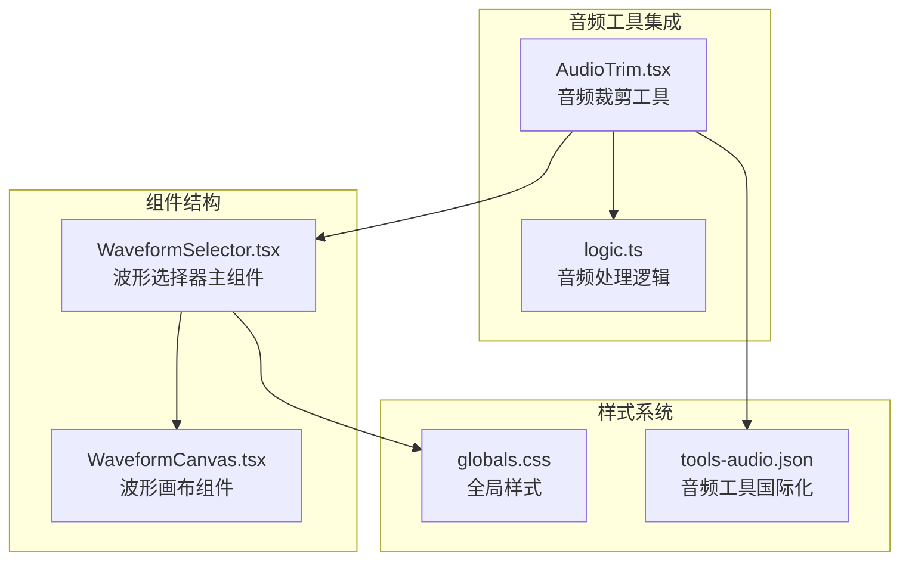
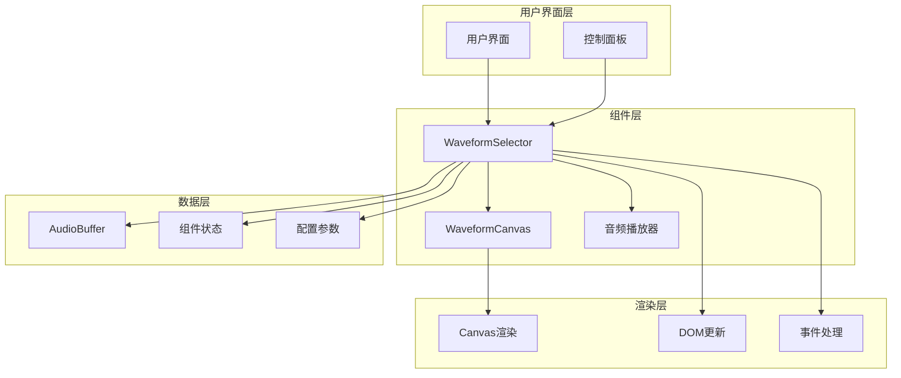
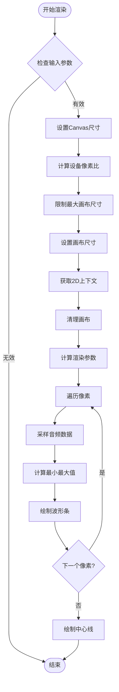
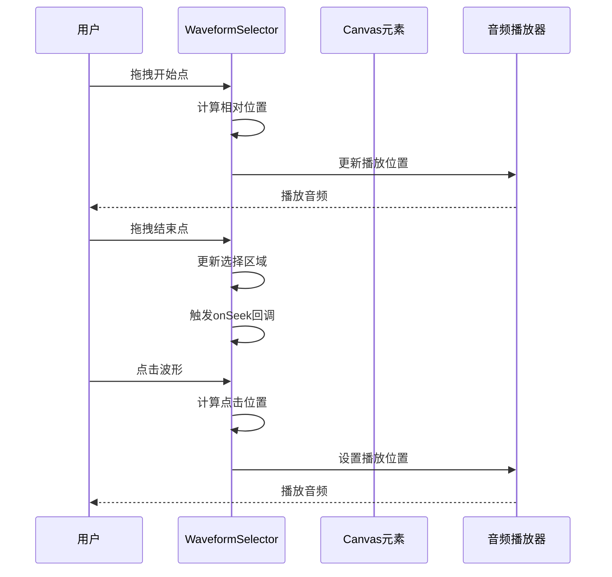
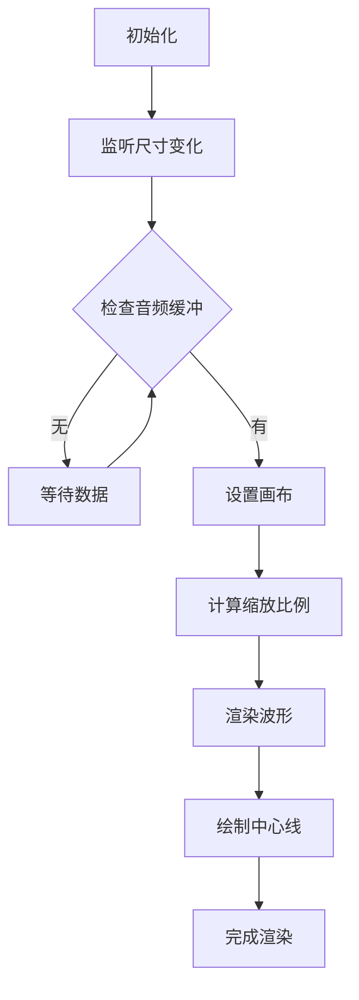
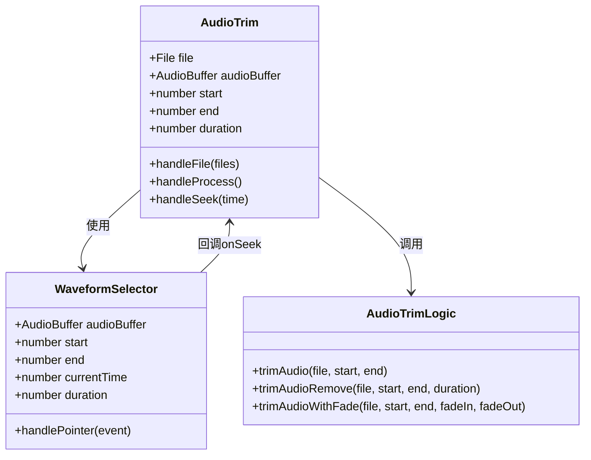
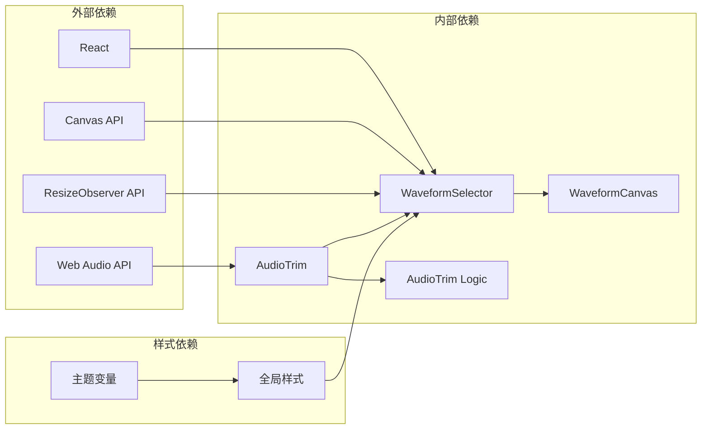

# 波形选择器组件

<cite>
**本文档中引用的文件**
- [WaveformSelector.tsx](file://src/components/shared/WaveformSelector.tsx)
- [WaveformCanvas.tsx](file://src/components/shared/WaveformCanvas.tsx)
- [AudioTrim.tsx](file://src/tools/audio/trim/AudioTrim.tsx)
- [logic.ts](file://src/tools/audio/trim/logic.ts)
- [globals.css](file://src/app/globals.css)
- [tools-audio.json](file://messages/zh-Hans/tools-audio.json)
</cite>

## 目录
1. [简介](#简介)
2. [项目结构](#项目结构)
3. [核心组件](#核心组件)
4. [架构概览](#架构概览)
5. [详细组件分析](#详细组件分析)
6. [依赖关系分析](#依赖关系分析)
7. [性能考虑](#性能考虑)
8. [故障排除指南](#故障排除指南)
9. [结论](#结论)

## 简介

波形选择器组件是媒体工具箱中音频处理功能的核心交互组件。它提供了直观的波形可视化界面，允许用户通过拖拽和点击来精确选择音频文件的起始和结束位置，支持实时播放头显示和多种音频编辑模式。

该组件基于HTML5 Canvas API构建，能够高效地渲染复杂的音频波形数据，并提供流畅的用户交互体验。组件设计遵循响应式原则，能够在不同设备和屏幕尺寸上正常工作。

## 项目结构

波形选择器组件位于共享组件目录中，与音频裁剪工具紧密集成：

**图表来源**
- [WaveformSelector.tsx:1-146](file://src/components/shared/WaveformSelector.tsx#L1-L146)
- [WaveformCanvas.tsx:1-97](file://src/components/shared/WaveformCanvas.tsx#L1-L97)
- [AudioTrim.tsx:1-580](file://src/tools/audio/trim/AudioTrim.tsx#L1-L580)

**章节来源**
- [WaveformSelector.tsx:1-146](file://src/components/shared/WaveformSelector.tsx#L1-L146)
- [WaveformCanvas.tsx:1-97](file://src/components/shared/WaveformCanvas.tsx#L1-L97)
- [AudioTrim.tsx:1-580](file://src/tools/audio/trim/AudioTrim.tsx#L1-L580)

## 核心组件

### WaveformSelector 主组件

WaveformSelector 是波形选择器的核心组件，负责渲染音频波形并提供交互功能：

**主要特性：**
- 实时波形渲染（基于 Canvas API）
- 双手柄选择区域（开始/结束点）
- 播放头实时指示
- 响应式设计和高DPI支持
- 拖拽交互和精确时间输入

**关键属性：**
- `audioBuffer`: 音频缓冲区数据
- `start/end`: 选择区域的起始和结束时间
- `currentTime`: 当前播放位置
- `duration`: 音频总时长
- `onSeek`: 拖拽时的回调函数

### WaveformCanvas 辅助组件

WaveformCanvas 提供基础的波形渲染功能，支持音量增益调整：

**主要特性：**
- 简化的波形渲染
- 可调节的音量增益
- 响应式画布尺寸
- CSS变量颜色支持

**章节来源**
- [WaveformSelector.tsx:5-23](file://src/components/shared/WaveformSelector.tsx#L5-L23)
- [WaveformCanvas.tsx:5-17](file://src/components/shared/WaveformCanvas.tsx#L5-L17)

## 架构概览

波形选择器组件采用分层架构设计，实现了清晰的关注点分离：

**图表来源**
- [WaveformSelector.tsx:15-145](file://src/components/shared/WaveformSelector.tsx#L15-L145)
- [WaveformCanvas.tsx:12-96](file://src/components/shared/WaveformCanvas.tsx#L12-L96)

**章节来源**
- [WaveformSelector.tsx:15-145](file://src/components/shared/WaveformSelector.tsx#L15-L145)
- [WaveformCanvas.tsx:12-96](file://src/components/shared/WaveformCanvas.tsx#L12-L96)

## 详细组件分析

### WaveformSelector 组件详解

#### 核心渲染逻辑

组件使用高效的像素采样算法来渲染波形：

**图表来源**
- [WaveformSelector.tsx:38-95](file://src/components/shared/WaveformSelector.tsx#L38-L95)

#### 交互处理机制

组件支持多种用户交互方式：

**图表来源**
- [WaveformSelector.tsx:104-112](file://src/components/shared/WaveformSelector.tsx#L104-L112)

#### 性能优化策略

组件采用了多项性能优化措施：

1. **设备像素比适配**：根据设备DPR动态调整画布分辨率
2. **最大尺寸限制**：防止超大画布导致内存溢出
3. **高效采样算法**：使用像素聚合避免逐样本渲染
4. **响应式观察**：使用ResizeObserver监听容器尺寸变化

**章节来源**
- [WaveformSelector.tsx:28-36](file://src/components/shared/WaveformSelector.tsx#L28-L36)
- [WaveformSelector.tsx:42-52](file://src/components/shared/WaveformSelector.tsx#L42-L52)
- [WaveformSelector.tsx:64-87](file://src/components/shared/WaveformSelector.tsx#L64-L87)

### WaveformCanvas 组件分析

#### 简化渲染流程

WaveformCanvas专注于基础波形渲染，提供了更简洁的实现：

**图表来源**
- [WaveformCanvas.tsx:22-79](file://src/components/shared/WaveformCanvas.tsx#L22-L79)

#### 音量增益控制

WaveformCanvas支持动态音量增益调整：

**增益范围控制：**
- 最小值：0（完全静音）
- 最大值：4（400%音量）
- 安全边界：防止超出有效范围

**章节来源**
- [WaveformCanvas.tsx:81](file://src/components/shared/WaveformCanvas.tsx#L81)
- [WaveformCanvas.tsx:88-92](file://src/components/shared/WaveformCanvas.tsx#L88-L92)

### 音频裁剪工具集成

#### AudioTrim 工具中的应用

波形选择器在音频裁剪工具中发挥核心作用：

**图表来源**
- [AudioTrim.tsx:33-76](file://src/tools/audio/trim/AudioTrim.tsx#L33-L76)
- [WaveformSelector.tsx:15-23](file://src/components/shared/WaveformSelector.tsx#L15-L23)
- [logic.ts:17-122](file://src/tools/audio/trim/logic.ts#L17-L122)

#### 状态管理机制

组件间的状态同步通过以下机制实现：

1. **双向绑定**：波形选择器更新工具状态
2. **回调机制**：工具通过onSeek回调处理播放控制
3. **实时同步**：播放头位置与UI状态保持一致

**章节来源**
- [AudioTrim.tsx:243-247](file://src/tools/audio/trim/AudioTrim.tsx#L243-L247)
- [AudioTrim.tsx:256-296](file://src/tools/audio/trim/AudioTrim.tsx#L256-L296)

## 依赖关系分析

### 组件依赖图

**图表来源**
- [WaveformSelector.tsx:3](file://src/components/shared/WaveformSelector.tsx#L3)
- [WaveformCanvas.tsx:3](file://src/components/shared/WaveformCanvas.tsx#L3)
- [AudioTrim.tsx:3](file://src/tools/audio/trim/AudioTrim.tsx#L3)

### 性能依赖关系

组件的性能表现依赖于以下关键因素：

1. **Canvas渲染性能**：受设备GPU和内存限制
2. **音频数据处理**：影响渲染流畅度
3. **事件处理效率**：决定交互响应速度
4. **内存使用控制**：防止内存泄漏和溢出

**章节来源**
- [WaveformSelector.tsx:42-52](file://src/components/shared/WaveformSelector.tsx#L42-L52)
- [WaveformSelector.tsx:64-87](file://src/components/shared/WaveformSelector.tsx#L64-L87)

## 性能考虑

### 渲染性能优化

波形选择器采用了多项性能优化策略：

**1. 设备像素比适配**
- 自动检测设备DPR
- 动态调整画布分辨率
- 防止过度渲染导致的性能下降

**2. 画布尺寸限制**
- 最大宽度：4096像素
- 最大高度：1024像素
- 防止超大画布内存溢出

**3. 采样算法优化**
- 像素聚合采样减少计算量
- 多通道音频数据并行处理
- 循环展开优化渲染性能

### 内存管理

组件实现了完善的内存管理机制：

**1. 自动清理**
- 组件卸载时自动断开ResizeObserver
- Canvas上下文生命周期管理
- 事件监听器自动清理

**2. 内存使用控制**
- 限制最大画布尺寸
- 避免不必要的数据复制
- 及时释放临时对象

**3. 性能监控**
- 监控渲染时间
- 检测内存使用峰值
- 提供性能警告

## 故障排除指南

### 常见问题及解决方案

#### 1. 波形无法显示

**可能原因：**
- AudioBuffer为空或无效
- Canvas上下文获取失败
- 容器宽度为0

**解决方法：**
- 检查音频文件是否正确加载
- 验证Canvas元素存在且可访问
- 确保容器有明确的宽度

#### 2. 交互响应迟缓

**可能原因：**
- 设备性能不足
- 音频数据过大
- 事件处理过于频繁

**解决方法：**
- 优化音频数据大小
- 减少重绘频率
- 使用requestAnimationFrame

#### 3. 高DPI设备显示模糊

**可能原因：**
- 未正确处理设备像素比
- 画布缩放比例错误

**解决方法：**
- 确保正确设置devicePixelRatio
- 使用setTransform进行精确缩放

### 调试技巧

**1. 开启开发者工具**
- 使用浏览器性能分析器
- 监控Canvas渲染时间
- 检查内存使用情况

**2. 日志记录**
- 记录渲染参数变化
- 跟踪事件处理流程
- 监控组件生命周期

**3. 性能测试**
- 在不同设备上测试性能
- 模拟大数据集渲染
- 验证内存泄漏防护

**章节来源**
- [WaveformSelector.tsx:28-36](file://src/components/shared/WaveformSelector.tsx#L28-L36)
- [WaveformSelector.tsx:38-95](file://src/components/shared/WaveformSelector.tsx#L38-L95)

## 结论

波形选择器组件是一个精心设计的音频处理UI组件，具有以下特点：

**技术优势：**
- 基于Canvas的高性能渲染
- 响应式设计适应各种设备
- 完善的性能优化策略
- 优雅的用户体验设计

**架构特色：**
- 清晰的组件分层结构
- 良好的可维护性和扩展性
- 严格的内存管理机制
- 完善的错误处理机制

**应用场景：**
- 音频文件精确裁剪
- 音频编辑和处理
- 音频预览和试听
- 音频质量评估

该组件为媒体工具箱提供了强大的音频处理能力，是整个音频工具链的核心基础设施。其设计理念和实现方式体现了现代前端开发的最佳实践，为类似组件的开发提供了优秀的参考模板。