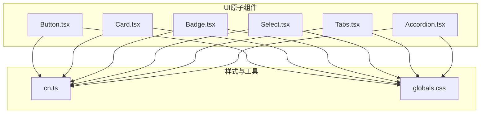
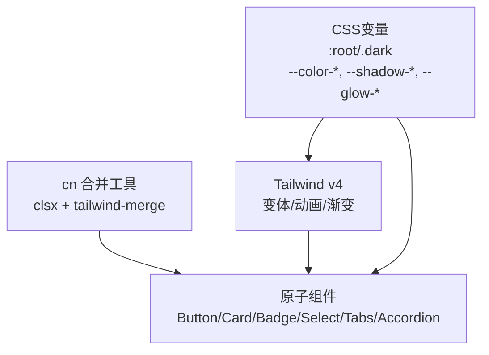
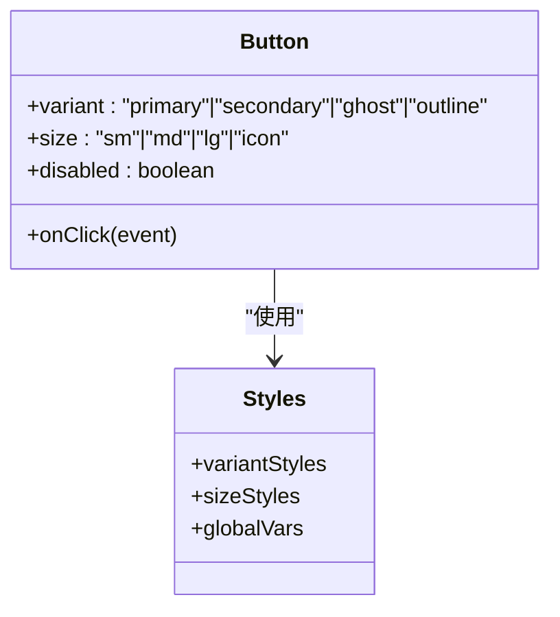
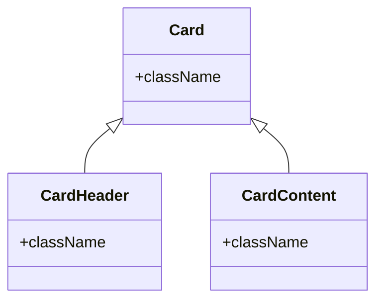
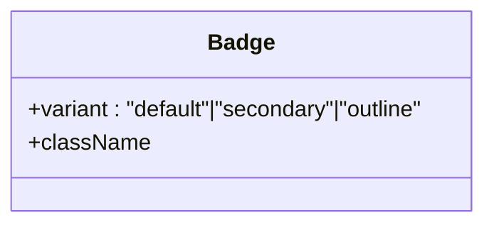
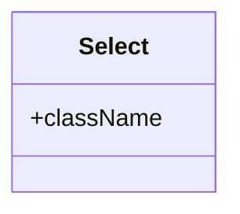
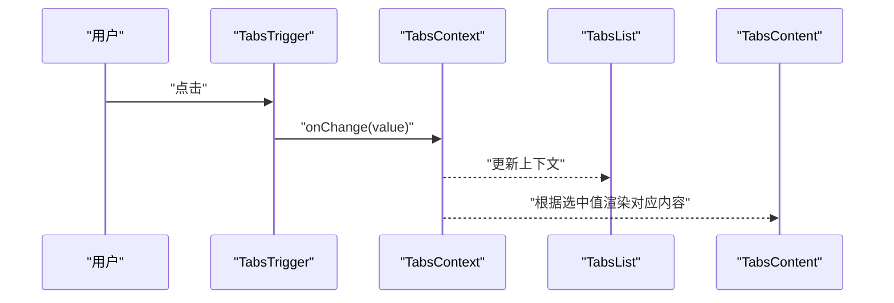
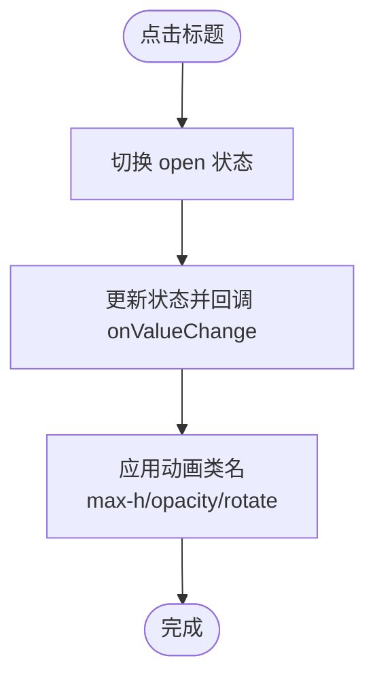
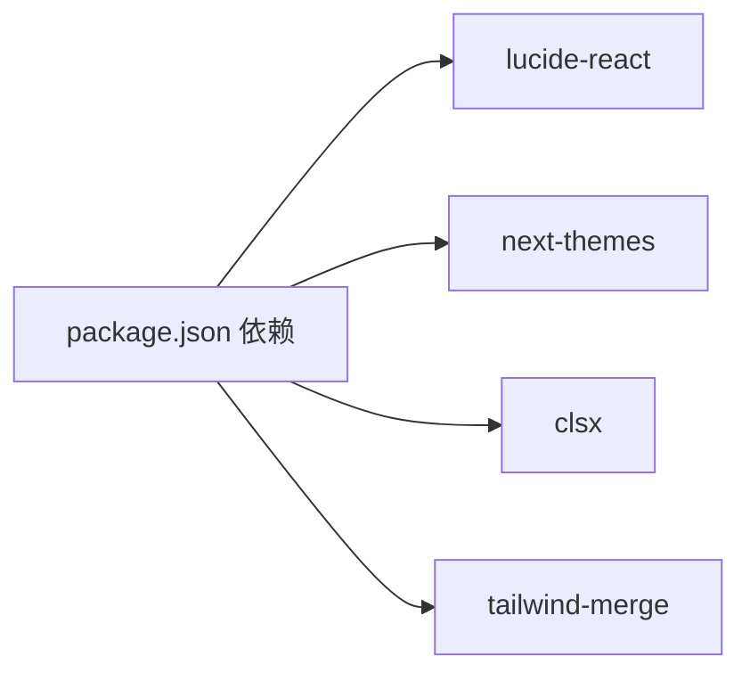

# 基础UI原子

<cite>
**本文引用的文件**
- [Button.tsx](file://src/components/ui/Button.tsx)
- [Card.tsx](file://src/components/ui/Card.tsx)
- [Badge.tsx](file://src/components/ui/Badge.tsx)
- [Select.tsx](file://src/components/ui/Select.tsx)
- [Tabs.tsx](file://src/components/ui/Tabs.tsx)
- [Accordion.tsx](file://src/components/ui/Accordion.tsx)
- [cn.ts](file://src/lib/utils/cn.ts)
- [globals.css](file://src/app/globals.css)
- [ThemeToggle.tsx](file://src/components/shared/ThemeToggle.tsx)
- [HomeUI.tsx](file://src/components/home/HomeUI.tsx)
- [package.json](file://package.json)
</cite>

## 目录
1. [简介](#简介)
2. [项目结构](#项目结构)
3. [核心组件](#核心组件)
4. [架构总览](#架构总览)
5. [详细组件分析](#详细组件分析)
6. [依赖关系分析](#依赖关系分析)
7. [性能考量](#性能考量)
8. [故障排查指南](#故障排查指南)
9. [结论](#结论)
10. [附录](#附录)

## 简介
本文件面向媒体工具箱中的基础UI原子组件，系统梳理并说明以下组件的设计与实现：Button（按钮）、Card（卡片）、Badge（徽章）、Select（选择器）、Tabs（标签页）与 Accordion（手风琴）。内容覆盖设计原则、语义化HTML结构、可访问性实现、样式系统（Tailwind CSS类、CSS变量、主题定制）、属性接口、事件与状态管理、响应式与跨浏览器兼容性、测试策略与维护方法，并提供组合模式与使用示例路径，帮助UI开发者与非专业开发者快速上手与正确使用。

## 项目结构
基础UI原子组件位于 src/components/ui 下，采用按“组件”分层组织，每个组件独立文件，职责清晰；样式系统统一在 src/app/globals.css 中集中定义，通过CSS变量与Tailwind v4进行主题化与变体控制；通用类名合并工具 cn.ts 使用 clsx 与 tailwind-merge 实现安全合并。

图表来源
- [Button.tsx:1-42](file://src/components/ui/Button.tsx#L1-L42)
- [Card.tsx:1-33](file://src/components/ui/Card.tsx#L1-L33)
- [Badge.tsx:1-28](file://src/components/ui/Badge.tsx#L1-L28)
- [Select.tsx:1-18](file://src/components/ui/Select.tsx#L1-L18)
- [Tabs.tsx:1-102](file://src/components/ui/Tabs.tsx#L1-L102)
- [Accordion.tsx:1-63](file://src/components/ui/Accordion.tsx#L1-L63)
- [cn.ts:1-7](file://src/lib/utils/cn.ts#L1-L7)
- [globals.css:1-128](file://src/app/globals.css#L1-L128)

章节来源
- [Button.tsx:1-42](file://src/components/ui/Button.tsx#L1-L42)
- [Card.tsx:1-33](file://src/components/ui/Card.tsx#L1-L33)
- [Badge.tsx:1-28](file://src/components/ui/Badge.tsx#L1-L28)
- [Select.tsx:1-18](file://src/components/ui/Select.tsx#L1-L18)
- [Tabs.tsx:1-102](file://src/components/ui/Tabs.tsx#L1-L102)
- [Accordion.tsx:1-63](file://src/components/ui/Accordion.tsx#L1-L63)
- [cn.ts:1-7](file://src/lib/utils/cn.ts#L1-L7)
- [globals.css:1-128](file://src/app/globals.css#L1-L128)

## 核心组件
本节概览六个原子组件的职责与共同特性：
- Button：提供多变体与尺寸，支持禁用态与加载态占位（通过外部容器或属性扩展），强调渐变背景与阴影高光效果。
- Card：容器型组件，提供卡片主体与头部/内容子组件，统一边框、背景、阴影与悬停过渡。
- Badge：轻量标记，支持默认/次要/描边三种变体，常用于状态、标签或徽标提示。
- Select：原生下拉选择器的样式封装，统一圆角、边框、焦点环与文本颜色。
- Tabs：上下文驱动的标签页容器，包含列表、触发器与内容区，支持受控/非受控两种模式。
- Accordion：折叠面板容器，包含标题与内容项，支持默认展开与值变更回调。

章节来源
- [Button.tsx:1-42](file://src/components/ui/Button.tsx#L1-L42)
- [Card.tsx:1-33](file://src/components/ui/Card.tsx#L1-L33)
- [Badge.tsx:1-28](file://src/components/ui/Badge.tsx#L1-L28)
- [Select.tsx:1-18](file://src/components/ui/Select.tsx#L1-L18)
- [Tabs.tsx:1-102](file://src/components/ui/Tabs.tsx#L1-L102)
- [Accordion.tsx:1-63](file://src/components/ui/Accordion.tsx#L1-L63)

## 架构总览
样式系统以CSS变量为核心，配合Tailwind v4变体与动画，实现明暗主题切换与一致的视觉语言。组件通过 cn 工具函数安全合并类名，避免冲突并保持可读性。

图表来源
- [globals.css:21-57](file://src/app/globals.css#L21-L57)
- [globals.css:80-94](file://src/app/globals.css#L80-L94)
- [cn.ts:1-7](file://src/lib/utils/cn.ts#L1-L7)
- [Button.tsx:12-25](file://src/components/ui/Button.tsx#L12-L25)
- [Card.tsx:8-11](file://src/components/ui/Card.tsx#L8-L11)
- [Badge.tsx:10-14](file://src/components/ui/Badge.tsx#L10-L14)
- [Select.tsx:10-13](file://src/components/ui/Select.tsx#L10-L13)
- [Tabs.tsx:49-52](file://src/components/ui/Tabs.tsx#L49-L52)
- [Accordion.tsx:14-14](file://src/components/ui/Accordion.tsx#L14-L14)

## 详细组件分析

### Button 按钮
- 设计原则
  - 渐变背景与阴影高光突出主操作，次级与描边变体强调层次与对比。
  - 尺寸体系：sm/md/lg/icon，满足不同密度场景。
  - 状态反馈：禁用态降低不透明度，交互态缩放与高光变化。
- 语义化与可访问性
  - 基于原生 button，保留默认行为；建议在表单中显式 type="button" 或 "submit"。
  - 可通过外部容器添加 loading 态（如旋转指示器）与 aria-busy/aria-disabled。
- 样式系统
  - 变体映射：primary/secondary/ghost/outline 四种风格。
  - 尺寸映射：sm/md/lg/icon 对应高度、内边距与字号。
  - 全局变量：--glow-primary 用于高光阴影，--primary/--primary-foreground 控制渐变与前景色。
- 属性与事件
  - 受控属性：variant（primary/secondary/ghost/outline）、size（sm/md/lg/icon）。
  - 继承自原生 button 的事件与属性（onClick、formAction、disabled 等）。
- 使用示例与组合
  - 主要操作：使用 primary 变体与 md 尺寸。
  - 次要操作：使用 secondary 或 outline 变体。
  - 图标按钮：使用 icon 尺寸并传入 children 作为图标。
  - 加载态：在外部包裹容器，显示加载指示器并禁用按钮。
- 响应式与兼容性
  - Tailwind 自动响应；在减少动画偏好下，过渡与动画会降级。
- 测试与维护
  - 单元测试：验证变体/尺寸类名拼接、禁用态与点击事件冒泡。
  - 维护要点：新增变体时同步更新映射表与CSS变量。

图表来源
- [Button.tsx:4-25](file://src/components/ui/Button.tsx#L4-L25)
- [Button.tsx:27-40](file://src/components/ui/Button.tsx#L27-L40)
- [globals.css:33-37](file://src/app/globals.css#L33-L37)

章节来源
- [Button.tsx:1-42](file://src/components/ui/Button.tsx#L1-L42)
- [globals.css:1-128](file://src/app/globals.css#L1-L128)

### Card 卡片
- 设计原则
  - 统一圆角、边框与背景，通过阴影与悬停过渡增强层级感。
  - 提供 CardHeader/ CardContent 子组件，便于结构化布局。
- 语义化与可访问性
  - 使用 div 容器，建议在需要时添加 role="region" 或 aria-labelledby。
- 样式系统
  - 背景与前景色来自 --card/--card-foreground；阴影来自 --shadow-card 与 --shadow-card-hover。
- 属性与事件
  - 支持 className 扩展与原生 div 属性透传。
- 使用示例与组合
  - 在首页分类卡片中使用 gradient-border 辅助装饰。
- 响应式与兼容性
  - 随主题自动切换明暗卡片外观。
- 测试与维护
  - 单元测试：校验类名拼接与子组件渲染。
  - 维护要点：新增子组件时保持命名一致性。

图表来源
- [Card.tsx:4-16](file://src/components/ui/Card.tsx#L4-L16)
- [Card.tsx:18-33](file://src/components/ui/Card.tsx#L18-L33)

章节来源
- [Card.tsx:1-33](file://src/components/ui/Card.tsx#L1-L33)
- [globals.css:33-37](file://src/app/globals.css#L33-L37)
- [HomeUI.tsx:122-149](file://src/components/home/HomeUI.tsx#L122-L149)

### Badge 徽章
- 设计原则
  - 圆角胶囊形状，用于状态、标签或提示信息。
- 语义化与可访问性
  - 使用 span，适合内联语义；可结合 aria-label 提升可访问性。
- 样式系统
  - 变体映射：default/secondary/outline；默认使用渐变主色。
- 属性与事件
  - 支持 variant 与 className 透传。
- 使用示例与组合
  - 在首页功能徽标中与图标组合使用。
- 响应式与兼容性
  - 字体大小与内边距适配移动端。
- 测试与维护
  - 单元测试：验证变体类名与文本渲染。
  - 维护要点：新增变体需同步样式映射。

图表来源
- [Badge.tsx:4-14](file://src/components/ui/Badge.tsx#L4-L14)
- [Badge.tsx:16-27](file://src/components/ui/Badge.tsx#L16-L27)

章节来源
- [Badge.tsx:1-28](file://src/components/ui/Badge.tsx#L1-L28)
- [HomeUI.tsx:142-149](file://src/components/home/HomeUI.tsx#L142-L149)

### Select 选择器
- 设计原则
  - 统一下拉外观，聚焦时提供清晰的环形高亮。
- 语义化与可访问性
  - 基于原生 select，建议提供 label 与可选的 aria-describedby。
- 样式系统
  - 统一圆角、边框、背景与文本颜色；聚焦时高亮。
- 属性与事件
  - 继承原生 select 的 onChange、value 等属性。
- 使用示例与组合
  - 在表单中直接使用，或与 Form 组件组合。
- 响应式与兼容性
  - 原生选择器在各浏览器表现一致。
- 测试与维护
  - 单元测试：验证类名拼接与受控/非受控行为。
  - 维护要点：避免覆盖原生样式导致可访问性问题。

图表来源
- [Select.tsx:4-17](file://src/components/ui/Select.tsx#L4-L17)

章节来源
- [Select.tsx:1-18](file://src/components/ui/Select.tsx#L1-L18)

### Tabs 标签页
- 设计原则
  - 列表区使用模糊背景与分隔，触发器在激活时强调。
- 语义化与可访问性
  - 使用按钮作为触发器，配合上下文 value 与 onChange；建议为内容区提供 aria-selected 与 aria-labelledby。
- 样式系统
  - 触发器激活态使用 --primary 高光与阴影；列表区使用模糊与半透明背景。
- 属性与事件
  - Tabs：defaultValue、value（受控）、onValueChange、children、className。
  - TabsList：children、className。
  - TabsTrigger：value、children、className。
  - TabsContent：value、children、className。
- 使用示例与组合
  - 在工具页面中作为步骤导航或配置分组。
- 响应式与兼容性
  - 按钮与容器在小屏下仍可良好交互。
- 测试与维护
  - 单元测试：验证受控/非受控切换、激活态渲染与回调触发。
  - 维护要点：保持上下文值与触发器 value 一致。

图表来源
- [Tabs.tsx:16-38](file://src/components/ui/Tabs.tsx#L16-L38)
- [Tabs.tsx:59-86](file://src/components/ui/Tabs.tsx#L59-L86)
- [Tabs.tsx:88-101](file://src/components/ui/Tabs.tsx#L88-L101)

章节来源
- [Tabs.tsx:1-102](file://src/components/ui/Tabs.tsx#L1-L102)

### Accordion 手风琴
- 设计原则
  - 通过 ChevronDown 图标指示展开/收起，内容区使用淡入与高度动画。
- 语义化与可访问性
  - 使用 button 并设置 aria-expanded；内容区提供可见文本。
- 样式系统
  - 内容区使用 max-height 与透明度控制动画；图标旋转实现方向反馈。
- 属性与事件
  - Accordion：children、className。
  - AccordionItem：title、children、defaultOpen、onValueChange。
- 使用示例与组合
  - 在FAQ或设置面板中使用。
- 响应式与兼容性
  - 动画在减少动画偏好下会降级。
- 测试与维护
  - 单元测试：验证展开/收起状态、回调触发与动画类名。
  - 维护要点：确保图标与状态同步。

图表来源
- [Accordion.tsx:17-62](file://src/components/ui/Accordion.tsx#L17-L62)

章节来源
- [Accordion.tsx:1-63](file://src/components/ui/Accordion.tsx#L1-L63)

## 依赖关系分析
- 组件依赖
  - 所有原子组件依赖 cn 工具进行类名合并，保证样式叠加与覆盖顺序可控。
  - 样式系统依赖 globals.css 中的CSS变量与Tailwind v4变体。
- 外部依赖
  - lucide-react 提供图标；next-themes 提供主题切换；clsx 与 tailwind-merge 提供类名合并能力。
- 潜在耦合点
  - 组件与CSS变量强相关，新增变体需同步更新变量与映射。
  - Tabs/Accordion 使用客户端状态，注意服务端渲染与水合一致性。

图表来源
- [package.json:11-31](file://package.json#L11-L31)

章节来源
- [package.json:1-45](file://package.json#L1-L45)
- [cn.ts:1-7](file://src/lib/utils/cn.ts#L1-L7)
- [globals.css:1-128](file://src/app/globals.css#L1-L128)

## 性能考量
- 类名合并
  - 使用 twMerge 避免重复类名冲突，减少DOM样式计算开销。
- 动画与过渡
  - 在减少动画偏好下，关键动画会被禁用，保障可用性。
- 主题切换
  - CSS变量切换比重绘更高效，建议优先使用变量而非硬编码颜色。
- 组件状态
  - Tabs/Accordion 使用 useState，注意避免不必要的重渲染（例如将回调稳定化）。

## 故障排查指南
- 样式异常
  - 检查是否正确引入 globals.css；确认CSS变量未被覆盖。
  - 使用浏览器开发者工具检查最终类名，定位冲突来源。
- 可访问性问题
  - 确保按钮、输入与标签具备正确的 role/aria-* 属性。
  - 为图标提供 aria-label 或相邻文本。
- 主题不生效
  - 确认 .dark 类已正确注入；检查 next-themes 配置。
- 动画不执行
  - 检查 prefers-reduced-motion 设置；必要时降级为静态样式。
- 组合使用问题
  - Tabs/Accordion 依赖上下文，请确保子组件在父组件内部渲染。

章节来源
- [globals.css:122-127](file://src/app/globals.css#L122-L127)
- [ThemeToggle.tsx:9-35](file://src/components/shared/ThemeToggle.tsx#L9-L35)

## 结论
媒体工具箱的基础UI原子组件以简洁、一致与可扩展为核心目标：通过CSS变量与Tailwind v4实现主题化与样式复用，通过 cn 工具保证类名安全合并，通过语义化HTML与可访问性属性提升可用性。六个组件覆盖了常见交互与布局需求，适合在复杂界面中通过组合模式构建高质量用户体验。

## 附录
- 主题与变量
  - 关键CSS变量：--background、--foreground、--primary、--primary-foreground、--muted、--muted-foreground、--border、--card、--card-foreground、--shadow-card、--shadow-card-hover、--glow-primary、--glow-primary-strong、--gradient-primary。
- 变体与尺寸映射
  - Button：变体映射与尺寸映射分别定义在组件内部。
  - Badge：变体映射定义在组件内部。
  - Card/Select：样式直接基于CSS变量与Tailwind类。
- 组合示例路径
  - 首页分类卡片与功能徽标：[HomeUI.tsx:122-149](file://src/components/home/HomeUI.tsx#L122-L149)
  - 主题切换按钮：[ThemeToggle.tsx:9-35](file://src/components/shared/ThemeToggle.tsx#L9-L35)

章节来源
- [globals.css:21-57](file://src/app/globals.css#L21-L57)
- [Button.tsx:12-25](file://src/components/ui/Button.tsx#L12-L25)
- [Badge.tsx:10-14](file://src/components/ui/Badge.tsx#L10-L14)
- [HomeUI.tsx:122-149](file://src/components/home/HomeUI.tsx#L122-L149)
- [ThemeToggle.tsx:9-35](file://src/components/shared/ThemeToggle.tsx#L9-L35)