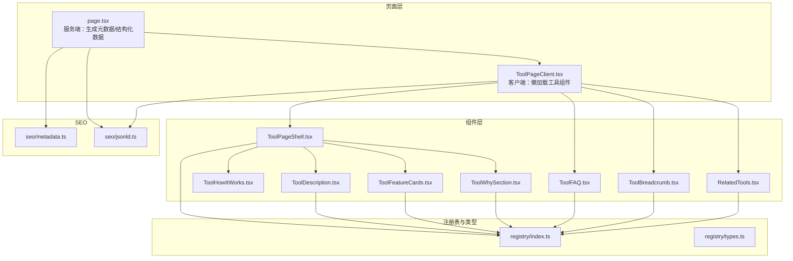
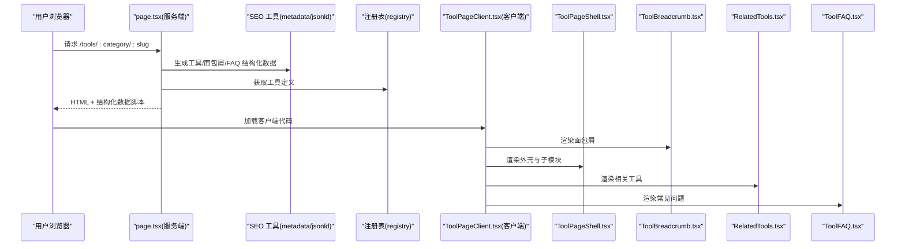
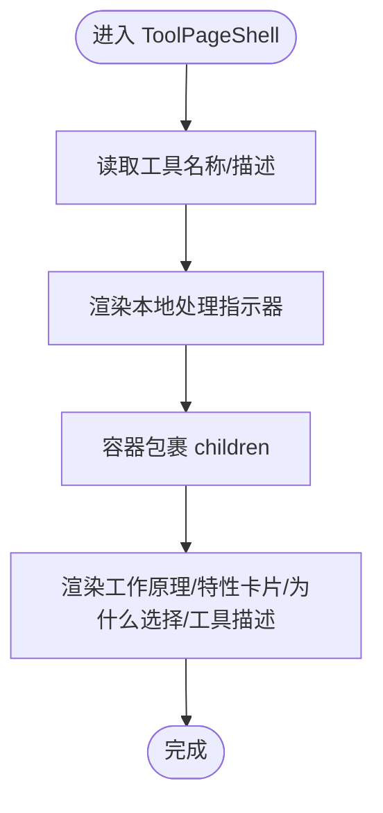
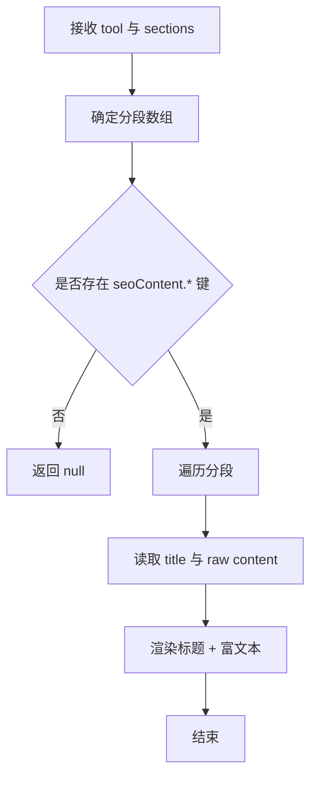
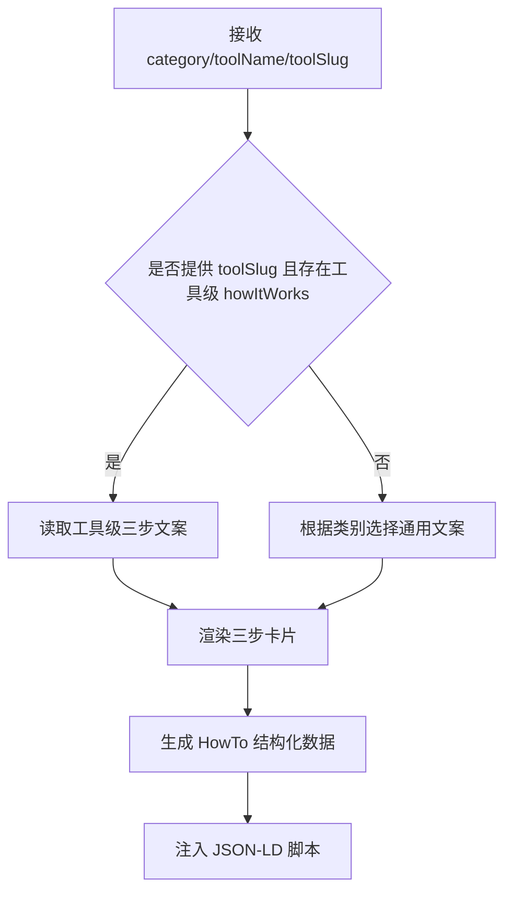
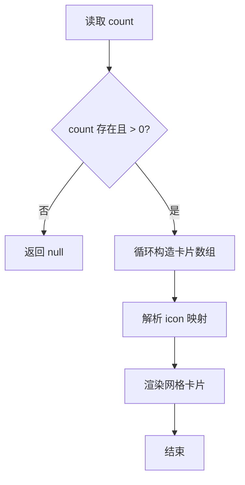
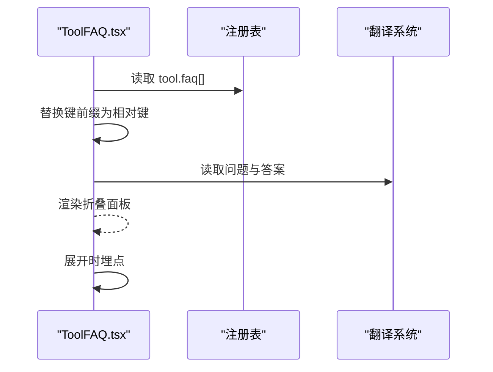
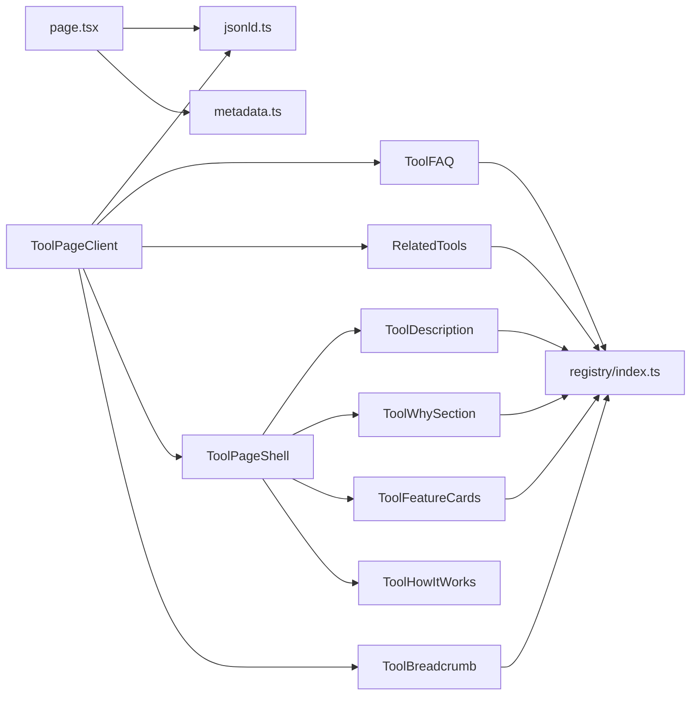
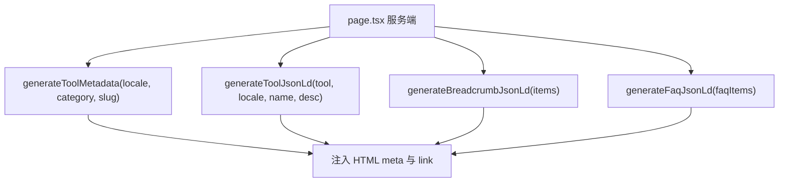

# 工具页面组件

<cite>
**本文档引用的文件**
- [ToolPageShell.tsx](file://src/components/tool/ToolPageShell.tsx)
- [ToolDescription.tsx](file://src/components/tool/ToolDescription.tsx)
- [ToolHowItWorks.tsx](file://src/components/tool/ToolHowItWorks.tsx)
- [ToolFeatureCards.tsx](file://src/components/tool/ToolFeatureCards.tsx)
- [ToolWhySection.tsx](file://src/components/tool/ToolWhySection.tsx)
- [ToolFAQ.tsx](file://src/components/tool/ToolFAQ.tsx)
- [ToolBreadcrumb.tsx](file://src/components/tool/ToolBreadcrumb.tsx)
- [RelatedTools.tsx](file://src/components/tool/RelatedTools.tsx)
- [ToolPageClient.tsx](file://src/app/[locale]/tools/[category]/[slug]/ToolPageClient.tsx)
- [page.tsx](file://src/app/[locale]/tools/[category]/[slug]/page.tsx)
- [index.ts](file://src/lib/registry/index.ts)
- [types.ts](file://src/lib/registry/types.ts)
- [metadata.ts](file://src/lib/seo/metadata.ts)
- [jsonld.ts](file://src/lib/seo/jsonld.ts)
</cite>

## 目录
1. [简介](#简介)
2. [项目结构](#项目结构)
3. [核心组件](#核心组件)
4. [架构总览](#架构总览)
5. [组件详解](#组件详解)
6. [依赖关系分析](#依赖关系分析)
7. [性能与体验](#性能与体验)
8. [SEO 策略](#seo-策略)
9. [国际化与多语言](#国际化与多语言)
10. [使用示例与定制](#使用示例与定制)
11. [故障排查](#故障排查)
12. [结论](#结论)

## 简介
本文件面向 UI 开发者与工具开发者，系统性梳理媒体工具箱“工具页面”组件体系：ToolPageShell 页面外壳、ToolDescription 工具描述、ToolHowItWorks 工作原理、ToolFeatureCards 特性卡片、ToolWhySection 为什么选择、ToolFAQ 常见问题、ToolBreadcrumb 面包屑导航、RelatedTools 相关工具等。文档覆盖组件功能定位、数据结构、渲染逻辑、与工具注册表系统的集成方式（动态内容生成与元数据管理）、SEO 优化策略（meta 标签、结构化数据、页面标题管理）、国际化支持、性能优化与用户体验设计，并提供可直接落地的使用示例与定制方法。

## 项目结构
工具页面组件位于 src/components/tool 下，页面入口由路由层 page.tsx 与客户端壳子 ToolPageClient.tsx 协同完成；工具注册表在 src/lib/registry 中集中管理，类型定义在 types.ts；SEO 相关的元数据与结构化数据生成在 src/lib/seo 下。

**图表来源**
- [page.tsx:1-109](file://src/app/[locale]/tools/[category]/[slug]/page.tsx#L1-L109)
- [ToolPageClient.tsx:1-59](file://src/app/[locale]/tools/[category]/[slug]/ToolPageClient.tsx#L1-L59)
- [ToolPageShell.tsx:1-54](file://src/components/tool/ToolPageShell.tsx#L1-L54)
- [ToolDescription.tsx:1-46](file://src/components/tool/ToolDescription.tsx#L1-L46)
- [ToolHowItWorks.tsx:1-102](file://src/components/tool/ToolHowItWorks.tsx#L1-L102)
- [ToolFeatureCards.tsx:1-75](file://src/components/tool/ToolFeatureCards.tsx#L1-L75)
- [ToolWhySection.tsx:1-26](file://src/components/tool/ToolWhySection.tsx#L1-L26)
- [ToolFAQ.tsx:1-51](file://src/components/tool/ToolFAQ.tsx#L1-L51)
- [ToolBreadcrumb.tsx:1-78](file://src/components/tool/ToolBreadcrumb.tsx#L1-L78)
- [RelatedTools.tsx:1-56](file://src/components/tool/RelatedTools.tsx#L1-L56)
- [index.ts:1-164](file://src/lib/registry/index.ts#L1-L164)
- [types.ts:1-22](file://src/lib/registry/types.ts#L1-L22)
- [metadata.ts:1-99](file://src/lib/seo/metadata.ts#L1-L99)
- [jsonld.ts:1-90](file://src/lib/seo/jsonld.ts#L1-L90)

**章节来源**
- [page.tsx:1-109](file://src/app/[locale]/tools/[category]/[slug]/page.tsx#L1-L109)
- [ToolPageClient.tsx:1-59](file://src/app/[locale]/tools/[category]/[slug]/ToolPageClient.tsx#L1-L59)
- [index.ts:1-164](file://src/lib/registry/index.ts#L1-L164)
- [types.ts:1-22](file://src/lib/registry/types.ts#L1-L22)
- [metadata.ts:1-99](file://src/lib/seo/metadata.ts#L1-L99)
- [jsonld.ts:1-90](file://src/lib/seo/jsonld.ts#L1-L90)

## 核心组件
- ToolPageShell：工具页面外壳，负责标题、本地处理提示、容器包裹以及组合其他模块（工作原理、特性卡片、为什么选择、工具描述）。
- ToolDescription：根据工具翻译键渲染 SEO 内容分段（intro、howToUse、features、useCases、privacy 等）。
- ToolHowItWorks：按类别区分文本类与文件类流程，优先读取工具级 howItWorks 步骤，否则回退通用步骤，并输出 HowTo 结构化数据。
- ToolFeatureCards：从工具翻译中读取 featureCards 数量与条目，映射图标并渲染特性卡片。
- ToolWhySection：渲染工具“为什么选择”标题与富文本内容。
- ToolFAQ：基于注册表中的 FAQ 键列表，动态读取问题与答案，渲染折叠面板并埋点统计。
- ToolBreadcrumb：生成面包屑导航与 BreadcrumbList 结构化数据。
- RelatedTools：根据工具 relatedSlugs 列表，结合导航数据渲染相关工具卡片并埋点。

**章节来源**
- [ToolPageShell.tsx:1-54](file://src/components/tool/ToolPageShell.tsx#L1-L54)
- [ToolDescription.tsx:1-46](file://src/components/tool/ToolDescription.tsx#L1-L46)
- [ToolHowItWorks.tsx:1-102](file://src/components/tool/ToolHowItWorks.tsx#L1-L102)
- [ToolFeatureCards.tsx:1-75](file://src/components/tool/ToolFeatureCards.tsx#L1-L75)
- [ToolWhySection.tsx:1-26](file://src/components/tool/ToolWhySection.tsx#L1-L26)
- [ToolFAQ.tsx:1-51](file://src/components/tool/ToolFAQ.tsx#L1-L51)
- [ToolBreadcrumb.tsx:1-78](file://src/components/tool/ToolBreadcrumb.tsx#L1-L78)
- [RelatedTools.tsx:1-56](file://src/components/tool/RelatedTools.tsx#L1-L56)

## 架构总览
工具页面采用“服务端生成 + 客户端外壳”的混合架构：
- 服务端 page.tsx 负责：
  - 生成页面元数据（title/description/keywords/alternate）
  - 生成结构化数据（工具、面包屑、FAQ）
  - 按需预取 FFmpeg 资源
  - 合并公共与工具级翻译
- 客户端 ToolPageClient.tsx 负责：
  - 懒加载具体工具组件
  - 渲染面包屑、外壳、相关工具、FAQ
  - 使用注册表数据驱动 UI

**图表来源**
- [page.tsx:24-108](file://src/app/[locale]/tools/[category]/[slug]/page.tsx#L24-L108)
- [ToolPageClient.tsx:29-58](file://src/app/[locale]/tools/[category]/[slug]/ToolPageClient.tsx#L29-L58)
- [ToolPageShell.tsx:15-52](file://src/components/tool/ToolPageShell.tsx#L15-L52)
- [ToolBreadcrumb.tsx:14-77](file://src/components/tool/ToolBreadcrumb.tsx#L14-L77)
- [RelatedTools.tsx:17-55](file://src/components/tool/RelatedTools.tsx#L17-L55)
- [ToolFAQ.tsx:12-50](file://src/components/tool/ToolFAQ.tsx#L12-L50)
- [index.ts:139-147](file://src/lib/registry/index.ts#L139-L147)
- [metadata.ts:14-57](file://src/lib/seo/metadata.ts#L14-L57)
- [jsonld.ts:5-89](file://src/lib/seo/jsonld.ts#L5-L89)

## 组件详解

### ToolPageShell 页面外壳
- 功能定位：统一工具页面的头部信息（名称、描述）、本地处理指示器、主内容容器，以及组合其他模块。
- 数据结构与渲染：
  - 接收 ToolDefinition，通过命名空间读取工具名称与描述。
  - 渲染本地处理指示器（Shield 图标 + 提示文案）。
  - 容器包裹 children（即具体工具界面）。
  - 底部依次渲染：工作原理、特性卡片、为什么选择、工具描述。
- 国际化：使用 next-intl 的 useTranslations 读取 tools.* 与 common.* 命名空间。

**图表来源**
- [ToolPageShell.tsx:15-52](file://src/components/tool/ToolPageShell.tsx#L15-L52)

**章节来源**
- [ToolPageShell.tsx:1-54](file://src/components/tool/ToolPageShell.tsx#L1-L54)

### ToolDescription 工具描述
- 功能定位：按顺序渲染 SEO 内容分段，支持自定义 sections。
- 数据结构与渲染：
  - 默认分段：intro、howToUse、features、useCases、privacy。
  - 通过 has 检查是否存在对应键，不存在则跳过。
  - 富文本通过 dangerouslySetInnerHTML 渲染。
- 性能：仅在存在 seoContent.* 时渲染，避免空渲染。

**图表来源**
- [ToolDescription.tsx:21-45](file://src/components/tool/ToolDescription.tsx#L21-L45)

**章节来源**
- [ToolDescription.tsx:1-46](file://src/components/tool/ToolDescription.tsx#L1-L46)

### ToolHowItWorks 工作原理
- 功能定位：按三步流程展示工具使用路径，支持工具级覆盖与类别回退。
- 数据结构与渲染：
  - 文本类工具（developer）与文件类工具采用不同文案。
  - 优先读取工具级 howItWorks.stepXTitle/Desc，否则回退通用文案。
  - 输出 HowTo 结构化数据（HowTo + Step）。
- 性能：steps 计算一次，避免重复渲染。

**图表来源**
- [ToolHowItWorks.tsx:15-101](file://src/components/tool/ToolHowItWorks.tsx#L15-L101)

**章节来源**
- [ToolHowItWorks.tsx:1-102](file://src/components/tool/ToolHowItWorks.tsx#L1-L102)

### ToolFeatureCards 特性卡片
- 功能定位：从工具翻译中批量读取特性卡片，映射图标并渲染网格。
- 数据结构与渲染：
  - 通过 featureCards.count 读取数量，逐项读取 icon/title/description。
  - 支持多种图标映射，缺失时回退到默认图标。
- 性能：循环构建卡片数组，无额外状态。

**图表来源**
- [ToolFeatureCards.tsx:29-74](file://src/components/tool/ToolFeatureCards.tsx#L29-L74)

**章节来源**
- [ToolFeatureCards.tsx:1-75](file://src/components/tool/ToolFeatureCards.tsx#L1-L75)

### ToolWhySection 为什么选择
- 功能定位：渲染工具“为什么选择”标题与富文本内容。
- 数据结构与渲染：
  - 通过 has 检查是否存在 whySection.title。
  - 使用 dangerouslySetInnerHTML 渲染 whySection.content。

**章节来源**
- [ToolWhySection.tsx:1-26](file://src/components/tool/ToolWhySection.tsx#L1-L26)

### ToolFAQ 常见问题
- 功能定位：基于注册表中的 FAQ 键列表，动态读取问题与答案，渲染折叠面板。
- 数据结构与渲染：
  - 注册表 FAQ 项为绝对键（含 tools.developer.word-counter 前缀），组件内部剥离前缀后读取。
  - 折叠面板展开时触发埋点事件。
- 性能：FAQ 为空时不渲染。

**图表来源**
- [ToolFAQ.tsx:18-50](file://src/components/tool/ToolFAQ.tsx#L18-L50)
- [types.ts:14-16](file://src/lib/registry/types.ts#L14-L16)

**章节来源**
- [ToolFAQ.tsx:1-51](file://src/components/tool/ToolFAQ.tsx#L1-L51)
- [types.ts:1-22](file://src/lib/registry/types.ts#L1-L22)

### ToolBreadcrumb 面包屑导航
- 功能定位：渲染面包屑导航并输出 BreadcrumbList 结构化数据。
- 数据结构与渲染：
  - 读取工具名称与分类名称，生成四层面包屑。
  - 输出 JSON-LD 脚本，包含位置、名称与链接。

**章节来源**
- [ToolBreadcrumb.tsx:1-78](file://src/components/tool/ToolBreadcrumb.tsx#L1-L78)

### RelatedTools 相关工具
- 功能定位：根据工具 relatedSlugs 列表渲染相关工具卡片。
- 数据结构与渲染：
  - 过滤当前工具，查询注册表与导航数据，合并为可渲染列表。
  - 点击时触发埋点事件。
- 性能：过滤与映射在客户端一次性完成。

**章节来源**
- [RelatedTools.tsx:1-56](file://src/components/tool/RelatedTools.tsx#L1-L56)

## 依赖关系分析
- 组件耦合与内聚：
  - ToolPageShell 作为聚合组件，内聚度高但对其他模块有强依赖。
  - ToolDescription/FeatureCards/WhySection 独立性强，仅依赖翻译系统。
  - ToolHowItWorks/ToolFAQ/ToolBreadcrumb/RelatedTools 分别依赖类别、注册表、导航数据。
- 外部依赖与集成点：
  - 注册表 registry/index.ts 提供工具定义与导航数据。
  - SEO 工具 jsonld.ts 与 metadata.ts 用于结构化数据与元数据生成。
  - next-intl 提供国际化与翻译能力。

**图表来源**
- [ToolPageShell.tsx:6-8](file://src/components/tool/ToolPageShell.tsx#L6-L8)
- [ToolPageClient.tsx:6-9](file://src/app/[locale]/tools/[category]/[slug]/ToolPageClient.tsx#L6-L9)
- [index.ts:1-164](file://src/lib/registry/index.ts#L1-L164)
- [metadata.ts:1-99](file://src/lib/seo/metadata.ts#L1-L99)
- [jsonld.ts:1-90](file://src/lib/seo/jsonld.ts#L1-L90)

**章节来源**
- [index.ts:1-164](file://src/lib/registry/index.ts#L1-L164)
- [types.ts:1-22](file://src/lib/registry/types.ts#L1-L22)
- [metadata.ts:1-99](file://src/lib/seo/metadata.ts#L1-L99)
- [jsonld.ts:1-90](file://src/lib/seo/jsonld.ts#L1-L90)

## 性能与体验
- 懒加载与缓存：ToolPageClient 使用 useMemo 与 Map 缓存懒加载组件，避免重复创建与网络请求。
- 骨架屏：Suspense 包裹懒加载组件，提供简化的骨架屏提升感知性能。
- 条件渲染：各模块均在存在数据时才渲染，减少无效 DOM。
- 结构化数据：仅在需要时注入 JSON-LD，避免冗余脚本。
- 无障碍与可访问性：使用语义化标题层级与富文本容器，保持良好的可读性与可访问性。

**章节来源**
- [ToolPageClient.tsx:16-58](file://src/app/[locale]/tools/[category]/[slug]/ToolPageClient.tsx#L16-L58)
- [ToolHowItWorks.tsx:93-98](file://src/components/tool/ToolHowItWorks.tsx#L93-L98)
- [ToolBreadcrumb.tsx:71-75](file://src/components/tool/ToolBreadcrumb.tsx#L71-L75)

## SEO 策略
- 元数据生成：page.tsx 在服务端调用 generateToolMetadata，基于工具翻译生成 title、description、keywords、canonical 与多语言 alternates。
- 结构化数据：
  - 工具页：generateToolJsonLd 输出 WebApplication/SoftwareApplication。
  - 面包屑：generateBreadcrumbJsonLd 输出 BreadcrumbList。
  - FAQ：generateFaqJsonLd 输出 FAQPage。
- 页面标题管理：优先使用工具翻译中的 metaTitle，确保多语言一致性。
- Open Graph/Twitter：统一设置 og:title/description、twitter:card 等，提升分享质量。

**图表来源**
- [page.tsx:24-93](file://src/app/[locale]/tools/[category]/[slug]/page.tsx#L24-L93)
- [metadata.ts:14-57](file://src/lib/seo/metadata.ts#L14-L57)
- [jsonld.ts:5-89](file://src/lib/seo/jsonld.ts#L5-L89)

**章节来源**
- [page.tsx:24-93](file://src/app/[locale]/tools/[category]/[slug]/page.tsx#L24-L93)
- [metadata.ts:1-99](file://src/lib/seo/metadata.ts#L1-L99)
- [jsonld.ts:1-90](file://src/lib/seo/jsonld.ts#L1-L90)

## 国际化与多语言
- 翻译命名空间：
  - common：通用文案（如本地处理指示器、关于工具、FAQ、相关工具等）。
  - categories：分类名称与描述。
  - tools.<category>.<slug>：工具专属文案（名称、描述、SEO 内容、FAQ、特性卡片等）。
- 页面层合并消息：page.tsx 将公共消息与单个工具的工具消息合并，确保客户端渲染一致。
- 结构化数据：面包屑与工具页结构化数据使用当前 locale 的站点 URL，保证多语言 canonical 与 alternates 正确。

**章节来源**
- [page.tsx:46-54](file://src/app/[locale]/tools/[category]/[slug]/page.tsx#L46-L54)
- [ToolBreadcrumb.tsx:14-52](file://src/components/tool/ToolBreadcrumb.tsx#L14-L52)
- [ToolHowItWorks.tsx:59-71](file://src/components/tool/ToolHowItWorks.tsx#L59-L71)

## 使用示例与定制

### 为新工具创建标准页面布局
- 在工具目录下实现工具组件（例如 src/tools/<category>/<slug>/index.ts 导出 ToolDefinition）。
- 在翻译文件中添加 tools.<category>.<slug> 命名空间下的必要键：
  - 基础信息：name、description、metaTitle、metaDescription、keywords
  - SEO 内容：seoContent.intro.title/content、seoContent.howToUse.*、seoContent.features.*、seoContent.useCases.*、seoContent.privacy.*
  - 特性卡片：featureCards.count、featureCards.f1.icon/title/description …
  - 为什么选择：whySection.title、whySection.content
  - 工作原理：howItWorks.step1Title/Desc、step2Title/Desc、step3Title/Desc（或使用类别回退文案）
  - 常见问题：faq.q1、faq.a1 …（配合注册表 faq 键列表）
- 在注册表中导入并导出该工具定义（registry/index.ts）。
- 页面会自动：
  - 生成元数据与结构化数据
  - 渲染面包屑与相关工具
  - 组合外壳与其他模块

**章节来源**
- [index.ts:4-64](file://src/lib/registry/index.ts#L4-L64)
- [types.ts:5-16](file://src/lib/registry/types.ts#L5-L16)
- [page.tsx:41-44](file://src/app/[locale]/tools/[category]/[slug]/page.tsx#L41-L44)

### 定制模块
- 自定义 SEO 内容分段：在 ToolDescription 中传入 sections 覆盖默认顺序。
- 自定义特性卡片：在 featureCards 中按 f1/f2/f3… 添加条目。
- 自定义工作原理：在工具级 howItWorks 中提供三步文案，或依赖类别回退。
- 自定义“为什么选择”：提供 whySection.title 与 whySection.content。
- 自定义相关工具：在注册表中为工具设置 relatedSlugs。

**章节来源**
- [ToolDescription.tsx:7-24](file://src/components/tool/ToolDescription.tsx#L7-L24)
- [ToolFeatureCards.tsx:29-46](file://src/components/tool/ToolFeatureCards.tsx#L29-L46)
- [ToolHowItWorks.tsx:19-57](file://src/components/tool/ToolHowItWorks.tsx#L19-L57)
- [ToolWhySection.tsx:9-14](file://src/components/tool/ToolWhySection.tsx#L9-L14)
- [types.ts:14-16](file://src/lib/registry/types.ts#L14-L16)

## 故障排查
- 页面未显示 SEO 内容：
  - 检查翻译键是否存在：tools.<category>.<slug>.seoContent.* 是否完整。
  - 确认 ToolDescription 的 sections 参数是否覆盖了所需分段。
- 工具级工作原理不生效：
  - 确认工具级 howItWorks.step1Title 存在，或检查类别是否在文本类列表中。
- 特性卡片不显示：
  - 检查 featureCards.count 是否为正数，且 f1/f2… 对应键是否存在。
- 面包屑与结构化数据异常：
  - 确认工具名称与分类名称在对应命名空间中存在。
  - 检查生成的结构化数据 JSON-LD 是否被正确注入。
- 相关工具为空：
  - 检查注册表中 relatedSlugs 是否填写，且对应工具在导航数据中存在。

**章节来源**
- [ToolDescription.tsx:26-33](file://src/components/tool/ToolDescription.tsx#L26-L33)
- [ToolFeatureCards.tsx:33-36](file://src/components/tool/ToolFeatureCards.tsx#L33-L36)
- [ToolHowItWorks.tsx:20-21](file://src/components/tool/ToolHowItWorks.tsx#L20-L21)
- [ToolBreadcrumb.tsx:23-52](file://src/components/tool/ToolBreadcrumb.tsx#L23-L52)
- [RelatedTools.tsx:22-30](file://src/components/tool/RelatedTools.tsx#L22-L30)

## 结论
工具页面组件体系通过“服务端元数据 + 客户端外壳 + 注册表驱动”的架构，实现了高度可配置、可扩展、可 SEO 优化的工具页面。开发者只需在注册表与翻译中提供标准化数据，即可获得完整的页面布局与结构化数据支持。组件间职责清晰、耦合度适中，便于维护与演进。建议在新增工具时严格遵循命名空间与键规范，确保一致的用户体验与搜索引擎表现。