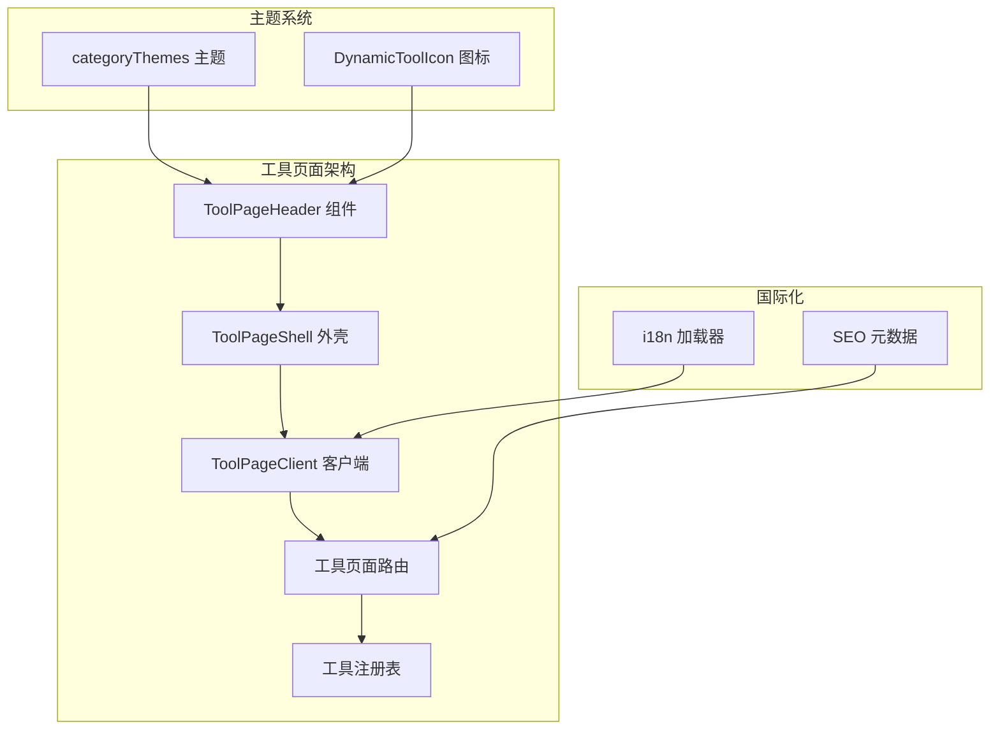
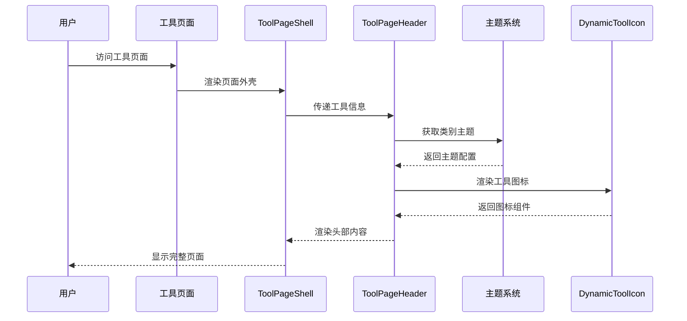
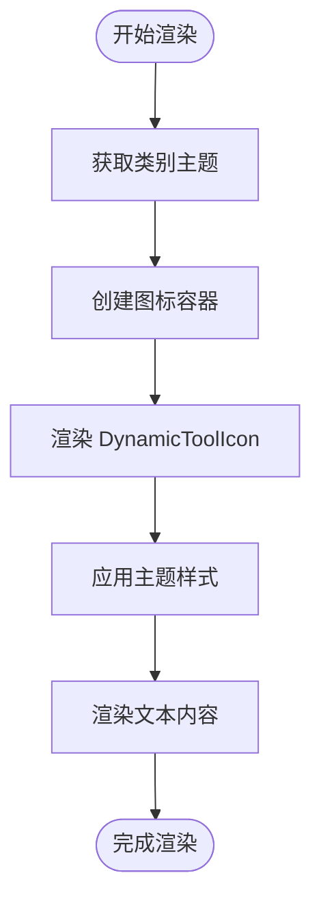
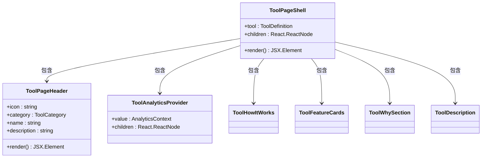
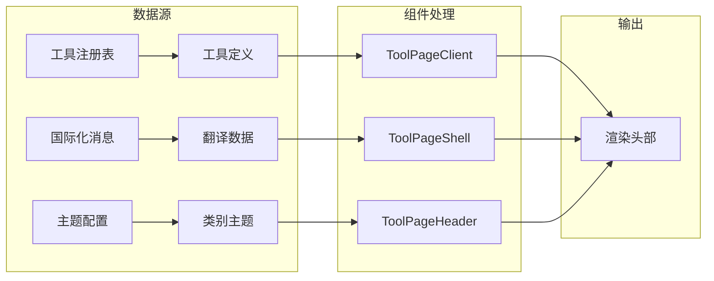
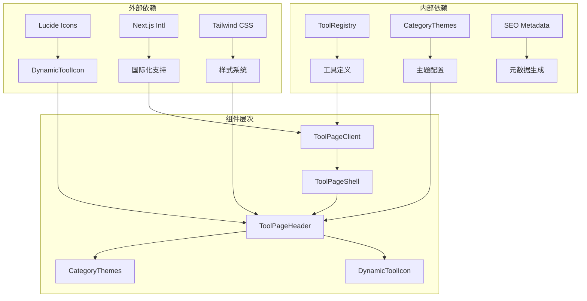

# 工具页面头部组件

<cite>
**本文档引用的文件**
- [ToolPageHeader.tsx](file://src/components/tool/ToolPageHeader.tsx)
- [ToolPageShell.tsx](file://src/components/tool/ToolPageShell.tsx)
- [ToolPageClient.tsx](file://src/app/[locale]/tools/[category]/[slug]/ToolPageClient.tsx)
- [page.tsx](file://src/app/[locale]/tools/[category]/[slug]/page.tsx)
- [categoryThemes.ts](file://src/lib/theme/categoryThemes.ts)
- [DynamicToolIcon.tsx](file://src/components/shared/DynamicToolIcon.tsx)
- [index.ts](file://src/lib/registry/index.ts)
- [types.ts](file://src/lib/registry/types.ts)
- [metadata.ts](file://src/lib/seo/metadata.ts)
- [loadMessages.ts](file://src/lib/i18n/loadMessages.ts)
</cite>

## 目录
1. [简介](#简介)
2. [项目结构](#项目结构)
3. [核心组件](#核心组件)
4. [架构概览](#架构概览)
5. [详细组件分析](#详细组件分析)
6. [依赖关系分析](#依赖关系分析)
7. [性能考虑](#性能考虑)
8. [故障排除指南](#故障排除指南)
9. [结论](#结论)

## 简介

工具页面头部组件是 PrivaDeck 媒体工具平台中用于展示单个工具页面标题信息的核心 UI 组件。该组件负责显示工具的图标、名称、描述以及相关的主题样式，为用户提供清晰的工具识别和导航体验。组件采用响应式设计，支持多种工具类别（图像、视频、音频、PDF、开发者工具），并集成了动态主题系统和国际化支持。

## 项目结构

工具页面头部组件位于项目的组件层次结构中，与工具页面的整体架构紧密集成：



**图表来源**
- [ToolPageHeader.tsx:1-33](file://src/components/tool/ToolPageHeader.tsx#L1-L33)
- [ToolPageShell.tsx:1-61](file://src/components/tool/ToolPageShell.tsx#L1-L61)
- [ToolPageClient.tsx:1-72](file://src/app/[locale]/tools/[category]/[slug]/ToolPageClient.tsx#L1-L72)

**章节来源**
- [ToolPageHeader.tsx:1-33](file://src/components/tool/ToolPageHeader.tsx#L1-L33)
- [ToolPageShell.tsx:1-61](file://src/components/tool/ToolPageShell.tsx#L1-L61)
- [ToolPageClient.tsx:1-72](file://src/app/[locale]/tools/[category]/[slug]/ToolPageClient.tsx#L1-L72)

## 核心组件

### ToolPageHeader 组件

ToolPageHeader 是工具页面头部的核心组件，负责渲染工具的基本信息展示区域。该组件接收四个关键属性：工具图标、类别、名称和描述，并根据工具类别应用相应的主题样式。

**主要特性：**
- 动态主题应用：根据工具类别自动选择颜色方案
- 响应式布局：适配不同屏幕尺寸
- 图标系统：使用 DynamicToolIcon 组件渲染工具图标
- 国际化支持：从翻译文件中获取本地化的名称和描述

**组件接口定义：**
```typescript
interface ToolPageHeaderProps {
  icon: string;           // 图标名称（Lucide 图标库中的图标名）
  category: ToolCategory; // 工具类别
  name: string;           // 工具名称
  description: string;    // 工具描述
}
```

**章节来源**
- [ToolPageHeader.tsx:7-12](file://src/components/tool/ToolPageHeader.tsx#L7-L12)
- [ToolPageHeader.tsx:14-32](file://src/components/tool/ToolPageHeader.tsx#L14-L32)

### 主题系统集成

组件通过 `getCategoryTheme` 函数获取对应类别的主题配置，包括：
- 图标背景色（包含明暗模式支持）
- 图标颜色（包含明暗模式支持）
- 悬停边框样式
- 英雄背景渐变

**章节来源**
- [ToolPageHeader.tsx:14-15](file://src/components/tool/ToolPageHeader.tsx#L14-L15)
- [categoryThemes.ts:87-89](file://src/lib/theme/categoryThemes.ts#L87-L89)

## 架构概览

工具页面头部组件在整个应用架构中扮演着重要的角色，它与多个系统组件协同工作：



**图表来源**
- [ToolPageHeader.tsx:14-32](file://src/components/tool/ToolPageHeader.tsx#L14-L32)
- [ToolPageShell.tsx:28-33](file://src/components/tool/ToolPageShell.tsx#L28-L33)
- [categoryThemes.ts:87-89](file://src/lib/theme/categoryThemes.ts#L87-L89)

## 详细组件分析

### ToolPageHeader 实现分析

#### 组件结构
组件采用简洁的两列布局设计：
- 左侧：圆形图标容器，包含工具图标
- 右侧：工具标题和描述文本区域

#### 主题应用机制
组件通过以下步骤应用主题：
1. 调用 `getCategoryTheme(category)` 获取类别主题配置
2. 将主题类名应用到图标容器和图标元素
3. 支持明暗模式的差异化样式

#### 图标渲染流程


**图表来源**
- [ToolPageHeader.tsx:14-32](file://src/components/tool/ToolPageHeader.tsx#L14-L32)
- [DynamicToolIcon.tsx:112-118](file://src/components/shared/DynamicToolIcon.tsx#L112-L118)

**章节来源**
- [ToolPageHeader.tsx:17-31](file://src/components/tool/ToolPageHeader.tsx#L17-L31)
- [DynamicToolIcon.tsx:106-118](file://src/components/shared/DynamicToolIcon.tsx#L106-L118)

### ToolPageShell 集成分析

ToolPageShell 作为页面外壳，负责将 ToolPageHeader 与其他页面元素组合：



**图表来源**
- [ToolPageShell.tsx:13-16](file://src/components/tool/ToolPageShell.tsx#L13-L16)
- [ToolPageShell.tsx:28-58](file://src/components/tool/ToolPageShell.tsx#L28-L58)

**章节来源**
- [ToolPageShell.tsx:18-59](file://src/components/tool/ToolPageShell.tsx#L18-L59)

### 数据流分析

工具页面头部组件的数据流遵循以下模式：



**图表来源**
- [index.ts:143-151](file://src/lib/registry/index.ts#L143-L151)
- [loadMessages.ts:59-67](file://src/lib/i18n/loadMessages.ts#L59-L67)
- [categoryThemes.ts:87-89](file://src/lib/theme/categoryThemes.ts#L87-L89)

**章节来源**
- [ToolPageClient.tsx:40-55](file://src/app/[locale]/tools/[category]/[slug]/ToolPageClient.tsx#L40-L55)
- [ToolPageShell.tsx:19-24](file://src/components/tool/ToolPageShell.tsx#L19-L24)

## 依赖关系分析

### 组件依赖图



**图表来源**
- [DynamicToolIcon.tsx:3-53](file://src/components/shared/DynamicToolIcon.tsx#L3-L53)
- [categoryThemes.ts:1-15](file://src/lib/theme/categoryThemes.ts#L1-L15)
- [index.ts:1-68](file://src/lib/registry/index.ts#L1-L68)

### 关键依赖说明

**DynamicToolIcon 依赖：**
- 使用 Lucide Icons 库提供丰富的图标选择
- 支持动态图标映射，通过字符串名称查找对应图标组件

**主题系统依赖：**
- 统一的颜色调色板，确保所有工具类别的一致性
- 明暗模式支持，提供更好的用户体验

**国际化依赖：**
- Next.js Intl 提供多语言支持
- 深度合并机制确保翻译的完整性

**章节来源**
- [DynamicToolIcon.tsx:55-104](file://src/components/shared/DynamicToolIcon.tsx#L55-L104)
- [categoryThemes.ts:19-84](file://src/lib/theme/categoryThemes.ts#L19-L84)
- [loadMessages.ts:10-27](file://src/lib/i18n/loadMessages.ts#L10-L27)

## 性能考虑

### 优化策略

**懒加载机制：**
- 工具页面使用 React.lazy 和 Suspense 实现组件懒加载
- 通过缓存机制避免重复加载相同的工具组件

**主题预计算：**
- 主题配置在组件外部预计算，减少运行时开销
- 类别主题映射使用对象字面量，提供 O(1) 访问时间

**图标优化：**
- 动态图标组件仅在需要时渲染
- 支持回退机制，防止图标缺失导致的渲染失败

**国际化性能：**
- 英文基础消息缓存，避免重复导入
- 深度合并操作仅在必要时执行

**章节来源**
- [ToolPageClient.tsx:28-38](file://src/app/[locale]/tools/[category]/[slug]/ToolPageClient.tsx#L28-L38)
- [categoryThemes.ts:87-89](file://src/lib/theme/categoryThemes.ts#L87-L89)
- [loadMessages.ts:29-51](file://src/lib/i18n/loadMessages.ts#L29-L51)

## 故障排除指南

### 常见问题及解决方案

**图标不显示问题：**
- 检查图标名称是否存在于 DynamicToolIcon 的映射表中
- 确认图标名称大小写正确
- 验证 Lucide Icons 依赖版本兼容性

**主题样式异常：**
- 确认工具类别是否在 categoryThemes 中正确定义
- 检查 Tailwind CSS 类名拼写
- 验证明暗模式切换功能正常

**国际化文本错误：**
- 检查翻译文件中是否存在对应的键值
- 确认语言包文件完整性
- 验证深度合并逻辑是否正确执行

**SEO 元数据问题：**
- 检查工具定义中的 metaTitle 和 metaDescription
- 确认国际化消息加载顺序
- 验证 canonical URL 生成逻辑

**章节来源**
- [DynamicToolIcon.tsx:112-118](file://src/components/shared/DynamicToolIcon.tsx#L112-L118)
- [categoryThemes.ts:87-89](file://src/lib/theme/categoryThemes.ts#L87-L89)
- [metadata.ts:14-57](file://src/lib/seo/metadata.ts#L14-L57)

## 结论

工具页面头部组件是 PrivaDeck 平台中设计精良的 UI 组件，具有以下特点：

**设计优势：**
- 清晰的信息层次结构，突出工具核心信息
- 响应式设计，适配各种设备和屏幕尺寸
- 统一的主题系统，确保视觉一致性

**技术优势：**
- 模块化设计，易于维护和扩展
- 性能优化，支持懒加载和缓存机制
- 国际化支持，便于多语言部署

**可扩展性：**
- 支持新的工具类别和图标
- 灵活的主题配置系统
- 可插拔的国际化机制

该组件为整个工具页面提供了坚实的基础，通过精心设计的架构和实现，确保了良好的用户体验和开发体验。