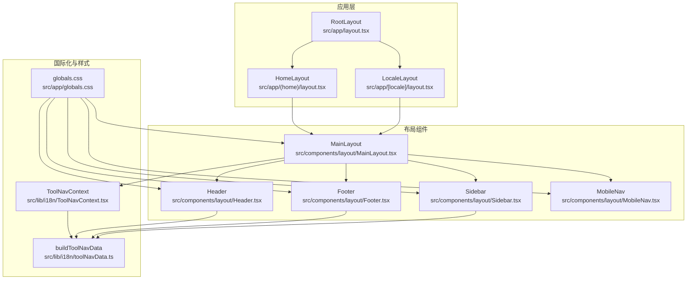
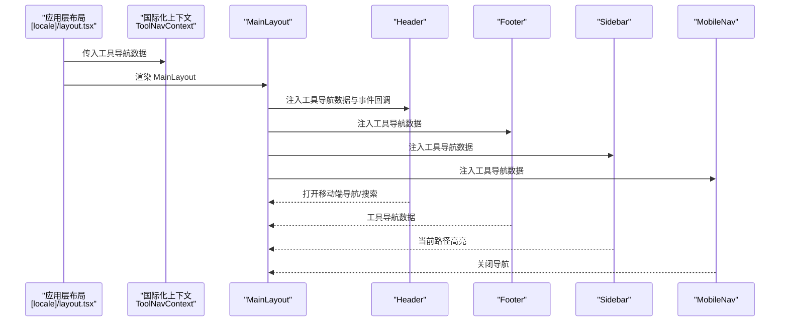
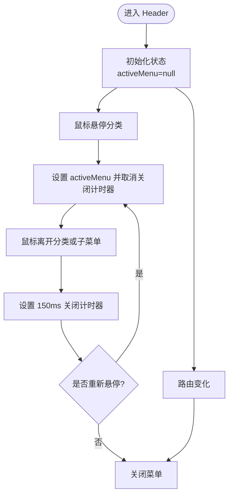
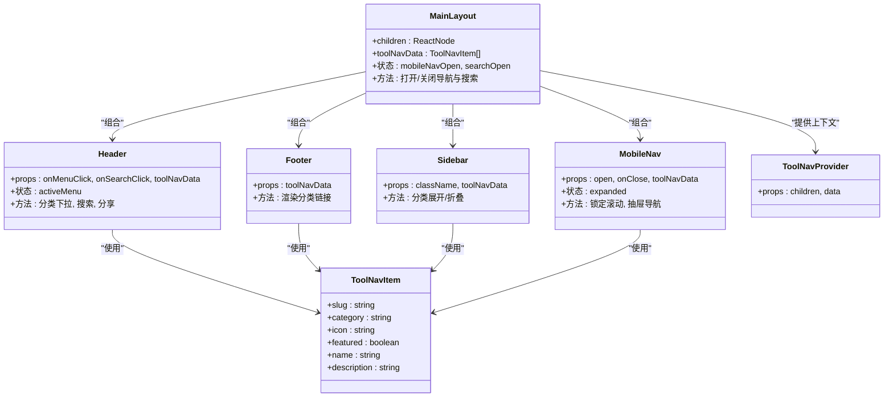

# 布局组件

<cite>
**本文引用的文件**
- [src/components/layout/Header.tsx](file://src/components/layout/Header.tsx)
- [src/components/layout/Footer.tsx](file://src/components/layout/Footer.tsx)
- [src/components/layout/MainLayout.tsx](file://src/components/layout/MainLayout.tsx)
- [src/components/layout/Sidebar.tsx](file://src/components/layout/Sidebar.tsx)
- [src/components/layout/MobileNav.tsx](file://src/components/layout/MobileNav.tsx)
- [src/app/globals.css](file://src/app/globals.css)
- [src/lib/i18n/toolNavData.ts](file://src/lib/i18n/toolNavData.ts)
- [src/lib/i18n/ToolNavContext.tsx](file://src/lib/i18n/ToolNavContext.tsx)
- [src/app/(home)/layout.tsx](file://src/app/(home)/layout.tsx)
- [src/app/[locale]/layout.tsx](file://src/app/[locale]/layout.tsx)
- [src/app/[locale]/tools/[category]/[slug]/page.tsx](file://src/app/[locale]/tools/[category]/[slug]/page.tsx)
- [src/app/[locale]/tools/[category]/page.tsx](file://src/app/[locale]/tools/[category]/page.tsx)
- [src/components/shared/ThemeToggle.tsx](file://src/components/shared/ThemeToggle.tsx)
</cite>

## 目录
1. [简介](#简介)
2. [项目结构](#项目结构)
3. [核心组件](#核心组件)
4. [架构总览](#架构总览)
5. [详细组件分析](#详细组件分析)
6. [依赖关系分析](#依赖关系分析)
7. [性能考量](#性能考量)
8. [故障排查指南](#故障排查指南)
9. [结论](#结论)
10. [附录](#附录)

## 简介
本文件系统性梳理媒体工具箱的布局组件体系，覆盖 Header 头部导航、Footer 底部信息、MainLayout 主布局容器、Sidebar 侧边栏以及 MobileNav 移动端导航的设计与实现。文档从架构设计、职责分工、属性接口与状态管理入手，深入解析响应式布局策略（桌面端与移动端）、样式系统（CSS 变量、Tailwind 类组织与自定义样式）、国际化与主题集成、可访问性与 SEO 考量，并提供使用示例与组合模式，帮助 UI 开发者与后端开发者高效正确地使用布局组件。

## 项目结构
布局组件位于 src/components/layout 下，配合全局样式 src/app/globals.css、国际化工具 src/lib/i18n/* 以及应用层布局文件 src/app/* 实现完整的页面骨架与导航体验。

图表来源
- [src/app/layout.tsx:41-47](file://src/app/layout.tsx#L41-L47)
- [src/app/(home)/layout.tsx](file://src/app/(home)/layout.tsx#L26-L62)
- [src/app/[locale]/layout.tsx](file://src/app/[locale]/layout.tsx#L32-L76)
- [src/components/layout/MainLayout.tsx:16-56](file://src/components/layout/MainLayout.tsx#L16-L56)
- [src/components/layout/Header.tsx:21-116](file://src/components/layout/Header.tsx#L21-L116)
- [src/components/layout/Footer.tsx:44-114](file://src/components/layout/Footer.tsx#L44-L114)
- [src/components/layout/Sidebar.tsx:27-112](file://src/components/layout/Sidebar.tsx#L27-L112)
- [src/components/layout/MobileNav.tsx:20-161](file://src/components/layout/MobileNav.tsx#L20-L161)
- [src/lib/i18n/toolNavData.ts:16-42](file://src/lib/i18n/toolNavData.ts#L16-L42)
- [src/lib/i18n/ToolNavContext.tsx:8-22](file://src/lib/i18n/ToolNavContext.tsx#L8-L22)
- [src/app/globals.css:1-128](file://src/app/globals.css#L1-L128)

章节来源
- [src/app/layout.tsx:1-48](file://src/app/layout.tsx#L1-L48)
- [src/app/(home)/layout.tsx](file://src/app/(home)/layout.tsx#L1-L63)
- [src/app/[locale]/layout.tsx](file://src/app/[locale]/layout.tsx#L1-L77)

## 核心组件
- Header：负责站点品牌、桌面端分类下拉导航、搜索入口、语言切换、主题切换与分享按钮。支持键盘快捷键触发搜索对话框。
- Footer：展示品牌信息、各分类下的工具链接（限制显示数量）、关于与隐私等链接，以及版权信息。
- MainLayout：主布局容器，协调 Header、Footer、MobileNav、SearchDialog 与内容区域，维护移动端导航与搜索对话框的状态，提供全局 Ctrl/Cmd+K 快捷键。
- Sidebar：左侧工具导航，按类别展开/折叠显示具体工具项，高亮当前路径。
- MobileNav：移动端抽屉式导航，支持分类展开/折叠、语言与主题切换，滚动锁定与点击遮罩关闭。

章节来源
- [src/components/layout/Header.tsx:15-116](file://src/components/layout/Header.tsx#L15-L116)
- [src/components/layout/Footer.tsx:13-114](file://src/components/layout/Footer.tsx#L13-L114)
- [src/components/layout/MainLayout.tsx:11-56](file://src/components/layout/MainLayout.tsx#L11-L56)
- [src/components/layout/Sidebar.tsx:22-112](file://src/components/layout/Sidebar.tsx#L22-L112)
- [src/components/layout/MobileNav.tsx:14-161](file://src/components/layout/MobileNav.tsx#L14-L161)

## 架构总览
布局系统采用“应用层布局 + 布局组件 + 国际化上下文”的分层设计。应用层负责语言、主题、消息加载与脚本注入；布局组件负责页面骨架与导航；国际化上下文提供工具导航数据给 Header/Foot/Sidebar/MobileNav 使用；样式系统通过 CSS 变量与 Tailwind 提供一致的主题与视觉风格。

图表来源
- [src/app/[locale]/layout.tsx](file://src/app/[locale]/layout.tsx#L32-L76)
- [src/lib/i18n/ToolNavContext.tsx:8-22](file://src/lib/i18n/ToolNavContext.tsx#L8-L22)
- [src/components/layout/MainLayout.tsx:36-54](file://src/components/layout/MainLayout.tsx#L36-L54)
- [src/components/layout/Header.tsx:21-116](file://src/components/layout/Header.tsx#L21-L116)
- [src/components/layout/Footer.tsx:44-114](file://src/components/layout/Footer.tsx#L44-L114)
- [src/components/layout/Sidebar.tsx:27-112](file://src/components/layout/Sidebar.tsx#L27-L112)
- [src/components/layout/MobileNav.tsx:20-161](file://src/components/layout/MobileNav.tsx#L20-L161)

## 详细组件分析

### Header 组件
- 职责：品牌区、桌面端分类下拉菜单、搜索入口、语言切换、主题切换、分享按钮。
- 属性接口：
  - onMenuClick: 触发移动端导航打开
  - onSearchClick: 触发搜索对话框打开
  - toolNavData: 工具导航数据（用于生成分类下拉）
- 状态管理：内部维护当前激活的分类菜单，利用定时器控制菜单关闭；路由变化时自动关闭菜单。
- 交互细节：分类下拉支持鼠标悬停展开、悬停时延时关闭；支持键盘快捷键触发搜索。
- 国际化：使用 next-intl 的翻译函数渲染站点名称、搜索文案、分类标题等。
- 可访问性：按钮均提供 aria-label；下拉菜单支持键盘操作与无障碍标签。

图表来源
- [src/components/layout/Header.tsx:21-116](file://src/components/layout/Header.tsx#L21-L116)
- [src/components/layout/Header.tsx:41-52](file://src/components/layout/Header.tsx#L41-L52)
- [src/components/layout/Header.tsx:37-48](file://src/components/layout/Header.tsx#L37-L48)

章节来源
- [src/components/layout/Header.tsx:15-116](file://src/components/layout/Header.tsx#L15-L116)

### Footer 组件
- 职责：品牌信息、分类工具链接（每类最多显示固定数量）、关于与隐私链接、版权信息。
- 属性接口：toolNavData（工具导航数据）。
- 响应式：在不同断点下以网格形式排列分类链接，移动端堆叠展示。
- 国际化：使用 categories 与 footer 命名空间进行多语言渲染。

章节来源
- [src/components/layout/Footer.tsx:13-114](file://src/components/layout/Footer.tsx#L13-L114)

### MainLayout 组件
- 职责：主布局容器，协调 Header、Footer、MobileNav、SearchDialog 与内容区域。
- 属性接口：children（页面内容）、toolNavData（工具导航数据）。
- 状态管理：维护 mobileNavOpen 与 searchOpen；提供全局 Ctrl/Cmd+K 快捷键打开/关闭搜索。
- 上下文：通过 ToolNavProvider 将工具导航数据传递给子组件。
- 结构：最小高度占满视口，内容区居中并限定最大宽度。

章节来源
- [src/components/layout/MainLayout.tsx:11-56](file://src/components/layout/MainLayout.tsx#L11-L56)
- [src/lib/i18n/ToolNavContext.tsx:8-22](file://src/lib/i18n/ToolNavContext.tsx#L8-L22)

### Sidebar 组件
- 职责：左侧工具导航，按类别展开/折叠显示具体工具项，高亮当前路径。
- 属性接口：className（自定义样式）、toolNavData（工具导航数据）。
- 逻辑：根据当前路径判断激活状态；支持图标映射（如 Code、Image）。
- 响应式：在桌面端作为固定侧栏存在。

章节来源
- [src/components/layout/Sidebar.tsx:22-112](file://src/components/layout/Sidebar.tsx#L22-L112)

### MobileNav 组件
- 职责：移动端抽屉式导航，支持分类展开/折叠、语言与主题切换。
- 属性接口：open（是否打开）、onClose（关闭回调）、toolNavData（工具导航数据）。
- 行为：打开时锁定页面滚动；点击遮罩或返回按钮关闭；路由变化时自动关闭。
- 交互：分类项支持点击展开/折叠；展开后显示该分类下所有工具条目及“查看全部”链接。

章节来源
- [src/components/layout/MobileNav.tsx:14-161](file://src/components/layout/MobileNav.tsx#L14-L161)

### 样式系统与主题
- CSS 变量：通过 :root 定义浅色与深色主题变量，支持暗色类选择器与 prefers-reduced-motion 动画降级。
- Tailwind 集成：使用 @theme inline 将 CSS 变量映射到 Tailwind 设计令牌，统一颜色、字体与阴影。
- 自定义动画：提供淡入、缩放淡入、脉冲发光等动画类，用于下拉菜单与交互反馈。
- 渐变边框与背景：通过伪元素与 mask 技术实现渐变边框与文本渐变效果。
- 响应式：基于断点控制导航布局与网格排列。

章节来源
- [src/app/globals.css:21-128](file://src/app/globals.css#L21-L128)

### 国际化与主题集成
- 工具导航数据构建：buildToolNavData 在服务端聚合工具名称与描述，按当前语言与英文回退生成预翻译数据，避免 RSC 负载过大。
- 国际化上下文：ToolNavContext 提供工具导航数据给客户端组件使用。
- 主题切换：ThemeToggle 支持 light/dark/system 三态切换，并记录事件埋点。
- 应用层集成：LocaleLayout/HomeLayout 加载语言消息与工具导航数据，包裹 MainLayout。

章节来源
- [src/lib/i18n/toolNavData.ts:16-42](file://src/lib/i18n/toolNavData.ts#L16-L42)
- [src/lib/i18n/ToolNavContext.tsx:8-22](file://src/lib/i18n/ToolNavContext.tsx#L8-L22)
- [src/app/[locale]/layout.tsx](file://src/app/[locale]/layout.tsx#L32-L76)
- [src/app/(home)/layout.tsx](file://src/app/(home)/layout.tsx#L26-L62)
- [src/components/shared/ThemeToggle.tsx:9-35](file://src/components/shared/ThemeToggle.tsx#L9-L35)

### 响应式布局实现
- 桌面端：Header 使用桌面导航栏与下拉菜单；Sidebar 固定在左侧；内容区居中。
- 移动端：Header 显示菜单按钮；点击打开 MobileNav 抽屉；Footer 与内容区保持响应式网格。
- 断点策略：lg（桌面）、md（平板）、sm（小屏）等断点控制布局与网格列数。

章节来源
- [src/components/layout/Header.tsx:76-89](file://src/components/layout/Header.tsx#L76-L89)
- [src/components/layout/MobileNav.tsx:65-158](file://src/components/layout/MobileNav.tsx#L65-L158)
- [src/components/layout/Footer.tsx:78-83](file://src/components/layout/Footer.tsx#L78-L83)

### 使用示例与组合模式
- 全局布局：在根布局与本地化布局中，分别调用 buildToolNavData 与 loadCommonMessages，然后将工具导航数据传入 MainLayout。
- 工具页与分类页：工具页与分类页各自生成元数据与 JSON-LD，但不直接使用布局组件，而是由上层布局统一承载 Header/Footer/Sidebar/MobileNav。
- 组合模式：MainLayout 作为容器，将 Header、Footer、Sidebar、MobileNav 与内容区组合；Header 与 Footer 通过工具导航数据动态渲染。

章节来源
- [src/app/[locale]/layout.tsx](file://src/app/[locale]/layout.tsx#L46-L57)
- [src/app/(home)/layout.tsx](file://src/app/(home)/layout.tsx#L32-L43)
- [src/app/[locale]/tools/[category]/[slug]/page.tsx](file://src/app/[locale]/tools/[category]/[slug]/page.tsx#L78-L107)
- [src/app/[locale]/tools/[category]/page.tsx](file://src/app/[locale]/tools/[category]/page.tsx#L53-L63)

### 可访问性与 SEO 考虑
- 可访问性：按钮提供 aria-label；下拉菜单支持键盘操作；减少动画偏好下禁用关键动画。
- SEO：根布局与本地化布局设置基础元数据与 OpenGraph/Twitter 图片；工具页与分类页生成页面特定元数据与面包屑 JSON-LD。

章节来源
- [src/app/layout.tsx:10-39](file://src/app/layout.tsx#L10-L39)
- [src/app/[locale]/tools/[category]/[slug]/page.tsx](file://src/app/[locale]/tools/[category]/[slug]/page.tsx#L24-L31)
- [src/app/[locale]/tools/[category]/page.tsx](file://src/app/[locale]/tools/[category]/page.tsx#L24-L31)
- [src/app/globals.css:122-127](file://src/app/globals.css#L122-L127)

## 依赖关系分析

图表来源
- [src/components/layout/MainLayout.tsx:16-56](file://src/components/layout/MainLayout.tsx#L16-L56)
- [src/components/layout/Header.tsx:21-116](file://src/components/layout/Header.tsx#L21-L116)
- [src/components/layout/Footer.tsx:44-114](file://src/components/layout/Footer.tsx#L44-L114)
- [src/components/layout/Sidebar.tsx:27-112](file://src/components/layout/Sidebar.tsx#L27-L112)
- [src/components/layout/MobileNav.tsx:20-161](file://src/components/layout/MobileNav.tsx#L20-L161)
- [src/lib/i18n/ToolNavContext.tsx:8-22](file://src/lib/i18n/ToolNavContext.tsx#L8-L22)
- [src/lib/i18n/toolNavData.ts:1-10](file://src/lib/i18n/toolNavData.ts#L1-L10)

章节来源
- [src/components/layout/MainLayout.tsx:16-56](file://src/components/layout/MainLayout.tsx#L16-L56)
- [src/lib/i18n/toolNavData.ts:16-42](file://src/lib/i18n/toolNavData.ts#L16-L42)

## 性能考量
- 工具导航数据预构建：在服务端构建工具导航数据，避免在客户端序列化大量翻译数据，降低 RSC 负载。
- 动画降级：尊重用户减少动画偏好，禁用关键动画提升可访问性与性能。
- 懒加载与预取：工具页对 FFmpeg 资源进行预取，提升视频/音频处理首帧性能。
- 状态收敛：MainLayout 统一管理移动端导航与搜索状态，避免重复监听与内存泄漏。

章节来源
- [src/lib/i18n/toolNavData.ts:16-42](file://src/lib/i18n/toolNavData.ts#L16-L42)
- [src/app/globals.css:122-127](file://src/app/globals.css#L122-L127)
- [src/app/[locale]/tools/[category]/[slug]/page.tsx](file://src/app/[locale]/tools/[category]/[slug]/page.tsx#L94-L99)
- [src/components/layout/MainLayout.tsx:24-33](file://src/components/layout/MainLayout.tsx#L24-L33)

## 故障排查指南
- 下拉菜单无法关闭：检查 Header 中的定时器逻辑与路由变化副作用，确认 pathname 变更是否触发关闭。
- 移动端抽屉无法关闭：检查 MobileNav 的路由监听与 body 滚动锁定逻辑，确认点击遮罩与返回按钮事件绑定。
- 工具导航为空：确认 ToolNavProvider 是否正确传入 toolNavData，以及 buildToolNavData 是否在服务端成功执行。
- 主题切换无效：检查 ThemeProvider 配置与 ThemeToggle 的状态流转，确认 next-themes 正常工作。
- 搜索快捷键无响应：确认 MainLayout 的全局键盘事件监听是否注册，且未被其他元素阻止默认行为。

章节来源
- [src/components/layout/Header.tsx:37-48](file://src/components/layout/Header.tsx#L37-L48)
- [src/components/layout/MobileNav.tsx:37-52](file://src/components/layout/MobileNav.tsx#L37-L52)
- [src/lib/i18n/ToolNavContext.tsx:8-22](file://src/lib/i18n/ToolNavContext.tsx#L8-L22)
- [src/components/shared/ThemeToggle.tsx:9-35](file://src/components/shared/ThemeToggle.tsx#L9-L35)
- [src/components/layout/MainLayout.tsx:24-33](file://src/components/layout/MainLayout.tsx#L24-L33)

## 结论
媒体工具箱的布局组件以 MainLayout 为核心容器，结合 Header、Footer、Sidebar、MobileNav 形成完整的页面骨架。通过 ToolNavContext 与 buildToolNavData 实现国际化与导航数据的高效传递；借助 CSS 变量与 Tailwind 实现主题一致性与响应式布局；配合全局快捷键、无障碍标签与 SEO 元数据，提供良好的用户体验与可维护性。开发者可在不同页面中复用该布局体系，按需组合使用各组件，确保一致的导航与视觉体验。

## 附录
- 代码片段路径示例（不展示具体代码内容）：
  - [Header 组件定义:21-116](file://src/components/layout/Header.tsx#L21-L116)
  - [Footer 组件定义:44-114](file://src/components/layout/Footer.tsx#L44-L114)
  - [MainLayout 组件定义:16-56](file://src/components/layout/MainLayout.tsx#L16-L56)
  - [Sidebar 组件定义:27-112](file://src/components/layout/Sidebar.tsx#L27-L112)
  - [MobileNav 组件定义:20-161](file://src/components/layout/MobileNav.tsx#L20-L161)
  - [工具导航数据构建:16-42](file://src/lib/i18n/toolNavData.ts#L16-L42)
  - [国际化上下文提供者:8-22](file://src/lib/i18n/ToolNavContext.tsx#L8-L22)
  - [全局样式与 CSS 变量:21-128](file://src/app/globals.css#L21-L128)
  - [应用层布局（本地化）:32-76](file://src/app/[locale]/layout.tsx#L32-L76)
  - [应用层布局（首页）](file://src/app/(home)/layout.tsx#L26-L62)
  - [工具页元数据与 JSON-LD:24-93](file://src/app/[locale]/tools/[category]/[slug]/page.tsx#L24-L93)
  - [分类页元数据与面包屑:24-51](file://src/app/[locale]/tools/[category]/page.tsx#L24-L51)
  - [主题切换组件:9-35](file://src/components/shared/ThemeToggle.tsx#L9-L35)