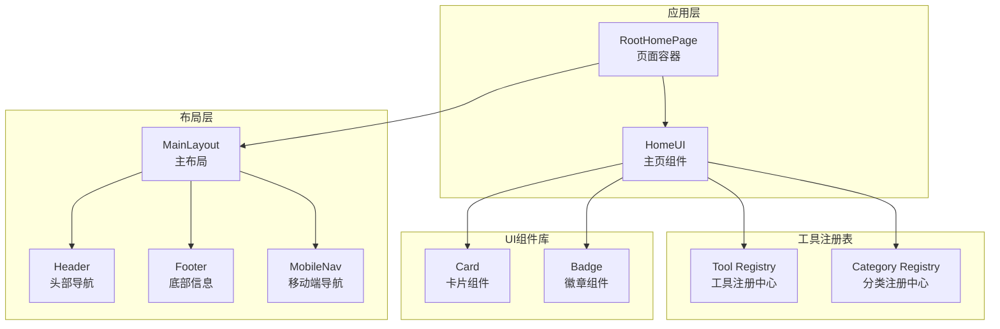
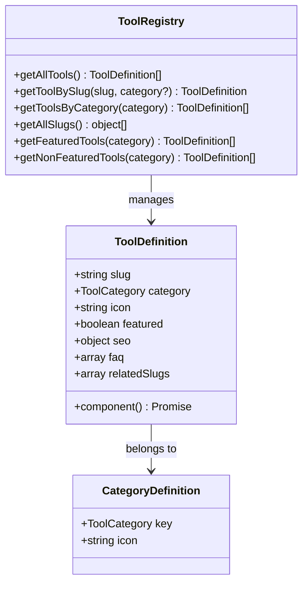
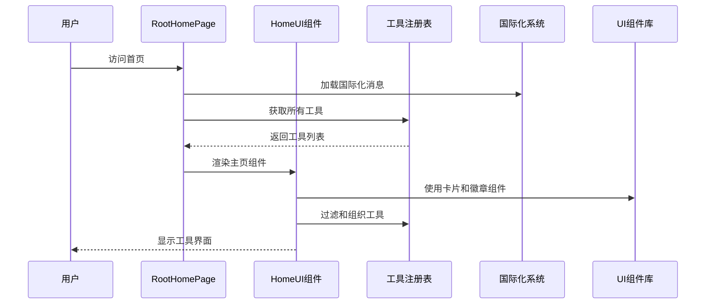
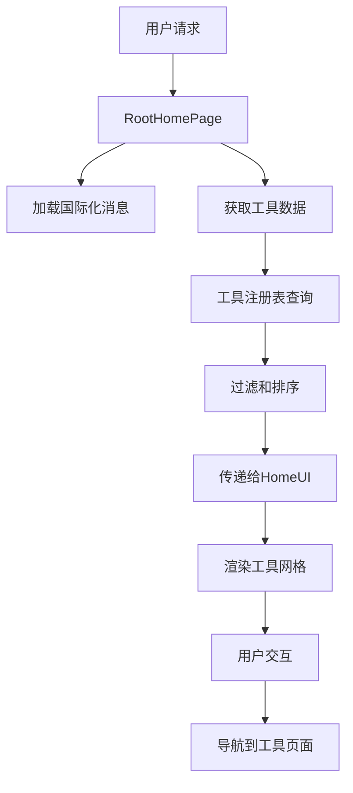
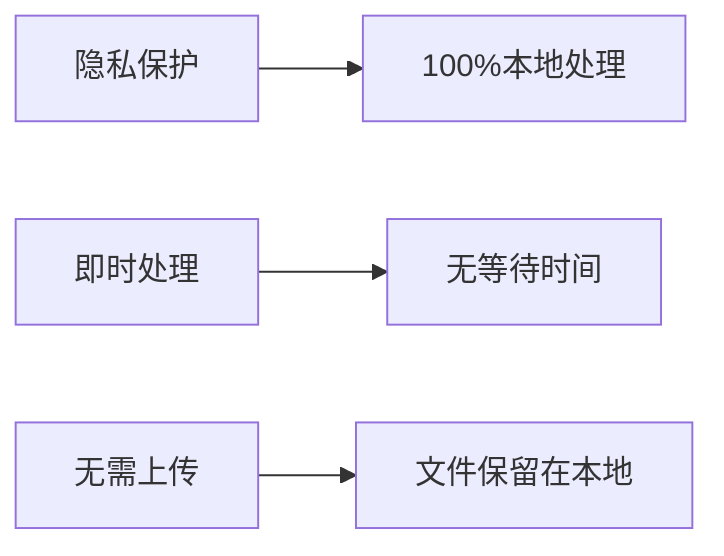
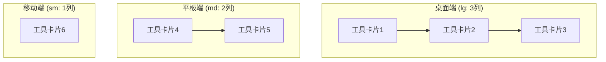
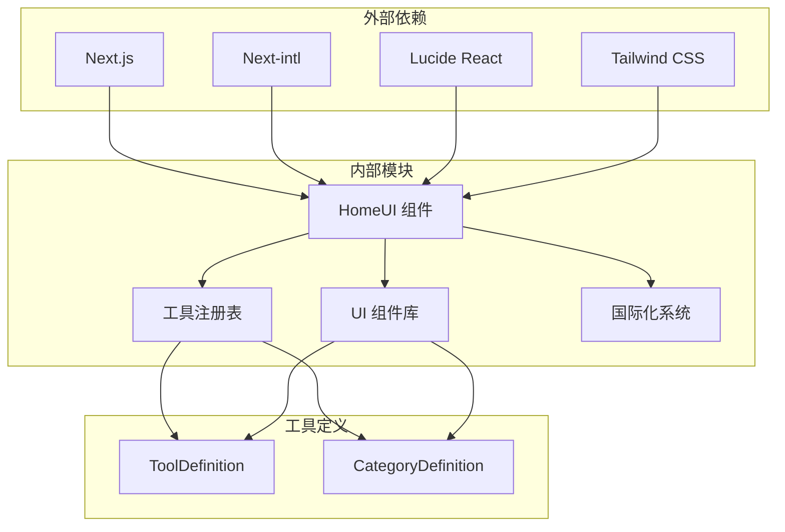

# 首页组件

<cite>
**本文档引用的文件**
- [HomeUI.tsx](file://src/components/home/HomeUI.tsx)
- [page.tsx](file://src/app/(home)/page.tsx)
- [layout.tsx](file://src/app/(home)/layout.tsx)
- [index.ts](file://src/lib/registry/index.ts)
- [types.ts](file://src/lib/registry/types.ts)
- [categories.ts](file://src/lib/registry/categories.ts)
- [Card.tsx](file://src/components/ui/Card.tsx)
- [Badge.tsx](file://src/components/ui/Badge.tsx)
- [globals.css](file://src/app/globals.css)
- [MainLayout.tsx](file://src/components/layout/MainLayout.tsx)
- [common.json](file://messages/en/common.json)
- [tools-image.json](file://messages/en/tools-image.json)
- [tools-pdf.json](file://messages/en/tools-pdf.json)
- [tools-audio.json](file://messages/en/tools-audio.json)
</cite>

## 目录
1. [简介](#简介)
2. [项目结构](#项目结构)
3. [核心组件](#核心组件)
4. [架构概览](#架构概览)
5. [详细组件分析](#详细组件分析)
6. [依赖关系分析](#依赖关系分析)
7. [性能考虑](#性能考虑)
8. [故障排除指南](#故障排除指南)
9. [结论](#结论)
10. [附录](#附录)

## 简介

媒体工具箱的首页组件是一个精心设计的用户界面，旨在为用户提供直观、高效的工具访问体验。该组件采用现代化的设计理念，结合隐私优先的处理模式，为用户提供了完整的媒体处理工具集合。

首页组件的核心目标是：
- 提供清晰的工具分类和快速访问入口
- 展示平台的核心价值主张（隐私、即时处理、无需上传）
- 通过响应式设计确保跨设备兼容性
- 优化用户体验和页面性能

## 项目结构

首页组件位于应用的根路由下，采用模块化设计，与其他组件形成清晰的层次结构：



**图表来源**
- [page.tsx:51-75](file://src/app/(home)/page.tsx#L51-L75)
- [layout.tsx:26-62](file://src/app/(home)/layout.tsx#L26-L62)
- [HomeUI.tsx:19-140](file://src/components/home/HomeUI.tsx#L19-L140)

**章节来源**
- [page.tsx:1-76](file://src/app/(home)/page.tsx#L1-L76)
- [layout.tsx:1-63](file://src/app/(home)/layout.tsx#L1-L63)

## 核心组件

### HomeUI 主页组件

HomeUI 是首页的核心组件，负责渲染整个主页界面。该组件采用了分层设计模式，将不同的功能区域进行逻辑分离：

#### 主要功能区域

1. **英雄区域（Hero Section）**
   - 标题和副标题展示
   - 核心功能特性展示
   - 隐私保护承诺

2. **工具牌组（Tool Decks）**
   - 媒体工具牌组
   - PDF 工具牌组  
   - 开发者工具牌组

3. **元工具牌组（Meta Deck）**
   - 特殊隐私和安全工具
   - 快速访问入口

4. **所有分类（All Categories）**
   - 完整的工具分类展示
   - 分类统计信息

#### 设计特点

- **渐进式加载**：工具卡片采用淡入动画效果
- **响应式网格**：自适应不同屏幕尺寸的网格布局
- **视觉层次**：通过卡片边框和阴影营造深度感
- **品牌一致性**：统一的颜色方案和字体系统

**章节来源**
- [HomeUI.tsx:19-140](file://src/components/home/HomeUI.tsx#L19-L140)

### 工具注册表系统

工具注册表系统是首页组件的重要支撑，负责管理和组织所有可用的工具：

#### 工具定义结构



**图表来源**
- [types.ts:5-21](file://src/lib/registry/types.ts#L5-L21)
- [index.ts:135-164](file://src/lib/registry/index.ts#L135-L164)

**章节来源**
- [index.ts:1-164](file://src/lib/registry/index.ts#L1-164)
- [types.ts:1-22](file://src/lib/registry/types.ts#L1-L22)

## 架构概览

首页组件采用分层架构设计，确保了良好的可维护性和扩展性：



**图表来源**
- [page.tsx:51-75](file://src/app/(home)/page.tsx#L51-L75)
- [HomeUI.tsx:19-140](file://src/components/home/HomeUI.tsx#L19-L140)
- [index.ts:135-137](file://src/lib/registry/index.ts#L135-L137)

### 数据流架构



**图表来源**
- [page.tsx:51-75](file://src/app/(home)/page.tsx#L51-L75)
- [HomeUI.tsx:48-82](file://src/components/home/HomeUI.tsx#L48-L82)

## 详细组件分析

### Hero 英雄区域

Hero 区域是首页最重要的视觉焦点，采用渐变背景和点阵图案营造现代感：

#### 视觉设计元素

- **渐变背景**：从主色调到透明度的渐变效果
- **点阵图案**：半透明的点阵背景纹理
- **文本渐变**：主标题采用渐变色彩效果
- **特征徽章**：三个核心功能的可视化展示

#### 功能特性展示



**章节来源**
- [HomeUI.tsx:25-45](file://src/components/home/HomeUI.tsx#L25-L45)

### 工具牌组系统

工具牌组系统是首页的核心功能模块，采用分组展示的方式组织工具：

#### 牌组配置

| 牌组名称 | 包含类别 | 工具数量 | 设计特点 |
|---------|---------|---------|----------|
| Media Deck | image, video, audio | 20+ 工具 | 媒体处理工具精选 |
| PDF Deck | pdf | 15+ 工具 | 文档处理工具集合 |
| Dev Deck | developer | 20+ 工具 | 开发者工具合集 |

#### 响应式网格布局



**图表来源**
- [HomeUI.tsx:55-79](file://src/components/home/HomeUI.tsx#L55-L79)

**章节来源**
- [HomeUI.tsx:48-82](file://src/components/home/HomeUI.tsx#L48-L82)

### 元工具牌组

元工具牌组专注于隐私和安全相关的工具，采用固定工具列表的方式：

#### 固定工具列表

- **remove-exif**：EXIF 数据移除工具
- **hash-generator**：哈希生成器
- **archive**：压缩包提取工具

这些工具代表了平台的核心隐私保护功能。

**章节来源**
- [HomeUI.tsx:84-114](file://src/components/home/HomeUI.tsx#L84-L114)

### 所有分类展示

所有分类展示区域提供了完整的工具分类浏览体验：

#### 分类统计功能

每个分类卡片显示：
- 分类名称和描述
- 工具数量统计
- 导航链接到完整分类页面

**章节来源**
- [HomeUI.tsx:116-137](file://src/components/home/HomeUI.tsx#L116-L137)

### UI 组件系统

首页组件大量使用了自定义 UI 组件，确保设计的一致性和可维护性：

#### Card 卡片组件

Card 组件提供了统一的视觉风格和交互行为：

- **边框渐变**：悬停时显示渐变边框效果
- **阴影系统**：基于 CSS 变量的主题化阴影
- **过渡动画**：平滑的悬停和状态变化
- **可扩展性**：支持多种变体和自定义类名

#### Badge 徽章组件

Badge 组件用于显示分类标签和状态信息：

- **多变体支持**：默认、次要、轮廓三种样式
- **颜色系统**：基于主题的动态颜色分配
- **圆角设计**：符合现代 UI 设计规范

**章节来源**
- [Card.tsx:1-33](file://src/components/ui/Card.tsx#L1-L33)
- [Badge.tsx:1-28](file://src/components/ui/Badge.tsx#L1-L28)

## 依赖关系分析

首页组件的依赖关系体现了清晰的分层架构：



**图表来源**
- [HomeUI.tsx:3-9](file://src/components/home/HomeUI.tsx#L3-L9)
- [index.ts:1-65](file://src/lib/registry/index.ts#L1-L65)

### 模块耦合度分析

- **低耦合高内聚**：各模块职责明确，相互依赖最小化
- **单向依赖**：数据流向清晰，避免循环依赖
- **接口稳定**：通过类型定义确保模块间契约稳定

**章节来源**
- [index.ts:135-164](file://src/lib/registry/index.ts#L135-L164)

## 性能考虑

首页组件在设计时充分考虑了性能优化：

### 首屏渲染优化

1. **代码分割**：HomeUI 组件标记为客户端组件
2. **按需加载**：工具组件通过动态导入延迟加载
3. **CSS 优化**：使用 CSS 变量减少样式计算开销

### 图片和资源优化

1. **渐进式加载**：工具卡片采用淡入动画
2. **响应式设计**：自适应不同屏幕密度
3. **缓存策略**：利用浏览器缓存机制

### 内存管理

1. **虚拟滚动**：对于大量工具时考虑虚拟化
2. **事件委托**：减少事件监听器数量
3. **垃圾回收**：及时清理不需要的 DOM 节点

**章节来源**
- [HomeUI.tsx:61-64](file://src/components/home/HomeUI.tsx#L61-L64)
- [globals.css:70-87](file://src/app/globals.css#L70-L87)

## 故障排除指南

### 常见问题及解决方案

#### 工具加载失败

**症状**：工具卡片显示为空或加载错误
**原因**：工具组件动态导入失败
**解决方案**：
1. 检查工具路径是否正确
2. 验证工具组件导出格式
3. 确认构建配置正确

#### 国际化消息缺失

**症状**：界面显示键名而非实际文本
**原因**：国际化消息未正确加载
**解决方案**：
1. 验证消息文件路径
2. 检查命名空间配置
3. 确认语言切换逻辑

#### 响应式布局异常

**症状**：移动端显示错乱
**原因**：CSS 媒体查询配置错误
**解决方案**：
1. 检查断点设置
2. 验证容器宽度配置
3. 测试不同设备尺寸

**章节来源**
- [page.tsx:51-75](file://src/app/(home)/page.tsx#L51-L75)
- [HomeUI.tsx:19-140](file://src/components/home/HomeUI.tsx#L19-L140)

## 结论

媒体工具箱的首页组件展现了现代前端开发的最佳实践：

### 设计优势

1. **清晰的信息架构**：通过分层设计将复杂信息简化
2. **优秀的用户体验**：响应式设计确保跨设备一致体验
3. **高性能实现**：优化的渲染策略和资源管理
4. **可扩展性**：模块化设计便于功能扩展

### 技术亮点

- **类型安全**：完整的 TypeScript 类型定义
- **国际化支持**：多语言环境下的灵活适配
- **主题系统**：基于 CSS 变量的主题切换
- **SEO 优化**：结构化的元数据和内容组织

该组件为媒体工具箱提供了坚实的基础，不仅满足了当前的功能需求，也为未来的功能扩展奠定了良好的技术基础。

## 附录

### 使用示例

#### 自定义工具牌组

```typescript
// 添加新的工具牌组
const customDecks = [
  { 
    titleKey: "customDeck" as const, 
    categories: ["image", "pdf"] as const 
  }
];
```

#### 修改工具显示顺序

通过调整工具注册表中的工具顺序来改变显示优先级。

#### 定制样式主题

```css
/* 自定义主色调 */
:root {
  --primary: #your-custom-color;
}
```

### 最佳实践建议

1. **保持组件单一职责**：每个组件专注于特定功能
2. **使用类型安全**：充分利用 TypeScript 的类型检查
3. **关注性能指标**：定期监控 LCP、FID、CLS 等指标
4. **测试多设备兼容性**：确保在各种设备上的表现一致
5. **持续优化用户体验**：基于用户反馈不断改进界面设计