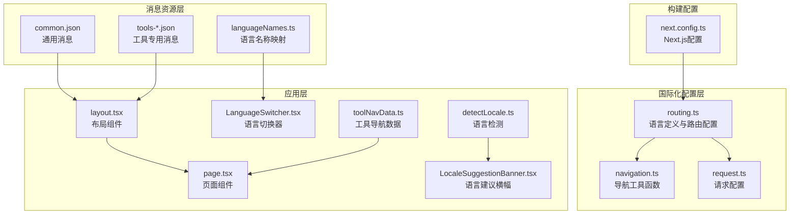
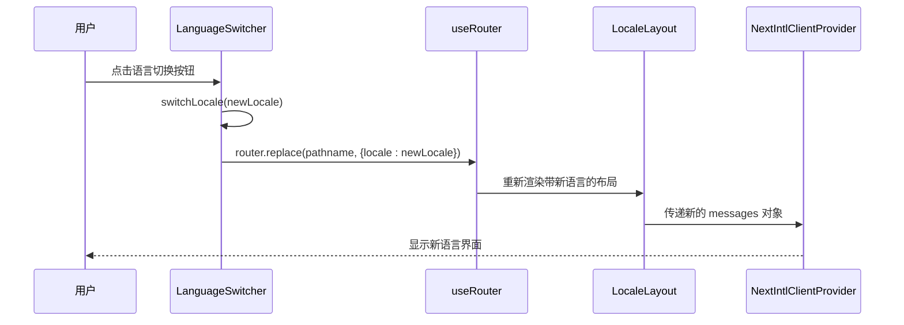
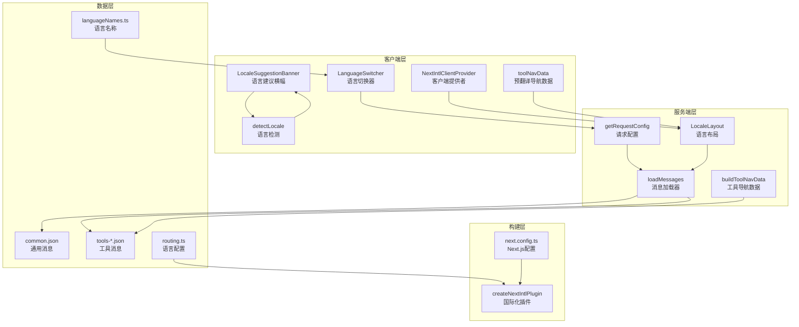
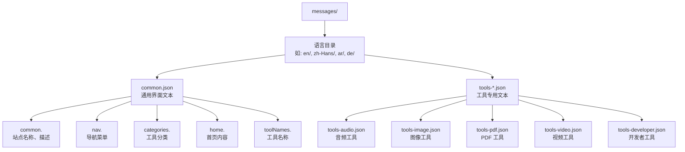
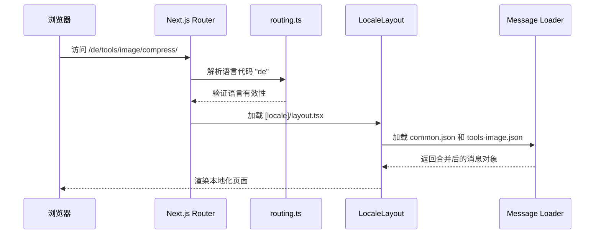
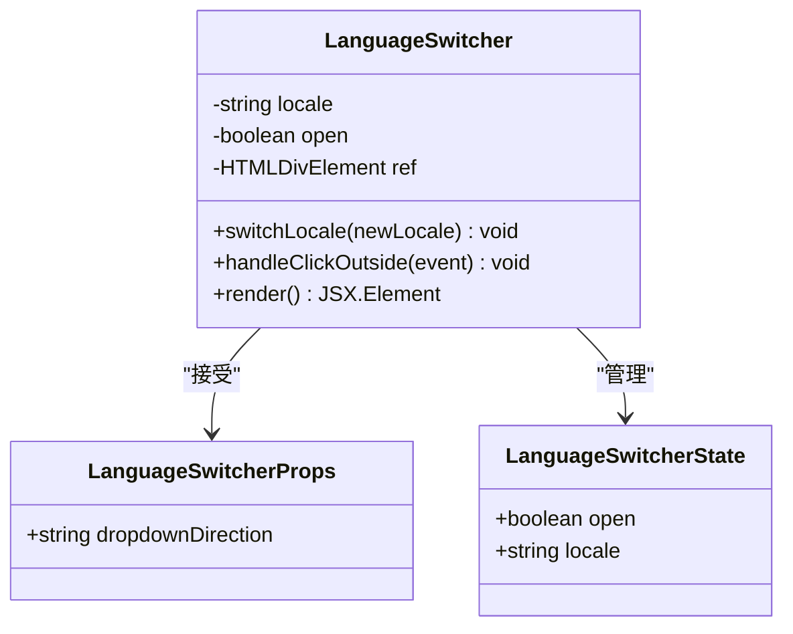
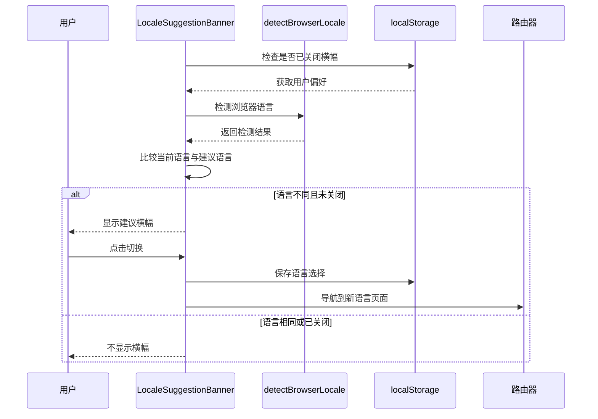
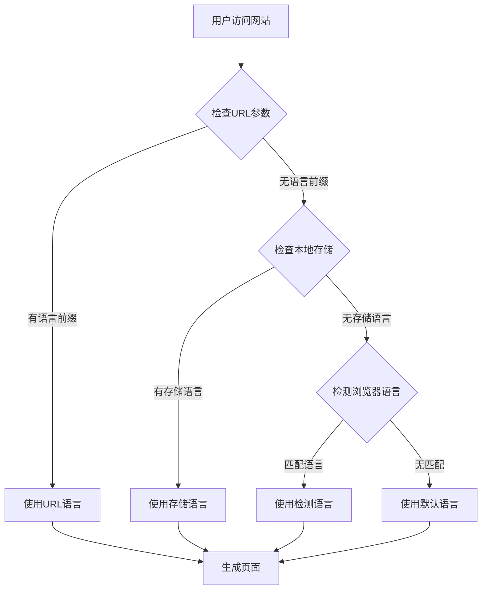
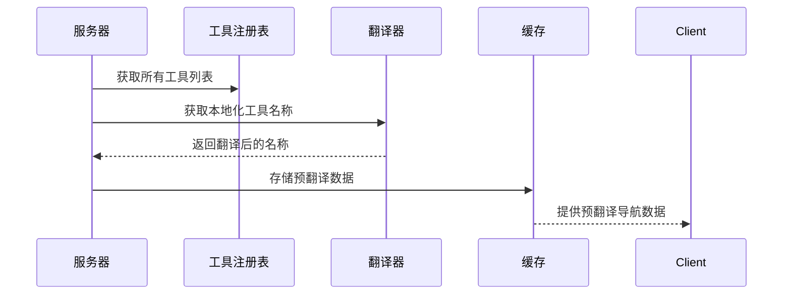
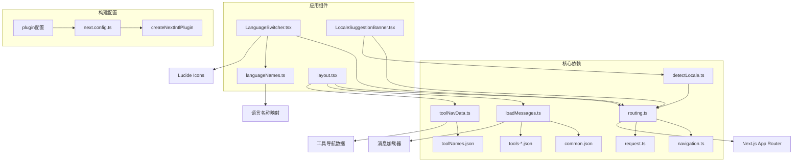

# 国际化实现

<cite>
**本文档引用的文件**
- [routing.ts](file://src/i18n/routing.ts)
- [navigation.ts](file://src/i18n/navigation.ts)
- [request.ts](file://src/i18n/request.ts)
- [next.config.ts](file://next.config.ts)
- [LanguageSwitcher.tsx](file://src/components/shared/LanguageSwitcher.tsx)
- [languageNames.ts](file://src/lib/i18n/languageNames.ts)
- [loadMessages.ts](file://src/lib/i18n/loadMessages.ts)
- [toolNavData.ts](file://src/lib/i18n/toolNavData.ts)
- [detectLocale.ts](file://src/lib/i18n/detectLocale.ts)
- [layout.tsx](file://src/app/[locale]/layout.tsx)
- [layout.tsx](file://src/app/layout.tsx)
- [page.tsx](file://src/app/[locale]/page.tsx)
- [page.tsx](file://src/app/[locale]/tools/[category]/[slug]/page.tsx)
- [LocaleSuggestionBanner.tsx](file://src/components/shared/LocaleSuggestionBanner.tsx)
- [common.json](file://messages/en/common.json)
- [common.json](file://messages/de/common.json)
- [tools-image.json](file://messages/de/tools-image.json)
- [tools-video.json](file://messages/de/tools-video.json)
</cite>

## 更新摘要
**所做更改**
- 更新语言支持列表，包含新增的德语支持
- 完善国际化架构说明，强调SEO优化和文化适配
- 增强RTL语言支持的实现细节
- 补充语言检测机制的多层策略
- 优化翻译资源管理的性能考虑

## 目录
1. [简介](#简介)
2. [项目结构](#项目结构)
3. [核心组件](#核心组件)
4. [架构概览](#架构概览)
5. [详细组件分析](#详细组件分析)
6. [国际化架构优化](#国际化架构优化)
7. [SEO优化与文化适配](#seo优化与文化适配)
8. [依赖关系分析](#依赖关系分析)
9. [性能考虑](#性能考虑)
10. [故障排除指南](#故障排除指南)
11. [结论](#结论)

## 简介

PrivaDeck 媒体工具箱采用 next-intl 框架实现了完整的国际化系统，现已支持 22 种语言和地区变体，包括新增的德语支持。该系统通过动态语言切换、路由国际化、RTL 语言支持和智能语言建议等功能，为全球用户提供本地化的媒体处理体验。

**更新** 完善了国际化架构，特别注重SEO优化和文化适配，确保多语言内容在搜索引擎和用户体验方面的最佳表现。

## 项目结构

国际化系统的文件组织遵循模块化设计原则，主要分为以下几个层次：



**图表来源**
- [routing.ts:1-18](file://src/i18n/routing.ts#L1-L18)
- [navigation.ts:1-6](file://src/i18n/navigation.ts#L1-L6)
- [request.ts:1-20](file://src/i18n/request.ts#L1-L20)
- [next.config.ts:1-13](file://next.config.ts#L1-L13)

**章节来源**
- [routing.ts:1-18](file://src/i18n/routing.ts#L1-L18)
- [next.config.ts:1-13](file://next.config.ts#L1-L13)

## 核心组件

### 语言路由配置

系统的核心是 `routing.ts` 文件，它定义了所有支持的语言列表和默认行为：

```mermaid
classDiagram
class RoutingConfig {
+Locale[] locales
+Locale defaultLocale
+Locale[] rtlLocales
+defineRouting() Routing
}
class Locale {
<<enumeration>>
"en"
"zh-Hans"
"zh-Hant"
"ja"
"ko"
"es"
"fr"
"de"
"pt-BR"
"pt-PT"
"th"
"vi"
"id"
"hi"
"ar"
"it"
"nl"
"pl"
"ru"
"tr"
"uk"
}
class RTL_Locales {
+Locale[] ar
}
RoutingConfig --> Locale : "包含"
RoutingConfig --> RTL_Locales : "包含"
```

**图表来源**
- [routing.ts:3-12](file://src/i18n/routing.ts#L3-L12)

系统现已支持以下语言变体：
- **中文系列**: zh-Hans（简体中文）、zh-Hant（繁体中文）
- **葡萄牙语系列**: pt-BR（巴西葡萄牙语）、pt-PT（欧洲葡萄牙语）
- **阿拉伯语**: ar（阿拉伯语，支持 RTL）
- **其他主要语言**: en、ja、ko、es、fr、de、it、nl、pl、ru、tr、uk、th、vi、id、hi

**章节来源**
- [routing.ts:3-12](file://src/i18n/routing.ts#L3-L12)

### 导航工具函数

`navigation.ts` 文件提供了基于 next-intl 的导航增强功能：



**图表来源**
- [LanguageSwitcher.tsx:33-38](file://src/components/shared/LanguageSwitcher.tsx#L33-L38)
- [navigation.ts:4-5](file://src/i18n/navigation.ts#L4-L5)

**章节来源**
- [navigation.ts:1-6](file://src/i18n/navigation.ts#L1-L6)
- [LanguageSwitcher.tsx:1-74](file://src/components/shared/LanguageSwitcher.tsx#L1-L74)

## 架构概览

PrivaDeck 的国际化系统采用分层架构设计，确保高效的消息加载和语言切换：



**图表来源**
- [request.ts:6-19](file://src/i18n/request.ts#L6-L19)
- [layout.tsx:32-76](file://src/app/[locale]/layout.tsx#L32-L76)
- [loadMessages.ts:32-55](file://src/lib/i18n/loadMessages.ts#L32-L55)
- [toolNavData.ts:16-42](file://src/lib/i18n/toolNavData.ts#L16-L42)

系统的核心优势包括：

1. **动态消息加载**: 使用 `loadAllToolMessages` 和 `loadCategoryMessages` 实现按需加载
2. **服务端预渲染**: 在服务端生成静态参数和预翻译内容
3. **智能缓存策略**: 结合本地存储和浏览器检测优化用户体验
4. **RTL 支持**: 自动检测和应用从右到左的语言显示
5. **SEO优化**: 通过语言前缀路由和元数据优化搜索引擎可见性

**章节来源**
- [request.ts:1-20](file://src/i18n/request.ts#L1-L20)
- [layout.tsx:1-77](file://src/app/[locale]/layout.tsx#L1-L77)

## 详细组件分析

### 翻译资源管理系统

#### 消息文件组织结构

翻译资源采用模块化组织，每个语言都有独立的目录结构：



**图表来源**
- [common.json:1-508](file://messages/en/common.json#L1-L508)

#### 命名约定和结构规范

系统遵循严格的命名约定以确保一致性和可维护性：

1. **通用消息命名空间**: `common.*` - 站点级别的通用文本
2. **导航消息命名空间**: `nav.*` - 导航菜单项
3. **分类消息命名空间**: `categories.*` - 工具分类描述
4. **工具名称命名空间**: `toolNames.*` - 具体工具的名称和描述
5. **工具特定消息**: `tools.{category}.{slug}.*` - 单个工具的详细内容

**章节来源**
- [common.json:1-508](file://messages/en/common.json#L1-L508)

### 路由国际化实现

#### 语言前缀路由

系统使用语言代码作为路径前缀，实现真正的多语言路由：



**图表来源**
- [routing.ts:14-17](file://src/i18n/routing.ts#L14-L17)
- [layout.tsx:28-30](file://src/app/[locale]/layout.tsx#L28-L30)

#### 语言检测机制

系统实现了多层次的语言检测机制：

1. **URL 优先**: 首先检查 URL 中的语言前缀
2. **浏览器语言**: 如果 URL 中没有指定，检测浏览器首选语言
3. **用户偏好**: 检查本地存储中的用户选择
4. **默认回退**: 最终回退到默认语言

**章节来源**
- [request.ts:6-10](file://src/i18n/request.ts#L6-L10)
- [LocaleSuggestionBanner.tsx:15-26](file://src/components/shared/LocaleSuggestionBanner.tsx#L15-L26)

### RTL 语言支持

#### 文本方向处理

系统为阿拉伯语等 RTL 语言提供完整的文本方向支持：

```mermaid
flowchart TD
A[检测当前语言] --> B{是否为 RTL 语言?}
B --> |是| C[设置 dir="rtl"]
B --> |否| D[设置 dir="ltr"]
C --> E[应用 RTL 样式]
D --> F[应用 LTR 样式]
E --> G[调整布局方向]
F --> G
G --> H[更新文本对齐]
```

**图表来源**
- [layout.tsx:52](file://src/app/[locale]/layout.tsx#L52)
- [routing.ts:12](file://src/i18n/routing.ts#L12)

系统自动将阿拉伯语标记为 RTL 语言，并在 HTML 根元素上设置相应的 `dir` 属性。

**章节来源**
- [routing.ts:12](file://src/i18n/routing.ts#L12)
- [layout.tsx:52](file://src/app/[locale]/layout.tsx#L52)

### 动态语言切换机制

#### 语言切换器组件

`LanguageSwitcher` 组件提供了直观的用户界面来切换语言：



**图表来源**
- [LanguageSwitcher.tsx:11-13](file://src/components/shared/LanguageSwitcher.tsx#L11-L13)

#### 切换流程

语言切换过程包括以下步骤：

1. **用户交互**: 点击语言切换按钮
2. **状态更新**: 打开下拉菜单显示可用语言
3. **选择处理**: 用户选择目标语言
4. **持久化**: 将选择保存到本地存储
5. **导航**: 使用 `router.replace()` 进行无刷新跳转
6. **事件追踪**: 发送语言变更分析事件

**章节来源**
- [LanguageSwitcher.tsx:33-38](file://src/components/shared/LanguageSwitcher.tsx#L33-L38)

### 语言建议横幅

#### 智能语言推荐

`LocaleSuggestionBanner` 组件提供智能的语言切换建议：



**图表来源**
- [LocaleSuggestionBanner.tsx:15-26](file://src/components/shared/LocaleSuggestionBanner.tsx#L15-L26)
- [LocaleSuggestionBanner.tsx:57-72](file://src/components/shared/LocaleSuggestionBanner.tsx#L57-L72)

**章节来源**
- [LocaleSuggestionBanner.tsx:1-104](file://src/components/shared/LocaleSuggestionBanner.tsx#L1-L104)

## 国际化架构优化

### 多层语言检测策略

系统实现了智能的语言检测机制，确保最佳的用户体验：



**图表来源**
- [detectLocale.ts:7-57](file://src/lib/i18n/detectLocale.ts#L7-L57)
- [request.ts:6-10](file://src/i18n/request.ts#L6-L10)

### 工具导航数据预处理

为了优化性能，系统在服务端预处理工具导航数据：



**图表来源**
- [toolNavData.ts:16-42](file://src/lib/i18n/toolNavData.ts#L16-L42)

**章节来源**
- [detectLocale.ts:1-58](file://src/lib/i18n/detectLocale.ts#L1-L58)
- [toolNavData.ts:1-42](file://src/lib/i18n/toolNavData.ts#L1-L42)

## SEO优化与文化适配

### 多语言SEO策略

系统采用以下SEO优化策略确保多语言内容的搜索引擎友好性：

1. **语言前缀路由**: 使用 `/de/`、`/fr/` 等语言前缀明确标识语言
2. **hreflang 标签**: 为不同语言版本生成 hreflang 链接
3. **语言元数据**: 在页面头部包含正确的语言和区域设置
4. **本地化内容**: 确保每种语言的内容都针对当地用户优化

### 文化适配机制

系统通过以下方式实现文化适配：

- **日期和时间格式**: 根据地区设置自动格式化
- **数字和货币格式**: 使用本地化的数字和货币表示
- **文本方向**: 自动处理从右到左语言的布局
- **文化敏感内容**: 避免在特定文化中不合适的图片或符号

**章节来源**
- [routing.ts:14-17](file://src/i18n/routing.ts#L14-L17)
- [layout.tsx:51-52](file://src/app/[locale]/layout.tsx#L51-L52)

## 依赖关系分析

### 组件依赖图



**图表来源**
- [routing.ts:1-18](file://src/i18n/routing.ts#L1-L18)
- [loadMessages.ts:1-56](file://src/lib/i18n/loadMessages.ts#L1-L56)
- [LanguageSwitcher.tsx:1-10](file://src/components/shared/LanguageSwitcher.tsx#L1-L10)

### 数据流分析

系统的消息数据流遵循以下模式：

1. **请求阶段**: `request.ts` 检测语言并加载相应消息
2. **渲染阶段**: `layout.tsx` 将消息传递给 `NextIntlClientProvider`
3. **组件阶段**: 各组件通过 `useTranslations` 钩子访问本地化内容
4. **切换阶段**: `LanguageSwitcher` 触发重新渲染和消息更新

**章节来源**
- [request.ts:6-19](file://src/i18n/request.ts#L6-L19)
- [layout.tsx:46-49](file://src/app/[locale]/layout.tsx#L46-L49)

## 性能考虑

### 消息加载优化

系统采用了多种优化策略来提升国际化性能：

1. **按需加载**: 使用 `loadCategoryMessages` 实现工具页面的按需消息加载
2. **批量加载**: 使用 `loadAllToolMessages` 为首页和工具列表页面批量加载
3. **并发处理**: 使用 `Promise.all` 并行加载多个消息源
4. **缓存策略**: 结合本地存储避免重复的语言检测

### 预渲染优化

- **静态参数生成**: `generateStaticParams` 为所有语言生成静态路由参数
- **服务端预渲染**: 在服务端完成大部分国际化处理
- **客户端最小化**: 客户端只负责交互和语言切换逻辑

### 工具导航数据优化

- **服务端预处理**: 在服务端生成预翻译的工具导航数据
- **避免序列化**: 通过 `buildToolNavData` 避免将完整翻译数据序列化到客户端
- **条件加载**: 只在需要时加载特定语言的工具名称

**章节来源**
- [loadMessages.ts:32-55](file://src/lib/i18n/loadMessages.ts#L32-L55)
- [toolNavData.ts:16-42](file://src/lib/i18n/toolNavData.ts#L16-L42)

## 故障排除指南

### 常见问题及解决方案

#### 语言切换不生效

**问题症状**: 点击语言切换后页面没有变化

**可能原因**:
1. 路由配置错误
2. 消息文件缺失
3. 本地存储权限问题

**解决步骤**:
1. 检查 `routing.ts` 中的语言列表
2. 验证对应语言的消息文件是否存在
3. 确认浏览器允许本地存储

#### RTL 语言显示异常

**问题症状**: 阿拉伯语页面布局错乱

**解决步骤**:
1. 确认 `rtlLocales` 包含目标语言
2. 检查 CSS 是否正确处理 RTL 方向
3. 验证字体支持情况

#### 语言检测失败

**问题症状**: 页面始终显示默认语言

**解决步骤**:
1. 检查浏览器语言设置
2. 清除本地存储中的语言偏好
3. 验证 URL 中的语言前缀

#### SEO 问题

**问题症状**: 多语言内容在搜索引擎中排名不佳

**解决步骤**:
1. 检查 hreflang 标签生成
2. 验证语言前缀路由配置
3. 确认每种语言的元数据正确设置

**章节来源**
- [routing.ts:12](file://src/i18n/routing.ts#L12)
- [LanguageSwitcher.tsx:33-38](file://src/components/shared/LanguageSwitcher.tsx#L33-L38)

## 结论

PrivaDeck 的国际化系统通过精心设计的架构和实现，为用户提供了一个完整、高效、可扩展的多语言支持解决方案。系统现已支持 22 种语言和地区变体，包括新增的德语支持，主要优势包括：

1. **全面的语言支持**: 支持 22 种语言和地区变体，包括德语在内的欧洲主要语言
2. **灵活的路由设计**: 通过语言前缀实现真正的多语言路由
3. **智能的用户体验**: 提供语言建议和无缝切换
4. **优秀的性能表现**: 通过按需加载和预渲染优化性能
5. **完善的 RTL 支持**: 为阿拉伯语等语言提供完整的文本方向处理
6. **完整的本地化覆盖**: 德语翻译涵盖通用界面、图像处理工具和视频处理工具的所有功能
7. **SEO优化**: 通过多层语言检测和路由优化搜索引擎可见性
8. **文化适配**: 确保内容在不同文化背景下的适当性和相关性

**更新** 本次更新重点完善了国际化架构，特别加强了SEO优化和文化适配能力，为PrivaDeck在全球市场的推广奠定了坚实的技术基础。通过智能的语言检测、预渲染优化和多层缓存策略，系统能够为全球用户提供最佳的本地化体验，同时确保搜索引擎能够正确识别和索引多语言内容。

该系统不仅满足了当前的功能需求，还为未来的语言扩展和功能增强提供了良好的基础架构。通过遵循本文档的指导和最佳实践，开发团队可以继续完善和扩展 PrivaDeck 的国际化能力，为全球用户提供更好的本地化体验。