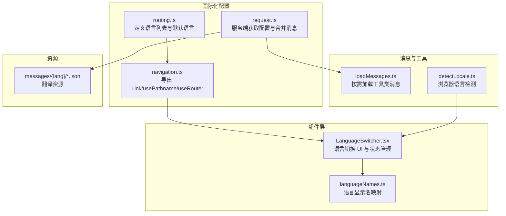
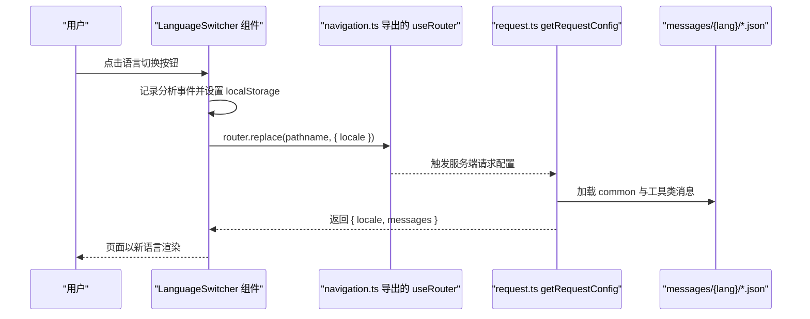
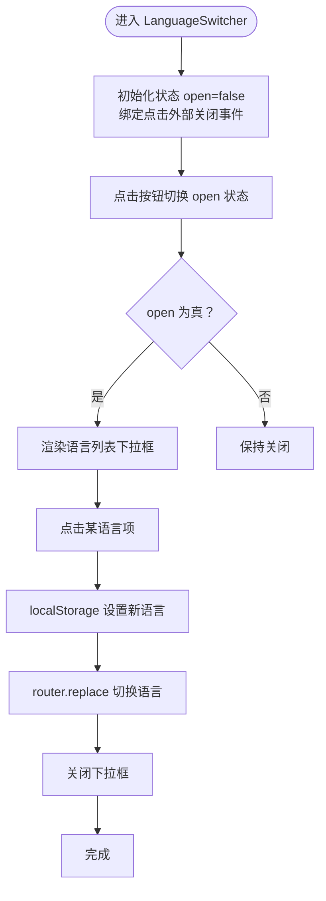
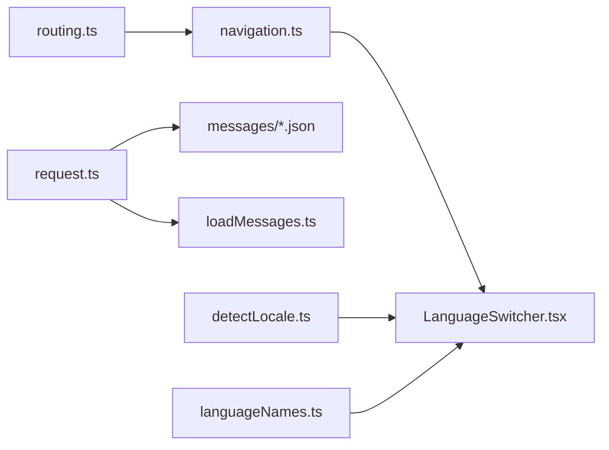

# 组件本地化

<cite>
**本文引用的文件**
- [LanguageSwitcher.tsx](file://src/components/shared/LanguageSwitcher.tsx)
- [navigation.ts](file://src/i18n/navigation.ts)
- [request.ts](file://src/i18n/request.ts)
- [routing.ts](file://src/i18n/routing.ts)
- [languageNames.ts](file://src/lib/i18n/languageNames.ts)
- [loadMessages.ts](file://src/lib/i18n/loadMessages.ts)
- [detectLocale.ts](file://src/lib/i18n/detectLocale.ts)
- [common.json（英语）](file://messages/en/common.json)
- [tools-audio.json（英语）](file://messages/en/tools-audio.json)
- [layout.tsx](file://src/app/layout.tsx)
</cite>

## 目录
1. [简介](#简介)
2. [项目结构](#项目结构)
3. [核心组件](#核心组件)
4. [架构总览](#架构总览)
5. [详细组件分析](#详细组件分析)
6. [依赖关系分析](#依赖关系分析)
7. [性能考量](#性能考量)
8. [故障排查指南](#故障排查指南)
9. [结论](#结论)
10. [附录](#附录)

## 简介
本文件面向 PrivaDeck 媒体工具箱的前端开发者与维护者，系统性说明组件本地化体系的设计与实现，重点覆盖以下方面：
- 在 React 组件中使用国际化功能，包括 useTranslations Hook 的使用方法与最佳实践
- 语言切换组件 LanguageSwitcher 的状态管理与用户交互设计
- 日期、时间、数字、货币的本地化格式化方法（基于 Intl API）
- 文本方向（LTR/RTL）的动态切换与 CSS 样式适配策略
- 多语言文本的可访问性考虑（屏幕阅读器支持、键盘导航）
- 复数形式、性别变化与上下文相关翻译的处理方式

PrivaDeck 使用 Next.js 国际化（next-intl）作为基础框架，并通过约定式消息目录与按需加载机制实现高效、可扩展的多语言支持。

## 项目结构
本地化相关代码主要分布在如下位置：
- 路由与导航：src/i18n/routing.ts、src/i18n/navigation.ts
- 服务端请求配置：src/i18n/request.ts
- 语言切换组件：src/components/shared/LanguageSwitcher.tsx
- 语言名称映射：src/lib/i18n/languageNames.ts
- 消息加载工具：src/lib/i18n/loadMessages.ts
- 浏览器语言检测：src/lib/i18n/detectLocale.ts
- 翻译资源：messages/{lang}/{category}.json
- 应用根布局元数据：src/app/layout.tsx

图表来源
- [routing.ts:1-18](file://src/i18n/routing.ts#L1-L18)
- [navigation.ts:1-6](file://src/i18n/navigation.ts#L1-L6)
- [request.ts:1-20](file://src/i18n/request.ts#L1-L20)
- [LanguageSwitcher.tsx:1-74](file://src/components/shared/LanguageSwitcher.tsx#L1-L74)
- [languageNames.ts:1-26](file://src/lib/i18n/languageNames.ts#L1-L26)
- [loadMessages.ts:1-56](file://src/lib/i18n/loadMessages.ts#L1-L56)
- [detectLocale.ts:1-57](file://src/lib/i18n/detectLocale.ts#L1-L57)

章节来源
- [routing.ts:1-18](file://src/i18n/routing.ts#L1-L18)
- [navigation.ts:1-6](file://src/i18n/navigation.ts#L1-L6)
- [request.ts:1-20](file://src/i18n/request.ts#L1-L20)
- [LanguageSwitcher.tsx:1-74](file://src/components/shared/LanguageSwitcher.tsx#L1-L74)
- [languageNames.ts:1-26](file://src/lib/i18n/languageNames.ts#L1-L26)
- [loadMessages.ts:1-56](file://src/lib/i18n/loadMessages.ts#L1-L56)
- [detectLocale.ts:1-57](file://src/lib/i18n/detectLocale.ts#L1-L57)

## 核心组件
- useTranslations Hook：用于在客户端组件中读取翻译键值，支持命名空间（如 common）。在 LanguageSwitcher 中通过 useTranslations("common") 获取“切换语言”等通用文案。
- useLocale/useRouter/usePathname：用于获取当前语言、路由跳转与路径操作，配合语言切换逻辑实现无刷新的语言变更。
- LanguageSwitcher 组件：提供下拉选择语言的 UI，包含点击外部关闭、键盘交互、高亮当前语言、记录事件与持久化选择等行为。
- 语言检测与存储：detectBrowserLocale 提供浏览器语言偏好匹配；switchLocale 将新语言写入 localStorage 并触发路由跳转。

章节来源
- [LanguageSwitcher.tsx:15-38](file://src/components/shared/LanguageSwitcher.tsx#L15-L38)
- [request.ts:6-19](file://src/i18n/request.ts#L6-L19)
- [routing.ts:10-17](file://src/i18n/routing.ts#L10-L17)
- [navigation.ts:4-5](file://src/i18n/navigation.ts#L4-L5)
- [detectLocale.ts:7-57](file://src/lib/i18n/detectLocale.ts#L7-L57)

## 架构总览
Next.js 国际化通过服务端请求配置（getRequestConfig）决定当前语言与合并后的消息对象；客户端通过 useTranslations 读取；语言切换通过 useRouter.replace 触发路由更新并持久化语言选择。

图表来源
- [LanguageSwitcher.tsx:33-38](file://src/components/shared/LanguageSwitcher.tsx#L33-L38)
- [navigation.ts:4-5](file://src/i18n/navigation.ts#L4-L5)
- [request.ts:6-19](file://src/i18n/request.ts#L6-L19)
- [loadMessages.ts:32-55](file://src/lib/i18n/loadMessages.ts#L32-L55)

## 详细组件分析

### useTranslations Hook 使用与最佳实践
- 命名空间：通过 useTranslations("common") 访问公共命名空间下的键值；在工具页面可使用 "tools.audio.trim" 等嵌套键。
- 键值结构：messages/en/common.json 定义了站点级文案，如“切换语言”、“下载”、“处理中”等；tools-audio.json 定义音频工具的专用文案。
- 动态参数：翻译键支持占位符（如 {percent}、{count}），在组件中传入对应参数即可替换。
- 性能建议：
  - 将高频使用的键拆分到独立模块或按需加载，避免一次性引入所有消息。
  - 对于页面级全量翻译，使用服务端合并 common 与工具类消息，减少客户端负担。

章节来源
- [LanguageSwitcher.tsx:17](file://src/components/shared/LanguageSwitcher.tsx#L17)
- [common.json:2-89](file://messages/en/common.json#L2-L89)
- [tools-audio.json:4-50](file://messages/en/tools-audio.json#L4-L50)

### LanguageSwitcher 组件：状态管理与交互设计
- 状态：内部维护 open 状态控制下拉菜单显隐；通过 useRef 获取容器节点，实现点击外部关闭。
- 事件与持久化：switchLocale 写入 localStorage 并调用 router.replace 更新语言；同时记录分析事件便于追踪。
- 无障碍：按钮设置 aria-label，确保屏幕阅读器可读；下拉项为按钮类型，支持键盘导航与回车激活。
- 样式：根据 dropdownDirection 切换上/下弹出方向；高亮当前语言并提供 hover 效果。

图表来源
- [LanguageSwitcher.tsx:20-38](file://src/components/shared/LanguageSwitcher.tsx#L20-L38)
- [LanguageSwitcher.tsx:40-72](file://src/components/shared/LanguageSwitcher.tsx#L40-L72)

章节来源
- [LanguageSwitcher.tsx:15-74](file://src/components/shared/LanguageSwitcher.tsx#L15-L74)
- [languageNames.ts:3-25](file://src/lib/i18n/languageNames.ts#L3-L25)

### 日期、时间、数字、货币的本地化格式化
- 数字与百分比：使用 Intl.NumberFormat 与 Intl.RelativeTimeFormat 实现本地化数字与相对时间显示；在通用文案中使用占位符进行替换。
- 货币：通过 Intl.NumberFormat 的 style: "currency" 选项实现货币格式化，自动应用目标语言的货币符号与分隔规则。
- 日期与时间：使用 Intl.DateTimeFormat 实现本地化日期时间展示，支持时区与格式选项定制。
- 工具函数建议：
  - 封装 formatNumber、formatCurrency、formatDate 等工具函数，集中处理语言环境与样式差异。
  - 对于大文件大小、进度百分比等场景，优先采用本地化字符串而非纯数字，提升可读性。

章节来源
- [common.json:8-89](file://messages/en/common.json#L8-L89)

### 文本方向（LTR/RTL）的动态切换与 CSS 适配
- 路由配置：routing.ts 中定义 rtlLocales，当前包含阿拉伯语（ar）。
- 切换策略：
  - 在根布局或文档根元素上根据当前语言设置 dir="rtl" 或 dir="ltr"。
  - 配合 CSS 变量或条件样式，对边距、对齐、图标方向等进行统一适配。
  - 表单与输入框需注意输入方向与光标行为，必要时添加 dir 属性与样式覆盖。
- 最佳实践：
  - 使用 CSS 自定义属性统一管理方向相关样式，避免硬编码。
  - 图标与装饰元素需区分左右，提供镜像版本或使用 transform 实现翻转。

章节来源
- [routing.ts:12](file://src/i18n/routing.ts#L12)

### 多语言文本的可访问性考虑
- 屏幕阅读器：为交互元素设置清晰的 aria-label（如“切换语言”），确保非视觉用户理解控件功能。
- 键盘导航：下拉菜单应支持 Tab/Shift+Tab 切换、Esc 关闭、方向键移动、Enter/Space 激活。
- 语义化标签：使用语义化 HTML 结构，如按钮、列表与分组，辅助读屏软件识别内容层次。
- 动态文案：当语言切换导致文案长度变化时，确保布局不会截断文本，提供足够的内边距与弹性布局。

章节来源
- [LanguageSwitcher.tsx:46](file://src/components/shared/LanguageSwitcher.tsx#L46)

### 处理复数形式、性别变化与上下文相关翻译
- 复数形式：通过占位符与本地化规则实现单复数切换（如“Saved {percent}%”中的百分比文案）；复杂复数规则可借助第三方库（如 formatjs）。
- 性别变化：在文案中使用占位符承载性别变量，结合上下文选择合适称谓或动词形态。
- 上下文相关翻译：将同一词汇在不同场景下的含义区分开来（如“process”在“Processing...”与“Process”按钮中的不同语义），通过命名空间或键名后缀区分。
- 工具类消息：使用 loadMessages.loadCategoryMessages 与 loadAllToolMessages 合并工具类翻译，避免键冲突并保证命名空间清晰。

章节来源
- [loadMessages.ts:8-55](file://src/lib/i18n/loadMessages.ts#L8-L55)
- [common.json:50-89](file://messages/en/common.json#L50-L89)

## 依赖关系分析
- 路由与导航：routing.ts 定义语言集合与默认语言；navigation.ts 基于 routing 创建 Link/usePathname/useRouter；LanguageSwitcher 依赖 useRouter/usePathname/useLocale。
- 服务端配置：request.ts 基于 hasLocale 与 routing.defaultLocale 决定语言，并合并 common 与工具类消息。
- 语言检测：detectLocale 从浏览器语言首选项推断最佳匹配语言，用于引导语言选择与横幅提示。
- 语言名称：languageNames 提供各语言的本地化显示名，用于语言切换下拉列表。

图表来源
- [routing.ts:14-17](file://src/i18n/routing.ts#L14-L17)
- [navigation.ts:4-5](file://src/i18n/navigation.ts#L4-L5)
- [LanguageSwitcher.tsx:16-19](file://src/components/shared/LanguageSwitcher.tsx#L16-L19)
- [request.ts:8-18](file://src/i18n/request.ts#L8-L18)
- [loadMessages.ts:32-55](file://src/lib/i18n/loadMessages.ts#L32-L55)
- [detectLocale.ts:7-57](file://src/lib/i18n/detectLocale.ts#L7-L57)
- [languageNames.ts:3-25](file://src/lib/i18n/languageNames.ts#L3-L25)

章节来源
- [routing.ts:1-18](file://src/i18n/routing.ts#L1-L18)
- [navigation.ts:1-6](file://src/i18n/navigation.ts#L1-L6)
- [request.ts:1-20](file://src/i18n/request.ts#L1-L20)
- [LanguageSwitcher.tsx:1-74](file://src/components/shared/LanguageSwitcher.tsx#L1-L74)
- [languageNames.ts:1-26](file://src/lib/i18n/languageNames.ts#L1-L26)
- [loadMessages.ts:1-56](file://src/lib/i18n/loadMessages.ts#L1-L56)
- [detectLocale.ts:1-57](file://src/lib/i18n/detectLocale.ts#L1-L57)

## 性能考量
- 按需加载：通过 loadAllToolMessages 与 loadCategoryMessages 实现工具类消息的并行加载与合并，避免一次性加载全部工具消息。
- 缓存策略：利用浏览器缓存与 CDN 加速 messages 目录下的 JSON 文件；服务端已合并 common 与工具类消息，减少客户端重复请求。
- 渲染优化：在 LanguageSwitcher 中仅渲染可见语言列表，避免超长列表导致的重排；使用 CSS 动画与最小化 DOM 更新。
- 体积控制：合理拆分 common 与工具类消息，避免单文件过大；对不常用语言的消息延迟加载。

章节来源
- [loadMessages.ts:32-55](file://src/lib/i18n/loadMessages.ts#L32-L55)
- [request.ts:12-18](file://src/i18n/request.ts#L12-L18)

## 故障排查指南
- 语言未生效：
  - 检查路由配置是否包含目标语言；确认 useLocale 返回值与预期一致。
  - 确认 localStorage 中的 locale 是否被正确写入与读取。
- 切换后页面未更新：
  - 确保调用 router.replace 并传入 { locale } 参数。
  - 检查服务端 getRequestConfig 是否返回正确的 messages。
- 下拉菜单无法关闭：
  - 确认点击外部关闭事件绑定正常，且 ref.current 存在。
- RTL 样式异常：
  - 检查根元素 dir 属性是否随语言切换更新；确认 CSS 方向相关样式是否覆盖到位。

章节来源
- [LanguageSwitcher.tsx:23-38](file://src/components/shared/LanguageSwitcher.tsx#L23-L38)
- [request.ts:6-19](file://src/i18n/request.ts#L6-L19)
- [routing.ts:12](file://src/i18n/routing.ts#L12)

## 结论
PrivaDeck 的本地化体系以 next-intl 为核心，结合约定式消息目录与按需加载策略，在保证性能的同时提供了良好的可扩展性与可维护性。通过 LanguageSwitcher 的状态管理与交互设计、服务端消息合并以及浏览器语言检测，实现了从语言选择到页面渲染的完整闭环。建议在后续迭代中进一步完善复数与性别处理、RTL 样式覆盖与无障碍细节，持续提升用户体验与可访问性。

## 附录
- 应用元数据与 PWA 配置位于根布局文件，有助于在多语言环境下提供一致的安装与展示体验。

章节来源
- [layout.tsx:10-39](file://src/app/layout.tsx#L10-L39)