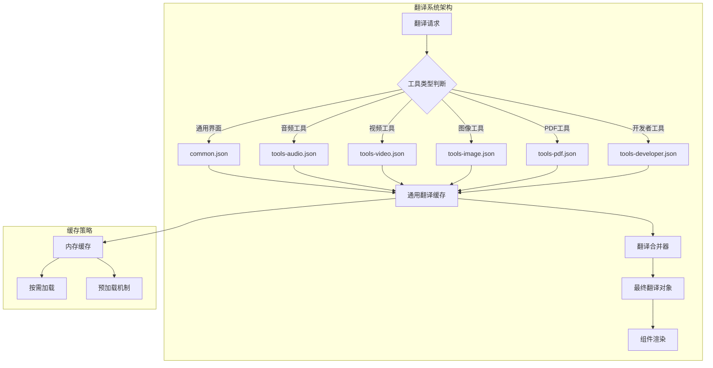
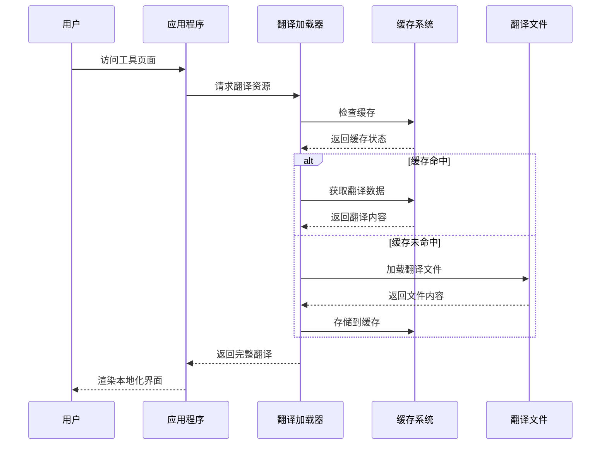
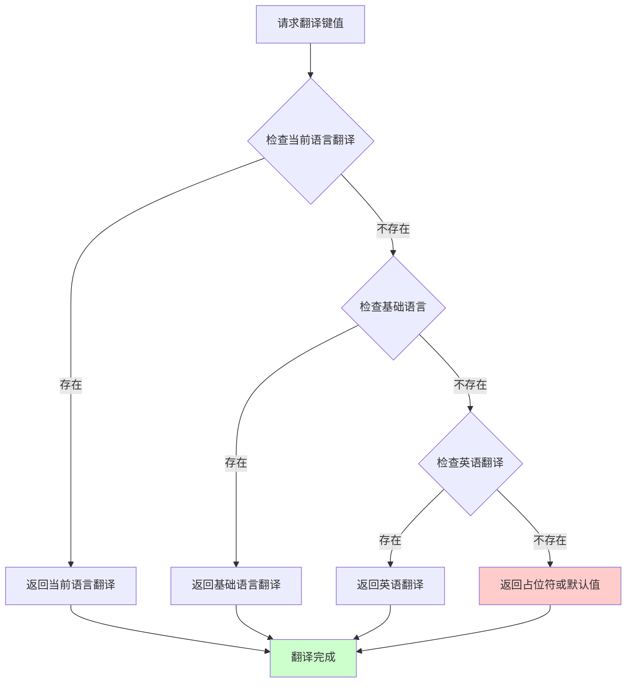
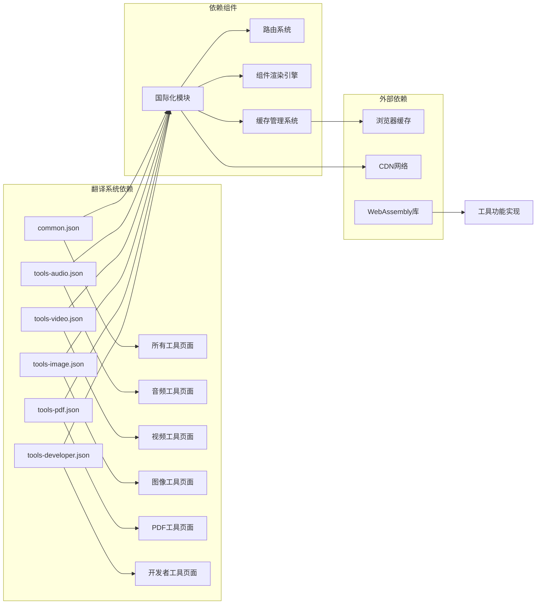

# 翻译资源配置

<cite>
**本文档引用的文件**
- [messages/en/common.json](file://messages/en/common.json)
- [messages/en/tools-audio.json](file://messages/en/tools-audio.json)
- [messages/en/tools-video.json](file://messages/en/tools-video.json)
- [messages/en/tools-image.json](file://messages/en/tools-image.json)
- [messages/en/tools-pdf.json](file://messages/en/tools-pdf.json)
- [messages/en/tools-developer.json](file://messages/en/tools-developer.json)
</cite>

## 目录
1. [简介](#简介)
2. [项目结构](#项目结构)
3. [核心组件](#核心组件)
4. [架构概览](#架构概览)
5. [详细组件分析](#详细组件分析)
6. [依赖关系分析](#依赖关系分析)
7. [性能考虑](#性能考虑)
8. [故障排除指南](#故障排除指南)
9. [结论](#结论)

## 简介

PrivaDeck 媒体工具箱采用了一套精心设计的翻译资源配置系统，为 58+ 种工具提供了完整的多语言支持。该系统通过将翻译资源分为通用翻译和工具特定翻译两大类，实现了翻译内容的模块化管理和高效维护。

翻译资源配置系统的核心特点包括：
- **分离式架构**：common.json 存放通用界面元素，tools-{category}.json 存放工具特定内容
- **层次化命名约定**：清晰的键值层级结构，便于维护和扩展
- **按需加载机制**：根据用户访问的工具类型动态加载相应的翻译资源
- **回退机制**：当特定翻译缺失时自动回退到通用翻译
- **本地化优先**：所有翻译数据完全在客户端处理，确保用户隐私

## 项目结构

翻译资源配置系统采用按语言分层的目录结构，每个语言目录包含通用翻译和工具特定翻译文件：

```mermaid
graph TB
subgraph "翻译资源配置结构"
A[messages/] --> B[语言目录<br/>ar/de/en/es/fr/hi/id/it/ja/ko/nl/pl/pt-BR/pt-PT/ru/th/tr/uk/vi/zh-Hans/zh-Hant]
B --> C[common.json<br/>通用界面翻译]
B --> D[tools-audio.json<br/>音频工具翻译]
B --> E[tools-video.json<br/>视频工具翻译]
B --> F[tools-image.json<br/>图像工具翻译]
B --> G[tools-pdf.json<br/>PDF工具翻译]
B --> H[tools-developer.json<br/>开发者工具翻译]
end
subgraph "翻译文件类型"
I[通用翻译<br/>common.json]
J[工具翻译<br/>tools-{category}.json]
end
C --> I
D --> J
E --> J
F --> J
G --> J
H --> J
```

**图表来源**
- [messages/en/common.json:1-508](file://messages/en/common.json#L1-L508)
- [messages/en/tools-audio.json:1-191](file://messages/en/tools-audio.json#L1-L191)

**章节来源**
- [messages/en/common.json:1-508](file://messages/en/common.json#L1-L508)
- [messages/en/tools-audio.json:1-191](file://messages/en/tools-audio.json#L1-L191)

## 核心组件

### 通用翻译系统 (common.json)

通用翻译系统负责管理网站的基础界面元素和全局功能，包含以下主要类别：

#### 导航和页面元素
- **站点基本信息**：站点名称、描述、隐私声明等
- **导航菜单**：主导航项、工具分类链接
- **页面标题**：各页面的 SEO 元数据
- **通用按钮**：下载、保存、复制、清除等操作按钮

#### 功能特性描述
- **工具介绍**：各类工具的功能概述和使用场景
- **隐私保护**：详细的隐私政策和安全保证
- **技术说明**：浏览器处理、离线功能等技术特性

#### 错误消息和提示
- **文件处理**：文件大小限制、格式支持等提示
- **浏览器兼容性**：WebAssembly 加载、HEVC 支持等说明
- **安装提示**：PWA 安装、离线使用等引导信息

**章节来源**
- [messages/en/common.json:1-508](file://messages/en/common.json#L1-L508)

### 工具特定翻译系统

工具特定翻译系统针对不同工具类别提供专门的翻译内容，目前支持五个主要类别：

#### 音频工具翻译 (tools-audio.json)
涵盖音频编辑和转换工具，包括：
- **音频修剪**：精确的时间设置、质量保持等
- **音频转换**：格式支持、质量选择、批量处理
- **音频提取**：从视频中提取音频、输出格式选择
- **音量调节**：音量控制、预览功能、应用效果

#### 视频工具翻译 (tools-video.json)
覆盖视频编辑和处理工具，包括：
- **视频静音**：无音频处理、质量保持
- **视频修剪**：精确时间控制、流复制模式
- **视频旋转**：角度选择、质量输出
- **格式转换**：多种格式支持、编码设置
- **视频压缩**：质量级别、编码速度、分辨率控制

#### 图像工具翻译 (tools-image.json)
提供丰富的图像处理工具翻译：
- **格式转换**：WebP、PNG、JPG、AVIF、ICO 支持
- **图像压缩**：智能压缩、EXIF 控制、自定义尺寸
- **图像裁剪**：精确裁剪、自由裁剪、预设比例
- **图像调整**：缩放、水印、边框、滤镜效果

#### PDF 工具翻译 (tools-pdf.json)
完整的 PDF 处理工具集：
- **PDF 合并**：多文件合并、拖拽排序
- **PDF 分割**：单页分割、范围分割、批量处理
- **页面删除**：可视化页面选择、批量删除
- **PDF 转换**：图像转换、格式选择、质量控制

#### 开发者工具翻译 (tools-developer.json)
面向开发者的专业工具：
- **数据格式转换**：JSON、CSV、XML、YAML 转换
- **文本处理**：正则表达式、文本差异、大小写转换
- **编码工具**：Base64 编码解码、哈希生成
- **颜色工具**：颜色格式转换、实时预览

**章节来源**
- [messages/en/tools-video.json:1-540](file://messages/en/tools-video.json#L1-L540)
- [messages/en/tools-image.json:1-822](file://messages/en/tools-image.json#L1-L822)
- [messages/en/tools-pdf.json:1-681](file://messages/en/tools-pdf.json#L1-L681)
- [messages/en/tools-developer.json:1-809](file://messages/en/tools-developer.json#L1-L809)

## 架构概览

翻译资源配置系统采用模块化的架构设计，实现了通用性和专用性的平衡：



**图表来源**
- [messages/en/common.json:1-508](file://messages/en/common.json#L1-L508)
- [messages/en/tools-audio.json:1-191](file://messages/en/tools-audio.json#L1-L191)

### 翻译键值命名约定

系统采用严格的命名约定确保翻译键值的一致性和可维护性：

#### 层级结构规范
- **通用翻译**：`common.{section}.{key}` - 用于全局界面元素
- **工具翻译**：`tools.{category}.{tool}.{key}` - 用于具体工具功能
- **SEO 内容**：`tools.{category}.{tool}.seoContent.{section}` - 用于搜索引擎优化内容

#### 键值命名规则
- **小驼峰命名法**：如 `metaTitle`、`outputFormat`
- **语义化描述**：如 `uploadFiles`、`maxFileSize`、`unsupportedVideoCodec`
- **上下文标识**：如 `faq.q1`、`faq.a1` 表示问题和答案对

#### 分类组织原则
- **功能分类**：按钮文本、输入标签、操作说明
- **状态分类**：成功、失败、警告、信息提示
- **SEO 分类**：页面标题、描述、关键词、元数据
- **帮助分类**：FAQ、使用说明、隐私声明

**章节来源**
- [messages/en/common.json:1-508](file://messages/en/common.json#L1-L508)
- [messages/en/tools-audio.json:1-191](file://messages/en/tools-audio.json#L1-L191)

## 详细组件分析

### 翻译加载机制

翻译系统采用智能的加载策略，结合按需加载和预加载机制：



**图表来源**
- [messages/en/common.json:1-508](file://messages/en/common.json#L1-L508)
- [messages/en/tools-video.json:1-540](file://messages/en/tools-video.json#L1-L540)

### 翻译回退机制

系统实现了多层次的翻译回退机制，确保即使部分翻译缺失也能正常显示：



**图表来源**
- [messages/en/common.json:1-508](file://messages/en/common.json#L1-L508)
- [messages/en/tools-image.json:1-822](file://messages/en/tools-image.json#L1-L822)

### 翻译缓存策略

系统采用多层缓存策略优化性能和用户体验：

#### 内存缓存
- **即时访问**：已加载的翻译内容存储在内存中
- **快速检索**：避免重复的文件读取操作
- **生命周期管理**：根据用户会话和页面访问情况管理缓存

#### 文件缓存
- **持久化存储**：浏览器缓存机制自动处理
- **CDN 优化**：静态翻译文件适合 CDN 缓存
- **版本控制**：通过文件名版本号实现缓存失效

#### 预加载机制
- **路由预加载**：基于用户可能访问的工具类型预加载翻译
- **懒加载策略**：仅在实际需要时才加载特定工具的翻译
- **智能预测**：根据用户行为和工具使用频率优化加载顺序

**章节来源**
- [messages/en/tools-pdf.json:1-681](file://messages/en/tools-pdf.json#L1-L681)
- [messages/en/tools-developer.json:1-809](file://messages/en/tools-developer.json#L1-L809)

## 依赖关系分析

翻译资源配置系统与其他组件的依赖关系：



**图表来源**
- [messages/en/common.json:1-508](file://messages/en/common.json#L1-L508)
- [messages/en/tools-audio.json:1-191](file://messages/en/tools-audio.json#L1-L191)

### 组件耦合度分析

翻译系统与应用程序其他部分的耦合度设计：

- **低耦合设计**：翻译文件独立于业务逻辑代码
- **接口抽象**：通过统一的翻译接口访问所有翻译内容
- **模块化结构**：每个翻译文件都是独立的模块
- **向后兼容**：新增翻译键值不影响现有功能

**章节来源**
- [messages/en/tools-video.json:1-540](file://messages/en/tools-video.json#L1-L540)
- [messages/en/tools-image.json:1-822](file://messages/en/tools-image.json#L1-L822)

## 性能考虑

### 加载性能优化

翻译系统的性能优化策略：

#### 文件大小优化
- **按需加载**：只加载用户实际访问的工具翻译
- **压缩传输**：JSON 文件经过压缩减少带宽占用
- **缓存利用**：充分利用浏览器缓存机制

#### 内存使用优化
- **增量加载**：翻译内容按需解析和存储
- **垃圾回收**：及时清理不再使用的翻译缓存
- **内存监控**：监控翻译系统的内存使用情况

#### 并发处理
- **异步加载**：翻译文件异步加载不阻塞页面渲染
- **并发控制**：限制同时加载的翻译文件数量
- **优先级调度**：根据用户交互优先加载重要翻译

### 用户体验优化

#### 响应速度
- **预加载策略**：基于用户行为预测预加载可能访问的翻译
- **渐进式显示**：翻译加载完成后逐步显示对应内容
- **错误处理**：翻译加载失败时提供降级显示方案

#### 本地化体验
- **即时切换**：语言切换时快速应用新的翻译
- **一致性保证**：确保同一页面内翻译的一致性
- **无障碍支持**：支持屏幕阅读器和其他辅助技术

## 故障排除指南

### 常见翻译问题

#### 翻译缺失问题
**症状**：某些文本显示为键值而非翻译内容
**解决方案**：
1. 检查翻译文件中是否存在对应的键值
2. 验证 JSON 语法是否正确
3. 确认键值拼写是否准确
4. 检查是否有编码问题

#### 语言切换问题
**症状**：切换语言后部分文本未更新
**解决方案**：
1. 清除浏览器缓存重新加载
2. 检查路由系统是否正确处理语言参数
3. 验证翻译缓存是否正确更新
4. 确认组件是否正确响应语言变化

#### 性能问题
**症状**：页面加载缓慢或翻译切换卡顿
**解决方案**：
1. 检查翻译文件大小和数量
2. 优化翻译文件的加载顺序
3. 实施更有效的缓存策略
4. 减少不必要的翻译键值

### 维护最佳实践

#### 翻译一致性检查
- **键值标准化**：建立统一的键值命名规范
- **术语统一**：确保相同概念在不同工具中的翻译一致
- **上下文验证**：检查翻译在不同上下文中的适用性
- **文化适应性**：考虑目标语言的文化背景和表达习惯

#### 版本管理策略
- **版本控制**：使用 Git 追踪翻译文件的变更历史
- **分支管理**：为重大翻译更新创建独立的分支
- **回滚机制**：建立快速回滚到稳定翻译版本的能力
- **测试流程**：在生产环境部署前进行充分的翻译测试

#### 新工具翻译添加流程
1. **需求分析**：确定新工具需要的翻译键值
2. **模板创建**：参考现有工具的翻译结构创建模板
3. **翻译编写**：编写目标语言的翻译内容
4. **本地测试**：在本地环境中测试翻译效果
5. **代码集成**：将翻译文件集成到代码库
6. **部署验证**：在生产环境中验证翻译功能

**章节来源**
- [messages/en/common.json:1-508](file://messages/en/common.json#L1-L508)
- [messages/en/tools-audio.json:1-191](file://messages/en/tools-audio.json#L1-L191)

## 结论

PrivaDeck 媒体工具箱的翻译资源配置系统展现了现代前端国际化解决方案的最佳实践。通过将通用翻译和工具特定翻译分离、建立严格的命名约定、实施智能的加载和缓存策略，系统实现了高可维护性、高性能和良好的用户体验。

系统的主要优势包括：
- **模块化设计**：清晰的文件结构便于维护和扩展
- **智能加载**：按需加载机制优化了性能表现
- **回退机制**：多层次的回退确保了系统的稳定性
- **一致性保障**：严格的命名约定和检查流程保证了翻译质量

随着 PrivaDeck 工具集的持续扩展，这套翻译资源配置系统将继续发挥重要作用，为用户提供优质的多语言使用体验。建议在未来进一步完善自动化测试和质量检查机制，以应对更大规模的翻译维护需求。